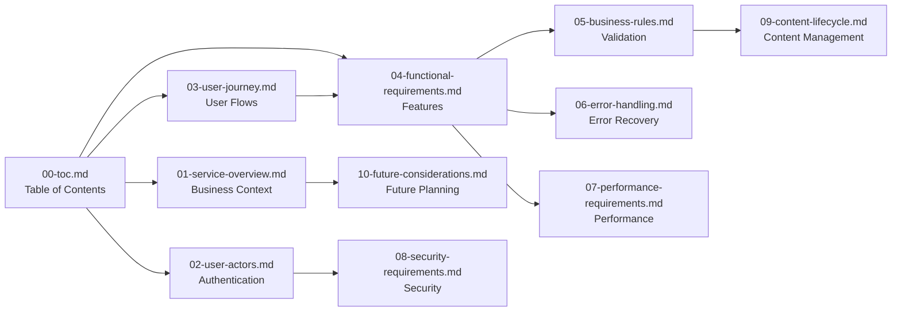

# Table of Contents - Economic/Political Discussion Board

## Project Overview

This documentation set provides complete requirements for building a simple economic and political discussion board platform. The system enables users to engage in meaningful discussions about economic and political topics while supporting image and file attachments. The platform maintains a straightforward, minimal design focused on core discussion functionality without unnecessary complexity.

### Core Platform Philosophy
The discussion board prioritizes quality discourse over engagement metrics, creating an environment conducive to substantive conversations about complex topics. Unlike general social media platforms that often prioritize viral content, this platform emphasizes evidence-based arguments, respectful debate, and knowledge sharing among users genuinely interested in economic and political subjects.

### Business Value Proposition
The platform addresses a specific market gap by providing a dedicated space for serious economic/political discourse that combines the accessibility of social media with the substance of academic platforms. Users benefit from specialized moderation, robust attachment support for research materials, and a community focused on these specific subject areas.

## Documentation Structure

The project documentation is organized into 11 comprehensive documents that cover all aspects of the discussion board requirements:

### Core Documentation
- **[Service Overview Document](./01-service-overview.md)** - Defines the business purpose, target audience, and value proposition for the discussion board platform
- **[User Actors and Authentication Guide](./02-user-actors.md)** - Documents all user roles, authentication requirements, and permission matrices

### User Experience Documentation
- **[User Journey Documentation](./03-user-journey.md)** - Describes complete user flows from registration to content creation and engagement
- **[Functional Requirements Specification](./04-functional-requirements.md)** - Defines all system features and functionality using EARS format

### Business Logic Documentation
- **[Business Rules and Validation Guide](./05-business-rules.md)** - Documents content validation, user behavior guidelines, and moderation policies
- **[Error Handling and Recovery Procedures](./06-error-handling.md)** - Defines user-facing error scenarios and recovery workflows

### Technical Requirements Documentation
- **[Performance Requirements Specification](./07-performance-requirements.md)** - Defines response time expectations and scalability targets
- **[Security Requirements Guide](./08-security-requirements.md)** - Documents authentication security and data protection requirements

### Content Management Documentation
- **[Content Lifecycle Management](./09-content-lifecycle.md)** - Defines content creation, moderation, archival, and deletion procedures
- **[Future Considerations and Enhancements](./10-future-considerations.md)** - Outlines potential future features and scalability opportunities

## Navigation Guide

### For Backend Developers
Start with these documents to understand implementation requirements:
1. **[Functional Requirements Specification](./04-functional-requirements.md)** - Core feature specifications including post creation, commenting, and attachment handling
2. **[User Actors and Authentication Guide](./02-user-actors.md)** - User management, authentication flows, and security implementation
3. **[Business Rules and Validation Guide](./05-business-rules.md)** - Content validation logic and moderation workflows

### For Product Managers
Focus on user experience and business requirements:
1. **[Service Overview Document](./01-service-overview.md)** - Business context, target audience analysis, and success metrics
2. **[User Journey Documentation](./03-user-journey.md)** - Complete user interaction flows from discovery through active participation
3. **[Content Lifecycle Management](./09-content-lifecycle.md)** - Content management processes and moderation escalation procedures

### For Business Stakeholders
Review strategic documents for project understanding:
1. **[Service Overview Document](./01-service-overview.md)** - Business model, competitive positioning, and value proposition
2. **[Future Considerations and Enhancements](./10-future-considerations.md)** - Growth opportunities and strategic roadmap

## Document Relationships

## Quick Reference by Topic

### Authentication & Security
- User registration and login: **[User Actors Guide](./02-user-actors.md)**
- Security requirements: **[Security Requirements](./08-security-requirements.md)**
- Permission management: **[User Actors Guide](./02-user-actors.md)**
- Session management and token handling: **[User Actors Guide](./02-user-actors.md)**

### Content Management
- Post creation and editing: **[Functional Requirements](./04-functional-requirements.md)**
- Attachment handling: **[Functional Requirements](./04-functional-requirements.md)**
- Content validation: **[Business Rules](./05-business-rules.md)**
- Moderation workflows: **[Content Lifecycle](./09-content-lifecycle.md)**
- Content archival and deletion: **[Content Lifecycle](./09-content-lifecycle.md)**

### User Experience
- Registration process: **[User Journey](./03-user-journey.md)**
- Discussion flows: **[User Journey](./03-user-journey.md)**
- Error handling: **[Error Handling Guide](./06-error-handling.md)**
- Performance expectations: **[Performance Requirements](./07-performance-requirements.md)**

### Technical Specifications
- Performance targets: **[Performance Requirements](./07-performance-requirements.md)**
- Security implementation: **[Security Requirements](./08-security-requirements.md)**
- System architecture: Distributed across functional documents
- Business requirements in natural language: **[Functional Requirements](./04-functional-requirements.md)**

## Document Update History

This table of contents will be maintained as the primary navigation tool throughout the project lifecycle. All new documents will be added here with appropriate descriptions and relationships.

| Document | Version | Last Updated | Primary Audience | Key Focus Areas |
|----------|---------|--------------|------------------|----------------|
| 00-toc.md | 1.0 | 2025-11-18 | All Stakeholders | Navigation structure, document relationships |
| 01-service-overview.md | 1.0 | 2025-11-18 | Business Stakeholders | Business model, target audience, value proposition |
| 02-user-actors.md | 1.0 | 2025-11-18 | Development Team | Authentication, user roles, permission matrices |
| 03-user-journey.md | 1.0 | 2025-11-18 | Product Managers | User flows, interaction patterns, error scenarios |
| 04-functional-requirements.md | 1.0 | 2025-11-18 | Development Team | Feature specifications, EARS requirements |
| 05-business-rules.md | 1.0 | 2025-11-18 | Development Team | Content validation, moderation policies, community guidelines |
| 06-error-handling.md | 1.0 | 2025-11-18 | Development Team | Error scenarios, recovery workflows, user messaging |
| 07-performance-requirements.md | 1.0 | 2025-11-18 | Development Team | Response times, scalability, performance targets |
| 08-security-requirements.md | 1.0 | 2025-11-18 | Development Team | Authentication security, data protection, attachment security |
| 09-content-lifecycle.md | 1.0 | 2025-11-18 | Development Team | Content states, moderation workflows, archival policies |
| 10-future-considerations.md | 1.0 | 2025-11-18 | Business Stakeholders | Growth opportunities, feature roadmap, scalability planning |

## Implementation Guidelines

### For Development Teams
WHEN implementing the discussion board platform, THE development team SHALL reference the complete documentation set to ensure all business requirements are met.

WHERE technical decisions are required, THE team SHALL prioritize the simple, minimal design philosophy outlined in the service overview.

### For Quality Assurance
WHEN testing the platform, THE QA team SHALL verify that all functional requirements from the specification documents are properly implemented.

WHERE performance testing is conducted, THE team SHALL use the targets defined in the performance requirements document as success criteria.

### For Project Management
WHEN planning development iterations, THE project manager SHALL ensure that all core functionality from the requirements documents is prioritized.

WHERE scope changes are considered, THE manager SHALL evaluate impact against the documented business requirements.

## Cross-Document Dependencies

### Critical Dependencies
- **Authentication System**: Requires coordination between User Actors, Security Requirements, and User Journey documents
- **Content Moderation**: Integrates requirements from Business Rules, Content Lifecycle, and Functional Requirements
- **Attachment Handling**: Spans Functional Requirements, Security Requirements, and Performance Requirements

### Implementation Sequencing
1. **Foundation Phase**: Implement core authentication and user management based on User Actors documentation
2. **Content Phase**: Build post and comment functionality following Functional Requirements
3. **Moderation Phase**: Add content moderation features using Business Rules and Content Lifecycle guidelines
4. **Optimization Phase**: Enhance performance and security based on Performance and Security Requirements

## Quality Assurance Checklist

### Documentation Completeness
- [ ] All 11 documents are properly referenced and described
- [ ] Navigation structure supports all stakeholder types
- [ ] Quick reference sections cover all major functional areas
- [ ] Document relationships are clearly documented
- [ ] Update history is maintained for version tracking

### Business Requirements Coverage
- [ ] Simple discussion board functionality is fully specified
- [ ] Image and file attachment requirements are documented
- [ ] Authentication and user management workflows are defined
- [ ] Content moderation processes are specified
- [ ] Performance and security expectations are established

> *Developer Note: This document defines **business requirements only**. All technical implementations (architecture, APIs, database design, etc.) are at the discretion of the development team.*