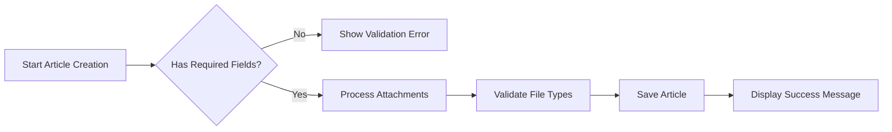

# Economic/Political Discussion Board - Requirements Analysis Report

## Executive Summary

The Economic/Political Discussion Board is a specialized online platform designed to facilitate meaningful discourse on economic and political topics. This service addresses the growing need for structured, moderated discussions in these critical domains, providing users with a professional environment to share insights, debate ideas, and build knowledge communities.

### Business Justification

**Market Need Analysis**: There is a significant gap in the market for dedicated discussion platforms that balance free expression with responsible moderation. Existing social media platforms often lack the specialized moderation and topic organization required for substantive economic and political discussions.

**Target Audience**: The service targets politically and economically engaged individuals including academics, professionals, policymakers, journalists, and informed citizens seeking substantive discourse beyond mainstream social media.

**Competitive Differentiation**: Unlike general discussion platforms, this service offers:
- Specialized topic categorization
- Professional moderation system
- Structured content organization
- Academic-grade discussion quality

### Core Value Proposition

THE discussion board SHALL provide a moderated environment for high-quality economic and political discourse.
THE system SHALL enable users to create, share, and discuss content while maintaining respectful community standards.
THE platform SHALL balance free expression with responsible content moderation.

## User Actors and Authentication System

### User Actor Definitions

#### Regular User
- **Description**: Authenticated users who can participate in discussions
- **Capabilities**: Create articles, write comments, manage profile, browse content
- **Authentication**: Email/password based authentication

#### Administrator
- **Description**: Moderators with content management privileges
- **Capabilities**: All regular user capabilities plus section management, content moderation, user banning
- **Promotion**: Requires approval from super administrators

#### Super Administrator
- **Description**: Highest privilege level with system-wide control
- **Capabilities**: All administrator capabilities plus administrator promotion/demotion, system configuration
- **Limitations**: Cannot demote themselves

### Authentication Requirements

#### User Registration
WHEN a new user attempts to register, THE system SHALL validate email format and password strength.
WHEN registration is successful, THE system SHALL send email verification.
WHEN email verification is completed, THE system SHALL activate the user account.

#### User Login
WHEN a user attempts to login, THE system SHALL validate credentials against stored records.
IF credentials are invalid, THEN THE system SHALL return authentication error.
WHILE a user is logged in, THE system SHALL maintain secure session state.

#### Password Management
WHEN a user requests password change, THE system SHALL validate current password.
WHEN password change is successful, THE system SHALL invalidate all existing sessions.
WHEN a user requests account deletion, THE system SHALL permanently remove all user data.

### Permission Matrix

| Action | Regular User | Administrator | Super Administrator |
|--------|--------------|---------------|---------------------|
| Create Account | ✅ | ✅ | ✅ |
| Login | ✅ | ✅ | ✅ |
| Create Article | ✅ | ✅ | ✅ |
| Edit Own Article | ✅ | ✅ | ✅ |
| Delete Own Article | ✅ | ✅ | ✅ |
| Create Comment | ✅ | ✅ | ✅ |
| Edit Own Comment | ✅ | ✅ | ✅ |
| Delete Own Comment | ✅ | ✅ | ✅ |
| Create Section | ❌ | ✅ | ✅ |
| Edit Section | ❌ | ✅ | ✅ |
| Delete Section | ❌ | ✅ | ✅ |
| Delete Any Article | ❌ | ✅ | ✅ |
| Delete Any Comment | ❌ | ✅ | ✅ |
| Ban Users | ❌ | ✅ | ✅ |
| Promote Administrators | ❌ | ❌ | ✅ |
| Demote Administrators | ❌ | ❌ | ✅ |

## Core Functional Requirements

### User Profile Management

#### Profile Structure
THE user profile SHALL contain display name and biography text.
THE system SHALL display user's articles and comments on their public profile.

#### Profile Operations
WHEN a user edits their profile, THE system SHALL validate display name length and bio content.
WHEN viewing another user's profile, THE system SHALL display their public activity history.

### Section Management

#### Section Creation
WHEN an administrator creates a section, THE system SHALL require name and description.
THE system SHALL prevent duplicate section names.

#### Section Browsing
WHEN users browse sections, THE system SHALL display section name and description.
WHEN users select a section, THE system SHALL display articles within that section.

### Article Management System

#### Article Creation
WHEN a user creates an article, THE system SHALL require title, content, and section selection.
THE user SHALL be able to attach multiple files and images to articles.
THE user SHALL be able to add free-text tags to articles.

#### Article Content Requirements

#### Article Editing and Deletion
WHEN a user edits their article, THE system SHALL allow modification of title, content, attachments, and tags.
WHEN a user deletes their article, THE system SHALL remove the article and all associated comments.

### Article Browsing and Search

#### Article List Display
THE article list SHALL display title, author, tags, comment count, and timestamp.
THE system SHALL not display full article content in list view.

#### Pagination and Sorting
THE system SHALL paginate article lists with configurable page sizes.
USERS SHALL be able to sort articles by newest first or oldest first.

#### Search Functionality
WHEN users search for articles, THE system SHALL search title and content fields.
USERS SHALL be able to filter search results by tags.
THE system SHALL paginate search results.

### Comment System

#### Comment Creation
WHEN a user comments on an article, THE system SHALL require comment content.
COMMENTS SHALL be single-level only with no nested replies.

#### Comment Display
THE system SHALL display comments sorted by oldest first.
EACH comment SHALL show author, content, and timestamp.

#### Comment Management
USERS SHALL be able to edit their own comments.
USERS SHALL be able to delete their own comments.

## Administrator and Moderation System

### Administrator Promotion Process

#### Promotion Request
WHEN a user requests administrator status, THE system SHALL require a reason text.
THE system SHALL record the request timestamp and user information.

#### Request Approval
WHEN a super administrator reviews promotion requests, THE system SHALL display pending requests.
SUPER administrators SHALL be able to approve or reject promotion requests.
WHEN approved, THE user SHALL become a regular administrator.

### Administrator Hierarchy

#### Grade Management
SUPER administrators SHALL be able to promote regular administrators to super administrator.
SUPER administrators SHALL be able to demote other super administrators to regular administrator.
SUPER administrators SHALL not be able to demote themselves.

### Moderation Capabilities

#### Content Moderation
ADMINISTRATORS SHALL be able to delete any article regardless of ownership.
ADMINISTRATORS SHALL be able to delete any comment regardless of ownership.

#### User Management
ADMINISTRATORS SHALL be able to ban users from the platform.
ADMINISTRATORS SHALL be able to unban previously banned users.
ADMINISTRATORS SHALL be able to view the list of banned users and ban reasons.

### Banning System

#### Ban Process
WHEN a user is banned, THE system SHALL record the ban reason.
BANNED users SHALL not be able to log into the platform.

#### Content Visibility
BANNED users' existing articles and comments SHALL remain visible.
THE system SHALL display ban reasons to administrators.

## Performance and Security Requirements

### Performance Expectations

#### Response Time Requirements
THE system SHALL load article lists within 2 seconds.
THE system SHALL display individual articles within 1 second.
SEARCH functionality SHALL return results within 3 seconds.

#### Scalability Considerations
THE system SHALL support concurrent user sessions.
ARTICLE and comment storage SHALL scale with user growth.
THE database SHALL handle increasing content volume efficiently.

### Security Requirements

#### Authentication Security
USER passwords SHALL be stored using secure hashing algorithms.
THE system SHALL implement rate limiting on authentication attempts.
SESSION tokens SHALL expire after reasonable inactivity periods.

#### Data Protection
USER email addresses SHALL be protected from public exposure.
PERSONAL information SHALL only be accessible to authorized users.
FILE attachments SHALL be scanned for security threats.

#### Content Security
THE system SHALL prevent cross-site scripting attacks.
USER-generated content SHALL be sanitized before display.
FILE uploads SHALL be restricted to safe file types.

## Business Rules and Validation

### Content Validation Rules

#### Article Validation
ARTICLE titles SHALL have minimum 5 characters and maximum 200 characters.
ARTICLE content SHALL have minimum 50 characters.
TAGS SHALL be limited to 20 characters each with maximum 10 tags per article.

#### File Attachment Rules
FILE attachments SHALL be limited to 10MB per file.
IMAGE attachments SHALL be limited to 5MB per image.
THE system SHALL support common document and image formats.

### User Behavior Constraints

#### Rate Limiting
USERS SHALL be limited to creating 10 articles per hour.
USERS SHALL be limited to creating 50 comments per hour.
THE system SHALL implement progressive rate limiting for abusive behavior.

#### Content Quality
THE system SHALL enforce minimum content quality standards.
USERS SHALL not be able to post empty or spam-like content.

### Error Handling Scenarios

#### User-Facing Errors
WHEN authentication fails, THE system SHALL provide clear error messages.
WHEN content validation fails, THE system SHALL specify validation errors.
WHEN system errors occur, THE system SHALL display user-friendly messages.

#### Recovery Processes
USERS SHALL be able to recover from failed operations.
THE system SHALL preserve user work during network interruptions.
DATA loss SHALL be prevented through proper transaction handling.

## Success Metrics and KPIs

### User Engagement Metrics
- Monthly Active Users (MAU)
- Daily Active Users (DAU)
- Average session duration
- Articles per active user
- Comments per active user

### Content Quality Metrics
- Article creation rate
- Comment-to-article ratio
- User retention rates
- Moderation action frequency

### Technical Performance Metrics
- System uptime percentage
- Average response times
- Error rates by functionality
- Database performance indicators

## Future Considerations

### Feature Expansion
THE system SHALL be designed to accommodate future feature additions.
MODULAR architecture SHALL allow for easy integration of new capabilities.

### Scalability Planning
INFRASTRUCTURE SHALL support gradual user growth.
DATABASE design SHALL accommodate increasing content volume.

This requirements analysis provides comprehensive specifications for backend developers to implement the Economic/Political Discussion Board. The document focuses exclusively on business requirements and user workflows, leaving technical implementation decisions to the development team's expertise.