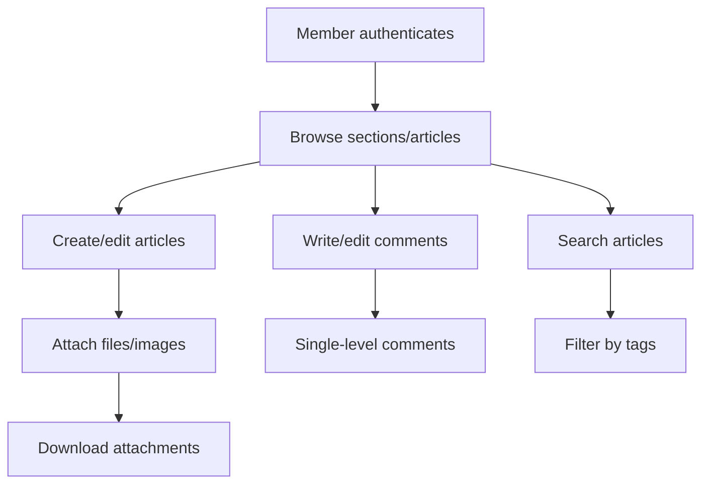
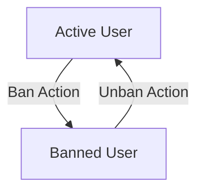
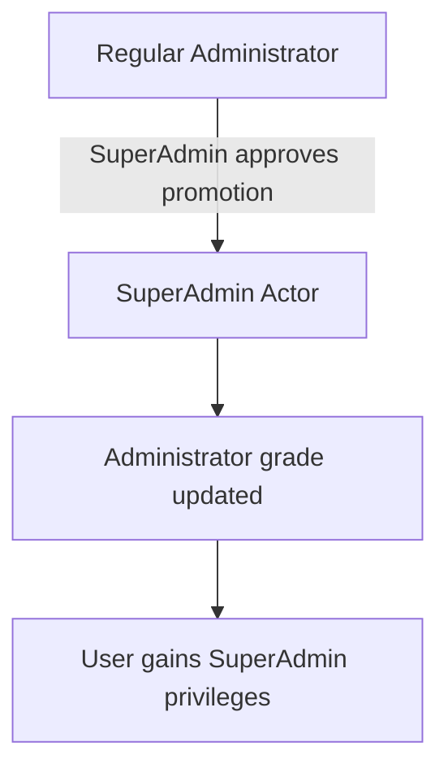
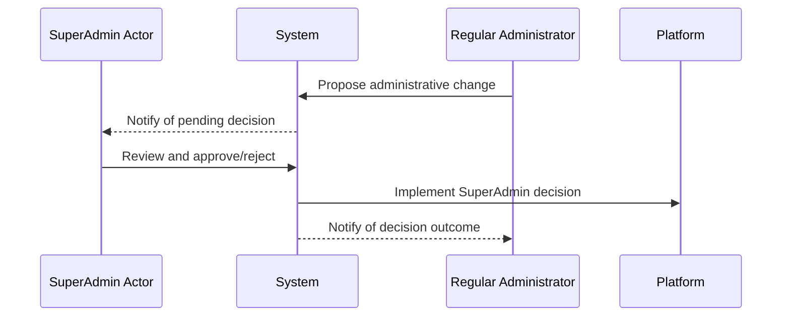
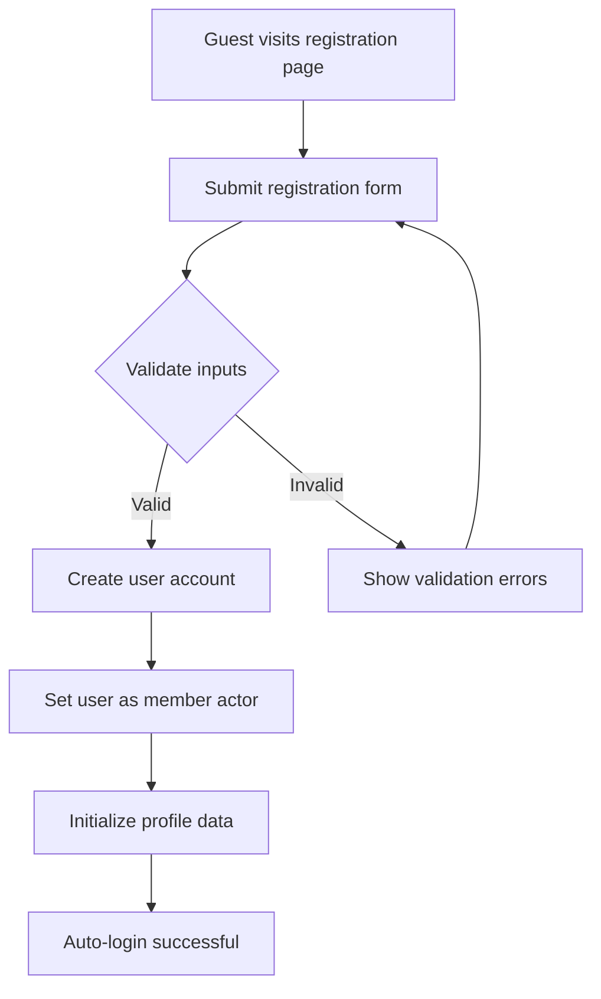
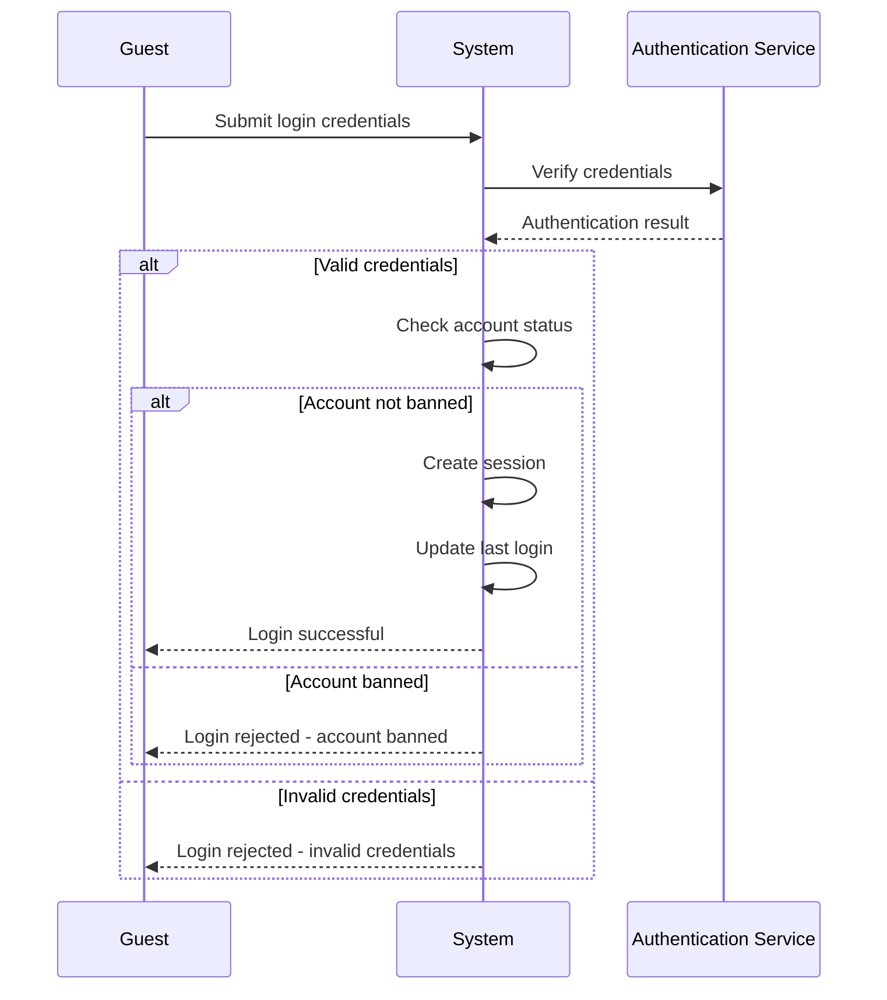
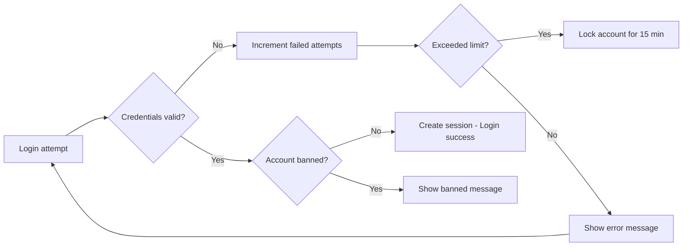
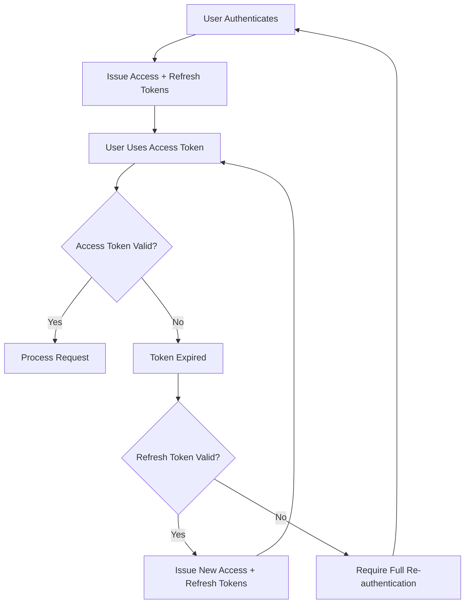
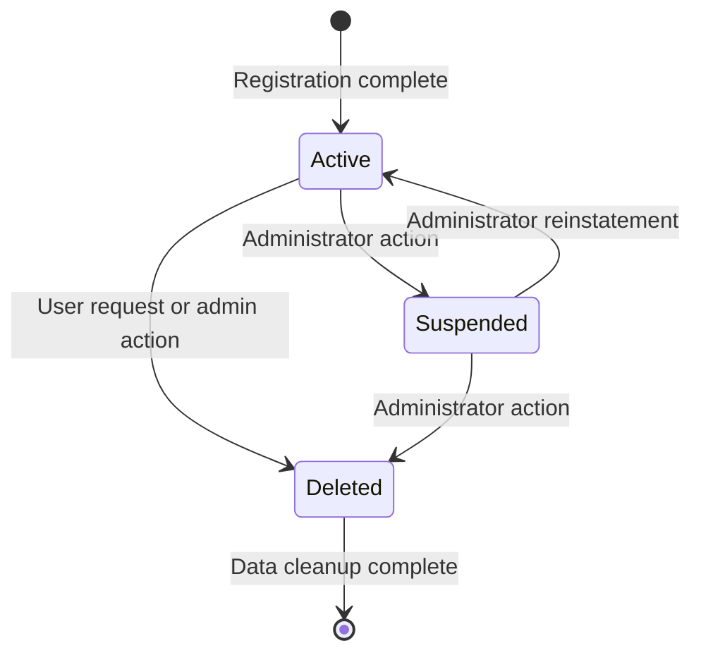
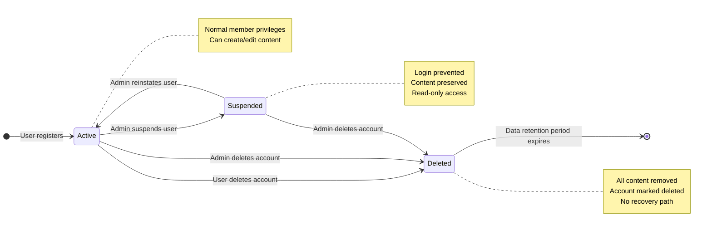

**discussionBoard — Actor definitions, permission matrix, authentication, session, account lifecycle**

Actor definitions, permission matrix, authentication, session, account lifecycle

# Actor Definitions

Define all user actor types with their roles and what they can do.

## guest Actor

Guest actors are unauthenticated users who can browse the discussion board without logging in. They can view the list of all sections available on the platform. Guests can browse articles within any section and see article lists showing titles, authors, tags, comment counts, and posting times. They can view individual articles with full content, attachments, and tags. Guests can also view user profiles to see display names, bios, and lists of articles and comments. However, guests cannot create articles, write comments, or perform any actions that require authentication. They have read-only access to the platform's public content.

### Guest Actor Definition and Access Scope

THE system SHALL provide guest actor access to unauthenticated users.

WHEN a user accesses the platform without authentication, THE system SHALL treat them as a guest actor.

WHILE a user has guest actor status, THE system SHALL provide read-only access to public content.

IF a guest attempts to perform actions requiring authentication, THE system SHALL prevent the action.

THE system SHALL allow guest actors to access:
- Section listings
- Article browsing
- Article viewing
- User profile viewing

THE system SHALL NOT allow guest actors to:
- Create articles
- Write comments
- Edit content
- Delete content
- Submit administrator requests

### Section Browsing Capabilities

WHEN a guest actor views the platform, THE system SHALL display the list of all available sections.

THE system SHALL display each section with its name and description.

WHEN a guest actor selects a section, THE system SHALL display the list of articles within that section.

THE system SHALL paginate section article lists for guest actors.

THE system SHALL allow guest actors to sort articles by newest first or oldest first.

IF a section contains no articles, THE system SHALL display an empty state message.

### Article Viewing and Browsing

WHEN a guest actor browses articles in a section, THE system SHALL display:
- Article title
- Author display name
- Tags
- Comment count
- Time posted

THE system SHALL NOT display full article content in browsing lists for guest actors.

WHEN a guest actor selects an article, THE system SHALL display the full article content including:
- Title
- Author display name
- Content
- Attachments
- Tags
- Time posted

THE system SHALL allow guest actors to download attached files and images.

THE system SHALL display all comments on an article to guest actors, sorted by oldest first.

THE system SHALL display each comment with:
- Author display name
- Content
- Time posted

### Profile Viewing Permissions

WHEN a guest actor views a user profile, THE system SHALL display:
- User display name
- User bio
- List of all articles written by the user
- List of all comments written by the user

THE system SHALL NOT allow guest actors to edit any profile information.

THE system SHALL provide access to user profiles from article author links and comment author links.

WHEN viewing a user's article list, THE system SHALL display the same article information as in section browsing.

WHEN viewing a user's comment list, THE system SHALL display:
- Comment content
- Article title the comment belongs to
- Time posted

### Search and Filter Capabilities

WHEN a guest actor searches for articles, THE system SHALL search by title and content.

THE system SHALL provide paginated search results to guest actors.

THE system SHALL allow guest actors to filter search results by tags.

THE system SHALL display search results with the same information as section article lists.

IF no articles match the search criteria, THE system SHALL display an appropriate message.

THE system SHALL maintain search functionality consistency across all sections for guest actors.

### Read-Only Limitations and Error Handling

WHILE a user has guest actor status, THE system SHALL enforce read-only permissions.

IF a guest actor attempts to create content, THE system SHALL redirect to authentication.

IF a guest actor attempts to edit content, THE system SHALL prevent the action.

IF a guest actor attempts to delete content, THE system SHALL prevent the action.

THE system SHALL display appropriate error messages when guest actors attempt restricted actions.

THE system SHALL ensure banned users' content remains visible to guest actors.

THE system SHALL NOT display administrator-specific features to guest actors.

## member Actor

Member actors are authenticated users who have registered accounts on the platform. They can perform all guest capabilities plus create and manage their own content. Members can create articles in any section with titles, content, tags, and attachments. They can edit and delete their own articles, including modifying titles, content, attachments, and tags. Members can write comments on articles and edit or delete their own comments. They can manage their user profiles by updating display names and bio text. Members can also submit requests to become administrators. They have full access to search functionality and can filter articles by tags. Members can download attached files and images from articles.

### Member Authentication and Session Management

WHEN a user successfully registers or logs in, THE system SHALL authenticate them as a member.

WHILE authenticated as a member, THE system SHALL:
1. Maintain the user's session
2. Allow access to member-only features
3. Recognize the user's identity across all operations

IF the user logs out or the session expires, THE system SHALL revoke member access privileges.

WHEN a member attempts to perform an action requiring authentication, THE system SHALL verify their active session before proceeding.

### Article Creation and Management

WHEN a member creates an article, THE system SHALL:
1. Require a title and content
2. Require selection of a valid section
3. Allow optional attachment of files and images
4. Allow optional addition of tags
5. Associate the article with the creating member

WHEN a member edits their own article, THE system SHALL allow modification of:
- Title
- Content
- Attachments (add/remove)
- Tags

WHEN a member deletes their own article, THE system SHALL:
1. Remove the article from public view
2. Delete all associated comments and attachments
3. Update article counts across the system

IF a member attempts to edit or delete an article they do not own, THE system SHALL reject the request.

### Comment Management

WHEN a member writes a comment on an article, THE system SHALL:
1. Require content
2. Associate the comment with the member and article
3. Record the creation timestamp

WHEN a member edits their own comment, THE system SHALL allow modification of the comment content.

WHEN a member deletes their own comment, THE system SHALL remove the comment from public view.

IF a member attempts to edit or delete a comment they do not own, THE system SHALL reject the request.

WHEN viewing comments on an article, THE system SHALL display all comments sorted by oldest first.

### Profile Management

WHEN a member views their own profile, THE system SHALL display:
- Display name and bio
- List of all articles they have written
- List of all comments they have written

WHEN a member edits their profile, THE system SHALL allow modification of:
- Display name
- Bio text

WHEN a member views another user's profile, THE system SHALL display:
- Display name and bio
- List of all articles written by that user
- List of all comments written by that user

IF a member attempts to edit another user's profile, THE system SHALL reject the request.

### Content Ownership and Permissions

THE system SHALL enforce content ownership rules where:
- Members own articles they create
- Members own comments they write
- Members cannot modify content owned by other members

WHEN a member performs any action on content, THE system SHALL verify ownership before proceeding.

IF content ownership cannot be verified, THE system SHALL reject the action.

THE system SHALL maintain audit trails showing which member created each piece of content.

### Search and Browsing Capabilities

WHEN a member searches for articles, THE system SHALL:
1. Search by title and content
2. Allow filtering by tags
3. Return paginated results
4. Display search results with title, author, tags, comment count, and time posted

WHEN a member browses articles in a section, THE system SHALL:
1. Display paginated article list
2. Show title, author, tags, comment count, and time posted for each article
3. Allow sorting by newest first or oldest first
4. Not show full article content in the list view

WHEN a member views a single article, THE system SHALL display:
- Full article content
- Title, author, attachments, tags, and time posted
- All comments on the article

### Attachment Download and File Access

WHEN a member views an article with attachments, THE system SHALL display available files and images.

WHEN a member requests to download an attachment, THE system SHALL:
1. Verify the member has permission to view the article
2. Provide the file for download
3. Maintain file integrity during transfer

IF an attachment cannot be accessed or downloaded, THE system SHALL display an appropriate error message.

WHEN a member attaches files to their articles, THE system SHALL:
1. Accept multiple files and images
2. Store attachments securely
3. Associate attachments with the correct article

## admin Actor

Admin actors are users who have been approved as administrators through the request system. They retain all member capabilities while gaining additional moderation powers. Administrators can create, edit, and delete sections on the platform. They can delete any article regardless of ownership. Administrators can delete any comment on the platform. They have the authority to ban users from the platform with recorded reasons. Administrators can unban previously banned users. They can view the list of all banned users and their ban reasons. Regular administrators cannot promote or demote other administrators.

### Administrative Powers Overview

### Administrative Powers Overview

WHEN a user becomes an administrator, THE system SHALL grant them additional platform moderation capabilities.

THE system SHALL maintain a clear distinction between regular administrator and super administrator grades.

WHILE a user holds administrator status, THE system SHALL allow them to perform administrative duties including:
- Section creation and management
- Content moderation across all articles and comments
- User banning and ban management

THE system SHALL ensure administrators retain all member capabilities including article creation, commenting, and profile management.

IF an administrator attempts to perform an action requiring super administrator privileges, THE system SHALL reject the request.

WHERE platform moderation is concerned, THE system SHALL record all administrative actions with timestamps and actor identification.

### Section Management

### Section Management

WHEN an administrator creates a section, THE system SHALL:
1. Require a section name
2. Allow an optional description
3. Record the creation timestamp
4. Associate the section with the creating administrator

WHEN an administrator edits a section, THE system SHALL allow modification of:
- Section name
- Section description

WHEN an administrator deletes a section, THE system SHALL:
1. Remove the section from the platform
2. Preserve all articles and comments within the section
3. Update article listings to reflect section removal

THE system SHALL allow administrators to view the complete list of all sections on the platform.

IF a section name already exists, THE system SHALL reject the creation request.

WHERE section administration is performed, THE system SHALL maintain section integrity by preventing orphaned articles.

### Content Moderation

### Content Moderation

WHEN an administrator deletes an article, THE system SHALL:
1. Remove the article from public view
2. Preserve the article content for audit purposes
3. Remove all comments associated with the article
4. Update article counts in section listings

WHEN an administrator deletes a comment, THE system SHALL:
1. Remove the comment from public view
2. Preserve the comment content for audit purposes
3. Update comment counts on the associated article

THE system SHALL allow administrators to delete any article regardless of ownership.

THE system SHALL allow administrators to delete any comment regardless of ownership.

WHERE content deletion occurs, THE system SHALL record the administrator responsible and the timestamp.

IF an administrator attempts to delete content that has already been removed, THE system SHALL reject the request.

### User Banning System

### User Banning System

WHEN an administrator bans a user, THE system SHALL:
1. Require a ban reason
2. Prevent the banned user from logging in
3. Preserve all existing articles and comments by the banned user
4. Record the ban timestamp and administrator responsible

WHEN an administrator unbans a user, THE system SHALL:
1. Restore the user's login capability
2. Record the unban timestamp and administrator responsible
3. Maintain the user's existing content visibility

THE system SHALL provide administrators with a view of all banned users.

THE system SHALL display the ban reason for each banned user to administrators.

WHERE ban management is concerned, THE system SHALL prevent administrators from banning themselves.

IF an administrator attempts to ban a user who is already banned, THE system SHALL reject the request.

## superAdmin Actor

SuperAdmin actors are the highest-level administrators with ultimate platform authority. They possess all regular administrator capabilities plus additional administrative powers. Super administrators can view pending administrator requests and approve or reject them. They can promote regular administrators to super administrator status. Super administrators can demote other super administrators to regular administrator level. They cannot demote themselves from super administrator status. Super administrators manage the entire administrator hierarchy and oversee platform governance. They have final authority on all administrative decisions and platform management.

### Ultimate Authority

SuperAdmin actors possess ultimate authority over the entire discussion board platform.

THE system SHALL recognize SuperAdmin actors as the highest-level administrators with ultimate platform authority.
WHEN SuperAdmin actors perform any administrative action, THE system SHALL grant them the same access and capabilities as regular administrators.
WHERE administrator decisions require final authority, THE system SHALL prioritize SuperAdmin input over regular administrator input.
IF a SuperAdmin and regular administrator disagree on an administrative action, THE system SHALL implement the SuperAdmin's decision when explicitly asserted by the SuperAdmin actor.

### Administrator Hierarchy Management

SuperAdmin actors manage the entire administrator hierarchy and governance structure.

WHEN viewing the administrator hierarchy, THE system SHALL display all regular administrators and SuperAdmin actors with their respective grades.
WHEN a SuperAdmin actor requests to view the administrator structure, THE system SHALL provide a complete list of all administrator users with their current grade assignments.
IF the administrator hierarchy needs reorganization, THE system SHALL allow SuperAdmin actors to modify grade assignments for other administrator users.
WHERE administrator roles require adjustment, THE system SHALL permit SuperAdmin actors to reconfigure the administrator hierarchy according to platform governance needs.

### Administrator Request Review and Approval

SuperAdmin actors review and decide on administrator promotion requests from regular users.

WHEN a user submits an administrator request, THE system SHALL display that request in the pending requests list viewable to SuperAdmin actors.
WHEN SuperAdmin actors view the list of pending administrator requests, THE system SHALL display:
1. The requesting user's display name
2. The reason text provided in the request
3. The date and time the request was submitted
4. Any other relevant user information for decision-making

IF SuperAdmin actors choose to approve a pending administrator request, THE system SHALL:
1. Grant the user regular administrator privileges
2. Update the request status to "approved"
3. Notify the user of their new administrative status

IF SuperAdmin actors choose to reject a pending administrator request, THE system SHALL:
1. Keep the user as a regular member without administrator privileges
2. Update the request status to "rejected"
3. Optionally record a reason for rejection

WHERE multiple SuperAdmin actors exist, THE system SHALL allow any SuperAdmin to approve or reject administrator requests.

IF an administrator request has been pending for an extended period, THE system SHALL continue to display it until a SuperAdmin actor takes action on it.

### Administrator Promotion and Demotion Authority

SuperAdmin actors exercise promotion and demotion authority over other administrator users.

WHEN SuperAdmin actors choose to promote a regular administrator to SuperAdmin status, THE system SHALL:
1. Upgrade the user's administrator grade to SuperAdmin
2. Grant all SuperAdmin privileges to the promoted user
3. Update the administrator hierarchy to reflect the new grade

WHEN SuperAdmin actors choose to demote another SuperAdmin to regular administrator status, THE system SHALL:
1. Downgrade the user's administrator grade to regular administrator
2. Remove SuperAdmin privileges while retaining regular administrator capabilities
3. Update the administrator hierarchy to reflect the demotion
4. Ensure the demoted user can no longer perform SuperAdmin-only actions

WHERE administrator grades need adjustment to maintain platform governance, THE system SHALL permit SuperAdmin actors to modify administrator grades as necessary.

IF a SuperAdmin actor attempts to demote themselves, THE system SHALL reject the demotion request.
IF a SuperAdmin actor attempts to remove the last SuperAdmin from the platform, THE system SHALL reject the request.

WHILE maintaining at least one SuperAdmin actor on the platform, THE system SHALL allow grade modifications for other administrator users.

### Platform Governance and Oversight

SuperAdmin actors oversee all platform governance decisions and administrative operations.

WHEN platform-wide decisions require implementation, THE system SHALL prioritize SuperAdmin directives over regular administrator directives.
WHERE administrative policies need establishment or modification, THE system SHALL permit SuperAdmin actors to define or change platform governance rules.
IF conflicting administrative actions occur between different administrator users, THE system SHALL allow SuperAdmin actors to resolve the conflicts with final authority.

WHEN monitoring platform health and administration effectiveness, THE system SHALL provide SuperAdmin actors with oversight capabilities including:
1. Viewing administrator activity patterns
2. Assessing content moderation effectiveness
3. Evaluating section management quality
4. Monitoring user banning patterns and effectiveness

WHERE platform governance requires intervention, THE system SHALL allow SuperAdmin actors to directly implement changes to administrative policies and procedures.

### Supervisory Role and Administrator Management

SuperAdmin actors supervise all administrator activities and manage the administrator user base.

WHEN reviewing administrator performance, THE system SHALL allow SuperAdmin actors to:
1. View all actions performed by administrator users
2. Assess the frequency and quality of administrative actions
3. Identify patterns in administrator behavior
4. Review decision-making consistency across administrators

WHERE administrator training or guidance is needed, THE system SHALL permit SuperAdmin actors to provide oversight and direction to regular administrators.
IF administrator users require corrective action or additional guidance, THE system SHALL allow SuperAdmin actors to intervene in administrator activities.

WHEN managing the administrator user base, THE system SHALL permit SuperAdmin actors to:
1. Review which users hold administrator privileges
2. Assess the distribution of administrators across different platform areas
3. Evaluate whether additional administrators are needed
4. Determine if administrator privileges should be revoked from specific users

WHERE supervisory decisions affect platform operations, THE system SHALL implement SuperAdmin supervisory directives with the same priority as other administrative actions.

# Authentication Flows

Registration, login, session management, and token policies.

## Registration and Login

Define user registration and login flows including validation and error handling.

### User Registration (Signup)

### User Registration (Signup)

THE system SHALL provide a user registration capability that allows individuals to create new member accounts.

WHEN a guest submits a registration request with valid information, THE system SHALL:
1. Create a new user account with the provided credentials
2. Associate the account with the "member" actor type
3. Store the user's email and password securely
4. Generate a default display name if not provided
5. Initialize the user's profile with empty bio text
6. Set the account to active status

THE system SHALL require the following information for registration:
- Email address (required)
- Password (required)
- Display name (optional - if not provided, system will generate one)

IF the email address is already registered, THE system SHALL reject the registration request and notify the guest.
IF the password does not meet minimum security requirements, THE system SHALL reject the registration request and notify the guest.
IF the email address format is invalid, THE system SHALL reject the registration request and notify the guest.

WHEN registration is successful, THE system SHALL automatically log the user in.

### User Login (Signin)

### User Login (Signin)

THE system SHALL provide a login capability that allows registered users to access their accounts.

WHEN a guest submits a login request with valid credentials, THE system SHALL:
1. Verify the email and password match a registered account
2. Check that the account is not banned
3. Create an authenticated session for the user
4. Update the user's last login timestamp
5. Redirect the user to their personalized dashboard

THE system SHALL require the following information for login:
- Email address (required)
- Password (required)

IF the email address is not registered, THE system SHALL reject the login request without revealing whether the email exists.
IF the password is incorrect, THE system SHALL reject the login request without revealing whether the email exists.
IF the account is banned, THE system SHALL reject the login request and notify the user of their banned status.

WHILE a user maintains an active session, THE system SHALL treat them as authenticated for all member-level operations.

### Authentication Requirements

### Authentication Requirements

THE system SHALL maintain authentication state for authenticated users throughout their session.

WHEN a user is authenticated, THE system SHALL:
1. Recognize them as a "member" actor with corresponding permissions
2. Allow access to member-only features and content
3. Associate their actions with their user identity
4. Provide access to their personal data and content

THE system SHALL prevent banned users from authenticating, regardless of credential validity.

WHERE password-based authentication is used, THE system SHALL:
1. Store passwords using secure hashing algorithms
2. Never transmit passwords in plain text
3. Never display passwords in clear text
4. Enforce minimum password complexity requirements

IF an authentication attempt fails due to invalid credentials, THE system SHALL:
1. Not reveal whether the email address exists in the system
2. Provide the same generic error message for all credential failures
3. Implement rate limiting to prevent brute force attacks

WHILE a user remains logged in, THE system SHALL maintain their authentication state across all system interactions.

THE system SHALL require re-authentication for sensitive operations, such as:
- Changing account password
- Deleting user account
- Modifying administrative settings (for administrators)

### Registration Validation Rules

### Registration Validation Rules

THE system SHALL validate all registration inputs according to business rules.

WHEN validating email addresses during registration, THE system SHALL:
1. Require a valid email format (user@domain.tld)
2. Check for email uniqueness across all registered users
3. Reject disposable or temporary email addresses
4. Allow only one account per email address

WHEN validating passwords during registration, THE system SHALL:
1. Require a minimum length of 8 characters
2. Require at least one uppercase letter
3. Require at least one lowercase letter
4. Require at least one numeric digit
5. Reject passwords that match the user's email or display name

WHEN validating display names during registration, THE system SHALL:
1. Allow display names between 2 and 50 characters
2. Reject display names containing offensive language
3. Allow display names to be modified after registration
4. Generate a default display name if none provided (e.g., "User12345")

IF any validation rule fails during registration, THE system SHALL:
1. Reject the entire registration request
2. Display specific error messages for each failed validation
3. Preserve already-entered form data where possible
4. Allow the guest to correct errors and resubmit

THE system SHALL protect against automated registration attempts by:
1. Implementing CAPTCHA verification for suspicious registration patterns
2. Limiting registration attempts from the same IP address
3. Monitoring for unusual registration activity patterns

### Login Security and Error Handling

### Login Security and Error Handling

THE system SHALL implement security measures to protect the login process.

WHEN processing login attempts, THE system SHALL:
1. Implement rate limiting to prevent brute force attacks
2. Lock accounts after 5 consecutive failed login attempts
3. Require CAPTCHA verification for suspicious login patterns
4. Log all login attempts (successful and failed) for security monitoring

IF a user account is locked due to failed login attempts, THE system SHALL:
1. Prevent further login attempts for that account for 15 minutes
2. Notify the user of the temporary lockout via email
3. Automatically unlock the account after the lockout period expires
4. Allow administrators to manually unlock accounts if needed

WHEN a user successfully logs in, THE system SHALL:
1. Invalidate any existing sessions for that user
2. Create a new session with a unique identifier
3. Set appropriate session timeout based on user activity
4. Allow users to log out from all devices

IF a login attempt is made from an unusual location or device, THE system SHALL:
1. Flag the attempt as suspicious
2. Require additional verification (e.g., email confirmation)
3. Notify the user of the suspicious login attempt
4. Allow users to review and manage trusted devices

THE system SHALL protect against session hijacking by:
1. Using secure, randomly generated session tokens
2. Invalidating sessions after prolonged inactivity
3. Requiring re-authentication for sensitive operations
4. Supporting session termination from account settings

## Session and Token Policy

Define session duration, token refresh, and expiration policies.

### JWT Token Structure

## JWT Token Structure

THE system SHALL use JSON Web Tokens (JWTs) for user authentication and authorization.

### Token Components

WHEN a user successfully authenticates, THE system SHALL generate a JWT containing:
1. User identifier (user ID)
2. User role (guest, member, admin, superAdmin)
3. Token issuance timestamp
4. Token expiration timestamp

### Token Encoding

THE system SHALL encode JWTs using a secure signing algorithm.

### Token Verification

WHEN the system receives a JWT in an API request, THE system SHALL:
1. Verify the token signature is valid
2. Verify the token has not expired
3. Extract user identity and role from the token
4. Use the extracted identity for authorization decisions

IF the JWT signature is invalid, THE system SHALL reject the request.
IF the JWT has expired, THE system SHALL reject the request.
IF the JWT is missing required claims, THE system SHALL reject the request.

### Session Duration and Expiration

## Session Duration and Expiration

### Access Token Lifetime

THE system SHALL issue access tokens with a maximum lifetime of 1 hour.
WHEN an access token expires, THE system SHALL reject requests using that token.

### Refresh Token Lifetime

THE system SHALL issue refresh tokens with a maximum lifetime of 7 days.
WHEN a refresh token expires, THE user SHALL be required to fully reauthenticate.

### Session Persistence

WHILE a user has valid tokens, THE system SHALL maintain their authenticated session.
THE system SHALL treat each token independently—multiple concurrent sessions from the same user ARE permitted.

### Token Expiration Handling

IF a user attempts to use an expired access token, THE system SHALL:
1. Reject the request with an appropriate error
2. Not attempt to automatically refresh the token (refresh must be explicit)

### Manual Session Termination

WHEN a user changes their password, THE system SHALL invalidate all existing refresh tokens for that user.
WHEN a user deletes their account, THE system SHALL invalidate all tokens associated with that account.

### Token Refresh Mechanism

## Token Refresh Mechanism

### Refresh Token Usage

WHEN a user's access token expires, THE system SHALL allow the user to obtain a new access token using a valid refresh token.

### Refresh Request Requirements

WHEN a user submits a refresh request, THE system SHALL:
1. Require a valid, non-expired refresh token
2. Issue a new access token with a refreshed expiration time
3. Issue a new refresh token with refreshed expiration time (rotating refresh tokens)

The refresh token rotation ensures security by invalidating the old refresh token after use.

### Refresh Request Validation

IF the refresh token is invalid, THE system SHALL reject the refresh request.
IF the refresh token has expired, THE system SHALL reject the refresh request.
IF the user account associated with the refresh token no longer exists, THE system SHALL reject the refresh request.
IF the user associated with the refresh token is banned, THE system SHALL reject the refresh request.

### Refresh Token Storage

THE system SHALL store refresh tokens in a secure, server-side database for validation and revocation purposes.
WHEN issuing a new refresh token, THE system SHALL invalidate the previous refresh token to prevent reuse.

### User Experience

WHILE a user's refresh token remains valid, THE system SHALL maintain their session without requiring full reauthentication.
WHEN a refresh token expires, THE user SHALL be redirected to the login screen for full authentication.

### Security and Revocation Policies

## Security and Revocation Policies

### Token Security

THE system SHALL transmit tokens only over secure HTTPS connections.
THE system SHALL never expose refresh tokens in client-side JavaScript accessible to untrusted code.

### Token Storage

WHEN storing tokens on client devices, THE system SHALL recommend secure storage mechanisms.
THE system SHALL NOT mandate specific client-side storage implementations but SHALL provide security guidance.

### Token Revocation

Administrators SHALL be able to revoke specific user sessions by invalidating their tokens.
WHEN a user is banned, THE system SHALL immediately invalidate all active tokens for that user.

### Session Audit

THE system SHALL maintain an audit log of token issuance and refresh events.
THE system SHALL record:
1. When tokens are issued
2. When tokens are refreshed
3. When tokens are revoked or invalidated
4. Associated user identifiers for each event

### Security Breach Response

IF a security breach is suspected or detected, THE system SHALL support mass token revocation.
THE system SHALL provide administrators the ability to invalidate all tokens for specific users or globally.

### Rate Limiting

THE system SHALL implement rate limiting on token refresh requests to prevent abuse.
THE system SHALL reject refresh requests that exceed reasonable frequency limits.

# Account Lifecycle

Account state transitions and lifecycle management.

## Account States and Transitions

Define account states (active, suspended, deleted) and valid transitions.

### Account State Definitions

### Account State Definitions

THE discussionBoard SHALL maintain one of three account states for each registered user.

**Active Account:**

WHEN a user has a verified email and is not banned, THE system SHALL consider their account as active.
WHILE an account is active, THE system SHALL allow the user to:
1. Log in with their credentials
2. Create and edit articles and comments
3. Access all member features as defined in the permission matrix

**Suspended Account:**

WHEN an administrator suspends a user account, THE system SHALL transition the account from active to suspended.
WHILE an account is suspended, THE system SHALL prevent the user from:
1. Logging in to the platform
2. Creating new articles or comments
3. Editing existing articles or comments

THE system SHALL preserve all existing content (articles and comments) created by a suspended user.

**Deleted Account:**

WHEN a user requests account deletion, THE system SHALL transition the account from active to deleted.
WHEN an administrator deletes a user account, THE system SHALL transition the account from either active or suspended to deleted.
WHILE an account is deleted, THE system SHALL remove all personally identifiable information while optionally retaining anonymized statistical data.

### Account Suspension Process

### Account Suspension Process

**Suspension Initiation:**

WHEN an administrator suspends a user, THE system SHALL:
1. Record the suspension reason (text field)
2. Record the administrator who performed the suspension
3. Record the date and time of suspension
4. Transition the user account from active to suspended state

**Suspension Effects:**

WHEN a user account transitions to suspended state, THE system SHALL:
1. Immediately terminate any active sessions for that user
2. Prevent creation of new sessions for that user
3. Display a "Account Suspended" message if the user attempts to log in
4. Continue displaying the user's existing articles and comments to other users

**Suspension Duration:**

WHILE an account remains suspended, THE system SHALL maintain all suspension effects until:
1. An administrator reinstates the account, OR
2. An administrator permanently deletes the account

IF a user attempts to log in while suspended, THE system SHALL display the suspension reason (if configured by administrator).
IF a suspended user attempts to perform any member action, THE system SHALL reject the request with appropriate access restriction message.

### Account Deletion Process

### Account Deletion Process

**User-Initiated Deletion:**

WHEN a user requests account deletion, THE system SHALL:
1. Require the user to confirm their password
2. Display a clear warning about the permanent nature of deletion
3. List all content that will be removed (articles, comments, profile data)
4. Provide a confirmation step before proceeding with deletion

**Administrator-Initiated Deletion:**

WHEN an administrator deletes a user account, THE system SHALL:
1. Record the deletion reason (text field)
2. Record the administrator who performed the deletion
3. Record the date and time of deletion
4. Transition the account to deleted state

**Deletion Effects:**

WHEN an account is deleted (either by user or administrator), THE system SHALL:
1. Remove the user's display name, bio, and email from public view
2. Remove all articles created by the user
3. Remove all comments created by the user
4. Revoke all session tokens associated with the account
5. Mark the account as deleted in the system (soft delete)

**Deletion Recovery:**

THE system SHALL NOT provide automated recovery of deleted accounts.
WHERE account data recovery is required, THE system SHALL require intervention by a super administrator.

### Account Reactivation Process

### Account Reactivation Process

**Reactivation Eligibility:**

THE system SHALL allow reactivation ONLY for suspended accounts.
THE system SHALL NOT allow reactivation of deleted accounts through normal system processes.

**Reactivation Initiation:**

WHEN an administrator reinstates a suspended account, THE system SHALL:
1. Record the reinstatement reason (text field)
2. Record the administrator who performed the reinstatement
3. Record the date and time of reinstatement
4. Transition the user account from suspended to active state

**Reactivation Effects:**

WHEN a suspended account transitions to active state, THE system SHALL:
1. Restore all member permissions to the user
2. Allow the user to log in with their existing credentials
3. Restore access to all previously created content
4. Maintain the user's articles and comments in their original state

**Post-Reactivation Experience:**

WHEN a previously suspended user logs in after reactivation, THE system SHALL NOT display historical suspension information to the user.
THE system SHALL maintain suspension records for administrative audit purposes only.

### Account Lifecycle Overview

### Account Lifecycle Overview

**State Transition Matrix:**

| From State | To State | Trigger | Authorization Required |
|------------|----------|---------|------------------------|
| [None] | Active | User registration | None (self-service) |
| Active | Suspended | Administrator action | Administrator or Super Administrator |
| Suspended | Active | Administrator reinstatement | Administrator or Super Administrator |
| Active | Deleted | User request | User (with password confirmation) |
| Active | Deleted | Administrator action | Administrator or Super Administrator |
| Suspended | Deleted | Administrator action | Administrator or Super Administrator |

**Lifecycle Diagram:**

**Lifecycle Consistency Rules:**

THE system SHALL ensure that only valid state transitions occur as defined in the matrix above.
IF an invalid state transition is attempted, THE system SHALL reject the request and log the attempted violation.

THE system SHALL maintain an audit trail of all account state transitions, including:
1. Previous state
2. New state
3. Date and time of transition
4. Actor who performed the transition
5. Reason for transition (if applicable)