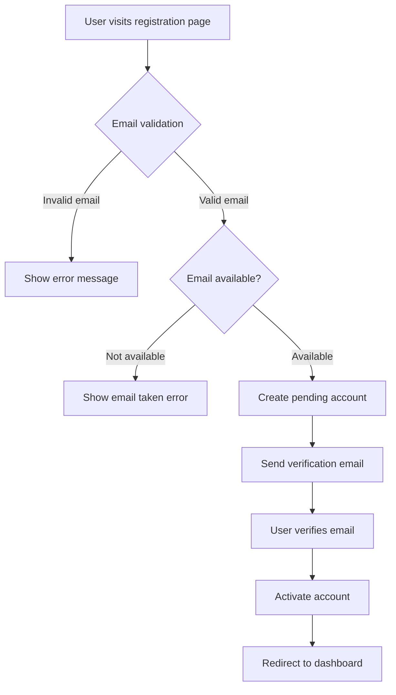
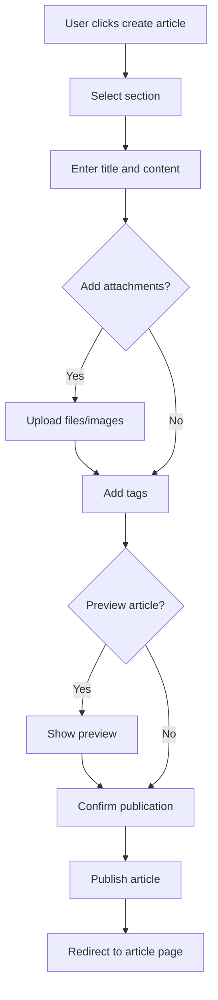
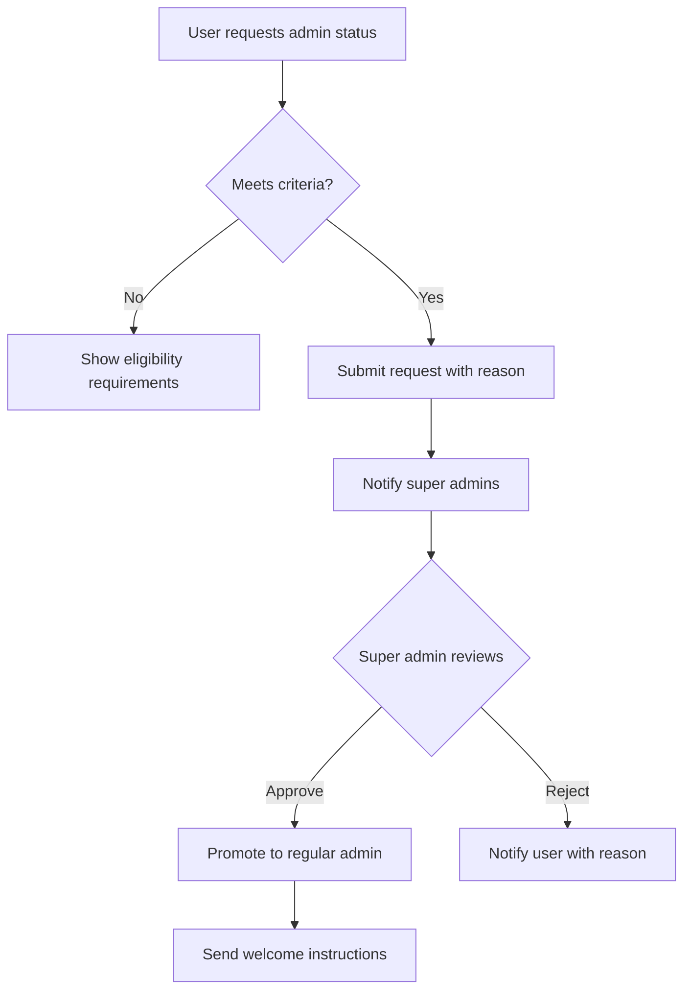

# Economic/Political Discussion Board - Complete Requirements Specification

## Executive Summary

The Economic/Political Discussion Board is a structured platform designed for high-quality discourse on economic and political topics. This document provides comprehensive business requirements for implementing a complete backend system supporting user management, content creation, moderation, and community engagement features.

## 1. User Account Management System

### 1.1 User Registration Process

**WHEN** a new user attempts to register for the platform, **THE** system **SHALL**:
- Validate email format and ensure it is not already registered
- Require password with minimum 8 characters containing at least one uppercase letter, one lowercase letter, and one number
- Send verification email with secure token valid for 24 hours
- Create user account in pending verification state
- Log registration attempt with timestamp and IP address

**WHEN** a user completes email verification, **THE** system **SHALL**:
- Activate the user account immediately
- Create default user profile with empty display name and bio
- Send welcome email with platform guidelines
- Record successful verification timestamp

### 1.2 User Authentication Process

**WHEN** a user attempts to log in, **THE** system **SHALL**:
- Validate email exists in the system
- Verify password matches stored hash
- Check if account is banned or suspended
- Generate JWT token with 24-hour expiration
- Record login timestamp and IP address
- Return user profile information upon successful authentication

**WHEN** authentication fails, **THE** system **SHALL**:
- Increment failed login attempt counter
- Lock account after 5 consecutive failed attempts for 30 minutes
- Log failed attempt with timestamp and IP
- Return specific error message (invalid email, wrong password, account locked)

### 1.3 Password Management

**WHEN** a user requests password change, **THE** system **SHALL**:
- Require current password verification
- Validate new password meets security requirements
- Send confirmation email to registered address
- Update password hash in database
- Invalidate all existing sessions for security
- Log password change with timestamp

**WHEN** a user requests password reset, **THE** system **SHALL**:
- Send reset link to verified email address
- Generate secure token valid for 1 hour
- Allow password reset without current password knowledge
- Require password confirmation on reset form
- Log reset request and completion

### 1.4 Account Deletion Process

**WHEN** a user requests account deletion, **THE** system **SHALL**:
- Require password confirmation for security
- Send confirmation email with deletion warning
- Provide 7-day grace period for cancellation
- Permanently delete all user data after grace period
- Anonymize articles and comments (mark as "Deleted User")
- Log deletion request and completion
- Remove all personal information from database

## 2. User Profile System

### 2.1 Profile Data Structure

Each user profile **SHALL** contain:
- Display Name (required, 2-50 characters, unique per user)
- Bio Text (optional, maximum 500 characters)
- Profile Creation Date (automatically set)
- Last Profile Update Date (automatically updated)
- Total Articles Count (automatically calculated)
- Total Comments Count (automatically calculated)
- Profile Visibility Setting (public/private)

### 2.2 Profile Editing Capabilities

**WHEN** a user edits their profile, **THE** system **SHALL**:
- Validate display name uniqueness across the platform
- Enforce character limits for display name and bio
- Allow real-time preview of profile changes
- Save changes immediately upon confirmation
- Update last modification timestamp
- Log profile edit activity

### 2.3 Profile Viewing Requirements

**WHEN** a user views another user's profile, **THE** system **SHALL** display:
- Display name and bio (if profile is public)
- Join date and last activity timestamp
- List of recent articles (paginated, 10 per page)
- List of recent comments (paginated, 10 per page)
- Total contribution statistics
- Profile visibility indicator

**WHEN** a user views their own profile, **THE** system **SHALL** additionally display:
- Email address (for verification)
- Account status information
- Privacy settings management interface
- Quick access to profile editing

## 3. Section Management System

### 3.1 Section Structure and Properties

Each section **SHALL** contain:
- Section Name (required, unique, 3-50 characters)
- Section Description (required, 10-500 characters)
- Creation Date (automatically set)
- Creator Administrator ID
- Last Modification Date
- Active/Inactive Status
- Article Count (automatically calculated)

### 3.2 Section Creation Process

**WHEN** an administrator creates a new section, **THE** system **SHALL**:
- Validate section name uniqueness
- Require descriptive section description
- Set creation timestamp and creator information
- Set section to active status by default
- Log section creation activity
- Notify super administrators of new section creation

### 3.3 Section Editing and Management

**WHEN** an administrator edits a section, **THE** system **SHALL**:
- Allow modification of section name and description
- Maintain edit history with timestamp and editor information
- Prevent name conflicts with existing sections
- Update last modification timestamp
- Log all editing activities

**WHEN** an administrator deletes a section, **THE** system **SHALL**:
- Require confirmation with warning about content impact
- Move all articles to "General" section or archive
- Preserve article integrity and comments
- Log deletion with reason and administrator information
- Notify article authors about section removal

### 3.4 Section Browsing Interface

**WHEN** a user browses sections, **THE** system **SHALL**:
- Display all active sections in alphabetical order
- Show section description and article count
- Provide search functionality for section names
- Highlight sections with recent activity
- Support pagination for large section lists

## 4. Article Management System

### 4.1 Article Creation Process

**WHEN** a user creates an article, **THE** system **SHALL**:
- Require title (5-200 characters)
- Require content (minimum 100 characters)
- Require section selection from active sections
- Allow multiple file attachments (maximum 5 files, 10MB total)
- Allow multiple image attachments (maximum 10 images)
- Support free-text tags (maximum 10 tags, 20 characters each)
- Validate content for inappropriate language
- Set creation timestamp and author information
- Generate unique article URL slug

### 4.2 Article Content Requirements

Article content **SHALL** support:
- Rich text formatting (bold, italics, lists)
- Hyperlinks with URL validation
- Code blocks with syntax highlighting
- Quotation formatting
- Image embedding from attachments
- Maximum content length of 50,000 characters

### 4.3 Attachment Management

**WHEN** a user attaches files to an article, **THE** system **SHALL**:
- Validate file types (PDF, DOC, DOCX, TXT)
- Enforce individual file size limit of 5MB
- Scan files for malware using antivirus integration
- Generate secure download links
- Display file type icons and sizes
- Support file preview for supported formats

**WHEN** a user attaches images, **THE** system **SHALL**:
- Validate image formats (JPG, PNG, GIF)
- Auto-resize large images to maximum 1920x1080
- Generate thumbnails for image preview
- Optimize images for web delivery
- Support alt text for accessibility

### 4.4 Article Editing and Deletion

**WHEN** a user edits their article, **THE** system **SHALL**:
- Maintain edit history with timestamps
- Show difference between versions
- Allow modification of title, content, attachments, and tags
- Preserve original creation date
- Display "Last Edited" timestamp
- Require edit reason for transparency

**WHEN** a user deletes their article, **THE** system **SHALL**:
- Require confirmation with deletion warning
- Preserve article for 30 days in deleted state
- Allow restoration within 7-day grace period
- Notify comment authors about article deletion
- Log deletion activity with timestamp

## 5. Article Browsing and Search System

### 5.1 Article List Display

**WHEN** a user views article lists, **THE** system **SHALL** display:
- Article title (truncated to 100 characters)
- Author display name
- Tags associated with the article
- Comment count
- Creation timestamp
- Section information
- Preview excerpt (first 150 characters of content)

### 5.2 Pagination Requirements

**WHEN** displaying article lists, **THE** system **SHALL**:
- Support pagination with 20 articles per page
- Provide page navigation controls
- Display total article count
- Support "Load More" functionality for better UX
- Remember user's page position during navigation

### 5.3 Sorting Options

Users **SHALL** be able to sort articles by:
- Newest first (default)
- Oldest first
- Most comments
- Recently active (based on last comment)
- Alphabetical by title

### 5.4 Search Functionality

**WHEN** a user searches for articles, **THE** system **SHALL**:
- Search across article titles and content
- Support boolean operators (AND, OR, NOT)
- Provide search suggestions based on popularity
- Highlight search terms in results
- Support phrase searching with quotation marks
- Return results ranked by relevance

### 5.5 Tag Filtering System

**WHEN** filtering by tags, **THE** system **SHALL**:
- Display popular tags with usage counts
- Allow multiple tag selection
- Support tag exclusion
- Show related tags based on co-occurrence
- Remember user's tag preferences

## 6. Comment System

### 6.1 Comment Creation Process

**WHEN** a user creates a comment, **THE** system **SHALL**:
- Require content (minimum 10 characters, maximum 2,000 characters)
- Associate comment with specific article
- Set creation timestamp and author information
- Validate content for inappropriate language
- Support basic text formatting (bold, italics, links)
- Prevent duplicate comments within 5 minutes

### 6.2 Comment Display Requirements

**WHEN** displaying comments, **THE** system **SHALL**:
- Show comments in chronological order (oldest first)
- Display author information and creation timestamp
- Support comment editing indicators
- Highlight administrator comments
- Provide report functionality for inappropriate content
- Support comment voting/liking system

### 6.3 Comment Editing and Deletion

**WHEN** a user edits their comment, **THE** system **SHALL**:
- Allow editing within 60 minutes of creation
- Show edit history with timestamps
- Display "Edited" indicator
- Preserve original comment intent
- Require edit reason for transparency

**WHEN** a user deletes their comment, **THE** system **SHALL**:
- Remove comment immediately
- Notify article author about comment deletion
- Log deletion activity
- Allow restoration within 24-hour grace period

### 6.4 Comment Moderation

**WHEN** an administrator moderates comments, **THE** system **SHALL**:
- Allow deletion of inappropriate comments
- Provide moderation reason recording
- Notify comment author about moderation action
- Support comment hiding (soft delete)
- Track moderation history per administrator

## 7. Administrator System

### 7.1 Administrator Promotion Process

**WHEN** a user requests administrator status, **THE** system **SHALL**:
- Require minimum 3 months platform membership
- Require minimum 10 quality articles published
- Require positive community reputation
- Capture request reason (200-1000 characters)
- Set request status to "Pending Review"
- Notify super administrators of new requests

**WHEN** a super administrator reviews promotion request, **THE** system **SHALL**:
- Display user activity statistics
- Show request reason and user history
- Allow approval or rejection with reason
- Notify user of decision outcome
- Log promotion decision with timestamp

### 7.2 Administrator Hierarchy

The system **SHALL** maintain two administrator grades:

**Regular Administrator:**
- Can moderate content (delete articles/comments)
- Can manage sections (create/edit/delete)
- Can ban users with reason recording
- Cannot promote other administrators
- Cannot demote other administrators

**Super Administrator:**
- All regular administrator capabilities
- Can promote regular administrators to super status
- Can demote other super administrators to regular status
- Cannot demote themselves
- Can view system-wide moderation statistics

### 7.3 Administrator Capabilities

**WHEN** an administrator performs moderation actions, **THE** system **SHALL**:
- Record action with timestamp and administrator ID
- Require reason for significant actions (deletions, bans)
- Notify affected users about moderation actions
- Support action reversal within 7 days
- Provide moderation dashboard with statistics

## 8. Banning and Moderation System

### 8.1 User Banning Process

**WHEN** an administrator bans a user, **THE** system **SHALL**:
- Require specific ban reason (100-500 characters)
- Set ban duration (temporary or permanent)
- Record ban timestamp and administrator information
- Notify user about ban with reason
- Prevent user login during ban period
- Preserve user's existing content visibility

### 8.2 Banned User Restrictions

**WHEN** a user is banned, **THE** system **SHALL** prevent:
- User login attempts
- New article creation
- New comment creation
- Profile editing
- Password changes

**WHEN** a user is banned, **THE** system **SHALL** allow:
- Viewing of existing articles and comments
- Downloading of attached files
- Reading platform content in read-only mode

### 8.3 Ban Management

**WHEN** managing bans, **THE** system **SHALL**:
- Display list of currently banned users
- Show ban reasons and durations
- Allow early unbanning by administrators
- Support ban appeal process
- Track ban history per user

### 8.4 Content Moderation Workflow

**WHEN** content requires moderation, **THE** system **SHALL**:
- Provide reporting system for inappropriate content
- Queue reported content for administrator review
- Support bulk moderation actions
- Maintain moderation decision audit trail
- Provide moderation guidelines reference

## 9. System Performance and Security Requirements

### 9.1 Performance Expectations

**WHEN** users access the platform, **THE** system **SHALL**:
- Load article lists within 2 seconds
- Display individual articles within 1 second
- Process search queries within 3 seconds
- Handle concurrent users (target: 10,000 simultaneous users)
- Support article pagination with efficient database queries

### 9.2 Security Requirements

**WHEN** handling user data, **THE** system **SHALL**:
- Encrypt passwords using bcrypt with salt
- Use HTTPS for all communications
- Implement CSRF protection for all forms
- Validate all user inputs for injection attacks
- Rate limit authentication attempts
- Secure file uploads with virus scanning

### 9.3 Data Privacy Considerations

**WHEN** storing user information, **THE** system **SHALL**:
- Comply with GDPR and privacy regulations
- Provide data export functionality for users
- Support account deletion with complete data removal
- Anonymize user data after account deletion
- Log data access for security auditing

### 9.4 Error Handling Requirements

**WHEN** errors occur, **THE** system **SHALL**:
- Provide user-friendly error messages
- Log detailed error information for debugging
- Prevent sensitive information leakage in errors
- Support graceful degradation during high load
- Maintain service availability during partial failures

## 10. Business Process Flows

### 10.1 User Registration Flow

### 10.2 Article Creation Flow

### 10.3 Administrator Promotion Flow

## 11. Authentication and Authorization Requirements

### 11.1 JWT Token Management

**WHEN** issuing authentication tokens, **THE** system **SHALL**:
- Include user ID, role, and permissions in token payload
- Set token expiration to 24 hours
- Support token refresh mechanism
- Invalidate tokens on password change
- Log token issuance and usage

### 11.2 Permission Matrix

| Feature | Guest | Member | Regular Admin | Super Admin |
|---------|-------|--------|---------------|-------------|
| View articles | ✅ | ✅ | ✅ | ✅ |
| Create articles | ❌ | ✅ | ✅ | ✅ |
| Edit own articles | ❌ | ✅ | ✅ | ✅ |
| Delete own articles | ❌ | ✅ | ✅ | ✅ |
| Create comments | ❌ | ✅ | ✅ | ✅ |
| Delete any article | ❌ | ❌ | ✅ | ✅ |
| Delete any comment | ❌ | ❌ | ✅ | ✅ |
| Ban users | ❌ | ❌ | ✅ | ✅ |
| Create sections | ❌ | ❌ | ✅ | ✅ |
| Promote admins | ❌ | ❌ | ❌ | ✅ |

### 11.3 Session Management

**WHEN** managing user sessions, **THE** system **SHALL**:
- Support multiple simultaneous sessions per user
- Allow session termination from security settings
- Provide session activity monitoring
- Support "Remember Me" functionality with longer expiration
- Log suspicious session activities

## 12. Error Scenarios and Edge Cases

### 12.1 Concurrent Editing Protection

**WHEN** multiple users attempt to edit the same article simultaneously, **THE** system **SHALL**:
- Detect edit conflicts
- Show difference between versions
- Allow merge or selection of latest version
- Prevent data loss during concurrent edits
- Notify users about edit conflicts

### 12.2 File Upload Failures

**WHEN** file uploads fail, **THE** system **SHALL**:
- Provide specific error messages (size limit, format unsupported)
- Support retry functionality
- Preserve other successful uploads
- Validate files before accepting upload
- Provide progress indicators during upload

### 12.3 Search Performance Optimization

**WHEN** handling complex search queries, **THE** system **SHALL**:
- Implement search result caching
- Support search query optimization
- Provide fallback for slow queries
- Monitor search performance metrics
- Support search index rebuilding

## 13. Implementation Guidelines

### 13.1 API Design Principles

All API endpoints **SHALL** follow RESTful design principles:
- Use appropriate HTTP methods (GET, POST, PUT, DELETE)
- Return consistent response formats
- Support proper error handling
- Implement rate limiting
- Provide comprehensive documentation

### 13.2 Database Design Considerations

The database design **SHALL** consider:
- Efficient indexing for search and sorting
- Proper foreign key relationships
- Data consistency through transactions
- Backup and recovery procedures
- Scalability for future growth

### 13.3 Testing Requirements

**WHEN** implementing features, **THE** development team **SHALL**:
- Create unit tests for all business logic
- Implement integration tests for API endpoints
- Perform security testing for authentication flows
- Conduct performance testing under load
- Validate data integrity across operations

## Conclusion

This comprehensive requirements specification provides the foundation for implementing the Economic/Political Discussion Board backend system. The document covers all necessary business processes, technical requirements, and implementation guidelines to ensure a robust, scalable, and secure platform for high-quality discourse on economic and political topics.

All requirements are specified in EARS format for clarity and testability, with detailed business processes, error handling, and performance considerations included to support successful implementation.