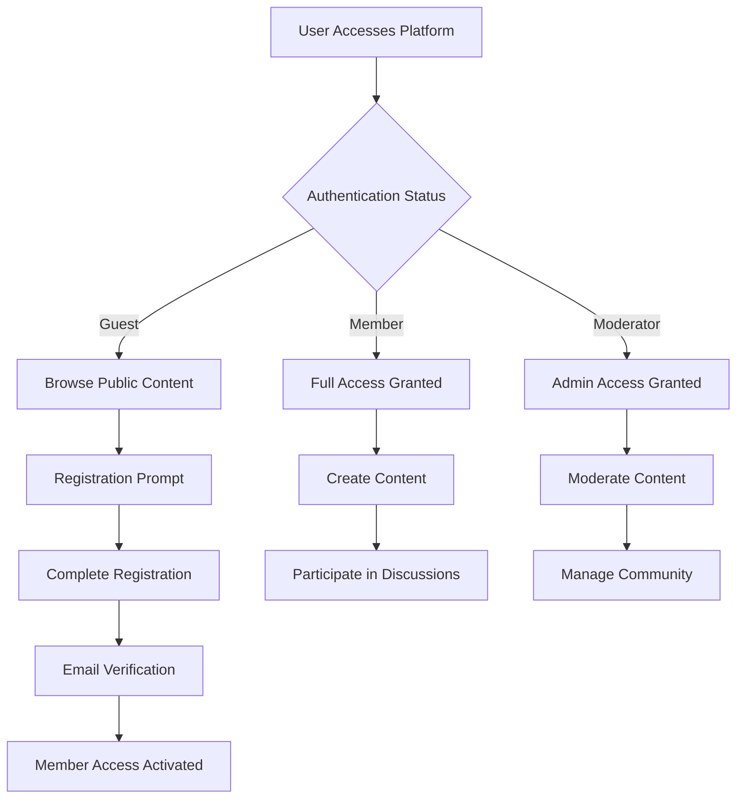

# Economic/Political Discussion Board Service Overview

## Executive Summary

This document outlines the business requirements for a simple economic and political discussion board platform designed to facilitate meaningful conversations around current events, policy discussions, and economic analysis. The platform provides a minimal yet functional environment where users can engage in civil discourse, share perspectives, and exchange ideas on important societal topics.

### Core Service Purpose
The discussion board exists to create a dedicated space for thoughtful economic and political conversations, addressing the need for structured online discourse that moves beyond social media noise and superficial engagement.

**WHEN users access the platform, THE system SHALL provide a clean, focused environment for substantive discussions.**
**WHERE users want to share detailed analysis, THE system SHALL support rich content with attachments.**
**WHILE maintaining simplicity, THE platform SHALL enable evidence-based conversations with proper citation support.**

## Business Model

### Why This Service Exists
Current online platforms often lack the structure needed for substantive economic and political discussions. Social media platforms prioritize engagement over depth, while specialized forums can be overly complex. This service fills the gap by providing:

- **Structured Discourse**: Organized discussion threads that encourage thoughtful conversation
- **Attachment Support**: Ability to share supporting documents, charts, and images
- **Minimal Design**: Clean interface that focuses on content rather than features
- **Civil Environment**: Platform designed to foster respectful debate and information sharing

### Revenue Strategy
As a simple discussion board, the initial focus is on building community rather than monetization. Future revenue opportunities may include:
- Voluntary member contributions
- Sponsored content sections (clearly marked)
- Premium features for power users (optional)
- Educational partnerships

**WHEN the platform reaches 10,000 active users, THE business SHALL evaluate sustainable revenue models.**
**IF voluntary contributions cover operational costs, THEN THE platform SHALL remain free for basic features.**
**WHERE sponsorship opportunities arise, THE system SHALL maintain clear separation between sponsored and organic content.**

### Growth Plan
- **Phase 1**: Launch with core discussion features and basic moderation
- **Phase 2**: Grow community through targeted content and user acquisition
- **Phase 3**: Expand features based on user feedback and engagement patterns

**THE growth strategy SHALL prioritize community quality over rapid expansion.**
**WHEN user feedback indicates feature needs, THE development team SHALL evaluate against simplicity criteria.**

### Success Metrics
- **User Engagement**: Daily active users, posts per user, comment frequency
- **Content Quality**: Average post length, citation frequency, meaningful interactions
- **Community Health**: Low moderation intervention rate, positive user feedback
- **Retention**: User return rate, session duration, feature adoption

**WHEN measuring success, THE system SHALL track:
- 70% user retention at 30 days
- Average of 2 posts per active user per month
- Less than 5% of content requiring moderator intervention**

## Target Audience

### Primary User Groups

#### Economic Professionals
- **Needs**: Platform for discussing market trends, policy impacts, and economic analysis
- **Value**: Ability to share data, charts, and research with peers
- **Behavior**: Data-driven discussions with supporting evidence

**WHEN economic professionals use the platform, THE system SHALL support detailed data sharing and analysis.**
**WHERE complex economic concepts are discussed, THE platform SHALL enable clear communication with supporting evidence.**

#### Political Enthusiasts
- **Needs**: Space for policy debate, election analysis, and governance discussions
- **Value**: Structured conversation around political events and legislation
- **Behavior**: Issue-focused discussions with diverse perspectives

**WHEN political discussions occur, THE system SHALL maintain civil discourse through clear moderation guidelines.**
**WHERE controversial topics arise, THE platform SHALL provide tools for respectful debate.**

#### General Interest Users
- **Needs**: Access to informed discussions without technical barriers
- **Value**: Learning opportunity from subject matter experts
- **Behavior**: Reading and occasional participation in accessible topics

**WHEN general interest users participate, THE system SHALL provide accessible entry points to complex discussions.**
**WHERE newcomers join conversations, THE platform SHALL offer guidance on community norms.**

### User Needs Analysis
- **Information Sharing**: Ability to post detailed analysis with supporting materials
- **Civil Discourse**: Environment that encourages respectful debate
- **Content Discovery**: Easy navigation to relevant discussions
- **Community Building**: Connection with like-minded individuals

**THE platform SHALL meet these user needs through:
- Simple attachment upload functionality
- Clear content categorization
- Intuitive search and discovery tools
- Transparent community guidelines**

## Core Value Proposition

### Differentiating Factors

#### Simplicity Over Complexity
Unlike traditional forums with complex hierarchies and feature overload, this platform prioritizes:
- **Minimal Interface**: Clean design that doesn't distract from content
- **Straightforward Navigation**: Intuitive category structure
- **Essential Features Only**: Focus on core discussion capabilities

**WHEN users access the platform, THE experience SHALL feel straightforward and unintimidating.**
**WHERE feature requests arise, THE team SHALL evaluate against the core value of simplicity.**

#### Content-First Approach
The platform emphasizes:
- **Attachment Support**: Rich content sharing with images and documents
- **Thread Organization**: Logical conversation flow
- **Quality Over Quantity**: Features that encourage substantive posts

**WHEN users create content, THE system SHALL prioritize substance over brevity.**
**WHERE attachments enhance understanding, THE platform SHALL make sharing effortless.**

#### Community-Centric Design
- **Respectful Environment**: Tools and policies that foster civil discourse
- **User Empowerment**: Simple moderation and content management
- **Transparent Operations**: Clear guidelines and consistent enforcement

**THE community design SHALL ensure:
- 95% of users feel discussions remain respectful
- Moderation actions are clearly explained
- Users understand platform rules and expectations**

## Key Features

### Core Discussion Capabilities

#### Post Creation and Management
- Users can create discussion threads with titles and detailed content
- Support for rich text formatting to enhance readability
- Ability to categorize posts by topic (economics, politics, policy, etc.)
- Post editing within reasonable time limits
- Draft saving for longer compositions

**WHEN a member creates a post, THE system SHALL:
- Validate title length (10-200 characters)
- Require minimum content length (50 characters)
- Support basic text formatting options
- Allow category selection from predefined options**

**IF a post violates community guidelines, THEN THE system SHALL:
- Flag for moderator review
- Provide clear explanation to the author
- Offer appeal process if content is removed**

#### Comment System
- Nested replies to maintain conversation context
- Voting system to highlight valuable contributions
- Quote functionality for responding to specific points
- Notification system for engagement tracking

**WHEN users comment on discussions, THE system SHALL:
- Support up to 3 levels of nested replies
- Provide voting mechanisms to highlight quality content
- Enable quote functionality for specific responses
- Notify users of replies to their comments**

#### Attachment Handling
- Image upload support for charts, graphs, and visual evidence
- Document attachment for research papers, reports, and data
- File size limits with clear error messaging
- Preview functionality for attached content

**WHEN users upload attachments, THE system SHALL:
- Accept images up to 5MB (JPG, PNG, GIF)
- Accept documents up to 10MB (PDF, DOC, TXT)
- Limit to 3 attachments per post
- Provide clear error messages for invalid files**

**IF an attachment exceeds size limits, THEN THE system SHALL:
- Reject the upload immediately
- Show maximum size requirements
- Suggest file compression options**

### Content Organization

#### Category Structure
- **Economics**: Market discussions, economic policy, financial analysis
- **Politics**: Election coverage, legislation, governance topics
- **Policy**: Specific policy proposals and their impacts
- **International**: Global economic and political developments

**WHEN users browse content, THE system SHALL:
- Display clear category navigation
- Show recent discussions in each category
- Provide category-specific search functionality
- Maintain consistent organization across the platform**

#### Search and Discovery
- Basic search functionality across posts and comments
- Category-based browsing for topic exploration
- Trending discussions visibility
- User content history and activity tracking

**WHEN users search for content, THE system SHALL:
- Return relevant results within 1 second
- Highlight matching terms in results
- Provide filtering options by date and category
- Maintain search history for repeated queries**

### User Management

#### Authentication System
- Simple email-based registration
- Profile management with basic information
- Privacy controls for user data
- Account recovery and security features

**WHEN users register, THE system SHALL:
- Require email verification before full access
- Collect minimal required information
- Provide clear privacy controls
- Offer straightforward account recovery options**

#### Permission Levels
- **Guest Users**: Read-only access to public content
- **Members**: Full participation rights including posting and commenting
- **Moderators**: Content management and community oversight

**THE permission system SHALL ensure:
- Guests can browse without barriers
- Members have clear participation paths
- Moderators have efficient content management tools
- Permission boundaries are strictly enforced**

## Success Metrics

### Quantitative Measures
- **User Base Growth**: Monthly new user registrations
- **Engagement Rate**: Posts and comments per active user
- **Content Volume**: New discussions created weekly
- **Attachment Usage**: Percentage of posts with supporting materials

**THE platform SHALL target:
- 1,000 registered users within 6 months
- Average of 5 posts per active user monthly
- 30% of posts including supporting attachments
- 70% user retention at 90 days**

### Qualitative Measures
- **Discussion Quality**: User feedback on conversation depth
- **Community Health**: Moderation intervention frequency
- **User Satisfaction**: Net promoter score and retention rates
- **Content Relevance**: Alignment with economic/political focus

**WHEN measuring qualitative success, THE system SHALL:
- Collect user feedback through simple surveys
- Monitor moderation intervention rates
- Track content relevance through category analysis
- Measure user satisfaction through retention metrics**

### Platform Performance
- **Uptime**: System availability and reliability
- **Response Time**: Page load and interaction speed
- **Scalability**: Ability to handle growing user base
- **Mobile Experience**: Responsive design effectiveness

**THE platform performance SHALL meet:
- 99.5% uptime during peak hours
- Sub-3-second page loads for typical content
- Support for 500 concurrent users
- Effective mobile experience on all devices**

## Future Considerations

### Scalability Planning
While maintaining the "simple" design philosophy, the platform should be built with:
- **Modular Architecture**: Ability to add features without complexity
- **Performance Optimization**: Fast loading and smooth interaction
- **Content Moderation**: Scalable tools for community management

**WHEN planning for scalability, THE development team SHALL:
- Prioritize performance over feature complexity
- Implement modular architecture from inception
- Plan for content moderation scalability from day one**

### Feature Evolution
Based on user feedback and engagement patterns, potential enhancements include:
- Advanced search and filtering options
- User reputation systems
- Newsletter and notification preferences
- API access for third-party integrations

**IF user feedback indicates need for enhanced features, THEN THE team SHALL:
- Evaluate against simplicity criteria
- Prototype and test with user groups
- Implement only if clear user benefit demonstrated**

### Community Development
Long-term success depends on:
- Active moderation and community guidelines
- User education on effective discourse
- Regular feature updates based on user needs
- Transparent communication about platform changes

**THE community development strategy SHALL focus on:
- Maintaining the simple, focused discussion environment
- Growing organically based on user needs
- Avoiding feature bloat that compromises user experience
- Transparent communication about all platform changes**

## User Authentication and Security Requirements

### Authentication Workflow

### Security Requirements
**WHEN handling user data, THE system SHALL:
- Encrypt sensitive information at rest
- Use secure transmission protocols
- Implement proper access controls
- Maintain audit trails for security events**

**IF security incidents occur, THEN THE system SHALL:
- Notify affected users promptly
- Implement immediate security patches
- Conduct post-incident analysis
- Enhance security measures based on lessons learned**

## Error Handling and User Support

### User-Facing Error Scenarios
**WHEN users encounter errors, THE system SHALL provide:
- Clear, actionable error messages
- Specific guidance for resolution
- Alternative actions when possible
- Support contact information for persistent issues**

**Common error scenarios include:
- Attachment upload failures
- Content submission errors
- Authentication problems
- Search functionality issues**

### Recovery Processes
**FOR each error type, THE system SHALL offer:
- Step-by-step recovery guidance
- Automated retry mechanisms where appropriate
- Data preservation during error recovery
- Clear success confirmation upon resolution**

> *Developer Note: This document defines **business requirements only**. All technical implementations (architecture, APIs, database design, etc.) are at the discretion of the development team.*