**discussionBoard — Business concepts, relationships, and states from user perspective**

Business concepts, relationships, and states from user perspective

# Domain Concepts

Describe what each concept means to users and why it exists.

## User Concept

A user is anyone who participates in the economic and political discussion board community. Users create identities through registration with email and password, establishing their presence on the platform. Each user manages a personal profile containing their display name and biographical information that represents them to other community members. Users actively engage by writing articles on various topics and participating in discussions through comments. They can browse content organized by sections and interact with other users' contributions. Users have control over their own content, being able to edit or delete articles and comments they've created. The system tracks each user's contributions, displaying their articles and comments on their public profile. Users can also aspire to become administrators by submitting requests that describe their qualifications and motivations for taking on community management responsibilities.

### User Registration Process

### User Registration Process

WHEN a guest creates a user account, THE system SHALL:
1. Require a valid email address
2. Require a password meeting minimum security requirements
3. Generate a unique display name if not provided
4. Create a default bio if not provided
5. Send a confirmation email to verify the email address
6. Set the initial account status as active

IF the email address is already registered, THE system SHALL reject the registration.
IF the password does not meet security requirements, THE system SHALL reject the registration.

### Account Creation Flow
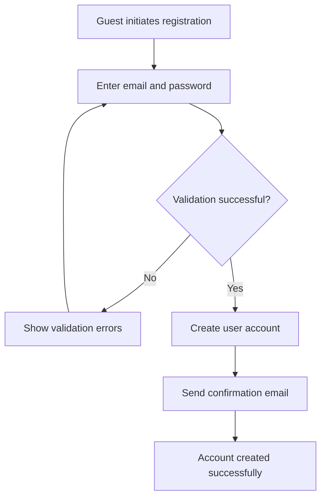

### User Authentication

### User Authentication

WHEN a user attempts to log in, THE system SHALL:
1. Verify the email address exists in the system
2. Validate the password matches the stored credentials
3. Create a secure session for authenticated access
4. Redirect the user to their personalized dashboard

IF the email address is not registered, THE system SHALL reject the login attempt.
IF the password is incorrect, THE system SHALL reject the login attempt.
IF the user account is banned, THE system SHALL reject the login attempt.

WHEN a user requests to change their password, THE system SHALL:
1. Require verification of the current password
2. Validate the new password meets security requirements
3. Update the password securely
4. Send a confirmation email to the user

### Password Change Flow
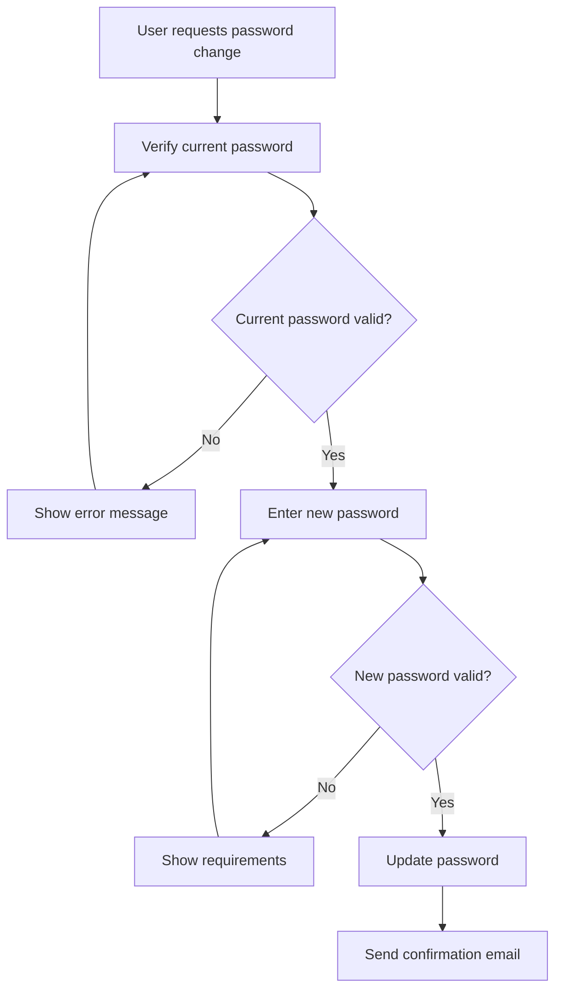

### User Profile Management

### User Profile Management

WHEN a user views their own profile, THE system SHALL display:
1. Their current display name and bio
2. Complete list of articles they have authored
3. Complete list of comments they have written
4. Profile creation and last update timestamps

WHEN a user edits their profile, THE system SHALL:
1. Allow modification of display name
2. Allow modification of bio text
3. Require display name to be non-empty
4. Update the profile modification timestamp

WHEN a user views another user's profile, THE system SHALL display:
1. The other user's display name and bio
2. Public list of articles authored by that user
3. Public list of comments written by that user

IF the display name is empty during editing, THE system SHALL reject the update.

### Profile Viewing Flow
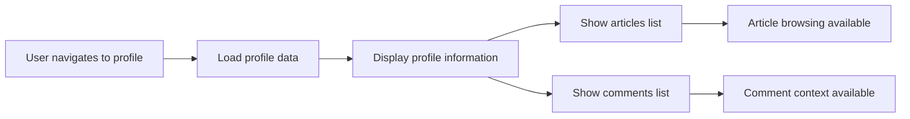

### Content Authorship

### Content Authorship

WHEN a user creates an article, THE system SHALL:
1. Associate the article with the creating user
2. Record the creation timestamp
3. Track the user as the original author
4. Maintain ownership for editing and deletion

WHEN a user creates a comment, THE system SHALL:
1. Associate the comment with the creating user
2. Record the creation timestamp
3. Track the user as the comment author
4. Maintain ownership for editing and deletion

WHEN a user edits their content, THE system SHALL:
1. Verify the user owns the content
2. Update the modification timestamp
3. Preserve the original authorship attribution
4. Maintain the content's public visibility

WHEN a user deletes their content, THE system SHALL:
1. Verify the user owns the content
2. Remove the content from public view
3. Update the user's contribution counts
4. Maintain system integrity by removing orphaned relationships

### Content Creation Flow
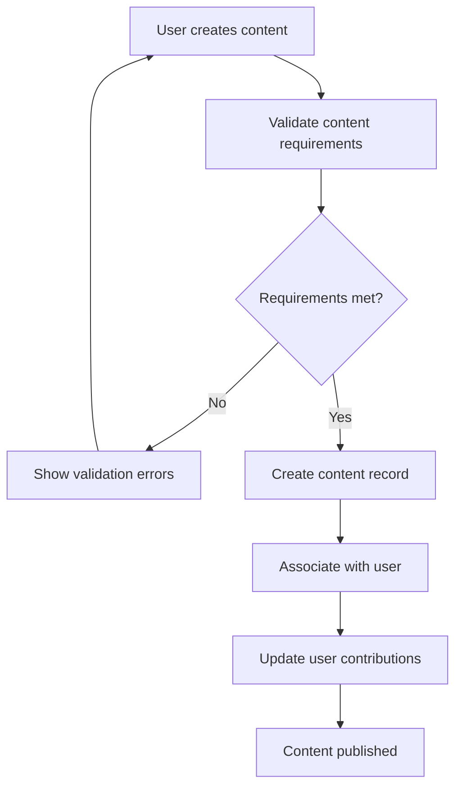

### Community Participation

### Community Participation

WHEN a user participates in community discussions, THE system SHALL:
1. Track their engagement through article creation
2. Track their interaction through comment writing
3. Display their activity on their public profile
4. Enable social interaction through content responses

WHEN a user browses community content, THE system SHALL:
1. Provide access to all public articles
2. Enable viewing of all public comments
3. Allow searching and filtering of content
4. Support content discovery through sections

WHEN a user interacts with other users' content, THE system SHALL:
1. Maintain attribution to original authors
2. Enable respectful community engagement
3. Support constructive discussion through comments
4. Preserve the integrity of conversations

### Community Engagement Flow
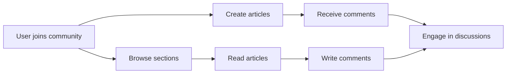

### Administrator Requests

### Administrator Requests

WHEN a user submits a request to become an administrator, THE system SHALL:
1. Require a reason text explaining their motivation
2. Set the request status as pending
3. Associate the request with the submitting user
4. Make the request visible to super administrators

WHILE an administrator request is pending, THE system SHALL:
1. Maintain the request in the review queue
2. Allow super administrators to view request details
3. Prevent duplicate requests from the same user
4. Preserve the original submission timestamp

WHEN a super administrator reviews a request, THE system SHALL:
1. Display the user's profile and contribution history
2. Show the reason text provided by the user
3. Enable approval or rejection of the request
4. Update the user's administrative status accordingly

IF a request is approved, THE system SHALL grant administrator privileges to the user.
IF a request is rejected, THE system SHALL maintain the user's current member status.

### Administrator Request Flow
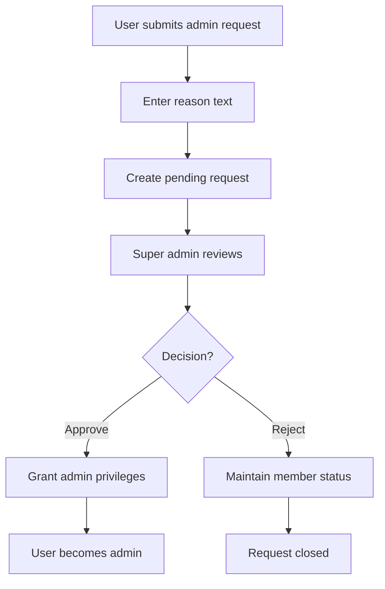

### Contribution Tracking

### Contribution Tracking

THE system SHALL track each user's contributions including:
1. Total number of articles authored
2. Total number of comments written
3. Timestamp of most recent activity
4. Distribution of contributions across sections

WHEN a user creates new content, THE system SHALL:
1. Increment their contribution counters
2. Update their last activity timestamp
3. Refresh their public profile statistics
4. Maintain accurate contribution history

WHEN a user deletes their content, THE system SHALL:
1. Decrement their contribution counters
2. Update their activity statistics
3. Maintain historical accuracy
4. Preserve system integrity

WHEN viewing a user's profile, THE system SHALL display:
1. Complete list of their published articles
2. Complete list of their published comments
3. Contribution statistics and activity patterns
4. Community engagement metrics

### Contribution Tracking Flow
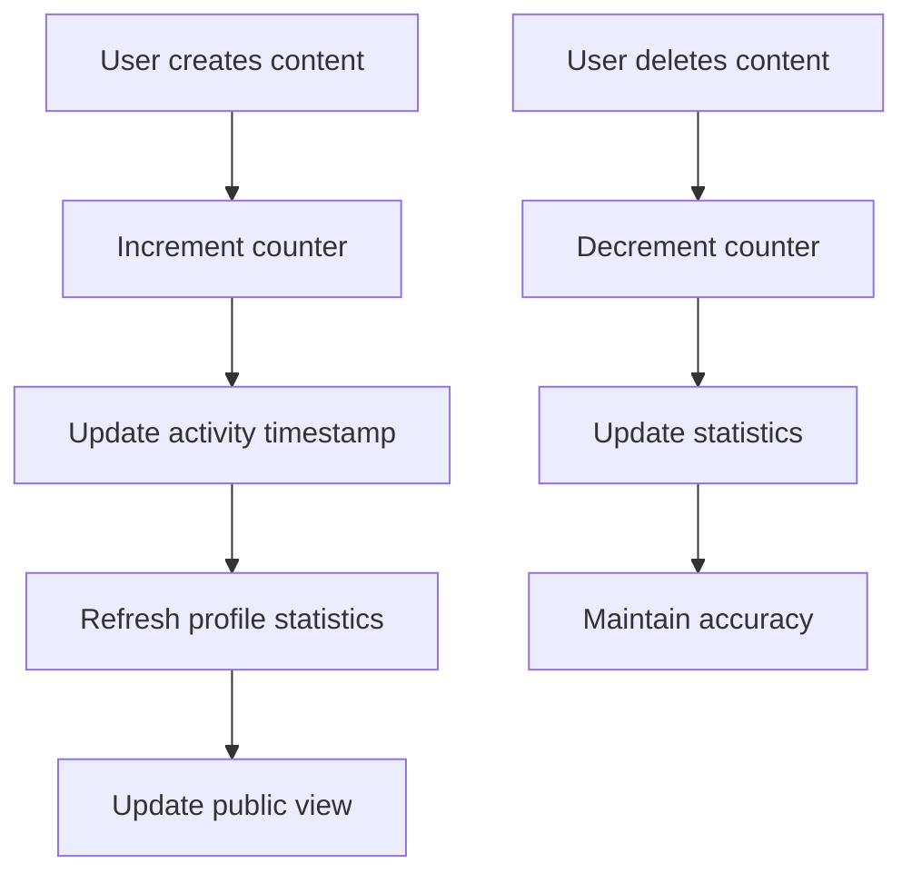

## Article Concept

Articles are the primary content format where users share detailed thoughts and analysis on economic and political topics. Each article represents a substantial contribution to the discussion board, allowing authors to present thorough arguments and perspectives. Users create articles by selecting appropriate sections that categorize their content by subject matter like Politics or Economy. Articles include descriptive titles, detailed text content, and organizational tags that help readers discover related discussions. Authors can enhance their articles with attached files and images that provide supporting evidence or visual context. Readers browse articles through section listings or search functionality to find topics of interest. Articles serve as conversation starters, with readers engaging through comments that build upon the original discussion. The system organizes articles chronologically and maintains metrics like comment counts to indicate engagement levels.

### Article Creation Process

### Content Creation and Publishing

WHEN a user creates an article, THE system SHALL:
1. Require a title that describes the article's topic
2. Require content that contains the user's detailed analysis or discussion
3. Require selection of a section that categorizes the article by topic
4. Automatically record the creation timestamp
5. Associate the article with the creating user

IF the title is missing, THE system SHALL prevent article creation.
IF the content is missing, THE system SHALL prevent article creation.
IF no section is selected, THE system SHALL prevent article creation.

WHEN an article is successfully created, THE system SHALL make it immediately visible to other users.

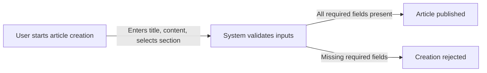

### Article Categorization

### Topic Categorization and Section-Based Organization

THE system SHALL organize articles by sections representing economic and political topics.

WHEN browsing articles, THE system SHALL:
1. Allow users to view articles grouped by section
2. Display section name and description for context
3. Enable filtering to show only articles from specific sections
4. Maintain consistent categorization across all articles

WHEN a user creates an article, THE system SHALL:
1. Present available sections for selection
2. Ensure the article inherits the selected section's categorization
3. Prevent articles from being assigned to non-existent sections

IF a section is deleted, THE system SHALL handle existing articles according to retention policies.

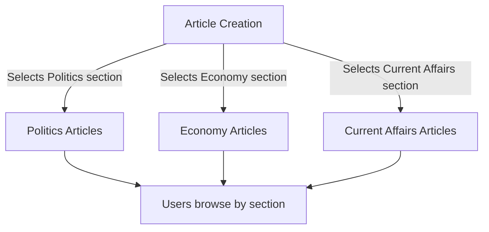

### Article Enhancement

### File Attachments and Tag Organization

WHEN a user enhances an article, THE system SHALL:
1. Allow attachment of multiple files to support content
2. Allow attachment of multiple images for visual context
3. Enable addition of free-text tags for content organization
4. Support editing of attachments and tags after publication

THE system SHALL maintain all attachments and tags associated with each article.

WHEN viewing an article, THE system SHALL:
1. Display all attached files and images
2. Show all tags associated with the article
3. Enable downloading of attached files
4. Use tags for content discovery and filtering

IF an article is deleted, THE system SHALL remove all associated attachments and tags.

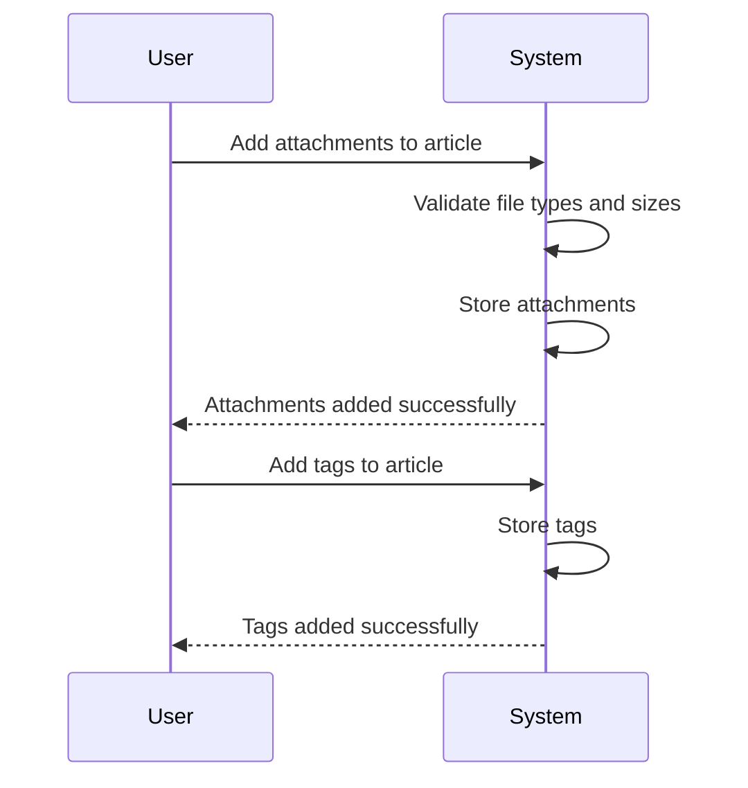

### Article Discovery

### Content Discovery and Reader Engagement

THE system SHALL provide multiple methods for article discovery:

WHEN users browse articles, THE system SHALL:
1. Display article lists showing title, author, tags, comment count, and timestamp
2. Support pagination for efficient browsing
3. Allow sorting by newest or oldest articles
4. Enable searching by title or content text
5. Support filtering articles by tags

WHEN viewing search results, THE system SHALL:
1. Display matching articles with relevant context
2. Maintain pagination for search results
3. Highlight search terms in results

THE system SHALL ensure content discovery mechanisms work across all sections.

IF no articles match search criteria, THE system SHALL display appropriate empty state messaging.

### Article Engagement

### Discussion Initiation and Content Metrics

WHEN an article is published, THE system SHALL:
1. Serve as a discussion starter for community engagement
2. Enable readers to write comments on the article
3. Track comment count as an engagement metric
4. Display engagement metrics to readers

THE system SHALL maintain accurate engagement metrics including:
1. Comment count for each article
2. Timestamp of most recent comment
3. Author information for context

WHEN users view an article, THE system SHALL:
1. Display full article content with all enhancements
2. Show all comments in chronological order
3. Present engagement metrics prominently
4. Enable comment functionality for authenticated users

THE system SHALL ensure articles remain accessible for ongoing discussion and engagement.

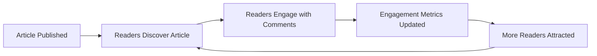

## Comment Concept

Comments enable interactive discussion by allowing users to respond directly to articles with their perspectives and reactions. Each comment represents an individual contribution to the ongoing conversation around an article's topic. Users write comments to express agreement, disagreement, or additional insights related to the original content. Comments appear in chronological order beneath articles, creating a linear discussion flow that readers can follow. Authors can edit their comments to refine their expressions or correct misunderstandings. The comment system facilitates community dialogue without nested replies, keeping discussions focused and accessible. Comments are tied to user profiles, allowing readers to see all contributions from specific community members. This single-level commenting structure encourages direct engagement with article content rather than branching conversations.

### Comment Creation and Publishing

### Comment Creation and Publishing

WHEN a user creates a comment on an article, THE system SHALL:
1. Require comment content text
2. Associate the comment with the creating user
3. Associate the comment with the target article
4. Record the creation timestamp
5. Make the comment immediately visible to other users

IF the comment content is empty, THE system SHALL reject the comment creation.
IF the target article does not exist, THE system SHALL reject the comment creation.
IF the user is banned, THE system SHALL reject the comment creation.

WHEN a user edits their comment, THE system SHALL:
1. Allow modification of comment content
2. Record the update timestamp
3. Preserve the original creation timestamp
4. Update the comment visibility immediately

WHEN a user deletes their comment, THE system SHALL:
1. Remove the comment from public view
2. Disassociate the comment from the user and article
3. Remove the comment from all user profile listings

THE system SHALL allow users to view their own comment editing history.
THE system SHALL preserve comment content integrity during editing operations.

### Conversation Flow and Chronological Ordering

### Conversation Flow and Chronological Ordering

WHEN users view comments on an article, THE system SHALL:
1. Display comments in chronological order (oldest first)
2. Show author display name for each comment
3. Show comment creation timestamp
4. Display comment content in full
5. Maintain consistent comment order across all users

WHILE displaying article comments, THE system SHALL:
1. Present comments as a linear sequence
2. Avoid nested reply structures
3. Maintain clear visual separation between comments
4. Preserve the temporal flow of discussion

THE system SHALL ensure comment ordering remains stable during user interactions.
THE system SHALL prevent comment reordering based on user preferences or voting.

IF new comments are added while viewing an article, THE system SHALL update the display to include them in chronological position.
IF comments are edited or deleted, THE system SHALL reflect these changes immediately in the display.

### User Engagement and Profile Linkage

### User Engagement and Profile Linkage

WHEN viewing a user's profile, THE system SHALL:
1. Display a list of all comments written by that user
2. Show comment content previews
3. Link each comment to its parent article
4. Display comment creation timestamps
5. Allow navigation to the parent article from comment listings

WHEN users interact with comments, THE system SHALL:
1. Link comment author names to their user profiles
2. Allow users to view any comment author's profile
3. Display consistent author information across all comments
4. Maintain profile linkage even if user details change

THE system SHALL track comment authorship accurately across all operations.
THE system SHALL update user profile comment listings when comments are created, edited, or deleted.

IF a user deletes their account, THE system SHALL remove all their comments from public view.
IF a user changes their display name, THE system SHALL update the display name on all their existing comments.

### Discussion Moderation and Community Interaction

### Discussion Moderation and Community Interaction

WHEN administrators moderate comments, THE system SHALL:
1. Allow administrators to delete any comment
2. Record the administrator who performed the moderation action
3. Remove deleted comments from public view immediately
4. Preserve comment content for administrative review purposes

WHEN users participate in discussions, THE system SHALL:
1. Enable direct response to article content through comments
2. Facilitate community dialogue around economic and political topics
3. Support diverse perspectives through comment contributions
4. Maintain civil discourse through content guidelines

THE system SHALL provide clear indicators of comment authorship and timestamps.
THE system SHALL enable users to engage with content through comment contributions.

IF inappropriate comments are posted, THE system SHALL allow administrators to remove them.
IF discussion becomes heated, THE system SHALL maintain chronological order to preserve conversation context.

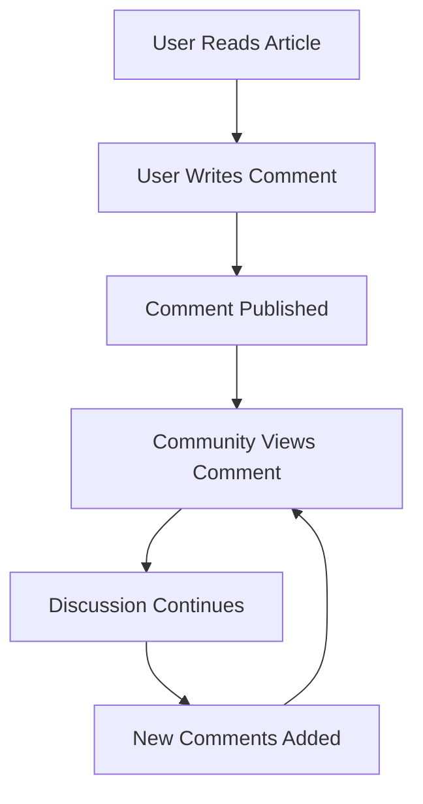

## Section Concept

Sections organize discussions into thematic categories that help users navigate content by subject matter. Each section represents a dedicated area for specific topics like Politics, Economy, or Current Affairs, providing organizational structure to the platform. Users browse sections to find articles aligned with their interests, with clear descriptions explaining each section's focus. When creating articles, users select appropriate sections to ensure their content reaches the relevant audience. Sections help maintain focused discussions by grouping related content together for efficient discovery. Administrators manage sections to reflect the evolving interests and discussions within the community. The section system enables users to follow specific areas of interest while contributing to organized, topic-focused conversations.

### Section Definition and Purpose

Sections provide thematic organization of content by categorizing articles into distinct topic areas. Each section represents a business category for content classification.

THE system SHALL maintain sections as distinct thematic groupings for content organization.
WHEN a user views the discussion board, THE system SHALL present available sections for content categorization.
WHERE sections exist, THE system SHALL ensure each article belongs to exactly one section for thematic grouping.

Sections establish community structure by grouping users with shared interests around specific topics. Each section's description explains its thematic focus and purpose to users.

THE system SHALL display section descriptions to inform users about each section's thematic specialization.
WHEN a user creates an article, THE system SHALL require selection of an appropriate section for content categorization.
IF a section has no articles, THE system SHALL still display it as available for thematic organization.

### Section Browsing and Navigation

Users navigate the platform through topic-based navigation using sections as primary organizational units.

WHEN a user selects a section, THE system SHALL display articles belonging to that section for topic-based navigation.
THE system SHALL provide section browsing capabilities that allow users to explore content by thematic grouping.

Users can efficiently navigate between sections to discover content aligned with their interests. The section structure enables focused exploration of specific topics.

WHEN a user browses sections, THE system SHALL present sections in a navigable format for user navigation.
THE system SHALL maintain consistent section availability across all user navigation paths.
IF a section becomes unavailable, THE system SHALL prevent new article creation in that section while preserving existing content.

Section navigation supports user experience by providing clear pathways to topic-specialized content areas.

### Content Discovery Through Sections

Sections facilitate content discovery by organizing articles into thematic groupings that match user interests.

THE system SHALL enable content discovery through section-based filtering and browsing.
WHEN users explore sections, THE system SHALL present articles organized by thematic grouping for efficient discovery.

Each section represents a topic specialization area where users can find relevant discussions. The section system supports discovery of content matching specific interests.

THE system SHALL ensure sections reflect current discussion topics for effective content discovery.
WHERE sections contain articles, THE system SHALL provide browsing mechanisms that support thematic grouping exploration.
IF a user searches for content, THE system SHALL consider section membership as part of the discovery process.

Topic specialization within sections helps users locate content that aligns with their specific interests and expertise areas.

### Administrative Section Management

Administrative management of sections ensures the platform's thematic organization remains relevant and well-maintained.

WHEN administrators create sections, THE system SHALL require name and description for proper thematic organization.
THE system SHALL allow administrative management of section properties to maintain community structure.

Administrators can adjust section definitions to reflect evolving discussion topics and user interests. This management supports the platform's ability to serve changing community needs.

WHEN administrators edit sections, THE system SHALL preserve existing article-section associations unless explicitly changed.
THE system SHALL prevent administrative actions that would compromise content categorization integrity.
IF a section is deleted through administrative management, THE system SHALL handle existing articles according to established business rules.

Administrative section management ensures the platform's thematic organization remains effective for user navigation and content discovery.

## Attachment Concept

Attachments allow users to enhance their articles with supporting documents and visual materials that complement their written content. Each attachment represents supplemental information that authors include to strengthen their arguments or provide evidence. Users attach files such as research documents, statistical data, or reference materials that support their economic or political analyses. Images can be attached to provide visual context, charts, or illustrations that enhance understanding of complex topics. Readers can download attachments to access the complete supporting materials referenced in articles. Attachments enrich discussions by allowing authors to share supplementary information beyond text content. The system handles multiple attachments per article, enabling comprehensive presentation of supporting evidence.

### Attachment Purpose and Functionality

## Attachment Purpose and Functionality

Attachments serve as supplementary materials that enrich article content by allowing authors to share supporting evidence, reference documents, and visual aids. They provide the business capability to extend discussion beyond textual content, enabling comprehensive presentation of complex economic and political analyses.

### Core Business Purpose

WHEN a member writes an economic or political analysis article, THE system SHALL allow attachment of supporting files to supplement the textual content.
WHEN a member authors an article requiring evidentiary support, THE system SHALL accept multiple file attachments including documents and images.
THE system SHALL enable members to enhance their articles' credibility through attached supporting documentation.

### File Supplementation and Enrichment

WHEN a member creates an article, THE system SHALL allow attachment of supplementary files including research documents, statistical data, and reference materials.
WHEN a member attaches a file to an article, THE system SHALL associate the attachment with the specific article for content enrichment.
WHEN a member views an article with attachments, THE system SHALL display available attachments as supporting materials for the article's content.

### Supporting Documentation Management

WHEN a member edits their article, THE system SHALL allow addition or removal of attachments to update supporting documentation.
IF a member attempts to attach an unsupported file type, THE system SHALL reject the upload attempt.
WHEN a member deletes their article, THE system SHALL remove all associated attachments.

### Business Value Flow

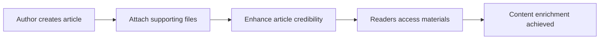

### Evidence and Reference Materials

## Evidence and Reference Materials

Attachments provide the business capability for authors to substantiate their arguments with verifiable evidence, references, and source materials. This enables evidence-based discussion where claims can be backed by documentation, fostering more credible economic and political discourse.

### Evidence Provision Requirements

WHEN a member includes citations or references in an article, THE system SHALL allow attachment of source documents as evidence.
WHEN a member cites statistical data, THE system SHALL permit attachment of original data files, charts, or visualizations.
THE system SHALL enable members to provide verifiable evidence for their economic or political arguments through document attachments.

### Reference Material Integration

WHEN a member references external research or publications, THE system SHALL allow attachment of reference material excerpts or summaries.
WHEN a member needs to provide background context, THE system SHALL accept attachment of historical documents, policy papers, or research studies.
THE system SHALL support both document and image formats for diverse reference material types.

### Business Rules for Evidence Sharing

IF an attached document contains private or confidential information, THE system SHALL assume the author has appropriate sharing permissions.
WHEN a member updates an article with new evidence, THE system SHALL allow replacement or addition of reference materials.
THE system SHALL consider attached evidence as integral to the article's analytical credibility.

### Multimedia Integration Standards

WHEN a member includes visual evidence, THE system SHALL accept image attachments such as charts, graphs, or photographs.
WHEN a member presents comparative data, THE system SHALL allow attachment of multiple visualization formats.
THE system SHALL treat image attachments as supplemental evidence, not primary article content.

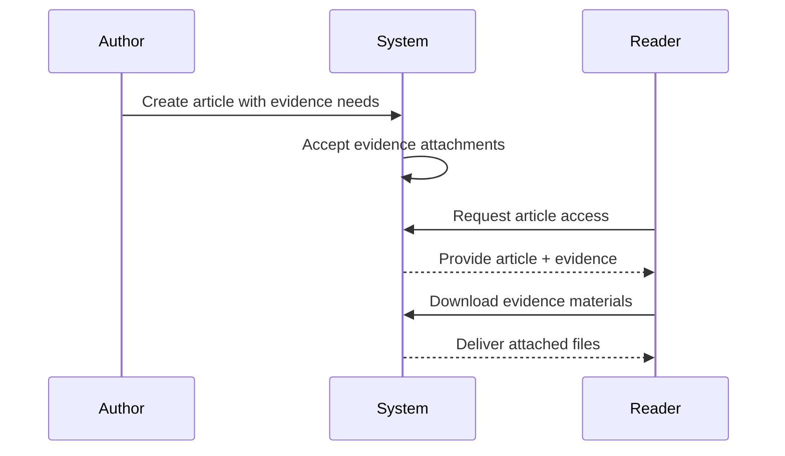

### User Interaction and Access

## User Interaction and Access

Attachments must be accessible to all readers for material download and visual support, enabling comprehensive engagement with article content. The business requires that supplementary materials be immediately available for download to support evidence verification and deeper understanding.

### Material Download Requirements

WHEN any user views an article with attachments, THE system SHALL display download options for each attached file.
WHEN a guest or member selects a file attachment, THE system SHALL initiate download of the complete file.
THE system SHALL ensure all attached materials remain available for download throughout the article's lifecycle.

### Visual Support Accessibility

WHEN an article contains image attachments, THE system SHALL provide visual preview capabilities where feasible.
WHEN a user downloads an image attachment, THE system SHALL deliver the complete image file in its original quality.
THE system SHALL treat image attachments as supplemental content that enhances article comprehension.

### Attachment Discovery and Access

WHEN users browse article lists, THE system SHALL indicate which articles have attachments through visual indicators.
WHEN users search for articles, THE system SHALL include articles with attachments in search results without special prioritization.
THE system SHALL maintain equal access to attachments for all users regardless of authentication status.

### Error Conditions for Attachment Access

IF a requested attachment no longer exists, THE system SHALL inform the user that the material is unavailable.
IF a user attempts to download an attachment without proper article access rights, THE system SHALL deny the request.
WHEN an article is deleted, THE system SHALL remove associated attachments from download availability.

### Content Enrichment Through Access

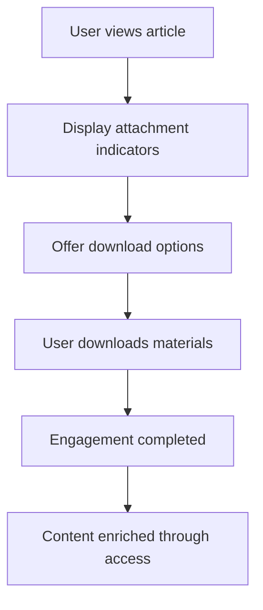

## AdminRequest Concept

AdminRequests represent users' applications to take on community management responsibilities as administrators. Each request demonstrates a user's willingness to contribute to platform governance and moderation. Users submit requests that include detailed explanations of their qualifications and motivations for wanting administrator privileges. These requests go through review by existing super administrators who evaluate applicants' suitability for community leadership roles. The request process ensures that administrators are selected based on demonstrated commitment and understanding of community needs. Approved requests result in users gaining administrative capabilities to help maintain discussion quality and platform integrity. This system allows community members to progress from participants to stewards of the discussion environment.

### Administrator Application Process

AdminRequests represent formal applications by community members seeking to contribute to platform governance. This process allows dedicated users to transition from participants to community stewards.

WHEN a member submits an administrator request, THE system SHALL:
1. Require a detailed reason explaining their qualifications and motivations
2. Record the submission timestamp
3. Set the request status to "pending"
4. Associate the request with the submitting user
5. Prevent duplicate pending requests from the same user

IF a user already has a pending admin request, THE system SHALL reject the new request.
IF the reason text is missing or empty, THE system SHALL reject the request.
IF the user is currently banned, THE system SHALL reject the request.

### Community Governance Framework

AdminRequests serve as the formal mechanism for community members to join governance structures. This framework ensures that administrators are selected through a merit-based review process.

THE system SHALL allow super administrators to:
1. View all pending admin requests
2. Review request details including user profile and submission history
3. Consider community contribution history during evaluation
4. Make approval/rejection decisions based on demonstrated commitment

WHEN evaluating admin requests, super administrators SHALL assess:
1. Quality and thoughtfulness of the reason statement
2. User's history of constructive discussion participation
3. Understanding of community guidelines and platform purpose
4. Potential for positive contribution to governance

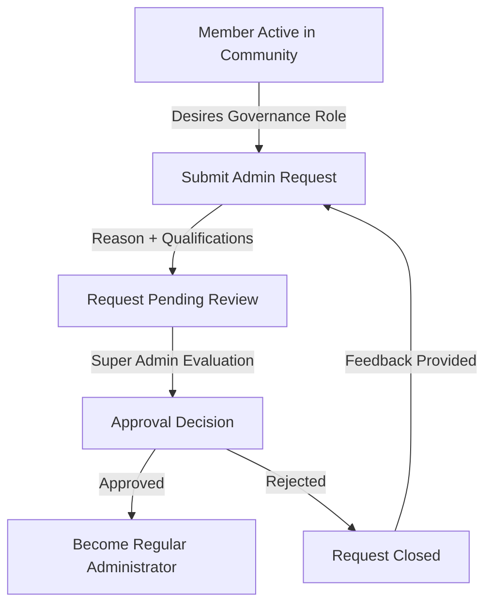

### Privilege Request Management

AdminRequests represent formal requests for enhanced privileges within the discussion platform. This system manages the transition from regular participation to governance responsibilities.

THE system SHALL maintain AdminRequest history showing:
1. All submitted requests with status changes over time
2. The specific user who submitted each request
3. The super administrators who approved or rejected each request
4. Timestamps for all status transitions

WHEN a super administrator approves an admin request, THE system SHALL:
1. Update the request status from "pending" to "approved"
2. Grant administrator privileges to the requesting user
3. Record the approving super administrator's identity
4. Preserve the request reason and original submission details

WHEN a super administrator rejects an admin request, THE system SHALL:
1. Update the request status from "pending" to "rejected"
2. Preserve the request details for historical reference
3. Record the rejecting super administrator's identity
4. Maintain visibility of rejected requests to the original submitter

### Leadership Progression Pathway

The AdminRequest system provides a structured pathway for community members to progress into leadership roles, ensuring qualified individuals can contribute to platform governance.

THE progression pathway SHALL consist of:
1. Active community participation (writing articles and comments)
2. Demonstration of constructive engagement and platform understanding
3. Formal request submission with justification
4. Peer review by existing super administrators
5. Privilege elevation upon successful approval

WHILE an admin request is pending, THE system SHALL:
1. Maintain the user's regular member status
2. Allow the user to continue all normal platform activities
3. Enable the user to view their request status
4. Prevent the user from submitting additional requests

WHEN a user transitions to administrator status, THE system SHALL:
1. Provide access to administrator capabilities
2. Maintain visibility of their original request and approval rationale
3. Allow continued participation in discussions as a regular user
4. Enable governance activities alongside community participation

### Request Review Workflow

AdminRequests undergo a deliberate review workflow where super administrators evaluate candidates' suitability for governance responsibilities.

WHEN viewing pending admin requests, super administrators SHALL see:
1. Complete request details including reason text
2. Submitting user's profile information
3. User's article and comment history
4. User's registration date and overall platform tenure
5. Previous admin request history (if any)

THE review workflow SHALL support:
1. Thorough evaluation of each candidate's qualifications
2. Comparative assessment of multiple pending requests
3. Consultation among super administrators when needed
4. Documentation of approval or rejection rationale

IF a super administrator requires additional information before deciding, they SHALL be able to:
1. Review the candidate's recent discussion contributions
2. Examine the candidate's adherence to community guidelines
3. Consider feedback from other community members (if available)
4. Request clarification from the candidate (through platform messaging)

```mermaid
sequenceDiagram
    participant M as Member
    participant S as System
    participant SA as Super Admin
    M->>S: Submit Admin Request
    S->>S: Validate & Store Request
    S-->>M: Confirmation
    S->>SA: Notification of Pending Request
    SA->>S: Review Request Details
    S-->>SA: Display User History
    SA->>SA: Evaluate Candidate
    alt Approved
        SA->>S: Approve Request
        S->>M: Grant Administrator Privileges
        S-->>M: Notification of Approval
    else Rejected
        SA->>S: Reject Request
        S-->>M: Notification of Rejection
    end

### Platform Stewardship Selection

AdminRequests facilitate the selection of community members who will become stewards of platform quality and discussion integrity.

THE system SHALL ensure selected administrators demonstrate:
1. Commitment to constructive discourse and informed debate
2. Understanding of economic and political discussion nuances
3. Respect for diverse perspectives within civil debate parameters
4. Willingness to invest time in community maintenance

WHEN evaluating stewardship potential, super administrators SHALL consider:
1. Quality of the candidate's previous discussions (depth, civility, evidence)
2. Consistency of positive community contributions over time
3. Alignment with platform values of informed economic/political discourse
4. Availability and responsiveness indicated in the request reason

THE system SHALL prevent stewardship assignment when:
1. A user has significant history of guideline violations
2. Recent discussions show patterns of uncivil behavior
3. The request reason demonstrates misunderstanding of platform purpose
4. The candidate appears motivated primarily by content control rather than community service

### Moderation Eligibility Criteria

AdminRequests establish eligibility requirements for users seeking moderation capabilities to maintain discussion quality.

THE system SHALL require users to meet baseline eligibility criteria before submitting admin requests:
1. Active participation in community discussions (articles and/or comments)
2. Minimum platform tenure demonstrating sustained engagement
3. No active bans or recent serious guideline violations
4. Demonstrated understanding of discussion topics through quality contributions

IF evaluating a user's moderation eligibility, THE system SHALL enable super administrators to assess:
1. Historical adherence to community guidelines and civil discourse standards
2. Ability to engage with diverse perspectives respectfully
3. Knowledge of economic and political discussion topics
4. Pattern of constructive rather than disruptive participation

THE system SHALL reject admin requests when the submitting user:
1. Has been banned within a recent timeframe
2. Shows patterns of inflammatory or low-quality contributions
3. Demonstrates misunderstanding of moderation responsibilities
4. Has previously submitted and been rejected for similar requests

### Community Contribution Recognition

AdminRequests recognize and formalize users' contributions to the discussion community, providing a pathway for dedicated members to take on greater responsibility.

THE system SHALL track community contributions that inform admin request evaluation:
1. Number and quality of articles published
2. Engagement in discussions through comments
3. Constructive interaction with other community members
4. Overall positive impact on discussion quality

WHEN a user submits an admin request, THE system SHALL highlight their community contributions to super administrators:
1. Prominent display of article count and comment activity
2. Summary of discussion topic expertise demonstrated
3. Pattern of civil discourse and respectful engagement
4. Consistency of participation over time

IF a user's contributions show exceptional community value, THE system SHALL enable super administrators to:
1. Recognize this value during request evaluation
2. Consider the user's demonstrated investment in platform success
3. Weight positive community impact alongside request reason quality
4. Prioritize candidates with proven commitment to discussion quality

### Administrator Promotion Process

AdminRequests initiate the promotion process where qualified community members ascend to governance roles with expanded capabilities and responsibilities.

WHEN an admin request is approved, THE system SHALL execute the promotion process:
1. Transition user's role from "member" to "administrator" (regular admin)
2. Grant access to administrative capabilities (section management, content moderation)
3. Preserve the original request as documentation of promotion rationale
4. Notify the user of their new status and responsibilities

THE promotion process SHALL ensure:
1. Clear documentation of why each user was promoted
2. Consistency in evaluation standards across all candidates
3. Preservation of institutional memory regarding administrator selection
4. Transparency about the criteria used for promotion decisions

WHEN a regular administrator demonstrates exceptional governance capability, super administrators SHALL be able to further promote them to super administrator status through a separate evaluation process beyond the initial admin request system.

### Governance Transition Mechanism

AdminRequests serve as the formal mechanism for transitioning users from community participants to governance participants, ensuring continuity in platform leadership.

THE governance transition SHALL maintain platform stability by:
1. Gradual introduction of new administrators rather than bulk promotions
2. Preservation of existing governance structures during transition
3. Mentoring opportunities between existing and new administrators
4. Clear documentation of transition decisions and rationales

WHILE transitioning users into governance roles, THE system SHALL:
1. Maintain clear separation between administrative and regular user activities
2. Preserve discussion history and community contributions unchanged
3. Ensure new administrators understand their responsibilities and limitations
4. Document the transition for future governance planning

IF governance transition creates operational challenges, THE system SHALL enable super administrators to:
1. Provide additional guidance and training to new administrators
2. Adjust responsibilities based on demonstrated capability
3. Re-evaluate promotion decisions if necessary
4. Maintain platform quality standards throughout the transition

THE governance transition mechanism SHALL support sustainable platform growth by ensuring qualified community members can assume leadership roles while maintaining discussion quality and community values.

# Domain Relationships

Describe how concepts relate to each other from a business perspective.

## Conceptual Relationships

Describe how concepts relate to each other in business terms.

### Fundamental Business Relationships

THE discussion board SHALL establish clear **ownership** and **associations** between business concepts to ensure proper content attribution and management.

**Key Relationships:**

```mermaid
graph TD
    U["User"] -->|owns| A["Article"]
    U["User"] -->|owns| C["Comment"]
    U["User"] -->|has one| R["AdminRequest"]
    A["Article"] -->|has many| ATT["Attachment"]
    A["Article"] -->|has many| C["Comment"]
    A["Article"] -->|belongs to| S["Section"]
    S["Section"] -->|has many| A["Article"]
```

WHEN content is created, THE system SHALL automatically establish **ownership** between the creating user and their content.
WHEN content requires categorization, THE system SHALL enforce **belongs-to** relationships between articles and sections.
WHEN content involves supplementary materials, THE system SHALL support **has-many** relationships between articles and attachments.
WHEN discussion threads form, THE system SHALL maintain **has-many** relationships between articles and comments.
WHERE a user requests administrative privileges, THE system SHALL track a **has-one** relationship for pending requests.

### Content Association Rules

THE system SHALL enforce specific **association** rules for content relationships from a business perspective.

WHEN a user creates an article, THE system SHALL:
1. Associate the article with the creating user as author (author **relationship**)
2. Associate the article with exactly one section (section **association**)
3. Allow optional tags to be associated with the article (tag **association**)
4. Allow multiple files and images to be associated with the article (attachment **association**)

WHEN a user writes a comment, THE system SHALL:
1. Associate the comment with the writing user as author (author **relationship**)
2. Associate the comment with exactly one article (article **association**)

IF a user attempts to create content without proper associations, THEN THE system SHALL reject the request.
WHERE a section contains articles, THE system SHALL maintain the **has-many** collection relationship without requiring manual maintenance.

### Ownership and Control Relationships

THE system SHALL manage **ownership** as a primary control mechanism for content management.

**Ownership Privileges:**
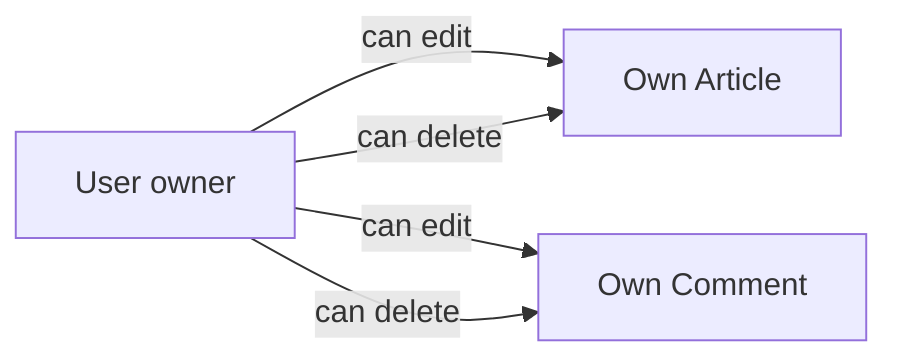

WHEN content is created, THE system SHALL establish permanent **ownership** of that content by the creating user.
WHEN a user manages their own profile, THE system SHALL respect the user's complete **ownership** of their profile information.
WHEN ownership rights are exercised, THE system SHALL allow the owner to edit or delete their own content.

**Administrative Override Relationships:**
WHILE functioning as an administrator, THE user SHALL have override **associations** with all content regardless of original ownership.
IF a user is banned, THEN THE system SHALL maintain original ownership **relationships** for historical content visibility purposes.
WHERE content requires deletion during account closure, THE system SHALL honor the **ownership** chain to identify all associated content.

### Hierarchical Section Relationships

THE system SHALL organize content through hierarchical **belongs-to** and **has-many** relationships between sections and articles.

**Section-Article Relationship Model:**
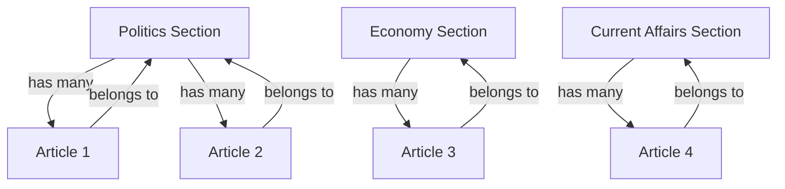

WHEN an article is created, THE system SHALL require it to **belong to** exactly one section.
WHEN browsing section content, THE system SHALL retrieve all articles that have a **belongs-to** relationship with that section.
WHEN a section is deleted by an administrator, THEN THE system SHALL handle the **has-many** relationship by establishing appropriate policies for existing articles (see deletion policies).
WHERE section organization changes occur, THE system SHALL maintain all **relationship** mappings to preserve content categorization.

### Profile-Content Relationship Mapping

THE system SHALL establish bidirectional **relationship** mappings between user profiles and user-generated content.

**Profile Display Relationships:**
WHEN viewing a user profile, THE system SHALL:
1. Display all articles that have an author **relationship** with that user
2. Display all comments that have an author **relationship** with that user
3. Maintain the integrity of the **has-many** relationship between users and their authored content
4. Display content in reverse chronological order based on creation time

**Content Attribution Relationships:**
WHEN displaying any article, THE system SHALL indicate the author's display name and link to their profile through the established **ownership** relationship.
WHEN displaying any comment, THE system SHALL indicate the author's display name and link to their profile through the comment **association**.

**Relationship Persistence:**
WHERE user account deletion occurs, THE system SHALL respect the **ownership** chain by removing all associated content relationships.
IF content remains after user actions (such as banning), THEN THE system SHALL preserve the original **relationship** information for historical accuracy.

## Lifecycle and Retention

Describe business rules for concept lifecycle and data retention from a user perspective.

### User Account Lifecycle

### User Account Lifecycle

THE system SHALL define distinct states for user accounts to represent their lifecycle from creation to termination.

WHEN a user registers successfully, THE system SHALL create a new account in "active" state.

WHEN a user authenticates successfully, THE system SHALL permit access to all member capabilities while the account remains in "active" state.

IF an administrator issues a ban, THE user account SHALL transition to "banned" state.
WHILE an account is in "banned" state, THE system SHALL prevent the user from authenticating and accessing member capabilities.

WHEN a user requests account deletion, THE system SHALL transition their account to "deletion-pending" state.
WHERE account deletion has been requested, THE system SHALL schedule permanent removal of the account and all associated content after a verification period.

WHEN an administrator lifts a ban, THE user account SHALL return to "active" state, restoring the user's access to member capabilities.

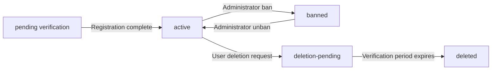

WHERE a user account is in "deleted" state, THE system SHALL have permanently removed all personally identifiable information while retaining anonymized contributions to discussions.

### Content Lifecycle Management

### Content Lifecycle Management

THE system SHALL maintain distinct lifecycle states for articles and comments to track their availability to the community.

WHEN a user creates an article, THE system SHALL set its state to "published" and make it immediately visible to authorized users.
WHEN a user creates a comment, THE system SHALL similarly set its state to "published" and make it visible on the associated article.

WHILE an article or comment is in "published" state, THE system SHALL allow its author to edit the content.
WHILE an article or comment is in "published" state, THE system SHALL allow administrators to delete it regardless of authorship.

WHEN an author deletes their own published content, THE system SHALL transition it to "user-deleted" state.
WHERE content is in "user-deleted" state, THE system SHALL remove it from public view while retaining it in recoverable storage for a defined retention period.

WHEN an administrator deletes content, THE system SHALL transition it to "admin-deleted" state.
WHERE content is in "admin-deleted" state, THE system SHALL remove it from public view and prevent restoration by the original author.

WHEN a user account is permanently deleted, ALL articles and comments they authored SHALL transition to "orphaned" state.
WHERE content is in "orphaned" state, THE system SHALL display it with anonymized authorship attribution.

```mermaid
flowchart TD
    A["draft"] -->|"Author publishes"| B["published"]
    B -->|"Author deletes"| C["user-deleted"]
    B -->|"Administrator deletes"| D["admin-deleted"]
    C -->|"Retention period expires"| E["permanently deleted"]
    D -->|"No recovery"| F["permanently removed"]
    B -->|"Author account deleted"| G["orphaned"]
```

### Administrator Privilege Lifecycle

### Administrator Privilege Lifecycle

THE system SHALL manage administrator privileges through a formal request and approval process with defined states.

WHEN a member submits an administrator request, THE system SHALL create a request in "pending" state.
WHERE an administrator request is in "pending" state, THE system SHALL make it visible to super administrators for review.

WHEN a super administrator approves a pending request, THE system SHALL:
1. Transition the request to "approved" state
2. Grant regular administrator privileges to the requesting user
3. Notify the user of their new privileges

WHEN a super administrator rejects a pending request, THE system SHALL:
1. Transition the request to "rejected" state
2. Notify the user of the rejection

WHILE a user holds regular administrator privileges, THE system SHALL allow super administrators to promote them to super administrator status.
WHILE a user holds super administrator privileges, THE system SHALL allow super administrators to demote them to regular administrator status.

IF a super administrator attempts to demote themselves, THE system SHALL reject the request.

WHEN an administrator's user account is banned or deleted, THE system SHALL revoke all administrative privileges associated with that account.

```mermaid
sequenceDiagram
    participant M as Member
    participant S as System
    participant SA as Super Administrator
    M->>S: Submit administrator request
    S->>S: Create pending request
    S-->>SA: Notify of pending request
    SA->>S: Review request
    alt Approval
        S->>S: Grant admin privileges
        S-->>M: Notify of approval
    else Rejection
        S->>S: Mark request rejected
        S-->>M: Notify of rejection
    end
```

### Data Retention and Deletion Policies

### Data Retention and Deletion Policies

THE system SHALL implement differentiated retention policies based on data sensitivity and business requirements.

WHEN a user deletes their account, THE system SHALL retain their published articles and comments for community continuity.
WHERE user content is retained after account deletion, THE system SHALL anonymize authorship attribution while preserving the content itself.

WHEN a user deletes individual articles or comments, THE system SHALL:
1. Immediately remove them from public view
2. Retain them in a recoverable state for a defined grace period
3. Permanently delete them after the grace period expires

WHEN an administrator deletes content, THE system SHALL:
1. Immediately remove it from public view
2. Prevent restoration by the original author
3. Retain the content for administrative audit purposes

WHEN a user is banned, THE system SHALL retain all their published articles and comments without modification.
WHERE banned user content is displayed, THE system SHALL indicate the author is currently banned.

THE system SHALL permanently delete personally identifiable information when:
1. A user account deletion is confirmed and the verification period has expired
2. The data retention period for deleted content has elapsed
3. Legal requirements mandate such deletion

THE system SHALL retain administrative actions (bans, content deletions, privilege changes) indefinitely for audit purposes.

### Content Recovery and Restoration

### Content Recovery and Restoration

THE system SHALL provide recovery mechanisms for content deleted by users within defined retention periods.

WHILE content deleted by its author remains within the recovery retention period, THE system SHALL allow the original author to restore it.
WHEN a user restores deleted content, THE system SHALL:
1. Transition the content back to "published" state
2. Make it visible to authorized users
3. Preserve its original publication timestamp

IF content was deleted by an administrator, THE original author SHALL NOT be permitted to restore it.
WHERE content was deleted by an administrator, ONLY administrators SHALL have authority to consider restoration requests.

WHEN a user account is restored after being banned, THE system SHALL automatically restore their access to all previously published content.

THE system SHALL notify users when their content deletion approaches the end of the recovery period.
WHERE recovery period expiration is imminent, THE system SHALL provide the author with a final opportunity to restore the content before permanent deletion.

```mermaid
flowchart LR
    A["published content"] -->|"Author deletion"| B["user-deleted
(recoverable)"]
    B -->|"Author restoration"| A
    B -->|"Retention period expires"| C["permanently deleted
(irrecoverable)"]
    A -->|"Administrator deletion"| D["admin-deleted
(admin-only recovery)"]
```

WHERE content has transitioned to permanently deleted state, THE system SHALL provide no recovery mechanism.

# Business Categories and State Flows

Business category classifications and state flow definitions.

## Business Category Definitions

Define all business category classifications with their allowed values and descriptions.

### User Status Categories

### User Status Categories

THE system SHALL classify users into the following status categories:

**Active User Status**
- **Registered**: User has completed email/password registration
- **Verified**: User has confirmed email ownership (implied by successful login)
- **Banned**: User account has been suspended by administrators

**Administrative Status**
- **Regular Member**: Default status for registered users
- **Administrator**: User with elevated content moderation privileges
- **Super Administrator**: User with full system administration privileges

```mermaid
flowchart TD
    A["Guest"] -->|Register| B["Registered Member"]
    B -->|Login| C["Verified Member"]
    C -->|Admin Promotion| D["Administrator"]
    D -->|Super Admin Promotion| E["Super Administrator"]
    C -->|Admin Ban| F["Banned User"]
    D -->|Admin Ban| F
    E -->|Admin Ban| F
    F -->|Admin Unban| C
```

**Status Transition Rules**
WHEN a user registers with email and password, THE system SHALL assign "Registered" status.

WHEN a user successfully logs in, THE system SHALL consider them "Verified" for session purposes.

WHEN an administrator bans a user, THE system SHALL change status to "Banned".

WHEN an administrator unbans a user, THE system SHALL restore their previous status.

WHEN a super administrator approves an admin request, THE system SHALL change status to "Administrator".

WHEN a super administrator promotes an administrator, THE system SHALL change status to "Super Administrator".

### Administrative Role Classification

### Administrative Role Classification

THE system SHALL maintain the following administrative role hierarchy:

**Role Definitions**
- **Regular Member**: Can create/edit/delete own content, view others' content
- **Administrator**: All member capabilities plus:
  - Create/edit/delete sections
  - Delete any article
  - Delete any comment
  - Ban/unban users
  - View banned user list
- **Super Administrator**: All administrator capabilities plus:
  - Approve/reject admin requests
  - Promote/demote administrators
  - Cannot demote self

**Allowed Role Values**
- `member` - Default role for registered users
- `admin` - Elevated content moderation privileges
- `superAdmin` - Full system administration privileges

**Role Assignment Rules**
WHEN a user registers, THE system SHALL assign `member` role.

WHEN a super administrator approves an admin request, THE system SHALL assign `admin` role.

WHEN a super administrator promotes an administrator, THE system SHALL assign `superAdmin` role.

WHEN a super administrator demotes another super administrator, THE system SHALL assign `admin` role.

IF a super administrator attempts to demote themselves, THE system SHALL reject the request.

### Content Status Types

### Content Status Types

THE system SHALL classify content using the following status types:

**Article Status Classification**
- **Published**: Article is visible to authorized users
- **Edited**: Article has been modified since original publication
- **Deleted**: Article has been removed (soft delete)

**Comment Status Classification**
- **Published**: Comment is visible on the article
- **Edited**: Comment has been modified since original posting
- **Deleted**: Comment has been removed (soft delete)

**Section Status Classification**
- **Active**: Section is available for article creation and browsing
- **Archived**: Section is read-only (no new articles can be created)

```mermaid
flowchart LR
    A["Draft Article"] -->|Publish| B["Published Article"]
    B -->|Edit| C["Edited Article"]
    B -->|Author Delete| D["Deleted Article"]
    B -->|Admin Delete| D
    C -->|Author Delete| D
    C -->|Admin Delete| D
```

**Content Lifecycle Rules**
WHEN a user creates an article, THE system SHALL set status to "Published".

WHEN a user edits their article, THE system SHALL update status to "Edited".

WHEN a user deletes their article, THE system SHALL set status to "Deleted".

WHEN an administrator deletes an article, THE system SHALL set status to "Deleted".

WHEN an administrator creates a section, THE system SHALL set status to "Active".

WHEN an administrator archives a section, THE system SHALL set status to "Archived".

### Request Status Classification

### Request Status Classification

THE system SHALL classify administrator requests using the following status types:

**Admin Request Status Values**
- **Pending**: Request submitted, awaiting super administrator review
- **Approved**: Request granted, user becomes administrator
- **Rejected**: Request denied, user remains regular member

**Allowed Status Values**
- `pending` - Initial status when request is submitted
- `approved` - Request has been granted
- `rejected` - Request has been denied

```mermaid
flowchart TD
    A["Member Status"] -->|Submit Request| B["Pending Request"]
    B -->|Super Admin Approves| C["Approved Request"]
    B -->|Super Admin Rejects| D["Rejected Request"]
    C --> E["Administrator Role"]
    D --> A["Member Status"]
```

**Request Processing Rules**
WHEN a user submits an admin request, THE system SHALL set status to "Pending".

WHEN a super administrator approves a request, THE system SHALL set status to "Approved".

WHEN a super administrator rejects a request, THE system SHALL set status to "Rejected".

IF a request is approved, THE system SHALL promote the user to administrator role.

IF a request is rejected, THE system SHALL maintain the user's current member status.

THE system SHALL record the reason text provided with each admin request submission.

## State Transitions

Define valid state transition paths for stateful concepts.

### User Account State Flow

WHEN a new user registers, THE system SHALL create an account in 'active' state.

WHEN a user logs in successfully, THE system SHALL maintain the 'active' session state.

WHEN a user deletes their account, THE system SHALL transition the account to 'deleted' state.

WHEN an administrator bans a user, THE system SHALL transition the account to 'banned' state.

WHEN an administrator unbans a user, THE system SHALL transition the account from 'banned' to 'active' state.

WHILE a user is in 'banned' state, THE system SHALL prevent login attempts and show appropriate messages to the user.

IF a user attempts to log in while in 'banned' state, THE system SHALL reject the request and inform them of their banned status.

### State Transition Diagram

The user account lifecycle follows these state transitions:

```mermaid
flowchart LR
    U["Unregistered"] -->|Register| A["Active"]
    A -->|Delete Account| D["Deleted"]
    A -->|Admin Ban| B["Banned"]
    B -->|Admin Unban| A
    
    style U fill:#e1f5fe
    style A fill:#c8e6c9
    style B fill:#ffcdd2
    style D fill:#f5f5f5
```

### Business Context

- **Deleted State**: User account is permanently removed but historical content remains visible with anonymized authorship
- **Banned State**: User cannot authenticate but their content remains accessible to community
- **Active State**: Full access to platform features according to role permissions (defined in Actors and Authentication)

### Administrative Status Transitions

WHEN a member submits an admin request, THE system SHALL create an AdminRequest in 'pending' status.

WHEN a super administrator approves a pending request, THE system SHALL:
1. Update the AdminRequest status to 'approved'
2. Promote the member to 'administrator' role

WHEN a super administrator rejects a pending request, THE system SHALL:
1. Update the AdminRequest status to 'rejected'
2. Maintain the member's existing role

WHEN a super administrator promotes a regular administrator, THE system SHALL update their role to 'super administrator'.

WHEN a super administrator demotes another super administrator, THE system SHALL update their role to 'regular administrator'.

IF a super administrator attempts to demote themselves, THE system SHALL reject the request.

### Administrative Status Workflow

The administrative progression follows these state transitions:

```mermaid
flowchart LR
    M["Member"] -->|Submit Request| P["Pending Request"]
    P -->|Super Admin Rejects| M
    P -->|Super Admin Approves| A["Administrator"]
    A -->|Super Admin Promotes| S["Super Administrator"]
    S -->|Super Admin Demotes| A
    A -->|Super Admin Demotes*| M
    
    style M fill:#e1f5fe
    style P fill:#fff3cd
    style A fill:#c8e6c9
    style S fill:#d1c4e9
    
    *Not specified in requirements
```

### Business Context

- **Member**: Regular user with content creation and participation capabilities
- **Administrator**: Added permissions for content moderation, section management, and user banning
- **Super Administrator**: Additional capability to manage administrator roles and review admin requests
- **Pending Request**: Temporary state while awaiting super administrator decision

### Content Lifecycle Workflow

WHEN a user creates an article or comment, THE system SHALL create it in 'published' state.

WHEN a user edits their own article or comment, THE system SHALL:
1. Update the content
2. Record the edit timestamp
3. Maintain 'published' state

WHEN a user deletes their own article or comment, THE system SHALL:
1. Remove the content from public view
2. Preserve metadata for audit purposes
3. Transition to 'deleted' state

WHEN an administrator deletes any article or comment, THE system SHALL:
1. Remove the content from public view
2. Record the administrator who performed the deletion
3. Transition to 'deleted' state

### Content Status Flow

Articles and comments follow this lifecycle:

```mermaid
flowchart LR
    C["Content Creation"] --> P["Published"]
    P -->|Author Edits| P
    P -->|Author Deletes| D["Deleted by Author"]
    P -->|Admin Deletes| A["Deleted by Admin"]
    
    style C fill:#e1f5fe
    style P fill:#c8e6c9
    style D fill:#ffcdd2
    style A fill:#ffccbc
```

### Business Rules for Content States

- **Published State**: Content visible to appropriate users based on permissions (defined in Actors and Authentication)
- **Deleted by Author**: Historical record maintained but not displayed; author attribution removed from public view
- **Deleted by Admin**: Historical record maintained with administrative audit trail
- **Edit Tracking**: Each edit preserves previous version metadata for content history

WHERE content has been edited, THE system SHALL indicate to viewers that revisions have occurred.

### Banning Status Change Process

WHEN an administrator chooses to ban a user, THE system SHALL:
1. Require a reason for the ban
2. Transition the user account to 'banned' state
3. Record the banning administrator and reason
4. Terminate any active sessions for the banned user

WHEN an administrator chooses to unban a user, THE system SHALL:
1. Transition the user account from 'banned' to 'active' state
2. Record the unbanning administrator
3. Preserve the historical ban record for audit purposes

WHILE a user is in 'banned' state, THE system SHALL:
1. Prevent new login attempts
2. Display banned status when user attempts to authenticate
3. Maintain existing articles and comments as visible content
4. Allow administrators to view ban reason and history

IF a banned user attempts any action requiring authentication, THE system SHALL reject the request and inform them of their banned status.

### Banning Workflow Diagram

The banning and unbanning process follows this workflow:

```mermaid
sequenceDiagram
    participant A as Administrator
    participant S as System
    participant U as User (to be banned)
    
    A->>S: Request to ban user with reason
    S->>S: Validate administrator permissions
    S->>U: Update status to 'banned'
    S->>S: Record ban details (admin, reason, timestamp)
    S->>U: Terminate active sessions
    S-->>A: Confirmation of ban
    
    Note over S,U: User attempts to log in
    U->>S: Login attempt
    S-->>U: Banned status message
    
    A->>S: Request to unban user
    S->>S: Validate administrator permissions
    S->>U: Update status to 'active'
    S->>S: Record unban details
    S-->>A: Confirmation of unban
    
    Note over S,U: User can now log in
    U->>S: Login attempt
    S-->>U: Successful authentication
```

### Business Context

- **Ban Reason Documentation**: Required text explaining why the ban was applied
- **Historical Records**: Ban history preserved even after unbanned for community governance transparency
- **Content Preservation**: Banned users' contributions remain visible to maintain discussion continuity
- **Session Termination**: Immediate logout of banned users to prevent continued access