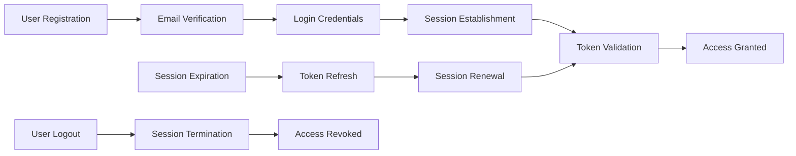
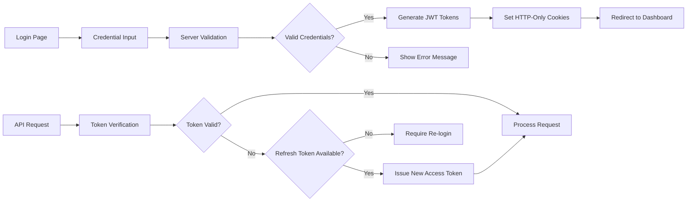

# User Actors and Authentication Requirements

## Executive Summary

This document defines the complete user actor hierarchy, authentication system, and permission structure for the Economic/Political Discussion Board. The system supports three distinct user roles with progressive levels of authorization and administrative capabilities.

## User Actor Definitions

### Regular User (Member)
Regular authenticated users are the foundation of the discussion board community. They have full access to core platform functionality while respecting community guidelines.

**Core Characteristics:**
- Authenticated member with email and password credentials
- Creates articles and comments in discussion sections
- Manages personal profile and content
- Participates in community discussions
- Can request administrator privileges

### Administrator
Administrators are responsible for content moderation and section management, operating under the supervision of super administrators.

**Core Characteristics:**
- Regular user with elevated content moderation privileges
- Manages discussion sections and user-generated content
- Enforces community guidelines through content removal and user banning
- Cannot manage other administrators or system-wide settings

### Super Administrator
Super administrators hold ultimate system authority, managing the administrator hierarchy and system-level configurations.

**Core Characteristics:**
- Highest authority level with unrestricted system access
- Manages administrator appointments, promotions, and demotions
- Oversees all administrative functions and system policies
- Cannot be demoted unless by another super administrator

## Authentication Requirements

### Core Authentication Functions
The authentication system ensures secure access control while maintaining user convenience and session integrity.

**Complete Authentication Flow:**



### User Registration Process
Users must follow a secure registration process to establish their identity on the platform.

**Registration Requirements:**
- WHEN a user initiates registration, THE system SHALL validate email format and uniqueness
- THE system SHALL require minimum password strength (8+ characters with mixed types)
- WHEN registration is submitted, THE system SHALL send email verification link
- THE user account SHALL remain inactive until email verification is completed
- AFTER successful verification, THE system SHALL automatically log in the user

### Login and Session Management
Secure login and session handling ensure authenticated access to platform features.

**Authentication Specifications:**
- WHEN a user attempts login, THE system SHALL validate credentials against stored hashes
- UPON successful authentication, THE system SHALL generate JWT tokens with user role information
- THE access token SHALL expire after 15 minutes of inactivity
- THE refresh token SHALL expire after 30 days of continuous use
- WHEN access token expires, THE system SHALL automatically refresh using refresh token
- IF refresh token is invalid or expired, THE system SHALL require re-authentication

### Password Management
Users must have secure mechanisms for managing their authentication credentials.

**Password Requirements:**
- USERS SHALL be able to change their password while logged in
- WHEN changing password, THE system SHALL require current password verification
- USERS SHALL be able to reset forgotten passwords via email recovery
- PASSWORD reset links SHALL expire after 1 hour for security
- AFTER password change, THE system SHALL invalidate all active sessions

### Account Management
Users maintain control over their digital identity and content.

**Account Requirements:**
- WHEN a user chooses to delete account, THE system SHALL require confirmation
- UPON account deletion, THE system SHALL permanently remove all user-generated content
- THE account deletion process SHALL be irreversible once confirmed
- DELETED accounts SHALL be anonymized in system logs and audit trails

## Permission Matrix

### Content Creation and Management
| Action | Regular User | Administrator | Super Administrator |
|--------|--------------|---------------|---------------------|
| Create Article | ✅ | ✅ | ✅ |
| Edit Own Article | ✅ | ✅ | ✅ |
| Delete Own Article | ✅ | ✅ | ✅ |
| Delete Any Article | ❌ | ✅ | ✅ |
| Create Comment | ✅ | ✅ | ✅ |
| Edit Own Comment | ✅ | ✅ | ✅ |
| Delete Own Comment | ✅ | ✅ | ✅ |
| Delete Any Comment | ❌ | ✅ | ✅ |

### Section Management
| Action | Regular User | Administrator | Super Administrator |
|--------|--------------|---------------|---------------------|
| View Sections | ✅ | ✅ | ✅ |
| Browse Section Content | ✅ | ✅ | ✅ |
| Create Section | ❌ | ✅ | ✅ |
| Edit Section | ❌ | ✅ | ✅ |
| Delete Section | ❌ | ❌ | ✅ |

### User Management
| Action | Regular User | Administrator | Super Administrator |
|--------|--------------|---------------|---------------------|
| View User Profiles | ✅ | ✅ | ✅ |
| Edit Own Profile | ✅ | ✅ | ✅ |
| Submit Admin Request | ✅ | ❌ | ❌ |
| View Admin Requests | ❌ | ❌ | ✅ |
| Approve/Reject Admin Request | ❌ | ❌ | ✅ |
| Promote/Demote Administrators | ❌ | ❌ | ✅ |
| Ban Users | ❌ | ✅ | ✅ |
| Unban Users | ❌ | ✅ | ✅ |
| View Banned Users | ❌ | ✅ | ✅ |

### Administrative Hierarchy
| Action | Regular User | Administrator | Super Administrator |
|--------|--------------|---------------|---------------------|
| Become Administrator | Via Request | N/A | N/A |
| Manage Own Admin Status | ❌ | ❌ | ✅ |
| Demote Other Super Admins | ❌ | ❌ | ✅ |
| Self-Demotion Prevention | N/A | N/A | ✅ |

## Security and Session Requirements

### JWT Token Specification
The system MUST implement JWT-based authentication with secure token management.

**Token Payload Structure:**
```json
{
  "userId": "uuid-v4",
  "email": "user@example.com",
  "role": "user|administrator|superAdministrator",
  "permissions": ["create_articles", "moderate_content", ...],
  "iat": 1234567890,
  "exp": 1234567950
}
```

**Token Security Requirements:**
- JWT secrets SHALL be securely stored and rotated periodically
- Access tokens SHALL have 15-minute expiration for enhanced security
- Refresh tokens SHALL be stored securely and validated on each use
- Token revocation SHALL occur immediately upon password changes
- Compromised tokens SHALL be blacklisted and rejected

### Session Security
Active sessions must be monitored and secured against unauthorized access.

**Session Requirements:**
- THE system SHALL limit concurrent sessions per user account
- SESSION timeouts SHALL be enforced based on user activity
- UNUSUAL login patterns SHALL trigger security alerts
- PASSWORD change SHALL terminate all active sessions immediately
- BANNED users SHALL have all active sessions invalidated instantly

### Authentication Flow Details

**Complete Login Sequence:**



## Account Lifecycle Management

### User Registration to Active Participation
Users progress through distinct stages from registration to active community participation.

**Lifecycle Stages:**
1. **Registration**: Account creation with email verification
2. **Verification**: Email confirmation and account activation
3. **Active**: Full participation in community discussions
4. **Administrator** (Optional): Elevated privileges through approval process
5. **Inactive**: Voluntary account deletion or administrative banning

### Administrator Promotion Process
The pathway from regular user to administrator involves a structured approval system.

**Promotion Requirements:**
- WHEN a user submits admin request, THE system SHALL record reason and timestamp
- SUPER administrators SHALL review pending requests with request details
- UPON approval, THE user SHALL immediately receive administrator privileges
- REJECTED requests SHALL include optional feedback for the applicant
- PROMOTED administrators SHALL retain all original user capabilities

### Banning and Access Control
Administrative actions that restrict user access follow defined procedures.

**Banning Protocol:**
- WHEN banning a user, THE administrator SHALL specify reason for documentation
- BANNED users SHALL be immediately logged out of all active sessions
- EXISTING content from banned users SHALL remain visible for context
- BAN records SHALL be accessible to administrators for review
- UNBANNING SHALL restore full user access with administrative approval

## Error Handling and Edge Cases

### Authentication Failure Scenarios
Robust error handling ensures security while maintaining user experience.

**Common Error Scenarios:**
- IF login attempts exceed 5 failures within 15 minutes, THEN THE system SHALL temporarily lock account
- WHEN account is locked, THEN THE system SHALL require password reset via email
- IF JWT token validation fails, THEN THE system SHALL return HTTP 401 with specific error code
- WHEN session expires during active use, THEN THE system SHALL prompt for re-authentication

### Edge Case Management
Special scenarios require specific handling to maintain system integrity.

**Edge Case Protocols:**
- WHILE processing account deletion, THE system SHALL maintain transaction integrity
- IF administrator attempts self-demotion, THEN THE system SHALL prevent the action
- WHEN super administrator is the only remaining, THEN THE system SHALL prevent demotion
- DURING administrative actions, THE system SHALL maintain audit trails for accountability

## Performance and Scalability Requirements

### Authentication Performance
Authentication systems must perform efficiently under varying load conditions.

**Performance Specifications:**
- THE authentication system SHALL process login requests within 2 seconds under normal load
- JWT token validation SHALL complete within 100 milliseconds
- SESSION management SHALL support concurrent users without degradation
- PASSWORD hashing SHALL use industry-standard algorithms with appropriate cost factors

### Scalability Considerations
Authentication infrastructure must scale with growing user base.

**Scalability Requirements:**
- THE system SHALL support horizontal scaling of authentication services
- TOKEN validation SHALL be stateless to support distributed deployment
- USER session data SHALL be efficiently distributed across service instances
- AUTHENTICATION endpoints SHALL implement rate limiting to prevent abuse

This comprehensive authentication specification provides backend developers with all necessary information to implement a secure, scalable, and feature-complete authentication system for the Economic/Political Discussion Board platform.

> *Developer Note: This document defines **business requirements only**. All technical implementations (architecture, APIs, database design, etc.) are at the discretion of the development team.*