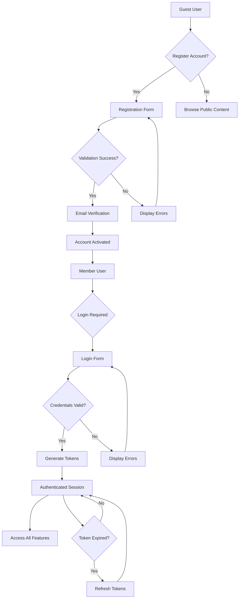
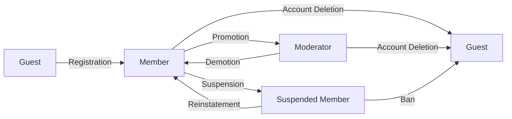

# User Actors and Authentication System Specification

## Introduction and Overview

This document defines the complete user actor structure and authentication requirements for the economic/political discussion board. The system supports three distinct user roles with clearly defined permission boundaries to ensure secure and appropriate access to platform features. The authentication system provides robust security while maintaining user convenience through proper session management and recovery mechanisms.

## User Actor Definitions

### Guest User
Unauthenticated users who can access public content without creating an account.

**Capabilities:**
- View public posts and discussions
- Browse content categories
- Search and filter content
- Register for a new account
- View user profiles (limited information)

**Restrictions:**
- Cannot create posts or comments
- Cannot upload attachments
- Cannot participate in discussions
- Cannot access private or restricted content

### Member User
Authenticated users who have completed registration and can actively participate in discussions.

**Capabilities:**
- Create, edit, and delete their own posts
- Comment on posts and engage in discussions
- Upload image and file attachments to their content
- Edit their own profile information
- Follow other users and topics
- Receive notifications for activity
- Report inappropriate content

**Restrictions:**
- Cannot moderate other users' content
- Cannot delete posts created by other users
- Cannot access administrative functions

### Moderator User
Administrative users responsible for content moderation and community management.

**Capabilities:**
- All Member capabilities PLUS:
- Review and moderate user-reported content
- Remove inappropriate posts and comments
- Suspend or warn users for policy violations
- Access moderation dashboard
- Manage content categories and tags
- View moderation statistics

**Restrictions:**
- Cannot access system-level administrative functions
- Cannot modify core platform settings
- Cannot delete user accounts

## Authentication System Requirements

### User Registration Flow

WHEN a guest user initiates registration, THE system SHALL provide a registration form with email, username, and password fields.

**Registration Process:**
1. User enters email address, username, and password
2. System validates email format and username availability
3. System validates password meets security requirements
4. System sends email verification link to provided address
5. User clicks verification link to activate account
6. System creates user account with "member" role
7. User is automatically logged in upon successful verification

**Password Requirements:**
- Minimum 8 characters
- Must contain at least one uppercase letter
- Must contain at least one lowercase letter  
- Must contain at least one number
- Must contain at least one special character

### Login and Session Management

WHEN a user attempts to log in, THE system SHALL validate credentials and create a secure session.

**Login Process:**
1. User enters username/email and password
2. System validates credentials against stored hash
3. IF credentials are valid, THEN THE system SHALL generate JWT tokens
4. System returns access token and refresh token
5. User session is established with appropriate permissions

**Session Management:**
- Access token expiration: 30 minutes
- Refresh token expiration: 30 days
- Token storage: localStorage for web application
- Automatic token refresh when access token expires
- Manual logout capability for all devices

### Password Security Requirements

THE system SHALL store passwords using bcrypt hashing with salt.
WHEN a user requests password reset, THE system SHALL send a secure reset link to their registered email.
IF a user enters an incorrect password 5 times within 15 minutes, THEN THE system SHALL temporarily lock the account for 30 minutes.

## Permission Matrix for All Features

| Feature | Guest | Member | Moderator |
|---------|-------|--------|-----------|
| View Public Posts | ✅ | ✅ | ✅ |
| View User Profiles | ✅ (limited) | ✅ | ✅ |
| Register Account | ✅ | ❌ | ❌ |
| Create Posts | ❌ | ✅ | ✅ |
| Edit Own Posts | ❌ | ✅ | ✅ |
| Delete Own Posts | ❌ | ✅ | ✅ |
| Comment on Posts | ❌ | ✅ | ✅ |
| Edit Own Comments | ❌ | ✅ | ✅ |
| Delete Own Comments | ❌ | ✅ | ✅ |
| Upload Attachments | ❌ | ✅ | ✅ |
| Report Content | ❌ | ✅ | ✅ |
| Moderate Content | ❌ | ❌ | ✅ |
| Remove Others' Content | ❌ | ❌ | ✅ |
| Manage Categories | ❌ | ❌ | ✅ |
| View Moderation Stats | ❌ | ❌ | ✅ |

## Token Management and Security

### JWT Token Structure

THE system SHALL use JWT (JSON Web Tokens) for authentication with the following payload structure:

```json
{
  "userId": "uuid",
  "role": "member" | "moderator",
  "permissions": ["create_post", "comment", "upload_attachment", ...],
  "iat": 1234567890,
  "exp": 1234567890
}
```

**Access Token:**
- Contains user identity and permissions
- Short expiration (30 minutes) for security
- Used for API authorization

**Refresh Token:**
- Longer expiration (30 days) for convenience
- Stored securely for token refresh
- Can be revoked individually

### Security Requirements

THE system SHALL use HTTPS for all authentication requests.
WHEN a user logs out, THE system SHALL invalidate both access and refresh tokens.
IF a token is compromised, THEN THE system SHALL allow users to revoke all sessions.

## Error Handling for Authentication

### Registration Errors

IF a user attempts to register with an existing email, THEN THE system SHALL return error "EMAIL_ALREADY_EXISTS".
IF a user attempts to register with an invalid username, THEN THE system SHALL return error "USERNAME_INVALID".
IF a user's password does not meet security requirements, THEN THE system SHALL return error "PASSWORD_WEAK".

### Login Errors

IF a user enters incorrect credentials, THEN THE system SHALL return error "INVALID_CREDENTIALS".
IF a user's account is temporarily locked, THEN THE system SHALL return error "ACCOUNT_LOCKED".
IF a user's email is not verified, THEN THE system SHALL return error "EMAIL_NOT_VERIFIED".

### Token Errors

IF an access token is expired, THEN THE system SHALL return error "TOKEN_EXPIRED".
IF an access token is invalid, THEN THE system SHALL return error "TOKEN_INVALID".
IF a refresh token is invalid, THEN THE system SHALL return error "REFRESH_TOKEN_INVALID".

### Permission Errors

IF a user attempts to perform an action without proper permissions, THEN THE system SHALL return error "PERMISSION_DENIED".
IF a user attempts to access content they are not authorized to view, THEN THE system SHALL return error "ACCESS_DENIED".

## Session Recovery and User Experience

WHEN a user's session expires during active use, THE system SHALL automatically refresh tokens without interrupting the user experience.
IF a user returns to the application after closing their browser, THEN THE system SHALL attempt to restore their session using stored refresh tokens.
WHILE a user is actively browsing the application, THE system SHALL maintain their authentication state seamlessly.

## Authentication Workflow Diagram



## User Role Transition Process



## Security Implementation Guidelines

### Password Storage Requirements

THE system SHALL implement password security using industry-standard practices:
- Use bcrypt with cost factor of 12
- Generate unique salt for each password
- Never store passwords in plain text
- Implement password strength validation

### Session Security Measures

THE system SHALL protect user sessions through:
- Secure token storage in HTTP-only cookies
- Regular token rotation for active sessions
- Session timeout after 30 minutes of inactivity
- Automatic logout on suspicious activity

### Account Protection Features

THE system SHALL implement account security measures:
- Failed login attempt tracking
- Account lockout after 5 failed attempts
- Suspicious login detection and alerts
- Password change requirement after security incidents

## Integration Requirements

### Email Service Integration

THE system SHALL integrate with email services for:
- Account verification emails
- Password reset functionality
- Security notifications
- Important system announcements

### Notification System Integration

THE authentication system SHALL integrate with platform notifications:
- Login success/failure notifications
- Password change confirmations
- Account security alerts
- Session management updates

## Performance Requirements

### Authentication Performance

THE system SHALL meet performance standards:
- Login response time under 2 seconds
- Token generation under 500ms
- Session validation under 100ms
- Password hash verification under 200ms

### Scalability Requirements

THE authentication system SHALL support:
- Concurrent login requests from 1,000 users
- Token validation throughput of 10,000 requests/second
- User database scaling to 100,000 registered users
- Session storage for 10,000 active users

## Compliance Requirements

### Data Protection Compliance

THE system SHALL comply with data protection regulations:
- Secure storage of personal information
- Proper consent management for data processing
- Right to erasure implementation
- Data breach notification procedures

### Accessibility Requirements

THE authentication system SHALL be accessible:
- Screen reader compatible login forms
- Keyboard navigation support
- High contrast mode compatibility
- Error message accessibility

This authentication system provides a secure foundation for the discussion board while maintaining user convenience and appropriate access controls for all user roles. The implementation ensures robust security while delivering a seamless user experience across all authentication workflows.