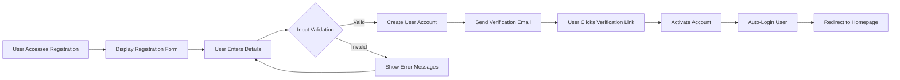
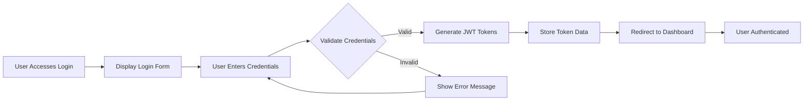
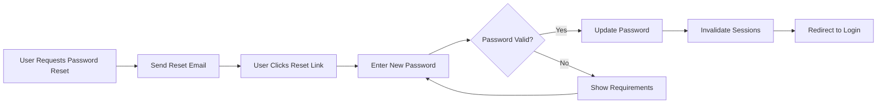
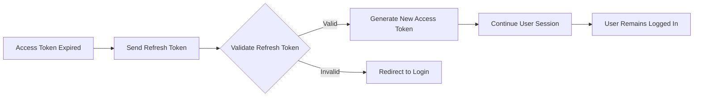

# User Actors and Authentication Requirements

## Introduction

This document defines the complete user actor system and authentication requirements for the economic/political discussion board. The system supports three primary user actors with distinct permission levels and capabilities, ensuring secure access control while maintaining the platform's simplicity.

## User Actor Definitions

### Guest Users
Unauthenticated users who can browse public content without creating an account.

**Capabilities:**
- View published discussions and posts
- Read comments on public content
- Browse discussion categories
- Search and discover content
- View user profiles (limited information)

**Limitations:**
- Cannot create posts or comments
- Cannot upload attachments
- Cannot participate in discussions
- Cannot access member-only content

**Business Requirements:**
WHEN a guest user browses the platform, THE system SHALL display all public content without requiring authentication.
WHERE guest users attempt actions requiring authentication, THE system SHALL provide clear login/registration prompts.

### Member Users
Authenticated users who have registered accounts and can actively participate in discussions.

**Capabilities:**
- All Guest user capabilities
- Create and publish discussion posts
- Comment on existing discussions
- Upload image and file attachments to posts
- Edit their own posts and comments (within time limits)
- Delete their own content
- Participate in discussions
- Access member-only content areas
- Manage their user profile and preferences

**Responsibilities:**
- Follow community guidelines
- Maintain respectful discourse
- Properly categorize content
- Use appropriate attachments

**Business Requirements:**
WHEN a member creates content, THE system SHALL validate permissions before allowing submission.
WHERE members edit their content, THE system SHALL enforce time limits and maintain edit history.

### Moderator Users
Administrative users responsible for content moderation and community management.

**Capabilities:**
- All Member user capabilities
- Moderate and review user-generated content
- Remove inappropriate posts and comments
- Suspend or restrict user accounts
- Manage discussion categories
- Handle user reports and appeals
- Access moderation tools and analytics
- Pin important discussions
- Lock controversial threads

**Responsibilities:**
- Enforce community guidelines consistently
- Handle user disputes fairly
- Maintain platform integrity
- Ensure respectful discourse

**Business Requirements:**
WHEN a moderator reviews content, THE system SHALL provide comprehensive moderation tools.
WHERE moderation actions are taken, THE system SHALL maintain audit trails and notify affected users.

## Authentication Requirements

### User Registration

**WHEN a guest user wants to create an account, THE system SHALL provide a registration form with the following fields:**
- Email address (required, must be valid format)
- Username (required, 3-20 characters, alphanumeric)
- Password (required, minimum 8 characters)
- Password confirmation (required)

**WHEN a user submits the registration form, THE system SHALL:**
1. Validate all input fields for format and requirements
2. Check if email and username are available
3. Create user account with "pending verification" status
4. Send email verification link to the provided email address
5. Display confirmation message indicating verification is required

**WHEN a user clicks the email verification link, THE system SHALL:**
1. Validate the verification token
2. Activate the user account
3. Log the user in automatically
4. Redirect to the discussion board homepage
5. Display welcome message

### User Login

**WHEN a user attempts to log in, THE system SHALL:**
1. Present login form with username/email and password fields
2. Validate credentials against stored user data
3. IF credentials are valid AND account is active, THEN THE system SHALL:
   - Generate JWT access token (15-minute expiration)
   - Generate JWT refresh token (30-day expiration)
   - Store token information securely
   - Redirect to user's dashboard or previous page
4. IF credentials are invalid OR account is inactive, THEN THE system SHALL:
   - Display appropriate error message
   - Not reveal whether username/email exists

### Password Management

**WHEN a user forgets their password, THE system SHALL:**
1. Provide "Forgot Password" functionality
2. Send password reset link to registered email
3. Allow password reset via secure token
4. Require password confirmation
5. Invalidate all existing sessions after password change

**WHEN a logged-in user wants to change their password, THE system SHALL:**
1. Require current password verification
2. Validate new password meets security requirements
3. Update password and invalidate existing sessions
4. Send confirmation email to the user

### Account Recovery

**WHEN a user cannot access their account, THE system SHALL:**
1. Provide account recovery options via email
2. Verify user identity through security questions (optional)
3. Allow account reactivation for suspended accounts
4. Provide support contact for complex recovery scenarios

### Session Management

**THE system SHALL maintain user sessions using JWT tokens with the following structure:**
- Access Token (15-minute expiration)
- Refresh Token (30-day expiration)
- Token payload must include: userId, username, role, permissions array

**WHEN an access token expires, THE system SHALL:**
1. Accept refresh token for new access token generation
2. Validate refresh token is not revoked or expired
3. Issue new access token with same permissions
4. Maintain user session seamlessly

**WHEN a user logs out, THE system SHALL:**
1. Invalidate both access and refresh tokens
2. Clear session data
3. Redirect to login page or homepage
4. Provide confirmation of successful logout

## Permission Matrix

| Action | Guest | Member | Moderator |
|--------|-------|--------|-----------|
| Browse public discussions | ✅ | ✅ | ✅ |
| View published posts | ✅ | ✅ | ✅ |
| Read comments | ✅ | ✅ | ✅ |
| Search content | ✅ | ✅ | ✅ |
| View user profiles | ✅ | ✅ | ✅ |
| Create new posts | ❌ | ✅ | ✅ |
| Comment on posts | ❌ | ✅ | ✅ |
| Upload attachments | ❌ | ✅ | ✅ |
| Edit own content | ❌ | ✅ | ✅ |
| Delete own content | ❌ | ✅ | ✅ |
| Report content | ❌ | ✅ | ✅ |
| Moderate all content | ❌ | ❌ | ✅ |
| Manage user accounts | ❌ | ❌ | ✅ |
| Handle user reports | ❌ | ❌ | ✅ |
| Pin/lock discussions | ❌ | ❌ | ✅ |
| Access moderation tools | ❌ | ❌ | ✅ |
| View analytics | ❌ | ❌ | ✅ |

## Authentication Flow Diagrams

### User Registration Flow

### User Login Flow

### Password Reset Flow

### Token Refresh Flow

## Security Considerations

### Authentication Security Requirements

**THE system SHALL implement the following security measures:**
- Password hashing using industry-standard algorithms (bcrypt)
- Rate limiting on login attempts to prevent brute force attacks
- Secure HTTP-only cookies for token storage (recommended)
- OR secure localStorage with CSRF protection
- Session timeout after 30 minutes of inactivity
- Automatic logout after 30 days without activity

**WHEN handling sensitive operations, THE system SHALL:**
- Require re-authentication for password changes
- Send email notifications for security-related actions
- Log all authentication events for security monitoring
- Implement account lockout after multiple failed attempts

### Token Management Requirements

**THE JWT token payload SHALL include:**
- User ID (unique identifier)
- Username (display name)
- Role (guest/member/moderator)
- Permissions array (specific capabilities)
- Issued at timestamp
- Expiration timestamp

**WHEN validating tokens, THE system SHALL:**
- Verify token signature authenticity
- Check token expiration timestamps
- Validate issuer and audience claims
- Ensure token has not been revoked

### Data Protection Requirements

**WHEN storing user data, THE system SHALL:**
- Encrypt sensitive personal information at rest
- Use secure transmission protocols for all data transfers
- Implement proper access controls for user data
- Maintain data privacy according to platform policies

## Implementation Guidelines

### Business Requirements for Backend Implementation

**WHEN implementing the authentication system, THE development team SHALL:**
- Design user database schema to support the three actor types
- Implement secure password storage with salt and hash
- Create token generation and validation services
- Build email service for verification and notifications
- Develop session management middleware
- Create permission checking utilities

**THE authentication system SHALL provide:**
- Clear error messages for failed authentication attempts
- User-friendly password strength requirements
- Seamless token refresh functionality
- Comprehensive logging for security monitoring
- Easy integration with discussion board features

### User Experience Requirements

**THE authentication interface SHALL:**
- Provide clear feedback during registration and login processes
- Handle errors gracefully with helpful messages
- Maintain user sessions transparently
- Offer easy password recovery options
- Support seamless navigation between authenticated states

### Performance Requirements

**WHEN users authenticate, THE system SHALL:**
- Process login requests within 2 seconds under normal load
- Handle registration requests within 3 seconds including email sending
- Maintain session state efficiently without performance degradation
- Support concurrent authentication for multiple users

### Error Handling Requirements

**WHEN authentication fails, THE system SHALL:**
- Provide specific error messages without revealing security details
- Offer clear recovery paths for common issues
- Maintain user input during form validation errors
- Log authentication failures for security monitoring

## Integration Requirements

### Discussion Board Feature Integration

**THE authentication system SHALL integrate with:**
- Content creation and moderation features
- User profile management system
- Notification and messaging systems
- Analytics and reporting tools

**WHEN users interact with platform features, THE system SHALL:**
- Validate permissions before allowing actions
- Provide appropriate error messages for permission denials
- Maintain consistent authentication state across all features
- Support feature-specific permission requirements

### External Service Integration

**WHERE external services are used, THE system SHALL:**
- Integrate with email services for verification and notifications
- Support potential future social media authentication options
- Maintain security when integrating with third-party services
- Provide fallback options for service failures

> *Developer Note: This document defines **business requirements only**. All technical implementations (architecture, APIs, database design, etc.) are at the discretion of the development team.*