**discussionBoard — What operations users can perform, use cases, business workflows**

What operations users can perform, use cases, business workflows

# Core Business Operations

What the system must do for each business concept.

## User Operations

Users can register new accounts by providing an email address and password. The system must verify that email addresses are unique and not already registered with an active account. Users can log in using their registered email and password combination. Once logged in, users can update their account password by providing the current password and confirming the new one. Users have the ability to delete their own accounts, which permanently removes all their articles and comments from the system. Each user has a profile containing display name and biographical text that can be viewed by other users. Users can edit their own profiles to update display name and biographical information. Other users can browse user profiles to see display name, bio, and lists of articles and comments created by that user. The system must maintain user authentication sessions to ensure secure access to protected operations. Deleted user accounts should have their content removed while preserving system integrity and relationships.

### User Registration Process

### User Registration Process

WHEN a guest registers for a new account, THE system SHALL:
1. Require a valid email address
2. Require a password meeting minimum security requirements
3. Validate email uniqueness against existing accounts
4. Create a new user account with the provided credentials
5. Set the user's initial display name to their email username portion
6. Initialize the user's bio field as empty
7. Set the user's banned status to false

IF the email address is already registered to an active account, THE system SHALL reject the registration.
IF the password does not meet minimum security requirements, THE system SHALL reject the registration.
IF the email format is invalid, THE system SHALL reject the registration.

WHEN registration is successful, THE system SHALL automatically log the user in.

### Email Uniqueness Validation

THE system SHALL ensure that each email address is unique across all active user accounts.
THE system SHALL prevent registration when the provided email matches an existing active account.
THE system SHALL allow registration when the provided email matches a deleted account.

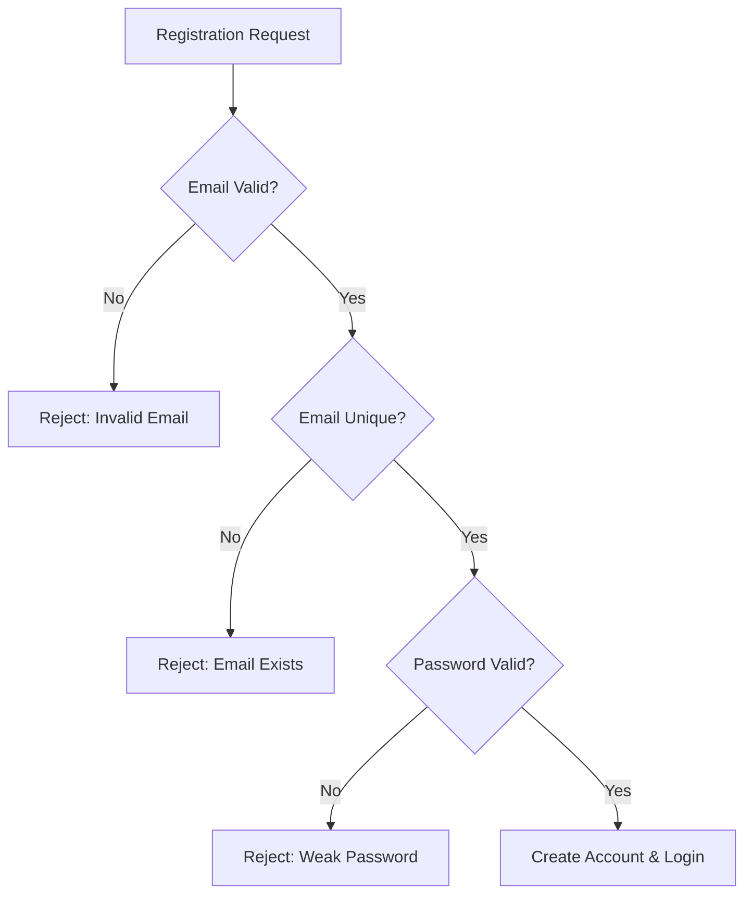

### Login Authentication Workflow

### Login Authentication Workflow

WHEN a user attempts to log in, THE system SHALL:
1. Require a registered email address
2. Require the correct password for that email
3. Verify the user is not banned
4. Create an authenticated session
5. Redirect the user to their dashboard

IF the email is not registered, THE system SHALL reject the login attempt.
IF the password is incorrect, THE system SHALL reject the login attempt.
IF the user is banned, THE system SHALL reject the login attempt.

WHEN login is successful, THE system SHALL maintain the authenticated session until:
- The user explicitly logs out
- The session expires due to inactivity
- The user's account is banned

### Session Management

THE system SHALL maintain authenticated sessions for logged-in users.
THE system SHALL invalidate sessions when users log out.
THE system SHALL automatically expire sessions after 24 hours of inactivity.
THE system SHALL immediately invalidate all sessions when a user is banned.
THE system SHALL require authentication for protected operations.

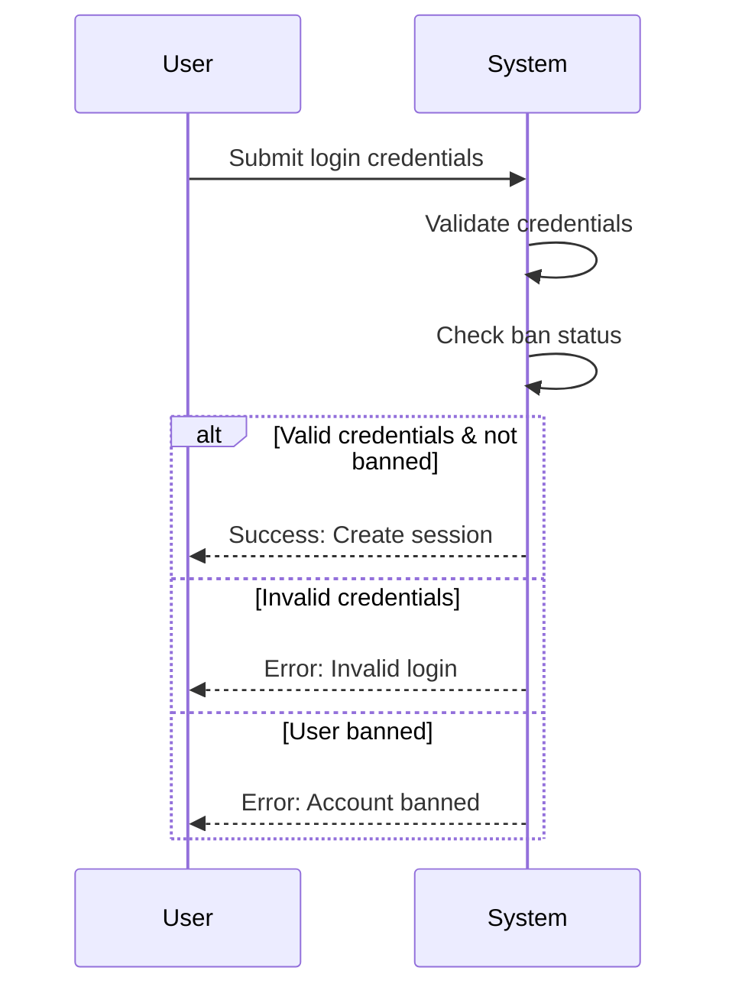

### Password Change Workflow

### Password Change Workflow

WHEN a logged-in user requests to change their password, THE system SHALL:
1. Require the current password for verification
2. Require a new password meeting security requirements
3. Require confirmation of the new password
4. Update the user's password in the system
5. Invalidate all existing sessions except the current one
6. Require re-authentication for continued access

IF the current password is incorrect, THE system SHALL reject the password change.
IF the new password does not meet security requirements, THE system SHALL reject the password change.
IF the new password confirmation does not match, THE system SHALL reject the password change.

WHEN password change is successful, THE system SHALL:
- Send a confirmation email to the user
- Maintain the current session for immediate continuation
- Require password re-entry for sensitive operations

THE system SHALL prevent password reuse with the last 5 previous passwords.
THE system SHALL enforce minimum password length of 8 characters.
THE system SHALL require passwords to contain at least one letter and one number.

### Account Deletion Consequences

### Account Deletion Consequences

WHEN a user deletes their account, THE system SHALL:
1. Permanently remove the user's account record
2. Delete all articles written by the user
3. Delete all comments written by the user
4. Remove any pending administrator requests by the user
5. Invalidate all active sessions for that user
6. Send a confirmation email to the user's email address

IF the user has active administrator privileges, THE system SHALL:
- Revoke administrator privileges before account deletion
- Notify other administrators of the privilege revocation

THE system SHALL require password confirmation before processing account deletion.
THE system SHALL provide a final warning showing the consequences of deletion.
THE system SHALL prevent account deletion if the user has pending administrative actions.

### System Integrity Preservation

THE system SHALL maintain referential integrity when user accounts are deleted.
THE system SHALL ensure that deleted user content does not leave orphaned records.
THE system SHALL preserve the chronological order of discussions despite user deletions.
THE system SHALL maintain accurate comment counts on articles after user deletions.

WHEN a user account is deleted, THE system SHALL update all affected content relationships atomically.

### Profile Viewing Capability

### Profile Viewing Capability

WHEN any user views another user's profile, THE system SHALL display:
1. The user's display name
2. The user's bio text
3. A paginated list of articles written by the user
4. A paginated list of comments written by the user
5. The date the user joined the platform

THE system SHALL allow profile viewing for all registered users.
THE system SHALL allow profile viewing for guests (non-logged-in users).
THE system SHALL display banned users' profiles with a clear banned status indicator.

WHEN viewing the article list on a profile, THE system SHALL show:
- Article title
- Section name
- Date posted
- Comment count

WHEN viewing the comment list on a profile, THE system SHALL show:
- Comment preview (first 100 characters)
- Article title the comment belongs to
- Date posted

IF a user's profile contains no articles or comments, THE system SHALL display appropriate empty state messages.

### Profile Editing Permissions

### Profile Editing Permissions

WHEN a logged-in user edits their own profile, THE system SHALL allow:
1. Updating the display name
2. Updating the bio text
3. Previewing changes before saving
4. Canceling edits without saving changes

THE system SHALL restrict profile editing to the account owner only.
THE system SHALL prevent users from editing other users' profiles.
THE system SHALL validate display name length (1-50 characters).
THE system SHALL validate bio text length (maximum 500 characters).

WHEN profile changes are saved, THE system SHALL:
- Immediately update the profile display
- Maintain consistency across all displayed instances
- Preserve the previous version for audit purposes

IF a user attempts to edit a banned user's profile, THE system SHALL reject the request.
IF a user attempts to edit a deleted user's profile, THE system SHALL reject the request.

### User Content Association

THE system SHALL associate all articles with their creating user.
THE system SHALL associate all comments with their creating user.
THE system SHALL maintain these associations even after profile edits.
THE system SHALL display updated profile information on existing content.
THE system SHALL prevent orphaned content by preserving user associations.

WHEN a user's display name changes, THE system SHALL update the author name display on all their existing articles and comments.

## Article Operations

Users can create articles by selecting a section and providing title and content. The system requires articles to have both title and content fields completed before submission. Articles belong to specific sections that categorize the discussion topics. Users can attach multiple files and images to their articles to supplement content. Tags can be added to articles to improve discoverability and organization. Users can edit their own articles to modify title, content, attachments, and tags. Article deletion removes the article and all associated comments from the system. The system displays articles in lists showing title, author, tags, comment count, and posting time. Users can browse articles within specific sections with paginated results. Article viewing shows full content with all attachments available for download. Search functionality allows finding articles by title or content keywords. Tag filtering enables users to narrow down article lists based on specific topics.

### Article Creation Workflow

### Article Creation Workflow

WHEN a member creates an article, THE system SHALL:
1. Require selection of a section from available sections
2. Require a title to be provided
3. Require content to be provided
4. Allow optional attachment of multiple files and images
5. Allow optional addition of free-text tags
6. Associate the article with the creating member
7. Record the creation timestamp
8. Set the initial article status as published

IF any required field is missing, THE system SHALL reject the article creation.
IF the selected section does not exist, THE system SHALL reject the article creation.
IF the member is banned, THE system SHALL prevent article creation.

WHEN the article is successfully created, THE system SHALL display the full article view to the member.

### Section Categorization Process

### Section Categorization Process

WHEN a member creates or edits an article, THE system SHALL:
1. Display all available sections for selection
2. Require exactly one section to be selected
3. Show the section name and description during selection
4. Associate the article with the selected section

THE system SHALL ensure that articles can only be categorized under existing sections.
THE system SHALL prevent categorization under sections that have been deleted.

WHEN browsing articles, THE system SHALL display articles grouped by their assigned section.

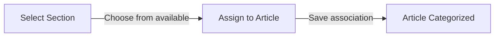

### Attachment Management Operations

### Attachment Management Operations

WHEN a member creates or edits an article, THE system SHALL:
1. Allow attachment of multiple files and images
2. Support various file types for attachments
3. Display attached files and images in the article view
4. Provide download capability for all attachments

THE system SHALL maintain the association between attachments and their parent article.
THE system SHALL remove attachments when their parent article is deleted.

WHEN viewing an article, THE system SHALL display all attachments with their filenames.
WHEN downloading an attachment, THE system SHALL provide the original file.

IF an attachment exceeds size limits, THE system SHALL reject the attachment.
IF an unsupported file type is attached, THE system SHALL reject the attachment.

### Tag Application Process

### Tag Application Process

WHEN a member creates or edits an article, THE system SHALL:
1. Allow addition of free-text tags
2. Support multiple tags per article
3. Display tags associated with the article
4. Allow removal of existing tags

THE system SHALL not impose restrictions on tag content or format.
THE system SHALL maintain tag associations with their parent articles.

WHEN browsing articles, THE system SHALL display tags for each article in the list.
WHEN searching articles, THE system SHALL allow filtering by specific tags.

IF a tag contains inappropriate content, THE system SHALL allow administrators to remove it.

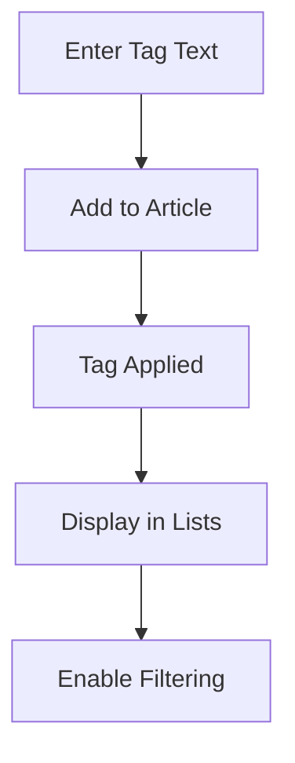

### Article Editing Permissions

### Article Editing Permissions

WHEN a member attempts to edit an article, THE system SHALL:
1. Allow editing only if the member is the article author
2. Allow administrators to edit any article
3. Require authentication for editing operations
4. Record the update timestamp when edits are saved

THE system SHALL prevent banned members from editing articles.
THE system SHALL allow editing of title, content, attachments, and tags.

WHEN an article is edited, THE system SHALL preserve the original section assignment.
WHEN an article is edited, THE system SHALL maintain all existing comments.

IF a non-author member attempts to edit an article, THE system SHALL reject the request.
IF an administrator edits an article, THE system SHALL record the administrator's identity.

### Article Deletion Consequences

### Article Deletion Consequences

WHEN a member deletes their article, THE system SHALL:
1. Remove the article content permanently
2. Remove all attachments associated with the article
3. Remove all comments on the article
4. Update article lists to reflect the deletion

WHEN an administrator deletes an article, THE system SHALL:
1. Remove the article and all associated content
2. Record the administrator who performed the deletion
3. Notify the article author of the deletion (if applicable)

THE system SHALL allow article authors to delete their own articles.
THE system SHALL allow administrators to delete any article.

IF a banned user's article is deleted, THE system SHALL handle it as a regular deletion.

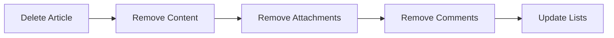

### Article List Display Formatting

### Article List Display Formatting

WHEN displaying article lists, THE system SHALL:
1. Show article title prominently
2. Display author's display name
3. Show associated tags for each article
4. Display comment count for each article
5. Show creation timestamp for each article
6. Use pagination to limit results per page

THE system SHALL not display full article content in list views.
THE system SHALL provide sorting options by newest or oldest first.

WHEN browsing articles within a section, THE system SHALL show only articles from that section.
WHEN searching articles, THE system SHALL display relevant articles in the same list format.

IF no articles match the criteria, THE system SHALL display an appropriate message.

### Article Browsing Patterns

### Article Browsing Patterns

WHEN members browse articles, THE system SHALL:
1. Allow browsing by section
2. Provide paginated results for large article sets
3. Enable sorting by creation time (newest/oldest first)
4. Support navigation between pages

THE system SHALL display articles in chronological order based on selected sorting.
THE system SHALL maintain section context during browsing.

WHEN a member selects an article from the list, THE system SHALL display the full article view.
WHEN browsing, THE system SHALL preserve search and filter parameters across pages.

IF a section has no articles, THE system SHALL display an empty state message.

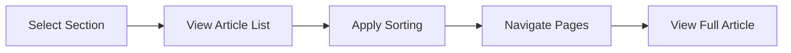

### Full Article Content Viewing

### Full Article Content Viewing

WHEN a member views a full article, THE system SHALL:
1. Display the complete article content
2. Show the article title prominently
3. Display author information and creation timestamp
4. Show all associated tags
5. Display all attached files and images
6. Provide download links for attachments
7. Show the comment section below the article

THE system SHALL allow any authenticated member to view full articles.
THE system SHALL allow guests to view full articles (if permitted by system rules).

WHEN viewing an article, THE system SHALL display comments in chronological order.
WHEN attachments are present, THE system SHALL provide clear download options.

IF an article has been deleted, THE system SHALL not allow viewing.
IF a member lacks permission to view the article, THE system SHALL restrict access.

### Article Search and Filtering Capabilities

### Article Search and Filtering Capabilities

WHEN members search for articles, THE system SHALL:
1. Allow searching by title content
2. Allow searching by article content
3. Support tag-based filtering
4. Provide paginated search results
5. Maintain search context during navigation

THE system SHALL search across all sections unless section-filtered.
THE system SHALL return relevant articles matching search terms.

WHEN filtering by tags, THE system SHALL display articles that match selected tags.
WHEN search results are displayed, THE system SHALL use the same list format as regular browsing.

IF no results match the search criteria, THE system SHALL display an appropriate message.
IF search terms are too broad, THE system SHALL handle large result sets with pagination.

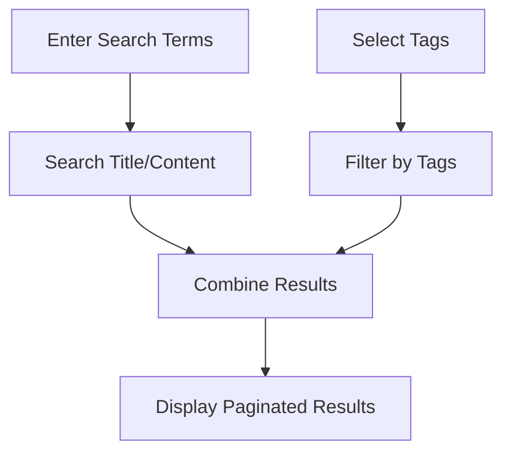

## Comment Operations

Users can write comments on articles to participate in discussions. Comments are single-level only with no nested reply structure. Each comment displays the author's information, content, and timestamp. Users can view all comments on an article in chronological order. Comment editing allows authors to modify their own comments after posting. Authors can delete their own comments, removing them from the article discussion. The system displays comments sorted by creation time with oldest first. Each comment shows the author's display name rather than email address. Comment counts are tracked and displayed with article listings. Comment operations require users to be logged in to the system. Comment deletion affects only the specific comment without impacting the article. Comment editing maintains the original creation timestamp while updating content.

### Comment Creation and Posting Workflow

### Comment Creation and Posting Workflow

WHEN a user wants to post a comment on an article, THE system SHALL:
1. Require the user to be authenticated
2. Require the parent article to exist and be accessible
3. Require comment content to be provided and not empty
4. Validate the comment content meets any content guidelines
5. Record the comment with attribution to the author
6. Associate the comment with the specific article
7. Record the creation timestamp
8. Update the article's comment count

IF the user is not authenticated, THE system SHALL prevent comment creation.
IF the article does not exist or is not accessible, THE system SHALL reject the comment.
IF the comment content is empty or invalid, THE system SHALL reject the comment.

THE system SHALL create a single-level comment with no nesting capability.
THE system SHALL not allow replies to other comments.
THE system SHALL treat all comments as direct responses to the article.

### Comment Display and Formatting

### Comment Display and Formatting

WHEN displaying comments on an article, THE system SHALL:
1. Show the author's display name (not email)
2. Display the comment content
3. Show the timestamp of when the comment was created
4. Format timestamps in a human-readable format
5. Display comments in chronological order (oldest first)
6. Maintain consistent visual formatting for all comments

WHEN a user views an article, THE system SHALL display all comments on that article.
WHEN a user views a comment, THE system SHALL show edit/delete controls only to the comment's author and administrators.

THE system SHALL format comments to clearly distinguish between different authors.
THE system SHALL ensure the author attribution is visible and unambiguous.
THE system SHALL maintain the original creation timestamp even after edits.

### Comment Editing and Permissions

### Comment Editing and Permissions

WHEN a user wants to edit a comment, THE system SHALL:
1. Verify the user is the author of the comment
2. Allow editing of the comment content
3. Maintain the original creation timestamp
4. Update the last modified timestamp
5. Record the edit history (implicitly through update)
6. Validate the edited content meets content guidelines

IF a user is not the author of the comment, THE system SHALL prevent editing.
IF an administrator attempts to edit a comment, THE system SHALL follow administrator editing rules.

WHILE a comment exists, THE author SHALL have permission to edit it.
WHEN a comment is edited, THE system SHALL indicate that it has been modified.

THE system SHALL allow administrators to edit any comment for moderation purposes.

### Comment Deletion and Cleanup

### Comment Deletion and Cleanup

WHEN a user wants to delete a comment, THE system SHALL:
1. Verify the user is the author of the comment
2. Remove the comment from public view
3. Update the article's comment count
4. Maintain referential integrity with the parent article
5. Record the deletion for audit purposes

WHEN an administrator deletes a comment, THE system SHALL:
1. Allow deletion regardless of authorship
2. Record the administrator who performed the deletion
3. Optionally record a reason for deletion
4. Update the article's comment count
5. Notify the original author if appropriate

IF a user deletes their comment, THE system SHALL remove only that specific comment.
IF an article is deleted, THE system SHALL delete all associated comments.
IF a user account is deleted, THE system SHALL delete all comments by that user.

THE system SHALL ensure comment deletion does not affect the parent article's existence.
THE system SHALL maintain data consistency when comments are deleted.

### Comment Sorting and Engagement Tracking

### Comment Sorting and Engagement Tracking

THE system SHALALWAYS sort comments chronologically by creation timestamp with oldest first.
WHEN new comments are posted, THE system SHALL insert them at the end of the comment list.
WHEN displaying comment lists, THE system SHALL maintain chronological order.

WHEN tracking engagement, THE system SHALL:
1. Count the total number of comments per article
2. Display the comment count with article listings
3. Track comment activity as part of user engagement metrics
4. Use comment counts for popularity/relevance ranking when applicable

WHEN a user views an article, THE system SHALL increment view counts (article level) but not comment-specific metrics.

THE system SHALL provide administrators with comment statistics and engagement reports.
THE system SHALL track comment frequency as an indicator of article activity.

### Authentication and Timestamp Management

### Authentication and Timestamp Management

THE system SHALL require authentication for all comment operations except viewing.
WHEN creating a comment, THE system SHALL require the user to be logged in.
WHEN editing a comment, THE system SHALL require the user to be logged in and be the author.
WHEN deleting a comment, THE system SHALL require the user to be logged in and be the author or an administrator.

WHEN managing timestamps, THE system SHALL:
1. Record the exact creation time for each comment
2. Use consistent timezone handling for all timestamps
3. Update the last modified time when comments are edited
4. Display timestamps in the user's local timezone preference
5. Maintain creation timestamps throughout the comment lifecycle
6. Preserve original timestamps even after multiple edits

WHEN creating a comment, THE system SHALL set the creation timestamp to the current system time.
WHEN editing a comment, THE system SHALL update the modified timestamp but preserve the creation timestamp.

THE system SHALL use timestamps for sorting, filtering, and reporting purposes.
THE system SHALL ensure timestamp integrity across all comment operations.

## Section Operations

Administrators can create new sections by providing name and description. Section creation is restricted to users with administrator privileges. Each section must have a unique name that identifies its topical focus. Sections organize articles into thematic categories like Politics, Economy, and Current Affairs. Users can browse the complete list of available sections. Section listings show name and description for each available category. Users can view articles within specific sections to focus on topics of interest. Administrators can edit section details including name and description. Section deletion removes the category and may require handling of existing articles. The system must prevent duplicate section names during creation. Section operations for creation and modification are administrator-only functions. Users can freely browse and access sections for article viewing and creation.

### Section Creation and Permission Management

### Section Creation and Permission Management

WHEN an administrator attempts to create a new section, THE system SHALL:
1. Restrict creation to users with administrator privileges only
2. Require a unique name for the section
3. Provide a description field for the section's topical focus
4. Ensure the section name identifies its thematic categorization
5. Record the creation timestamp for tracking section lifecycle

WHEN a regular user attempts to create a section, THE system SHALL reject the request.
WHEN a guest user attempts to create a section, THE system SHALL reject the request.

IF the provided section name already exists, THE system SHALL reject the creation request.
IF the section name is missing, THE system SHALL reject the creation request.

WHERE section creation permissions apply, THE system SHALL verify user role and privileges.

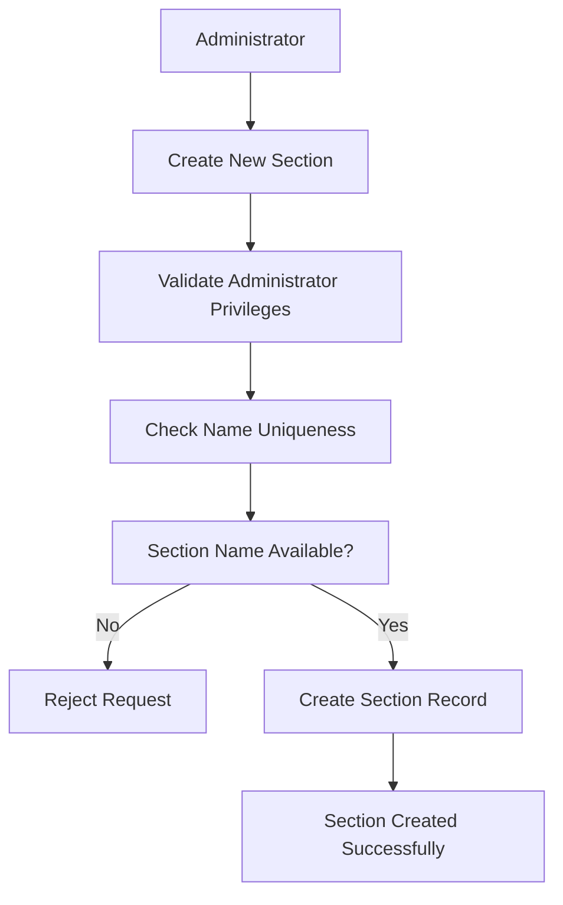

### Section Browsing and Access Patterns

### Section Browsing and Access Patterns

WHEN any user browses the discussion board, THE system SHALL:
1. Display the complete list of all available sections
2. Show both section name and description for each section
3. Organize sections for easy navigation and discovery
4. Present sections as clickable categories for article viewing

WHEN a user views the section list, THE system SHALL NOT restrict access based on user role or authentication status.

IF there are no sections available, THE system SHALL display a message indicating no sections exist.

WHILE sections exist, THE system SHALL maintain consistent availability for browsing.

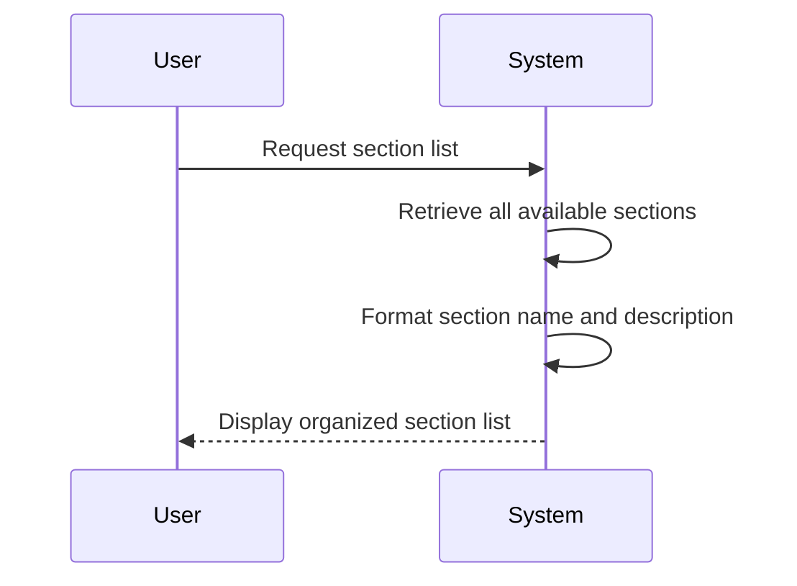

WHEN a user clicks on a specific section, THE system SHALL:
1. Display all articles within that section
2. Maintain the section context for browsing
3. Organize articles according to the section's thematic focus
4. Provide navigation back to the complete section list

### Section Description and Category Management

### Section Description and Category Management

WHEN an administrator creates or edits a section, THE system SHALL:
1. Provide a description field for detailed topical information
2. Allow administrators to modify the description
3. Maintain descriptive text that explains the section's purpose
4. Enable description updates to reflect changing topical focus

WHEN a section description is updated, THE system SHALL preserve the previous description history.

IF the section description exceeds reasonable length limits, THE system SHALL provide appropriate validation feedback.

WHILE sections exist, THE system SHALL ensure descriptions remain visible to all users browsing sections.

WHERE category management applies, THE system SHALL:
1. Allow administrators to organize sections into a coherent structure
2. Support thematic grouping of related content areas
3. Provide tools for reorganizing section presentation
4. Maintain consistency in category naming conventions

### Section Organization and Article Categorization

### Section Organization and Article Categorization

WHEN articles are created, THE system SHALL:
1. Require selection of exactly one section for categorization
2. Associate the article with the chosen section
3. Organize articles within their designated thematic sections
4. Maintain the section assignment throughout the article lifecycle

WHEN articles are viewed, THE system SHALL:
1. Display articles within their respective sections
2. Provide clear section context for each article
3. Enable browsing of all articles in a specific section
4. Organize article display by section categorization

WHEN a section is deleted, THE system SHALL determine the appropriate handling for existing articles in that section.

WHERE section organization applies, THE system SHALL maintain consistent article categorization.

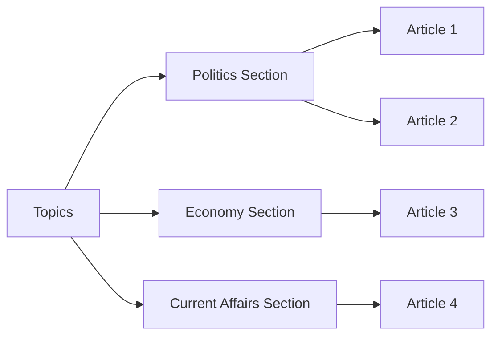

### Administrative Section Controls

### Administrative Section Controls

WHEN an administrator edits a section, THE system SHALL:
1. Allow modification of both section name and description
2. Validate that any name change maintains uniqueness
3. Preserve the section's article associations
4. Enable comprehensive section metadata management

WHEN an administrator deletes a section, THE system SHALL:
1. Confirm the intention to delete with appropriate warnings
2. Handle existing articles appropriately (as defined in business rules)
3. Remove the section from browsing lists
4. Prevent access to the deleted section

WHILE administrative controls are exercised, THE system SHALL verify user administrator privileges.

WHERE administrative section management applies, THE system SHALL provide appropriate tools for:
1. Section creation and configuration
2. Section editing and reorganization
3. Section deletion and cleanup
4. Section access control and visibility management

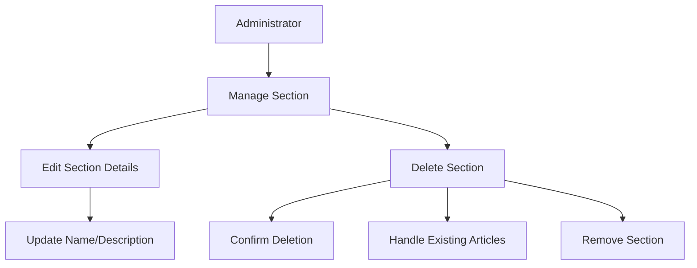

WHEN administrative controls are applied, THE system SHALL restrict these actions to users with administrator privileges only.

## Attachment Operations

Users can attach files and images to their articles during creation or editing. Multiple attachments can be added to a single article as supplementary content. Attachments include files of various types and images in supported formats. The system stores attachments associated with their respective articles. Users can download attachments when viewing article content. Attachment viewing is available to all users who can access the article. Authors can manage attachments through article editing operations. Attachment deletion occurs when articles are deleted or attachments are removed during editing. The system must handle various file types commonly used in discussions. Attachment operations require proper authorization based on article ownership. Users can attach relevant documents and visual materials to support their articles. Attachment management integrates with article creation and editing workflows.

### Attachment Upload and Association

### Attachment Upload and Association

**File Attachment Process**

WHEN a user creates or edits an article, THE system SHALL provide an attachment upload interface.
WHEN a user selects files to attach, THE system SHALL:
1. Validate each file meets size and type requirements (defined in Business Rules)
2. Process files sequentially
3. Display upload progress for each file
4. Show confirmation when attachments are successfully uploaded

**Multiple Attachment Support**

THE system SHALL allow multiple files and images to be attached to a single article.
WHILE processing multiple attachments, THE system SHALL continue processing remaining files if individual files fail validation.

**Attachment Association**

THE system SHALL maintain a clear association between each attachment and its parent article.
WHEN an article is deleted, THE system SHALL delete all associated attachments.
WHEN attachments are removed during article editing, THE system SHALL delete the removed attachments from storage.

**Authorization Requirements**

IF the user is not the article author and does not have administrator privileges, THEN THE system SHALL reject attachment upload requests.
IF the user attempts to download attachments from an article they cannot access, THEN THE system SHALL deny download access.

### Attachment Download and Access Control

### Attachment Download and Access Control

**Download Capability**

WHEN viewing an article, THE system SHALL display all attached files and images.
WHEN a user requests to download an attachment, THE system SHALL:
1. Verify the user has access to view the parent article
2. Retrieve the attachment from storage
3. Serve the file with its original filename
4. Track successful downloads (for analytics only)

**User Access Controls**

Guests SHALL be able to download attachments from articles in viewable sections.
Members SHALL be able to download attachments from all articles they can access.
Administrators SHALL be able to download attachments from any article, regardless of section or author.

**Viewing Attachments**

THE system SHALL display images within the article content when practical.
THE system SHALL display file attachments with clear download links.
WHEN a file type cannot be displayed inline, THE system SHALL indicate it requires download.

**Access Control Flow**
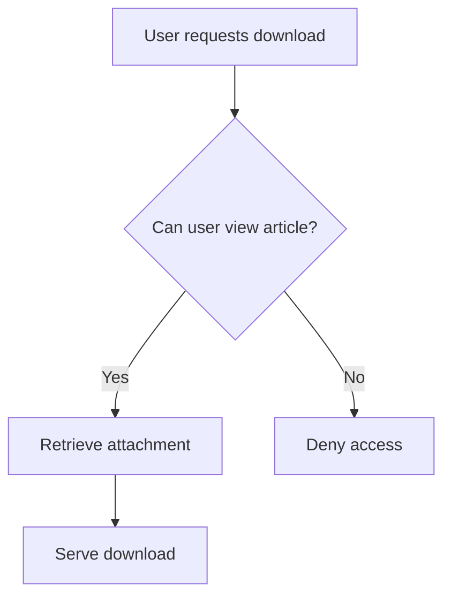

### Attachment Management and Integration

### Attachment Management and Integration

**Supplementary Content Management**

THE system SHALL treat attachments as supplementary content to the article text.
WHEN editing an article, THE system SHALL allow authors to:
1. Add new attachments
2. Remove existing attachments
3. Reorder attachment display sequence

**Integration with Articles**

THE system SHALL ensure attachments remain accessible as long as their parent article exists.
WHEN an article is moved between sections, THE system SHALL preserve all attachments.
THE system SHALL not allow attachments to exist independently of articles.

**File Type Handling**

THE system SHALL accept common file types used in economic and political discussions (defined in Business Rules).
WHEN a file type is unsupported, THE system SHALL reject the upload with a clear error message.
THE system SHALL differentiate between image files and document files for appropriate display.

**Attachment Operations Flow**
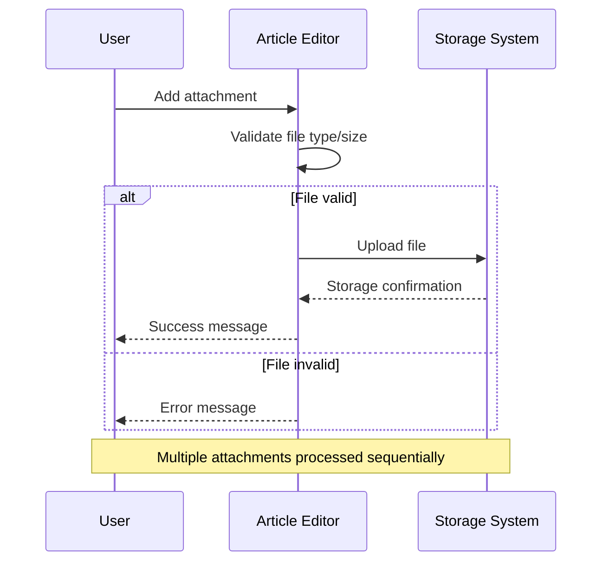

### Storage and Retrieval Operations

### Storage and Retrieval Operations

**Storage Operations**

THE system SHALL store attachments in a secure, accessible storage system.
WHEN storing attachments, THE system SHALL:
1. Generate unique identifiers for each file
2. Preserve original filenames for user reference
3. Store metadata including upload time and uploader
4. Maintain file integrity during storage

**Retrieval Operations**

WHEN retrieving attachments, THE system SHALL:
1. Locate the file by its unique identifier
2. Verify file integrity before serving
3. Serve the file with correct content type headers
4. Handle concurrent download requests appropriately

**System Integration**

THE system SHALL integrate attachment storage with article lifecycle management.
WHEN performing system backups, THE system SHALL include attachments.
WHEN restoring from backups, THE system SHALL restore attachments with their article associations.

**Error Handling**

IF an attachment cannot be retrieved from storage, THEN THE system SHALL:
1. Log the retrieval failure
2. Display a clear error to the user
3. Maintain article accessibility without the unavailable attachment

IF storage capacity is reached, THEN THE system SHALL reject new attachment uploads until capacity is increased.

## AdminRequest Operations

Users can submit requests to become administrators by providing a reason. Each request includes explanatory text justifying the administration request. Super administrators can view pending requests awaiting approval decisions. Request status tracks whether requests are pending, approved, or rejected. Super administrators can approve requests, granting administrator privileges. Rejected requests are recorded with the decision but do not grant privileges. Approved requests transform regular users into regular administrators. The system maintains a history of all administration request submissions. Users can only have one active pending request at any time. Request operations separate regular user functions from administrative processes. The workflow ensures controlled access to administrative capabilities. Request management maintains system security and proper privilege escalation.

### AdminRequest Submission Process

### Request Submission Process

WHEN a user submits an administrator request, THE system SHALL:
1. Require the user to be logged in and not already an administrator
2. Require a reason text field to be completed
3. Capture the submission timestamp automatically
4. Set the initial request status to "pending"
5. Associate the request with the submitting user

THE system SHALL ensure users can only submit one request at a time.

IF the reason field is empty, THE system SHALL reject the request.
IF the user already has a pending request, THE system SHALL reject the request.
IF the user is already an administrator, THE system SHALL reject the request.

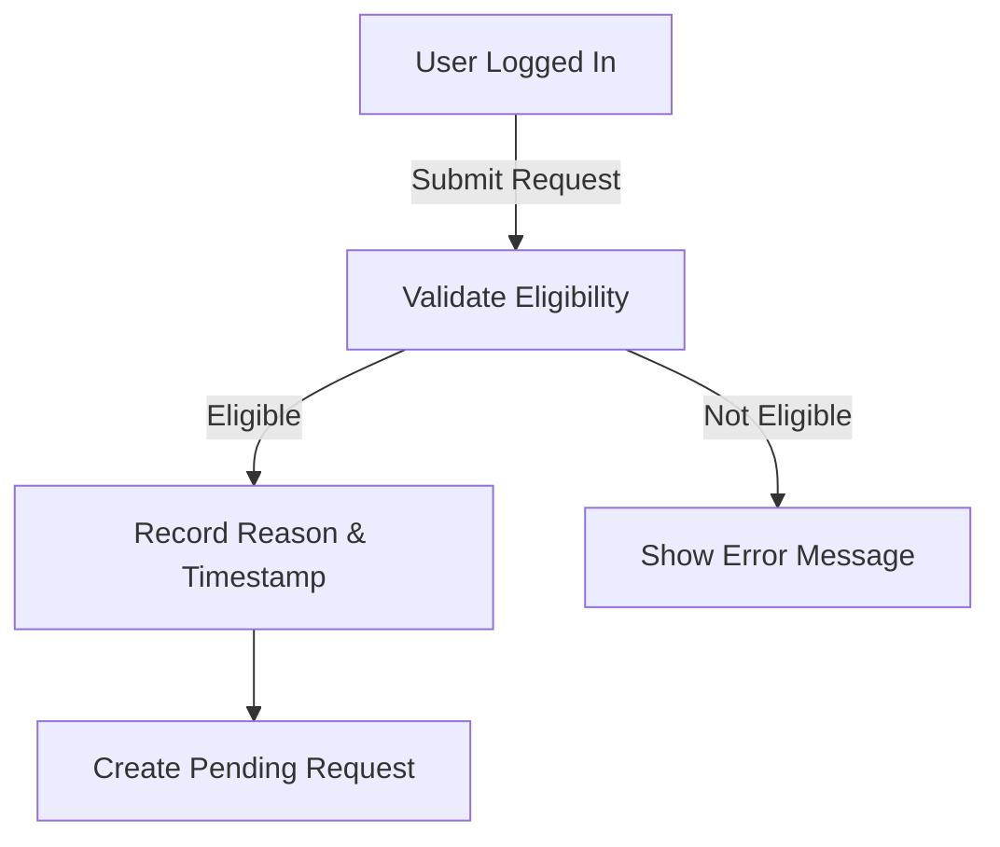

### Reason Justification and Content Requirements

### Reason Justification and Content Requirements

WHEN a user provides a reason for administrator access, THE system SHALL:
1. Store the reason text exactly as provided by the user
2. Apply content validation rules to ensure appropriate justification
3. Maintain the reason text as read-only once the request is submitted
4. Ensure the reason text is visible to reviewing super administrators

IF the reason text contains prohibited content, THE system SHALL reject the request.
IF the reason text exceeds system-defined length limits, THE system SHALL reject the request.
IF the reason text is too brief to provide meaningful justification, THE system SHALL reject the request.

THE system SHALL preserve the original reason text throughout the request lifecycle, even if the request is approved or rejected.

### Reason Presentation

WHEN displaying request information to super administrators, THE system SHALL present the reason text prominently alongside other request details.

WHEN a request is archived, THE system SHALL retain the reason text as part of the historical record.

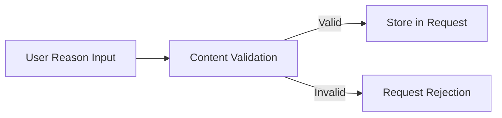

### Pending Request Viewing and Management

### Pending Request Viewing and Management

WHEN super administrators view the administrator request queue, THE system SHALL:
1. Display all pending requests in chronological order by submission time
2. Show user display name, submission timestamp, and reason text for each request
3. Provide controls to approve or reject individual requests
4. Clearly indicate the total number of pending requests

WHEN reviewing a specific pending request, THE system SHALL:
1. Display complete request details including full reason text
2. Show user profile information for context
3. Provide clear action options (approve, reject) with confirmation

THE system SHALL ensure only super administrators can view pending requests.

WHILE there are pending requests, THE system SHALL make them available for review.

IF there are no pending requests, THE system SHALL display an appropriate message.

THE system SHALL prevent super administrators from viewing pending requests if they are not authorized.

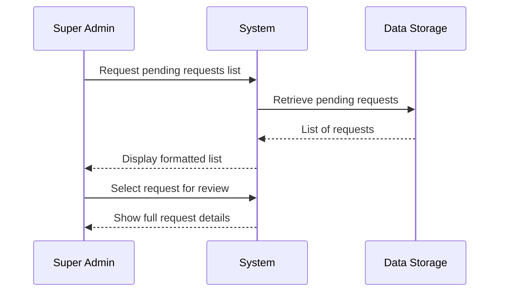

### Request Status Tracking and Transitions

### Request Status Tracking and Transitions

THE system SHALL maintain the following request statuses: "pending", "approved", "rejected".

WHEN a request is created, THE system SHALL set its status to "pending".

WHEN a super administrator approves a request, THE system SHALL:
1. Change request status from "pending" to "approved"
2. Record the approval timestamp and approving super administrator
3. Immediately grant regular administrator privileges to the requesting user
4. Prevent any further status changes for this request

WHEN a super administrator rejects a request, THE system SHALL:
1. Change request status from "pending" to "rejected"
2. Record the rejection timestamp and rejecting super administrator
3. Not grant any administrator privileges
4. Prevent any further status changes for this request

THE system SHALL prevent requests from transitioning directly from "pending" to "approved" or "rejected" without super administrator action.

THE system SHALL prevent any status changes after a request reaches "approved" or "rejected" status.

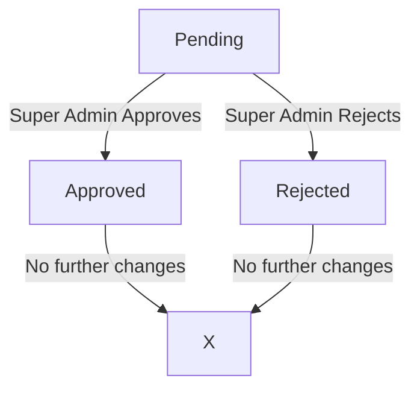

### Administrator Request Approval Workflow

### Administrator Request Approval Workflow

WHEN a super administrator reviews and approves an administrator request, THE system SHALL:
1. Require explicit confirmation before executing the approval
2. Grant regular administrator privileges to the requesting user
3. Update the user's administrative status in their profile
4. Send a notification to the approved user about their new status
5. Archive the approved request for historical reference

WHEN user privileges are granted, THE system SHALL ensure the user can:
1. Access administrator-specific functions immediately
2. Perform all regular administrator actions
3. Receive appropriate user interface updates reflecting their new status

THE system SHALL prevent super administrators from approving their own requests.

THE system SHALL prevent approval of requests from users who have been banned or otherwise restricted.

IF the approving super administrator loses super administrator privileges during the approval process, THE system SHALL reject the approval.

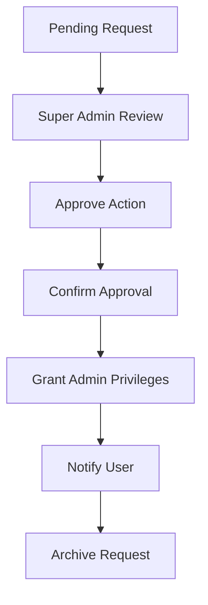

### Request Rejection Handling and Communication

### Request Rejection Handling and Communication

WHEN a super administrator reviews and rejects an administrator request, THE system SHALL:
1. Require explicit confirmation before executing the rejection
2. Preserve the original request with "rejected" status
3. Store the rejection timestamp and rejecting administrator identity
4. Send a notification to the user about the rejection
5. Prevent the user from receiving administrator privileges

THE system SHALL ensure that rejection does not affect the user's regular account status.

WHEN a request is rejected, THE system SHALL allow the user to submit a new request after a defined waiting period.

THE system SHALL prevent super administrators from rejecting their own requests.

THE system SHALL provide appropriate feedback to super administrators about the rejection outcome.

IF the rejecting super administrator loses super administrator privileges during the rejection process, THE system SHALL cancel the rejection.

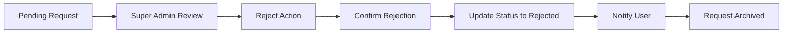

### Privilege Escalation and User Promotion

### Privilege Escalation and User Promotion

WHEN an administrator request is approved, THE system SHALL escalate user privileges from "member" to "regular administrator".

THE system SHALL ensure privilege escalation includes:
1. Ability to create, edit, and delete sections
2. Ability to delete any article
3. Ability to delete any comment
4. Ability to ban and unban users
5. Ability to view banned user lists
6. Retention of all regular member capabilities

WHEN a user becomes a regular administrator, THE system SHALL:
1. Update their user profile to reflect administrator status
2. Provide access to administrator-specific functions and interfaces
3. Include them in appropriate administrator user lists
4. Maintain their existing articles, comments, and profile information

THE system SHALL ensure privilege escalation occurs only through the formal approval process.

THE system SHALL prevent privilege escalation for users who are currently banned.

THE system SHALL maintain a clear distinction between regular administrators and super administrators in terms of capabilities.

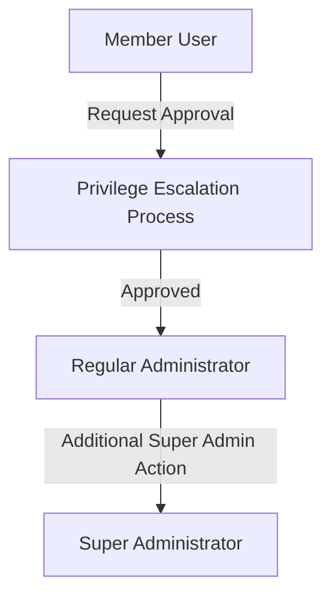

### Administration Request History and Audit Trail

### Administration Request History and Audit Trail

THE system SHALL maintain a complete history of all administrator requests.

WHEN viewing request history, THE system SHALL provide:
1. Complete chronological record of all requests
2. Request status, submission timestamp, and decision timestamp
3. User display name and reason text for each request
4. Identity of super administrators who approved or rejected requests

THE system SHALL preserve request records even after approval or rejection.

THE system SHALL make request history available only to super administrators.

WHEN a super administrator views the request history, THE system SHALL:
1. Provide filtering options by status, date range, or user
2. Display clear status indicators for each request
3. Show complete details when selecting a specific historical request
4. Maintain historical accuracy without allowing modifications

THE system SHALL ensure the request history serves as an audit trail for all privilege escalation decisions.

```mermaid
flowchart LR
    C["Request Creation"] --> S["Status Updates"]
    S --> A["Approval/Rejection"]
    A --> H["Historical Storage"]
    H --> V["Super Admin View"]
    V --> R["Audit Reporting"]
```

### Single Active Request Enforcement

### Single Active Request Enforcement

THE system SHALL ensure each user can have only one active pending request at a time.

WHEN checking for existing requests, THE system SHALL:
1. Search for any pending request associated with the user
2. Consider only requests with "pending" status as active requests
3. Ignore approved or rejected requests when determining active status

IF a user attempts to submit a new request while having an existing pending request, THE system SHALL reject the submission.

THE system SHALL allow users to submit new requests only after:
1. Their previous pending request has been approved or rejected
2. Any applicable waiting period has elapsed for rejected requests

WHEN a user's pending request transitions to "approved" or "rejected", THE system SHALL consider that request slot available for new submissions.

THE system SHALL provide clear messaging to users about their current request status and restrictions.

```mermaid
flowchart TD
    U["User Wants to Submit"] --> C["Check Active Request"]
    C -->|"No Active Request"| S["Allow Submission"]
    C -->|"Active Request Exists"| R["Reject Submission"]
    R --> M["Show Status Message"]
```

### Security Controls and Access Management

### Security Controls and Access Management

THE system SHALL enforce the following security controls for administrator requests:
1. Only logged-in regular members can submit administrator requests
2. Only super administrators can view pending requests
3. Only super administrators can approve or reject requests
4. Request decisions require explicit confirmation
5. All request transactions are logged for security auditing

THE system SHALL prevent:
1. Super administrators from approving their own requests
2. Users from modifying submitted requests
3. Non-super administrators from viewing request status of other users
4. Automatic approval without manual review
5. Batch processing of requests without individual consideration

WHEN processing request decisions, THE system SHALL verify the super administrator's current authorization status.

THE system SHALL implement appropriate timeouts for request review sessions.

THE system SHALL protect request data from unauthorized access during transmission and storage.

```mermaid
flowchart TD
    A["User Action"] --> V["Authorization Check"]
    V -->|"Authorized"| P["Process Action"]
    V -->|"Not Authorized"| D["Deny Action"]
    P --> L["Log Transaction"]
    D --> E["Security Alert"]
```

# Business Actions and Workflows

Business actions and workflows beyond basic CRUD.

## User Actions

Users register for the system by providing their email address and creating a secure password. After registration, users verify their email address through a confirmation link sent to their inbox. Users can log in to the system using their registered email and password credentials. If users forget their password, they can initiate a password reset process through email verification. Users can update their profile information including display name and biography text. Users can browse and view other users' profiles to see their display name, biography, and activity history. Users maintain control over their account through the ability to change passwords and delete their account entirely. When a user deletes their account, all associated articles and comments are permanently removed from the system. Users can view their own profile to see all articles they have authored and comments they have posted. The system maintains user authentication sessions to ensure secure access to protected features.

### User Registration Workflow

### User Registration Workflow

WHEN a user initiates account registration, THE system SHALL:
1. Present a registration form requiring email address and password
2. Validate the email address format
3. Validate password meets minimum security requirements
4. Check that the email address is not already registered
5. Create an unverified user account when all validation passes

WHEN a user submits registration information with an invalid email format, THE system SHALL reject the registration with an appropriate error message.

WHEN a user submits registration information with an already registered email address, THE system SHALL reject the registration and inform the user that the email is already in use.

WHEN a user submits registration information with an insufficient password, THE system SHALL reject the registration and specify the password requirements.

WHEN registration is successful, THE system SHALL immediately send an email verification link to the provided email address.

IF the registration process fails after account creation, THE system SHALL roll back all changes to maintain data consistency.

WHERE a user successfully registers, THE system SHALL store the registration timestamp and initial account status.

### Email Verification Process

### Email Verification Process

WHEN a user completes registration, THE system SHALL:
1. Generate a unique verification token
2. Send a verification email containing a confirmation link
3. Mark the user account as 'pending verification'

WHEN a user clicks the verification link in the email, THE system SHALL:
1. Validate the verification token
2. Mark the user account as 'verified' when token is valid
3. Log the verification timestamp
4. Redirect the user to the login page

IF a user attempts to log in with an unverified account, THE system SHALL prevent access and prompt the user to verify their email.

WHEN a verification token expires or becomes invalid, THE system SHALL reject the verification attempt and provide the option to resend the verification email.

WHEN a user requests a new verification email, THE system SHALL:
1. Generate a new verification token
2. Invalidate any previous verification tokens for that user
3. Send a new verification email
4. Update the verification request timestamp

IF a user account remains unverified for more than 7 days, THE system SHALL automatically mark the account as expired and prevent further verification attempts.

### Login Authentication Flow

### Login Authentication Flow

WHEN a user attempts to log in, THE system SHALL:
1. Validate the email address format
2. Verify the email exists in the system
3. Authenticate the password against stored credentials
4. Check that the account is not banned
5. Verify the account email has been confirmed

IF authentication succeeds, THE system SHALL:
1. Create an authentication session
2. Record login timestamp
3. Redirect the user to their dashboard or last visited page
4. Update the user's online status

IF the email address is not found in the system, THE system SHALL return a generic error message without specifying whether the email exists.

IF the password is incorrect, THE system SHALL:
1. Increment the failed login attempt counter
2. Apply account lockout rules after multiple failed attempts
3. Return a generic authentication error

WHEN a user successfully logs in, THE system SHALL clear any previous failed login attempt counters for that account.

WHILE a user remains logged in, THE system SHALL maintain the authentication session and track session activity.

IF a user attempts to log in with a banned account, THE system SHALL reject the login and inform the user their account has been banned.

WHERE a user logs in from a new device or location, THE system MAY record this information for security monitoring.

### Password Recovery Workflow

### Password Recovery Workflow

WHEN a user requests password recovery, THE system SHALL:
1. Validate the provided email address format
2. Verify the email exists in the system
3. Generate a secure password reset token
4. Send a password reset email with the token

WHEN a user accesses the password reset link, THE system SHALL:
1. Validate the reset token
2. Verify the token has not expired
3. Present a password reset form

WHEN a user submits a new password through the reset form, THE system SHALL:
1. Validate password meets security requirements
2. Update the user's password in the system
3. Invalidate all existing reset tokens for that user
4. Invalidate all active sessions for that user
5. Send a confirmation email that the password was changed

IF a user submits an expired or invalid reset token, THE system SHALL reject the password reset and provide the option to request a new reset email.

WHERE password reset is requested, THE system SHALL record the reset request timestamp and the originating IP address.

WHEN a password reset is completed successfully, THE system SHALL require the user to log in with the new password to access their account.

IF a user attempts to use the same password that was previously used, THE system SHALL reject it and prompt for a new, unused password.

### Profile Management Actions

### Profile Management Actions

WHEN a user views their own profile, THE system SHALL display:
1. Current display name and biography text
2. Complete list of articles they have authored (with links)
3. Complete list of comments they have posted (with links)
4. Account creation date
5. Last profile update timestamp

WHEN a user edits their profile, THE system SHALL:
1. Validate the display name is not empty
2. Validate the display name does not contain inappropriate content
3. Validate biography text length is within limits
4. Update the profile information when validation succeeds
5. Record the update timestamp

IF a user attempts to set an empty display name, THE system SHALL reject the update and require a non-empty value.

WHEN profile updates are saved, THE system SHALL immediately reflect the changes in the user interface.

WHERE a user modifies their display name, THE system SHALL update the display name across all their existing articles and comments.

WHEN a user attempts to use a display name that already exists, THE system SHALL suggest alternatives or allow the duplicate with a distinguishing identifier.

THE system SHALL prevent profile updates while the user's account is in a locked or suspended state.

### Account Deletion Process

### Account Deletion Process

WHEN a user requests to delete their account, THE system SHALL:
1. Require password confirmation for security
2. Display a summary of data that will be permanently deleted
3. Provide a final confirmation step

WHEN account deletion is confirmed, THE system SHALL:
1. Permanently delete all articles authored by the user
2. Permanently delete all comments posted by the user
3. Remove the user's profile information
4. Invalidate all active sessions for the user
5. Send a confirmation email to the user's email address
6. Mark the account as deleted with timestamp

IF an article being deleted has associated comments from other users, THE system SHALL delete those comments along with the article.

WHERE a user's comment is deleted as part of account deletion, THE system SHALL remove that comment from the associated article's comment count.

WHEN a user initiates account deletion but does not complete the confirmation step, THE system SHALL retain the account and all associated data.

THE system SHALL prevent account deletion while the user has pending administrative requests or is involved in active moderation actions.

WHILE account deletion is in progress, THE system SHALL prevent the user from performing any other actions on the platform.

### User Profile Viewing

### User Profile Viewing

WHEN a user views another user's profile, THE system SHALL display:
1. The user's display name and biography text
2. Public list of articles authored by that user (title and publication date only)
3. Public list of comments posted by that user (excerpt and timestamp only)
4. Account creation date (if public)
5. User activity statistics (total articles, total comments)

WHERE a user profile contains sensitive or private information, THE system SHALL exclude this from public profile views.

WHEN a banned user's profile is viewed, THE system SHALL indicate that the account has been banned while still displaying their existing public content.

THE system SHALL not disclose email addresses or authentication information in any public profile view.

WHERE a user has set their profile to private, THE system SHALL restrict profile viewing to authenticated users only.

WHEN viewing a profile, THE system SHALL provide navigation links to view individual articles or comments from that user.

IF a user attempts to view a profile that does not exist or has been deleted, THE system SHALL display an appropriate error message.

### Authentication Session Management

### Authentication Session Management

WHEN a user successfully authenticates, THE system SHALL:
1. Create a secure authentication session
2. Assign a unique session identifier
3. Set appropriate session timeout period
4. Record session creation timestamp
5. Track session activity

WHILE a user remains authenticated, THE system SHALL:
1. Maintain session state across requests
2. Track last activity timestamp
3. Validate session integrity on each request
4. Enforce session timeout rules

WHEN a user's session expires due to inactivity, THE system SHALL:
1. Invalidate the session
2. Clear session data
3. Redirect the user to the login page
4. Display a message indicating session timeout

WHEN a user logs out, THE system SHALL:
1. Invalidate the current session
2. Clear all session data
3. Redirect to the login page
4. Send a logout confirmation

IF a user attempts to access a protected resource without a valid session, THE system SHALL redirect them to the login page with an appropriate message.

WHERE multiple concurrent sessions are detected for a single user account, THE system SHALL allow configuration-based policy enforcement (allow, warn, or restrict).

WHEN security anomalies are detected in a session (unusual location, multiple failed attempts), THE system SHALL have the capability to terminate the session and require reauthentication.

### Profile Editing Workflow

### Profile Editing Workflow

WHEN a user navigates to edit their profile, THE system SHALL:
1. Display the current profile information in editable fields
2. Show character limits for display name and biography
3. Provide clear save and cancel options
4. Validate changes in real-time where possible

WHEN a user submits profile edits, THE system SHALL:
1. Validate all modified fields
2. Check for content policy violations
3. Update the profile when validation passes
4. Show a success confirmation
5. Update the profile's last modified timestamp

IF validation fails during profile editing, THE system SHALL:
1. Highlight the fields with errors
2. Provide specific error messages
3. Preserve all valid entered data
4. Allow the user to correct errors and resubmit

WHILE a user is editing their profile, THE system SHALL prevent concurrent edits from other sessions or devices.

WHERE profile editing conflicts occur (simultaneous edits), THE system SHALL apply a last-write-wins policy with appropriate notification to the user.

WHEN profile changes are saved, THE system SHALL update the display name across all the user's existing content (articles and comments) within a reasonable time frame.

THE system SHALL provide an option to preview profile changes before saving them permanently.

### Account Security Actions

### Account Security Actions

WHEN a user changes their password, THE system SHALL:
1. Require entry of current password for verification
2. Validate new password meets security requirements
3. Confirm new password by re-entry
4. Update password in the system
5. Invalidate all active sessions
6. Send email notification of the change

IF the current password entered during password change is incorrect, THE system SHALL reject the change and increment a failed attempt counter.

WHEN a user views their account security settings, THE system SHALL display:
1. Password last changed timestamp
2. Current active sessions with device/location information
3. Recent account activity log
4. Option to log out from all devices

WHEN a user chooses to log out from all devices, THE system SHALL:
1. Invalidate all active sessions for their account
2. Send email notification of the action
3. Require reauthentication on next access attempt

WHERE suspicious account activity is detected, THE system SHALL have the capability to temporarily lock the account and require additional verification.

WHEN a user's email address needs to be changed, THE system SHALL:
1. Require password confirmation
2. Send verification email to the new address
3. Keep the old email active until the new one is verified
4. Update all notifications to use the new email once verified

THE system SHALL prevent security actions (password changes, email changes) while the account is in a locked state or undergoing moderation review.

## Article Actions

Users create articles by selecting a section and providing a title, content, and optional tags. When creating articles, users can attach multiple files and images to support their content. Article editing allows users to modify the title, content, attachments, and tags of their existing articles. Users can delete their own articles, which removes them permanently from the system. Articles are organized within specific sections that categorize the content by topic. Users browse articles within sections using paginated lists that show basic article information. Article lists display titles, authors, tags, comment counts, and posting times for quick scanning. Users can sort article lists by newest or oldest publication dates for different viewing preferences. When viewing individual articles, users see the full content along with all attached files and images. Article search functionality allows users to find content by searching titles and article content.

### Article Creation Workflow

WHEN a member or administrator creates a new article, THE system SHALL:
1. Require selection of one existing section
2. Require entry of a non-empty title
3. Require entry of non-empty content text
4. Allow optional addition of multiple free-text tags
5. Allow optional attachment of multiple files and images
6. Associate the new article with the creating user as its author
7. Record the creation timestamp

IF the required section does not exist or is not accessible, THE system SHALL reject the article creation.
IF the required title or content is empty, THE system SHALL reject the article creation.
WHILE creating an article, THE system SHALL allow users to add, remove, and preview attached files before final submission.

**Workflow Diagram**:
```mermaid
flowchart TD
    A["User starts article creation"] --> B["Select section from available options"]
    B --> C["Enter title and content"]
    C --> D{"Add optional content?"}
    D -->|Yes| E["Add tags, attach files/images"]
    D -->|No| F["Preview article"]
    E --> F
    F --> G["Submit for creation"]
    G --> H{"Validation successful?"}
    H -->|Yes| I["Article created successfully"]
    H -->|No| J["Show validation errors"]
    J --> C
```

### Attachment Management Process

WHEN users manage attachments during article creation or editing, THE system SHALL:
1. Allow upload of multiple files and images in a single operation
2. Support various file types for different multimedia content
3. Process and store attachments with the associated article
4. Provide visual confirmation of successfully uploaded attachments

WHEN users view an article, THE system SHALL display all attached files and images as accessible elements.
WHEN users download attachments, THE system SHALL provide the original file with its original filename.

IF a file exceeds system size limits, THE system SHALL reject that specific file while allowing other valid attachments to proceed.
IF an unsupported file type is attempted, THE system SHALL reject that specific file with an appropriate error message.

**Attachment Management Flow**:
```mermaid
sequenceDiagram
    participant U as User
    participant S as System
    U->>S: Begin attachment upload
    S->>S: Validate file count limit not exceeded
    S->>S: Validate individual file size
    S->>S: Validate file type support
    alt All files valid
        S->>S: Process and store all attachments
        S-->>U: Upload successful confirmation
    else Some files invalid
        S->>S: Process and store valid attachments only
        S-->>U: Partial success with error details
    end
```

### Article Editing Actions

WHEN article authors edit their existing articles, THE system SHALL allow modification of:
1. Title content
2. Article content text
3. Selected section
4. Tag collection (add, remove, or modify tags)
5. Attachment collection (add new attachments or remove existing ones)

THE system SHALL record the update timestamp for each article modification.
THE system SHALL preserve the original creation timestamp during editing.

IF a user attempts to edit an article they did not author, THE system SHALL reject the edit request.
IF the new title or content becomes empty after editing, THE system SHALL reject the edit request.

WHILE editing an article, THE system SHALL provide a preview of changes before final submission.
WHEN administrators edit articles, THE system SHALL allow modification of any article regardless of authorship (as defined in actors-and-auth.md).

### Article Deletion Workflow

WHEN article authors delete their own articles, THE system SHALL:
1. Remove the article from public visibility
2. Remove all associated comments from the system
3. Remove all associated attachments from storage
4. Maintain referential integrity by eliminating all references to the deleted article

WHEN administrators delete articles, THE system SHALL allow removal of any article regardless of authorship.
THE system SHALL require confirmation before proceeding with article deletion.

IF a user attempts to delete an article they did not author and are not authorized as administrator, THE system SHALL reject the deletion request.

**Deletion Confirmation Flow**:
```mermaid
flowchart TD
    A["User requests article deletion"] --> B{"User authorized?"}
    B -->|Author or Admin| C["Show deletion confirmation"]
    B -->|Not authorized| D["Show permission error"]
    C --> E{"User confirms deletion?"}
    E -->|Yes| F["Execute deletion cascade"]
    E -->|No| G["Cancel operation"]
    F --> H["Article and all dependencies removed"]
```

### Section-Based Organization

THE system SHALL organize all articles within specific topical sections.
WHEN creating or editing articles, THE system SHALL require selection of exactly one section.

WHEN viewing section content, THE system SHALL display only articles belonging to that specific section.
WHEN articles are moved between sections during editing, THE system SHALL update all section-based categorization accordingly.

THE system SHALL prevent creation of articles without an assigned section.
THE system SHALL prevent assignment of articles to non-existent or deleted sections.

WHEN a section is deleted by administrators (as defined in section operations), THE system SHALL handle orphaned articles according to business rules (defined in 04-business-rules.md).

### Article Browsing Flow

WHEN users browse articles within a section, THE system SHALL:
1. Display a paginated list of articles
2. Show per-article: title, author display name, tags, comment count, and posting time
3. Hide full article content in list view
4. Provide navigation to individual article pages

THE system SHALL implement pagination with configurable page size to manage list performance.
THE system SHALL provide clear navigation controls between pages (next, previous, first, last, specific page).

WHEN no articles exist in a section, THE system SHALL display an appropriate empty state message.

**Browsing User Journey**:
```mermaid
graph LR
    A["User selects section"] --> B["Load first page of articles"]
    B --> C["Display article list with metadata"]
    C --> D{"User action?"}
    D -->|View article| E["Navigate to full article view"]
    D -->|Next page| F["Load next page of results"]
    D -->|Sort change| G["Reload articles with new sorting"]
    F --> C
    G --> C
```

## Comment Actions

Users write comments on articles to participate in discussions and share their perspectives. Comments are single-level responses that appear directly under the article content. When viewing articles, users can see all comments sorted chronologically from oldest to newest. Each comment displays the author's information, the comment content, and the posting time. Users can edit their own comments to correct errors or update their thoughts. Comment deletion allows users to remove their contributions from the discussion thread. The system maintains comment integrity by preserving timestamps and author information. Comment workflows support real-time discussion without nested reply structures. Users engage with content through commenting while maintaining individual responsibility for their contributions. Comment management ensures that discussions remain organized and accessible to all readers.

### Comment Creation Workflow

### Comment Creation Workflow

WHEN a user creates a comment on an article, THE system SHALL:
1. Require the comment content to be non-empty
2. Associate the comment with the authenticated user
3. Associate the comment with the target article
4. Record the creation timestamp
5. Validate that the article exists and is accessible

IF the comment content is empty, THE system SHALL reject the creation request.
IF the target article does not exist, THE system SHALL reject the creation request.
IF the user does not have permission to view the article, THE system SHALL reject the creation request.

WHEN a comment is successfully created, THE system SHALL:
1. Store the comment content
2. Associate it with the author and article
3. Record the creation timestamp
4. Make the comment immediately visible to authorized users

THE system SHALL allow comment creation only for authenticated users with article viewing permissions.
THE system SHALL prevent comment creation on articles that have been deleted.
THE system SHALL prevent comment creation by banned users.

### Single-Level Commenting System

WHILE maintaining the single-level commenting structure, THE system SHALL:
1. Display all comments directly under the article content
2. Prevent nested replies to existing comments
3. Treat each comment as an independent response to the article
4. Organize comments in a flat structure without threading

THE system SHALL NOT provide reply functionality to existing comments.
THE system SHALL display all comments at the same hierarchical level.
THE system SHALL ensure that comment relationships are limited to article-to-comment only.

WHEN viewing comment relationships, THE system SHALL show only:
1. Article-to-comment associations
2. Author-to-comment associations
3. No comment-to-comment associations

### Comment Viewing Flow

WHEN a user views an article, THE system SHALL:
1. Display all comments associated with the article
2. Show the comment author's display name
3. Display the comment content in full
4. Show the comment creation timestamp
5. Indicate if a comment has been edited

THE system SHALL display comments only to users who have permission to view the article.
THE system SHALL show edit and delete controls only for the comment author's own comments.
THE system SHALL show administrator controls for users with appropriate permissions.

WHILE displaying comments, THE system SHALL:
1. Maintain comment integrity and prevent tampering
2. Preserve original comment content
3. Display edit indicators when comments have been modified
4. Show accurate timestamps for all comment actions

### Chronological Sorting

WHEN displaying comments for an article, THE system SHALL:
1. Sort comments by creation timestamp in ascending order (oldest first)
2. Maintain consistent sorting across all user sessions
3. Apply the same sorting criteria to all users
4. Preserve chronological order regardless of edit operations

THE system SHALL NOT provide alternative sorting methods for comments.
THE system SHALL ensure that comment order remains stable during pagination.
THE system SHALL maintain chronological order even when comments are edited.

WHILE comments are displayed chronologically, THE system SHALL:
1. Use creation timestamp as the primary sort key
2. Use comment ID as a secondary sort key for tie-breaking
3. Ensure consistent ordering across multiple page views
4. Prevent comment reordering based on edit timestamps

### Comment Editing Actions

WHEN a user edits their own comment, THE system SHALL:
1. Require the user to be authenticated
2. Validate that the comment belongs to the user
3. Require the updated content to be non-empty
4. Record the edit timestamp
5. Preserve the original creation timestamp

IF the comment does not belong to the user, THE system SHALL reject the edit request.
IF the updated content is empty, THE system SHALL reject the edit request.
IF the comment has been deleted, THE system SHALL reject the edit request.

WHEN a comment is successfully edited, THE system SHALL:
1. Update the comment content
2. Record the edit timestamp
3. Maintain the original creation timestamp
4. Indicate that the comment has been edited
5. Preserve all comment metadata

### Comment Deletion Process

WHEN a user deletes their own comment, THE system SHALL:
1. Require the user to be authenticated
2. Validate that the comment belongs to the user
3. Remove the comment from public view
4. Preserve the comment in the system for audit purposes
5. Update the article's comment count

IF the comment does not belong to the user, THE system SHALL reject the deletion request.
IF the comment has already been deleted, THE system SHALL reject the deletion request.

WHEN an administrator deletes a comment, THE system SHALL:
1. Require the user to have administrator privileges
2. Remove the comment from public view
3. Record the administrator who performed the deletion
4. Preserve the comment for audit purposes
5. Update the article's comment count

### Discussion Participation

WHILE users participate in discussions through comments, THE system SHALL:
1. Enable real-time comment visibility to all authorized users
2. Maintain comment authorship attribution
3. Support engagement through comment creation and editing
4. Facilitate discussion flow through chronological display

THE system SHALL provide immediate feedback when comments are created or edited.
THE system SHALL maintain discussion integrity by preserving comment relationships.
THE system SHALL support community engagement through accessible commenting features.

WHEN users engage in discussions, THE system SHALL:
1. Show comment activity in real-time
2. Maintain user identity throughout the discussion
3. Support continuous conversation flow
4. Prevent disruption of ongoing discussions

### Real-time Engagement

WHILE supporting real-time engagement, THE system SHALL:
1. Display new comments immediately after creation
2. Show comment edits in near real-time
3. Maintain comment counts accurately
4. Support concurrent comment operations

THE system SHALL ensure that comment updates are visible to all users simultaneously.
THE system SHALL handle concurrent comment operations without data corruption.
THE system SHALL provide consistent comment visibility across all user sessions.

WHEN multiple users comment simultaneously, THE system SHALL:
1. Process comments in the order received
2. Maintain chronological integrity
3. Prevent comment duplication
4. Handle concurrent operations gracefully

### Comment Management

WHILE managing comments, THE system SHALL:
1. Provide authors with edit and delete capabilities for their comments
2. Provide administrators with comment moderation tools
3. Maintain comment audit trails
4. Support comment restoration when appropriate

THE system SHALL allow comment authors to manage their contributions effectively.
THE system SHALL provide administrators with comprehensive comment management capabilities.
THE system SHALL maintain comment history for accountability purposes.

WHEN managing comment lifecycle, THE system SHALL:
1. Track comment creation, editing, and deletion
2. Maintain comment metadata for audit purposes
3. Support comment moderation workflows
4. Ensure comment integrity throughout the lifecycle

### Thread Organization

WHILE organizing comment threads, THE system SHALL:
1. Maintain a flat comment structure
2. Display comments in chronological order
3. Group comments by article association
4. Prevent nested comment hierarchies

THE system SHALL ensure that comment organization supports clear discussion flow.
THE system SHALL maintain consistent thread structure across all articles.
THE system SHALL prevent comment threading complexity through single-level design.

WHEN organizing comment displays, THE system SHALL:
1. Group comments by article
2. Sort comments chronologically
3. Maintain clear author attribution
4. Support easy navigation through comment lists

### Comment Display and Interaction

### Comment Display Formatting

WHEN displaying comments to users, THE system SHALL:
1. Show the author's display name prominently
2. Display the comment content in readable format
3. Show creation timestamp in user-friendly format
4. Indicate edited comments with visual markers
5. Maintain consistent formatting across all comments

THE system SHALL differentiate between original and edited comments visually.
THE system SHALL display comment metadata without overwhelming the content.
THE system SHALL ensure comment formatting supports readability and accessibility.

WHILE rendering comments, THE system SHALL:
1. Maintain text formatting as entered by the author
2. Support basic text formatting if applicable
3. Prevent malicious content injection
4. Ensure consistent display across different devices

### Comment Access Control

WHEN controlling comment access, THE system SHALL:
1. Allow comment viewing only to users with article access
2. Restrict comment editing to the original author
3. Allow comment deletion to authors and administrators
4. Maintain access controls consistently

IF a user loses article viewing permissions, THE system SHALL hide associated comments.
IF a comment author is banned, THE system SHALL preserve the comment with appropriate labeling.
IF an article is deleted, THE system SHALL hide all associated comments.

THE system SHALL enforce comment access controls based on user permissions and article visibility.
THE system SHALL maintain comment visibility consistency with article access rules.
THE system SHALL prevent unauthorized comment modifications.

### Comment Pagination and Navigation

WHEN displaying large comment sets, THE system SHALL:
1. Implement pagination for comments exceeding threshold
2. Maintain chronological order across pagination boundaries
3. Provide clear navigation between comment pages
4. Display comment counts accurately

THE system SHALL ensure that pagination does not disrupt comment reading flow.
THE system SHALL maintain comment context when navigating between pages.
THE system SHALL provide intuitive pagination controls for users.

WHILE implementing comment pagination, THE system SHALL:
1. Use consistent page sizes
2. Preserve comment order during navigation
3. Provide quick access to newest comments
4. Support efficient comment browsing

### Comment Integrity and Preservation

WHILE maintaining comment integrity, THE system SHALL:
1. Preserve original comment content after edits
2. Maintain audit trails for all comment modifications
3. Prevent comment tampering by unauthorized users
4. Ensure comment data consistency

THE system SHALL protect comments from unauthorized modification or deletion.
THE system SHALL maintain comment history for accountability and audit purposes.
THE system SHALL ensure that comment data remains consistent across all operations.

WHEN preserving comment integrity, THE system SHALL:
1. Use immutable timestamps for creation and modification
2. Maintain author attribution throughout comment lifecycle
3. Prevent comment content corruption
4. Support comment restoration when appropriate

## Section Actions

Administrators create sections to organize content into specific topic areas like Politics or Economy. Each section requires a name and description to define its purpose and scope. Section editing allows administrators to update section names and descriptions as needed. Administrators can delete sections when they are no longer relevant to the discussion board. Users browse available sections to find content that matches their interests. Within each section, users can view paginated lists of articles organized by that topic. Section management ensures that content remains well-organized and easily navigable. The section system provides structural organization for the entire discussion platform. Users benefit from categorized content that helps them find relevant discussions quickly. Section workflows support the overall information architecture of the discussion board.

### Section Creation Workflow

### Section Creation Workflow

WHEN an administrator creates a new section, THE system SHALL:
1. Require a unique section name
2. Require a section description
3. Associate the section with the creating administrator
4. Generate a creation timestamp
5. Make the section immediately available for article posting

IF the section name already exists, THE system SHALL reject the creation request.
IF the section name is empty, THE system SHALL reject the creation request.
IF the section description is empty, THE system SHALL reject the creation request.

```mermaid
flowchart TD
    A["Administrator initiates section creation"] --> B["Enter section name and description"]
    B --> C{"Validation passes?"}
    C -->|Yes| D["Create section record"]
    D --> E["Section becomes active"]
    C -->|No| F["Show validation errors"]
    F --> B
```

### Administrative Section Management

### Administrative Section Management

WHILE a user has administrator privileges, THE system SHALL:
1. Allow viewing all existing sections
2. Allow editing any section's name and description
3. Allow deleting any section
4. Allow creating new sections

THE system SHALL prevent non-administrators from accessing section management functions.
THE system SHALL maintain section creation and modification timestamps.

WHEN an administrator edits a section, THE system SHALL:
1. Validate the new name is unique (excluding the current section)
2. Update the section modification timestamp
3. Preserve all existing articles in the section
4. Apply changes immediately to all users

```mermaid
flowchart LR
    A["Administrator logs in"] --> B["Access admin dashboard"]
    B --> C["View section management interface"]
    C --> D["Create/edit/delete sections"]
```

### Section Editing Process

### Section Editing Process

WHEN an administrator edits a section, THE system SHALL:
1. Display the current section name and description
2. Allow modification of both name and description
3. Validate the new name against existing section names
4. Update the section modification timestamp
5. Preserve all articles and comments within the section

IF the new section name conflicts with an existing section, THE system SHALL reject the edit.
IF the section name is modified, THE system SHALL update all article listings to reflect the new name.

THE system SHALL maintain a history of section modifications for audit purposes.
THE system SHALL notify users of significant section changes when appropriate.

```mermaid
sequenceDiagram
    participant A as Administrator
    participant S as System
    A->>S: Request section edit
    S->>S: Validate new section name
    S-->>A: Show validation errors (if any)
    A->>S: Submit valid changes
    S->>S: Update section record
    S-->>A: Confirm successful update
```

### Section Deletion Actions

### Section Deletion Actions

WHEN an administrator deletes a section, THE system SHALL:
1. Confirm the deletion action with the administrator
2. Remove the section from the navigation structure
3. Preserve all articles and comments within the section
4. Mark the section as deleted in the system
5. Prevent new articles from being posted to the deleted section

IF a section contains articles, THE system SHALL:
1. Maintain access to existing articles
2. Display articles as belonging to a "deleted section"
3. Prevent further comments on articles in deleted sections

THE system SHALL provide administrators with section deletion statistics.
THE system SHALL maintain deletion timestamps for audit purposes.

```mermaid
flowchart TD
    A["Administrator selects section deletion"] --> B["System confirms deletion"]
    B --> C{"Administrator confirms?"}
    C -->|Yes| D["Mark section as deleted"]
    D --> E["Update navigation structure"]
    C -->|No| F["Cancel deletion"]
```

### Section Browsing Flow

### Section Browsing Flow

WHEN a user browses sections, THE system SHALL:
1. Display all active sections in alphabetical order
2. Show section names and descriptions
3. Indicate the number of articles in each section
4. Allow users to click on sections to view articles
5. Provide search functionality within sections

THE system SHALL display sections consistently across all user interfaces.
THE system SHALL update section listings immediately when administrators make changes.

WHEN a user selects a section, THE system SHALL:
1. Display the section name and description prominently
2. Show paginated list of articles within the section
3. Provide sorting options for articles
4. Allow filtering by tags within the section

```mermaid
flowchart LR
    A["User accesses discussion board"] --> B["View section list"]
    B --> C["Select section"]
    C --> D["View section articles"]
    D --> E["Read articles and comments"]
```

### Content Organization System

### Content Organization System

THE system SHALL organize all articles into sections based on topic categorization.
THE system SHALL ensure each article belongs to exactly one section.
THE system SHALL maintain section-based content isolation.

WHEN a user creates an article, THE system SHALL:
1. Require selection of a section
2. Validate the selected section exists and is active
3. Associate the article with the chosen section
4. Update section article counts accordingly

THE system SHALL provide section-based content discovery through:
1. Section browsing interfaces
2. Section-specific search functionality
3. Section-based article recommendations
4. Section activity indicators

```mermaid
flowchart TD
    A["Content Creation"] --> B["Section Assignment"]
    B --> C["Content Organization"]
    C --> D["Section-Based Discovery"]
    D --> E["User Navigation"]
```

### Topic Categorization Principles

### Topic Categorization Principles

THE system SHALL use sections as the primary method of topic categorization.
THE system SHALL ensure each section represents a distinct discussion topic.
THE system SHALL maintain consistent categorization across all content.

WHEN administrators create sections, THE system SHALL:
1. Encourage descriptive section names
2. Require comprehensive section descriptions
3. Prevent overlapping or duplicate topic categories
4. Maintain topic hierarchy through section organization

THE system SHALL support topic-based content discovery through:
1. Section browsing
2. Topic-based search filtering
3. Related section suggestions
4. Cross-topic content recommendations

```mermaid
flowchart LR
    A["Economic Topics"] --> B["Politics Section"]
    A --> C["Economy Section"]
    A --> D["Current Affairs Section"]
    B --> E["Political Articles"]
    C --> F["Economic Articles"]
    D --> G["Current Affairs Articles"]
```

### Structural Management Operations

### Structural Management Operations

THE system SHALL maintain the discussion board's structural integrity through section management.
THE system SHALL ensure section changes do not disrupt user experience.
THE system SHALL provide administrators with structural oversight capabilities.

WHEN managing section structure, THE system SHALL:
1. Allow administrators to reorganize section order
2. Provide section usage statistics
3. Monitor section activity levels
4. Support section merging when appropriate
5. Prevent structural conflicts during modifications

THE system SHALL maintain structural consistency across:
1. User navigation interfaces
2. Article posting workflows
3. Search and filtering systems
4. Administrative management tools

```mermaid
sequenceDiagram
    participant Admin as Administrator
    participant System as Structural System
    Admin->>System: Request structural changes
    System->>System: Validate structural integrity
    System->>System: Apply changes consistently
    System-->>Admin: Confirm structural update
    System->>System: Update all user interfaces
```

### Navigation Support System

### Navigation Support System

THE system SHALL use sections as the primary navigation aid for content discovery.
THE system SHALL provide intuitive section-based navigation interfaces.
THE system SHALL maintain navigation consistency across all user journeys.

WHEN users navigate the discussion board, THE system SHALL:
1. Display section navigation prominently
2. Provide breadcrumb navigation showing current section
3. Allow quick switching between sections
4. Maintain section context during user interactions
5. Support deep linking to specific sections

THE system SHALL enhance navigation through:
1. Section-based search scoping
2. Recent section activity indicators
3. Popular section highlighting
4. Personalized section recommendations

```mermaid
flowchart TD
    A["User enters platform"] --> B["View section navigation"]
    B --> C["Select section"]
    C --> D["Browse section content"]
    D --> E["Navigate to article"]
    E --> F["Return to section"]
    F --> B
```

### Information Architecture Foundation

### Information Architecture Foundation

THE system SHALL use sections as the foundational element of the discussion board's information architecture.
THE system SHALL ensure sections provide logical content organization.
THE system SHALL maintain architectural consistency across all platform features.

THE information architecture SHALL support:
1. Hierarchical content organization through sections
2. Cross-sectional content relationships
3. Scalable topic expansion
4. User-centric content discovery
5. Administrative content management

WHEN evolving the information architecture, THE system SHALL:
1. Preserve existing content relationships
2. Maintain backward compatibility
3. Support architectural refinements
4. Ensure user navigation continuity
5. Provide migration paths for structural changes

```mermaid
flowchart LR
    A["Information Architecture"] --> B["Section Structure"]
    B --> C["Content Organization"]
    C --> D["User Navigation"]
    D --> E["Content Discovery"]
    E --> F["Platform Usability"]
```

## Attachment Actions

Users attach files and images to their articles to supplement textual content with supporting materials. Multiple attachments can be added to a single article, including various file types and images. When editing articles, users can manage attachments by adding new files or removing existing ones. Attachment viewing allows readers to see what files are available with each article. Users download attachments to access the supporting materials provided by article authors. The system handles various file types while ensuring secure attachment upload and download processes. Attachment management integrates seamlessly with article creation and editing workflows. Users benefit from enriched content through relevant supporting documents and visual materials. Attachment workflows ensure that supplementary materials remain accessible and properly organized. The system maintains attachment integrity throughout the article lifecycle from creation through deletion.

### File Attachment Process

WHEN a user adds files to an article, THE system SHALL:
1. Accept file uploads during article creation or editing
2. Validate that each file does not exceed the maximum size limit (defined in [Maximum File Size Rules])
3. Validate that the file type is supported (defined in [Supported File Types])
4. Store the uploaded file in a secure location
5. Associate each uploaded file with the specific article
6. Preserve the original filename when storing the file
7. Generate a unique identifier for each uploaded file
8. Record the file size and file type for each attachment
9. Display uploaded files in the article creation interface
10. Allow users to cancel file uploads before completion

IF a file exceeds the maximum size limit, THE system SHALL reject the upload and notify the user.
IF a file type is not supported, THE system SHALL reject the upload and notify the user.
WHILE a file is uploading, THE system SHALL display upload progress to the user.

### Image Attachment Workflow

WHEN a user adds images to an article, THE system SHALL:
1. Accept image uploads during article creation or editing
2. Validate that each image is in a supported format (defined in [Supported Image Formats])
3. Validate that each image does not exceed the maximum image size limit (defined in [Maximum Image Size Rules])
4. Generate thumbnail previews for uploaded images
5. Display image previews in the article creation interface
6. Preserve the original image dimensions and quality
7. Allow users to view full-size images when viewing the article
8. Support multiple image uploads in a single operation
9. Maintain the original image filename in the storage system
10. Record image metadata including dimensions and file format

IF an image format is not supported, THE system SHALL reject the upload and notify the user.
IF an image exceeds the maximum size limit, THE system SHALL reject the upload and notify the user.
WHEN displaying article images, THE system SHALL load thumbnails first, then full-size images on user request.

### Multiple Attachment Support

WHEN a user adds multiple attachments to an article, THE system SHALL:
1. Allow a single article to have multiple files and images attached
2. Support simultaneous upload of multiple attachments
3. Track individual upload progress for each attachment
4. Maintain a count of total attachments per article
5. Display all attachments in the order they were uploaded
6. Allow users to select multiple files for upload in a single operation
7. Validate each attachment independently against size and type constraints
8. Continue processing other attachments if one attachment fails validation
9. Notify users of individual attachment failures while continuing successful uploads
10. Maintain the association between each attachment and its parent article

IF the maximum number of attachments per article is reached, THE system SHALL reject additional uploads and notify the user.
WHEN multiple attachments are being uploaded, THE system SHALL display individual progress indicators for each file.
WHERE an article has multiple attachments, THE system SHALL group files and images separately for organizational purposes.

### Attachment Management

WHEN a user manages article attachments, THE system SHALL:
1. Allow article owners to add new attachments during article editing
2. Allow article owners to remove existing attachments from their articles
3. Display a list of all current attachments when editing an article
4. Show file names, sizes, and types for each attachment
5. Provide clear options to add or remove attachments
6. Confirm with users before permanently removing an attachment
7. Allow administrators to remove attachments from any article
8. Notify users when attachment removal is complete
9. Maintain attachment availability in existing article versions
10. Preserve attachment relationships when articles are edited

IF a user tries to remove an attachment, THE system SHALL request confirmation before proceeding.
WHEN an article is deleted, THE system SHALL also delete all associated attachments.
WHERE an administrator removes an attachment, THE system SHALL record the action for audit purposes.

### Download Functionality

WHEN a user downloads an attachment, THE system SHALL:
1. Provide download links for all attachments on article pages
2. Preserve the original filename when downloading files
3. Stream files directly to the user's device
4. Support download resumption for large files
5. Track download counts for each attachment
6. Display file size information before download begins
7. Support downloading multiple attachments as a zip archive
8. Maintain download integrity through transmission
9. Provide appropriate content-type headers for each file type
10. Allow users to cancel downloads in progress

IF an attachment is no longer available, THE system SHALL display an appropriate message to the user.
WHEN downloading images, THE system SHALL offer options for original size or optimized versions.
WHERE multiple files are selected for download, THE system SHALL create a zip archive containing all selected files.

### File Type Handling

THE system SHALL:
1. Maintain a list of supported file types for uploads
2. Maintain a separate list of supported image formats
3. Validate file types during the upload process
4. Provide clear error messages for unsupported file types
5. Categorize attachments by type (documents, images, etc.)
6. Display appropriate icons or previews for different file types
7. Handle different file type categories with appropriate security measures
8. Update file type support without disrupting existing attachments
9. Document which file types are supported for user reference
10. Treat all file types consistently in the upload and download workflows

IF an uploaded file has an unrecognized extension, THE system SHALL reject the upload and notify the user.
WHEN displaying file types, THE system SHALL use human-readable descriptions (e.g., 'PDF Document' instead of '.pdf').
WHERE certain file types require special handling, THE system SHALL apply appropriate security scanning.

### Secure Upload Process

WHEN users upload attachments, THE system SHALL:
1. Scan all uploaded files for malware and viruses
2. Validate file contents match the declared file type
3. Restrict executable file uploads by default
4. Implement file size limits to prevent denial of service attacks
5. Use secure transmission protocols for all file uploads
6. Store uploaded files in isolated, secure storage locations
7. Apply access controls to prevent unauthorized file access
8. Log all file upload activities for security auditing
9. Implement rate limiting on file uploads
10. Sanitize filenames to prevent directory traversal attacks

IF a file is detected as malicious, THE system SHALL reject the upload and log the incident.
WHEN processing file uploads, THE system SHALL validate both file headers and file extensions.
WHERE user authentication is required, THE system SHALL verify user identity before accepting uploads.

### Content Enrichment through Attachments

THE system SHALL:
1. Allow articles to be enhanced with supporting document attachments
2. Enable image attachments to illustrate article content visually
3. Support multiple attachment types to provide comprehensive supporting materials
4. Display attachments prominently in article viewing interfaces
5. Organize attachments by type for improved user experience
6. Allow users to reference attachments within article text
7. Provide attachment previews where technically feasible
8. Enhance article credibility through verifiable source attachments
9. Support educational content through supplementary material attachments
10. Enable comparative analysis through data file attachments

WHEN viewing an article with attachments, THE system SHALL display attachment availability clearly.
WHERE images are attached, THE system SHALL display thumbnails that can be expanded to full size.
IF an article has supporting document attachments, THE system SHALL indicate the document types available.

### Attachment Organization

THE system SHALL:
1. Group attachments by file type in article displays
2. Maintain the upload order of attachments for continuity
3. Allow users to reorder attachments within articles
4. Display attachments in consistent, organized layouts
5. Separate file attachments from image attachments visually
6. Provide attachment counts and size summaries
7. Organize attachments in collapsible sections for long lists
8. Support attachment search within individual articles
9. Maintain consistent organization across all article views
10. Allow filtering of attachments by type when viewing articles

WHEN an article has many attachments, THE system SHALL provide pagination or grouping.
WHERE attachments are categorized, THE system SHALL use clear, consistent labels for each category.
IF users reorder attachments, THE system SHALL preserve the new order for all subsequent views.

### File Integrity Maintenance

THE system SHALL:
1. Verify file integrity after upload completion
2. Maintain file checksums for integrity verification
3. Regularly validate stored file integrity
4. Preserve file content exactly as uploaded
5. Prevent file corruption during storage or retrieval
6. Implement redundancy for critical attachment storage
7. Maintain version history for edited attachments
8. Validate downloads against original file checksums
9. Alert administrators to file integrity issues
10. Provide file recovery mechanisms for corrupted attachments

IF file corruption is detected, THE system SHALL attempt automatic recovery from backups.
WHEN serving file downloads, THE system SHALL verify file integrity before transmission.
WHERE file integrity cannot be verified, THE system SHALL prevent download and notify administrators.

## AdminRequest Actions

Users submit administrator requests by providing a reason explaining why they want administrator privileges. These requests enter a pending state where super administrators can review them. Super administrators view the list of pending requests to evaluate each candidate's suitability. The approval process involves super administrators assessing the request reason and making decisions. When approved, the user becomes a regular administrator with expanded system privileges. Rejection results in the request being declined with no administrative rights granted. The system maintains a record of all administrator requests including their status and outcomes. Request workflows ensure careful consideration of administrator appointments to maintain system integrity. The process balances user aspiration for administrative roles with system security requirements. Administrator request management supports the controlled expansion of administrative capabilities within the platform.

### Administrator Request Submission

### Administrator Request Submission

WHEN a member wishes to apply for administrator privileges, THE system SHALL:
1. Allow the member to submit an administrator request through a dedicated interface
2. Require the member to provide a reason text explaining their motivation for seeking administrator status
3. Validate that the reason text contains meaningful content beyond whitespace
4. Ensure the member does not have any pending administrator requests
5. Confirm the member is not currently banned from the platform
6. Record the timestamp when the request was submitted

IF the member already has a pending administrator request, THE system SHALL reject the submission and inform the member of the existing pending request.
IF the member is currently banned, THE system SHALL reject the submission and inform the member they cannot request administrator status while banned.
IF the reason text is empty or contains only whitespace, THE system SHALL reject the submission and prompt for valid content.

THE system SHALL transition the request to pending status immediately upon successful submission.
THE system SHALL notify super administrators that a new administrator request requires review.


### Pending Request Management

### Pending Request Management

WHILE an administrator request is in pending status, THE system SHALL:
1. Make the request visible to all super administrators for review
2. Display the requester's profile information including display name and bio
3. Show the request reason text in full for evaluation
4. Indicate when the request was submitted for context
5. Maintain the request in a secure queue accessible only to super administrators
6. Prevent the requesting member from modifying the request after submission
7. Allow super administrators to filter and sort pending requests by submission time

THE system SHALL ensure pending requests cannot be deleted or altered by the requesting member.
THE system SHALL maintain an audit trail of all interactions with pending requests.

IF a member attempts to withdraw a pending request, THE system SHALL require confirmation and then remove the request from the pending queue.
IF a member who submitted a pending request becomes banned, THE system SHALL automatically reject the pending request.

Super administrators SHALL be able to view the complete list of all pending administrator requests.


### Super Administrator Review Process

### Super Administrator Review Process

WHEN a super administrator reviews a pending administrator request, THE system SHALL:
1. Present complete request information including requester details and reason
2. Show the requester's activity history including articles written and comments posted
3. Display any previous administrator requests from the same member
4. Allow the super administrator to approve or reject the request with optional comments
5. Require the super administrator to provide decision rationale when rejecting a request
6. Record which super administrator made the decision and when
7. Update the request status immediately upon decision

Super administrators SHALL be able to collaborate on request reviews by viewing each other's decision rationale.
Super administrators SHALL be prevented from reviewing their own pending administrator requests.

IF a super administrator attempts to approve their own request, THE system SHALL reject the action and require another super administrator to review.
IF concurrent reviews occur, THE system SHALL implement locking to prevent conflicting decisions.


### Approval Workflow and Privilege Elevation

### Approval Workflow and Privilege Elevation

WHEN a super administrator approves an administrator request, THE system SHALL:
1. Immediately elevate the member to regular administrator status
2. Grant the new administrator all standard administrator capabilities (defined in 01-actors-and-auth.md)
3. Create an administrator appointment record documenting the promotion
4. Notify the newly appointed administrator of their successful elevation
5. Remove the approved request from the pending queue
6. Archive the request with its approval metadata for historical reference
7. Update the system-wide administrator count and statistics

THE system SHALL ensure the new administrator can immediately perform all administrator functions.
THE system SHALL maintain backward compatibility with the member's existing articles and comments.

IF the newly appointed administrator attempts to submit another administrator request, THE system SHALL inform them they already have administrator status.
IF the system experiences an error during privilege elevation, THE system SHALL roll back changes and maintain the request in pending status for manual intervention.


### Rejection Handling and Request Status Tracking

### Rejection Handling and Request Status Tracking

WHEN a super administrator rejects an administrator request, THE system SHALL:
1. Require the super administrator to provide rejection reason text
2. Update the request status to rejected with timestamp and rejecting administrator details
3. Notify the requesting member of the rejection including the provided reason
4. Archive the rejected request for historical reference and accountability
5. Prohibit immediate resubmission by the member to prevent request flooding
6. Maintain all rejection metadata including who rejected and why

Members SHALL be allowed to submit new administrator requests after a rejection, but not within a reasonable cooldown period.
Super administrators SHALL be able to view historical rejection patterns to inform future decisions.

IF a member repeatedly submits similar requests after rejections, THE system SHALL flag this pattern for super administrator attention.
IF a super administrator rejects a request without providing a reason, THE system SHALL require reason entry before completing the rejection.


### Security Considerations and Controlled Expansion

### Security Considerations and Controlled Expansion

THE system SHALL implement the following security controls for administrator requests:
1. Require super administrator review for all privilege elevation decisions
2. Maintain separation of duties by preventing regular administrators from approving their own requests
3. Implement request rate limiting to prevent abuse of the submission process
4. Log all administrator request activities for security auditing purposes
5. Require multi-factor authentication confirmation for super administrators making approval decisions
6. Validate requester compliance with platform terms of service before processing requests

THE system SHALL ensure controlled expansion of administrative capabilities by:
1. Limiting the number of concurrent pending requests to prevent overload
2. Implementing progressive appointment strategies based on platform growth
3. Requiring periodic re-evaluation of administrator performance
4. Maintaining a balanced administrator-to-member ratio as the platform scales
5. Preventing administrator collusion through transparent decision tracking

IF suspicious request patterns are detected, THE system SHALL flag these for super administrator investigation.
IF the platform reaches administrator capacity limits, THE system SHALL suspend new request submissions until capacity is reviewed.


# Error Scenarios and Edge Cases

Business-level error scenarios, edge case coverage, and expected system behaviors for exceptional conditions.

## User Error Scenarios

Users may encounter errors when signing up with an email already registered to another account, preventing duplicate registrations. Password changes fail if the new password does not meet security requirements or matches the current password. Profile updates fail when display names contain prohibited characters or exceed length limits. Users cannot delete their accounts while having active administrative privileges or pending admin requests. Banned users attempting to log in receive clear notifications about their banned status and reason. Email verification links expire after a set time period, requiring users to request new verification emails. Users cannot edit profiles of other users, maintaining individual account control. Concurrent login attempts from multiple devices may trigger security warnings. Password recovery workflows fail if the email address is not found in the system. Users experience errors when attempting to view profiles of banned or deleted users.

### Duplicate Email Registration Errors

### Duplicate Email Registration Errors

WHEN a guest attempts to register with an email address, THE system SHALL:
1. Validate that the email format is correct
2. Check if the email address is already registered to any existing user account
3. Create a new user account if the email address is available

IF the email address is already registered to an existing user account, THE system SHALL reject the registration request.

IF the registration request is rejected due to duplicate email, THE system SHALL inform the user that the email address is already in use and suggest using the password recovery feature.

WHERE there is a duplicate email conflict, THE system SHALL NOT modify any existing user account or reveal any information about the existing account beyond stating the email is already registered.

### Password Validation and Security Failures

### Password Validation and Security Failures

WHEN a user attempts to create an account or change their password, THE system SHALL:
1. Validate the password meets minimum security requirements
2. For new registrations, require password confirmation
3. For password changes, require verification of the current password

IF the password fails to meet security requirements, THE system SHALL reject the request.

IF the password confirmation does not match during registration, THE system SHALL reject the registration request.

IF the current password verification fails during password change, THE system SHALL reject the password change request.

WHILE processing password-related operations, THE system SHALL never store or transmit passwords in plain text.

WHERE password validation fails, THE system SHALL provide clear feedback about the specific security requirements that were not met.

### Profile Update Conflicts and Limitations

### Profile Update Conflicts and Limitations

WHEN a member attempts to update their profile information, THE system SHALL:
1. Allow updating display name and bio text
2. Validate that display names do not contain prohibited content
3. Limit the length of display names and bio text to reasonable bounds

IF the display name contains prohibited content, THE system SHALL reject the profile update request.

IF the display name or bio exceeds length limits, THE system SHALL reject the profile update request.

IF there are concurrent updates to the same profile from multiple sessions, THE system SHALL apply the most recent valid update and notify the user about the conflict.

WHILE managing profile updates, THE system SHALL ensure users can only edit their own profiles and cannot modify profiles of other users.

### Account Deletion Restrictions and Dependencies

### Account Deletion Restrictions and Dependencies

WHEN a member requests to delete their account, THE system SHALL:
1. Verify the user's identity through password confirmation
2. Check for any active administrative privileges or responsibilities
3. Check for any pending administrative requests
4. Initiate the deletion process only when all constraints are satisfied

IF the user has active administrative privileges, THE system SHALL reject the account deletion request and require the user to first resign from administrative duties.

IF the user has pending administrative requests, THE system SHALL reject the account deletion request and require the user to withdraw or wait for resolution of those requests.

WHERE account deletion proceeds, THE system SHALL remove all user's articles and comments as specified in the requirements.

WHILE processing account deletion, THE system SHALL provide clear confirmation and confirmation of what data will be permanently removed.

### Banned User Access and Authentication Errors

### Banned User Access and Authentication Errors

WHEN a user attempts to log in to the platform, THE system SHALL:
1. Verify email and password credentials
2. Check the user's account status
3. Grant access only to non-banned users with valid credentials

IF the user's account is banned, THE system SHALL reject the login attempt.

IF a login attempt is rejected due to banned status, THE system SHALL inform the user that their account has been banned and provide the recorded ban reason.

WHILE handling banned user login attempts, THE system SHALL NOT allow any further authentication attempts for that account.

WHERE a user is banned, THE system SHALL ensure their existing articles and comments remain visible to other users as specified in the requirements.

## Article Error Scenarios

Article creation fails when required fields like title or content are empty or exceed character limits. Users cannot create articles in sections that have been deleted or are no longer available. Attaching files fails when file sizes exceed platform limits or file types are not supported. Tag validation errors occur when tags contain special characters or exceed maximum allowed per article. Article editing is blocked when another user is simultaneously editing the same article. Users cannot edit articles after a certain time period has passed since publication. Article deletion fails when the article has active comments or is currently being viewed by other users. Searching articles returns errors when search queries contain invalid characters or are too broad. Pagination errors occur when requesting pages beyond the available article count. Users experience errors when attempting to view articles that have been deleted or are under moderation.

### Article Validation Failures

### Article Validation Failures

WHEN a user attempts to create or edit an article, THE system SHALL:
1. Require a title containing at least one non-whitespace character
2. Require content containing at least one non-whitespace character
3. Reject titles that exceed the maximum character limit (defined in Business Rules)
4. Reject content that exceeds the maximum character limit (defined in Business Rules)

IF the title is empty or contains only whitespace, THEN THE system SHALL reject the article creation or edit request.
IF the content is empty or contains only whitespace, THEN THE system SHALL reject the article creation or edit request.

WHEN a user submits an article without selecting a section, THE system SHALL reject the request with a notification that section selection is required.

IF a user attempts to publish an article with missing required fields, THE system SHALL prevent publication and highlight the missing fields that need attention.

```mermaid
flowchart TD
    A["User submits article"] --> B{Validation check}
    B -->|Valid| C["Article saved/created"]
    B -->|Invalid title| D["Reject: Title required"]
    B -->|Invalid content| E["Reject: Content required"]
    B -->|No section selected| F["Reject: Section required"]
    D --> G["Return to edit form"]
    E --> G
    F --> G
```

### Section Availability Conflicts

### Section Availability Conflicts

WHEN a user attempts to create an article in a section, THE system SHALL verify that the selected section exists and is active.

IF the selected section has been deleted by an administrator, THEN THE system SHALL:
1. Reject the article creation request
2. Present the user with a notification that the section is no longer available
3. Provide the user with an option to select a different active section

WHEN a user is viewing an article that belongs to a section that no longer exists, THE system SHALL:
1. Continue to display the article with full content
2. Display a notification indicating that the original section has been removed
3. Maintain the article's original section information for historical reference

IF a user attempts to edit an article that belongs to a deleted section, THE system SHALL:
1. Allow editing of the article content, title, and tags
2. Prevent changing the section assignment
3. Display a notification explaining that section changes are not available

WHEN a user searches for articles within a section that no longer exists, THE system SHALL:
1. Exclude the deleted section from available filter options
2. Allow searching across all articles regardless of section status
3. Return search results that include articles from deleted sections when matching search criteria


### File Attachment Limitations

### File Attachment Limitations

WHEN a user attaches files to an article, THE system SHALL:
1. Enforce the maximum total file size limit per article (defined in Business Rules)
2. Enforce the maximum individual file size per attachment (defined in Business Rules)
3. Restrict file types to supported formats (defined in Business Rules)
4. Limit the total number of attachments per article (defined in Business Rules)

IF a user attempts to upload a file that exceeds the individual size limit, THEN THE system SHALL:
1. Reject the specific file
2. Allow other valid files to proceed with upload
3. Provide a clear error message indicating the size limit violation

WHEN the combined size of all attachments exceeds the total article limit, THE system SHALL:
1. Prevent saving the article with the oversized attachments
2. Calculate and display the total size versus the allowed limit
3. Provide options to remove files or reduce file sizes

IF a user attempts to attach an unsupported file type, THEN THE system SHALL:
1. Reject the unsupported file
2. Display a list of supported file formats
3. Maintain the article draft state to allow correction

WHEN a user reaches the maximum number of attachments per article, THEN THE system SHALL:
1. Disable the attachment upload interface
2. Display a clear message indicating the attachment limit
3. Provide options to remove existing attachments before adding new ones

```mermaid
sequenceDiagram
    participant U as User
    participant S as System
    participant V as Validation
    
    U->>S: Attempt to upload file
    S->>V: Validate file size and type
    
    alt File valid
        V-->>S: Approval
        S-->>U: File accepted
    else File too large
        V-->>S: Size limit exceeded
        S-->>U: "File exceeds size limit"
    else Unsupported type
        V-->>S: Format not supported
        S-->>U: "File type not allowed"
    end
```

### Tag Validation Errors

### Tag Validation Errors

WHEN a user adds tags to an article, THE system SHALL:
1. Validate that tags do not contain prohibited characters (defined in Business Rules)
2. Enforce the maximum character length per tag (defined in Business Rules)
3. Limit the total number of tags per article (defined in Business Rules)
4. Normalize tag formatting (case-insensitive, trim whitespace)

IF a user attempts to add a tag containing prohibited characters, THEN THE system SHALL:
1. Reject the specific invalid tag
2. Allow other valid tags to be applied
3. Display which characters are not permitted in tags

WHEN a user exceeds the maximum number of tags per article, THE system SHALL:
1. Prevent adding additional tags
2. Display the current tag count versus the allowed maximum
3. Provide options to remove existing tags before adding new ones

IF a user creates a tag that exceeds the maximum character length, THEN THE system SHALL:
1. Truncate the tag to the maximum allowed length
2. Display a warning that the tag has been shortened
3. Allow the user to manually edit the truncated tag if desired

WHEN duplicate tags are detected (case-insensitive comparison), THE system SHALL:
1. Automatically remove duplicate tags
2. Retain only one instance of each unique tag
3. Display a notification informing the user about duplicate removal

```mermaid
flowchart LR
    A["User adds tag"] --> B{Tag validation}
    B -->|Valid| C["Tag accepted"]
    B -->|Prohibited characters| D["Reject: Invalid characters"]
    B -->|Maximum tags reached| E["Reject: Tag limit exceeded"]
    B -->|Duplicate tag| F["Remove duplicate"]
    C --> G["Update article tags"]
    D --> H["Return to edit"]
    E --> H
    F --> G
```

### Concurrent Editing Conflicts

### Concurrent Editing Conflicts

WHEN multiple users attempt to edit the same article simultaneously, THE system SHALL:
1. Allow the first user to enter edit mode without restriction
2. Prevent subsequent users from entering edit mode while the article is being edited
3. Display a notification to subsequent users indicating the article is currently being edited by another user

IF a user attempts to edit an article that is currently being edited by another user, THEN THE system SHALL:
1. Display information about who is currently editing the article
2. Provide an option to request notification when the article becomes available
3. Allow viewing the article in read-only mode while editing is in progress

WHEN two users save edits to the same article within a short time window, THE system SHALL:
1. Accept the first completed save operation
2. Compare the second user's changes against the newly saved version
3. Present the second user with options to resolve conflicts:
   - Overwrite with their changes
   - Merge changes with the existing version
   - Discard their changes and view the updated article

IF a user's edit session expires due to inactivity while editing an article, THE system SHALL:
1. Release the article from edit lock
2. Save a draft of the user's unsaved changes (if auto-save is enabled)
3. Display a notification to other users that the article is now available for editing

```mermaid
sequenceDiagram
    participant U1 as User 1
    participant U2 as User 2
    participant S as System
    
    U1->>S: Start editing article
    S-->>U1: Edit lock granted
    S-->>U2: Article lock status
    
    U2->>S: Attempt to edit article
    S-->>U2: "Article being edited by User 1"
    
    U1->>S: Save changes
    S-->>U1: Changes saved successfully
    S-->>U2: Article available for edit
```

### Edit Time Restrictions

### Edit Time Restrictions

WHEN a user attempts to edit their article, THE system SHALL verify whether the article is within the allowable edit time window (defined in Business Rules).

IF the article was created more than the maximum editable time ago, THEN THE system SHALL:
1. Prevent the user from making edits to the article content
2. Display the article in read-only mode
3. Provide a clear explanation that the edit time window has expired
4. Allow the user to contact administrators if corrections are needed

WHEN an administrator attempts to edit any article, THE system SHALL:
1. Bypass edit time restrictions for administrators
2. Allow administrators to edit articles regardless of creation time
3. Display a notification to administrators that they are overriding normal edit restrictions

IF a user deletes and recreates an article to circumvent edit time restrictions, THE system SHALL:
1. Treat the new article as a separate entity
2. Apply standard edit time restrictions to the newly created article
3. Maintain the original article's visibility if it has existing comments or interactions

WHEN a user's edit session approaches the time limit, THE system SHALL:
1. Display a warning notification about the approaching deadline
2. Provide an option to request a time extension if available
3. Auto-save the current state as a draft before the session expires

```mermaid
flowchart TD
    A["User requests to edit article"] --> B{Check edit time window}
    B -->|Within window| C["Allow editing"]
    B -->|Window expired| D["Prevent editing"]
    
    C --> E{User is administrator?}
    E -->|No| F["Apply normal restrictions"]
    E -->|Yes| G["Bypass restrictions"]
    
    D --> H["Display expiration message"]
    H --> I["Show read-only version"]
```

### Deletion Dependency Issues

### Deletion Dependency Issues

WHEN a user attempts to delete an article that has active comments, THE system SHALL:
1. Display the number of existing comments on the article
2. Require explicit confirmation that comments will also be deleted
3. Provide options to:
   - Delete the article and all its comments
   - Cancel the deletion operation
   - Transfer comments to another article (if supported)

IF an article has received comments within a recent time period (defined in Business Rules), THEN THE system SHALL:
1. Apply additional restrictions on article deletion
2. Require enhanced confirmation for recently commented articles
3. Consider the recency and volume of comments when determining deletion permissions

WHEN an administrator attempts to delete an article with significant user engagement, THE system SHALL:
1. Display engagement metrics (comments, views, etc.)
2. Require additional administrative confirmation
3. Provide options to archive instead of permanently delete

IF a user's account is deleted while they have articles containing comments from other users, THEN THE system SHALL:
1. Preserve the articles with a "deleted user" authorship indicator
2. Maintain all comments on those articles
3. Allow continued viewing of the articles and their discussion threads

WHEN section deletion is attempted while it contains articles, THE system SHALL:
1. Prevent section deletion until all articles are removed or reassigned
2. Display a list of articles preventing deletion
3. Provide options to:
   - Delete all articles in the section
   - Reassign articles to other sections
   - Cancel the section deletion

```mermaid
flowchart LR
    A["Delete request"] --> B{Check dependencies}
    B -->|No dependencies| C["Proceed with deletion"]
    B -->|Has comments| D["Show comment count"]
    D --> E{User confirms?}
    E -->|Yes| F["Delete article + comments"]
    E -->|No| G["Cancel operation"]
    
    B -->|Recent activity| H["Apply restrictions"]
    H --> I["Require enhanced confirmation"]
```

### Search Query Validation

### Search Query Validation

WHEN a user submits a search query, THE system SHALL:
1. Validate that the query does not contain prohibited search characters (defined in Business Rules)
2. Enforce minimum and maximum query length requirements
3. Sanitize the query to prevent search injection attempts
4. Apply query normalization (trim whitespace, case-insensitive processing)

IF a user submits a search query containing prohibited characters, THEN THE system SHALL:
1. Reject the search request
2. Display which characters are not permitted in searches
3. Provide examples of acceptable search queries

WHEN a search query exceeds the maximum allowed length, THE system SHALL:
1. Truncate the query to the maximum allowed length
2. Display a warning that the query has been shortened
3. Execute the search with the truncated query

IF a user submits an empty search query or query containing only whitespace, THEN THE system SHALL:
1. Display an error message indicating that search terms are required
2. Return to the search interface without executing the search
3. Provide suggestions for common search terms or recent searches

WHEN a search query matches a large number of articles exceeding performance thresholds, THE system SHALL:
1. Execute the search with relevance-based ranking
2. Display a notification that results have been limited for performance
3. Provide options to refine the search with additional filters or narrower terms

```mermaid
flowchart TD
    A["User submits search"] --> B{Query validation}
    B -->|Valid query| C["Execute search"]
    B -->|Prohibited characters| D["Reject: Invalid characters"]
    B -->|Too short| E["Reject: Minimum length required"]
    B -->|Too long| F["Truncate and execute"]
    
    C --> G{Result count}
    G -->|Normal| H["Display results"]
    G -->|Large volume| I["Limit and notify"]
```

### Pagination Boundary Errors

### Pagination Boundary Errors

WHEN a user requests a page of articles that does not exist, THE system SHALL:
1. Redirect to the last valid page of results
2. Display a notification that the requested page was not available
3. Maintain the user's search criteria and sorting preferences

IF a user requests a page number less than 1, THEN THE system SHALL:
1. Treat the request as page 1
2. Execute the search or filter with the first page of results
3. Do not display an error message for this automatic correction

WHEN the total number of articles changes between page requests, THE system SHALL:
1. Recalculate pagination based on current article count
2. Adjust page availability dynamically
3. If the previously viewed page no longer exists, redirect to the last available page

IF pagination parameters are malformed or invalid, THEN THE system SHALL:
1. Use default pagination settings (defined in Business Rules)
2. Log the invalid parameter attempt for monitoring purposes
3. Proceed with the search using standard pagination

WHEN a user navigates to a page that contains no results due to filtering, THE system SHALL:
1. Display an empty results state with appropriate messaging
2. Provide options to adjust filters or return to the first page
3. Maintain the ability to clear filters and view all available articles

```mermaid
sequenceDiagram
    participant U as User
    participant S as System
    participant P as Pagination
    
    U->>S: Request page 15
    S->>P: Check page existence
    
    alt Page exists
        P-->>S: Page available
        S-->>U: Display page 15 results
    else Page doesn't exist
        P-->>S: Page unavailable
        S->>P: Get last valid page
        P-->>S: Page 10 (last page)
        S-->>U: "Redirected to page 10"
    end
```

### Article Access Restrictions

### Article Access Restrictions

WHEN a user attempts to access an article that has been deleted, THE system SHALL:
1. Display a "article not found" message
2. Provide navigation options to browse other articles
3. If the user was the author, offer options to restore from trash (if within recovery period)

IF a user attempts to access an article that belongs to a banned user, THE system SHALL:
1. Allow access to the article content
2. Display a notification that the author is currently banned
3. Prevent interaction with the article (comments, reactions) if configured by administrators

WHEN an article is under moderation review, THE system SHALL:
1. Restrict access to the article based on user role and permissions
2. Allow authors to view their own articles in read-only mode during review
3. Allow administrators to access and review articles under moderation

IF a user attempts to access an article that exceeds their permission level, THEN THE system SHALL:
1. Display an "access denied" message
2. Provide information about required permissions or subscription levels
3. Offer options to upgrade permissions if applicable

WHEN geographic restrictions apply to certain article content, THE system SHALL:
1. Check the user's location against article access permissions
2. Display appropriate messaging for restricted content
3. Provide alternative content suggestions when available

```mermaid
flowchart TD
    A["User requests article"] --> B{Check access permissions}
    B -->|Allowed| C["Display article"]
    B -->|Deleted| D["Show not found"]
    B -->|Under moderation| E["Restrict access"]
    B -->|Permission level| F["Show access denied"]
    B -->|Geographic restriction| G["Show regional restriction"]
    
    C --> H{Author banned?}
    H -->|Yes| I["Show banned author notice"]
    H -->|No| J["Normal display"]
```

## Comment Error Scenarios

Comment submission fails when the content is empty, too short, or exceeds character limits. Users cannot comment on articles that have been deleted or are no longer accessible. Editing comments is prohibited after other users have replied or after a specific time window expires. Comment deletion fails when the comment is part of an active discussion or has received replies. Users experience errors when attempting to view comments on articles they no longer have access to. Concurrent comment editing creates conflicts when multiple users attempt to modify the same comment simultaneously. Comment sorting errors occur when the sorting criteria conflict with display requirements. Users cannot comment on their own articles if they have restricted self-commenting privileges. Comment moderation errors happen when administrative actions conflict with user permissions. Bulk comment operations fail when exceeding system limits for mass operations.

### Comment Submission and Content Validation Errors

### Comment Submission and Content Validation Errors

WHEN a user attempts to submit a comment on an article, THE system SHALL validate the comment content according to business rules.

IF the comment content is empty or contains only whitespace characters, THEN THE system SHALL reject the submission and inform the user that content is required.

IF the comment content is shorter than the minimum character limit (defined in business rules), THEN THE system SHALL reject the submission and inform the user of the minimum length requirement.

IF the comment content exceeds the maximum character limit (defined in business rules), THEN THE system SHALL reject the submission and inform the user of the maximum length limit.

WHEN a user attempts to comment on an article that has been deleted, THEN THE system SHALL reject the submission and inform the user that the article is no longer available.

WHERE users cannot access certain articles due to permission restrictions, IF a user attempts to comment on such an article, THEN THE system SHALL reject the submission and inform the user they lack necessary permissions.

THE system SHALL prevent users from submitting identical comments multiple times within a short time period to avoid spam.

WHEN comment submission conflicts with article accessibility, THE system SHALL inform users that commenting is temporarily unavailable on that article.

IF a banned user attempts to submit a comment, THEN THE system SHALL reject the submission during login verification (see banned user login error scenarios).

```mermaid
flowchart TD
    A["User submits comment"] --> B{Content validation}
    B -->|Empty content| C["Reject: Content required"]
    B -->|Below minimum length| D["Reject: Minimum length not met"]
    B -->|Above maximum length| E["Reject: Maximum length exceeded"]
    B -->|Valid content| F{Article accessibility}
    F -->|Article deleted| G["Reject: Article unavailable"]
    F -->|User lacks permission| H["Reject: No access permission"]
    F -->|Article accessible| I{Spam prevention}
    I -->|Duplicate recent comment| J["Reject: Duplicate comment detected"]
    I -->|No duplicate detected| K["Accept: Comment submitted"]
```

### Comment Editing and Timing Restrictions

### Comment Editing and Timing Restrictions

WHEN a user attempts to edit their existing comment, THE system SHALL enforce timing restrictions for comment modifications.

IF a user attempts to edit a comment after the maximum edit time window has expired (defined in business rules), THEN THE system SHALL reject the edit request and inform the user that the editing period has ended.

WHERE comments are part of ongoing discussions, IF other users have replied or referenced the comment, THEN THE system SHALL restrict editing to maintain discussion integrity.

WHEN multiple users attempt to edit the same comment simultaneously, IF one user's edit is already being processed, THEN THE system SHALL reject subsequent edit requests and inform users of the concurrent modification conflict.

WHILE a comment is being reviewed by an administrator for content violations, THE system SHALL temporarily disable editing capabilities for that comment.

IF a user attempts to edit a comment on an article that has been deleted, THEN THE system SHALL reject the edit request and inform the user that the article is no longer available.

WHERE users have restricted permissions, IF a user attempts to edit another user's comment, THEN THE system SHALL reject the request and enforce ownership validation.

THE system SHALL preserve previous versions of edited comments for moderation and auditing purposes when required.

WHERE self-commenting is restricted, IF a user attempts to comment on their own article when such restrictions apply, THEN THE system SHALL enforce the policy based on user role and section rules.

```mermaid
sequenceDiagram
    participant U as User
    participant S as System
    participant C as Comment
    U->>S: Request comment edit
    S->>C: Check edit timing window
    alt Edit window expired
        S-->>U: Error: Editing period ended
    else Within edit window
        S->>C: Check for concurrent edits
        alt Concurrent edit in progress
            S-->>U: Error: Concurrent modification conflict
        else No conflict
            S->>C: Validate article accessibility
            alt Article deleted
                S-->>U: Error: Article unavailable
            else Article exists
                S->>C: Apply ownership validation
                alt Not comment owner
                    S-->>U: Error: Cannot edit other's comment
                else Valid owner
                    S-->>U: Success: Edit allowed
                end
            end
        end
    end
```

### Comment Deletion and Dependency Management

### Comment Deletion and Dependency Management

WHEN a user attempts to delete their comment, THE system SHALL validate deletion dependencies before proceeding.

WHERE comments are part of active discussions, IF a comment has received replies or has been referenced by other users, THEN THE system SHALL restrict deletion to maintain discussion continuity.

WHEN an article author attempts to delete comments on their article, THE system SHALL enforce permission-based restrictions defined for article owners.

WHERE administrative actions are involved, IF an administrator attempts to delete a comment while another administrator is reviewing it, THEN THE system SHALL detect and resolve the moderation permission conflict.

WHEN bulk deletion operations are attempted, IF the number of comments exceeds system limits for mass operations, THEN THE system SHALL reject the bulk operation and suggest smaller batches.

THE system SHALL prevent users from deleting comments that are currently being referenced in moderator reports or administrative proceedings.

WHERE comment deletion would affect statistical counts or user reputation metrics, THE system SHALL update relevant metrics while maintaining data integrity.

IF a user attempts to delete a comment on an article that has been deleted, THEN THE system SHALL process the deletion while considering article-level dependencies.

WHEN a user's account is deleted, THE system SHALL handle the cascading deletion of all comments authored by that user according to defined business rules.

```mermaid
flowchart LR
    A["Delete comment request"] --> B{Dependency check}
    B -->|Has replies/references| C["Restrict: Active discussion"]
    B -->|No dependencies| D{Permission validation}
    D -->|Invalid permissions| E["Reject: Insufficient permissions"]
    D -->|Valid permissions| F{Bulk operation check}
    F -->|Exceeds system limits| G["Reject: Bulk limit exceeded"]
    F -->|Within limits| H{Moderation conflict}
    H -->|Under review by admin| I["Delay: Administrative review"]
    H -->|No conflict| J["Success: Comment deleted"]
```

### Comment Access and Display Limitations

### Comment Access and Display Limitations

WHEN users attempt to view comments, THE system SHALL enforce access limitations based on user roles and article permissions.

WHERE users are banned, IF they attempt to access comments while logged out or through other means, THEN THE system SHALL restrict access based on their banned status.

WHEN comment sorting is applied, IF conflicting sorting criteria are specified (e.g., chronological vs most liked), THEN THE system SHALL prioritize based on defined business rules for display requirements.

THE system SHALL handle errors when comment sorting fails due to data inconsistencies or missing timestamp information.

WHERE users have limited access to certain sections, IF they attempt to view comments in restricted sections, THEN THE system SHALL enforce section-based access controls.

WHEN bulk comment retrieval is attempted, IF the request exceeds pagination limits or system capacity thresholds, THEN THE system SHALL reject the request and suggest appropriate pagination parameters.

THE system SHALL prevent users from accessing comments that have been removed or hidden due to content violations, unless they have administrative privileges.

WHERE self-commenting is restricted for certain user roles, THE system SHALL enforce these restrictions when users attempt to comment on their own articles.

WHEN moderation actions conflict, IF multiple administrators attempt to take opposing actions on the same comment simultaneously, THEN THE system SHALL detect and resolve the moderation permission conflict.

IF a user attempts to view comments on an article they previously had access to but no longer do, THEN THE system SHALL inform them of the access change without revealing comment details.

```mermaid
sequenceDiagram
    participant U as User
    participant S as System
    participant A as Article
    participant C as Comments
    U->>S: Request to view comments
    S->>A: Check article accessibility
    alt Article not accessible
        S-->>U: Error: Article unavailable
    else Article accessible
        S->>U: Verify user permissions
        alt Insufficient permissions
            S-->>U: Error: Access denied
        else Valid permissions
            S->>C: Load comments
            S->>C: Apply sorting rules
            alt Sorting conflict
                S->>C: Use default sorting
                S-->>U: Success: Comments with default sort
            else No conflict
                S->>C: Apply requested sorting
                S->>C: Apply pagination
                alt Exceeds limits
                    S-->>U: Error: Too many results
                else Within limits
                    S-->>U: Success: Comments displayed
                end
            end
        end
    end
```

## Section Error Scenarios

Section creation fails when the name conflicts with existing sections or contains invalid characters. Administrators cannot delete sections that contain active articles or have user subscriptions. Section description updates fail when the content exceeds character limits or contains prohibited content. Users experience errors when browsing sections that are temporarily unavailable or under maintenance. Section reorganization fails when moving articles between sections creates permission conflicts. Administrators encounter errors when attempting to modify sections they do not have permission to manage. Section visibility errors occur when restricted sections are accessed by unauthorized users. Bulk section operations fail when exceeding system limits for administrative actions. Section merging creates conflicts when article tags and categories cannot be properly reconciled. Users receive errors when attempting to create articles in sections that have reached capacity limits.

### Section Naming Conflicts

### Section Naming Conflicts

WHEN an administrator attempts to create a new section, THE system SHALL:
1. Reject the request if the name matches exactly an existing section name
2. Reject the request if the name contains prohibited characters
3. Reject the request if the name exceeds the maximum length
4. Provide a clear error message indicating the specific naming violation

IF the new section name matches an archived section name, THE system SHALL require explicit confirmation from the administrator.
IF the new section name contains whitespace at the beginning or end, THE system SHALL automatically trim the whitespace before validation.

WHEN an administrator attempts to rename an existing section, THE system SHALL:
1. Reject the request if the new name conflicts with any other active section
2. Validate the new name against all naming rules defined for section creation
3. Preserve all articles and comments in the renamed section
4. Update all section references throughout the platform

IF the new section name conflicts with a recently deleted section, THE system SHALL allow the rename after a waiting period.
IF the rename operation fails, THE system SHALL restore the original section name.

WHILE a section rename is in progress, THE system SHALL prevent article creation in that section.

### Deletion Dependency Validation

### Deletion Dependency Validation

WHEN an administrator attempts to delete a section, THE system SHALL:
1. Reject the request if the section contains any active articles
2. Require confirmation before deleting sections with archived articles
3. Validate that no user subscriptions reference the section
4. Prevent deletion during active user interactions with the section
5. Preserve section metadata for audit purposes

IF the section contains articles pending moderation, THE system SHALL:
1. Reject the deletion request
2. Require resolution of pending articles first
3. Notify the administrator of the dependencies

WHEN a section deletion is requested while users are viewing articles in that section, THE system SHALL:
1. Delay deletion until all active sessions complete
2. Prevent new sessions from starting in the section
3. Notify affected users of the impending deletion

IF the section contains articles authored by banned users, THE system SHALL require explicit administrator acknowledgment before deletion.
IF the section contains articles with active moderation appeals, THE system SHALL reject the deletion request.

WHILE section deletion validation is in progress, THE system SHALL prevent article creation in the target section.

### Description Content Limits

### Description Content Limits

WHEN creating or editing a section description, THE system SHALL:
1. Reject descriptions that exceed the maximum character limit
2. Validate description content for prohibited terms
3. Reject empty descriptions for new sections
4. Allow empty descriptions for existing sections
5. Preserve formatting within the character limit

IF a section description contains prohibited content, THE system SHALL:
1. Reject the request immediately
2. Highlight the problematic content
3. Provide guidance on acceptable content

WHEN a section description update conflicts with concurrent edits, THE system SHALL:
1. Reject the later request
2. Notify the administrator of the conflict
3. Preserve the first successful update

IF the description contains excessive formatting or special characters, THE system SHALL apply content sanitization before validation.
IF the description violates content guidelines, THE system SHALL require administrator review before acceptance.

WHILE description validation is in progress, THE system SHALL prevent further edits to the same section.

### Section Availability Issues

### Section Availability Issues

WHEN users attempt to browse a section, THE system SHALL:
1. Prevent access to sections marked as temporarily unavailable
2. Redirect users to the main section list when a section is inaccessible
3. Provide clear messaging about section availability
4. Preserve user navigation history despite redirects

IF a section is under maintenance, THE system SHALL:
1. Display a maintenance notice to all users
2. Prevent article creation and comment posting
3. Allow viewing of existing content
4. Estimate maintenance completion time when available

WHEN system resources are constrained, THE system SHALL:
1. Prioritize access to high-traffic sections
2. Limit simultaneous users in resource-intensive sections
3. Queue user requests for busy sections
4. Provide wait time estimates for queued requests

IF a section experiences data corruption, THE system SHALL:
1. Mark the section as read-only
2. Prevent new content creation
3. Allow viewing of unaffected content
4. Initiate automatic recovery procedures

WHILE section recovery is in progress, THE system SHALL maintain audit logs of all access attempts.

### Reorganization Permission Conflicts

### Reorganization Permission Conflicts

WHEN moving articles between sections, THE system SHALL:
1. Reject the operation if the user lacks permissions for either section
2. Validate that article tags are compatible with the target section
3. Preserve article metadata during the move
4. Update all comment references to the new section

IF moving an article would create permission inconsistencies, THE system SHALL:
1. Reject the move operation
2. Identify the specific permission conflicts
3. Suggest alternative resolution paths

WHEN administrators attempt to reorganize multiple sections simultaneously, THE system SHALL:
1. Serialize operations to prevent conflicts
2. Validate permission consistency across all operations
3. Roll back all changes if any operation fails
4. Maintain transaction logs for audit purposes

IF reorganization would affect user subscriptions, THE system SHALL:
1. Require administrator confirmation
2. Notify affected users of the changes
3. Update subscription records automatically

WHILE section reorganization is in progress, THE system SHALL temporarily restrict administrative operations on affected sections.

### Administrative Privilege Validation

### Administrative Privilege Validation

WHEN any administrator performs section operations, THE system SHALL:
1. Validate current administrator permissions before execution
2. Reject operations that exceed the administrator's privilege level
3. Log all privilege validation attempts
4. Escalate suspicious permission requests for review

IF a regular administrator attempts super administrator operations, THE system SHALL:
1. Reject the operation immediately
2. Notify super administrators of the attempted escalation
3. Record the attempt in the security audit log

WHEN administrator privileges are modified during active operations, THE system SHALL:
1. Complete current operations with original privileges
2. Validate new privileges for subsequent operations
3. Notify the administrator of privilege changes
4. Require re-authentication for sensitive operations

IF privilege validation identifies conflicting permission states, THE system SHALL:
1. Suspend all administrative operations for that user
2. Escalate to super administrators for resolution
3. Preserve system integrity during resolution

WHILE privilege conflicts are being resolved, THE system SHALL maintain read-only access for affected sections.

### Section Access Restrictions

### Section Access Restrictions

WHEN users attempt to access restricted sections, THE system SHALL:
1. Validate user permissions before granting access
2. Redirect unauthorized users to appropriate content
3. Provide clear messaging about access requirements
4. Maintain access attempt logs for security monitoring

IF a user loses access privileges mid-session, THE system SHALL:
1. Terminate active operations in restricted sections
2. Redirect the user to accessible content
3. Clear session data related to restricted sections
4. Notify the user of access changes when appropriate

WHEN section access policies change, THE system SHALL:
1. Update user access permissions immediately
2. Notify affected users of policy changes
3. Preserve user content according to new policies
4. Allow grace periods for policy transitions when applicable

IF multiple conflicting access policies apply, THE system SHALL:
1. Apply the most restrictive policy
2. Escalate conflicts to administrators for resolution
3. Maintain system security during resolution

WHILE access policy conflicts are being resolved, THE system SHALL maintain the previous access restrictions.

### Bulk Operation Capacity Limits

### Bulk Operation Capacity Limits

WHEN administrators attempt bulk section operations, THE system SHALL:
1. Validate that the operation size does not exceed system limits
2. Reject operations that would impact system performance
3. Provide clear limits for each type of bulk operation
4. Allow administrators to split large operations into batches

IF bulk operations approach system capacity thresholds, THE system SHALL:
1. Automatically throttle operation speed
2. Notify administrators of performance impacts
3. Suggest optimal batch sizes
4. Allow cancellation of in-progress operations

WHEN executing bulk section modifications, THE system SHALL:
1. Implement transaction boundaries between batches
2. Preserve system rollback capability
3. Maintain data consistency across all operations
4. Provide progress tracking for administrators

IF bulk operations fail mid-execution, THE system SHALL:
1. Roll back completed operations to the last consistent state
2. Preserve error information for troubleshooting
3. Allow administrators to resume from the failure point
4. Notify all administrators of the failure

WHILE bulk operations are in progress, THE system SHALL temporarily restrict overlapping administrative actions.

### Merging Reconciliation Issues

### Merging Reconciliation Issues

WHEN merging two sections, THE system SHALL:
1. Reject the merge if article tags cannot be reconciled
2. Validate that category structures are compatible
3. Preserve all article content during merging
4. Resolve duplicate article references automatically

IF merging sections would create permission conflicts for existing articles, THE system SHALL:
1. Reject the merge operation
2. Identify all conflicting permissions
3. Suggest permission reconciliation strategies
4. Allow administrators to resolve conflicts before proceeding

WHEN section merging affects user subscriptions, THE system SHALL:
1. Migrate subscriptions to the merged section
2. Notify users of subscription changes
3. Preserve subscription preferences where possible
4. Allow users to modify subscriptions post-merge

IF merging would exceed section capacity limits, THE system SHALL:
1. Reject the merge operation
2. Calculate the required capacity expansion
3. Suggest alternative organization strategies
4. Allow administrators to increase capacity limits before merging

WHILE section merging is in progress, THE system SHALL maintain read-only access to both source sections.

### Section Capacity Limitations

### Section Capacity Limitations

WHEN creating articles in a section, THE system SHALL:
1. Reject article creation if the section has reached its capacity limit
2. Notify users when sections approach capacity thresholds
3. Provide administrators with capacity usage reports
4. Allow administrators to adjust capacity limits

IF a section reaches capacity during peak usage, THE system SHALL:
1. Queue article creation requests
2. Provide wait time estimates to users
3. Notify administrators of capacity constraints
4. Suggest temporary capacity expansion options

WHEN administrators manage section capacities, THE system SHALL:
1. Validate capacity changes against system resources
2. Prevent capacity reductions that would affect existing content
3. Allow incremental capacity adjustments
4. Maintain capacity audit logs

IF capacity limits require content reallocation between sections, THE system SHALL:
1. Require administrator approval for reallocation
2. Preserve all content during reallocation
3. Update all content references automatically
4. Notify affected users of content location changes

WHILE capacity adjustments are in progress, THE system SHALL maintain system stability and data integrity.

## Attachment Error Scenarios

File uploads fail when the file size exceeds platform limits or storage quota is reached. Users cannot attach files of unsupported types that may pose security risks to the platform. Attachment operations fail when the total number of attachments per article exceeds allowed limits. File download errors occur when attachments have been deleted, corrupted, or are temporarily unavailable. Users experience errors when attempting to preview attachments that require specific software not available. Attachment renaming fails when the new filename conflicts with existing attachments or contains invalid characters. Bulk attachment operations fail when processing too many files simultaneously exceeds system capacity. Users cannot attach files to articles they do not have edit permissions for. Attachment storage errors occur when the platform's file system experiences capacity or permission issues. File type validation errors happen when uploaded files do not match their claimed format or contain malicious content.

### File Size Limitations

### File Size Limitations

WHEN a user attaches a file to an article, THE system SHALL check if the file size exceeds the platform's configured maximum limit.

IF the file exceeds the maximum size limit, THE system SHALL reject the upload and notify the user that the file is too large.

WHEN a user attempts to upload multiple files to an article, THE system SHALL check if the combined size of all attachments to that article exceeds the per-article storage limit.

IF the combined size of attachments exceeds the per-article storage limit, THE system SHALL reject the entire batch of file uploads.

IF a user's total attachment storage across all their articles approaches or exceeds their user storage quota, THE system SHALL warn the user about the approaching limit.

WHEN a user's attachment storage reaches their quota limit, THE system SHALL reject any new file uploads until the user removes existing attachments.

IF the platform's overall storage capacity is critically low, THE system SHALL temporarily suspend all file upload operations until capacity is restored.

### Unsupported File Types

### Unsupported File Types

WHEN a user attaches a file to an article, THE system SHALL verify that the file type is supported by the platform.

IF the file type is not in the platform's list of supported file types, THE system SHALL reject the upload with a clear indication that the file type is unsupported.

WHEN a user attempts to upload a file with a potentially dangerous extension (such as executable files), THE system SHALL reject the upload regardless of the actual content.

IF a user attempts to upload a file that appears to be a supported type but contains content that poses security risks, THE system SHALL reject the upload and flag it for administrator review.

WHEN a user uploads an image file that uses an unsupported image format or compression method, THE system SHALL reject the upload and provide guidance on acceptable image formats.

IF a user attempts to upload files with double extensions or hidden file types, THE system SHALL reject the upload and log the attempt for security monitoring.

### Attachment Quantity Limits

### Attachment Quantity Limits

WHEN a user attaches files to an article, THE system SHALL check if adding the requested number of files would exceed the maximum attachments per article limit.

IF the user attempts to add more files than the maximum allowed per article, THE system SHALL reject the excess files and indicate the maximum allowed quantity.

WHEN a user deletes one or more attachments from an article, THE system SHALL allow new attachments up to the maximum limit, considering the remaining attachments.

IF a user attempts to replace existing attachments with new ones while maintaining the same attachment count, THE system SHALL process the replacement without exceeding quantity limits.

WHEN an article reaches its maximum attachment limit, THE system SHALL prevent any further attachments to that article until some are removed.

IF a user attempts to upload files to an article where the user does not have permission to manage attachments, THE system SHALL reject the attachment attempt regardless of quantity considerations.

### Download Availability Issues

### Download Availability Issues

WHEN a user attempts to download an attached file, THE system SHALL verify that the file exists and is accessible in the storage system.

IF the requested attachment has been deleted from the storage system, THE system SHALL notify the user that the file is no longer available.

WHEN an attachment file becomes corrupted or damaged in storage, THE system SHALL prevent download attempts and notify administrators of the corruption.

IF temporary storage system issues prevent file access, THE system SHALL provide a clear message indicating temporary unavailability and suggest retrying later.

WHEN an attachment is associated with restrictions (such as being from a banned user's content), THE system SHALL enforce download restrictions based on user permissions.

IF a user attempts to download an attachment to which they do not have view access (for example, from a deleted article), THE system SHALL deny the download request.

WHEN attachment files undergo maintenance or migration operations, THE system SHALL temporarily suspend downloads with appropriate notification to users.

### Preview Compatibility Errors

### Preview Compatibility Errors

WHEN a user requests to preview an attached file within the browser, THE system SHALL check if the file format supports inline preview.

IF the file format does not support browser preview, THE system SHALL provide a download-only option with clear indication of preview limitations.

WHEN a user attempts to preview a file that requires specific software or plugins not available in the user's environment, THE system SHALL provide appropriate guidance on required software.

IF a file's content encoding or structure prevents safe preview generation, THE system SHALL disable preview functionality for that specific file.

WHEN preview generation fails due to file size constraints or complexity, THE system SHALL fall back to download-only mode with explanation.

IF a file contains content that cannot be safely rendered in a web preview (such as executable code or binary data), THE system SHALL restrict preview access and require download instead.

WHEN preview generation temporarily fails due to system resource constraints, THE system SHALL provide a retry mechanism with appropriate error messaging.

### Filename Validation Conflicts

### Filename Validation Conflicts

WHEN a user attaches a file, THE system SHALL validate the filename for compliance with platform naming rules.

IF a filename contains invalid characters (such as system-reserved characters or path separators), THE system SHALL reject the upload and request a valid filename.

WHEN a user attempts to attach a file with a duplicate filename within the same article, THE system SHALL provide options to rename, replace, or cancel the upload.

IF a filename exceeds the platform's maximum length limit, THE system SHALL reject the upload and indicate the maximum allowed length.

WHEN a user attempts to rename an attachment, THE system SHALL check if the new filename would create conflicts with existing attachments in the same article.

IF the new filename would create a conflict, THE system SHALL reject the rename operation and suggest alternative names.

WHEN filename validation detects potentially malicious naming patterns (such as path traversal attempts), THE system SHALL reject the upload and log the attempt for security review.

IF a filename contains prohibited terms or phrases based on platform content policies, THE system SHALL reject the attachment with appropriate policy violation messaging.

### Bulk Processing Capacity

### Bulk Processing Capacity

WHEN a user attempts to upload multiple files simultaneously, THE system SHALL check if the batch size exceeds the platform's bulk processing capacity.

IF the number of files in a single upload batch exceeds the maximum allowed, THE system SHALL reject the entire batch and indicate the maximum batch size.

WHEN processing multiple large files simultaneously, THE system SHALL monitor system resource usage and throttle processing if resources become constrained.

IF bulk upload operations would exceed the user's storage quota or the article's attachment limits, THE system SHALL reject the entire batch before processing any files.

WHEN concurrent bulk uploads from multiple users approach system capacity limits, THE system SHALL implement queuing with appropriate user notification.

IF a bulk upload operation fails partway through processing due to system overload, THE system SHALL roll back all successfully uploaded files from that batch.

WHEN bulk attachment operations include files with varying validation requirements, THE system SHALL validate all files before proceeding with any uploads to ensure consistent success or failure.

### Edit Permission Validation

### Edit Permission Validation

WHEN a user attempts to attach files to an article, THE system SHALL verify that the user has edit permissions for that specific article.

IF the user does not have edit permissions for the article, THE system SHALL reject all attachment attempts regardless of file validity.

WHEN a non-author user attempts to modify attachments on an article (including adding, removing, or renaming), THE system SHALL verify administrator privileges before allowing the operation.

IF an administrator attempts to modify attachments on an article they do not own, THE system SHALL log the operation for audit purposes while allowing the change.

WHEN a banned user attempts to modify attachments on their existing articles, THE system SHALL reject all modification attempts due to account suspension.

IF a user's edit permissions change while they are in the process of managing attachments, THE system SHALL evaluate permissions at each operation boundary.

WHEN attachment operations reference articles that have been deleted or made inaccessible, THE system SHALL reject the operations with appropriate article status messaging.

### Storage System Failures

### Storage System Failures

WHEN the platform's file storage system experiences capacity limitations, THE system SHALL suspend all new attachment uploads with appropriate capacity warning.

IF file storage operations fail due to system permission issues, THE system SHALL log detailed failure information and alert administrators to the permission problem.

WHEN the storage system becomes temporarily unavailable, THE system SHALL queue attachment requests and retry them when storage is restored.

IF storage failures occur during file upload processing, THE system SHALL clean up partially uploaded files and notify users of the failure.

WHEN storage system integrity checks detect corrupted attachment data, THE system SHALL quarantine affected files and notify administrators of the integrity issue.

IF the storage system experiences performance degradation affecting attachment operations, THE system SHALL implement retry mechanisms with exponential backoff for user operations.

WHEN backup or maintenance operations temporarily restrict storage access, THE system SHALL provide scheduled maintenance notifications to users attempting attachment operations.

### File Format Verification

### File Format Verification

WHEN a user attaches a file, THE system SHALL verify that the file's actual format matches its declared format based on content analysis.

IF a file's content does not match its declared format (for example, a PDF file containing executable code), THE system SHALL reject the upload as potentially malicious.

WHEN image files are uploaded, THE system SHALL verify image integrity and confirm they are valid, non-corrupted image formats.

IF an image file claims to be a specific format but contains headers or data inconsistent with that format, THE system SHALL reject the upload.

WHEN document files are uploaded, THE system SHALL perform basic format validation to ensure they are structurally valid documents.

IF a file contains hidden data, embedded scripts, or other content that poses security risks regardless of declared format, THE system SHALL reject the upload and flag it for security review.

WHEN file format verification fails due to the file being encrypted or password-protected, THE system SHALL reject the upload as the system cannot validate encrypted content.

IF format verification operations temporarily fail due to system resource constraints, THE system SHALL implement retry mechanisms with appropriate user notification.

## AdminRequest Error Scenarios

Users cannot submit multiple admin requests simultaneously or while having a pending request already in progress. Admin request submissions fail when the reason field is empty, too short, or contains prohibited content. Super administrators encounter errors when approving requests from users who have been banned or have account issues. Request processing fails when multiple administrators attempt to handle the same request simultaneously. Users receive errors when attempting to modify or withdraw admin requests that are already under review. Admin request notifications fail when the notification system experiences delivery issues or capacity limits. Request status updates conflict when administrative actions overlap with user account changes. Users cannot submit admin requests if they do not meet minimum platform usage requirements or activity thresholds. Bulk request processing fails when handling too many requests exceeds system processing capabilities. Request archiving errors occur when completed requests cannot be properly stored or retrieved for historical reference.

### Multiple Admin Request Restrictions

## Multiple Admin Request Restrictions

WHEN a user attempts to submit an admin request, THE system SHALL check whether the user already has a pending admin request.

IF the user already has a pending admin request, THEN THE system SHALL reject the new request and inform the user they cannot submit multiple requests simultaneously.

WHEN a user attempts to submit an admin request while having a recently approved or rejected request, THE system SHALL check whether a minimum waiting period has elapsed.

IF the user has had an admin request processed within the minimum waiting period, THEN THE system SHALL reject the new request and inform the user they must wait before submitting again.

WHEN a user attempts to submit an admin request while having an active administrator account, THE system SHALL reject the request and inform the user they are already an administrator.

```mermaid
flowchart LR
    A["User attempts<br>admin request"] --> B{"Pending request exists?"}
    B -->|Yes| C["Reject request<br>Multiple requests prohibited"]
    B -->|No| D{"Recent request processed?"}
    D -->|Within waiting period| E["Reject request<br>Waiting period required"]
    D -->|After waiting period| F{"Already administrator?"}
    F -->|Yes| G["Reject request<br>Already administrator"]
    F -->|No| H["Allow request submission"]
```

### Reason Field Validation Errors

## Reason Field Validation Errors

WHEN a user submits an admin request, THE system SHALL validate the reason field content.

IF the reason field is empty, THEN THE system SHALL reject the request and require a reason.

IF the reason field contains only whitespace characters, THEN THE system SHALL reject the request and require meaningful content.

IF the reason field length is below the minimum character requirement, THEN THE system SHALL reject the request and inform the user about the minimum length.

IF the reason field length exceeds the maximum character limit, THEN THE system SHALL reject the request and inform the user about the character limit.

IF the reason field contains prohibited content (such as abusive language, spam, or inappropriate material), THEN THE system SHALL reject the request and inform the user about content restrictions.

```mermaid
sequenceDiagram
    participant U as User
    participant S as System
    participant V as Validation Engine
    
    U->>S: Submit admin request<br>with reason field
    S->>V: Validate reason field content
    
    alt Empty reason
        V-->>S: Reason field empty
        S-->>U: Reject request - Reason required
    else Below minimum length
        V-->>S: Below minimum length
        S-->>U: Reject request - Minimum X characters required
    else Contains prohibited content
        V-->>S: Contains prohibited content
        S-->>U: Reject request - Content restrictions violated
    else Exceeds maximum length
        V-->>S: Exceeds maximum length
        S-->>U: Reject request - Maximum X characters
    else Valid reason
        V-->>S: Reason field valid
        S-->>U: Request accepted for review
    end
```

### User Account Status Conflicts

## User Account Status Conflicts

WHEN a super administrator attempts to approve an admin request, THE system SHALL check the user's current account status.

IF the user account associated with the request is currently banned, THEN THE system SHALL prevent approval and inform the super administrator that banned users cannot become administrators.

IF the user account associated with the request is deleted or deactivated, THEN THE system SHALL prevent approval and inform the super administrator the user account is no longer active.

IF the user account associated with the request has critical warnings or flags, THEN THE system SHALL warn the super administrator before proceeding with approval.

IF the user's display name violates administrator naming policies, THEN THE system SHALL require the user to update their display name before approval.

```mermaid
flowchart TD
    A["Super admin attempts<br>approval"] --> B{"Account exists?"}
    
    B -->|No| C["Reject approval<br>Account not found"]
    B -->|Yes| D{"Account banned?"}
    
    D -->|Yes| E["Reject approval<br>Banned users cannot become admins"]
    D -->|No| F{"Account deactivated?"}
    
    F -->|Yes| G["Reject approval<br>Account not active"]
    F -->|No| H{"Display name meets policies?"}
    
    H -->|No| I["Require display name update
before approval"]
    H -->|Yes| J{"Account has warnings?"}
    
    J -->|Yes| K["Warn super admin
before proceeding"]
    J -->|No| L["Continue with approval process"]
```

### Concurrent Request Processing Issues

## Concurrent Request Processing Issues

WHEN multiple super administrators attempt to process the same admin request simultaneously, THE system SHALL detect concurrent access attempts.

WHILE the first super administrator is processing an admin request, THE system SHALL lock the request to prevent concurrent modifications.

IF a second super administrator attempts to process a locked request, THEN THE system SHALL inform them that another administrator is currently processing the request.

WHEN super administrators attempt to approve and reject the same request simultaneously, THE system SHALL apply the first received action and reject the conflicting action.

IF request processing fails due to database lock timeout, THEN THE system SHALL release the lock and allow administrators to retry the action.

```mermaid
sequenceDiagram
    participant SA1 as Super Admin 1
    participant SA2 as Super Admin 2
    participant S as System
    participant DB as Database
    
    SA1->>S: Start request approval
    S->>DB: Lock request for processing
    DB-->>S: Request locked
    
    SA2->>S: Start same request processing
    S-->>SA2: Request locked - Another admin processing
    
    S->>DB: Process approval from SA1
    DB-->>S: Approval successful
    S-->>SA1: Approval complete
    
    Note over S,DB: Lock automatically released
    
    SA2->>S: Attempt action again
    S-->>SA2: Request already processed - Status: approved
```

### Request Modification Limitations

## Request Modification Limitations

WHEN a user attempts to modify or withdraw their admin request, THE system SHALL check the request's current status.

IF the admin request status is 'pending' and no super administrator has started review, THEN THE user MAY withdraw their request.

IF the admin request status is 'under review' or a super administrator has started processing, THEN THE system SHALL reject modification attempts and inform the user the request is being reviewed.

IF the admin request status is 'approved' or 'rejected', THEN THE system SHALL reject any modification attempts and inform the user the decision is final.

WHEN a user attempts to modify the reason field of their pending request, THE system SHALL validate the new reason field according to all reason validation rules.

```mermaid
flowchart TD
    A["User attempts<br>request modification"] --> B{"Request status?"}
    
    B -->|pending<br>not under review| C["Allow modification/withdrawal<br>Apply new validation"]
    B -->|under review| D["Reject modification<br>Request being reviewed"]
    B -->|approved| E["Reject modification<br>Decision is final"]
    B -->|rejected| F["Reject modification<br>Decision is final"]
    
    C -.-> G{New reason valid?}
    G -->|Yes| H["Update successful"]
    G -->|No| I["Update failed - Reason invalid"]
```

### Notification Delivery Failures

## Notification Delivery Failures

WHEN an admin request status changes from 'pending' to 'approved', THE system SHALL attempt to notify the user.

IF the notification delivery fails due to temporary network issues, THEN THE system SHALL retry delivery according to the retry policy.

IF the notification delivery fails due to permanent user notification settings, THEN THE system SHALL log the failure and proceed without user notification.

WHEN a user submits an admin request, THE system SHALL attempt to notify super administrators.

IF super administrator notification fails for capacity reasons, THEN THE system SHALL queue notifications and process them when capacity allows.

IF the notification system experiences prolonged downtime, THEN THE system SHALL continue processing requests without notifications until the system recovers.

```mermaid
sequenceDiagram
    participant S as System
    participant N as Notification Service
    participant DB as Database
    participant U as User
    participant SA as Super Admins
    
    Note over S,SA: Request approved/status change
    
    S->>N: Send notification to user
    alt Notification succeeds
        N-->>U: Delivery successful
        N-->>S: Confirmation
    else Temporary failure
        N-->>S: Delivery failed - retry needed
        S->>S: Wait for retry interval
        S->>N: Retry notification
        alt Retry succeeds
            N-->>U: Notification delivered<br>on retry
            N-->>S: Confirmation
        else Permanent failure
            N-->>S: Permanent failure
            S->>DB: Log notification failure
        end
    end
    
    Note over S,SA: Initial request submission
    S->>N: Notify super admins
    alt Capacity reached
        N-->>S: Capacity limit - queue notifications
        S->>DB: Store notification queue
    else Notification succeeds
        N-->>SA: Super admins notified
    end
```

### Request Status Update Conflicts

## Request Status Update Conflicts

WHEN administrator actions conflict with user account changes, THE system SHALL detect and handle status inconsistencies.

IF a user deletes their account while their admin request is being reviewed, THEN THE system SHALL cancel the request and inform administrators the user no longer exists.

IF a user is banned while their admin request is pending, THEN THE system SHALL automatically reject the request and log the ban-related rejection.

IF a user's account permissions change while their request is being processed, THEN THE system SHALL verify consistency before completing the processing.

WHEN multiple administrators attempt to change request status simultaneously, THE system SHALL process them sequentially based on arrival time.

```mermaid
flowchart TD
    A["Multiple status<br>update attempts"] --> B{"Account changes during processing?"}
    
    B -->|Account deleted| C["Cancel request - User no longer exists
Notify all involved parties"]
    B -->|User banned| D["Auto-reject request - User banned
Log ban-related rejection"]
    B -->|Account permissions changed| E["Verify consistency
before proceeding"]
    B -->|Account unchanged| F["Process sequential updates
based on arrival time"]
    
    F --> G{First update request?}
    G -->|First| H["Apply first action
Lock request"]
    G -->|Later| I["Wait for processing complete
or conflict detection"]
```

### User Eligibility Requirements

## User Eligibility Requirements

WHEN a user submits an admin request, THE system SHALL check minimum platform usage requirements.

IF the user's account age is below the minimum required duration, THEN THE system SHALL reject the request and inform the user about the minimum account age requirement.

IF the user has not created a minimum number of articles, THEN THE system SHALL reject the request and inform the user about the activity requirement.

IF the user has not participated in discussions with a minimum number of comments, THEN THE system SHALL reject the request and inform the user about engagement requirements.

IF the user has received recent content warnings or violations, THEN THE system SHALL reject the request and inform the user about content quality standards.

```mermaid
flowchart TD
    A["User submits<br>admin request"] --> B{"Account meets minimum age?"}
    
    B -->|No| C["Reject request - Minimum X days required"]
    B -->|Yes| D{"Created minimum articles?"}
    
    D -->|No| E["Reject request - Minimum X articles required"]
    D -->|Yes| F{"Made minimum comments?"}
    
    F -->|No| G["Reject request - Minimum X comments required"]
    F -->|Yes| H{"Recent content violations?"}
    
    H -->|Yes| I["Reject request - Content quality standards not met
Wait for X days"]
    H -->|No| J["Eligible for admin request
Proceed with submission"]
```

### Bulk Processing Capacity Limits

## Bulk Processing Capacity Limits

WHEN super administrators attempt to process admin requests in bulk, THE system SHALL enforce capacity limitations.

IF the number of requests in a bulk operation exceeds the maximum allowed per batch, THEN THE system SHALL reject the bulk operation and suggest smaller batch sizes.

WHILE processing bulk requests, THE system SHALL monitor system resources and throttle processing if resource limits are approached.

IF bulk processing fails for resource limitations, THEN THE system SHALL roll back completed operations and restore original request statuses.

WHEN bulk approval operations encounter failed individual approvals, THEN THE system SHALL continue processing remaining requests and report partial completion.

```mermaid
sequenceDiagram
    participant SA as Super Administrator
    participant S as System
    participant Q as Queue Manager
    participant DB as Database
    
    SA->>S: Request bulk approval<br>for X requests
    
    alt X exceeds batch limit
        S-->>SA: Reject bulk operation<br>Maximum Y requests per batch
    else Within limits
        S->>Q: Queue requests for processing
        
        loop For each request
            alt System resources OK
                Q->>DB: Process approval
                DB-->>Q: Status updated
                Q->>S: Request approved
            else Resource limits reached
                Q->>S: Processing throttled
                S->>SA: Partial processing complete<br>Y of X approved
            end
        end
        
        alt All processed successfully
            S-->>SA: Bulk operation complete - All X approved
        else Some failed
            S-->>SA: Partial completion - X approved, Y failed<br>with error details
        end
    end
```

### Admin Request Archiving System Errors

## Admin Request Archiving System Errors

WHEN admin requests are completed (approved or rejected), THE system SHALL attempt to archive them for historical reference.

IF the archiving system is temporarily unavailable, THEN THE system SHALL queue requests for archiving and retry according to the retry schedule.

IF archival storage reaches capacity limits, THEN THE system SHALL alert administrators and continue archiving to secondary storage if available.

IF request archiving fails permanently, THEN THE system SHALL log the failure and keep requests in the active processing area with appropriate status.

WHEN administrators attempt to view archived requests, THE system SHALL provide access to archived records.

IF archived request retrieval fails due to storage corruption, THEN THE system SHALL attempt recovery from backups and inform administrators of potential data loss.

```mermaid
flowchart TD
    A["Requests reach<br>final status"] --> B["Begin archiving process"]
    B --> C{"Archiving system available?"}
    
    C -->|Available| D{"Storage capacity available?"}
    D -->|Yes| E["Archive successfully
Store in historical records"]
    D -->|No| F["Alert administrators
Use secondary storage if available"]
    
    C -->|Temporarily unavailable| G["Queue for archiving
Schedule retry"]
    G --> H{"Retry limit reached?"}
    H -->|No| I["Retry archiving
Increment retry count"]
    H -->|Yes| J["Log permanent failure
Keep in active area"]
```

# End-to-End User Scenarios

Cross-domain user scenarios, multi-step business flows, and end-to-end use cases.

## User User Scenarios

Users can complete their profile setup by adding a display name and bio after account verification. When viewing other users' profiles, they see the complete history of articles and comments authored by that user. Users can monitor their own activity history through their profile to track participation across different sections. The profile system connects user identity with content creation across the entire platform. Users transition from anonymous browsing to authenticated participation through the registration workflow. Profile editing allows users to maintain accurate representation as their interests evolve. The user management system supports both active participation and graceful account termination. Complete account deletion ensures user control over personal data and content removal.

### User Registration Flow

WHEN a user begins the registration process, THE system SHALL:
1. Present a registration form requiring email address and password
2. Validate that the email format is correct
3. Validate that the password meets security requirements
4. Verify that the email address is not already registered

IF any validation fails, THE system SHALL display appropriate error messages.
IF all validations pass, THE system SHALL create a new user account with pending verification status.

WHEN registration completes successfully, THE system SHALL send a verification email to the user's provided email address.
WHILE the user's account remains unverified, THE system SHALL restrict certain platform features.

THE system SHALL track the registration timestamp for user lifecycle management.
THE system SHALL associate the new user with a default display name based on their email address.
THE system SHALL ensure the registration process is accessible to users without requiring technical expertise.

IF the user attempts to register with an email that exists but is banned, THE system SHALL reject the registration.
IF network issues interrupt the registration process, THE system SHALL allow users to restart registration.

### Account Verification Process

WHEN a user receives a verification email, THE system SHALL:
1. Provide a unique verification link that expires after a configured time period
2. Display clear instructions on how to complete verification

WHEN a user clicks the verification link, THE system SHALL:
1. Validate that the link has not expired
2. Verify that the link corresponds to a pending user account
3. Mark the user account as verified
4. Log the verification timestamp

IF the verification link has expired, THE system SHALL provide an option to resend verification email.
IF the user account is already verified, THE system SHALL inform the user.
IF the verification link is invalid, THE system SHALL reject the verification attempt.

WHEN verification completes successfully, THE system SHALL:
1. Grant the user full member access privileges
2. Redirect the user to their profile setup workflow
3. Display confirmation of successful verification

WHILE an account remains unverified, THE system SHALL:
1. Allow limited access to view public content
2. Prevent article creation, commenting, and profile editing
3. Display prompts encouraging verification completion

THE system SHALL prevent multiple verification attempts with the same expired link.
THE system SHALL log verification attempts for security monitoring.
THE system SHALL allow administrators to manually verify accounts when necessary.

IF a user enters incorrect verification credentials multiple times, THE system SHALL implement temporary restrictions on verification attempts.

### Profile Setup Workflow

WHEN a newly verified user first accesses the platform, THE system SHALL:
1. Prompt the user to complete their profile setup
2. Present a profile editing interface with display name and bio fields
3. Provide guidance on creating an appropriate profile

WHEN a user submits profile information, THE system SHALL:
1. Validate that the display name meets length requirements
2. Validate that the bio text is within acceptable limits
3. Check for inappropriate content in display name and bio

IF profile validation fails, THE system SHALL provide specific feedback on required corrections.
IF profile setup succeeds, THE system SHALL mark the user's profile as complete.

WHILE a user's profile remains incomplete, THE system SHALL:
1. Display profile completion reminders
2. Allow continued platform usage with profile completion prompts
3. Track profile completion progress

WHEN users return to complete their profile later, THE system SHALL:
1. Remember previously entered information
2. Allow users to edit both display name and bio
3. Preserve the profile completion state

THE system SHALL enable users to edit their profile at any time after initial setup.
THE system SHALL display the user's profile completion status in their account settings.
THE system SHALL allow users to preview their public profile during setup.

IF a user attempts to use an inappropriate display name, THE system SHALL reject the submission and suggest alternatives.
IF multiple users attempt to use the same display name, THE system SHALL allow duplicates but may display disambiguation indicators.

WHEN updating profile information, THE system SHALL:
1. Preserve the original profile information until saved
2. Provide a cancel option to discard changes
3. Update the profile modification timestamp

## Article User Scenarios

Users browse article lists within specific sections to discover relevant content for their interests. The pagination system allows efficient navigation through extensive article collections. Article previews show essential metadata without revealing full content to encourage detailed reading. Authors manage their article portfolio across different sections through their profile interface. The search functionality enables users to find articles by title or content across all sections. Tag filtering helps users narrow down articles to specific topics within broader sections. Article editing allows authors to refine their content based on reader feedback and new information. The platform maintains article integrity while supporting ongoing content improvement.

### Article Creation Workflow

### Article Creation Workflow

THE system SHALL provide a user-interface workflow for creating new political/economic discussion articles.

WHEN a user initiates article creation, THE system SHALL:
1. Present a form requiring title, content text, and section selection
2. Allow optional attachment uploads for files and images
3. Support adding multiple tags as free text entries
4. Validate all required fields before submission

IF the user attempts to submit without a title, THE system SHALL prevent submission and highlight the missing title.
IF the user attempts to submit without content, THE system SHALL prevent submission and highlight the missing content.
IF the user attempts to submit without selecting a section, THE system SHALL prevent submission and highlight the missing section selection.

WHEN the user completes the article creation form with valid data, THE system SHALL:
1. Create a new article record associated with the user as author
2. Record all selected attachments and tags
3. Set the publication timestamp
4. Redirect the user to the newly created article page

WHEN an article is successfully created, THE system SHALL display it in the selected section's article list according to the configured sort order.

### Section-Based Publishing Process

### Section-Based Publishing Process

THE system SHALL enforce that every article must be associated with exactly one discussion section.

WHEN a user publishes an article, THE system SHALL:
1. Restrict article placement to only one predetermined section
2. Associate the article content permanently with the chosen section
3. Display the article within that section's dedicated content area
4. Include the section name and description context in article display

WHERE section-based publishing is implemented, THE system SHALL allow users to browse articles strictly within section boundaries.

IF a section becomes unavailable after article publication, THE system SHALL continue displaying the article with historical section context.

THE system SHALL provide section navigation controls that allow users to move between different political/economic topic sections seamlessly.

### Multi-Attachment Management

### Multi-Attachment Management

THE system SHALL support attaching multiple files and images to any article.

WHEN managing article attachments, THE system SHALL allow users to:
1. Upload multiple files in a single operation
2. Upload multiple images in a single operation
3. Remove individual attachments before article submission
4. Remove individual attachments during article editing
5. View attachment previews for supported file types

THE system SHALL categorize attachments as either files or images based on file type recognition.

WHEN viewing an article with attachments, THE system SHALL:
1. Display all attachments in an organized list
2. Provide clear download controls for each attachment
3. Show file metadata (name, size, type)
4. Render image previews for attached images

IF users attempt to upload unsupported file types, THE system SHALL reject those specific files while allowing valid uploads to proceed.

### Tag-Based Categorization System

### Tag-Based Categorization System

THE system SHALL support free-text tags for political/economic article categorization.

WHEN applying tags to articles, THE system SHALL:
1. Accept multiple comma-separated or individually entered tags
2. Store tags as case-insensitive normalized text entries
3. Associate tags with specific articles for filtering purposes
4. Display tags prominently on article pages and list views

THE system SHALL maintain a tag cloud or list showing commonly used tags across the platform.

WHEN browsing articles, THE system SHALL allow users to:
1. Filter articles by selecting specific tags
2. View all articles sharing a particular tag
3. See tag frequency indicators for popular tags
4. Discover related content through shared tags

THE system SHALL normalize tag spelling variations to prevent tag fragmentation (e.g., 'economy' and 'Economics' are treated as the same tag).

### Article Discovery Paths

### Article Discovery Paths

THE system SHALL provide multiple pathways for discovering political/economic discussion articles.

WHEN users access the platform, THE system SHALL offer discovery through:
1. Section-based browsing: Viewing articles organized by topical sections (Politics, Economy, Current Affairs)
2. Author-based discovery: Viewing articles by specific users through their profiles
3. Chronological exploration: Browsing articles sorted by publication time
4. Tag-based discovery: Finding articles through shared thematic tags

WHEN presenting article lists, THE system SHALL display:
1. Article title
2. Author display name
3. Associated tags
4. Comment count
5. Publication timestamp
6. Section context

THE system SHALL NOT display full article content in list views, requiring users to click through for complete articles.

WHEN paginating article lists, THE system SHALL provide clear navigation controls and indicate total result counts where applicable.

### Content Update Process

### Content Update Process

THE system SHALL allow authors to modify their published articles.

WHEN editing an article, THE system SHALL:
1. Provide access to the original creation form with existing data pre-filled
2. Allow modification of title, content, attachments, and tags
3. Record update timestamps for transparency
4. Preserve original publication date for chronological sorting

THE system SHALL restrict article editing to the original author only, unless administrator privileges apply.

WHEN an article is successfully edited, THE system SHALL:
1. Update all modified fields in the article record
2. Preserve previous versions for reference if applicable
3. Display an 'edited' indicator on the article page
4. Maintain all existing comments and associated data

IF a user attempts to edit an article they did not author, THE system SHALL deny access to the edit interface.

WHEN administrators edit articles, THE system SHALL record the administrator action separately from regular author edits.

### Attachment Download Flow

### Attachment Download Flow

THE system SHALL provide secure, straightforward attachment download functionality.

WHEN viewing an article with attachments, THE system SHALL:
1. Display download buttons/links for each attached file and image
2. Indicate file size and type for each attachment
3. Provide image previews for attached images
4. Support batch downloading of multiple attachments where technically feasible

WHEN a user initiates an attachment download, THE system SHALL:
1. Verify the user has permission to access the parent article
2. Serve the file with appropriate content headers for the file type
3. Maintain original filename preservation where possible
4. Support resumable downloads for large files

THE system SHALL NOT require authentication for downloading attachments from publicly viewable articles.

IF an attachment becomes unavailable, THE system SHALL display a clear error message and remove the download option.

WHEN downloading images, THE system SHALL provide options for different resolutions or original quality based on user preferences.

### Search and Filter Navigation

### Search and Filter Navigation

THE system SHALL provide comprehensive search and filtering capabilities for political/economic articles.

WHEN searching articles, THE system SHALL:
1. Search across article titles and full content text
2. Return paginated results ordered by relevance or date
3. Highlight search terms within result previews
4. Support advanced search operators where applicable

WHEN filtering articles, THE system SHALL allow users to:
1. Filter by specific tags (single or multiple tag selection)
2. Filter by section (Politics, Economy, Current Affairs, etc.)
3. Filter by author through user profile links
4. Filter by date ranges (published within specific time periods)

WHERE search and filtering are combined, THE system SHALL apply filters to search results to refine discovery.

IF search returns no results, THE system SHALL provide helpful suggestions and clear navigation to browse alternatives.

THE system SHALL maintain user search history within the current session to support iterative refinement.

```mermaid
flowchart TD
    Start["User initiates search/filter"] --> SearchMethod{Choose search method}
    SearchMethod -->|"Text search"| TextSearch["Enter search terms in title/content"]
    SearchMethod -->|"Filter by tag"| TagFilter["Select one or multiple tags"]
    SearchMethod -->|"Filter by section"| SectionFilter["Choose specific section"]
    SearchMethod -->|"Combined search/filter"| Combined["Enter search terms + apply filters"]
    
    TextSearch --> ApplyFilters{Apply additional filters?}
    TagFilter --> ApplyFilters
    SectionFilter --> ApplyFilters
    Combined --> DisplayResults
    
    ApplyFilters -->|Yes| FilterSelection["Select additional filters"]
    ApplyFilters -->|No| DisplayResults
    FilterSelection --> DisplayResults
    
    DisplayResults["Display paginated results"] --> UserAction{User action}
    UserAction -->|View article| ArticleView["Navigate to article page"]
    UserAction -->|Refine search| Refine["Return to search/filter options"]
    UserAction -->|Browse section| SectionBrowse["Navigate to section browsing"]
```

### Content Lifecycle Management

### Content Lifecycle Management

THE system SHALL manage the complete lifecycle of political/economic articles from creation to archival.

WHEN an article is created, THE system SHALL establish it in an 'active published' state.

WHILE an article remains active, THE system SHALL:
1. Display it in section lists and search results
2. Accept new comments from authorized users
3. Allow editing by the original author
4. Support attachment management
5. Maintain tag associations for discovery

WHEN an author deletes their article, THE system SHALL:
1. Remove the article from all public listings and search results
2. Delete all associated attachments from storage
3. Preserve or delete comments based on configuration
4. Maintain referential integrity by updating related records

WHEN an administrator deletes an article, THE system SHALL:
1. Remove the article with appropriate administrative audit trail
2. Notify the original author of the administrative action
3. Preserve the deletion reason for moderation records

IF a user's account is deleted, THE system SHALL handle associated articles according to the account deletion policy specified in the business rules.

THE system SHALL provide article version history where content has been significantly edited, showing major revisions to readers.

### Cross-Section Content Distribution

### Cross-Section Content Distribution

WHILE articles are strictly associated with single sections for primary organization, THE system SHALL provide cross-section discovery mechanisms.

THE system SHALL distribute article visibility across the platform through:
1. Global search results that transcend section boundaries
2. Tag-based filtering that shows content across all sections
3. Author profile pages displaying all articles regardless of section
4. Recent activity feeds showing newest articles across sections

WHEN presenting cross-section content, THE system SHALL:
1. Clearly indicate the originating section for each article
2. Maintain section context in article previews and full views
3. Allow easy navigation to the article's primary section
4. Group related cross-section content by shared characteristics (tags, authors, topics)

THE system SHALL NOT duplicate articles across multiple sections, maintaining single-section association as the primary organizational principle.

WHERE users discover articles through cross-section mechanisms, THE system SHALL provide clear pathways to explore the originating section for similar content.

```mermaid
sequenceDiagram
    participant U as User
    participant S as System
    participant DB as Database
    
    U->>S: Browse "Recent Activity" feed
    S->>DB: Query newest articles across all sections
    DB-->>S: Return articles with section metadata
    S->>S: Format articles with section indicators
    S-->>U: Display feed with mixed-section content
    
    U->>S: Click article from Politics section
    S->>DB: Retrieve full Politics article
    DB-->>S: Return article data
    S-->>U: Display article with Politics section context
    
    U->>S: Click "Browse Politics" section link
    S->>DB: Query all Politics articles
    DB-->>S: Return section-specific articles
    S-->>U: Display Politics section content
    
    Note over U,S: User experiences seamless<br/>transition from cross-section<br/>discovery to section-specific browsing
```

## Comment User Scenarios

Users engage with articles by reading existing comments before contributing their own perspectives. The single-level comment structure ensures clear, accessible discussions without nested complexity. Comment authors can maintain their contributions through editing capabilities as discussions evolve. The platform preserves discussion integrity while allowing authors to manage their comment content. Readers can follow complete discussion threads to understand the full range of perspectives. Comment timestamps provide context for when different viewpoints were contributed. The system balances free expression with content management through user-controlled editing. Comment activity contributes to user profile completeness and community participation metrics.

### Comment Participation Flow

### Comment Participation Flow

WHEN a user views an article, THE system SHALL display existing comments.

WHEN a user wants to contribute to the discussion, THE system SHALL provide a means to create a new comment.

WHEN a user submits a comment, THE system SHALL require content to be provided.

IF a user attempts to submit an empty comment, THE system SHALL reject the submission.

WHEN a comment is successfully created, THE system SHALL display it on the article page.

IF a user is not logged in and attempts to create a comment, THE system SHALL prevent comment creation.

WHEN a comment is created, THE system SHALL record the author and timestamp.

WHEN a user reads an article, THE system SHALL make all existing comments accessible for reading.

WHEN a user participates in a discussion by creating a comment, THE system SHALL associate that comment with the user's profile.

WHERE comment creation is enabled, THE system SHALL allow any logged-in user to participate.

### Business Flow

```mermaid
flowchart LR
    A["Read Article"] --> B["View Comments"]
    B --> C["Decide to Comment"]
    C --> D["Create Comment Form"]
    D --> E["Submit Comment"]
    E -->|Success| F["Comment Displayed"]
    E -->|Failure| G["Validation Error Shown"]
    G --> D
```

### Article Discussion Engagement

### Article Discussion Engagement

WHEN users view an article, THE system SHALL show the number of comments to indicate discussion activity.

WHEN a user reads an article, THE system SHALL maintain the chronological flow of comments to facilitate understanding of discussion evolution.

WHEN a user engages with an article by commenting, THE system SHALL update the article's comment count.

WHEN a user views an article, THE system SHALL present comments as part of the article's content rather than separate from it.

WHEN multiple users participate in a discussion, THE system SHALL display all contributions in a unified thread.

WHEN discussions evolve over time, THE system SHALL preserve the historical record of all comments.

WHERE article discussion occurs, THE system SHALL treat all comments as equal contributions regardless of author status.

IF a user attempts to comment on a non-existent article, THE system SHALL prevent comment creation.

WHEN a user comments on an article, THE system SHALL provide immediate feedback that the comment has been accepted.

### Reader-Commenter Interaction

```mermaid
sequenceDiagram
    participant R as Reader
    participant A as Article
    participant C as Comment System
    R->>A: Request Article
    A->>C: Load Comments
    C-->>R: Display Comments
    R->>C: Create Comment
    C->>C: Validate and Store
    C-->>R: Success Confirmation
    C-->>A: Update Comment Count
```

### Comment Editing Process

### Comment Editing Process

WHEN a user wants to modify their own comment, THE system SHALL provide an edit function.

WHEN a user edits a comment, THE system SHALL preserve the original comment content until edits are saved.

WHEN a user saves comment edits, THE system SHALL update the comment content.

WHEN a comment is edited, THE system SHALL record the edit timestamp.

WHEN users view an edited comment, THE system SHALL display the most recent content.

IF a user attempts to edit another user's comment, THE system SHALL prevent editing.

WHEN a user edits their comment, THE system SHALL validate the updated content before saving.

IF a user attempts to edit a comment on a deleted article, THE system SHALL prevent editing.

WHERE comment editing is performed, THE system SHALL maintain the comment's position in the chronological order.

### Edit Workflow

```mermaid
flowchart TD
    Start["User Views Comment"] --> EditOption["Edit Option Available"]
    EditOption --> EditForm["Load Edit Form"]
    EditForm --> Modify["Modify Content"]
    Modify --> Save["Save Changes"]
    Save -->|Success| Updated["Comment Updated"]
    Save -->|Failure| Validation["Show Validation Error"]
    Validation --> EditForm
```

### Comment Deletion Workflow

### Comment Deletion Workflow

WHEN a user wants to remove their own comment, THE system SHALL provide a delete function.

WHEN a user deletes their comment, THE system SHALL remove the comment content from public view.

WHEN a comment is deleted by its author, THE system SHALL update the article's comment count.

WHEN an administrator deletes any comment, THE system SHALL remove the comment content from public view.

IF a user attempts to delete another user's comment, THE system SHALL prevent deletion (unless administrator).

WHEN a comment is deleted, THE system SHALL maintain referential integrity with the article's comment list.

WHERE comment deletion occurs, THE system SHALL provide confirmation to prevent accidental deletion.

WHEN a user confirms comment deletion, THE system SHALL execute the removal immediately.

WHEN a comment is deleted, THE system SHALL update the display to reflect the absence of the comment.

### Deletion Flow

```mermaid
sequenceDiagram
    participant U as User
    participant S as System
    participant A as Article
    U->>S: Request Comment Deletion
    S->>S: Verify Ownership/Permissions
    S-->>U: Show Confirmation Dialog
    U->>S: Confirm Deletion
    S->>S: Remove Comment
    S->>A: Update Comment Count
    S-->>U: Deletion Successful
```

### Chronological Comment Display

### Chronological Comment Display

THE system SHALL display comments in chronological order from oldest to newest.

WHEN a new comment is added to an article, THE system SHALL place it at the end of existing comments.

WHEN users view article comments, THE system SHALL maintain consistent chronological ordering regardless of editing activity.

WHEN a comment is edited, THE system SHALL preserve its original chronological position.

WHERE chronological display is implemented, THE system SHALL include timestamps for each comment.

WHEN comments are displayed chronologically, THE system SHALL ensure the flow represents the actual temporal sequence of discussion.

IF the system experiences timing discrepancies, THE system SHALL use server timestamps for chronological ordering.

WHEN users read through comments, THE system SHALL provide clear visual separation between comments to maintain readability in chronological flow.

### Display Logic

```mermaid
flowchart LR
    A["First Comment
(Oldest)"] --> B["Second Comment"]
    B --> C["Third Comment"]
    C --> D["..."]
    D --> E["Latest Comment
(Newest)"]
```

### Reader Interaction Patterns

### Reader Interaction Patterns

WHEN readers view comments, THE system SHALL allow them to read through all comments without interruption.

WHEN readers encounter comments, THE system SHALL display author information to identify contributors.

WHEN readers examine the discussion thread, THE system SHALL provide context about when each comment was made.

WHEN readers want to contribute after reading comments, THE system SHALL provide a clear path to comment creation.

WHERE readers interact with comments, THE system SHALL maintain the integrity of the discussion thread.

IF a reader attempts to interact with a deleted comment, THE system SHALL indicate the comment has been removed.

WHEN readers follow a discussion over multiple sessions, THE system SHALL preserve the comment thread exactly as previously viewed.

WHEN readers return to an article, THE system SHALL show any new comments added since their last visit at the appropriate chronological position.

### Reader Journey

```mermaid
flowchart TD
    Start["Reader Discovers Article"] --> ViewComments["View All Comments"]
    ViewComments --> ReadChronologically["Read Chronologically"]
    ReadChronologically --> Analyze["Analyze Discussion"]
    Analyze --> Decision["Decision Point"]
    Decision -->|Contribute| CommentAction["Create Comment"]
    Decision -->|Observe Only| ContinueReading["Continue Reading"]
    CommentAction --> UpdatedThread["Updated Thread"]
```

## Section User Scenarios

Users start their platform experience by understanding the section structure and available topics. Section browsing enables targeted content discovery based on user interests and preferences. Administrators maintain section relevance through periodic review and description updates. The section system evolves to accommodate new discussion topics and community interests. Users develop section preferences based on content quality and discussion activity levels. Cross-section exploration helps users discover related content across different topic areas. The platform balances section stability with flexibility to adapt to changing discussions. Section organization supports both casual browsing and focused content discovery workflows.

### Section Exploration Journey

WHEN a user first accesses the platform, THE system SHALL present the available sections for exploration.

WHEN a user browses sections, THE system SHALL display section names and descriptions.

WHEN a user selects a section, THE system SHALL display the articles within that section.

WHEN a user explores multiple sections, THE system SHALL maintain navigation history.

IF a section has no articles, THE system SHALL indicate the empty state.

```mermaid
flowchart TD
    A["User Access Platform"] --> B["View Section List"]
    B --> C["Browse Section Details"]
    C --> D["View Section Articles"]
    D --> E["Read Articles"]
    E --> F["Return to Section List"]
```

### Topic-Based Navigation

THE system SHALL organize articles by topic-based sections.

WHEN a user navigates between sections, THE system SHALL provide clear topic indicators.

WHEN a user searches for content, THE system SHALL include section context in search results.

WHEN a user filters articles by section, THE system SHALL display only articles from selected sections.

IF a user accesses an article from search results, THE system SHALL indicate the source section.

```mermaid
flowchart LR
    A["Politics Section"] --> B["Economic Policy Articles"]
    C["Economy Section"] --> D["Market Analysis Articles"]
    E["Current Affairs"] --> F["Breaking News Articles"]
```

### Section Creation Workflow

WHEN an administrator creates a new section, THE system SHALL require section name and description.

WHEN a section is created, THE system SHALL make it immediately available for article posting.

WHEN creating a section, THE system SHALL validate that the section name is unique.

IF section creation fails validation, THE system SHALL provide specific error messages.

WHEN a section is successfully created, THE system SHALL log the creation event.

```mermaid
sequenceDiagram
    participant A as Administrator
    participant S as System
    A->>S: Request section creation
    S->>S: Validate section name uniqueness
    S->>S: Create section record
    S-->>A: Confirm section creation
```

### Section Management Process

WHEN an administrator edits a section, THE system SHALL allow modification of name and description.

WHEN section details are updated, THE system SHALL preserve all existing articles.

WHEN an administrator deletes a section, THE system SHALL require confirmation.

IF a section contains articles, THE system SHALL prevent deletion without administrator override.

WHEN section management actions occur, THE system SHALL maintain audit trails.

THE system SHALL provide administrators with section usage statistics.

### Content Organization System

THE system SHALL organize all articles within section-based categories.

WHEN articles are created, THE system SHALL require section assignment.

WHEN users browse content, THE system SHALL present articles within their section context.

WHEN content is searched, THE system SHALL maintain section organization in results.

THE system SHALL ensure that every article belongs to exactly one section.

```mermaid
flowchart TD
    A["Content Organization"] --> B["Section 1: Politics"]
    A --> C["Section 2: Economy"]
    A --> D["Section 3: Current Affairs"]
    B --> E["Political Articles"]
    C --> F["Economic Articles"]
    D --> G["News Articles"]
```

### Administrative Section Control

WHEN administrators manage sections, THE system SHALL enforce permission-based access.

WHEN section modifications occur, THE system SHALL require administrator authentication.

WHEN super administrators review section changes, THE system SHALL provide modification history.

IF unauthorized section access is attempted, THE system SHALL deny the request.

THE system SHALL allow super administrators to review all section management activities.

### User Section Discovery

WHEN users access the platform, THE system SHALL provide multiple section discovery methods.

WHEN users browse sections, THE system SHALL display article counts per section.

WHEN users search for topics, THE system SHALL suggest relevant sections.

WHEN users view popular articles, THE system SHALL indicate their source sections.

IF a user frequently visits specific sections, THE system SHALL highlight those sections.

```mermaid
flowchart LR
    A["User Login"] --> B["View Section List"]
    B --> C["See Article Counts"]
    B --> D["Browse Recent Activity"]
    B --> E["Discover Popular Sections"]
```

### Multi-Section Content Access

WHEN users browse content across multiple sections, THE system SHALL maintain section context.

WHEN users view articles from different sections, THE system SHALL provide section navigation.

WHEN users search across all sections, THE system SHALL group results by section.

WHEN users access content from multiple sections, THE system SHALL preserve individual section identities.

IF a user wants to compare articles across sections, THE system SHALL support cross-sectional viewing.

### Section Lifecycle Management

WHEN a section is created, THE system SHALL initialize its lifecycle state as active.

WHEN section activity decreases significantly, THE system SHALL flag for administrator review.

WHEN administrators consider section retirement, THE system SHALL analyze article migration options.

WHEN a section is archived, THE system SHALL preserve all historical content.

IF section retirement occurs, THE system SHALL provide content migration pathways.

```mermaid
flowchart TD
    A["Section Created"] --> B["Active Section"]
    B --> C["Low Activity Flag"]
    C --> D["Administrator Review"]
    D --> E["Section Archived"]
    D --> F["Section Reactivated"]
```

### Topic Evolution Tracking

WHEN discussion topics evolve, THE system SHALL track section content trends.

WHEN new topics emerge frequently, THE system SHALL flag potential new section needs.

WHEN section descriptions become outdated, THE system SHALL prompt administrators for updates.

WHEN topic popularity shifts, THE system SHALL adjust section prominence accordingly.

IF sections consistently lack relevant content, THE system SHALL suggest topic refinement.

THE system SHALL provide administrators with topic evolution analytics.

## Attachment User Scenarios

Users enhance their articles by attaching relevant files that provide additional context and evidence. The system supports simultaneous attachment of multiple files and images during article creation. Readers benefit from accessing original source materials through downloadable attachments. Authors can update attachments when new supporting materials become available. The platform maintains attachment integrity throughout article editing and updating processes. File type compatibility ensures users can attach common document and image formats. Attachment management provides value without complicating the core article creation experience. The system balances attachment functionality with performance and storage considerations.

### Attachment Upload Process

### Attachment Upload Process

WHEN a user creates or edits an article, THE system SHALL:
1. Provide an attachment upload interface
2. Allow selection of multiple files simultaneously
3. Validate file types against supported formats
4. Check file sizes against platform limits
5. Associate uploaded files with the article

IF the user attempts to upload an unsupported file type, THE system SHALL reject the upload.
IF the user attempts to upload a file exceeding size limits, THE system SHALL reject the upload.

```mermaid
flowchart TD
    A["User selects files"] --> B["Validate file type"]
    B -->|Invalid| C["Reject upload"]
    B -->|Valid| D["Check file size"]
    D -->|Too large| C
    D -->|Within limits| E["Upload files"]
    E --> F["Associate with article"]
    F --> G["Upload complete"]
```

### Multi-File Management System

### Multi-File Management System

WHEN managing article attachments, THE system SHALL:
1. Support simultaneous upload of multiple files and images
2. Display all attachments in a consolidated view
3. Allow individual removal of attachments during editing
4. Maintain attachment order as uploaded
5. Provide preview capabilities for supported file types

IF a user removes an attachment during editing, THE system SHALL permanently delete the file.
IF a user adds new attachments during editing, THE system SHALL append them to existing attachments.

WHILE an article has multiple attachments, THE system SHALL display them in a structured list.


### Supported File Types and Compatibility

### Supported File Types and Compatibility

THE system SHALL support the following file types for attachments:
- Documents: PDF, DOC, DOCX, TXT
- Images: JPG, JPEG, PNG, GIF
- Spreadsheets: XLS, XLSX
- Presentations: PPT, PPTX

THE system SHALL reject files with unsupported extensions.
THE system SHALL validate file content matches the declared file type.

IF a file type requires special handling, THE system SHALL provide appropriate preview capabilities.
WHERE image files are attached, THE system SHALL generate thumbnail previews.


### Attachment Download Flow

### Attachment Download Flow

WHEN a reader views an article with attachments, THE system SHALL:
1. Display downloadable attachment links
2. Show file type icons and sizes
3. Provide individual download options for each attachment
4. Maintain download statistics for administrative purposes

WHEN a user downloads an attachment, THE system SHALL:
1. Serve the original file with proper content headers
2. Preserve file names and extensions
3. Track download counts per attachment
4. Ensure secure file delivery

```mermaid
sequenceDiagram
    participant R as Reader
    participant S as System
    R->>S: Request article view
    S-->>R: Display article with attachment links
    R->>S: Click download link
    S->>S: Validate access permissions
    S-->>R: Serve file download
    R->>S: Complete download
    S->>S: Record download statistics
```

### File Size Considerations and Limits

### File Size Considerations and Limits

THE system SHALL enforce the following file size limits:
- Individual file size: Maximum 10MB per attachment
- Total attachments per article: Maximum 50MB combined
- Image files: Maximum 5MB each

IF a user attempts to upload a file exceeding individual limits, THE system SHALL reject the upload.
IF adding a new attachment would exceed total article limits, THE system SHALL reject the upload.

WHILE processing large files, THE system SHALL provide upload progress indicators.
WHERE file compression is possible, THE system SHALL optimize file sizes without quality loss.


### Attachment Update Workflow

### Attachment Update Workflow

WHEN a user edits an article, THE system SHALL:
1. Preserve existing attachments by default
2. Allow addition of new attachments
3. Enable removal of specific attachments
4. Maintain attachment metadata during updates
5. Track attachment version history

IF a user removes an attachment, THE system SHALL permanently delete the file from storage.
IF a user adds attachments during editing, THE system SHALL validate them against current limits.

```mermaid
flowchart LR
    A["Start editing"] --> B["View current attachments"]
    B --> C["Add new files"]
    B --> D["Remove existing files"]
    C --> E["Validate new files"]
    D --> F["Confirm deletion"]
    E --> G["Save changes"]
    F --> G
    G --> H["Update complete"]
```

### Content Enhancement Through Attachments

### Content Enhancement Through Attachments

THE system SHALL enhance article value by:
1. Providing visual evidence through image attachments
2. Offering downloadable source materials
3. Supporting multiple media types for comprehensive coverage
4. Enabling readers to access original research materials

WHEN an article contains attachments, THE system SHALL:
1. Display attachment count prominently
2. Provide clear download access
3. Support file type-specific previews
4. Enhance article credibility through supporting materials

WHERE attachments provide critical context, THE system SHALL ensure they remain accessible.


### Reader Access to Supporting Materials

### Reader Access to Supporting Materials

WHEN readers access articles, THE system SHALL:
1. Provide equal access to all attachments for all authenticated users
2. Display attachment information including file names and sizes
3. Support direct downloading of supporting materials
4. Maintain attachment availability throughout article lifecycle

THE system SHALL NOT restrict attachment access based on user role for viewing articles.
THE system SHALL ensure attachments remain available even if the original uploader is banned.

IF an attachment becomes unavailable, THE system SHALL display an appropriate error message.


### File Type Compatibility and Validation

### File Type Compatibility and Validation

THE system SHALL validate all uploaded files for:
1. File extension compatibility with supported types
2. File content matching declared type
3. File integrity and readability
4. Security scanning for malicious content

IF a file fails validation, THE system SHALL reject the upload with specific error information.
IF a file type requires special handling, THE system SHALL provide appropriate preview capabilities.

THE system SHALL maintain a whitelist of approved file extensions.
THE system SHALL block files with potentially dangerous extensions.


### Attachment Organization System

### Attachment Organization System

THE system SHALL organize attachments by:
1. Maintaining chronological upload order
2. Grouping by file type (documents, images, etc.)
3. Providing clear visual differentiation between file types
4. Supporting search and filtering within attachment lists

WHEN displaying attachments, THE system SHALL:
1. Show file type icons
2. Display file sizes
3. Provide download counts
4. Maintain upload timestamps

THE system SHALL support bulk operations for attachment management during article editing.
WHERE multiple attachments exist, THE system SHALL provide efficient navigation and access.


## AdminRequest User Scenarios

Users transition from regular participants to platform administrators through a formal request process. The application system ensures administrators are selected based on merit and community trust. Super administrators manage the administrator team through promotion and demotion capabilities. The hierarchical structure maintains platform governance while allowing career progression. Administrator requests include detailed reasoning to help super administrators make informed decisions. The system prevents self-demotion to maintain stable super administrator oversight. New administrators integrate into existing moderation teams with appropriate onboarding. The administrator management system balances community input with centralized governance control.

### Administrator Application Submission Process

### Administrator Application Submission Process

WHEN a user submits an administrator application request, THE system SHALL:
1. Require the user to provide a reason text explaining their qualifications
2. Validate that the user does not have any pending administrator requests
3. Validate that the user is not currently an administrator
4. Record the submission timestamp
5. Set the request status to "pending"

IF the user already has a pending administrator request, THE system SHALL reject the submission.
IF the user is already an administrator, THE system SHALL reject the submission.
IF the reason text is empty or contains only whitespace, THE system SHALL reject the submission.

WHEN a user submits an administrator application, THE system SHALL prevent duplicate submissions from the same user.
WHILE an administrator request is pending, THE system SHALL prevent the user from submitting additional requests.

### Request Status Tracking

WHEN an administrator request is submitted, THE system SHALL:
1. Make the request visible to super administrators for review
2. Maintain the request in the pending requests list
3. Track the time elapsed since submission
4. Allow the user to view their own request status

IF a user attempts to modify a submitted request, THE system SHALL reject the modification.
IF a user attempts to withdraw a pending request, THE system SHALL process the withdrawal and remove the request from review.

```mermaid
flowchart TD
    A["User Submits
    Admin Request"] -->|"Validate User
    Eligibility"| B["Request Status:
    Pending"]
    B -->|"Super Admin
    Reviews"| C["Approved/
    Rejected"]
    C -->|"Approved"| D["User Becomes
    Administrator"]
    C -->|"Rejected"| E["Request
    Closed"]
```

### Super Administrator Review Workflow

### Super Administrator Review Workflow

WHEN a super administrator views pending administrator requests, THE system SHALL:
1. Display all pending requests in chronological order
2. Show the requesting user's display name and profile
3. Display the reason text provided by the user
4. Show the submission timestamp
5. Provide approve/reject action buttons

WHEN a super administrator approves an administrator request, THE system SHALL:
1. Change the request status from "pending" to "approved"
2. Grant the user regular administrator privileges
3. Record the approval timestamp
4. Notify the user of their new administrator status
5. Remove the request from the pending requests list

WHEN a super administrator rejects an administrator request, THE system SHALL:
1. Change the request status from "pending" to "rejected"
2. Record the rejection timestamp
3. Optionally allow the super administrator to provide a rejection reason
4. Notify the user of the rejection
5. Remove the request from the pending requests list

IF a super administrator attempts to review their own administrator request, THE system SHALL prevent the action.
IF a request is already being reviewed by another super administrator, THE system SHALL prevent concurrent modifications.

### Review Decision Making

WHILE reviewing an administrator request, THE system SHALL:
1. Allow super administrators to view the applicant's article history
2. Allow super administrators to view the applicant's comment history
3. Provide context about the applicant's community participation
4. Enable super administrators to assess qualification based on contribution patterns

WHEN making promotion decisions, THE system SHALL support super administrators in evaluating:
1. The quality and quantity of user contributions
2. The relevance of the provided reason text
3. The user's history of positive community engagement
4. The need for additional administrators in specific areas

```mermaid
sequenceDiagram
    participant SA as Super Administrator
    participant S as System
    participant U as User
    SA->>S: View pending admin requests
    S-->>SA: Display requests with user info
    SA->>S: Review specific request
    S-->>SA: Show detailed user profile and history
    SA->>S: Approve request
    S->>S: Grant admin privileges
    S->>U: Notify user of approval
    SA->>S: Reject request
    S->>U: Notify user of rejection
```

### Administrator Hierarchy and Promotion Management

### Administrator Hierarchy and Promotion Management

WHEN a super administrator promotes a regular administrator to super administrator, THE system SHALL:
1. Validate that the promoting user has super administrator privileges
2. Validate that the target user is a regular administrator
3. Grant super administrator privileges to the target user
4. Record the promotion timestamp and promoting user
5. Notify the promoted user of their new privileges

WHEN a super administrator demotes another super administrator to regular administrator, THE system SHALL:
1. Validate that the demoting user has super administrator privileges
2. Validate that the target user is a super administrator
3. Validate that the demoting user is not demoting themselves
4. Remove super administrator privileges from the target user
5. Record the demotion timestamp and demoting user
6. Notify the demoted user of their changed privileges

IF a super administrator attempts to demote themselves, THE system SHALL prevent the action.
IF a user attempts to promote someone without super administrator privileges, THE system SHALL reject the action.

### Hierarchy Structure Maintenance

THE system SHALL maintain exactly two administrator grades: regular administrator and super administrator.
THE system SHALL ensure at least one super administrator exists at all times.
THE system SHALL prevent the demotion of the last remaining super administrator.

WHEN managing administrator hierarchy, THE system SHALL:
1. Track promotion and demotion history
2. Maintain audit logs of privilege changes
3. Prevent circular promotion/demotion patterns
4. Ensure stable governance structure

### Privilege Escalation Control

WHILE a user has regular administrator privileges, THE system SHALL:
1. Allow them to perform standard administrator functions
2. Prevent them from promoting other administrators
3. Prevent them from demoting any administrators
4. Require super administrator approval for privilege escalation

WHEN privilege changes occur, THE system SHALL:
1. Validate the authority of the initiating user
2. Ensure proper authorization checks
3. Maintain separation of privileges
4. Prevent unauthorized privilege escalation

```mermaid
flowchart LR
    A["Regular
    Administrator"] -->|"Super Admin
    Promotion"| B["Super
    Administrator"]
    B -->|"Super Admin
    Demotion"| A
    B -->|"Self-Demotion
    Attempt"| C["Action
    Rejected"]
```

### Moderation Capability Assignment and Integration

### Moderation Capability Assignment

WHEN a user becomes an administrator (either regular or super), THE system SHALL:
1. Grant them moderation capabilities for sections, articles, and comments
2. Allow them to create, edit, and delete sections
3. Enable them to delete any article regardless of ownership
4. Enable them to delete any comment regardless of ownership
5. Grant them user banning and unbanning capabilities

WHILE a user has administrator privileges, THE system SHALL:
1. Allow them to continue all regular user activities
2. Maintain their existing articles and comments
3. Enable them to participate in discussions with elevated visibility
4. Provide access to administrator-only management interfaces

### Capability Integration

WHEN new administrators join the platform, THE system SHALL:
1. Integrate them into existing moderation workflows
2. Provide access to administrator training materials if available
3. Enable collaboration with existing administrator team
4. Support gradual onboarding to moderation responsibilities

THE system SHALL ensure that administrator capabilities are assigned consistently across all administrators of the same grade.
THE system SHALL prevent privilege inconsistencies where administrators have different capabilities.

### Community Contribution Recognition

WHEN evaluating administrator applications, THE system SHALL:
1. Recognize users with significant article contributions
2. Recognize users with positive comment engagement history
3. Consider the quality and relevance of user contributions
4. Support merit-based administrator selection

WHEN administrators perform moderation duties, THE system SHALL:
1. Track their moderation activity for quality assessment
2. Support recognition of effective moderation work
3. Enable super administrators to evaluate administrator performance
4. Provide feedback mechanisms for administrator development

```mermaid
sequenceDiagram
    participant A as New Administrator
    participant S as System
    participant TA as Team Administrators
    A->>S: Receive admin privileges
    S->>A: Grant moderation capabilities
    S->>TA: Notify team of new member
    A->>S: Access admin interfaces
    S-->>A: Provide training materials
    A->>S: Begin moderation activities
    S->>TA: Track and evaluate performance
```

### Administrator Training and Privilege Control

### Administrator Training Integration

WHEN a user becomes an administrator, THE system SHALL:
1. Provide access to administrator guidelines and policies
2. Offer training materials on moderation best practices
3. Support integration with existing administrator community
4. Enable mentorship from experienced administrators

WHILE an administrator is active, THE system SHALL:
1. Provide ongoing training opportunities
2. Support skill development in community management
3. Enable knowledge sharing among administrator team
4. Facilitate continuous improvement in moderation quality

### Privilege Escalation Control Mechanisms

THE system SHALL implement controls to prevent unauthorized privilege escalation:
1. Require super administrator approval for all privilege changes
2. Maintain audit trails for all privilege modifications
3. Implement separation of duties for critical operations
4. Prevent self-promotion beyond authorized limits

WHEN privilege changes are attempted, THE system SHALL:
1. Validate the authority level of the initiating user
2. Ensure proper authorization workflows are followed
3. Prevent privilege escalation without proper review
4. Maintain system security through privilege controls

### Career Progression Support

THE system SHALL support administrator career progression through:
1. Clear pathways from regular to super administrator
2. Performance-based promotion opportunities
3. Recognition of contribution and effectiveness
4. Structured advancement based on community needs

WHEN administrators demonstrate exceptional performance, THE system SHALL:
1. Enable super administrators to recognize their contributions
2. Support promotion based on merit and community trust
3. Provide opportunities for increased responsibility
4. Maintain balanced administrator team composition

### Governance Stability Maintenance

THE system SHALL ensure stable platform governance by:
1. Preventing sudden changes in administrator team composition
2. Maintaining continuity in moderation practices
3. Supporting gradual transitions in leadership
4. Ensuring consistent application of community standards

WHEN governance changes occur, THE system SHALL:
1. Maintain platform stability during transitions
2. Support smooth handover of responsibilities
3. Prevent disruption to community operations
4. Ensure continuous moderation coverage

```mermaid
flowchart TD
    A["Regular User"] -->|"Submit Admin
    Request"| B["Pending
    Review"]
    B -->|"Approved"| C["Regular
    Administrator"]
    C -->|"Exceptional
    Performance"| D["Super
    Administrator"]
    D -->|"Demotion"| C
    C -->|"Inactivity/
    Poor Performance"| E["Regular User
    (Privileges Removed)"]
```

# File Storage

File upload capabilities, media processing, and storage requirements.

## File Upload and Management

Define file upload capabilities, supported formats, processing requirements, and access control for stored files.

### File Upload Process

### File Upload Process

WHEN a user uploads a file to an article, THE system SHALL:
1. Accept files up to 10MB in size
2. Support common file types including images, documents, and PDFs
3. Validate file integrity during upload
4. Associate the file with the specific article
5. Generate a unique filename for storage

IF the file exceeds 10MB, THE system SHALL reject the upload.
IF the file type is unsupported, THE system SHALL reject the upload.
IF the upload is interrupted, THE system SHALL allow retry.

WHEN uploading multiple files, THE system SHALL:
1. Process files sequentially or in parallel
2. Maintain upload progress for each file
3. Handle partial upload failures gracefully
4. Allow cancellation of individual file uploads

### Media Processing Requirements

WHEN an image file is uploaded, THE system SHALL:
1. Validate image format and dimensions
2. Generate thumbnail versions for preview
3. Optimize image quality for web display
4. Preserve original image quality for download

WHEN processing media files, THE system SHALL:
1. Detect and prevent malicious file uploads
2. Scan for viruses and malware
3. Apply content filtering where appropriate
4. Maintain file metadata (dimensions, duration, etc.)

### Storage Management

THE system SHALL store uploaded files in secure storage with:
1. Redundant backup mechanisms
2. Access control based on article permissions
3. File lifecycle management
4. Storage quota monitoring

WHEN an article is deleted, THE system SHALL:
1. Remove all associated attachments
2. Clean up storage space
3. Update storage usage metrics
4. Maintain deletion audit trail

### Attachment Lifecycle

WHEN viewing an article with attachments, THE system SHALL:
1. Display attachment list with file names and sizes
2. Provide download links for each attachment
3. Show file type icons for visual identification
4. Display upload date and author information

WHEN managing attachments, THE system SHALL:
1. Allow authorized users to delete their own attachments
2. Support attachment replacement during article editing
3. Maintain attachment version history
4. Preserve attachments when articles are edited

IF an attachment becomes corrupted, THE system SHALL:
1. Mark the attachment as unavailable
2. Notify the article author
3. Provide option to re-upload the file
4. Maintain audit trail of corruption events

### Media Handling Specifications

### Media Handling Specifications

WHEN handling image attachments, THE system SHALL:
1. Support common image formats (JPEG, PNG, GIF, WebP)
2. Auto-rotate images based on EXIF data
3. Apply compression without significant quality loss
4. Generate multiple resolution versions for different display needs

WHEN processing document attachments, THE system SHALL:
1. Support PDF, DOC, DOCX, TXT file formats
2. Extract metadata for search indexing
3. Provide safe preview functionality
4. Maintain document formatting integrity

WHEN managing media storage, THE system SHALL:
1. Implement tiered storage based on access frequency
2. Apply compression algorithms for storage optimization
3. Monitor storage capacity and trigger cleanup when needed
4. Maintain file integrity through checksum verification

### File Type Validation

THE system SHALL validate uploaded files against:
1. File signature verification
2. MIME type consistency checks
3. File extension validation
4. Content security scanning

IF a file fails validation, THE system SHALL:
1. Reject the upload immediately
2. Provide clear error message to the user
3. Log the validation failure for security monitoring
4. Allow user to upload alternative file

### Media Preview Generation

WHEN generating media previews, THE system SHALL:
1. Create thumbnails for images under 5MB
2. Generate document previews for supported formats
3. Provide fallback for unsupported file types
4. Cache previews to improve performance

WHEN preview generation fails, THE system SHALL:
1. Display generic file type icon
2. Provide direct download option
3. Log the failure for troubleshooting
4. Allow manual preview regeneration

### Storage Access Control

### Storage Access Control

WHEN accessing stored files, THE system SHALL:
1. Verify user permissions before file download
2. Enforce article visibility rules for attachments
3. Apply rate limiting to prevent abuse
4. Log all file access attempts

WHEN a user is banned, THE system SHALL:
1. Prevent file uploads from banned accounts
2. Maintain existing attachments for content preservation
3. Restrict download access based on article visibility
4. Log all access attempts from banned users

### File Download Security

WHEN users download attachments, THE system SHALL:
1. Serve files with appropriate content-disposition headers
2. Apply virus scanning on download requests
3. Implement download expiration for sensitive files
4. Monitor download patterns for suspicious activity

IF a download request is suspicious, THE system SHALL:
1. Require additional authentication
2. Implement temporary download restrictions
3. Notify administrators of potential abuse
4. Maintain security audit trail

### Storage Quota Management

THE system SHALL implement storage quotas with:
1. Per-user storage limits
2. Real-time quota monitoring
3. Graceful handling of quota exceeded scenarios
4. Quota increase request process

WHEN a user exceeds their storage quota, THE system SHALL:
1. Prevent new file uploads
2. Notify the user of quota status
3. Provide options for managing existing files
4. Allow deletion of old attachments to free space

### Backup and Recovery

THE system SHALL maintain file backup procedures with:
1. Regular automated backups of all attachments
2. Point-in-time recovery capability
3. Geographic redundancy for disaster recovery
4. Backup integrity verification

WHEN file recovery is needed, THE system SHALL:
1. Provide selective file restoration
2. Maintain version history during recovery
3. Notify affected users of recovery actions
4. Preserve audit trails of recovery operations

### Attachment Management Workflow

### Attachment Management Workflow

WHEN attaching files to articles, THE system SHALL:
1. Allow multiple file selection in single operation
2. Provide real-time upload progress indication
3. Support drag-and-drop file upload interface
4. Maintain file order as specified by user

WHEN editing article attachments, THE system SHALL:
1. Allow addition of new attachments
2. Support removal of existing attachments
3. Provide attachment reordering capability
4. Maintain attachment history for audit purposes

### File Attachment Limits

THE system SHALL enforce attachment limits including:
1. Maximum file size per attachment (10MB)
2. Maximum total attachments per article
3. Supported file type restrictions
4. Simultaneous upload concurrency limits

WHEN attachment limits are exceeded, THE system SHALL:
1. Reject the excess attachments
2. Provide clear error messages
3. Suggest alternative attachment strategies
4. Maintain consistency with existing limits

### Attachment Metadata Management

THE system SHALL maintain attachment metadata including:
1. Original filename and extension
2. File size and upload timestamp
3. Uploading user identity
4. File type categorization

WHEN displaying attachment information, THE system SHALL:
1. Show human-readable file sizes
2. Display upload date in user's local timezone
3. Indicate file type with appropriate icons
4. Provide download statistics where available

### Attachment Deletion Process

WHEN deleting attachments, THE system SHALL:
1. Require confirmation for permanent deletion
2. Maintain referential integrity with articles
3. Provide soft deletion with recovery option
4. Log all deletion actions for audit purposes

IF an attachment deletion affects article content, THE system SHALL:
1. Update article metadata accordingly
2. Notify article viewers of missing attachments
3. Preserve attachment references in historical context
4. Maintain consistency across the system