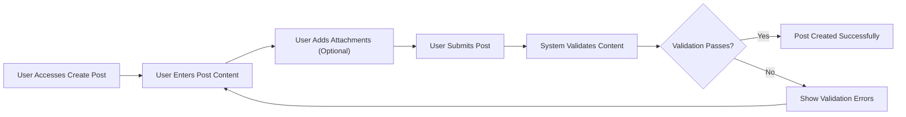
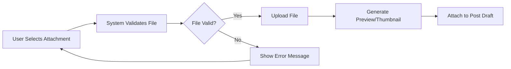

# Post Management Functional Requirements

## Executive Summary
This document defines the complete business requirements for post creation and management functionality in the economic/political discussion board. The system enables users to create, edit, and manage discussion posts with support for image and file attachments, following a straightforward and minimal design approach.

## Post Creation Process

### User Journey for Post Creation

### Functional Requirements

**WHEN** a member initiates post creation, **THE** system **SHALL** present a post creation interface with title and content fields.

**WHEN** a member enters post content, **THE** system **SHALL** validate the content according to the following rules:
- Title must be between 5 and 200 characters
- Content must be between 50 and 10,000 characters
- Title and content must not contain prohibited content

**WHEN** a member submits a post, **THE** system **SHALL** perform real-time validation and provide immediate feedback.

## Content Requirements and Validation

### Content Validation Rules
**THE** system **SHALL** enforce the following content validation rules:

**WHEN** validating post titles, **THE** system **SHALL**:
- Require minimum 5 characters and maximum 200 characters
- Prohibit HTML tags and scripts
- Check for prohibited keywords related to hate speech
- Ensure titles are descriptive and relevant to economic/political topics

**WHEN** validating post content, **THE** system **SHALL**:
- Require minimum 50 characters and maximum 10,000 characters
- Allow basic formatting (paragraphs, line breaks)
- Prohibit external links until moderator approval
- Check for duplicate content within the same user's recent posts

### Business Rules for Content Moderation
**WHERE** automated content screening is enabled, **THE** system **SHALL** flag posts containing:
- Hate speech or discriminatory language
- Personal attacks or harassment
- Unverified conspiracy theories
- Commercial advertising or spam

**IF** a post is flagged for moderation, **THEN THE** system **SHALL** place it in a pending state until reviewed by a moderator.

## Image and File Attachment System

### Attachment Requirements
**WHEN** a member adds attachments to a post, **THE** system **SHALL** support the following file types:
- Images: JPEG, PNG, GIF (maximum 5MB each)
- Documents: PDF, DOC, DOCX (maximum 10MB each)
- Maximum 5 attachments per post
- Total attachment size limit of 20MB per post

**WHEN** uploading images, **THE** system **SHALL**:
- Automatically resize large images to appropriate dimensions
- Generate thumbnails for quick preview
- Validate image format and content safety
- Store images securely with access controls

**WHEN** uploading documents, **THE** system **SHALL**:
- Scan for viruses and malware
- Validate file integrity
- Extract basic metadata (file size, type)
- Provide secure download links

### Attachment Management

**WHEN** a member removes an attachment during post creation, **THE** system **SHALL** immediately update the post draft and remove the file from temporary storage.

**WHEN** a post with attachments is published, **THE** system **SHALL** move attachments from temporary to permanent storage.

## Post Editing and Management

### Post Editing Capabilities
**WHEN** a member edits their own post, **THE** system **SHALL** allow editing of:
- Post title and content
- Attachment management (add/remove)
- Category/topic assignment

**WHEN** a member saves edited content, **THE** system **SHALL**:
- Maintain version history of changes
- Preserve original content for moderation purposes
- Update post timestamp to reflect last edit
- Notify users who have engaged with the post (optional)

### Post Management Functions
**WHEN** a member views their own posts, **THE** system **SHALL** provide management options including:
- Edit post content
- Delete post (with confirmation)
- View post statistics (views, comments)
- Share post via external platforms

**WHEN** a member deletes a post, **THE** system **SHALL**:
- Require confirmation to prevent accidental deletion
- Remove the post from public view
- Retain the post in database for moderation records
- Notify moderators of the deletion

## Post Visibility and Access Control

### User Role-Based Access
**WHEN** a guest user views the discussion board, **THE** system **SHALL** display all published posts but restrict creation and editing capabilities.

**WHEN** a member creates a post, **THE** system **SHALL** grant them full editing rights to their own content.

**WHEN** a moderator views any post, **THE** system **SHALL** provide administrative controls including:
- Edit any post content
- Remove posts entirely
- Lock posts from further comments
- Feature posts for increased visibility

### Post Status Management
**THE** system **SHALL** maintain the following post statuses:
- **Draft**: Post being created, not visible to public
- **Pending**: Awaiting moderator approval
- **Published**: Live and visible to all users
- **Locked**: Visible but no new comments allowed
- **Archived**: Historical posts, read-only

**WHEN** a post's status changes, **THE** system **SHALL** update visibility and access controls accordingly.

## Error Handling and User Experience

### Validation Error Scenarios
**IF** a member attempts to submit a post with invalid content, **THEN THE** system **SHALL** display specific error messages indicating:
- Which field contains the error
- What validation rule was violated
- How to correct the issue

**IF** file upload fails due to size limitations, **THEN THE** system **SHALL** clearly indicate:
- Maximum allowed file size
- Current file size
- How to reduce file size or choose alternative files

### Performance Requirements
**WHEN** loading the post creation interface, **THE** system **SHALL** display it within 2 seconds.

**WHEN** submitting a post, **THE** system **SHALL** process and save it within 3 seconds.

**WHEN** uploading attachments, **THE** system **SHALL** provide progress indicators and estimated completion time.

### Recovery Scenarios
**WHEN** a user's session expires during post creation, **THE** system **SHALL** attempt to save draft content automatically.

**IF** network connectivity is lost during post submission, **THEN THE** system **SHALL** retain the post data and attempt resubmission when connectivity is restored.

## Business Rules Summary

### Content Quality Standards
**THE** system **SHALL** encourage high-quality discussions by:
- Requiring substantive content (minimum 50 characters)
- Promoting descriptive titles
- Supporting evidence-based arguments with file attachments
- Maintaining civil discourse through content moderation

### User Experience Principles
**THE** system **SHALL** provide a straightforward and minimal user experience by:
- Keeping the post creation process simple and intuitive
- Minimizing unnecessary steps and complexity
- Providing clear feedback at every stage
- Ensuring fast performance for all operations

### Moderation Integration
**THE** system **SHALL** integrate with moderation workflows by:
- Flagging content that requires human review
- Maintaining audit trails of all changes
- Supporting moderator tools for content management
- Ensuring compliance with community guidelines

## Post Lifecycle Management

### Draft Management
**WHEN** a user starts creating a post but doesn't submit it, **THE** system **SHALL** automatically save it as a draft.

**WHEN** a user returns to their drafts, **THE** system **SHALL** display all unsaved posts with creation timestamps.

**WHEN** a draft is older than 30 days, **THE** system **SHALL** automatically delete it to free up storage.

### Post Archiving
**WHEN** a post receives no new comments for 90 days, **THE** system **SHALL** automatically archive it.

**WHEN** a post is archived, **THE** system **SHALL** maintain it in read-only mode for historical reference.

**WHEN** users search for content, **THE** system **SHALL** include archived posts in search results.

### Content Expiration
**WHEN** posts contain time-sensitive economic or political information, **THE** system **SHALL** allow authors to set expiration dates.

**WHEN** a post reaches its expiration date, **THE** system **SHALL** automatically move it to archived status.

**WHEN** moderators identify outdated information, **THE** system **SHALL** allow them to flag posts for content review.

## Attachment Management Details

### File Type Validation
**WHEN** users upload attachments, **THE** system **SHALL** validate file types against an approved list:
- **Images**: JPEG, PNG, GIF, WEBP
- **Documents**: PDF, DOC, DOCX, TXT
- **Data Files**: CSV, XLSX (for economic data)
- **Maximum Size**: 10MB per file

**IF** a user attempts to upload an unsupported file type, **THEN THE** system **SHALL** display a clear error message with supported formats.

### Attachment Security
**WHEN** processing uploaded files, **THE** system **SHALL**:
- Scan for viruses and malware using updated definitions
- Validate file integrity to prevent corruption
- Check for embedded scripts or executable content
- Log all file uploads for security auditing

### Storage Optimization
**WHEN** storing images, **THE** system **SHALL**:
- Generate multiple resolution versions for different display needs
- Compress images without significant quality loss
- Implement efficient storage with deduplication
- Provide CDN distribution for fast global access

## User Permission Matrix

### Post Creation Permissions
| User Type | Create Posts | Edit Own Posts | Delete Own Posts | Upload Attachments |
|-----------|--------------|----------------|------------------|-------------------|
| Guest     | ❌           | ❌             | ❌               | ❌                 |
| Member    | ✅           | ✅ (24h limit) | ✅               | ✅                 |
| Moderator | ✅           | ✅             | ✅               | ✅                 |

### Post Management Permissions
| User Type | Edit Any Post | Delete Any Post | Lock Posts | Feature Posts |
|-----------|---------------|-----------------|------------|---------------|
| Guest     | ❌            | ❌              | ❌         | ❌            |
| Member    | ❌            | ❌              | ❌         | ❌            |
| Moderator | ✅            | ✅              | ✅         | ✅            |

## Integration Requirements

### Authentication Integration
**WHEN** post management functions are accessed, **THE** system **SHALL** verify user authentication status.

**WHEN** authentication fails during post operations, **THE** system **SHALL** preserve work and redirect to login.

### Moderation System Integration
**WHEN** posts are created or modified, **THE** system **SHALL** trigger moderation workflows.

**WHEN** moderation actions occur, **THE** system **SHALL** update post status and visibility immediately.

### Notification System Integration
**WHEN** posts receive new comments or engagement, **THE** system **SHALL** notify the original author.

**WHEN** posts are featured or receive moderator actions, **THE** system **SHALL** notify relevant users.

## Performance and Scalability

### Concurrent Post Management
**WHEN** multiple users create posts simultaneously, **THE** system **SHALL** handle up to 100 concurrent operations.

**WHEN** the system experiences high load, **THE** post creation interface **SHALL** remain responsive.

### Large File Handling
**WHEN** users upload large attachments, **THE** system **SHALL** provide progress indicators and estimated completion times.

**WHEN** network conditions are poor, **THE** system **SHALL** implement resumable uploads.

### Database Performance
**WHEN** querying posts, **THE** system **SHALL** implement efficient indexing for fast retrieval.

**WHEN** storing post content, **THE** system **SHALL** use appropriate data types and compression.

## Monitoring and Analytics

### Post Creation Metrics
**THE** system **SHALL** track:
- Number of posts created per day/week/month
- Average post length and attachment usage
- Post creation success/failure rates
- User engagement with created posts

### Performance Metrics
**THE** system **SHALL** monitor:
- Post creation response times
- File upload success rates
- Storage utilization for attachments
- User satisfaction with post management features

### Quality Metrics
**THE** system **SHALL** analyze:
- Content quality based on engagement and moderation
- User retention related to post creation experience
- Feature adoption rates for post management tools
- Error rates and user support requests

> *Developer Note: This document defines **business requirements only**. All technical implementations (architecture, APIs, database design, etc.) are at the discretion of the development team.*