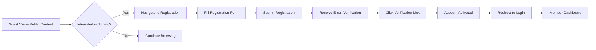
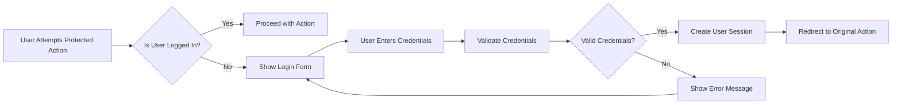
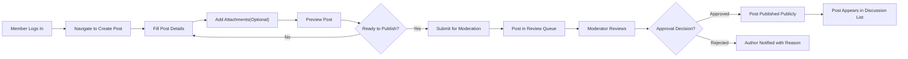
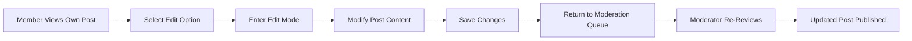
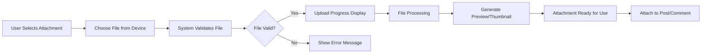
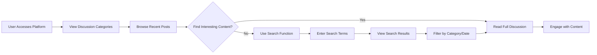
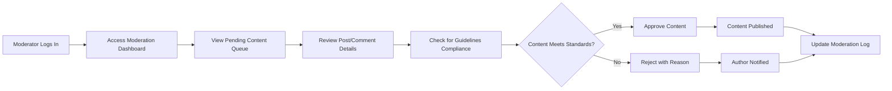
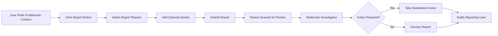

# User Journey Documentation - Economic/Political Discussion Board

## Introduction and Overview

This document outlines the complete user journey for the economic/political discussion board platform. The system provides a simple, straightforward environment for users to engage in discussions, share attachments, and participate in community moderation.

### Platform Philosophy
- **Simplicity First**: Minimalist design focused on core discussion functionality
- **Attachment Support**: Integrated image and file upload capabilities
- **Gradual Engagement**: Users progress from viewing to participating to moderating
- **Content-Focused**: Discussions organized around economic and political topics

## User Registration and Authentication Journey

### Guest User Flow

### Registration Process Details
1. **Guest Browsing**: Unauthenticated users can view public discussions and read content
2. **Registration Trigger**: Users encounter registration prompts when attempting to:
   - Create new posts
   - Leave comments
   - Upload attachments
   - Access member-only features

3. **Registration Form**: Users provide:
   - Email address
   - Username (unique identifier)
   - Password (minimum security requirements)
   - Optional: Display name

4. **Email Verification**: THE system SHALL send verification email with secure link
5. **Account Activation**: WHEN user clicks verification link, THE system SHALL activate account
6. **First Login**: User logs in with credentials and accesses member features

### Authentication Flow

## Content Creation and Management Flows

### Post Creation Journey

### Post Creation Requirements
- **WHEN** a member creates a post, **THE** system **SHALL** require:
  - Title (minimum 10 characters, maximum 200 characters)
  - Content body (minimum 50 characters, maximum 10,000 characters)
  - Topic category selection (economics, politics, general discussion)

- **WHERE** attachments are included, **THE** system **SHALL**:
  - Accept images (JPEG, PNG, GIF) up to 5MB each
  - Accept documents (PDF, DOC, TXT) up to 10MB each
  - Limit total attachments per post to 5 files
  - Validate file types before upload

### Post Editing Flow

### Post Management Rules
- **WHILE** a post is in moderation queue, **THE** author **SHALL** be able to edit content
- **IF** a post is rejected, **THEN THE** author **SHALL** receive specific rejection reasons
- **THE** system **SHALL** maintain post version history for moderation purposes

## Commenting and Engagement Processes

### Comment Creation Journey

### Comment System Requirements
- **WHEN** a member submits a comment, **THE** system **SHALL**:
  - Require minimum 5 characters of content
  - Limit comments to 2,000 characters maximum
  - Allow one attachment per comment (same file restrictions as posts)
  - Display comment immediately after submission

- **WHERE** comment attachments are used, **THE** system **SHALL**:
  - Support the same file types as post attachments
  - Apply smaller size limits (images: 2MB, documents: 5MB)
  - Display attachments inline with comment content

### Comment Engagement Features
- **THE** system **SHALL** allow members to:
  - Reply to specific comments (threaded discussions)
  - Like comments to show agreement
  - Report inappropriate comments to moderators
  - Edit their own comments within 1 hour of posting

## Attachment Upload and Management Workflows

### Attachment Upload Process

### Attachment Management Rules
- **WHEN** uploading attachments, **THE** system **SHALL**:
  - Validate file type against allowed list
  - Check file size against limits
  - Scan for malware/virus protection
  - Generate preview images for visual content

- **IF** attachment upload fails, **THEN THE** system **SHALL**:
  - Provide clear error message explaining the issue
  - Suggest alternative file formats if applicable
  - Allow user to retry with different file

### Attachment Display and Access
- **THE** system **SHALL** display attachments:
  - Images: Inline with content at appropriate size
  - Documents: As downloadable links with file type icons
  - With file size information for transparency

## Content Discovery and Navigation

### Discussion Board Navigation

### Search and Discovery Features
- **WHEN** users search for content, **THE** system **SHALL**:
  - Search across post titles, content, and comments
  - Return results ranked by relevance
  - Provide filtering options by category and date range
  - Display search results with preview snippets

- **THE** system **SHALL** organize content by:
  - Discussion categories (Economics, Politics, General)
  - Post date (newest first by default)
  - Popularity (most commented/engaged)
  - User preferences (saved categories/followed discussions)

### Content Recommendation
- **WHERE** users show interest in specific topics, **THE** system **SHALL**:
  - Suggest related discussions based on reading history
  - Highlight popular discussions in user's interest areas
  - Notify users about new posts in followed categories

## Moderation and Administrative Flows

### Moderator Content Review Journey

### Moderation Workflow Requirements
- **WHEN** moderators review content, **THE** system **SHALL** provide:
  - Full post/comment content with attachments
  - Author information and posting history
  - Community guidelines reference
  - Quick action buttons (approve/reject/flag)

- **IF** content requires editing, **THEN THE** moderator **SHALL**:
  - Return to author with specific revision requests
  - Provide clear guidelines for required changes
  - Set reasonable timeframe for revisions

### User Reporting System

### Reporting and Escalation
- **THE** system **SHALL** allow users to report:
  - Inappropriate content
  - Spam or advertising
  - Harassment or abuse
  - Technical issues

- **WHERE** serious violations occur, **THE** system **SHALL**:
  - Escalate to senior moderators
  - Temporarily suspend user accounts
  - Preserve evidence for administrative review

## Error Handling and Recovery Scenarios

### Common User Journey Errors

#### Registration Errors
- **IF** email already exists, **THEN THE** system **SHALL**:
  - Suggest password recovery option
  - Prevent duplicate account creation
  - Provide clear "email in use" message

- **IF** username is taken, **THEN THE** system **SHALL**:
  - Suggest available alternatives
  - Highlight username availability in real-time
  - Explain username requirements clearly

#### Content Creation Errors
- **IF** post submission fails, **THEN THE** system **SHALL**:
  - Preserve draft content automatically
  - Provide specific error details
  - Suggest corrective actions
  - Allow easy retry of submission

- **IF** attachment upload fails, **THEN THE** system **SHALL**:
  - Identify the specific issue (size, type, corruption)
  - Suggest alternative file options
  - Provide clear file requirement guidelines

#### Authentication Errors
- **IF** login credentials are incorrect, **THEN THE** system **SHALL**:
  - Provide generic error message (security best practice)
  - Offer password reset option after multiple failures
  - Implement account lockout after excessive failed attempts

### Recovery and User Assistance
- **THE** system **SHALL** provide:
  - Clear, actionable error messages
  - Step-by-step recovery instructions
  - Contact information for technical support
  - FAQ section for common issues

- **WHERE** technical issues prevent normal operation, **THE** system **SHALL**:
  - Display maintenance notices when applicable
  - Provide estimated resolution times
  - Offer alternative ways to access content

## User Journey Success Metrics

### Engagement Indicators
- **THE** system **SHALL** track:
  - Registration completion rate
  - Post creation frequency per user
  - Comment engagement rates
  - Attachment usage statistics
  - User retention over time

### Quality Metrics
- **THE** system **SHALL** measure:
  - Moderation approval rates
  - User report accuracy
  - Content quality through user ratings
  - Discussion depth and engagement

### Performance Expectations
- **WHEN** users interact with the system, **THE** experience **SHALL** feel:
  - Registration process: Completed within 2 minutes
  - Post creation: Submission within 30 seconds
  - Comment posting: Instantaneous after submission
  - Search results: Displayed within 3 seconds
  - Attachment upload: Progress visible with estimated time

This user journey documentation provides the complete flow from initial discovery through active participation in the economic/political discussion community. The focus remains on simplicity while ensuring all essential features support meaningful discussion and content sharing.

> *Developer Note: This document defines **business requirements only**. All technical implementations (architecture, APIs, database design, etc.) are at the discretion of the development team.*