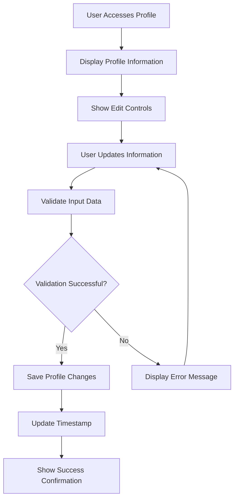
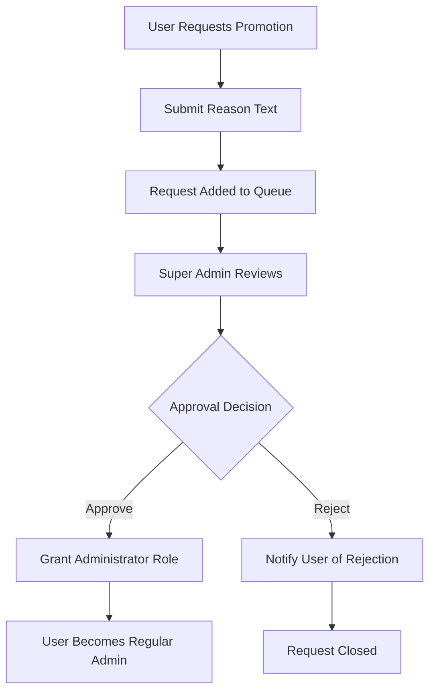
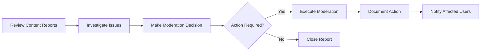

# Economic/Political Discussion Board Requirements Specification

## Executive Summary

The Economic/Political Discussion Board is a comprehensive online platform designed for thoughtful discourse on economic and political topics. This specification document outlines the complete business requirements for building a robust, scalable discussion board that supports user engagement, content creation, moderation, and community management.

## Service Vision

This platform aims to create a high-quality discussion environment where users can engage in meaningful conversations about economic and political issues. The system prioritizes user-friendly content creation, effective moderation tools, and comprehensive community management capabilities to foster productive discourse.

## User Actors and Authentication

### User Roles and Permissions

The system supports three main user roles with distinct permission levels:

**Regular Users:**
- Can create and manage their own articles and comments
- Can view other users' profiles and content
- Can browse and search articles across all sections
- Can request administrator privileges

**Administrators:**
- All regular user capabilities
- Can create, edit, and delete sections
- Can delete any article or comment
- Can ban and unban users
- Can manage administrator promotion requests

**Super Administrators:**
- All administrator capabilities
- Can promote/demote other administrators
- Can manage the entire administrator hierarchy
- Cannot demote themselves

### Authentication Requirements

**WHEN a user attempts to register, THE system SHALL require email and password validation.**

**WHEN a user logs in, THE system SHALL authenticate using email and password credentials.**

**WHEN a user changes their password, THE system SHALL require current password verification.**

**WHEN a user deletes their account, THE system SHALL remove all associated articles and comments.**

## User Profile Management

### Profile Data Structure
Each user profile contains comprehensive information for identity establishment and community engagement:

**Required Profile Information:**
- User ID (system-generated unique identifier)
- Email address (authentication and communication)
- Account creation timestamp
- Account status (active, banned)

**Optional Profile Information:**
- Display name (maximum 50 characters, alphanumeric and spaces)
- Bio text (maximum 500 characters, Unicode supported)
- Profile last updated timestamp

### Profile Management Workflows

**WHEN a user views another user's profile, THE system SHALL display:**
- Display name and bio
- Complete list of published articles with titles and metadata
- Complete list of comments with preview text and article context

**WHEN profile data is loaded, THE system SHALL complete within 2 seconds for optimal user experience.**

## Section Management

### Section Structure and Organization

The discussion board is organized into thematic sections that categorize content by topic:

**Section Attributes:**
- Name (required, unique identifier)
- Description (detailed explanation of section purpose)
- Creation timestamp
- Administrator who created the section
- Active/inactive status

### Section Management Requirements

**WHEN an administrator creates a section, THE system SHALL require unique name validation.**

**WHEN an administrator edits a section, THE system SHALL preserve historical content integrity.**

**WHEN a section is deleted, THE system SHALL handle existing articles appropriately.**

**WHEN users browse sections, THE system SHALL display all active sections with article counts.**

## Article Management System

### Article Creation Requirements

**WHEN a user creates an article, THE system SHALL require:**
- Title (minimum 10 characters, maximum 200 characters)
- Content (minimum 100 characters, maximum 10,000 characters)
- Section selection from available options

**WHEN attaching files to articles, THE system SHALL support:**
- Multiple file attachments per article
- Common document formats (PDF, DOC, DOCX)
- Maximum file size of 10MB per attachment
- Virus scanning for uploaded files

**WHEN attaching images to articles, THE system SHALL support:**
- Multiple image attachments per article
- Common image formats (JPG, PNG, GIF)
- Maximum file size of 5MB per image
- Automatic image optimization for display

**WHEN adding tags to articles, THE system SHALL allow:**
- Free-text tagging with multiple tags
- Tag validation (maximum 30 characters per tag)
- Tag normalization (case-insensitive, whitespace trimming)
- Maximum of 10 tags per article

### Article Editing and Deletion

**WHEN a user edits their article, THE system SHALL preserve revision history.**

**WHEN a user deletes their article, THE system SHALL remove the article and associated comments.**

**WHEN an administrator deletes an article, THE system SHALL record the action for moderation audit.**

## Article Browsing and Display

### Article Listing Requirements

**WHEN users view article lists, THE system SHALL display:**
- Article titles with links to full content
- Author display names
- Associated tags
- Comment counts
- Publication timestamps

**WHEN paginating article lists, THE system SHALL display 20 articles per page by default.**

**WHEN sorting articles, THE system SHALL support:**
- Newest first (default chronological order)
- Oldest first (reverse chronological order)

### Article Viewing Requirements

**WHEN viewing a single article, THE system SHALL display:**
- Complete article content with formatting
- Author information and publication date
- All attached files with download links
- All attached images with display optimization
- Complete tag list
- All comments in chronological order

**WHEN downloading attachments, THE system SHALL provide secure file access with proper authorization checks.**

## Search and Filtering System

### Search Functionality

**WHEN users search articles, THE system SHALL search across:**
- Article titles (primary search field)
- Article content (secondary search field)

**WHEN displaying search results, THE system SHALL:**
- Paginate results with 20 items per page
- Highlight search terms in results
- Show relevance scoring
- Include article metadata in results

### Tag Filtering

**WHEN users filter by tags, THE system SHALL:**
- Support multiple tag selection
- Show articles matching all selected tags
- Display tag popularity statistics
- Provide tag suggestion based on current section

## Comment System

### Comment Creation and Management

**WHEN users write comments, THE system SHALL require:**
- Content (minimum 10 characters, maximum 1,000 characters)
- Valid article reference
- User authentication

**WHEN displaying comments, THE system SHALL:**
- Show comments in chronological order (oldest first)
- Display author information and timestamps
- Provide edit/delete controls for comment owners
- Support comment preview before posting

**WHEN users edit comments, THE system SHALL preserve the original comment timestamp.**

**WHEN users delete comments, THE system SHALL remove the comment immediately.**

### Comment Moderation

**WHEN administrators delete comments, THE system SHALL:**
- Record moderation action
- Notify the comment author if appropriate
- Maintain moderation audit trail

## Administrator System

### Administrator Promotion Process

**WHEN a user requests administrator status, THE system SHALL require:**
- Reason text explaining the request (minimum 50 characters)
- User account in good standing
- No existing pending requests

**WHEN super administrators review requests, THE system SHALL provide:**
- Complete request history
- User activity statistics
- Previous moderation actions
- Community contribution metrics

### Administrator Hierarchy Management

**WHEN promoting administrators, THE system SHALL enforce:**
- Only super administrators can promote regular administrators to super administrator
- Promotion requires justification and record keeping
- Demotion follows the same approval process

**WHEN managing administrator roles, THE system SHALL prevent:**
- Self-demotion of super administrators
- Circular promotion/demotion patterns
- Unauthorized role changes

## Banning System

### Banning Process Requirements

**WHEN administrators ban users, THE system SHALL require:**
- Specific ban reason (minimum 20 characters)
- Duration specification (temporary or permanent)
- Moderation justification documentation

**WHEN a user is banned, THE system SHALL:**
- Prevent login attempts
- Maintain existing content visibility
- Record ban details for audit purposes
- Provide ban appeal process

**WHEN viewing banned users, THE system SHALL display:**
- Ban reason and duration
- Banning administrator information
- Ban timestamp and status

### Ban Impact on User Experience

**WHILE a user is banned, THE system SHALL:**
- Display clear ban message on login attempts
- Preserve all user-generated content
- Prevent new content creation
- Allow content viewing only

## Business Rules and Constraints

### Content Validation Rules
- Articles must contain substantive content (no spam or low-quality posts)
- Comments must contribute meaningfully to discussion
- Tags must be relevant to article content
- User profiles must maintain community standards

### Moderation Guidelines
- Administrators must follow consistent moderation standards
- Ban decisions require documented justification
- Content removal follows clear community guidelines
- User appeals process must be transparent

### Performance Requirements
- Page load times under 2 seconds for all user interactions
- Search results delivered within 3 seconds
- File uploads processed within 10 seconds
- Concurrent user support for 10,000+ active users

### Security Requirements
- Password hashing with industry-standard algorithms
- Session management with secure token handling
- File upload security with virus scanning
- Data protection for user personal information

## User Workflows and Journeys

### User Registration Journey

### Article Creation Flow

### Comment Interaction Process

### Administrator Moderation Workflow

## Success Metrics and Quality Standards

### Functional Success Criteria
- 99.9% system availability during peak usage hours
- Sub-2-second response times for all user interactions
- Zero data loss in content creation and editing
- Comprehensive moderation coverage

### User Experience Standards
- Intuitive interface for content creation and browsing
- Seamless navigation between sections and articles
- Effective search and discovery mechanisms
- Responsive design for mobile and desktop users

### Community Management Goals
- Healthy discussion environment with diverse viewpoints
- Effective spam and abuse prevention
- Transparent moderation practices
- User trust in platform integrity

This comprehensive requirements specification provides the complete business foundation for building the Economic/Political Discussion Board. All technical implementation decisions, including database design, API structure, and system architecture, will be based on these business requirements to ensure the platform meets user needs and community standards.