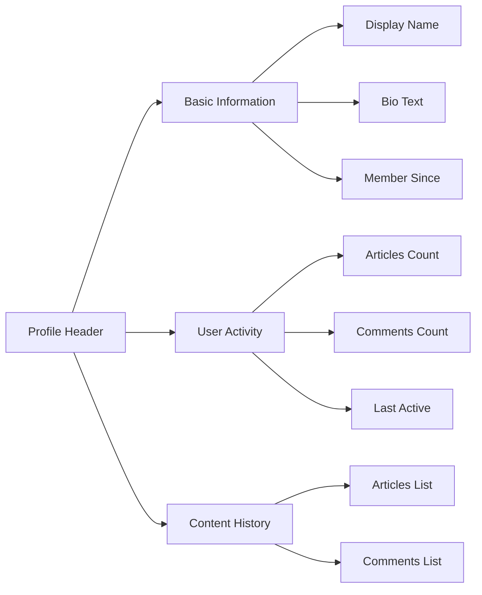
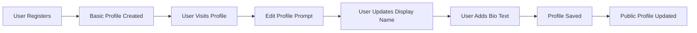
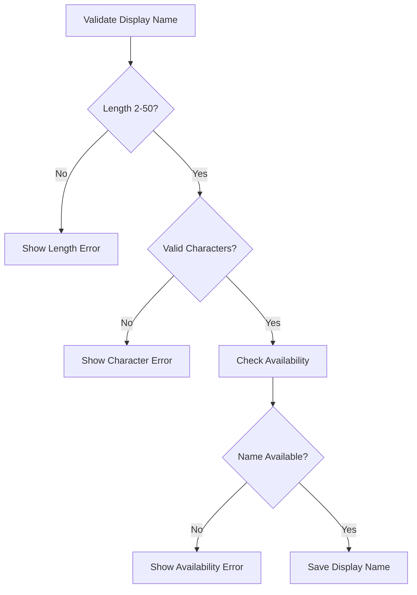

# User Profile System Requirements Specification

## 1. Profile Data Structure

### 1.1 Core Profile Information
Each user profile contains the following mandatory and optional data fields:

**Required Fields (Set during registration):**
- Email Address: Primary identifier for authentication
- Password: Securely hashed and stored
- Account Status: Active, Pending, Banned
- Registration Date: Timestamp of account creation

**Optional Profile Fields:**
- Display Name: User-defined public identifier (max 50 characters)
- Bio Text: Personal description or statement (max 500 characters)
- Profile Creation Date: When profile was first filled
- Last Profile Update: Timestamp of last modification

### 1.2 Activity Tracking Data
The system maintains comprehensive activity tracking:
- Articles Written: Count and references to all articles created
- Comments Written: Count and references to all comments authored
- Last Activity: Timestamp of most recent platform interaction
- Account Status: Active, Banned (with ban reason if applicable)

## 2. Profile Creation and Registration Process

### 2.1 Initial Profile Setup
WHEN a new user registers with email and password, THE system SHALL create a basic profile containing:
- Email address (from registration)
- Default display name (initially set to username portion of email)
- Empty bio text field
- Registration timestamp
- Initial account status set to "Active"

### 2.2 Profile Completion Incentives
The system SHALL encourage users to complete their profiles by:
- Showing profile completion percentage
- Highlighting empty required fields
- Educating users about profile benefits

## 3. Profile Editing Capabilities

### 3.1 User-Controlled Profile Editing
WHERE users are authenticated and viewing their own profile, THE system SHALL provide editing capabilities for:
- Display name modification with real-time availability checking
- Bio text editing with character count display
- Profile picture upload and management (if implemented)

### 3.2 Editing Constraints and Validation
IF users attempt to save invalid profile data, THEN THE system SHALL:
- Display specific error messages for each validation failure
- Prevent saving until all data meets validation criteria
- Maintain unsaved changes during the editing session

**Validation Rules:**
- Display Name: 2-50 characters, alphanumeric and basic punctuation only
- Bio Text: Maximum 500 characters, supports line breaks and basic formatting
- Email: Read-only field that cannot be modified via profile editing

## 4. Profile Display Requirements

### 4.1 Public Profile View
WHEN any user views another user's profile, THE system SHALL display:

### 4.2 Profile Information Hierarchy
The profile display follows this information hierarchy:
1. **Profile Header**: Display name prominently featured
2. **Basic Information**: Bio text and membership duration
3. **Activity Statistics**: Article and comment counts
4. **Content History**: Links to user's articles and comments

### 4.3 Article and Comment Integration
WHERE a user's profile displays their content history, THE system SHALL:
- Show paginated lists of articles with titles and creation dates
- Display comment excerpts with links to the parent articles
- Provide sorting options (newest first, oldest first)
- Indicate if content has been deleted or removed

## 5. Administrator Profile Visibility

### 5.1 Enhanced Administrator View
WHILE administrators view user profiles, THE system SHALL provide additional information:
- Full email address (not visible to regular users)
- Account status and ban history if applicable
- Administrative notes and moderation history
- Quick action buttons for moderation tasks

### 5.2 Administrator Profile Indicators
WHERE users have administrator privileges, THE system SHALL:
- Display administrator badge on their public profiles
- Show administrator grade (Regular Administrator or Super Administrator)
- Indicate promotion date and tenure

## 6. Privacy and Security Considerations

### 6.1 Data Privacy Rules
THE system SHALL enforce strict privacy controls:
- Email addresses are NEVER displayed to other users
- Banned users' profiles remain accessible but indicate banned status
- Administrators can access additional information for moderation purposes

### 6.2 Security Requirements
IF profile data is modified, THEN THE system SHALL:
- Require re-authentication for sensitive changes
- Log all profile modifications for audit purposes
- Implement rate limiting to prevent abuse
- Validate all input against injection attacks

## 7. User Scenarios and Workflows

### 7.1 Complete User Profile Scenario

### 7.2 Profile Viewing Scenario
WHEN a user navigates to another user's profile, THE system SHALL:
1. Verify the target user exists and account is active
2. Retrieve and display public profile information
3. Load and paginate article and comment history
4. Apply appropriate privacy filters based on viewer permissions

## 8. Integration Points

### 8.1 Article System Integration
THE profile system SHALL integrate with the article management system to:
- Track and display user article count and history
- Provide links from profiles to individual articles
- Update profile statistics when articles are created or deleted

### 8.2 Comment System Integration
WHERE comments are associated with user profiles, THE system SHALL:
- Maintain comment count and history per user
- Display recent comments on user profiles
- Link comments back to their parent articles

### 8.3 Authentication System Integration
The profile system SHALL work seamlessly with authentication to:
- Ensure only authenticated users can edit their profiles
- Maintain profile data consistency during account operations
- Handle profile data during account deletion processes

## 9. Error Handling and Edge Cases

### 9.1 Profile Data Corruption
IF profile data becomes corrupted or inconsistent, THEN THE system SHALL:
- Attempt automatic repair using backup data
- Notify administrators of data integrity issues
- Provide users with profile recovery options

### 9.2 Concurrent Profile Editing
WHILE multiple sessions attempt to edit the same profile, THE system SHALL:
- Implement optimistic locking to prevent data conflicts
- Display warning messages about concurrent edits
- Maintain data integrity through transaction management

### 9.3 Deleted User Content Handling
WHERE users delete their accounts or content, THE system SHALL:
- Update profile statistics to reflect content removal
- Maintain referential integrity in profile displays
- Handle orphaned profile references appropriately

## 10. Performance Requirements

### 10.1 Profile Loading Performance
THE system SHALL ensure profile pages load within 2 seconds under normal load conditions, including:
- Basic profile information retrieval
- Activity statistics calculation
- Recent content history loading

### 10.2 Profile Search and Filtering
WHERE users search for other users by display name, THE system SHALL:
- Return search results within 1 second for common queries
- Support partial matching and fuzzy search
- Provide relevant sorting options for search results

## 11. Data Validation Specifications

### 11.1 Display Name Validation

### 11.2 Bio Text Validation
THE system SHALL validate bio text input by:
- Limiting to 500 characters maximum
- Stripping malicious HTML and script tags
- Preserving legitimate line breaks and formatting
- Checking for appropriate content guidelines compliance

## 12. User Profile Enhancement Features

### 12.1 Profile Achievement System
WHERE users demonstrate platform engagement, THE system SHALL:
- Award badges for milestones (first article, 10 comments, etc.)
- Display achievement progress on user profiles
- Provide recognition for valuable community contributions

### 12.2 Profile Customization Options
THE system SHALL allow users to personalize their profile experience:
- Theme selection (light/dark mode)
- Profile layout preferences
- Content display customization options

### 12.3 Profile Export Capability
WHEN users request their profile data, THE system SHALL:
- Generate comprehensive data export packages
- Include all articles, comments, and profile information
- Provide data in standard formats (JSON, CSV)
- Ensure export includes timestamps and metadata

## 13. Cross-Platform Profile Consistency

### 13.1 Multi-Device Profile Synchronization
WHERE users access the platform from multiple devices, THE system SHALL:
- Maintain consistent profile data across all sessions
- Synchronize profile changes in real-time
- Handle conflicting edits with conflict resolution

### 13.2 Profile Data Backup and Recovery
THE system SHALL implement robust backup mechanisms:
- Regular automated backups of all profile data
- Point-in-time recovery capabilities
- User-initiated profile restoration options

## 14. Accessibility Requirements

### 14.1 Screen Reader Compatibility
THE profile system SHALL ensure full accessibility:
- Proper ARIA labels for all interactive elements
- Keyboard navigation support for all profile functions
- High contrast options for visual impairment support

### 14.2 Internationalization Support
WHERE users speak different languages, THE system SHALL:
- Support Unicode characters in display names and bio text
- Provide localization for profile interface elements
- Handle right-to-left text display when applicable

## 15. Monitoring and Analytics

### 15.1 Profile Usage Analytics
THE system SHALL track profile interaction patterns:
- Profile view counts and visitor demographics
- Edit frequency and common modification types
- User engagement metrics based on profile completeness

### 15.2 Performance Monitoring
WHERE profile system performance is critical, THE system SHALL:
- Monitor profile loading times and error rates
- Track database query performance for profile operations
- Alert administrators of performance degradation

## 16. Compliance and Regulatory Requirements

### 16.1 Data Protection Compliance
THE profile system SHALL comply with data protection regulations:
- GDPR compliance for European users
- Data minimization principles
- Right to erasure implementation
- Privacy by design principles

### 16.2 Content Moderation Integration
WHERE profiles display user-generated content, THE system SHALL:
- Integrate with platform-wide content moderation systems
- Flag inappropriate profile content for review
- Support administrator intervention for policy violations

> *Developer Note: This document defines **business requirements only**. All technical implementations (architecture, APIs, database design, etc.) are at the discretion of the development team.*