**discussionBoard — Data isolation, business rules, data browsing expectations, error scenarios**

Data isolation, business rules, data browsing expectations, error scenarios

# Data Isolation and Ownership

Data ownership rules and tenant/user-level isolation policies.

## Ownership and Isolation Rules

Define data ownership semantics and isolation boundaries for multi-user access.

### Data Ownership Principles

### Data Ownership Principles

WHEN a user creates an article, THE system SHALL establish the creating user as the article's owner.

WHEN a user creates a comment, THE system SHALL establish the creating user as the comment's owner.

WHEN a user creates an admin request, THE system SHALL establish the creating user as the request's owner.

THE system SHALL maintain ownership relationships for the lifetime of the data, unless explicitly transferred or deleted.

IF an administrator deletes another user's article, THE system SHALL preserve the original ownership attribution in audit logs.

IF an administrator deletes another user's comment, THE system SHALL preserve the original ownership attribution in audit logs.

WHEN a user deletes their account, THE system SHALL delete all data owned by that user, including articles and comments (defined in User Rules section).

### User Data Isolation Boundaries

### User Data Isolation Boundaries

WHILE a user is browsing articles, THE system SHALL present only published articles from all users.

WHILE a user is viewing another user's profile, THE system SHALL display only that user's articles and comments.

WHEN a user creates a private draft (if future capability), THE system SHALL isolate that draft from other users until published.

THE system SHALL prevent users from accessing another user's unpublished articles.

THE system SHALL prevent users from accessing another user's pending admin requests.

WHEN a user edits their own article, THE system SHALL only display content they have permission to modify.

WHEN a user edits their own comment, THE system SHALL only display content they have permission to modify.

### Multi-User Access Scenarios

### Multi-User Access Scenarios

WHEN multiple users simultaneously view the same article, THE system SHALL provide each user with an identical view of the published content.

WHEN multiple users simultaneously comment on the same article, THE system SHALL process each comment independently and add it to the chronological list.

IF two administrators attempt to delete the same article concurrently, THE system SHALL allow only the first request to succeed.

IF two administrators attempt to ban the same user concurrently, THE system SHALL allow only the first request to succeed.

WHEN a user is viewing an article while the author is editing it, THE system SHALL continue displaying the original published version until the author completes edits and republishes.

WHEN a user is viewing comment threads while comments are being added, THE system SHALL provide eventual consistency where new comments become visible after submission.

### Tenant-Level Data Access Rules

### Tenant-Level Data Access Rules

The discussion board operates as a single tenant system where all users share the same data environment.

THE system SHALL allow all authenticated users to access shared sections and articles.

THE system SHALL treat the entire platform as a single community workspace without organizational boundaries.

WHEN viewing article lists, THE system SHALL include articles from all users regardless of organizational affiliation.

WHEN performing searches, THE system SHALL search across all articles and comments from all users.

THE system SHALL not implement segregation based on department, organization, or group membership.

THE system SHALL provide uniform access to sections for all authenticated users who are not banned.

### Data Access Violation Handling

### Data Access Violation Handling

IF a user attempts to access another user's draft article (if future capability), THE system SHALL reject the request.

IF a user attempts to edit another user's article, THE system SHALL reject the request.

IF a user attempts to delete another user's comment, THE system SHALL reject the request.

IF a user attempts to access another user's pending admin request, THE system SHALL reject the request.

IF a banned user attempts to access any platform feature beyond viewing published articles, THE system SHALL reject the request.

IF an administrator attempts to demote themselves from super administrator status, THE system SHALL reject the request.

WHEN a data access violation occurs, THE system SHALL log the attempt without revealing system internals to the user.

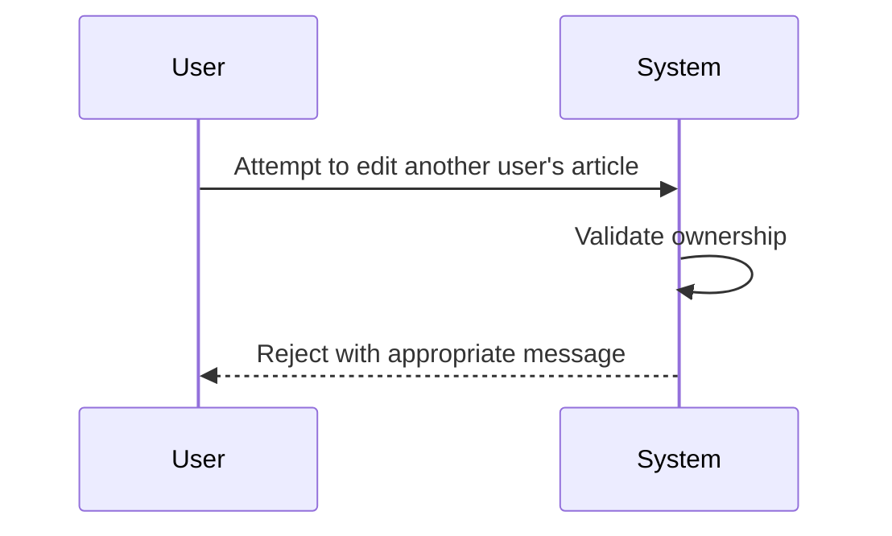
```mermaid
sequenceDiagram
    participant U as User
    participant S as System
    U->>S: Attempt to edit another user's article
    S->>S: Validate ownership
    S-->>U: Reject with appropriate message
```


# Domain Business Rules

Per-concept business rules, validation logic, and domain constraints.

## User Rules

Users must provide a unique email address when registering to prevent duplicate accounts. Email addresses must follow standard email format validation rules. Passwords must meet minimum security requirements to ensure account protection. Each user must have a display name that is visible to other users on the platform. Display names cannot be empty and must follow community guidelines. Users can update their profile information including display name and bio text. When a user deletes their account, all their articles and comments must be automatically removed from the system. Only active users can create content on the platform. Users cannot register with an email address that already exists in the system. User authentication requires valid email and password combination for login.

### Email Validation and Uniqueness

### Email Validation and Uniqueness

WHEN a user registers an account, THE system SHALL:
1. Validate that the email address follows standard email format
2. Ensure the email address is unique across all user accounts
3. Reject registration if the email address already exists in the system
4. Store the email address in lowercase format for consistency

IF an email address fails format validation, THE system SHALL reject the registration request.
IF an email address already exists in the system, THE system SHALL reject the registration request.

WHEN a user attempts to log in, THE system SHALL:
1. Validate the email format before checking credentials
2. Perform case-insensitive email matching
3. Reject login attempts for non-existent email addresses

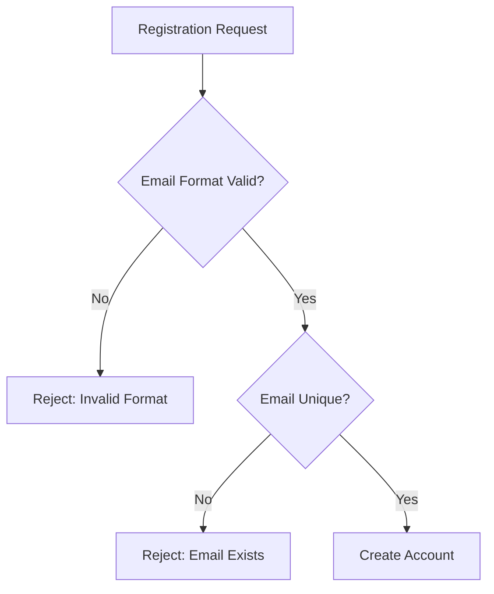
```mermaid
flowchart TD
    A["Registration Request"] --> B{"Email Format Valid?"}
    B -->|No| C["Reject: Invalid Format"]
    B -->|Yes| D{"Email Unique?"}
    D -->|No| E["Reject: Email Exists"]
    D -->|Yes| F["Create Account"]
```

### Password Security Requirements

### Password Security Requirements

WHEN a user sets or changes their password, THE system SHALL:
1. Require a minimum password length of 8 characters
2. Require at least one uppercase letter
3. Require at least one lowercase letter
4. Require at least one numeric character
5. Require at least one special character
6. Reject passwords that match common patterns or dictionary words
7. Store passwords using secure hashing algorithms

IF a password does not meet complexity requirements, THE system SHALL reject the password change request.
IF a user enters an incorrect password during authentication, THE system SHALL increment failed login attempts.

WHILE a user has exceeded 5 failed login attempts, THE system SHALL temporarily lock the account for 15 minutes.

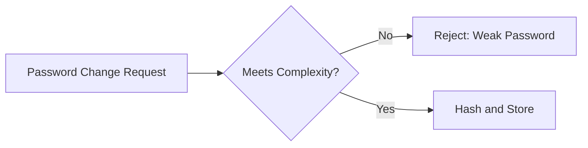
```mermaid
flowchart LR
    A["Password Change Request"] --> B{"Meets Complexity?"}
    B -->|No| C["Reject: Weak Password"]
    B -->|Yes| D["Hash and Store"]
```

### Display Name Formatting

### Display Name Formatting

WHEN a user sets or updates their display name, THE system SHALL:
1. Require a non-empty display name
2. Limit display name length to between 1 and 50 characters
3. Allow alphanumeric characters, spaces, and common punctuation
4. Prohibit offensive or inappropriate content
5. Trim leading and trailing whitespace
6. Ensure display name uniqueness is not required

IF a display name contains prohibited content, THE system SHALL reject the update request.
IF a display name exceeds length limits, THE system SHALL reject the update request.

WHEN displaying user profiles, THE system SHALL show the display name exactly as stored.

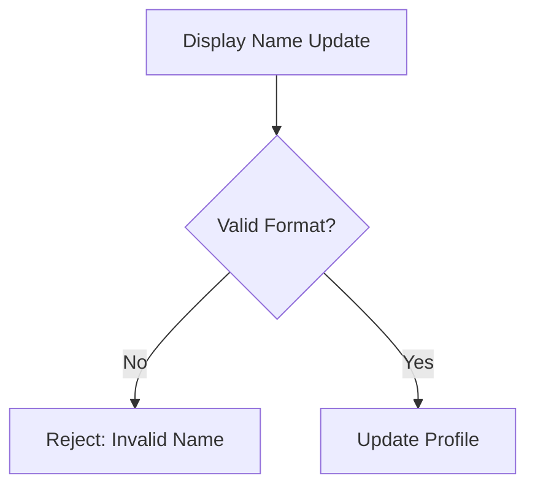
```mermaid
flowchart TD
    A["Display Name Update"] --> B{"Valid Format?"}
    B -->|No| C["Reject: Invalid Name"]
    B -->|Yes| D["Update Profile"]
```

### Account Deletion Cascade

### Account Deletion Cascade

WHEN a user deletes their account, THE system SHALL:
1. Remove all articles written by the user
2. Remove all comments written by the user
3. Remove any pending administrator requests from the user
4. Permanently delete the user's profile information
5. Maintain audit trail of deletion for administrative purposes

IF a user attempts to delete their account while logged out, THE system SHALL require re-authentication.
IF a user has active administrator privileges, THE system SHALL revoke those privileges before deletion.

WHILE account deletion is in progress, THE system SHALL prevent new content creation by the user.

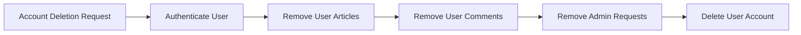
```mermaid
flowchart LR
    A["Account Deletion Request"] --> B["Authenticate User"]
    B --> C["Remove User Articles"]
    C --> D["Remove User Comments"]
    D --> E["Remove Admin Requests"]
    E --> F["Delete User Account"]
```

### User Authentication Rules

### User Authentication Rules

WHEN a user attempts to log in, THE system SHALL:
1. Validate email and password combination
2. Check if the user account is banned
3. Check if the account is temporarily locked due to failed attempts
4. Create a session upon successful authentication
5. Track login timestamp and IP address

IF authentication fails, THE system SHALL increment the failed login counter.
IF the user account is banned, THE system SHALL reject the login attempt regardless of credentials.

WHILE a user is authenticated, THE system SHALL maintain their session until logout or timeout.

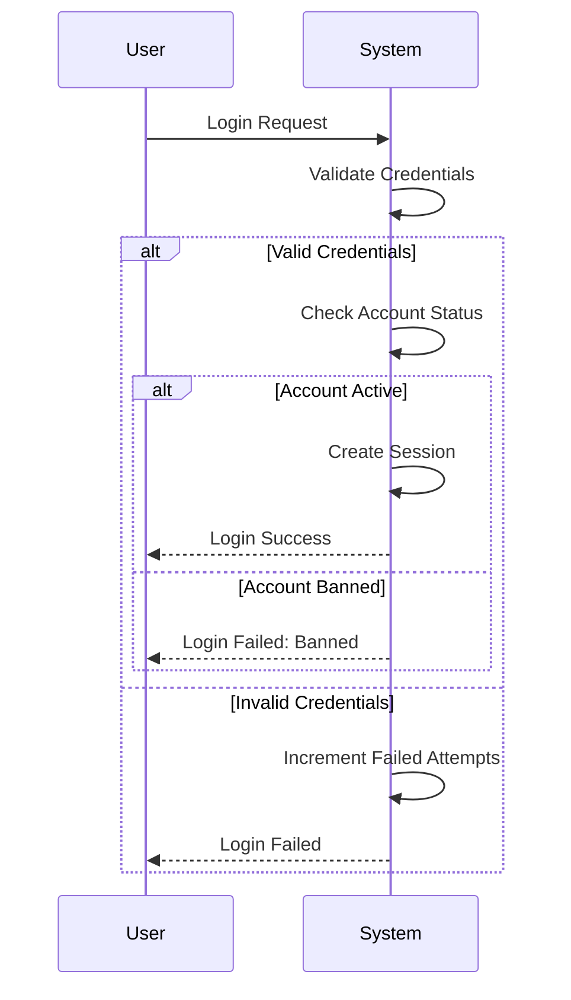
```mermaid
sequenceDiagram
    participant U as User
    participant S as System
    U->>S: Login Request
    S->>S: Validate Credentials
    alt Valid Credentials
        S->>S: Check Account Status
        alt Account Active
            S->>S: Create Session
            S-->>U: Login Success
        else Account Banned
            S-->>U: Login Failed: Banned
        end
    else Invalid Credentials
        S->>S: Increment Failed Attempts
        S-->>U: Login Failed
    end
```

### Profile Update Constraints

### Profile Update Constraints

WHEN a user updates their profile, THE system SHALL:
1. Require authentication for profile modifications
2. Allow updates to display name and bio text only
3. Validate display name format before applying changes
4. Limit bio text length to 500 characters maximum
5. Preserve previous profile versions for audit purposes

IF a user attempts to update another user's profile, THE system SHALL reject the request.
IF profile updates violate content guidelines, THE system SHALL reject the changes.

WHEN viewing another user's profile, THE system SHALL display current display name and bio only.

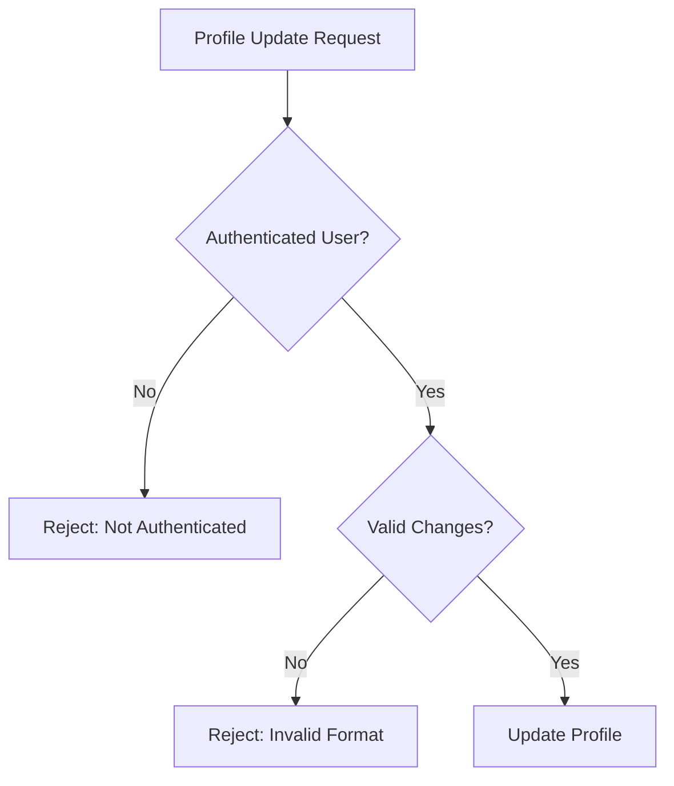
```mermaid
flowchart TD
    A["Profile Update Request"] --> B{"Authenticated User?"}
    B -->|No| C["Reject: Not Authenticated"]
    B -->|Yes| D{"Valid Changes?"}
    D -->|No| E["Reject: Invalid Format"]
    D -->|Yes| F["Update Profile"]
```

### Account Lifecycle Management

### Account Lifecycle Management

WHEN a user registers, THE system SHALL create an account with "active" status.
WHEN a user deletes their account, THE system SHALL transition the account to "deleted" status.
WHEN an administrator bans a user, THE system SHALL transition the account to "banned" status.

IF an account is in "banned" status, THE system SHALL prevent login attempts.
IF an account is in "deleted" status, THE system SHALL remove all personal data after 30 days.

WHILE an account is "active", THE system SHALL allow normal platform usage.

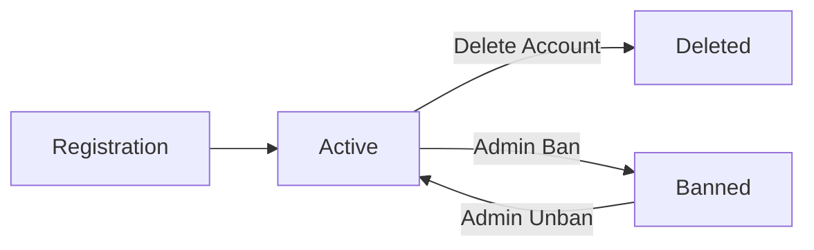
```mermaid
flowchart LR
    A["Registration"] --> B["Active"]
    B -->|"Delete Account"| C["Deleted"]
    B -->|"Admin Ban"| D["Banned"]
    D -->|"Admin Unban"| B
```

### User Identity Verification

### User Identity Verification

WHEN a user performs sensitive operations, THE system SHALL:
1. Require re-authentication for account deletion
2. Verify email ownership through confirmation emails for critical changes
3. Maintain session integrity checks during profile updates
4. Track identity verification events for security auditing

IF a session appears compromised during identity-sensitive operations, THE system SHALL require re-authentication.
IF email verification fails during critical operations, THE system SHALL suspend the operation.

WHEN a user changes their email address, THE system SHALL require verification of the new email before activation.

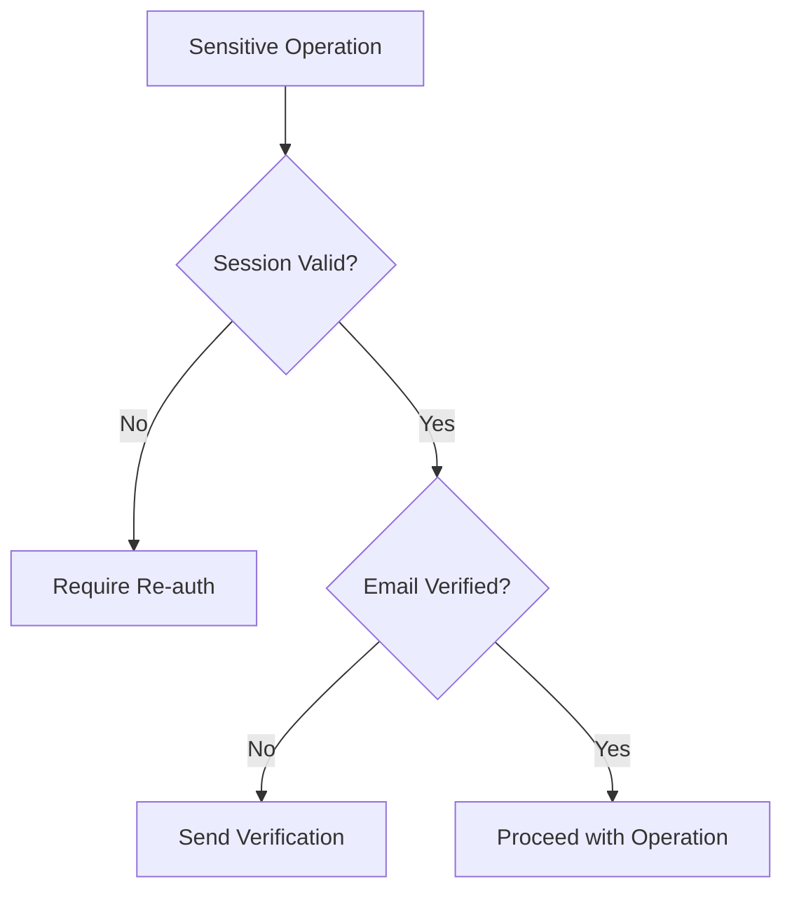
```mermaid
flowchart TD
    A["Sensitive Operation"] --> B{"Session Valid?"}
    B -->|No| C["Require Re-auth"]
    B -->|Yes| D{"Email Verified?"}
    D -->|No| E["Send Verification"]
    D -->|Yes| F["Proceed with Operation"]
```

## Article Rules

Every article must have a title that is not empty and follows content guidelines. Article content must contain meaningful text and cannot be empty. Authors must select exactly one section for each article they create. Articles can have multiple tags that help with categorization and search. Tags are free text but must follow community content standards. Authors can attach multiple files and images to their articles. Only the original author can edit or delete their articles unless they are administrators. Articles must be associated with a valid user account. When browsing article lists, titles are displayed without full content to maintain readability. Article creation requires the user to be logged in and not banned.

### Article Title Requirements

### Article Title Requirements

WHEN a user creates or edits an article, THE system SHALL:
1. Require a non-empty title
2. Validate that the title contains meaningful text
3. Ensure the title follows community content standards
4. Reject titles consisting only of whitespace characters

IF the title is empty or contains only whitespace, THE system SHALL reject the creation request.
IF the title exceeds reasonable length limits, THE system SHALL reject the request.

WHILE an article exists, THE system SHALL maintain the title's integrity and prevent unauthorized modifications.

### Content Validation Rules

WHEN a user creates or edits an article, THE system SHALL:
1. Require non-empty content
2. Validate that content contains meaningful text
3. Ensure content follows community content standards
4. Reject content consisting only of whitespace characters

IF the content is empty or contains only whitespace, THE system SHALL reject the creation request.
IF the content violates community standards, THE system SHALL reject the request.

### Section Assignment Constraints

WHEN a user creates an article, THE system SHALL:
1. Require selection of exactly one section
2. Validate that the selected section exists and is active
3. Associate the article with the chosen section

IF no section is selected, THE system SHALL reject the article creation.
IF the selected section does not exist or is inactive, THE system SHALL reject the creation request.

### Tagging System Rules

WHEN a user adds tags to an article, THE system SHALL:
1. Allow multiple free-text tags
2. Validate that tags follow community content standards
3. Store tags as case-insensitive for search purposes
4. Limit the number of tags per article to prevent abuse

IF a tag violates content standards, THE system SHALL reject the tag addition.
IF the tag limit is exceeded, THE system SHALL reject additional tags.

### Attachment Management

WHEN a user attaches files or images to an article, THE system SHALL:
1. Allow multiple attachments per article
2. Validate file types against supported formats
3. Enforce file size limitations
4. Store attachments securely with the article

IF an attachment exceeds size limits, THE system SHALL reject the upload.
IF an attachment type is not supported, THE system SHALL reject the upload.

### Author Ownership Rules

WHEN an article is created, THE system SHALL:
1. Associate the article with the creating user's account
2. Record the author's identity with the article
3. Ensure only the original author can modify the article (unless administrator)

IF the user account is deleted, THE system SHALL handle article ownership according to deletion policies.

### Article Creation Prerequisites

WHEN a user attempts to create an article, THE system SHALL:
1. Require the user to be logged in
2. Verify the user is not banned
3. Ensure the user has permission to create articles in the selected section

IF the user is not logged in, THE system SHALL reject the creation request.
IF the user is banned, THE system SHALL reject the creation request.

### Content Modification Permissions

WHEN a user attempts to edit or delete an article, THE system SHALL:
1. Verify the user is the original author of the article
2. Allow administrators to modify any article regardless of ownership
3. Validate that modification requests follow content standards

IF the user is not the author and not an administrator, THE system SHALL reject the modification request.
IF the article has been locked or archived, THE system SHALL reject modification requests.

## Comment Rules

Comments must contain text content and cannot be empty or contain only whitespace. Each comment must be associated with exactly one article and one author. Comments are single-level only without nested reply functionality. Comments display in chronological order from oldest to newest. Only the original comment author can edit or delete their comments unless they are administrators. Comment creation requires the user to be logged in and not banned. Comments must follow community content guidelines and moderation rules. Each comment shows the author's display name and timestamp of posting. Users can only comment on articles that are visible and accessible to them. Comment editing preserves the original creation timestamp while updating modification time.

### Comment Content and Structure Validation

### Comment Content and Structure Validation

**Comment content validation:**
WHEN a user creates or edits a comment, THE system SHALL:
1. Require the content field to contain non-empty text
2. Reject content that consists only of whitespace characters
3. Enforce minimum and maximum length limits for comment content

**Single-level comment structure:**
WHERE comment functionality is implemented, THE system SHALL maintain a flat, single-level comment structure with no nesting or reply threads.

**Comment association rules:**
WHEN a comment is created, THE system SHALL:
1. Associate the comment with exactly one article
2. Associate the comment with exactly one author (user)
3. Validate that the target article exists and is accessible to the commenter
4. Prevent orphaned comments by ensuring both article and author associations are established

IF a comment is created without an associated article, THE system SHALL reject the creation request.
IF a comment is created without an associated author, THE system SHALL reject the creation request.
IF the target article does not exist or is not accessible, THE system SHALL reject the comment creation request.

### Comment Ordering and Display Rules

### Comment Ordering and Display Rules

**Chronological ordering:**
WHEN displaying comments on an article page, THE system SHALL:
1. Sort all comments by their creation timestamp in ascending order (oldest first)
2. Maintain consistent chronological ordering regardless of user permissions
3. Display the creation timestamp for each comment
4. Ensure edits to comments do not affect their position in the chronological order

WHILE comments are displayed, THE system SHALL preserve the timestamp-based ordering across all viewing contexts.

**Timestamp management:**
WHEN a comment is created, THE system SHALL record the exact date and time of creation.
WHEN a comment is edited, THE system SHALL:
1. Update the modification timestamp
2. Preserve the original creation timestamp unchanged
3. Display both timestamps when viewing comment history

WHERE comment history is viewed, THE system SHALL clearly distinguish between creation and modification timestamps.

### Comment Modification and Permissions

### Comment Modification and Permissions

**Author modification rights:**
IF a user attempts to edit a comment, THEN THE system SHALL verify that the user is the original author of the comment.
IF a user attempts to delete a comment, THEN THE system SHALL verify that the user is the original author of the comment.

WHERE administrative actions are concerned, THE system SHALL:
1. Allow administrators to edit or delete any comment regardless of authorship
2. Allow super administrators to edit or delete any comment
3. Log all administrative modifications to comments for audit purposes

**Comment creation prerequisites:**
IF a user attempts to create a comment, THEN THE system SHALL verify that:
1. The user is authenticated and logged in
2. The user account is not banned
3. The user has permission to view the target article

WHEN a banned user attempts to create a comment, THE system SHALL reject the request and inform the user of their banned status.
WHEN an unauthenticated user attempts to create a comment, THE system SHALL reject the request and prompt for authentication.

### Content Moderation and Business Rules

### Content Moderation and Business Rules

**Content moderation rules:**
WHEN any comment is created or edited, THE system SHALL:
1. Validate content against community guidelines
2. Check for prohibited content (hate speech, harassment, spam)
3. Apply automated content filtering where configured
4. Flag potentially inappropriate content for administrative review

WHERE comment moderation is required, THE system SHALL:
1. Allow administrators to review and moderate comments
2. Provide tools for administrators to hide or remove inappropriate comments
3. Notify comment authors when their comments are moderated
4. Maintain moderation history for audit purposes

**Error scenarios for comment operations:**

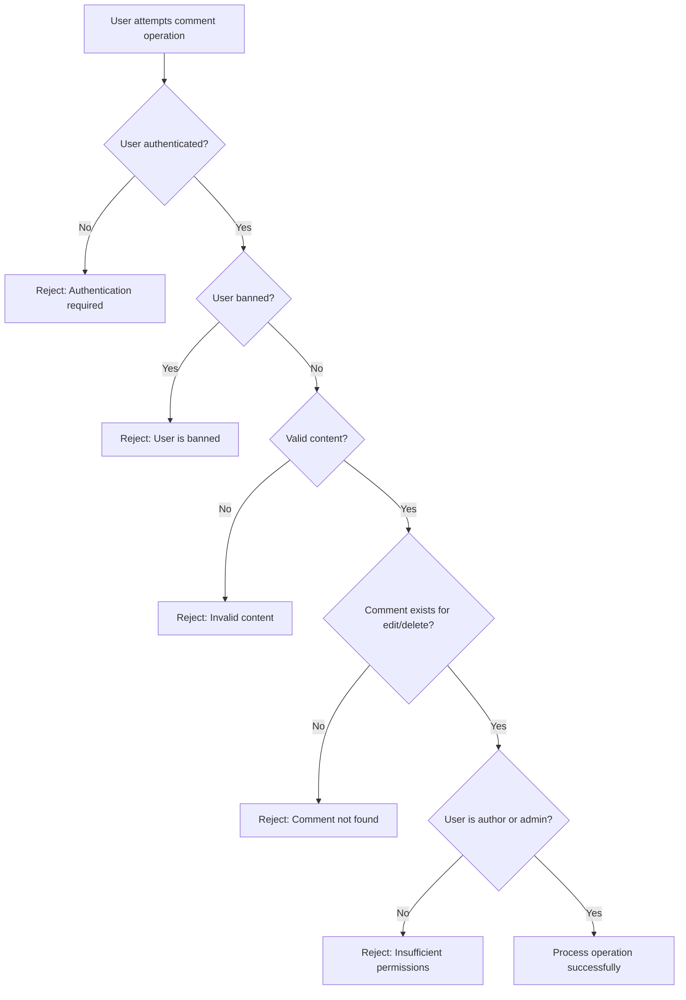
```mermaid
graph TD
    A["User attempts comment operation"] --> B{User authenticated?}
    B -->|No| C["Reject: Authentication required"]
    B -->|Yes| D{User banned?}
    D -->|Yes| E["Reject: User is banned"]
    D -->|No| F{Valid content?}
    F -->|No| G["Reject: Invalid content"]
    F -->|Yes| H{Comment exists for edit/delete?}
    H -->|No| I["Reject: Comment not found"]
    H -->|Yes| J{User is author or admin?}
    J -->|No| K["Reject: Insufficient permissions"]
    J -->|Yes| L["Process operation successfully"]
```

**Business rules enforcement:**
THE system SHALL enforce the following business rules for comments:
1. Comments must remain visible even if the author's account is deleted
2. Comments must be removed when the associated article is deleted
3. Comments from banned users must remain visible but clearly marked as from banned accounts
4. Comment counts on articles must accurately reflect the number of visible comments

## Section Rules

Sections must have unique names to avoid confusion in navigation. Each section requires a descriptive text that explains its purpose and scope. Only administrators can create, edit, or delete sections in the system. Sections serve as organizational categories for article classification. Users can view all available sections when browsing the discussion board. Articles must be assigned to exactly one valid section. Sections cannot be deleted if they contain existing articles. Section names must follow naming conventions and content guidelines. The section list displays all active sections available for article posting. Section modifications require administrative privileges and proper authorization.

### Section Name Uniqueness and Validation

### Section Name Uniqueness and Validation

WHEN creating or modifying a section, THE system SHALL:
1. Ensure section names are unique across all active sections
2. Reject section names that are identical to existing section names (case-insensitive)
3. Validate that section names contain only alphanumeric characters, spaces, and hyphens
4. Require section names to be between 3 and 50 characters in length
5. Trim leading and trailing whitespace from section names before validation

IF a section name already exists, THE system SHALL reject the creation or modification request.
IF a section name contains invalid characters, THE system SHALL reject the request.
IF a section name is too short or too long, THE system SHALL reject the request.

WHEN displaying section names, THE system SHALL preserve the original capitalization as entered by administrators.

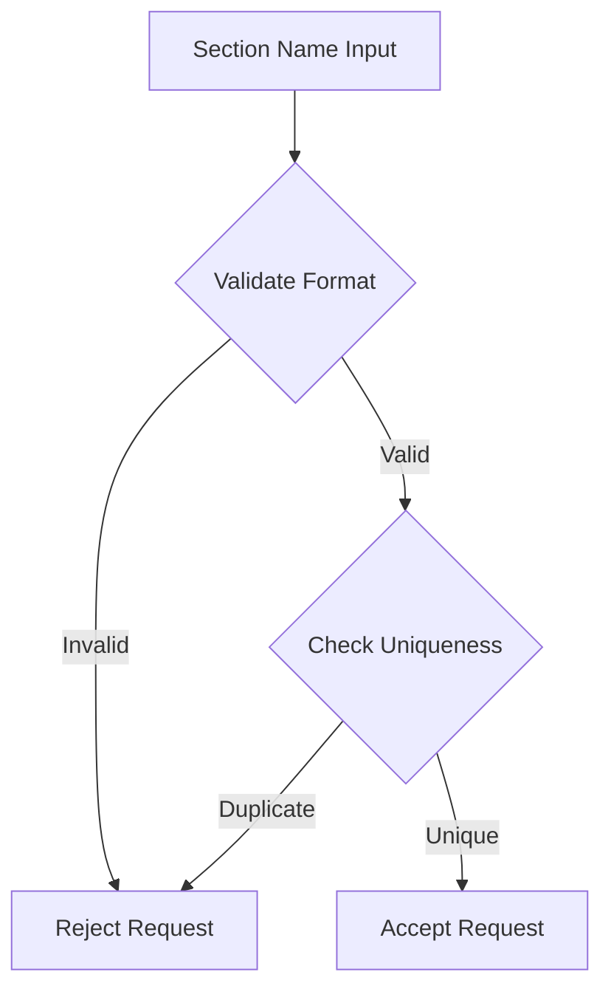
```mermaid
flowchart TD
    A["Section Name Input"] --> B{"Validate Format"}
    B -->|Invalid| C["Reject Request"]
    B -->|Valid| D{"Check Uniqueness"}
    D -->|Duplicate| C
    D -->|Unique| E["Accept Request"]
```

### Administrative Section Creation and Management

### Administrative Section Creation and Management

WHEN creating a new section, THE system SHALL:
1. Require administrative privileges (admin or superAdmin actor)
2. Require a section name (defined in Section Name Uniqueness and Validation)
3. Require a section description
4. Record the creating administrator's identity
5. Set the creation timestamp

WHEN modifying an existing section, THE system SHALL:
1. Require administrative privileges
2. Allow changes to section name and description
3. Update the modification timestamp
4. Preserve the original creation timestamp

WHEN deleting a section, THE system SHALL:
1. Require administrative privileges
2. Check if the section contains any articles
3. Reject deletion if articles exist in the section
4. Allow deletion only for empty sections

IF a non-administrator attempts section creation, THE system SHALL reject the request.
IF a section contains articles during deletion attempt, THE system SHALL prevent deletion.

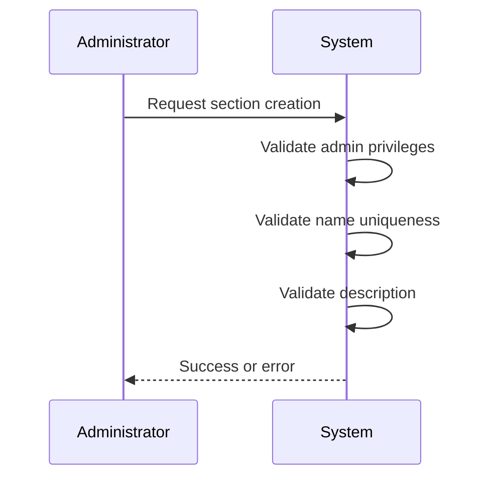
```mermaid
sequenceDiagram
    participant A as Administrator
    participant S as System
    A->>S: Request section creation
    S->>S: Validate admin privileges
    S->>S: Validate name uniqueness
    S->>S: Validate description
    S-->>A: Success or error
```

### Section Description Requirements and Content Guidelines

### Section Description Requirements and Content Guidelines

WHEN creating or modifying a section, THE system SHALL:
1. Require a section description for all sections
2. Validate that descriptions are between 10 and 500 characters in length
3. Ensure descriptions clearly explain the section's purpose and scope
4. Allow descriptions to contain paragraphs and basic formatting
5. Reject descriptions that are promotional or contain inappropriate content

THE system SHALL display section descriptions when users browse sections.
THE system SHALL provide the section description when users view section details.

IF a section description is missing, THE system SHALL reject the creation or modification request.
IF a section description is too short or lacks meaningful content, THE system SHALL reject the request.

WHEN displaying section descriptions, THE system SHALL preserve line breaks and paragraph structure as entered by administrators.

### Article Classification and Section Assignment Rules

### Article Classification and Section Assignment Rules

WHEN creating an article, THE system SHALL:
1. Require selection of exactly one valid section
2. Validate that the selected section exists and is active
3. Associate the article with the chosen section
4. Prevent article creation if no valid section is selected

WHEN browsing articles, THE system SHALL:
1. Allow filtering by specific sections
2. Display the section name alongside each article
3. Provide navigation to browse articles within a section

WHEN modifying an article's section assignment, THE system SHALL:
1. Allow article authors to change the section
2. Require selection of a valid, active section
3. Update the article's section association immediately

IF a section becomes inactive, THE system SHALL prevent new article assignments to that section.
IF an article's assigned section is deleted, THE system SHALL maintain the article's section reference for historical purposes.

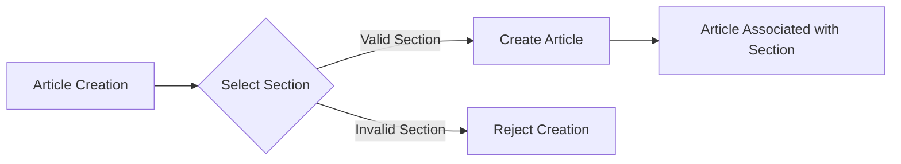
```mermaid
flowchart LR
    A["Article Creation"] --> B{"Select Section"}
    B -->|Valid Section| C["Create Article"]
    B -->|Invalid Section| D["Reject Creation"]
    C --> E["Article Associated with Section"]
```

### Section Deletion Constraints and Article Protection

### Section Deletion Constraints and Article Protection

WHEN attempting to delete a section, THE system SHALL:
1. Check if the section contains any articles
2. Count both published and draft articles in the section
3. Reject deletion if any articles exist in the section
4. Allow deletion only when the section is empty
5. Require administrative privileges for deletion

WHEN a section contains articles, THE system SHALL:
1. Prevent section deletion to maintain article organization
2. Display a warning message indicating the number of articles in the section
3. Suggest moving or deleting articles before section deletion

IF a section deletion is attempted with existing articles, THE system SHALL provide a detailed error message listing the article count.
IF articles are moved to another section, THE system SHALL allow section deletion once empty.

THE system SHALL maintain referential integrity between sections and articles at all times.

### Section Naming Convention Compliance

### Section Naming Convention Compliance

WHEN validating section names, THE system SHALL:
1. Require section names to be descriptive and topic-specific
2. Reject section names that are too generic (e.g., "General", "Miscellaneous")
3. Ensure section names accurately reflect their intended content scope
4. Validate that section names follow established naming patterns
5. Reject section names that could cause confusion with existing sections

THE system SHALL provide naming guidelines for administrators creating sections.
THE system SHALL suggest alternative names when proposed names violate conventions.

IF a section name is deemed inappropriate or misleading, THE system SHALL allow administrators to modify it.
IF a section name violates content guidelines, THE system SHALL reject the creation or modification request.

WHEN browsing sections, THE system SHALL display names in a consistent, organized manner that facilitates easy navigation.

### Administrative Section Modification Permissions

### Administrative Section Modification Permissions

WHEN modifying section properties, THE system SHALL:
1. Require administrative privileges (admin or superAdmin actor)
2. Allow modification of section name and description
3. Record the modifying administrator's identity
4. Update the modification timestamp
5. Maintain audit trail of section changes

WHEN regular users attempt section modification, THE system SHALL:
1. Reject the request immediately
2. Provide a clear error message indicating insufficient privileges
3. Redirect to appropriate user-facing functionality

WHEN super administrators modify sections, THE system SHALL:
1. Allow all modification capabilities
2. Provide additional administrative tools if needed
3. Maintain change history for accountability

IF an administrator's privileges are revoked during modification, THE system SHALL cancel pending changes.
IF section modification conflicts occur, THE system SHALL resolve based on timestamp precedence.

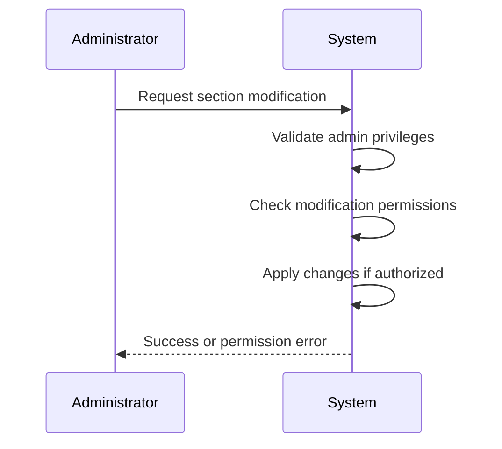
```mermaid
sequenceDiagram
    participant A as Administrator
    participant S as System
    A->>S: Request section modification
    S->>S: Validate admin privileges
    S->>S: Check modification permissions
    S->>S: Apply changes if authorized
    S-->>A: Success or permission error
```

### Section Visibility and Browsing Rules

### Section Visibility and Browsing Rules

WHEN users browse the discussion board, THE system SHALL:
1. Display all active sections available for article posting
2. Show section names and descriptions in the section list
3. Allow users to view articles within specific sections
4. Provide section-based navigation throughout the platform

THE system SHALL make sections visible to all users (guests, members, admins).
THE system SHALL not display inactive or deleted sections in the browsing interface.

WHEN viewing a section's article list, THE system SHALL:
1. Display articles belonging to that section only
2. Provide section context in the page header
3. Allow sorting and filtering within the section context

IF a section has no articles, THE system SHALL display an appropriate empty state message.
IF a section becomes inactive, THE system SHALL remove it from public browsing while preserving existing articles.

THE system SHALL ensure consistent section visibility across all user roles and browsing contexts.

## Attachment Rules

Attachments must have valid filenames that identify the content properly. Each attachment must record file type information for proper handling. File size restrictions apply to prevent excessive storage usage. Attachments can only be associated with articles, not standalone or with comments. Multiple attachments can be added to a single article by the author. Users can download attachments from articles they have access to view. Attachment management follows the same ownership rules as the parent article. File type validation ensures only acceptable formats are uploaded. Attachment deletion occurs when the parent article is deleted. Attachment visibility matches the visibility of the associated article.

### Filename Validation Rules

### Filename Validation Rules

WHEN a user attaches a file to an article, THE system SHALL require a valid filename.

THE system SHALL reject attachment attempts with empty filenames.
THE system SHALL reject attachment attempts with filenames containing only whitespace characters.
THE system SHALL reject attachment attempts with filenames containing characters that are unsafe for file systems (specifically: characters < > : " | ? * \ /).
THE system SHALL reject attachment attempts with filenames exceeding 255 characters in length.
THE system SHALL ensure filenames identify content properly by requiring a filename extension that corresponds to the actual file type.

IF the filename is invalid due to any of the above rules, THE system SHALL reject the attachment attempt and notify the user of the specific validation failure.

WHERE file attachments are concerned, THE system SHALL automatically sanitize filenames by removing any leading/trailing whitespace before validation.

### File Type Restrictions

### File Type Restrictions

WHEN a user attempts to upload an attachment, THE system SHALL restrict attachment types to acceptable formats.

THE system SHALL accept the following file categories for attachments:
- Documents (PDF, DOC, DOCX, TXT, RTF)
- Spreadsheets (XLS, XLSX, CSV)
- Presentations (PPT, PPTX)
- Images (JPG, JPEG, PNG, GIF, WEBP)
- Archive files (ZIP, RAR) with content scanning requirements

THE system SHALL reject attachment attempts for file types not listed in the acceptable formats.
THE system SHALL validate file type based on both filename extension and actual file content.

WHERE attachments are concerned, THE system SHALL maintain a list of acceptable formats that administrators can update.

IF a file type is not in the acceptable formats list, THE system SHALL reject the attachment attempt with a clear indication of why the file type was rejected.

### Size Limitation Policies

### Size Limitation Policies

WHEN a user attempts to upload an attachment, THE system SHALL enforce file size limitations.

THE system SHALL restrict individual attachment size to 10MB per file.
THE system SHALL calculate total attachment size per article and restrict it to 50MB.

IF an individual attachment exceeds 10MB, THE system SHALL reject the upload attempt.
IF adding an attachment would cause the total attachment size for an article to exceed 50MB, THE system SHALL reject the upload attempt.

WHILE an article exists, THE system SHALL continuously monitor total attachment size to ensure it remains within the 50MB limit.

WHERE large files are concerned, THE system SHALL inform users of size limitations before upload attempts.

### Article Association Constraints

### Article Association Constraints

WHEN managing attachments, THE system SHALL enforce that all attachments must be associated with articles.

THE system SHALL reject attempts to create attachments without an associated article.
THE system SHALL reject attempts to associate attachments with comments.
THE system SHALL require that an attachment's associated article exists and is in a valid state.

IF an attempt is made to associate an attachment with a deleted article, THE system SHALL reject the attachment creation.
IF an attempt is made to move an attachment from one article to another, THE system SHALL treat this as a deletion and recreation process.

WHERE article existence is concerned, THE system SHALL verify the article exists before allowing attachment creation or modification.

### Multiple Attachment Handling

### Multiple Attachment Handling

WHEN users attach files to articles, THE system SHALL support multiple attachments per article.

THE system SHALL allow a maximum of 20 attachments per article.
THE system SHALL enforce a sequential order of attachment uploads when multiple files are selected simultaneously.

IF adding additional attachments would exceed 20 per article, THE system SHALL reject the upload attempt.
IF processing multiple simultaneous uploads, THE system SHALL continue processing other uploads when one fails.

WHERE attachment management is concerned, THE system SHALL provide users with visibility into current attachment count and remaining capacity.

WHILE processing multiple attachments for a single article, THE system SHALL maintain consistent behavior and error handling across all upload attempts.

### Download Access Rules

### Download Access Rules

WHEN users attempt to download attachments, THE system SHALL enforce access control based on article visibility.

THE system SHALL allow users to download attachments from articles they have permission to view.
THE system SHALL synchronize attachment download permissions with article view permissions.

IF a user does not have permission to view the parent article, THE system SHALL reject attachment download attempts.
IF an article becomes hidden or deleted, THE system SHALL block all attachment downloads from that article.

WHERE access control is concerned, THE system SHALL verify article view permissions before serving any attachment downloads.

WHILE processing download requests, THE system SHALL validate both the attachment's existence and the user's access rights to the parent article.

### Ownership Inheritance

### Ownership Inheritance

WHEN managing attachments, THE system SHALL enforce ownership rules that inherit from the parent article.

THE system SHALL grant attachment management rights based on the ownership of the parent article.
THE system SHALL allow the article author to add, modify, or delete attachments on their articles.

IF the article ownership changes, THE system SHALL automatically update attachment management rights accordingly.
IF an article is deleted, THE system SHALL automatically delete all associated attachments.

WHERE administrator rights are concerned, THE system SHALL allow administrators to manage attachments on any article regardless of article ownership.

WHILE attachments exist, THE system SHALL maintain consistent ownership inheritance such that attachment access rights never exceed those of the parent article.

### File Format Validation

### File Format Validation

WHEN users upload attachments, THE system SHALL validate file formats to ensure integrity and safety.

THE system SHALL verify that file content matches the declared file type based on filename extension.
THE system SHALL reject attachments where the actual file format does not match the declared format.

IF a file claims to be a PDF but contains non-PDF content, THE system SHALL reject the upload attempt.
IF a file contains malformed or corrupted data in its declared format, THE system SHALL reject the upload attempt.

WHERE file integrity is concerned, THE system SHALL perform basic validation on uploaded files to ensure they are complete and properly formatted.

WHILE processing uploads, THE system SHALL maintain consistent validation rules across all file types to prevent format-related security issues.

## AdminRequest Rules

Administrator requests must include a reason text explaining the applicant's motivation. Each request starts in pending status until reviewed by super administrators. Only super administrators can approve or reject pending administrator requests. Approved requests result in the user becoming a regular administrator. Rejected requests remain in the system with the rejection reason recorded. Users cannot submit multiple pending requests simultaneously. Request status changes are permanent and cannot be reversed automatically. The request creation timestamp is preserved for review and auditing purposes. Only active, non-banned users can submit administrator requests. Request reasons must meet content standards and provide meaningful justification.

### Request Reason Requirements

### Request Reason Requirements

THE system SHALL require every administrator request to include a reason text.

WHEN a user submits an administrator request, THE system SHALL:
1. Require a non-empty reason text between 50 and 2000 characters
2. Validate that the reason text contains meaningful justification for administrative capabilities
3. Reject requests where the reason text consists only of whitespace or generic placeholder text

IF the reason text is missing, THE system SHALL reject the administrator request.
IF the reason text contains fewer than 50 characters, THE system SHALL reject the administrator request.
IF the reason text exceeds 2000 characters, THE system SHALL reject the administrator request.

WHERE appropriate, THE system SHALL provide clear feedback about reason text requirements to users before submission.

### Status Transition Rules

### Status Transition Rules

WHEN an administrator request is created, THE system SHALL set its status to "pending".

WHEN a super administrator reviews a pending administrator request, THE system SHALL:
1. Allow the super administrator to transition the status to either "approved" or "rejected"
2. Record the date and time of the status change
3. Preserve the original request reason unchanged

IF an administrator request is approved, THE system SHALL grant the requesting user regular administrator privileges.
IF an administrator request is rejected, THE system SHALL prevent the requesting user from receiving administrative privileges.

WHILE an administrator request status is "pending", THE system SHALL prevent any user from modifying the request content.
WHEN an administrator request status changes from "pending" to either "approved" or "rejected", THE system SHALL make the status change permanent and irreversible.

### Super Administrator Approval Process

### Super Administrator Approval Process

THE system SHALL restrict administrator request approval authority to super administrators only.

WHEN a super administrator reviews an administrator request, THE system SHALL:
1. Display the complete request information including user details and submission timestamp
2. Provide clear options to approve or reject the request
3. Record which super administrator performed the review action
4. Notify the requesting user of the decision outcome

WHERE multiple super administrators exist, THE system SHALL allow any super administrator to approve or reject pending requests.
IF a super administrator attempts to review their own administrator request, THE system SHALL prevent self-approval and require another super administrator to review the request.

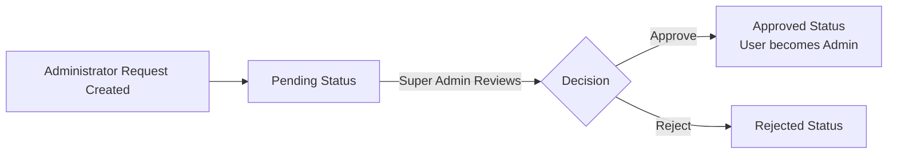
```mermaid
flowchart LR
    A["Administrator Request Created"] --> B["Pending Status"]
    B -->|"Super Admin Reviews"| C{"Decision"}
    C -->|"Approve"| D["Approved Status<br>User becomes Admin"]
    C -->|"Reject"| E["Rejected Status"]
```

### Single Request Limitation

### Single Request Limitation

THE system SHALL prevent users from having multiple pending administrator requests simultaneously.

WHEN a user attempts to submit an administrator request, THE system SHALL:
1. Check if the user has any existing pending administrator requests
2. Reject the new request if a pending request already exists for the user
3. Allow submission only when no pending requests exist for the user

IF a user has a rejected administrator request, THE system SHALL allow the user to submit a new administrator request.
IF a user has an approved administrator request, THE system SHALL prevent the user from submitting new administrator requests.

WHILE a user has a pending administrator request, THE system SHALL disable the "Submit Administrator Request" functionality for that user.
WHERE necessary, THE system SHALL provide clear messaging explaining why new requests cannot be submitted.

### Status Permanence Rules

### Status Permanence Rules

WHEN an administrator request status changes from "pending" to either "approved" or "rejected", THE system SHALL make the status change permanent.

THE system SHALL prevent automatic reversal of administrator request status decisions.
THE system SHALL prevent users from modifying administrator request status after initial review.

IF an administrator request is approved, THE system SHALL maintain the "approved" status indefinitely.
IF an administrator request is rejected, THE system SHALL maintain the "rejected" status indefinitely.

WHERE exceptional circumstances require status reconsideration, THE system SHALL require manual intervention by super administrators through separate administrative actions.
WHEN historical administrator request records are viewed, THE system SHALL accurately reflect all status changes with their original timestamps.

### Timestamp Preservation

### Timestamp Preservation

THE system SHALL record and preserve the original creation timestamp for every administrator request.

WHEN an administrator request is created, THE system SHALL:
1. Capture the exact date and time of creation in UTC format
2. Store the creation timestamp as immutable data
3. Display the creation timestamp in user-readable format to super administrators during review

THE system SHALL record and preserve the review timestamp when an administrator request status changes.
WHEN a super administrator approves or rejects an administrator request, THE system SHALL:
1. Capture the exact date and time of the review decision
2. Associate the review timestamp with the super administrator who made the decision
3. Store the review timestamp alongside the status change

WHERE administrator request history is displayed, THE system SHALL show both creation and review timestamps in chronological order.
IF a pending administrator request exists for an extended period, THE system SHALL include the creation timestamp in review interfaces to indicate request age.

# Business Validation Criteria

Business-level validation expectations and data quality criteria.

## User Validation Criteria

Email addresses must follow standard email format with proper domain structure. Display names must be unique across active users to avoid confusion. Passwords must meet minimum security requirements with sufficient complexity. User bios must be reasonable in length for profile display purposes. Email addresses must be unique to prevent duplicate account creation. Display names cannot contain offensive or inappropriate content. Profile information updates require valid and properly formatted data. Users cannot use reserved system names or administrator titles. Password changes require verification of current password knowledge. Account deletion requires confirmation to prevent accidental removal.

### Email Format Validation

## Email Format Validation

### Email Structure Requirements
WHEN a user provides an email address for account creation or profile update, THE system SHALL validate that the email follows standard email format.

WHEN validating email format, THE system SHALL:
1. Require the presence of both local part and domain part separated by '@'
2. Validate that the domain part contains at least one '.' character
3. Ensure there are no spaces in the email address
4. Require the local part to be non-empty
5. Validate that special characters in the local part are properly formatted

### Email Domain Validation
THE system SHALL validate that email domains follow proper domain structure rules.

WHEN validating domain structure, THE system SHALL:
1. Ensure the domain part contains valid domain name characters
2. Validate that the top-level domain has appropriate length (2+ characters)
3. Reject email addresses with consecutive dots in the domain
4. Validate that the domain does not start or end with a dot

### Email Format Error Scenarios
IF the email address does not contain '@' symbol, THE system SHALL reject the request.
IF the email address contains spaces, THE system SHALL reject the request.
IF the domain part is missing the '.' separator, THE system SHALL reject the request.
IF the local part is empty, THE system SHALL reject the request.

### Email Format Business Rules
WHILE validating email addresses, THE system SHALL apply consistent format rules across all user operations.
IF email validation fails, THE system SHALL provide a clear error message indicating the format issue.

### Email Storage and Display Consistency
THE system SHALL store email addresses in lowercase to ensure consistent comparison and display.
WHEN displaying email addresses, THE system SHALL maintain the original formatting provided by the user (case-sensitive display).

### Display Name Uniqueness

## Display Name Uniqueness

### Display Name Availability
THE system SHALL ensure display name uniqueness across all active user accounts.

WHEN validating display name uniqueness, THE system SHALL:
1. Check against all currently active user accounts
2. Treat display names as case-insensitive for uniqueness validation
3. Consider both user-created and system-reserved display names
4. Exclude the current user's own display name during profile updates

### Uniqueness Validation Timing
WHEN a user creates a new account, THE system SHALL validate display name uniqueness.
WHEN a user updates their profile display name, THE system SHALL validate display name uniqueness.
WHEN an administrator creates or modifies user accounts, THE system SHALL validate display name uniqueness.

### Uniqueness Error Handling
IF the requested display name is already in use by another active user, THE system SHALL reject the request.
IF the display name conflicts with a reserved system name, THE system SHALL reject the request.

### Uniqueness Resolution Options
THE system SHALL provide alternative suggestions when a display name is unavailable.
WHERE display name conflicts occur, THE system SHALL maintain consistency with user identity across articles and comments.

### Business Impact of Duplicate Names
THE system SHALL prevent display name duplication to avoid user confusion in discussions.
THE system SHALL prevent impersonation by ensuring unique display names across the platform.

### Display Name State Management
WHILE a user account is active, THE system SHALL maintain display name uniqueness constraints.
WHEN a user account is deleted, THE system SHALL release the display name for potential reuse.
IF a user changes their display name, THE system SHALL update all historical references to maintain attribution accuracy.

### Password Complexity Requirements

## Password Complexity Requirements

### Password Minimum Standards
WHEN a user creates or changes their password, THE system SHALL enforce minimum complexity requirements.

### Character Type Requirements
WHEN validating password complexity, THE system SHALL require passwords to contain:
1. At least 8 characters total
2. At least one uppercase letter (A-Z)
3. At least one lowercase letter (a-z)
4. At least one numeric digit (0-9)
5. At least one special character from a defined set (!@#$%^&* etc.)

### Password Composition Rules
THE system SHALL prevent passwords that:
1. Contain the user's email address
2. Contain the user's display name
3. Match common password patterns (123456, password, qwerty, etc.)
4. Contain repeating character sequences (aaa, 111, etc.)
5. Are entirely numeric or entirely alphabetic

### Password Security Validation
WHILE creating or changing passwords, THE system SHALL validate password strength against complexity rules.
IF password complexity requirements are not met, THE system SHALL reject the request with specific guidance.

### Password Change Requirements
THE system SHALL apply the same complexity requirements to both initial password creation and subsequent password changes.
WHEN a user requests a password change, THE system SHALL validate the new password against all complexity rules.

### Password Policy Communication
THE system SHALL clearly communicate password complexity requirements to users during password setup.
THE system SHALL provide specific feedback when password complexity rules are not met.

### Password Storage Security
WHILE storing passwords, THE system SHALL use secure hashing algorithms.
THE system SHALL never store passwords in plain text format.
THE system SHALL implement password history tracking to prevent reuse of recent passwords (defined in security policies).

### Bio Length Restrictions

## Bio Length Restrictions

### Bio Text Length Constraints
WHEN a user creates or updates their bio, THE system SHALL enforce length restrictions.

### Maximum Length Enforcement
THE system SHALL restrict bio text to a maximum of 500 characters.
WHEN validating bio length, THE system SHALL count all characters including spaces and punctuation.

### Minimum Length Considerations
THE system SHALL allow empty bios (0 characters) for users who choose not to provide biographical information.
WHERE bio text is provided, THE system SHALL require it to be meaningful (not just whitespace or repeated characters).

### Bio Length Validation Rules
WHILE processing bio updates, THE system SHALL:
1. Count characters accurately including Unicode characters
2. Strip leading and trailing whitespace before length validation
3. Validate length before storing in the database

### Bio Length Error Handling
IF bio text exceeds 500 characters, THE system SHALL reject the request.
IF bio text contains only whitespace characters, THE system SHALL treat it as empty.

### Bio Display Considerations
THE system SHALL properly display bios within profile pages regardless of length.
THE system SHALL truncate bio text in list views if necessary for display consistency.

### Bio Formatting Rules
WHILE storing bio text, THE system SHALL preserve formatting including line breaks and paragraph structure.
THE system SHALL allow common formatting characters in bio text.

### Business Purpose of Length Limits
THE system SHALL enforce bio length limits to maintain readable profile displays.
THE system SHALL balance user expression needs with display layout requirements.

### Email Uniqueness Constraint

## Email Uniqueness Constraint

### Email Uniqueness Requirement
THE system SHALL ensure each email address is associated with only one active user account.

### Email Uniqueness Validation
WHEN a user creates a new account, THE system SHALL validate email uniqueness against all active accounts.
WHEN a user updates their email address, THE system SHALL validate email uniqueness against all active accounts.

### Email Uniqueness Scope
THE system SHALL validate email uniqueness across:
1. All currently active user accounts
2. All temporarily suspended user accounts
3. All recently deleted accounts within a retention period

### Case-Insensitive Email Comparison
THE system SHALL treat email addresses as case-insensitive for uniqueness validation.
WHILE checking email uniqueness, THE system SHALL convert all emails to lowercase for comparison.

### Email Uniqueness Error Handling
IF the email address is already associated with an active user account, THE system SHALL reject the account creation request.
IF the requested email update conflicts with an existing active account, THE system SHALL reject the profile update request.

### Business Impact of Duplicate Emails
THE system SHALL prevent duplicate email registration to maintain individual user identity.
THE system SHALL prevent account recovery conflicts by ensuring email uniqueness.

### Email Uniqueness and Account Recovery
WHERE email uniqueness is violated, THE system SHALL provide appropriate guidance for account recovery.
THE system SHALL maintain email uniqueness even during account merging or consolidation processes.

### Email Uniqueness Verification Flow
WHEN email uniqueness validation fails, THE system SHALL suggest alternative actions (login instead of register, password reset, etc.).
THE system SHALL maintain audit trails of email uniqueness validation attempts.

### Content Appropriateness Checks

## Content Appropriateness Checks

### User Content Moderation
WHEN users submit display names, bios, or other profile content, THE system SHALL check for inappropriate material.

### Prohibited Content Categories
THE system SHALL flag or reject profile content containing:
1. Hate speech or discriminatory language
2. Explicit or adult content
3. Harassment or threats
4. Illegal activity promotion
5. Spam or commercial solicitation
6. Impersonation attempts
7. Personally identifiable information of others

### Content Moderation Levels
WHILE checking content appropriateness, THE system SHALL apply consistent moderation standards.
THE system SHALL differentiate between accidental inappropriate content and deliberate violations.

### Display Name Appropriateness
WHEN validating display names, THE system SHALL:
1. Check for offensive words or phrases
2. Verify names don't impersonate administrators or system entities
3. Ensure names are suitable for public display
4. Prevent misleading or deceptive names

### Bio Content Appropriateness
WHEN validating bio text, THE system SHALL:
1. Check for prohibited content categories
2. Ensure bios don't contain excessive promotional material
3. Verify bios don't include inappropriate links or contact information
4. Prevent bios that violate community guidelines

### Content Moderation Workflow
IF inappropriate content is detected, THE system SHALL:
1. Reject the content submission
2. Provide clear explanation of the violation
3. Allow resubmission with corrected content
4. Escalate repeated violations for administrator review

### Business Impact of Content Standards
THE system SHALL maintain a respectful discussion environment through content appropriateness checks.
THE system SHALL balance free expression with community safety requirements.

### Content Review Mechanisms
THE system SHALL provide mechanisms for users to report inappropriate profile content.
THE system SHALL maintain audit trails of content moderation decisions.

### Profile Update Validation

## Profile Update Validation

### Profile Update Requirements
WHEN a user updates their profile information, THE system SHALL validate all changes.

### Update Data Integrity Checks
WHILE processing profile updates, THE system SHALL:
1. Validate email format (if email is being updated)
2. Validate email uniqueness (if email is being updated)
3. Validate display name uniqueness (if display name is being updated)
4. Validate bio length restrictions
5. Validate content appropriateness for all changed fields

### Update Transaction Integrity
THE system SHALL process profile updates as atomic transactions.
IF any validation fails during a multi-field update, THE system SHALL reject the entire update.

### Update Frequency Considerations
THE system SHALL allow reasonable update frequency for profile information.
THE system SHALL prevent abusive update patterns that could indicate malicious activity.

### Profile Update Permission Verification
WHEN processing profile updates, THE system SHALL verify the requesting user has permission to update the target profile.
IF a user attempts to update another user's profile, THE system SHALL reject the request.

### Update Data Format Validation
THE system SHALL validate that all updated fields contain properly formatted data.
WHEN validating updated data, THE system SHALL:
1. Strip unnecessary whitespace
2. Normalize character encoding
3. Validate data types
4. Apply consistent formatting rules

### Update Confirmation Requirements
WHERE profile updates involve significant changes (email address), THE system SHALL require confirmation.
THE system SHALL provide clear feedback when profile updates are successful.

### Business Rules for Profile Updates
THE system SHALL maintain profile update logs for audit purposes.
THE system SHALL ensure profile updates don't disrupt existing user contributions or attribution.

### Profile Update Error Handling
IF profile update validation fails, THE system SHALL:
1. Preserve the user's existing profile data
2. Provide specific error messages
3. Suggest corrective actions
4. Maintain data consistency across the platform.

### Reserved Name Prevention

## Reserved Name Prevention

### System Reserved Names
THE system SHALL maintain a list of reserved names that cannot be used as display names.

### Reserved Name Categories
THE system SHALL reserve names including:
1. System role titles (Admin, Administrator, Moderator, System)
2. Platform name variations and trademarks
3. Generic terms that could cause confusion (Support, Help, CustomerService)
4. Terms that impersonate platform functionality (Delete, Ban, Report)
5. Standardized test account names

### Reserved Name Validation
WHEN validating display names, THE system SHALL check against the reserved names list.
WHILE checking for reserved names, THE system SHALL apply case-insensitive comparison.

### Dynamic Reserved Names
THE system SHALL allow administrators to update the reserved names list as needed.
WHEN administrators add new reserved names, THE system SHALL validate existing users don't have conflicting names.

### Reserved Name Error Handling
IF a user attempts to use a reserved name, THE system SHALL reject the request.
WHERE reserved name conflicts occur, THE system SHALL provide alternative suggestions.

### Business Impact of Name Reservations
THE system SHALL prevent name impersonation that could confuse other users.
THE system SHALL maintain clear distinction between user accounts and system entities.

### Reserved Name Communication
THE system SHALL clearly communicate reserved name restrictions during account creation and profile updates.
THE system SHALL provide the rationale for name reservations when conflicts occur.

### Reserved Name Scope Management
THE system SHALL differentiate between permanently reserved names and temporarily restricted names.
THE system SHALL apply reserved name prevention consistently across all user operations.

### Reserved Name Exceptions
WHERE special circumstances require use of reserved names, THE system SHALL allow administrator override.
THE system SHALL maintain audit trails of reserved name exception approvals.

### Password Change Verification

## Password Change Verification

### Password Change Security Requirements
WHEN a user requests to change their password, THE system SHALL verify the request authenticity.

### Current Password Verification
WHEN processing password change requests, THE system SHALL require verification of the current password.
IF the current password verification fails, THE system SHALL reject the password change request.

### Password Change Process
THE system SHALL enforce the following password change process:
1. User provides current password for verification
2. System validates current password against stored credentials
3. User provides new password
4. System validates new password meets complexity requirements
5. System validates new password is different from current password
6. System updates password credentials

### Verification Failure Handling
IF current password verification fails multiple times, THE system SHALL:
1. Temporarily lock password change functionality
2. Notify the user of failed attempts
3. Suggest password reset options if needed

### Password Change Session Security
WHILE processing password changes, THE system SHALL maintain secure session integrity.
THE system SHALL prevent password changes during compromised session states.

### Business Rules for Password Changes
THE system SHALL enforce password change verification to prevent unauthorized account access.
THE system SHALL balance security requirements with user convenience in password management.

### Password Change Confirmation
WHERE password changes are successful, THE system SHALL:
1. Confirm the password change to the user
2. Update session credentials if applicable
3. Log the password change event for security auditing

### Password Change Error Scenarios
IF new password fails complexity requirements, THE system SHALL reject the change.
IF new password matches current password, THE system SHALL reject the change.
IF verification process times out, THE system SHALL require restarting the password change process.

### Password Change Frequency Controls
THE system SHALL prevent excessive password change requests that could indicate malicious activity.
THE system SHALL maintain reasonable limits on password change frequency while allowing legitimate needs.

### Account Deletion Confirmation

## Account Deletion Confirmation

### Account Deletion Security Requirement
WHEN a user requests to delete their account, THE system SHALL require explicit confirmation.

### Deletion Confirmation Process
THE system SHALL require users to confirm account deletion through a separate verification step.
WHILE processing account deletion, THE system SHALL:
1. Display clear consequences of account deletion
2. Require explicit confirmation action
3. Provide a cancellation option before final deletion
4. Maintain user authentication throughout the process

### Deletion Consequences Communication
THE system SHALL clearly communicate that account deletion will:
1. Permanently remove the user account
2. Delete all user-authored articles and comments (as specified in requirements)
3. Remove profile information
4. Be irreversible once confirmed

### Confirmation Interface Requirements
THE system SHALL present account deletion confirmation in a way that prevents accidental activation.
WHERE account deletion is requested, THE system SHALL require the user to:
1. Re-enter their password for verification
2. Check a confirmation checkbox acknowledging consequences
3. Click a separate "Confirm Deletion" button

### Business Rules for Account Deletion
THE system SHALL ensure account deletion confirmation prevents accidental loss of user data.
THE system SHALL maintain audit trails of account deletion requests and confirmations.

### Deletion Confirmation Timing
THE system SHALL allow a reasonable time window for users to reconsider deletion.
THE system SHALL provide a grace period where deletion can be cancelled before permanent removal.

### Error Handling in Deletion Process
IF confirmation fails or is incomplete, THE system SHALL preserve the account.
IF authentication is lost during the deletion process, THE system SHALL cancel the deletion.

### Account Deletion Finalization
WHERE account deletion is confirmed, THE system SHALL:
1. Process the deletion according to data retention policies
2. Send confirmation of deletion completion
3. Update all related data references appropriately

### Deletion Confirmation Security
THE system SHALL prevent automated or scripted account deletion confirmations.
THE system SHALL verify human interaction during the confirmation process.

## Article Validation Criteria

Article titles must be descriptive and meaningful for searchability. Content must meet minimum length requirements to ensure substantive discussion. Tags must be relevant to the article's economic or political topic. Section selection must reference an existing active section. Title length must be appropriate for display in article lists. Content cannot contain spam, promotional, or off-topic material. Multiple attachments must not exceed reasonable storage limits. Tags must follow community guidelines for appropriate categorization. Article edits must maintain the original intent and topic relevance. Deletion requires confirmation to prevent accidental content removal.

### Title Meaningfulness Validation

THE system SHALL validate that article titles are descriptive and meaningful for searchability among economic and political discussions.

WHEN a user creates or edits an article, THE system SHALL ensure the title reflects substantive content appropriate for discussion board topics.

WHERE discussion board content focuses on economic and political topics, THE system SHALL require titles to maintain topic relevance.

### Content Minimum Length Requirements

THE system SHALL enforce minimum content length to ensure substantive discussion within economic and political topics.

WHEN a user creates or edits an article, THE system SHALL require sufficient content to support meaningful discussion of economic and political matters.

### Tag Relevance Validation

THE system SHALL validate that tags are relevant to the article's economic or political topic domain.

WHEN a user adds tags to an article, THE system SHALL ensure tags maintain appropriate categorization for discussion board content.

### Content Topic Appropriateness

THE system SHALL validate that article content remains on-topic for economic and political discussion domains.

WHEN a user creates or edits an article, THE system SHALL ensure content aligns with discussion board focus areas.

IF content deviates significantly from economic and political topics, THE system SHALL flag for review.

### Edit Consistency Validation

THE system SHALL validate that article edits maintain original intent and topic relevance within economic and political discussion scope.

WHEN a user edits an existing article, THE system SHALL ensure editorial changes preserve discussion board appropriateness.

## Comment Validation Criteria

Comments must contain substantive content beyond minimal responses. Content must relate directly to the article being discussed. Comment length should be reasonable for discussion purposes. Comments cannot contain personal attacks or harassment. Multiple rapid comments are limited to prevent spam behavior. Content must adhere to community discussion guidelines. Comments should contribute meaningfully to the conversation. Edit functionality preserves the comment's original context. Deletion requires proper authorization and confirmation. Comments maintain chronological order for discussion flow.

### Comment Substance Requirements

WHEN a user submits a comment, THE discussionBoard SHALL ensure the comment contains substantive content.

IF a comment contains only minimal responses (e.g., "ok", "thanks", "+1"), THEN THE discussionBoard SHALL reject the submission.
IF a comment consists primarily of repeated characters or meaningless text, THEN THE discussionBoard SHALL reject the submission.

THE discussionBoard SHALL consider a comment substantive when it contains at least one complete thought or meaningful contribution to the discussion.
WHEN processing comment validation, THE discussionBoard SHALL evaluate whether the comment addresses a point raised in the article or previous comments.

IF a comment appears to be automated or generated without user thought, THEN THE discussionBoard SHALL reject the submission.

**Business Rationale**: Comments should foster meaningful discussion rather than noise or simple acknowledgments.

### Topic Relevance Validation

WHEN a user submits a comment on an article, THE discussionBoard SHALL verify the comment relates to the article topic.

IF a comment discusses topics completely unrelated to the article's economic or political subject matter, THEN THE discussionBoard SHALL reject the submission.
IF a comment attempts to shift discussion to unrelated topics without connecting to the article, THEN THE discussionBoard SHALL reject the submission.

THE discussionBoard SHALL allow comments that:
1. Respond directly to points in the article
2. Address comments made by other users
3. Provide relevant additional information
4. Ask clarifying questions about the article

WHEN determining relevance, THE discussionBoard SHALL consider the article's section category (Politics, Economy, Current Affairs) as context.

**Business Rationale**: Comments should remain focused on the article's topic to maintain productive discussions.

### Comment Length Guidelines

WHEN a user submits a comment, THE discussionBoard SHALL enforce reasonable length guidelines.

THE discussionBoard SHALL reject comments that are excessively short for substantive discussion.
THE discussionBoard SHALL reject comments that are excessively long for discussion purposes.

WHERE comment length validation is applied, THE discussionBoard SHALL provide appropriate feedback to users about length requirements.

**Length Business Rules**:
1. Minimum length sufficient for substantive contribution (more than brief acknowledgment)
2. Maximum length appropriate for discussion board format (not essay-length)
3. Length measured in meaningful characters or words, not counting whitespace

WHEN determining appropriate length, THE discussionBoard SHALL consider typical discussion forum norms and readability expectations.

IF a comment violates length guidelines, THEN THE discussionBoard SHALL reject the submission with guidance on appropriate length.

### Content Appropriateness Checks

WHEN a user submits a comment, THE discussionBoard SHALL check for inappropriate content.

THE discussionBoard SHALL reject comments that contain:
1. Personal attacks or harassment against other users
2. Hate speech or discriminatory language
3. Threats of violence or harm
4. Explicitly offensive language
5. Malicious intent or targeted abuse

WHILE a comment is being evaluated, THE discussionBoard SHALL apply consistent appropriateness standards across all discussions.

IF a comment contains borderline content that requires human judgment, THEN THE discussionBoard SHALL flag it for administrator review while withholding immediate publication.

THE discussionBoard SHALL maintain a clear policy on what constitutes inappropriate content, referencing community discussion guidelines.

**Business Rationale**: Maintain a respectful discussion environment where users can engage in economic and political discourse without fear of harassment.

### Rate Limiting for Spam Prevention

WHEN users submit comments, THE discussionBoard SHALL apply rate limiting to prevent spam behavior.

THE discussionBoard SHALL limit the number of comments a user can submit within a short time period.
THE discussionBoard SHALL prevent rapid-fire commenting that disrupts discussion flow.

IF a user attempts to submit comments more frequently than the rate limit allows, THEN THE discussionBoard SHALL delay processing of subsequent comments.
IF a user exhibits systematic spam behavior across multiple comments, THEN THE discussionBoard SHALL trigger additional anti-spam measures.

**Rate Limiting Business Rules**:
1. Maximum comments per minute limit
2. Maximum comments per hour limit
3. Progressive restrictions for repeated violations
4. Temporary cooldown periods after reaching limits

WHEN rate limiting is applied, THE discussionBoard SHALL inform users of the restriction and when they can comment again.

THE discussionBoard SHALL distinguish between legitimate rapid discussion participation and spam behavior.

### Community Guideline Compliance

WHEN users submit comments, THE discussionBoard SHALL ensure compliance with community discussion guidelines.

THE discussionBoard SHALL require that all comments adhere to platform community standards.
THE discussionBoard SHALL reference specific guideline violations when rejecting comments.

IF a comment violates community guidelines, THEN THE discussionBoard SHALL reject the submission.
IF a user repeatedly violates community guidelines, THEN THE discussionBoard SHALL escalate to administrator review.

**Community Guideline Areas**:
1. Respectful discourse requirements
2. Fact-based discussion expectations
3. Citation standards for claims
4. Civil disagreement protocols
5. Privacy protection rules
6. Intellectual property considerations

WHEN evaluating guideline compliance, THE discussionBoard SHALL provide clear feedback to users about which guideline was violated.

THE discussionBoard SHALL maintain consistency in guideline application across all economic and political discussions.

### Meaningful Contribution Validation

WHEN a user submits a comment, THE discussionBoard SHALL validate that the comment constitutes a meaningful contribution to the discussion.

THE discussionBoard SHALL reject comments that do not add value to the conversation.
THE discussionBoard SHALL accept comments that:
1. Provide new information or perspectives
2. Ask relevant questions that advance understanding
3. Constructively critique article points
4. Share relevant experiences or examples
5. Connect article concepts to broader contexts

IF a comment merely repeats points already made, THEN THE discussionBoard SHALL evaluate whether it adds new emphasis or clarification.
IF a comment appears to be low-effort or perfunctory, THEN THE discussionBoard SHALL reject the submission.

WHEN determining meaningful contribution, THE discussionBoard SHALL consider:
1. The existing discussion context
2. The comment's relationship to the article
3. Whether the comment advances understanding
4. The value to other readers

**Business Rationale**: Ensure comments elevate discussion quality rather than simply adding volume.

### Edit Context Preservation

WHEN a user edits their comment, THE discussionBoard SHALL preserve the comment's original context and discussion position.

THE discussionBoard SHALL ensure edited comments maintain their chronological position in the discussion.
THE discussionBoard SHALL prevent edits that fundamentally change the meaning of the original comment in ways that disrupt conversation flow.

IF a user attempts to edit a comment to completely alter its original point, THEN THE discussionBoard SHALL restrict the edit or require it as a new comment.
IF a user edits a comment, THEN THE discussionBoard SHALL indicate that the comment has been modified.

**Edit Business Rules**:
1. Edits must maintain the comment's core contribution to the discussion
2. Significant content changes may need to be posted as new comments
3. Edit history should be accessible for transparency
4. Edits cannot be used to circumvent content appropriateness checks

WHEN processing edits, THE discussionBoard SHALL apply the same validation rules as new comment creation.

THE discussionBoard SHALL balance user editing rights with discussion continuity needs.

### Deletion Authorization Workflow

WHEN a user requests to delete their comment, THE discussionBoard SHALL enforce proper authorization workflows.

THE discussionBoard SHALL only allow comment deletion by:
1. The comment author
2. Administrators with appropriate privileges
3. Super administrators

THE discussionBoard SHALL require confirmation before permanently deleting a comment.
IF a comment has replies or significant discussion attached, THEN THE discussionBoard SHALL provide additional warnings about deletion impact.

WHEN an administrator deletes a comment, THE discussionBoard SHALL record the administrator identity and reason for deletion.
WHEN a user deletes their own comment, THE discussionBoard SHALL confirm the action cannot be undone.

**Deletion Business Rules**:
1. Authors can delete their own comments
2. Administrators can delete any comment with documented reason
3. Deleted comments are removed from public view
4. Deletion records are maintained for moderation purposes
5. Comment deletion does not affect article or section statistics

IF deletion would disrupt ongoing discussion, THEN THE discussionBoard SHALL provide alternative options (e.g., content removal while preserving comment structure).

### Chronological Ordering Maintenance

WHEN comments are displayed on an article, THE discussionBoard SHALL maintain strict chronological ordering.

THE discussionBoard SHALL display comments in the order they were posted, starting with the oldest comment.
THE discussionBoard SHALL ensure new comments are added to the end of the comment list.

IF comments are edited, THEN THE discussionBoard SHALL maintain their original chronological position.
IF comments are deleted, THEN THE discussionBoard SHALL preserve the chronological order of remaining comments.

**Ordering Business Rules**:
1. Comments sorted by creation timestamp (ascending)
2. No reordering based on popularity or user status
3. Chronological consistency across all viewing contexts
4. Timestamp display format consistent with user locale

WHEN paginating comments, THE discussionBoard SHALL maintain chronological continuity across pages.
WHERE comment sorting is required, THE discussionBoard SHALL use chronological order as the default and only option.

THE discussionBoard SHALL ensure that comment threading or nesting does not disrupt the chronological presentation of the discussion flow.

## Section Validation Criteria

Section names must be unique to avoid navigation confusion. Descriptions must clearly explain the section's topical focus. Names should be concise yet descriptive for easy identification. Descriptions must adequately cover the intended discussion scope. Section creation requires proper administrative authorization. Name changes must maintain backward compatibility where possible. Descriptions should be updated to reflect current focus areas. Decommissioned sections require proper archival procedures. New sections must not duplicate existing topical coverage. Section management follows established administrative protocols.

### Section Name Uniqueness

THE discussionBoard system SHALL enforce uniqueness for section names.

WHEN an administrator attempts to create a new section, THE system SHALL reject the request if the provided name matches any existing section name exactly (case-insensitive comparison).

WHEN an administrator attempts to rename an existing section, THE system SHALL reject the request if the new name matches any other existing section name exactly (case-insensitive comparison).

IF a duplicate section name is detected, THE system SHALL provide an error message indicating that section names must be unique.

### Description Clarity and Scope

THE discussionBoard system SHALL validate section descriptions for clarity and appropriate scope.

WHEN creating or updating a section, THE system SHALL require the description to be at least 20 characters and at most 500 characters.

WHERE the description is provided, THE system SHALL check for:
1. Complete sentences or coherent phrases
2. Clear explanation of the section's topical focus
3. Non-redundant information not already conveyed by the section name

IF the description fails any clarity validation, THE system SHALL reject the request with guidance about required clarity standards.

### Name Conciseness and Format

THE discussionBoard system SHALL enforce formatting requirements for section names.

WHEN creating or updating a section, THE system SHALL require the name to be:
1. Between 3 and 50 characters in length
2. Composed of alphanumeric characters, spaces, and basic punctuation
3. Free of excessive capitalization (no all-caps names)
4. Descriptive enough to indicate the section's topic

IF the name format violates any of these requirements, THE system SHALL reject the request with specific formatting guidance.

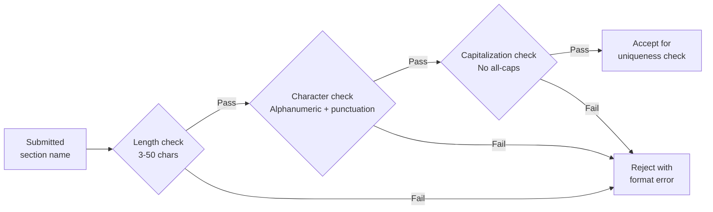
```mermaid
flowchart LR
    A["Submitted
section name"] --> B{Length check
3-50 chars}
    B -- "Pass" --> C{Character check
Alphanumeric + punctuation}
    B -- "Fail" --> D["Reject with
format error"]
    C -- "Pass" --> E{Capitalization check
No all-caps}
    C -- "Fail" --> D
    E -- "Pass" --> F["Accept for
uniqueness check"]
    E -- "Fail" --> D
```

### Administrative Authorization Workflow

WHEN a non-administrator attempts to create, edit, or delete a section, THE system SHALL reject the request immediately.

WHEN an administrator attempts to create a section, THE system SHALL:
1. Verify the administrator has active administrator status
2. Require administrator session authentication
3. Record which administrator performed the action
4. Log the section creation event with timestamp

WHEN a regular administrator attempts to delete a section containing articles, THE system SHALL require confirmation that article migration or deletion is acceptable.

WHEN a super administrator performs any section management action, THE system SHALL record the action with super administrator identifier.

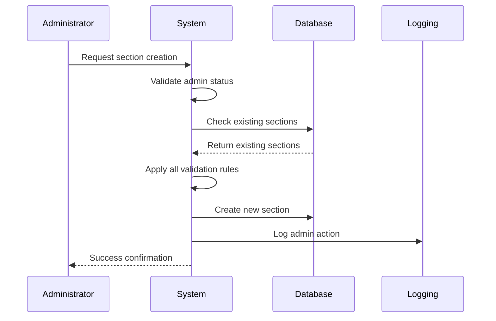
```mermaid
sequenceDiagram
    participant A as Administrator
    participant S as System
    participant D as Database
    participant L as Logging
    
    A->>S: Request section creation
    S->>S: Validate admin status
    S->>D: Check existing sections
    D-->>S: Return existing sections
    S->>S: Apply all validation rules
    S->>D: Create new section
    S->>L: Log admin action
    S-->>A: Success confirmation
```

### Backward Compatibility and Updates

WHEN an administrator renames an existing section, THE system SHALL:
1. Maintain all existing article associations with the renamed section
2. Update any internal references to use the new name
3. Preserve all historical data and relationships
4. Ensure search functionality continues to find articles in the renamed section

WHERE a section description is updated, THE system SHALL:
1. Preserve the previous description in edit history
2. Update the displayed description immediately
3. Ensure all cached references to the old description are invalidated

IF a section is deleted while containing articles, THE system SHALL either:
1. Move all articles to a designated default section, OR
2. Delete all associated articles (with appropriate warnings and confirmation)

### Topic Duplication Prevention

THE discussionBoard system SHALL prevent topical duplication across sections.

WHEN creating a new section, THE system SHALL analyze existing sections for topical overlap by:
1. Comparing name similarity using string distance metrics
2. Comparing description keywords and semantic content
3. Checking if the proposed topic is already adequately covered by existing sections

IF potential duplication is detected, THE system SHALL:
1. Flag the duplication concern to the administrator
2. Suggest alternative naming if appropriate
3. Provide existing sections that cover similar topics
4. Require explicit override confirmation before proceeding

WHEN multiple sections exist with similar topics, THE system SHALL include warnings in administrative interfaces about potential user confusion.

### Administrative Protocol Adherence

THE discussionBoard system SHALL enforce administrative protocols for section management.

WHEN any section management action is performed, THE system SHALL require:
1. Valid administrator authentication
2. Reason documentation for significant changes (renames, deletions)
3. Proper escalation for high-impact actions (deleting populated sections)
4. Audit trail maintenance for compliance

WHERE a regular administrator attempts a high-impact section action, THE system SHALL:
1. Require super administrator review for deletion of sections with >100 articles
2. Escalate rename requests for sections with >500 articles
3. Flag actions affecting popular sections for additional scrutiny

WHEN section archival is required, THE system SHALL follow established archival procedures:
1. Mark section as "archived" rather than deleted
2. Prevent new articles in archived sections
3. Display archival status clearly in interfaces
4. Maintain all existing article visibility and relationships

## Attachment Validation Criteria

Attachments must be of supported file types for security reasons. File sizes must be reasonable for download and storage purposes. File names must be descriptive and not contain special characters. Multiple attachments per article must stay within practical limits. Image files must be of appropriate quality and dimensions. Documents must be in readable formats for community access. File uploads must complete successfully without corruption. Attachment descriptions should accurately represent content. Virus scanning must occur before file availability. Storage quotas prevent excessive resource consumption.

### Supported File Type Validation

WHEN a user attaches a file to an article, THE system SHALL verify the file type is allowed.

**Allowed Document Types:**
- Portable Document Format (PDF)
- Word Processing documents (DOC, DOCX)
- Plain text (TXT)
- Spreadsheet documents (XLS, XLSX)
- Presentation files (PPT, PPTX)

**Allowed Image Types:**
- JPEG/JPG formats for photographs
- PNG format for graphics with transparency
- GIF format for animated graphics
- WEBP format for modern web images

**Allowed Archive Types:**
- ZIP archives for multiple files
- RAR archives for compressed collections

IF the file type is not in the allowed list, THEN THE system SHALL reject the upload and inform the user.
WHEN processing image attachments, THE system SHALL accept only image-specific formats.
WHEN processing document attachments, THE system SHALL accept only document-specific formats.
WHERE multiple file types are attached, THE system SHALL validate each file individually.

**Business Rules:**
- Executable files (EXE, BAT, SH) are explicitly prohibited for security reasons.
- Script files (JS, PHP, PY) are prohibited unless specifically authorized.
- System configuration files (INI, CONFIG) are prohibited.
- Database files (MDB, SQL) are prohibited to prevent data injection risks.
- Compressed files must be scanned before extraction validation.

### File Size Limitations

WHEN a user uploads a file attachment, THE system SHALL enforce size limits.

**Size Categories:**
- Individual image files SHALL NOT exceed 10 megabytes.
- Individual document files SHALL NOT exceed 25 megabytes.
- Archive files containing multiple documents SHALL NOT exceed 50 megabytes.
- Total attachments per article SHALL NOT exceed 100 megabytes combined.

**Business Rules:**
IF a file exceeds the category-specific limit, THEN THE system SHALL reject the upload.
IF combined attachments exceed the per-article limit, THEN THE system SHALL reject subsequent uploads.
WHEN a user attempts to upload multiple files, THE system SHALL calculate cumulative size.
WHILE processing uploads, THE system SHALL check size constraints before accepting files.

**Exception Handling:**
- Users attempting to upload files exceeding limits SHALL receive clear size violation messages.
- Size calculations SHALL include all metadata and file overhead.
- Compressed file sizes SHALL be measured before extraction.
- Temporary storage during upload SHALL respect size constraints.

**Progressive Upload Management:**
THE system SHALL provide real-time size feedback during multi-file selection.
THE system SHALL prevent selection of files that would exceed limits.
THE system SHALL maintain size tracking across attachment sessions.

### Filename Format Requirements

WHEN a user attaches a file, THE system SHALL validate the filename format.

**Format Rules:**
- Filenames SHALL contain only alphanumeric characters, hyphens, underscores, and periods.
- Filenames SHALL NOT contain special characters: < > : " | ? *
- Filenames SHALL NOT contain spaces at the beginning or end.
- Filename extensions SHALL match the actual file type.
- Filename length SHALL NOT exceed 255 characters including extension.

**Business Validation:**
IF a filename contains prohibited characters, THEN THE system SHALL reject the attachment.
IF a filename has an extension mismatch, THEN THE system SHALL compare with actual file type.
WHEN processing filenames with spaces, THE system SHALL normalize internal spaces.
WHILE storing attachments, THE system SHALL preserve the original filename safely.

**Security Requirements:**
- Filenames attempting directory traversal (../) SHALL be blocked.
- Hidden files (starting with .) SHALL be rejected unless specifically authorized.
- System-reserved names (CON, PRN, AUX) SHALL be renamed automatically.
- Duplicate filenames within an article SHALL be handled with version numbering.

**User Experience Rules:**
THE system SHALL provide clear feedback on filename validation failures.
THE system SHALL suggest corrected filenames when possible.
THE system SHALL maintain filename readability for download purposes.

### Attachment Quantity Constraints

WHEN users attach files to articles, THE system SHALL enforce quantity limits.

**Quantity Rules:**
- Maximum images per article: 10 files
- Maximum documents per article: 5 files
- Maximum total attachments per article: 15 files
- Minimum attachments: 0 (optional feature)

**Business Logic:**
IF a user attempts to exceed image limits, THEN THE system SHALL prevent additional image uploads.
IF a user attempts to exceed document limits, THEN THE system SHALL prevent additional document uploads.
IF total attachment count reaches maximum, THEN THE system SHALL reject all further uploads.
WHEN users edit articles, THE system SHALL maintain existing attachment counts in limits.

**Type-Specific Enforcement:**
- Image quantity constraints apply only to image file types.
- Document quantity constraints apply only to document file types.
- Mixed-type counts contribute to total attachment limits.
- Replacement of existing attachments does not increase count.

**User Communication:**
THE system SHALL display current attachment counts during upload.
THE system SHALL warn users approaching quantity limits.
THE system SHALL provide clear messages when limits are reached.

**Administrative Considerations:**
- Quantity limits SHALL apply equally to all user types.
- System administrators cannot bypass quantity constraints.
- Bulk upload operations SHALL respect per-article limits.

### Image Quality Standards

WHEN users attach image files, THE system SHALL enforce quality standards.

**Resolution Requirements:**
- Minimum image dimensions: 100x100 pixels
- Maximum image dimensions: 4096x4096 pixels
- Recommended aspect ratio: between 1:4 and 4:1
- Color depth: Minimum 8-bit color or grayscale

**Quality Validation:**
IF an image has dimensions below minimum, THEN THE system SHALL reject the upload.
IF an image has dimensions above maximum, THEN THE system SHALL offer resizing option.
WHEN processing images, THE system SHALL verify they are not corrupted.
WHILE displaying images, THE system SHALL maintain aspect ratio integrity.

**Content Quality Rules:**
- Images must be clearly visible without excessive compression artifacts.
- Text within images must be readable at standard display sizes.
- Charts and graphs must maintain data legibility.
- Photographs must have reasonable exposure and focus.

**Format-Specific Standards:**
- JPEG images must have compression quality above 70%.
- PNG images must use appropriate compression without data loss.
- GIF animations must have reasonable frame rates (≤15 fps).
- WEBP images must use modern compression efficiently.

**User Guidance:**
THE system SHALL provide feedback on image quality issues.
THE system SHALL suggest optimal image dimensions.
THE system SHALL maintain quality during any automatic processing.

### Document Readability Verification

WHEN users attach document files, THE system SHALL ensure readability.

**Readability Criteria:**
- Documents must contain actual content, not blank pages.
- Text documents must have discernible character encoding.
- Spreadsheets must have at least one populated cell.
- Presentations must contain at least one slide with content.
- PDF files must have extractable text or renderable content.

**Validation Process:**
IF a document appears to be empty, THEN THE system SHALL reject the upload.
IF a document has corrupted content structure, THEN THE system SHALL reject the upload.
WHEN processing documents, THE system SHALL perform basic content extraction.
WHILE storing documents, THE system SHALL preserve original formatting where possible.

**Format-Specific Requirements:**
- PDF documents must pass basic PDF structure validation.
- Word documents must have valid OOXML or DOC structure.
- Text files must use UTF-8 or ASCII encoding.
- Spreadsheets must have valid cell structure.

**Accessibility Considerations:**
- Documents should avoid password protection that prevents reading.
- Documents should not require proprietary software for basic viewing.
- Document content should be accessible to screen readers where applicable.

**User Experience:**
THE system SHALL provide clear feedback when documents fail readability checks.
THE system SHALL maintain document integrity during upload and storage.
THE system SHALL ensure documents remain readable over time.

### Upload Integrity Checking

WHEN users upload file attachments, THE system SHALL verify upload integrity.

**Integrity Verification:**
- File transfer must complete without interruption.
- Transferred bytes must match original file size exactly.
- File checksums must validate before acceptance.
- Network transmission errors must be detected and handled.

**Validation Rules:**
IF a file transfer is interrupted, THEN THE system SHALL allow resume capability.
IF bytes transferred do not match expected size, THEN THE system SHALL reject partial upload.
WHEN calculating checksums, THE system SHALL use SHA-256 algorithm.
WHILE storing files, THE system SHALL verify write operations completed successfully.

**Upload Process Requirements:**
- Upload progress must be trackable by users.
- Network timeouts must be handled gracefully.
- Server-side storage must confirm successful persistence.
- Temporary files must be cleaned up after failed uploads.

**Error Recovery:**
- Users must be able to retry failed uploads.
- Partial uploads must not count against attachment limits.
- Upload failures must not affect existing article content.
- Session continuity must be maintained during retry attempts.

**System Guarantees:**
THE system SHALL ensure uploaded files remain unchanged from original.
THE system SHALL prevent data corruption during transfer.
THE system SHALL provide reliable upload completion confirmation.

### Content Description Accuracy

WHEN files are attached to articles, THE system SHALL ensure descriptions match content.

**Description Requirements:**
- File names should accurately reflect content.
- Image descriptions should match visual content.
- Document titles should correspond to actual document topics.
- Archive contents should be described appropriately.

**Validation Approach:**
IF file name appears misleading, THEN THE system SHALL flag for user review.
IF image description contradicts visual content, THEN THE system SHALL allow correction.
WHEN users provide custom descriptions, THE system SHALL encourage accuracy.
WHILE displaying attachments, THE system SHALL present accurate descriptions.

**Automated Verification:**
- Image filenames should not contradict image content analysis.
- Document metadata should align with user-provided descriptions.
- Archive contents should be verifiable against description.
- Technical specifications should match file properties.

**User Responsibility:**
- Users are responsible for providing accurate descriptions.
- Administrators may flag inaccurate descriptions for correction.
- Community members may report misleading attachments.
- System will prioritize user-provided accuracy over automation.

**Display Rules:**
THE system SHALL present file descriptions clearly with attachments.
THE system SHALL maintain description accuracy during edits.
THE system SHALL allow description updates without re-uploading files.

### Virus Scanning Compliance

WHEN files are uploaded to the system, THE system SHALL perform virus scanning.

**Scanning Requirements:**
- All uploaded files must be scanned for malware.
- Scanning must occur before files become accessible.
- Multiple scanning engines should be employed for reliability.
- Scanning must include archive contents extraction.

**Security Rules:**
IF a file contains malware, THEN THE system SHALL quarantine the file.
IF a file cannot be scanned, THEN THE system SHALL reject the upload.
WHEN malware is detected, THE system SHALL notify administrators.
WHILE files are in quarantine, THE system SHALL prevent access.

**Scanning Process:**
- Files must be scanned immediately upon upload completion.
- Scanning must check for viruses, trojans, ransomware, and other threats.
  Heuristic analysis must be performed for unknown threats.
- Scan results must be logged for security auditing.

**User Communication:**
- Users must be informed when files fail virus scanning.
- Generic security messages should be provided without technical details.
- Clean files should receive immediate processing confirmation.
- Scanning status should be visible during upload process.

**Compliance Standards:**
THE system SHALL maintain up-to-date virus definitions.
THE system SHALL perform regular scanning engine updates.
THE system SHALL comply with industry security standards.
THE system SHALL maintain scanning logs for 90 days minimum.

### Storage Quota Enforcement

WHEN storing file attachments, THE system SHALL enforce storage quotas.

**Quota Structure:**
- Per-user storage limit: 1 gigabyte
- Per-article storage limit: 100 megabytes (as defined in File Size Limitations)
- System-wide storage monitoring
- Quota usage tracking per storage category

**Enforcement Rules:**
IF a user exceeds personal storage quota, THEN THE system SHALL block new uploads.
IF system-wide storage reaches critical levels, THEN THE system SHALL alert administrators.
WHEN calculating quota usage, THE system SHALL include all attachments.
WHILE users are near quota limits, THE system SHALL provide warnings.

**Usage Management:**
- Storage must be calculated based on actual disk usage.
- Compression efficiency must be considered in quota calculations.
- Duplicate file detection may reduce effective storage usage.
- Historical attachments contribute to current quota usage.

**User Experience:**
- Users must be able to view current quota usage.
- Storage breakdown by file type should be available.
- Options for freeing storage should be presented.
- Quota warnings should be provided at 80%, 90%, and 95% usage.

**Administrative Controls:**
THE system SHALL allow administrators to adjust quotas for specific users.
THE system SHALL provide storage usage reports.
THE system SHALL implement fair use policies to prevent abuse.
THE system SHALL maintain quota consistency across user sessions.

## AdminRequest Validation Criteria

Administrator requests must include substantive justification reasoning. Requests cannot be submitted repeatedly within short timeframes. Reasoning must demonstrate understanding of administrator responsibilities. Requests should outline specific contributions to the community. Duplicate requests from the same user are prevented. Request status transitions follow proper approval workflows. Reason content must be appropriate and professional. Pending requests have reasonable expiration timeframes. Approved requests trigger proper permission assignments. Rejected requests include constructive feedback for improvement.

### Request Justification and Professionalism Validation

WHEN a user submits a request to become an administrator, THE system SHALL validate the reason text according to the following business rules:

1. THE system SHALL require the reason text to contain meaningful content with substantive justification
2. THE system SHALL reject requests with reason text that consists only of placeholder text, single words, or insufficient justification
3. WHERE a reason text is provided, THE system SHALL enforce minimum content length requirements to ensure substantive justification
4. THE system SHALL check reason text for professional language and appropriate tone
5. IF the reason text contains inappropriate language, offensive content, or unprofessional statements, THEN THE system SHALL reject the request
6. THE system SHALL validate that the reason text demonstrates understanding of administrator responsibilities and community impact
7. THE system SHALL ensure reason text addresses how the user plans to contribute to platform moderation and content quality

IF any validation rule is violated, THE system SHALL reject the request and provide feedback to the user about the specific validation failure.

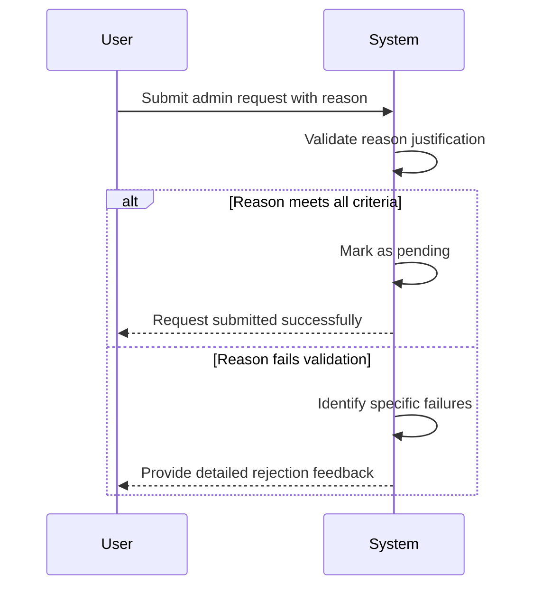
```mermaid
sequenceDiagram
    participant U as User
    participant S as System
    U->>S: Submit admin request with reason
    S->>S: Validate reason justification
    alt Reason meets all criteria
        S->>S: Mark as pending
        S-->>U: Request submitted successfully
    else Reason fails validation
        S->>S: Identify specific failures
        S-->>U: Provide detailed rejection feedback
    end
```

### Submission Frequency and Duplicate Request Prevention

THE system SHALL enforce submission frequency limits and prevent duplicate requests according to the following business rules:

WHEN a user attempts to submit an administrator request, THE system SHALL:
1. Check for existing pending requests from the same user
2. Check the time elapsed since the user's last administrator request
3. Apply frequency-based submission limits

IF the user has an existing pending administrator request, THEN THE system SHALL reject the new request and inform the user that only one pending request is allowed at a time.

IF less than [MINIMUM_TIME_BETWEEN_REQUESTS] has elapsed since the user's last administrator request (regardless of status), THEN THE system SHALL reject the new request and indicate when the user can submit again.

WHERE a user's previous administrator request was rejected, THE system SHALL require the user to address the feedback provided before submitting a new request.

THE system SHALL track submission attempts and apply progressive waiting periods for users who repeatedly submit requests that fail validation.

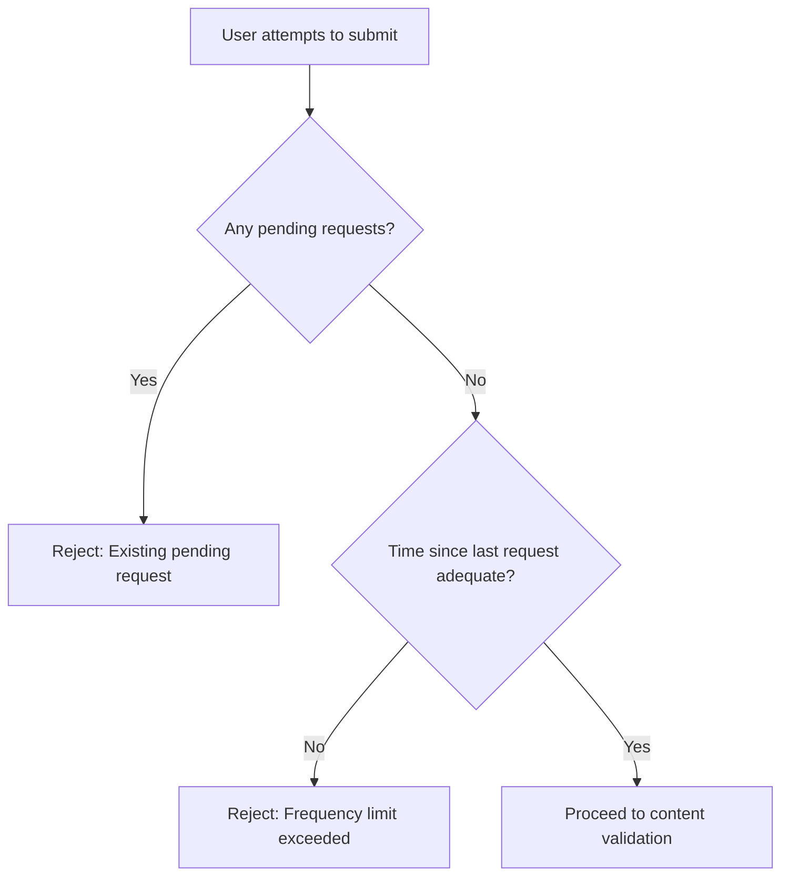
```mermaid
flowchart TD
    A["User attempts to submit"] --> B{"Any pending requests?"}
    B -->|Yes| C["Reject: Existing pending request"]
    B -->|No| D{"Time since last request adequate?"}
    D -->|No| E["Reject: Frequency limit exceeded"]
    D -->|Yes| F["Proceed to content validation"]
```

### Contribution Specificity and Responsibility Understanding

THE system SHALL validate that administrator requests demonstrate adequate understanding of responsibilities and specific contribution plans:

WHEN validating the reason text in an administrator request, THE system SHALL:
1. Verify that the request acknowledges key administrator responsibilities as defined in the platform guidelines
2. Require the user to articulate specific contributions they intend to make to community moderation
3. Ensure the request addresses how the user plans to maintain platform quality standards
4. Validate that the user demonstrates understanding of fair moderation practices

IF the request fails to address administrator responsibilities, THEN THE system SHALL reject the request and provide guidance about expected responsibility understanding.

IF the request lacks specific contribution plans, THEN THE system SHALL reject the request and prompt the user to outline concrete moderation activities.

WHERE a user describes contribution plans, THE system SHALL verify that the plans align with available administrator capabilities and platform needs.

THE system SHALL compare the user's stated contribution plans against their existing platform activity history to assess consistency and feasibility.

IF the user's contribution plans conflict with established platform policies or moderation guidelines, THEN THE system SHALL reject the request and explain the policy conflict.

# Data Browsing Expectations

Business expectations for how users browse, find, and navigate through lists of data.

## List Browsing Expectations

Define business expectations for how users find, filter, and browse lists.

### Filtering Expectations

### Filtering Expectations

WHEN users browse articles in a section, THE system SHALL allow filtering by tags.

WHEN users search articles, THE system SHALL allow filtering by tags in addition to title and content search.

THE system SHALL apply tag filters inclusively (articles must have ALL selected tags).

WHEN tag filtering is applied, THE system SHALL only return articles that have all the selected tags.

IF no articles match the selected tag filters, THE system SHALL return an empty list.

WHEN displaying filtered results, THE system SHALL indicate which tags were used for filtering.

WHEN users browse the list of users (in administrator views), THE system SHALL allow filtering by ban status.

WHEN users browse the list of administrator requests, THE system SHALL allow filtering by request status (pending, approved, rejected).

WHEN administrators view the list of articles, THE system SHALL allow filtering by section.

WHEN administrators view the list of articles, THE system SHALL allow filtering by author.

### Sorting Expectations

### Sorting Expectations

WHEN users browse articles in a section, THE system SHALL allow sorting by:
1. Newest first (default)
2. Oldest first

WHEN sorting by newest first, THE system SHALL display articles with the most recent creation time first.

WHEN sorting by oldest first, THE system SHALL display articles with the oldest creation time first.

WHEN users view comments on an article, THE system SHALL display comments sorted by oldest first.

WHEN sorting comments by oldest first, THE system SHALL display comments in chronological order from oldest to newest.

WHEN administrators browse the list of users, THE system SHALL allow sorting by:
1. Display name (alphabetical)
2. Registration date (newest first)
3. Last login date (newest first)

WHEN administrators browse the list of administrator requests, THE system SHALL default to sorting by:
1. Status (pending first, then approved, then rejected)
2. Within each status, by creation date (newest first)

WHEN users browse search results, THE system SHALL use the same sorting options as article lists in sections.

WHEN sorting changes are applied, THE system SHALL immediately reorder the displayed list according to the selected sort option.

### Pagination Expectations

### Pagination Expectations

WHEN users browse articles in a section, THE system SHALL paginate the results.

WHEN users search articles, THE system SHALL paginate the search results.

THE system SHALL display a consistent number of items per page.

WHEN a page contains the maximum number of items, THE system SHALL provide navigation to the next page.

WHEN on the first page, THE system SHALL not provide navigation to a previous page.

WHEN on the last page, THE system SHALL not provide navigation to a next page.

THE system SHALL display the current page number and total number of pages.

WHEN filtering is applied, THE system SHALL recalculate pagination based on the filtered results.

WHEN sorting is changed, THE system SHALL maintain the current pagination position when possible.

IF a user navigates to a page that no longer exists after filtering, THE system SHALL redirect to the last available page.

WHEN administrators browse the list of users, THE system SHALL paginate the results.

WHEN administrators browse the list of administrator requests, THE system SHALL paginate the results.

WHEN administrators browse the list of banned users, THE system SHALL paginate the results.

WHEN viewing paginated results, THE system SHALL indicate the total number of items across all pages.

WHEN viewing paginated results, THE system SHALL indicate which items are being displayed (e.g., "Showing 1-10 of 45").

# Error Conditions

Business error scenarios and how the system should respond.

## Error Scenarios

Describe error conditions and expected system responses in natural language.

### Authentication and Account Error Scenarios

### Authentication and Account Error Scenarios

**Account Registration Errors**

WHEN a user attempts to register with an email address, THE system SHALL:
1. Verify the email address is not already registered to another user
2. Ensure the password meets minimum complexity requirements

IF the email address is already registered, THE system SHALL reject the registration request and indicate the email is already in use.
IF the password does not meet complexity requirements, THE system SHALL reject the registration request and indicate password requirements are not met.

**Login Error Scenarios**

WHEN a user attempts to log in, THE system SHALL:
1. Verify the email address corresponds to an existing user account
2. Validate the provided password matches the stored credentials
3. Confirm the user account is not banned

IF the email address does not correspond to an existing account, THE system SHALL reject the login request.
IF the provided password does not match the stored credentials, THE system SHALL reject the login request.
IF the user account is banned, THE system SHALL reject the login request and indicate the account is suspended.

**Account Management Errors**

WHEN a user attempts to change their password, THE system SHALL:
1. Require the current password for verification
2. Ensure the new password meets complexity requirements
3. Prevent using the same password as the current one

IF the current password verification fails, THE system SHALL reject the password change request.
IF the new password does not meet complexity requirements, THE system SHALL reject the password change request.
IF the new password is identical to the current password, THE system SHALL reject the password change request.

WHEN a user attempts to delete their account, THE system SHALL:
1. Require password confirmation for the operation
2. Cascade delete all articles and comments created by the user

IF password confirmation fails, THE system SHALL reject the account deletion request.

### Content Creation and Modification Rejections

### Content Creation and Modification Rejections

**Article Creation and Editing Rejections**

WHEN a user creates an article, THE system SHALL:
1. Require a non-empty title
2. Require non-empty content
3. Require selection of an existing section

IF the title is empty or consists only of whitespace, THE system SHALL reject the article creation.
IF the content is empty or consists only of whitespace, THE system SHALL reject the article creation.
IF the selected section does not exist, THE system SHALL reject the article creation.

WHEN a user edits an article, THE system SHALL:
1. Verify the user is the author of the article (ownership required)
2. Ensure the article still exists (not deleted by another user or administrator)

IF the user is not the author of the article, THE system SHALL reject the edit request.
IF the article has been deleted, THE system SHALL reject the edit request and indicate the article no longer exists.

**Comment Creation and Editing Rejections**

WHEN a user creates a comment, THE system SHALL:
1. Require the target article exists and is accessible
2. Require non-empty comment content
3. Ensure the user is not banned

IF the target article does not exist or has been deleted, THE system SHALL reject the comment creation.
IF the comment content is empty or consists only of whitespace, THE system SHALL reject the comment creation.
IF the user is banned, THE system SHALL reject the comment creation.

WHEN a user edits a comment, THE system SHALL:
1. Verify the user is the author of the comment
2. Ensure the comment still exists (not deleted by another user or administrator)

IF the user is not the author of the comment, THE system SHALL reject the edit request.
IF the comment has been deleted, THE system SHALL reject the edit request and indicate the comment no longer exists.

**Attachment Management Rejections**

WHEN a user attaches files or images to an article, THE system SHALL:
1. Verify file types are supported (defined in File Validation and Policies)
2. Ensure file sizes are within allowed limits (defined in File Validation and Policies)
3. Limit the total number of attachments per article (defined in Attachment Validation Criteria)

IF a file type is not supported, THE system SHALL reject the attachment.
IF a file exceeds size limits, THE system SHALL reject the attachment.
IF the article already has the maximum allowed attachments, THE system SHALL reject the attachment.

### Authorization and Permission Failure Cases

### Authorization and Permission Failure Cases

**Content Ownership and Access Failures**

WHEN a user attempts to modify content they do not own, THE system SHALL:
1. Verify the user is either the content author or has administrative privileges
2. For administrators, verify they have appropriate authority level for the action

IF a regular user attempts to modify content they did not create, AND they are not an administrator, THE system SHALL reject the request due to ownership limitations.
IF a regular administrator attempts to modify content owned by a super administrator, THE system SHALL reject the request due to insufficient authority.

**Administrative Operation Failures**

WHEN an administrator attempts to perform administrative actions, THE system SHALL:
1. Verify the administrator has the required grade (regular vs super administrator)
2. For section management, verify the administrator has authority to create/edit/delete sections
3. For content moderation, verify the content exists and is accessible

IF a regular administrator attempts to promote or demote other administrators, THE system SHALL reject the request (super administrator privilege required).
IF an administrator attempts to demote themselves from super administrator status, THE system SHALL reject the request (self-demotion not allowed).
IF an administrator attempts to manage a section that does not exist, THE system SHALL reject the request.

**Ban Management Failures**

WHEN an administrator attempts to ban or unban a user, THE system SHALL:
1. Verify the target user exists in the system
2. Ensure the administrator has authority to perform user management actions
3. Prevent banning administrators of equal or higher authority

IF the target user does not exist, THE system SHALL reject the ban/unban request.
IF a regular administrator attempts to ban a super administrator, THE system SHALL reject the request due to insufficient authority.
IF an administrator attempts to ban themselves, THE system SHALL reject the request (self-banning not allowed).

**Admin Request Processing Failures**

WHEN a super administrator processes admin requests, THE system SHALL:
1. Verify the request exists and is in pending status
2. Ensure the requesting user is not already an administrator

IF the admin request does not exist or has already been processed, THE system SHALL reject the processing attempt.
IF the requesting user is already an administrator, THE system SHALL reject the request approval.

### Data and State Exception Handling

### Data and State Exception Handling

**Concurrent Modification Exceptions**

WHEN multiple users attempt to modify the same content simultaneously, THE system SHALL:
1. Detect when content has been modified since the user last viewed it
2. Prevent overwriting of changes made by another user

IF an article has been modified by another user since the current user last viewed it, THE system SHALL reject the edit request and indicate the content has changed.
IF a comment has been modified by another user since the current user last viewed it, THE system SHALL reject the edit request and indicate the content has changed.

**Data Integrity Exceptions**

WHEN performing operations that involve cascading deletions, THE system SHALL:
1. Verify all related data can be properly handled
2. Roll back transactions if any part of the cascade fails

IF the system cannot delete all user articles and comments during account deletion, THE system SHALL abort the account deletion and restore any partially deleted data.
IF the system cannot delete all article comments during article deletion, THE system SHALL abort the article deletion and restore any partially deleted data.

**Invalid State Transition Exceptions**

WHEN processing admin requests, THE system SHALL:
1. Allow status transitions only from "pending" to either "approved" or "rejected"
2. Prevent re-processing of already processed requests

IF an attempt is made to change an admin request status from "approved" or "rejected" back to "pending", THE system SHALL reject the status change.
IF an attempt is made to approve an already rejected request, THE system SHALL reject the operation.

**Search and Filter Exception Conditions**

WHEN users search or filter articles, THE system SHALL:
1. Handle empty result sets gracefully
2. Validate search parameters before executing queries

IF no articles match the search criteria, THE system SHALL return an empty result set rather than an error.
IF search parameters are malformed or invalid, THE system SHALL reject the search request with an appropriate validation message.

**Pagination Boundary Exceptions**

WHEN users browse paginated lists, THE system SHALL:
1. Validate page numbers are within valid ranges
2. Handle requests for non-existent pages gracefully

IF a user requests a page number beyond the available pages, THE system SHALL return the last available page.
IF a user requests a page number less than 1, THE system SHALL return the first page.

# File Validation Rules

Validation rules and policies for file uploads and storage.

## File Validation and Policies

Define file type restrictions, virus scanning requirements, content validation, and retention policies for uploaded files.

### File Validation Requirements

### File Validation Requirements

WHEN a user attaches a file to an article, THE system SHALL:
1. Validate the file size does not exceed 10MB
2. Validate the filename contains only alphanumeric characters, hyphens, underscores, and periods
3. Validate the filename length is between 1 and 255 characters
4. Ensure the filename extension matches the actual file content type

IF a file exceeds the 10MB size limit, THE system SHALL reject the upload with an error message.
IF a filename contains invalid characters, THE system SHALL reject the upload with a descriptive error.
IF a filename length exceeds 255 characters, THE system SHALL truncate or reject the upload.

### Multiple File Handling

WHEN attaching multiple files to a single article, THE system SHALL:
1. Limit the total number of attachments per article to 5
2. Process each file independently through validation
3. Reject the entire upload if any single file fails validation

WHERE a user attempts to upload more than 5 attachments, THE system SHALL reject the additional files.
WHILE processing multiple file uploads, THE system SHALL maintain file integrity for each successful upload.

### Error Conditions

THE system SHALL reject file uploads when:
1. The file contains no data (empty file)
2. The file appears to be corrupted or incomplete
3. The file type cannot be determined

```mermaid
flowchart LR
    A["File Upload Request"] --> B["Size Validation"]
    B --> C["Filename Validation"]
    C --> D["Content Type Validation"]
    D --> E["Multiple File Check"]
    E --> F["Complete
    Successfully"]
    
    B --"Exceeds limit"--> G["Reject with
    size error"]
    C --"Invalid name"--> H["Reject with
    name error"]
    D --"Invalid type"--> I["Reject with
    type error"]
    E --"Exceeds count"--> J["Reject with
    count error"]

### Virus Scanning Requirements

### Virus Scanning Requirements

WHEN any file is uploaded to the system, THE system SHALL:
1. Automatically scan the file for malware and viruses
2. Quarantine files detected as malicious
3. Log scan results with detailed information
4. Notify system administrators of malware detection

IF a file is detected as malicious during scanning, THE system SHALL:
1. Immediately reject the upload
2. Store the file in a secure quarantine area
3. Generate an audit log entry with detection details
4. Display a generic error message to the user

WHERE a virus scan timeout occurs, THE system SHALL:
1. Retry the scan up to 2 additional times
2. Reject the upload if all scan attempts timeout
3. Log the timeout event for administrative review

### Scan Process Flow

```mermaid
sequenceDiagram
    participant U as User
    participant S as System
    participant VS as Virus Scanner
    participant L as Audit Log
    
    U->>S: Upload File
    S->>VS: Scan for malware
    VS-->>S: Scan Result
    
    alt Clean File
        S->>L: Log successful scan
        S-->>U: Upload successful
    else Malicious File
        S->>S: Quarantine file
        S->>L: Log malware detection
        S-->>U: Generic rejection message
    else Scan Timeout
        S->>VS: Retry scan
        VS-->>S: Timeout again
        S->>L: Log scan timeout
        S-->>U: Upload rejected
    end

WHILE scanning is in progress, THE system SHALL prevent access to the uploaded file.
THE system SHALL maintain a record of all scan outcomes for 90 days.

### Quarantine Management

WHEN a file is quarantined, THE system SHALL:
1. Store it in an isolated, secure location
2. Retain it for 30 days for forensic analysis
3. Prevent any user or system access to the file
4. Automatically purge after the retention period

IF administrators need to analyze a quarantined file, THE system SHALL provide secure, audited access through administrative interfaces only.

### Content Type Restrictions

### Content Type Restrictions

THE system SHALL accept files of the following MIME types:
1. Images: image/jpeg, image/png, image/gif, image/bmp, image/webp
2. Documents: application/pdf, text/plain, text/markdown
3. Office documents: application/msword, application/vnd.openxmlformats-officedocument.wordprocessingml.document
4. Spreadsheets: application/vnd.ms-excel, application/vnd.openxmlformats-officedocument.spreadsheetml.sheet
5. Presentations: application/vnd.ms-powerpoint, application/vnd.openxmlformats-officedocument.presentationml.presentation

THE system SHALL reject files with the following MIME types:
1. Executables: application/x-executable, application/x-msdownload, application/x-dosexec
2. Scripts: application/x-javascript, application/x-php, application/x-python
3. Archive formats that may contain nested executables: application/x-7z-compressed, application/x-rar-compressed
4. System files: application/x-shockwave-flash, application/x-silverlight-app

### Content Type Validation Process

WHEN validating file content types, THE system SHALL:
1. Check both the declared MIME type (from upload header)
2. Analyze actual file contents using magic bytes/hex signatures
3. Reject files where declared type does not match actual content
4. Apply the most restrictive classification when multiple validations apply

IF a file's content cannot be reliably determined, THE system SHALL reject the upload.
WHERE a file extension suggests one type but content analysis suggests another, THE system SHALL trust content analysis results.

### Image-Specific Rules

WHEN uploading image files, THE system SHALL:
1. Validate that declared image dimensions match actual dimensions
2. Reject images exceeding 4096x4096 pixels
3. Process images larger than 1920x1080 pixels through resizing optimization
4. Strip EXIF metadata for privacy protection

```mermaid
flowchart TD
    A["File Upload"] --> B["MIME Type Check"]
    B --> C["Accepted type?"
    no reject]
    C --"Yes"--> D["Content Analysis"]
    D --> E["Type matches content?"
    no reject]
    E --"Yes"--> F["Image specific
    validations"]
    F --> G["OK to proceed"]
    
    F --"Too large"--> H["Queue for
    resizing"]
    H --> G
    
    subgraph "Image Processing"
        F
        H
    end

### Document-Specific Rules

WHEN uploading document files, THE system SHALL:
1. Validate PDF files are not password protected
2. Reject documents containing embedded macros or scripts
3. Limit text files to 1MB maximum size
4. Reject documents with abnormal compression ratios

THE system SHALL maintain an up-to-date list of allowed and prohibited content types, configurable by administrators.

### File Retention Policies

### File Retention Policies

THE system SHALL retain all uploaded files for the duration of their parent article's existence.

WHEN an article is deleted, THE system SHALL:
1. Delete all associated file attachments
2. Remove files from both primary and backup storage
3. Log the deletion with file metadata
4. Complete deletion within 24 hours of article deletion

### Storage Tiers

THE system SHALL implement the following storage tiers:
1. **Hot storage**: Files accessed within the last 30 days
2. **Warm storage**: Files not accessed for 31-180 days
3. **Cold storage**: Files not accessed for 181+ days

WHEN a file moves between storage tiers, THE system SHALL:
1. Maintain file accessibility at all times
2. Transparently handle retrieval latency differences
3. Update the file's storage location metadata
4. Not affect user access permissions or capabilities

### Automatic Cleanup

THE system SHALL automatically purge files when:
1. Their parent article has been deleted for more than 30 days
2. The file has been in cold storage for more than 1 year without access
3. Storage capacity reaches 95% utilization

IF storage capacity reaches 95% utilization, THE system SHALL:
1. Begin purging files from cold storage, oldest first
2. Notify administrators of storage issues
3. Continue normal operations while purging occurs
4. Resume normal retention policies when capacity drops below 85%

### Backup and Disaster Recovery

THE system SHALL:
1. Maintain daily backups of all uploaded files
2. Retain backups for 30 days
3. Store backups in geographically separate locations
4. Test backup restoration quarterly

```mermaid
flowchart LR
    A["File Uploaded"] --> B["Hot Storage
    <30 days access"]
    B --> C["Warm Storage
    31-180 days no access"]
    C --> D["Cold Storage
    181+ days no access"]
    D --> E["Automatic Purge
    After 1 year in cold"]
    
    B --"Accessed again"--> B
    C --"Accessed again"--> B
    D --"Accessed again"--> B
    
    F["Article Deleted"] --> G["File Marked for
    Deletion"]
    G --> H["Purged within
    24 hours"]

### Retention Exceptions

WHEN legal or administrative holds are placed on content, THE system SHALL:
1. Suspend normal retention policies for affected files
2. Maintain files indefinitely until holds are lifted
3. Log all hold actions with administrative details
4. Prevent automated deletion of held files

IF a file is under investigation, THE system SHALL:
1. Prevent its deletion regardless of retention policies
2. Create forensic copies if needed
3. Restrict access to authorized administrators only
4. Maintain for the duration of the investigation plus 90 days

### User-Requested Deletion

WHEN a user deletes their own article, THE system SHALL:
1. Immediately remove file access for all users
2. Process file deletion within the standard 24-hour window
3. Not allow file recovery by the original uploader
4. Allow administrative recovery for up to 7 days after deletion