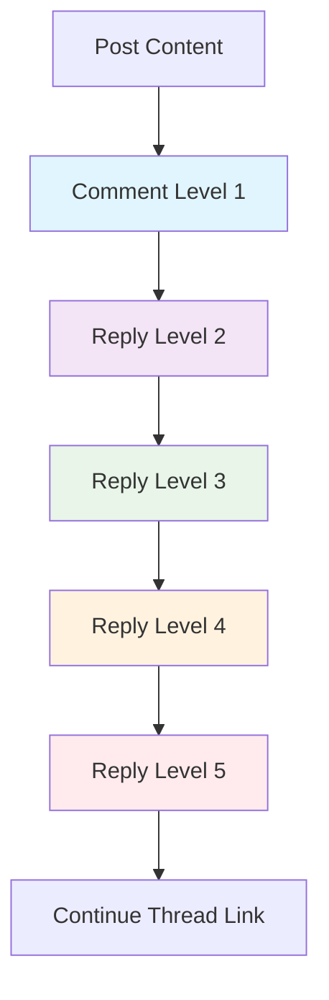

# Commenting System Requirements Specification

## Executive Summary

This document defines the business requirements for the commenting system of the economic/political discussion board. The commenting system enables structured discussions around posts, supporting threaded conversations, moderation workflows, and user engagement features while maintaining a simple, minimal design approach.

## Comment Creation Process

### Basic Comment Creation
WHEN a member views a post, THE system SHALL display a comment input field below the post content.

WHEN a member submits a comment, THE system SHALL validate the comment content meets minimum requirements:
- Comment text must be between 5 and 2,000 characters
- Comment must not contain prohibited content or spam
- User must be authenticated and have commenting permissions

THE comment input field SHALL support basic text formatting including paragraphs and line breaks.

### Comment Validation Rules
IF a comment contains fewer than 5 characters, THEN THE system SHALL reject the submission and display an appropriate error message.

IF a comment exceeds 2,000 characters, THEN THE system SHALL truncate the content and warn the user before submission.

WHILE a comment is being submitted, THE system SHALL display a loading indicator and prevent duplicate submissions.

### Comment Visibility and Display
THE newly created comment SHALL appear immediately in the discussion thread after successful validation.

THE comment author SHALL be clearly identified with their username and profile link.

THE comment timestamp SHALL display the exact time of submission in the user's local timezone.

## Threaded Discussion Requirements

### Nested Comment Structure
WHERE a comment receives replies, THE system SHALL display replies in a nested, indented format.

THE nesting level SHALL support up to 5 levels of replies to maintain readability.

IF a comment thread exceeds 5 nesting levels, THEN THE system SHALL provide a "Continue this thread" link to prevent visual clutter.

### Discussion Organization
THE comments SHALL be displayed in chronological order, oldest first by default.

THE system SHALL provide options to sort comments by "newest first" or "most popular."

WHERE "most popular" sorting is selected, THE system SHALL prioritize comments with the most replies and engagement.

### Comment Thread Navigation
THE system SHALL provide visual indicators for nested comment levels using indentation and connecting lines.

USERS SHALL be able to collapse and expand comment threads for better readability.

THE system SHALL maintain the collapsed/expanded state during the user's session.

## Comment Moderation

### Automated Moderation
THE system SHALL automatically flag comments containing prohibited keywords for moderator review.

IF a comment contains offensive language, THEN THE system SHALL place it in a pending state until moderator approval.

WHERE a user has a history of inappropriate comments, THE system SHALL require moderator approval for all their comments.

### Moderator Actions
WHEN a moderator reviews a flagged comment, THE system SHALL provide approve, reject, or edit options.

IF a moderator approves a comment, THEN THE comment SHALL become visible to all users immediately.

IF a moderator rejects a comment, THEN THE comment SHALL be permanently deleted with a notification to the author.

### User Reporting System
WHEN a user reports a comment, THE system SHALL log the report and notify moderators.

THE reporting user SHALL be able to select from predefined reporting reasons:
- Spam or irrelevant content
- Harassment or personal attacks
- False information
- Off-topic discussion
- Copyright violation

WHERE a comment receives multiple reports, THE system SHALL prioritize it for moderator review.

## Reply and Notification System

### Reply Functionality
WHEN a user replies to a comment, THE system SHALL notify the original comment author.

THE reply notification SHALL include:
- The reply content (first 100 characters)
- Link to the discussion thread
- Name of the user who replied
- Timestamp of the reply

USERS SHALL be able to disable reply notifications in their account settings.

### Mention System
WHERE a user mentions another user using @username syntax, THE system SHALL notify the mentioned user.

THE mention notification SHALL include the context of the mention and a link to the comment.

IF the mentioned user does not exist, THEN THE system SHALL display an error message and suggest valid usernames.

### Notification Management
THE system SHALL maintain a notification center for each user with the following capabilities:
- View all recent notifications
- Mark notifications as read
- Clear all notifications
- Filter notifications by type (replies, mentions, moderation)

THE notification badge SHALL display the count of unread notifications prominently.

## Comment Editing and Deletion

### Comment Editing
WHEN a member edits their own comment, THE system SHALL preserve the original content with an "edited" indicator.

THE edit history SHALL be available to moderators for review purposes.

USERS SHALL be able to edit their comments within 60 minutes of posting.

### Comment Deletion
WHEN a member deletes their own comment, THE system SHALL remove the comment content but preserve the thread structure.

THE deleted comment SHALL display "[deleted]" placeholder text.

MODERATORS SHALL be able to permanently delete any comment without preserving the placeholder.

### Bulk Operations
MODERATORS SHALL be able to select multiple comments for batch approval, rejection, or deletion.

THE bulk operation interface SHALL provide preview of selected comments before confirmation.

WHERE bulk operations affect many comments, THE system SHALL provide progress indication.

## Performance Requirements

### Response Time Standards
WHEN loading comments for a post with up to 100 comments, THE system SHALL display them within 2 seconds.

WHEN submitting a new comment, THE system SHALL process and display it within 1 second.

WHEN expanding/collapsing comment threads, THE system SHALL respond instantly without noticeable delay.

### Scalability Expectations
THE commenting system SHALL support discussions with up to 1,000 comments per post.

WHERE a discussion exceeds 200 comments, THE system SHALL implement pagination or infinite scrolling.

THE system SHALL maintain performance during peak usage with multiple simultaneous comment submissions.

## Error Handling

### User-Facing Errors
IF network connectivity is lost during comment submission, THEN THE system SHALL save the comment locally and retry when connection is restored.

IF comment submission fails due to server error, THEN THE system SHALL display a friendly error message and allow retry.

WHERE a comment cannot be posted due to permission issues, THE system SHALL explain the reason clearly.

### Recovery Processes
WHEN a comment fails to submit, THE system SHALL preserve the draft content.

USERS SHALL be able to recover unsaved comments from their draft history.

THE system SHALL automatically save comment drafts every 30 seconds during composition.

## Business Rules and Validation

### Content Guidelines
COMMENTS SHALL adhere to the platform's content policy regarding economic and political discussions.

THE system SHALL prohibit personal attacks, hate speech, and misinformation in comments.

WHERE comments contain external links, THE system SHALL scan them for security risks.

### User Engagement Limits
TO prevent spam, THE system SHALL limit users to 10 comments per hour.

NEW users SHALL have a lower comment limit of 5 comments per hour until they establish trust.

MODERATORS SHALL be exempt from comment rate limits.

### Quality Assurance
THE system SHALL encourage constructive discussions through positive reinforcement features.

USERS SHALL be able to "like" comments to indicate agreement or appreciation.

COMMENTS with high engagement SHALL receive higher visibility in the discussion thread.

## Integration Requirements

### Post Integration
THE commenting system SHALL seamlessly integrate with the post management system.

WHEN a post is deleted, THE system SHALL preserve the discussion thread in a read-only state.

WHERE a post is moved to a different category, THE comments SHALL move with it.

### User Profile Integration
COMMENT activity SHALL be reflected in user profiles and activity history.

USERS SHALL be able to view their comment history from their profile.

THE system SHALL display comment statistics (total comments, likes received) in user profiles.

### Authentication Integration
THE commenting system SHALL verify user authentication before allowing comment submission.

WHERE users are not authenticated, THE system SHALL display a prompt to log in or register.

THE system SHALL respect user permission levels when displaying comment management options.

## Accessibility Requirements

### Screen Reader Support
THE commenting interface SHALL be fully accessible to screen readers.

NESTED comment levels SHALL be announced clearly to visually impaired users.

KEYBOARD navigation SHALL allow users to navigate through comment threads without a mouse.

### Mobile Responsiveness
THE commenting system SHALL provide an optimal experience on mobile devices.

TOUCH targets for reply and like buttons SHALL be appropriately sized for mobile interaction.

THE comment input field SHALL adapt to different screen sizes and orientations.

## Success Metrics

### User Engagement Indicators
- Average comment length: >50 characters indicating substantive contributions
- Reply-to-comment ratio: >1:1 indicating active discussions
- User retention: >60% of commenters returning within 7 days
- Moderation rate: <2% of comments requiring moderator intervention

### Performance Benchmarks
- Comment submission success rate: >99%
- Average comment load time: <2 seconds
- Notification delivery rate: >95%
- System uptime for commenting features: >99.5%

### Quality Metrics
- User satisfaction with commenting experience: >4.0/5.0
- Reduction in reported comments over time
- Increase in constructive discussion threads
- Improvement in comment quality scores

## Implementation Guidelines

All commenting system features must align with the platform's minimal design philosophy:
- Keep the interface simple and intuitive
- Avoid unnecessary complexity in comment management
- Prioritize performance over feature richness
- Maintain focus on economic/political discussion quality

> *Developer Note: This document defines **business requirements only**. All technical implementations (architecture, APIs, database design, etc.) are at the discretion of the development team.*