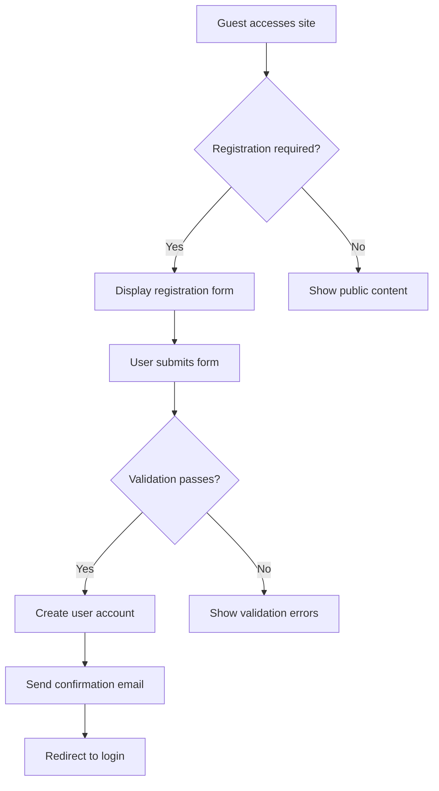
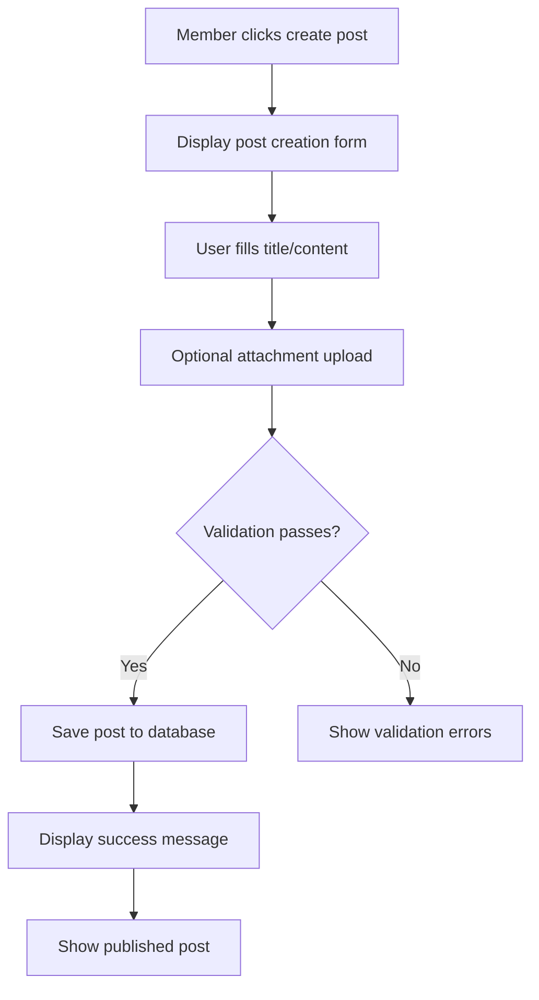
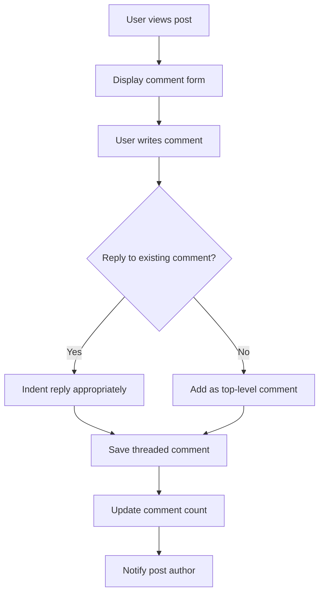

# Functional Requirements Specification - Economic/Political Discussion Board

## Introduction

This document defines the complete functional requirements for a simple economic/political discussion board platform. The system enables users to engage in discussions through posts and comments, with support for image and file attachments. All requirements are written using EARS (Easy Approach to Requirements Syntax) format to ensure clarity and testability.

## Post Management Requirements

### Post Creation
WHEN a member creates a new post, THE system SHALL provide a form with title, content, and attachment fields.
WHEN a member submits a post creation form, THE system SHALL validate that the title contains between 5 and 200 characters.
WHEN a member submits a post creation form, THE system SHALL validate that the content contains between 50 and 10,000 characters.
WHEN a member successfully creates a post, THE system SHALL display the post in the discussion board with creation timestamp.

### Post Viewing
THE system SHALL display posts in chronological order, newest first.
WHEN a guest views the discussion board, THE system SHALL display all public posts without requiring authentication.
WHEN a user views an individual post, THE system SHALL display the full content, author information, creation date, and attached files.

### Post Editing and Deletion
WHEN a member attempts to edit their own post, THE system SHALL allow editing within 24 hours of creation.
WHEN a member edits their post, THE system SHALL preserve the original content history.
WHEN a member deletes their post, THE system SHALL remove the post from public view but retain it in the database for moderation purposes.

### Post Status Management
WHILE a post is in "draft" status, THE system SHALL not display it to other users.
WHEN a member publishes a draft post, THE system SHALL change its status to "published" and make it visible to all users.

## Comment System Requirements

### Comment Creation
WHEN a member views a published post, THE system SHALL display a comment submission form.
WHEN a member submits a comment, THE system SHALL validate that the comment contains between 1 and 2,000 characters.
WHEN a member successfully posts a comment, THE system SHALL display the comment immediately below the post.

### Comment Threading
THE system SHALL display comments in chronological order under each post.
WHEN a member replies to another comment, THE system SHALL indent the reply to indicate threading.
WHEN viewing comment threads, THE system SHALL limit nesting to 3 levels deep.

### Comment Management
WHEN a member edits their comment, THE system SHALL allow editing within 1 hour of posting.
WHEN a member deletes their comment, THE system SHALL remove it from public view.
WHEN a moderator deletes a comment, THE system SHALL notify the comment author with reason for deletion.

## Attachment Handling

### File Upload Requirements
WHEN a member creates or edits a post, THE system SHALL provide an attachment upload interface.
WHEN a member uploads an attachment, THE system SHALL validate the file type against allowed formats.
THE system SHALL accept image files in JPEG, PNG, and GIF formats up to 5MB each.
THE system SHALL accept document files in PDF, DOC, DOCX formats up to 10MB each.

### Attachment Management
WHEN a post contains attachments, THE system SHALL display thumbnail previews for images.
WHEN a user views an attachment, THE system SHALL provide download functionality.
WHEN a member removes an attachment from a post, THE system SHALL delete the file from storage.

### Attachment Security
IF an uploaded file exceeds size limits, THEN THE system SHALL reject the upload and display an error message.
IF an uploaded file type is not allowed, THEN THE system SHALL reject the upload and display supported formats.
WHEN processing uploaded files, THE system SHALL scan for malware before making them available for download.

## Search and Discovery

### Content Search
WHEN a user searches for content, THE system SHALL provide a search interface with keyword input.
WHEN a user performs a search, THE system SHALL return matching posts and comments within 2 seconds.
THE system SHALL search post titles, content, and comment text for keyword matches.

### Content Filtering
WHEN browsing the discussion board, THE system SHALL provide filtering by date range.
WHEN browsing the discussion board, THE system SHALL provide filtering by post popularity (comment count).
WHEN a user applies filters, THE system SHALL update the content display within 1 second.

### Content Organization
THE system SHALL organize posts into categories: "Economics" and "Politics".
WHEN a member creates a post, THE system SHALL require selection of one primary category.
WHEN browsing by category, THE system SHALL display only posts belonging to that category.

## User Management

### User Registration
WHEN a guest attempts to register, THE system SHALL provide a registration form with email, username, and password fields.
WHEN a guest submits registration, THE system SHALL validate that the email format is correct.
WHEN a guest submits registration, THE system SHALL validate that the username is unique and contains 3-20 alphanumeric characters.
WHEN a guest submits registration, THE system SHALL validate that the password meets security requirements (8+ characters, mixed case, numbers).

### User Authentication
WHEN a registered user attempts to login, THE system SHALL verify credentials against stored values.
WHEN authentication succeeds, THE system SHALL create a session valid for 30 days.
WHEN authentication fails, THE system SHALL increment failed login attempts and lock the account after 5 consecutive failures.

### User Profiles
WHEN a member views their profile, THE system SHALL display their post history, comment history, and join date.
WHEN a member edits their profile, THE system SHALL allow updates to display name and bio information.
WHEN a member updates their email address, THE system SHALL require email verification before applying the change.

## Moderation Features

### Content Moderation
WHEN a moderator views the moderation dashboard, THE system SHALL display recently reported content.
WHEN a moderator approves reported content, THE system SHALL remove the report and keep the content visible.
WHEN a moderator removes reported content, THE system SHALL move it to a moderation queue and notify the author.

### User Reporting
WHEN a member views inappropriate content, THE system SHALL provide a "Report" button.
WHEN a member reports content, THE system SHALL require selection of a reason from predefined categories.
WHEN content receives 3 separate reports, THE system SHALL automatically flag it for moderator review.

### Moderator Actions
WHEN a moderator suspends a user, THE system SHALL prevent the user from posting or commenting for the duration.
WHEN a moderator permanently bans a user, THE system SHALL remove all their content and prevent future access.
WHEN a moderator takes action, THE system SHALL log the action with timestamp and reason.

## System Integration Requirements

### Notification System
WHEN someone comments on a member's post, THE system SHALL send a notification to the post author.
WHEN a moderator takes action on a member's content, THE system SHALL notify the member with explanation.
WHEN system maintenance is scheduled, THE system SHALL notify all users 24 hours in advance.

### Performance Requirements
WHEN loading the discussion board homepage, THE system SHALL display content within 3 seconds.
WHEN performing searches, THE system SHALL return results within 2 seconds for common queries.
WHEN uploading attachments, THE system SHALL provide progress indication and complete within 30 seconds for average files.

### Error Handling
IF the system encounters a database error, THEN THE system SHALL display a user-friendly error message.
IF a user attempts to access content that doesn't exist, THEN THE system SHALL display a "not found" message.
IF the system is under maintenance, THEN THE system SHALL display a maintenance notification page.

## Success Criteria

### Post Management Success
- Members can create posts with titles and content meeting validation requirements
- Posts display correctly with timestamps and author information
- Editing and deletion functions work within specified time constraints

### Comment System Success
- Members can post comments on published posts
- Comment threading displays correctly up to 3 levels
- Comment editing and deletion functions work as specified

### Attachment Handling Success
- File uploads accept supported formats within size limits
- Attachments display correctly with previews and download options
- Security scanning prevents malicious file uploads

### Search and Discovery Success
- Search functionality returns relevant results within performance targets
- Category filtering correctly organizes content
- Date and popularity filters work as expected

### User Management Success
- Registration process validates all required fields
- Authentication system securely manages user sessions
- Profile management allows appropriate user information updates

### Moderation Success
- Reporting system correctly flags content for review
- Moderator actions apply appropriate restrictions
- Action logging maintains complete audit trails

## Business Process Flows

### User Registration Flow

### Post Creation Flow

### Comment Threading Flow

## Additional Business Requirements

### Content Moderation Workflow
WHEN a user reports content, THE system SHALL immediately hide the content from public view pending review.
WHEN a moderator reviews reported content, THE system SHALL provide options to approve, reject, or escalate the report.
WHEN content is approved after review, THE system SHALL restore it to public visibility and notify the reporter.
WHEN content is rejected after review, THE system SHALL permanently remove it and notify the content author.

### User Engagement Features
WHEN a member views a post, THE system SHALL track view count for popularity metrics.
WHEN a member likes a post, THE system SHALL increment the like counter and display engagement metrics.
WHEN a member bookmarks a post, THE system SHALL save it to their personal bookmark list for easy access.

### Content Archival Process
WHEN a post reaches 6 months of age, THE system SHALL automatically archive it to reduce database load.
WHEN archived content is accessed, THE system SHALL display a warning that the content is historical.
WHEN a member searches for content, THE system SHALL include archived posts in search results with appropriate labeling.

### Category Management
WHEN a moderator creates a new category, THE system SHALL require category name and description.
WHEN categories become inactive, THE system SHALL allow moderators to merge them with active categories.
WHEN browsing by category, THE system SHALL display category description and recent activity statistics.

### Attachment Processing Pipeline
WHEN an image attachment is uploaded, THE system SHALL automatically generate multiple resolution thumbnails.
WHEN a document attachment is uploaded, THE system SHALL extract metadata for search indexing.
WHEN attachments are viewed, THE system SHALL track download counts for popularity metrics.

## Security and Privacy Requirements

### Data Protection
THE system SHALL encrypt all user passwords using industry-standard hashing algorithms.
THE system SHALL implement rate limiting to prevent brute force attacks on authentication endpoints.
THE system SHALL sanitize all user-generated content to prevent cross-site scripting attacks.

### Privacy Controls
WHEN a user deletes their account, THE system SHALL anonymize their content while preserving discussion threads.
WHEN content contains personal information, THE system SHALL provide tools for moderators to redact sensitive data.
THE system SHALL comply with data retention policies and automatically purge old data according to configured schedules.

### Access Control
WHEN a user attempts to access moderation features, THE system SHALL verify moderator permissions.
WHEN content is marked as private, THE system SHALL restrict access to authorized users only.
WHEN API endpoints are accessed, THE system SHALL validate authentication tokens for each request.

> *Developer Note: This document defines **business requirements only**. All technical implementations (architecture, APIs, database design, etc.) are at the discretion of the development team.*