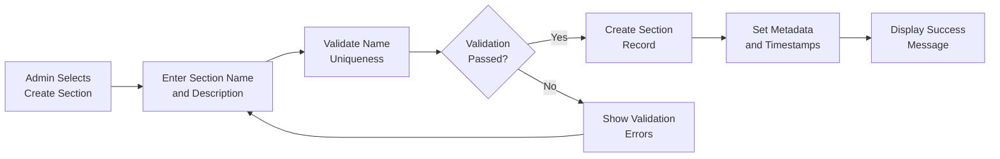

# Section Management Requirements Specification

## Document Overview
This document defines the comprehensive requirements for section management functionality within the Economic/Political Discussion Board system. Sections provide the organizational structure for categorizing articles and discussions across economic and political topics.

## Section Structure

### Section Data Model
Each section in the system MUST contain the following required fields:

**WHEN creating a new section, THE system SHALL require and validate the following fields:**
- **Name**: Unique identifier for the section (e.g., "Politics", "Economy", "Current Affairs"), minimum 3 characters, maximum 50 characters
- **Description**: Brief explanation of the section's purpose and scope, minimum 10 characters, maximum 200 characters
- **Creation Date**: Timestamp when the section was created (system-generated)
- **Created By**: Administrator who created the section (system-recorded)
- **Active Status**: Boolean indicating whether the section is available for use (default: true)

### Section Metadata
The system SHALL maintain the following metadata for each section:
- **Article Count**: Number of articles currently in the section (automatically updated)
- **Last Activity**: Timestamp of the most recent article or comment in the section (automatically updated)
- **Moderation Status**: Indicator if section requires special moderation attention (administrator-set)

The system SHALL automatically maintain and update these metadata fields in real-time.

## Section Creation and Management

### Administrator-Only Creation
**WHEN an administrator attempts to create a new section, THE system SHALL present a creation form with validation rules:**
- Section name field with real-time uniqueness validation
- Section description field with character count validation
- Required field indicators for name and description
- Instant validation feedback during input

**WHEN an administrator submits a valid section creation form, THE system SHALL:**
- Validate name uniqueness across all active sections
- Create the new section with the provided information
- Set creation timestamp automatically
- Set creator information based on authenticated administrator
- Set section to active status by default
- Update the global section list immediately
- Display success confirmation to the administrator

### Section Editing Requirements
**WHEN an administrator selects an existing section for editing, THE system SHALL:**
- Display the current section information in an editable form
- Allow modification of section name and description fields
- Validate name uniqueness during editing process
- Prevent editing of creation date and creator information
- Show edit history if available

**WHEN an administrator saves section edits, THE system SHALL:**
- Validate all modified fields against business rules
- Update the section with new information
- Preserve all existing articles and comments in the section
- Maintain section continuity for all users
- Log the edit action for audit purposes

### Section Deletion Process
**WHEN an administrator attempts to delete a section, THE system SHALL:**
- Display confirmation dialog showing section information and statistics
- Warn about the impact on existing articles and comments
- Show the number of articles that will be affected
- Require explicit confirmation before proceeding
- Offer migration options for existing content

**WHERE section deletion is confirmed, THE system SHALL:**
- Remove the section from the active section listing
- Preserve all existing articles and comments with section reference
- Mark articles as belonging to a "deleted section" category
- Prevent new articles from being created in the deleted section
- Update administrative audit logs with deletion details

## Section Browsing and Navigation

### Section List Display Requirements
**THE system SHALL provide a comprehensive section browsing interface that displays:**
- Section name with proper formatting
- Section description with truncation for long text
- Article count with visual indicators for activity level
- Last activity timestamp formatted for readability
- Visual cues indicating section popularity and usage

**WHEN a user accesses the discussion board, THE system SHALL:**
- Display available sections in logical order (alphabetical by default)
- Show only active sections available for user browsing
- Provide clear navigation between sections with breadcrumb support
- Indicate sections with new activity since user's last visit
- Allow administrators to customize section display order

### Section Content Browsing
**WHEN a user selects a specific section, THE system SHALL:**
- Display the section header with name and full description
- Show the article listing filtered exclusively to that section
- Maintain section context throughout the browsing session
- Provide breadcrumb navigation back to section list
- Display section statistics and activity indicators
- Show administrator controls if user has appropriate permissions

## Permission Matrix

### Section Management Permissions
| Action | Regular User | Administrator | Super Administrator |
|--------|--------------|---------------|---------------------|
| View section list | ✅ | ✅ | ✅ |
| Browse section content | ✅ | ✅ | ✅ |
| Create new section | ❌ | ✅ | ✅ |
| Edit section information | ❌ | ✅ | ✅ |
| Delete section | ❌ | ✅ | ✅ |
| View section statistics | ❌ | ✅ | ✅ |
| Modify section order | ❌ | ❌ | ✅ |

### Integration with Article System
**THE section management system SHALL integrate seamlessly with the article management system:**

**Article Creation Integration:**
**WHEN a user creates a new article, THE system SHALL:**
- Require selection of exactly one section from available options
- Validate that the selected section exists and is active
- Associate the article with the selected section
- Update section statistics (article count, last activity) immediately
- Display section context during article creation process

**Article Browsing Integration:**
**THE system SHALL provide section-based filtering for:**
- Article listing views with section-specific pagination
- Search results categorized by section
- User profile content displays organized by section
- Administrator content management with section filtering

## Business Rules and Validation

### Section Naming Rules
**THE system SHALL enforce the following naming constraints:**
- **WHEN creating or editing a section name, THE name MUST be unique across the entire platform**
- **SECTION names MUST contain only alphanumeric characters, spaces, and hyphens**
- **WHERE special characters are attempted, THE system SHALL reject the input**
- **SECTION names MUST be between 3 and 50 characters in length**
- **IF a section name contains offensive or inappropriate language, THEN THE system SHALL reject it**

### Section Description Requirements
**WHEN creating or editing section descriptions, THE system SHALL:**
- Require descriptions between 10 and 200 characters
- Allow standard punctuation and basic formatting
- Validate for appropriate content and professional language
- Provide character count feedback during input
- Support line breaks and paragraph separation

### Section Status Management
**THE system SHALL maintain section status with automated workflows:**
- **WHEN a new section is created, THE system SHALL set it to active status immediately**
- **ONLY administrators can deactivate sections through administrative interface**
- **WHEN a section is deactivated, THE system SHALL remove it from user browsing interfaces**
- **ARTICLES in deactivated sections SHALL remain accessible via direct links and search**
- **SECTION reactivation SHALL restore full functionality and visibility**

### Section Statistics Maintenance
**THE system SHALL automatically update section statistics through real-time triggers:**
- **ARTICLE count SHALL increment immediately when new articles are created in the section**
- **ARTICLE count SHALL decrement when articles are deleted or moved from the section**
- **LAST activity timestamp SHALL update on new articles or comments within the section**
- **STATISTICS SHALL be updated in real-time without requiring manual refresh**
- **ADMINISTRATORS SHALL have access to detailed section analytics and usage patterns**

## Error Handling and Edge Cases

### Section Creation Failures
**IF section creation fails due to validation errors, THE system SHALL:**
- Display specific error messages indicating exactly which validation rule failed
- Preserve all user-entered data in the form for easy correction
- Provide actionable guidance for resolving each specific error
- Allow immediate correction and resubmission without losing context

### Section Deletion Protection
**THE system SHALL prevent section deletion in critical scenarios:**
- **IF the section contains any active articles, THEN THE system SHALL require content migration before deletion**
- **WHERE the section is currently being viewed by users, THE system SHALL prevent disruptive deletion**
- **IF administrative permissions are insufficient for section deletion, THEN THE system SHALL deny the action**
- **WHEN system integrity would be compromised, THE system SHALL protect against deletion**

### Section Access Errors
**WHEN a user attempts to access a non-existent section, THE system SHALL:**
- Display a user-friendly error message explaining the situation
- Redirect to the main section listing with appropriate navigation
- Log the access attempt for administrative review and monitoring
- Provide suggestions for similar or alternative sections

## Performance Requirements

### Section List Loading
**THE system SHALL load the complete section list within 2 seconds under normal load conditions.**

### Section Content Display
**WHEN browsing section content, THE system SHALL display articles within 3 seconds of section selection.**

### Administrative Operations
**SECTION creation, editing, and deletion operations SHALL complete within 5 seconds with proper user feedback.**

## Integration Requirements

### User Profile Integration
**THE system SHALL integrate section information into user profiles through:**
- Displaying section-specific article counts in user profiles
- Providing links to browse user's articles organized by section
- Showing section participation statistics and activity patterns
- Enabling users to see their contribution distribution across sections

### Search System Integration
**THE search functionality SHALL support comprehensive section-based filtering:**
- Users SHALL be able to search within specific sections only
- Search results SHALL clearly indicate the section of each matching article
- Section filters SHALL be available in advanced search interfaces
- Combined search and section filtering SHALL provide precise content discovery

## Data Integrity Requirements

### Section Reference Integrity
**THE system SHALL maintain strict referential integrity for section-related data:**
- **ARTICLES MUST always reference valid, existing sections**
- **SECTION deletion SHALL preserve article references with appropriate archival handling**
- **DATABASE constraints SHALL prevent orphaned section references**
- **DATA migration procedures SHALL maintain consistency during section changes**

### Audit Trail and Compliance
**THE system SHALL maintain a complete audit trail for section management actions:**
- **ALL section creation, editing, and deletion events SHALL be logged with full details**
- **ADMINISTRATIVE actions SHALL include timestamp, administrator identification, and action type**
- **AUDIT logs SHALL be accessible to super administrators for compliance review**
- **DATA retention policies SHALL preserve section management history appropriately**

## Future Considerations

### Section Hierarchy Support
**THE system architecture SHALL allow for future implementation of advanced features:**
- **NESTED section hierarchies with parent-child relationships**
- **SECTION categorization and grouping for improved organization**
- **CROSS-section content relationships and recommendation systems**
- **MULTI-level section permissions for granular access control**

### Section Customization Capabilities
**Future enhancements MAY include comprehensive section customization:**
- **CUSTOM section themes and visual styling options**
- **SECTION-specific moderation rules and guidelines**
- **SECTION-level user permissions and contribution limits**
- **INTERSECTION content relationships and cross-posting capabilities**

This enhanced document provides complete specifications for section management functionality, ready for implementation by backend developers. All technical implementation decisions remain at the discretion of the development team based on these comprehensive business requirements.

> *Developer Note: This document defines business requirements only. All technical implementations (architecture, APIs, database design, etc.) are at the discretion of the development team.*