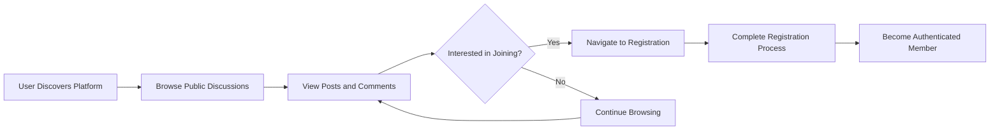
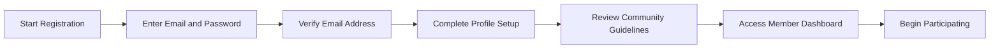
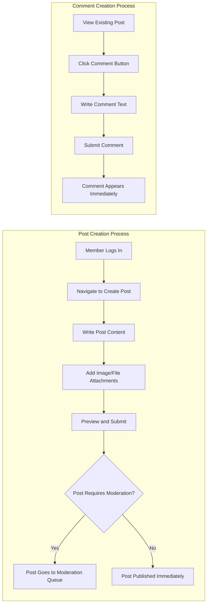
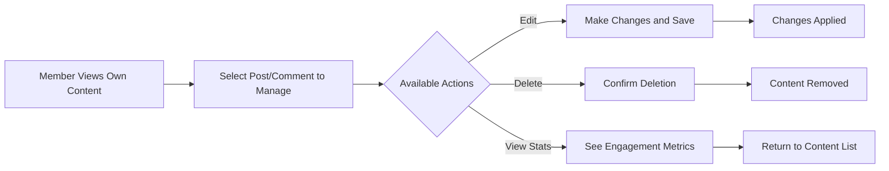
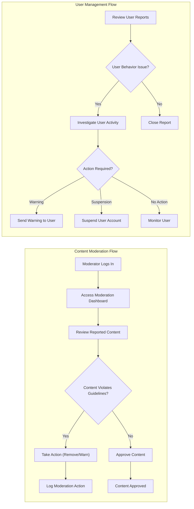
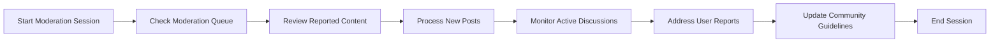
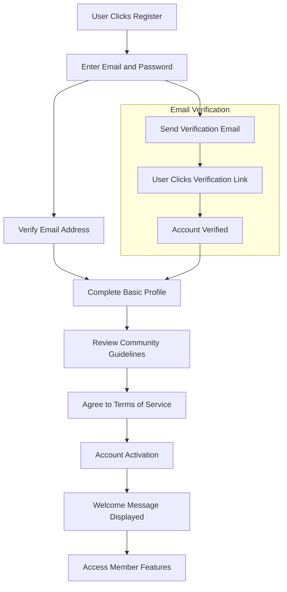
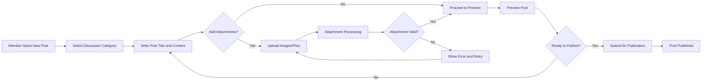
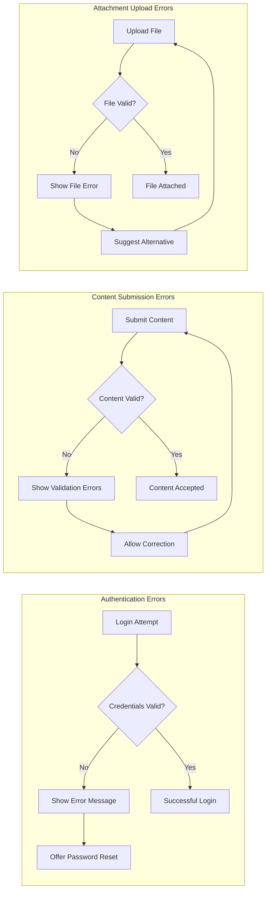

# User Journey Documentation for Economic/Political Discussion Board

## Introduction

This document outlines the complete user journeys and interaction flows for the economic/political discussion board platform. The focus is on mapping user experiences from initial discovery through content creation and moderation, ensuring a clear understanding of how different user types interact with the platform.

## Guest User Journey (Unauthenticated Users)

### Discovery and Browsing Flow

**Guest User Capabilities:**
- Browse public discussions and view content
- Read posts and comments without authentication
- Search for topics of interest
- View user profiles and activity (public information only)
- Access platform information and guidelines

**Limitations:**
- Cannot create posts or comments
- Cannot upload attachments
- Cannot participate in discussions
- Cannot access member-only features

**WHEN a guest user browses discussions, THE system SHALL display:**
- Recent posts in chronological order
- Discussion titles and preview content
- Author information and post timestamps
- Number of comments and engagement metrics

**IF a guest attempts to perform member-only actions, THEN THE system SHALL:**
- Display clear authentication prompts
- Provide direct paths to registration/login
- Preserve the intended action context

## Member User Journey (Authenticated Users)

### Registration and Onboarding Flow

**Registration Requirements:**
- WHEN a user registers, THE system SHALL require email verification
- THE system SHALL validate password strength (minimum 8 characters)
- WHERE registration fails, THE system SHALL provide specific error messages
- UPON successful registration, THE system SHALL redirect to member dashboard

### Content Creation Flow

**Member User Capabilities:**
- Create and publish discussion posts
- Add comments to existing discussions
- Upload image and file attachments to posts
- Edit own posts and comments (within time limits)
- Delete own content
- Report inappropriate content
- Participate in member-only discussions
- Update personal profile information

**WHEN a member creates content, THE system SHALL:**
- Validate content meets minimum length requirements
- Process attachments according to size and format limits
- Provide real-time feedback during content creation
- Save drafts automatically to prevent data loss

### Content Management Flow

**Content Management Requirements:**
- WHEN a member edits their content, THE system SHALL preserve edit history
- IF content deletion is requested, THEN THE system SHALL require confirmation
- WHERE engagement metrics are available, THE system SHALL display them clearly

## Moderator User Journey (Administrative Users)

### Moderation Workflow

**Moderator User Capabilities:**
- Review and approve/reject posts requiring moderation
- Remove inappropriate content
- Issue warnings to users violating guidelines
- Suspend or ban users for severe violations
- Access moderation logs and reports
- Manage content categories and tags
- Oversee community health and engagement

**WHEN a moderator takes action, THE system SHALL:**
- Log all moderation activities with timestamps
- Notify affected users with clear explanations
- Provide appeal mechanisms for contested actions
- Maintain audit trails for compliance purposes

### Daily Moderation Routine

**Moderation Performance Requirements:**
- WHEN content is reported, THE system SHALL queue it for moderator review within 1 hour
- IF urgent issues are identified, THEN THE system SHALL prioritize them in the queue
- WHERE moderation workload exceeds capacity, THE system SHALL alert administrators

## Registration and Onboarding Flow

### Complete User Registration Process

**Onboarding Requirements:**
- Email verification is mandatory
- Users must agree to community guidelines
- Basic profile information completion
- Welcome tutorial for new members
- Clear explanation of member privileges

**WHEN a user completes registration, THE system SHALL:**
- Send welcome email with platform overview
- Provide guided tour of key features
- Suggest initial actions to get started
- Introduce community guidelines and expectations

## Content Creation Detailed Flow

### Post Creation with Attachments

**Attachment Requirements:**
- Images: JPEG, PNG, GIF formats (max 5MB each)
- Documents: PDF, DOC, TXT formats (max 10MB each)
- Maximum 5 attachments per post
- File type validation and virus scanning
- Automatic image resizing for optimal display

**WHEN processing attachments, THE system SHALL:**
- Validate file types against allowed formats
- Check file sizes against maximum limits
- Scan for malware and security threats
- Generate previews for images and documents
- Provide upload progress feedback to users

## Error Handling and Recovery Scenarios

### Common User Error Flows

**Error Recovery Processes:**
- Clear, user-friendly error messages
- Specific guidance for correction
- Preservation of user input during errors
- Alternative suggestions when applicable
- Contact support options for persistent issues

**WHEN errors occur, THE system SHALL:**
- Provide specific, actionable error messages
- Preserve user input to minimize rework
- Suggest alternative approaches when possible
- Offer direct support contact for unresolved issues

### Authentication Error Scenarios

**Invalid Credentials:**
- WHEN login fails due to incorrect password, THE system SHALL show "Invalid credentials" message
- IF multiple failed attempts occur, THEN THE system SHALL implement temporary account lockout
- WHERE account recovery is needed, THE system SHALL provide password reset functionality

**Session Management Errors:**
- WHEN session expires during content creation, THE system SHALL save draft automatically
- IF authentication tokens become invalid, THEN THE system SHALL redirect to login page
- WHERE session conflicts occur, THE system SHALL resolve them transparently

### Content Creation Error Scenarios

**Validation Errors:**
- WHEN post title is missing, THE system SHALL highlight the required field
- IF content length exceeds limits, THEN THE system SHALL show character count
- WHERE attachment formats are invalid, THE system SHALL list supported types

**Network and System Errors:**
- WHEN network connection is lost, THE system SHALL attempt automatic reconnection
- IF server errors occur during submission, THEN THE system SHALL preserve draft content
- WHERE uploads fail due to size limits, THE system SHALL suggest compression options

## User Journey Success Metrics

**Key Performance Indicators:**
- Registration completion rate
- Time to first post creation
- Member engagement frequency
- Content moderation response time
- User satisfaction with platform experience

**WHEN measuring user journey success, THE system SHALL track:**
- User drop-off points in registration flow
- Content creation success rates by user type
- Error frequency and resolution effectiveness
- User satisfaction scores for key interactions

## Integration Points with Other Systems

This user journey documentation connects with:
- **User Actors Document**: Defines permission boundaries for each user type
- **Functional Requirements**: Provides context for feature implementation
- **Content Policy**: Guides moderation workflows and community standards enforcement

**WHEN implementing user journeys, THE development team SHALL ensure:**
- Seamless integration between authentication and content creation systems
- Consistent error handling across all user interactions
- Clear permission enforcement at each journey step
- Comprehensive logging for journey analysis and optimization

> *Developer Note: This document defines **business requirements only**. All technical implementations (architecture, APIs, database design, etc.) are at the discretion of the development team.*