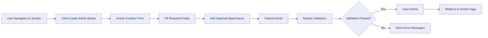

# Article Management Requirements Specification

## Executive Summary

This document specifies the complete requirements for article management within the Economic/Political Discussion Board platform. Articles serve as the primary content mechanism for user discussions, covering economic and political topics across various sections.

## Article Creation Process

### Article Creation Workflow

### Required Article Fields

**EARS Requirements for Article Creation:**

**WHEN** a user initiates article creation, **THE** system **SHALL** present a form with the following required fields:
- Title input field (maximum 200 characters)
- Content text area (minimum 50 characters, maximum 10,000 characters)
- Section selection dropdown

**WHEN** a user submits an article, **THE** system **SHALL** validate that:
- Title is not empty and contains at least 3 characters
- Content contains at least 50 characters
- A valid section is selected

**IF** any required field is missing or invalid, **THEN THE** system **SHALL** display specific error messages indicating which fields require correction.

## Content Requirements

### Title Specifications
- **Minimum length**: 3 characters
- **Maximum length**: 200 characters
- **Allowed characters**: Unicode characters including letters, numbers, spaces, and common punctuation
- **Validation rules**: Must not consist solely of whitespace characters

### Content Specifications
- **Minimum length**: 50 characters
- **Maximum length**: 10,000 characters
- **Format**: Plain text with basic formatting support (line breaks preserved)
- **Content filtering**: Basic profanity filtering for offensive language

### Section Assignment
- **WHEN** creating an article, **THE** user **SHALL** select exactly one section from available sections
- **THE** section selection **SHALL** be mandatory
- **WHERE** sections exist, **THE** system **SHALL** display all active sections in alphabetical order

## Attachment Handling

### File Attachment Requirements

**EARS Requirements for File Attachments:**

**WHEN** attaching files to articles, **THE** system **SHALL** support:
- Multiple file attachments per article
- Maximum file size: 10MB per file
- Maximum total attachment size: 50MB per article
- Supported file types: PDF, DOC, DOCX, TXT, ZIP

**WHEN** a user uploads a file, **THE** system **SHALL** validate:
- File size does not exceed 10MB
- File type is within allowed formats
- Total attachment size does not exceed 50MB

**IF** a file exceeds size limits or has invalid type, **THEN THE** system **SHALL** reject the upload and display appropriate error message.

### Image Attachment Requirements

**WHEN** attaching images to articles, **THE** system **SHALL** support:
- Multiple image attachments per article
- Maximum image size: 5MB per image
- Maximum total image size: 25MB per article
- Supported image types: JPG, JPEG, PNG, GIF
- Automatic image compression for large images
- Image preview generation for thumbnails

### Attachment Management

**WHEN** editing an article, **THE** user **SHALL** be able to:
- Add new attachments
- Remove existing attachments
- Replace existing attachments
- View attachment previews

**THE** system **SHALL** maintain attachment metadata including:
- Original filename
- File size
- Upload timestamp
- MIME type

## Tagging System

### Tag Creation and Management

**EARS Requirements for Article Tagging:**

**WHEN** creating or editing an article, **THE** user **SHALL** be able to:
- Add multiple free-text tags
- Each tag limited to 30 characters
- Maximum of 10 tags per article
- Tags are case-insensitive for matching

**WHEN** saving tags, **THE** system **SHALL**:
- Trim whitespace from tag text
- Convert tags to lowercase for consistency
- Remove duplicate tags
- Validate tag length and count limits

**IF** a user attempts to add more than 10 tags, **THEN THE** system **SHALL** display an error message indicating the tag limit.

### Tag Display and Organization

**THE** system **SHALL** display tags as clickable links that filter articles by tag
**WHERE** tags exist, **THE** system **SHALL** show the most popular tags across the platform

## Editing and Deletion

### Article Editing Capabilities

**EARS Requirements for Article Editing:**

**WHEN** a user edits their own article, **THE** system **SHALL** allow modification of:
- Article title
- Article content
- Section assignment
- Attachments (add/remove/replace)
- Tags (add/remove/modify)

**WHEN** an administrator edits any article, **THE** system **SHALL** allow the same modifications as the article owner.

**THE** system **SHALL** track edit history including:
- Timestamp of each edit
- User who made the edit
- Fields that were modified

### Article Deletion Process

**WHEN** a user deletes their own article, **THE** system **SHALL**:
- Remove the article from public view
- Delete all associated comments
- Remove all attached files and images
- Update article counts in user profiles

**WHEN** an administrator deletes an article, **THE** system **SHALL** perform the same actions as user deletion.

**IF** an article is deleted, **THEN THE** system **SHALL** notify the article owner (if different from the deleter).

## Article Display Requirements

### Single Article View

**WHEN** viewing a single article, **THE** system **SHALL** display:
- Article title
- Author information (display name with link to profile)
- Full article content with preserved formatting
- Section name with link to section
- Publication timestamp
- Last edit timestamp (if edited)
- All attached files with download links
- All attached images with previews
- All tags associated with the article
- Comment count

**THE** system **SHALL** format the content with:
- Preserved line breaks and paragraphs
- Basic text formatting (bold, italics if supported)
- Responsive layout for different screen sizes

### Attachment Display and Download

**WHEN** displaying attachments, **THE** system **SHALL**:
- Show file attachments as downloadable links with file type icons
- Display image attachments as embedded previews
- Provide original filename and file size information
- Ensure secure download links with proper access controls

**WHEN** a user downloads an attachment, **THE** system **SHALL**:
- Serve the file with correct MIME type
- Use the original filename for download
- Track download statistics
- Validate user permissions to access the attachment

## Permission and Access Control

### User Permissions Matrix

| Action | Regular User | Administrator | Super Administrator |
|--------|--------------|---------------|---------------------|
| Create article in any section | ✅ | ✅ | ✅ |
| Edit own articles | ✅ | ✅ | ✅ |
| Delete own articles | ✅ | ✅ | ✅ |
| Edit any article | ❌ | ✅ | ✅ |
| Delete any article | ❌ | ✅ | ✅ |
| Attach files/images | ✅ | ✅ | ✅ |
| Add/remove tags | ✅ | ✅ | ✅ |
| View article edit history | ❌ | ✅ | ✅ |

### Access Control Rules

**WHILE** a user is logged in, **THE** system **SHALL** allow article creation and management based on their permission level.

**IF** a user is banned, **THEN THE** system **SHALL** prevent them from creating or editing articles while allowing existing articles to remain visible.

**WHERE** section-specific permissions exist, **THE** system **SHALL** enforce section access rules.

## Performance Requirements

### Article Loading Performance

**THE** system **SHALL** load individual articles within 2 seconds under normal load conditions.

**WHEN** displaying articles with multiple images, **THE** system **SHALL** implement lazy loading for optimal performance.

**THE** system **SHALL** implement efficient pagination for article lists with response times under 1 second.

### Attachment Handling Performance

**WHEN** uploading attachments, **THE** system **SHALL** provide progress indicators for large files.

**THE** system **SHALL** process image compression asynchronously to avoid blocking the user interface.

## Error Handling and Validation

### Creation and Editing Errors

**IF** article creation fails due to validation errors, **THEN THE** system **SHALL**:
- Preserve user-entered data in the form
- Display specific error messages for each invalid field
- Provide clear instructions for correction

**IF** attachment upload fails, **THEN THE** system **SHALL**:
- Identify the specific reason (size, type, etc.)
- Allow retry or removal of problematic attachments
- Maintain other successfully uploaded attachments

### Access Control Errors

**IF** a user attempts to edit an article they don't own, **THEN THE** system **SHALL**:
- Display "Access Denied" message
- Log the unauthorized access attempt
- Redirect to appropriate page

## Business Rules and Constraints

### Content Moderation

**WHILE** an article exists in the system, **THE** administrators **SHALL** have authority to moderate content according to platform guidelines.

**IF** an article violates platform rules, **THEN THE** administrators **SHALL** be able to edit or delete the article with appropriate audit trail.

### Data Retention

**WHEN** a user deletes their account, **THE** system **SHALL** automatically delete all articles owned by that user.

**THE** system **SHALL** maintain article edit history for audit purposes for 90 days after article deletion.

## Integration Points

### User Profile Integration

**THE** article management system **SHALL** integrate with user profiles to:
- Display author information with profile links
- Update user article counts in real-time
- Sync user display name changes across all articles

### Section System Integration

**THE** article system **SHALL** integrate with section management to:
- Validate section assignments during article creation
- Provide section-based article filtering
- Maintain article counts per section

### Comment System Integration

**THE** article system **SHALL** integrate with comments to:
- Display accurate comment counts on articles
- Synchronize article deletion with comment removal
- Provide context for comment threads

## Success Criteria

### Functional Completeness

- All article creation, editing, and deletion functions work correctly
- Attachment system handles multiple file types and sizes appropriately
- Tagging system provides flexible categorization
- Permission system enforces access controls effectively

### User Experience

- Article creation process is intuitive and efficient
- Editing capabilities provide comprehensive content management
- Attachment handling is seamless and reliable
- Performance meets user expectations for loading and interaction

This specification provides complete business requirements for article management functionality, enabling backend developers to implement a robust article system that meets user needs for economic and political discussion.