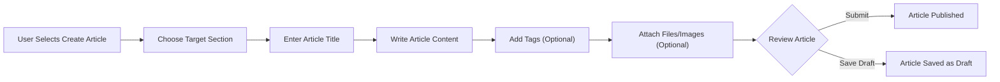
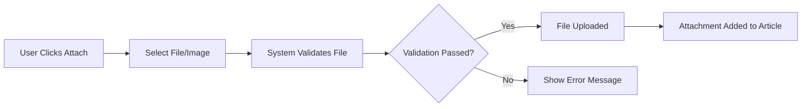

# Article Management Requirements Specification

## Overview

The article management system enables users to create, edit, and manage discussion articles within the Economic/Political Discussion Board platform. Articles serve as the primary content units for discussions, allowing users to share insights, analysis, and opinions on economic and political topics.

## Article Creation Process

### Article Creation Workflow

### Section Selection
WHEN creating a new article, THE system SHALL require the user to select one section from the available sections.
WHEN no sections exist, THE system SHALL prevent article creation and display appropriate message.

### Title Requirements
THE article title SHALL be required and must contain between 5 and 200 characters.
THE system SHALL validate that the title is unique within the selected section.

### Content Requirements
THE article content SHALL be required and must contain between 100 and 10,000 characters.
THE system SHALL support plain text formatting with line breaks and paragraphs.

## Article Content Specifications

### Content Structure
Each article SHALL contain the following required elements:
- Title: Primary identifier and headline
- Content: Main body text
- Section: Categorization context
- Author: User who created the article
- Creation timestamp: When the article was published

### Optional Elements
Each article MAY contain:
- Tags: Free-text categorization labels
- File attachments: Supporting documents
- Image attachments: Visual content

## Attachment Management

### File Attachment Specifications
WHEN attaching files to articles, THE system SHALL support common document formats including PDF, DOC, DOCX, TXT.
THE system SHALL limit individual file size to 10MB.
THE system SHALL limit total attachments per article to 5 files.

### Image Attachment Specifications
WHEN attaching images to articles, THE system SHALL support common image formats including JPG, PNG, GIF.
THE system SHALL limit individual image size to 5MB.
THE system SHALL limit total images per article to 10 images.
THE system SHALL automatically resize large images to appropriate display dimensions.

### Attachment Upload Process

### Attachment Display
WHEN viewing an article with attachments, THE system SHALL display downloadable links for each attachment.
THE system SHALL show file names and sizes for document attachments.
THE system SHALL display image thumbnails that can be expanded to full size.

## Tagging System

### Tag Creation and Management
WHEN adding tags to articles, THE system SHALL allow free-text tag entry.
THE system SHALL support multiple tags per article, with a maximum of 10 tags.
THE system SHALL automatically normalize tag formatting (trim whitespace, lowercase conversion).

### Tag Validation
THE system SHALL validate that each tag contains between 1 and 50 characters.
THE system SHALL prevent duplicate tags within the same article.

### Tag Display
WHEN displaying articles, THE system SHALL show tags as clickable links that filter articles by tag.
THE system SHALL display tags in a consistent visual format.

## Article Editing and Deletion

### Article Editing Capabilities
WHEN editing an article, THE user SHALL be able to modify:
- Title
- Content
- Tags (add, remove, modify)
- Attachments (add new, remove existing)

THE system SHALL preserve the original section assignment during editing.
THE system SHALL record edit history with timestamps.

### Ownership-Based Editing
WHEN a user attempts to edit an article, THE system SHALL verify that the user is the article author.
IF the user is not the article author, THEN THE system SHALL prevent editing and display appropriate message.

### Article Deletion Process
WHEN deleting an article, THE system SHALL:
- Remove the article from public view
- Delete all associated comments
- Remove all file and image attachments from storage
- Update user profile statistics

### Confirmation Requirements
WHEN a user initiates article deletion, THE system SHALL display a confirmation dialog.
THE confirmation dialog SHALL clearly state that deletion is permanent and affects all associated content.

## Article Display Requirements

### Full Article View
WHEN displaying a single article, THE system SHALL show:
- Complete article title
- Author information with link to profile
- Full article content with proper formatting
- Section information with link to section
- All tags with filtering capabilities
- All file and image attachments
- Creation and last edit timestamps
- Comment section with all comments

### Content Formatting
THE system SHALL preserve line breaks and paragraph structure in article content.
THE system SHALL display content in a readable font size and line spacing.

### Attachment Display
WHEN displaying file attachments, THE system SHALL provide:
- Download links for each file
- File type icons
- File size information
- Preview capability for supported document types

WHEN displaying image attachments, THE system SHALL provide:
- Thumbnail images
- Full-size view on click
- Image navigation controls for multiple images

## Integration Requirements

### Section Integration
THE article management system SHALL integrate with section management to ensure:
- Articles are always associated with valid sections
- Section deletion properly handles associated articles
- Section browsing displays appropriate article lists

### User Profile Integration
THE article management system SHALL update user profile statistics when:
- Articles are created
- Articles are deleted
- Articles receive comments

### Search Integration
THE article management system SHALL support search functionality by:
- Indexing article titles and content
- Supporting tag-based filtering
- Providing search result relevance scoring

## Performance Requirements

### Article Loading Performance
WHEN loading a full article view, THE system SHALL display the article content within 2 seconds.
WHEN loading article lists, THE system SHALL display the first page within 1 second.

### Attachment Handling Performance
WHEN uploading attachments, THE system SHALL process files within 30 seconds for maximum file size.
WHEN downloading attachments, THE system SHALL begin download within 1 second.

## Error Handling

### Creation Errors
IF article creation fails due to validation errors, THEN THE system SHALL:
- Display specific error messages
- Preserve entered content
- Highlight problematic fields

### Editing Errors
IF article editing fails, THEN THE system SHALL:
- Preserve the original article content
- Display appropriate error message
- Allow retry of the editing operation

### Attachment Errors
IF file attachment fails, THEN THE system SHALL:
- Display specific error reason (size, format, etc.)
- Allow selection of alternative files
- Preserve other article content

## Business Rules

### Content Ownership
THE system SHALL enforce that only article authors can edit or delete their articles.
Administrators SHALL have override capabilities for content moderation.

### Content Visibility
Articles SHALL be immediately visible upon publication unless the author is banned.
Banned users' articles SHALL remain visible but marked as from banned users.

### Editing Limitations
Users SHALL be able to edit their articles indefinitely after publication.
THE system SHALL maintain edit history for transparency.

## Success Criteria

### User Experience Metrics
- 95% of article creation attempts should succeed on first try
- Article editing should complete within 5 seconds for text-only changes
- Attachment uploads should have 99% success rate for valid files

### System Performance Metrics
- Article pages should load completely within 3 seconds
- Search functionality should return results within 2 seconds
- Tag filtering should update results within 1 second

This document provides comprehensive requirements for the article management system that backend developers can use to implement robust article creation, editing, and display functionality for the Economic/Political Discussion Board platform.