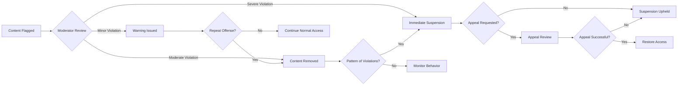

# Business Rules and Validation Requirements

## Introduction

This document defines the business rules and validation requirements for the Economic/Political Discussion Board. These rules govern how content is created, how users interact with the platform, and how moderation is handled to maintain a productive discussion environment focused on economic and political topics.

## Content Validation Rules

### Post Creation Requirements

**WHEN** a member creates a new discussion post, **THE** system **SHALL** validate the following:

- **Title Validation**:
  - Minimum length: 10 characters
  - Maximum length: 200 characters
  - Must contain meaningful text (no single repeated characters)
  - Must not consist solely of numbers or symbols

- **Content Validation**:
  - Minimum length: 50 characters
  - Maximum length: 10,000 characters
  - Must contain substantive discussion content
  - Prohibits excessive formatting (more than 5 consecutive line breaks)

- **Category Assignment**:
  - **WHEN** creating a post, **THE** member **SHALL** assign it to one of the following categories:
    - Economic Policy
    - Political Theory
    - Current Events
    - International Relations
    - Policy Analysis
  - **THE** system **SHALL** require category selection before post submission

### Comment Validation Rules

**WHEN** a member adds a comment to a discussion, **THE** system **SHALL** enforce:

- Minimum comment length: 20 characters
- Maximum comment length: 2,000 characters
- **IF** a comment contains only single words or repetitive phrases, **THEN THE** system **SHALL** flag it for moderation review
- Comments must contribute meaningfully to the discussion

### Content Quality Standards

**THE** system **SHALL** maintain the following quality standards:

- Posts must present coherent arguments or questions
- Content must be relevant to economic or political discussion
- **WHERE** content contains personal attacks or ad hominem arguments, **THE** system **SHALL** flag for moderation
- Excessive use of capital letters (shouting) is discouraged and may trigger moderation review

## User Behavior Guidelines

### Posting Frequency Limits

**WHILE** a user is authenticated as a member, **THE** system **SHALL** enforce:

- Maximum 5 new posts per day per user
- Maximum 50 comments per day per user
- **IF** a user exceeds these limits, **THEN THE** system **SHALL** display a rate limit message
- Rate limits reset at midnight server time

### Discussion Etiquette Requirements

**THE** system **SHALL** encourage constructive discussion through:

- **WHEN** users engage in discussion, **THE** system **SHALL** promote evidence-based arguments
- Personal attacks are prohibited and subject to moderation
- **WHERE** users disagree, **THE** system **SHALL** encourage respectful debate
- Citing sources for factual claims is encouraged

### User Reputation System

**THE** system **SHALL** implement a simple reputation scoring mechanism:

- New members start with 10 reputation points
- **WHEN** other users upvote a post or comment, **THE** author **SHALL** gain 1 reputation point
- **WHEN** content receives multiple downvotes, **THE** author **SHALL** lose reputation points
- Users with negative reputation may have posting privileges temporarily restricted

## Attachment Restrictions and Policies

### Supported File Types

**THE** system **SHALL** support the following attachment types:

- Images: JPEG, PNG, GIF (maximum 5MB each)
- Documents: PDF, DOC, DOCX (maximum 10MB each)
- **WHEN** uploading attachments, **THE** system **SHALL** validate file type and size
- **IF** a file exceeds size limits, **THEN THE** system **SHALL** reject the upload

### Attachment Usage Rules

**WHEN** attaching files to posts or comments, **THE** system **SHALL** enforce:

- Maximum 3 attachments per post
- Maximum 1 attachment per comment
- Attachments must be relevant to the discussion topic
- **WHERE** attachments contain sensitive personal information, **THE** system **SHALL** allow moderators to remove them

### Security Considerations

**THE** system **SHALL** implement security measures for attachments:

- All uploaded files **SHALL** be scanned for malware
- Image files **SHALL** be processed to remove metadata (EXIF data)
- **WHEN** serving attachments, **THE** system **SHALL** use content-disposition headers to prevent automatic execution

## Moderation Policies and Procedures

### Content Flagging System

**WHEN** users encounter inappropriate content, **THE** system **SHALL** provide reporting mechanisms:

- Any member can flag posts or comments for moderator review
- Flagging options include:
  - "Inappropriate content"
  - "Personal attacks"
  - "Spam or advertising"
  - "Off-topic discussion"
  - "Factual inaccuracies"

### Moderator Review Workflow

**WHILE** acting as a moderator, **THE** user **SHALL** have access to:

- Queue of flagged content requiring review
- Ability to:
  - Approve content (leaves it visible)
  - Remove content with explanation
  - Temporary suspension of user accounts
  - Permanent banning for severe violations

### Moderation Decision Guidelines

**THE** moderation team **SHALL** follow these decision criteria:

- **Content Removal Threshold**:
  - Clear violations of community guidelines
  - Personal attacks or harassment
  - Spam or commercial content
  - Illegal material

- **User Suspension Criteria**:
  - Repeated violations after warnings
  - Severe single violation (threats, hate speech)
  - Attempts to circumvent moderation

### Appeal Process

**WHEN** a user disagrees with moderation decisions, **THE** system **SHALL** provide:

- 7-day window to appeal moderation actions
- Appeal reviewed by different moderator than original decision
- **IF** appeal is successful, **THEN THE** system **SHALL** restore content and clear violation record

## Community Guidelines and Enforcement

### Prohibited Content Types

**THE** system **SHALL** prohibit the following content categories:

- Hate speech targeting protected characteristics
- Threats of violence or harassment
- Misinformation presented as fact
- Commercial advertising without disclosure
- Copyright infringement
- Personal information of non-public figures

### Discussion Quality Standards

**THE** community **SHALL** maintain standards for productive discussion:

- Arguments should be based on evidence and logic
- Respectful disagreement is encouraged
- **WHERE** discussions become unproductive, **THE** moderators **SHALL** have discretion to close threads
- Focus on ideas and policies rather than personal characteristics

### Enforcement Escalation Matrix

### User Sanction Levels

**THE** system **SHALL** implement progressive sanction levels:

1. **Warning**: Notification of violation with educational content
2. **Temporary Restriction**: 24-hour posting ban
3. **Short Suspension**: 3-day account suspension
4. **Extended Suspension**: 30-day account suspension
5. **Permanent Ban**: For severe or repeated violations

## Business Rule Implementation Matrix

| Rule Category | Rule Description | Enforcement Level | Automated | Requires Human Review |
|---------------|------------------|-------------------|-----------|----------------------|
| Content Length | Post/comment character limits | High | ✅ | ❌ |
| Attachment Type | File format validation | High | ✅ | ❌ |
| Attachment Size | File size limits | High | ✅ | ❌ |
| Posting Frequency | Rate limiting | Medium | ✅ | ❌ |
| Content Quality | Substantive content requirement | Medium | ⚠️ | ✅ |
| Community Guidelines | Prohibited content types | High | ⚠️ | ✅ |
| User Behavior | Respectful interaction | Medium | ❌ | ✅ |
| Moderation Decisions | Content removal/suspension | High | ❌ | ✅ |

### Implementation Notes

- **Automated Rules**: Can be enforced by system validation
- **Semi-Automated (⚠️)**: System flags for human review
- **Human Review (✅)**: Requires moderator decision

## Conclusion

These business rules provide the foundation for maintaining a high-quality discussion environment focused on economic and political topics. The rules balance freedom of expression with the need for constructive, evidence-based discussion while ensuring the platform remains accessible and user-friendly.

> *Developer Note: This document defines **business requirements only**. All technical implementations (architecture, APIs, database design, etc.) are at the discretion of the development team.*