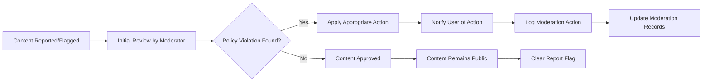
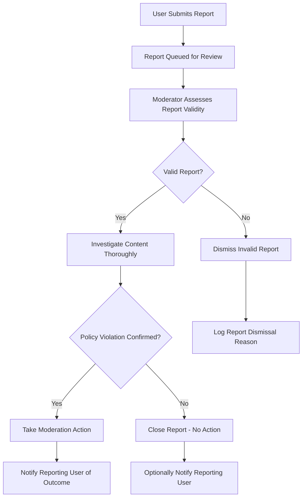
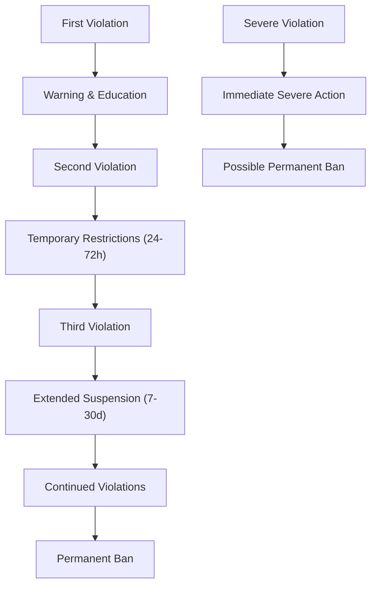
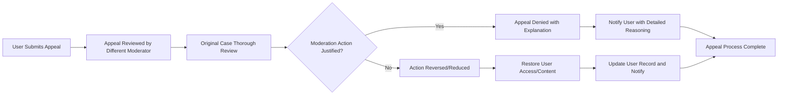

# Content Policy and Moderation Guidelines for Economic/Political Discussion Board

## Executive Summary

This document establishes the comprehensive content management framework for the economic/political discussion board platform. The platform aims to facilitate respectful, informed discussions while maintaining a safe environment for all participants. These guidelines provide clear, actionable policies for moderators and users alike, ensuring consistent enforcement and transparent operations.

## Content Guidelines

### Allowed Content Categories

**WHEN** users create content, **THE** system **SHALL** allow the following types of discussions:
- **Economic Analysis**: Detailed examination of economic policies, market trends, fiscal discussions with supporting evidence
- **Political Debates**: Civil discourse on political ideologies, policies, and governance structures
- **Academic Discussions**: Evidence-based analysis with proper citations and source references
- **Constructive Criticism**: Respectful critique of ideas, policies, and positions with substantive arguments
- **Supporting Materials**: Relevant charts, graphs, data visualizations, and documents that enhance discussion quality

**WHEN** users upload attachments, **THE** system **SHALL** support the following file types:
- Images: JPEG, PNG, GIF formats (maximum 5MB each)
- Documents: PDF, DOC, DOCX, TXT formats (maximum 10MB each)
- Data files: CSV, XLSX formats for economic data sharing (maximum 5MB each)

### Prohibited Content Categories

**THE** system **SHALL** prohibit the following content types:
- **Hate Speech**: Content targeting individuals or groups based on race, ethnicity, religion, gender, sexual orientation, or other protected characteristics
- **Misinformation**: Deliberate spreading of verifiably false information that could cause harm
- **Personal Attacks**: Ad hominem arguments instead of policy critiques
- **Illegal Content**: Material promoting or depicting illegal activities
- **Spam**: Commercial promotion unrelated to discussion topics
- **Graphic Violence**: Disturbing images or descriptions of violence
- **Harassment**: Targeted abuse or intimidation of other users

### Content Quality Standards

**WHEN** users create posts, **THE** system **SHALL** enforce the following quality standards:
- **Relevance**: Content must directly relate to economic or political discussion topics
- **Substance**: Posts should contribute meaningful analysis, questions, or insights
- **Citation**: Claims should be supported by verifiable sources when making factual assertions
- **Clarity**: Content should be understandable to the intended audience with proper formatting
- **Civility**: Discussions should maintain respectful tone even during disagreements

## Moderation Policies

### Moderation Principles

**THE** moderation team **SHALL** operate according to these core principles:
- **Neutrality**: Enforce rules impartially regardless of political views or positions
- **Transparency**: Provide clear explanations for moderation decisions
- **Proportionality**: Match responses to the severity of violations
- **Consistency**: Apply similar treatment to similar violations across the platform
- **Education**: Help users understand and comply with community standards

### Content Review Process

**WHEN** content is reported, **THE** system **SHALL** follow this workflow:
1. **Initial Assessment**: Moderator reviews reported content against community guidelines
2. **Violation Determination**: Evaluate whether content violates specific policy provisions
3. **Action Application**: Apply appropriate moderation action based on violation severity
4. **User Notification**: Inform content creator of action taken with specific reasoning
5. **Documentation**: Log all moderation actions for audit and consistency purposes

### Attachment Moderation Requirements

**WHEN** users upload attachments, **THE** system **SHALL** implement the following security measures:
- **File Type Validation**: Verify uploaded files match allowed formats
- **Malware Scanning**: Scan all attachments for viruses and malicious content
- **Size Enforcement**: Reject files exceeding established size limits
- **Relevance Check**: Ensure attachments support discussion topic
- **Preview Generation**: Create safe previews for document and image files

## User Reporting System

### Reporting Interface Requirements

**WHEN** users encounter problematic content, **THE** system **SHALL** provide a comprehensive reporting interface with:
- **Easy Access**: Report button available on all posts and comments
- **Category Selection**: Specific violation types (spam, harassment, misinformation, etc.)
- **Context Collection**: Optional field for additional details and explanations
- **Anonymous Option**: Ability to report without revealing identity
- **Status Tracking**: Visibility into report processing status

### Report Handling Workflow

### Report Response Time Standards

**THE** moderation team **SHALL** adhere to these response timeframes:
- **Urgent Issues** (threats, illegal content, severe harassment): Within 2 hours
- **Standard Violations** (hate speech, spam, misinformation): Within 24 hours
- **Minor Issues** (civility concerns, minor rule misunderstandings): Within 48 hours
- **Complex Cases** (requiring multiple moderator review): Within 72 hours with status updates

## Violation Handling System

### Violation Categories and Severity Levels

#### Category 1: Minor Infractions
- **Examples**: Mild incivility, accidental rule misunderstandings, minor formatting issues
- **First Offense Actions**: Warning message with educational resources
- **Repeat Offense Actions**: Temporary posting restrictions (24-48 hours)
- **Documentation Requirements**: Log warning with timestamp and specific rule violation

#### Category 2: Moderate Violations
- **Examples**: Repeated minor infractions, moderate incivility, borderline content
- **Actions**: Temporary posting restrictions (24-72 hours), content removal
- **Review Process**: Case reviewed by senior moderator for consistency
- **Appeal Eligibility**: Eligible for appeal after 24-hour cooling-off period

#### Category 3: Serious Violations
- **Examples**: Hate speech, harassment, deliberate misinformation, spam campaigns
- **Actions**: Account suspension (7-30 days), content removal, possible restrictions
- **Review Requirement**: Case reviewed by moderation team lead
- **Documentation**: Comprehensive case documentation with evidence collection

#### Category 4: Severe Violations
- **Examples**: Illegal content, severe threats, organized harassment, platform abuse
- **Actions**: Permanent ban, content removal, legal reporting if required
- **Immediate Action**: No warning required for severe violations
- **Administrative Review**: Senior leadership approval for permanent bans

### Progressive Discipline System

**WHEN** users violate community guidelines, **THE** system **SHALL** implement progressive discipline:
- **Warning Phase**: Educational approach for first-time minor violations
- **Restriction Phase**: Temporary limitations for repeated or moderate violations
- **Suspension Phase**: Account suspension for serious or persistent violations
- **Banning Phase**: Permanent removal for severe or unrepentant violations

### Violation Escalation Factors

**THE** moderation team **SHALL** consider these factors when determining appropriate actions:
- **Frequency**: Repeated violations receive progressively stronger responses
- **Severity**: More serious violations may skip early discipline stages
- **Intent**: Deliberate violations treated more severely than accidental ones
- **Impact**: Wider-reaching violations receive stronger community protection measures
- **Remorse**: User acknowledgment and commitment to improvement may mitigate responses

## Appeal Process

### Appeal Eligibility and Submission

**WHEN** users receive moderation actions, **THE** system **SHALL** allow appeals under these conditions:
- **Appealable Actions**: Suspensions longer than 24 hours, permanent bans, content removal disputes
- **Time Limit**: Appeals must be submitted within 14 days of moderation action
- **Submission Requirements**: Specific grounds for appeal with supporting evidence
- **Cooling-Off Period**: 24-hour wait before appealing emotional decisions

### Appeal Review Process

### Appeal Decision Criteria

**WHEN** reviewing appeals, **THE** moderation team **SHALL** evaluate based on:
- **Rule Interpretation**: Whether moderation action aligned with published guidelines
- **Evidence Review**: Sufficiency and validity of evidence supporting the action
- **Proportionality**: Appropriateness of response relative to violation severity
- **Procedural Fairness**: Adherence to established moderation processes
- **Context Consideration**: Full context of the violation and user history

### Appeal Outcomes and Implementation

**THE** appeal process **SHALL** result in one of these outcomes:
- **Appeal Upheld**: Original action confirmed as correct and appropriate
- **Action Modified**: Response reduced (e.g., suspension shortened, restrictions eased)
- **Appeal Overturned**: Action reversed completely with apology if warranted
- **New Investigation**: Case reopened for additional review with different moderators

**WHEN** appeals are granted, **THE** system **SHALL**:
- Immediately restore user access and affected content
- Update user records to reflect appeal outcome
- Provide clear communication about the decision
- Offer guidance for future compliance

## Community Standards

### Core Community Principles

#### Respectful Discourse Principle
**WHEN** users engage in discussion, **THE** system **SHALL** encourage civil, evidence-based arguments that focus on issues rather than individuals. **THE** platform **SHALL** maintain an environment where diverse viewpoints can be expressed respectfully without personal attacks.

#### Fact-Based Discussion Principle
**WHERE** users make factual claims, **THE** system **SHALL** encourage supporting evidence and source citation. **WHEN** misinformation is identified, **THE** system **SHALL** provide correction mechanisms while maintaining discussion flow.

#### Inclusive Environment Principle
**THE** community **SHALL** welcome participants regardless of political affiliation, background, or perspective. **WHILE** maintaining free expression, **THE** system **SHALL** protect against harassment and ensure all users feel safe participating.

### Moderator Guidelines and Training

#### Decision-Making Framework
**THE** moderation team **SHALL** operate using this consistent framework:
- **Consistency First**: Apply rules uniformly across all content and users
- **Context Matters**: Consider discussion context when evaluating content appropriateness
- **Benefit of Doubt**: When unclear, err on side of allowing discussion
- **Documentation Priority**: Maintain clear records of all moderation actions
- **Continuous Learning**: Regular training on new moderation challenges and techniques

#### Communication Standards
**WHEN** communicating with users about moderation actions, **THE** team **SHALL**:
- **Provide Specificity**: Clear, detailed explanations of rule violations
- **Maintain Professionalism**: Respectful tone even when delivering difficult news
- **Ensure Timeliness**: Responsive communication within published timeframes
- **Protect Privacy**: Confidential handling of user information and reports
- **Offer Guidance**: Constructive suggestions for future compliance

### User Education and Community Building

#### Rule Awareness Initiatives
**THE** platform **SHALL** implement comprehensive user education including:
- **Clear Documentation**: Prominently displayed and easily accessible rules
- **Practical Examples**: Real scenarios demonstrating acceptable/unacceptable content
- **Regular Reminders**: Periodic notifications about key community standards
- **Interactive FAQ**: Searchable database of common questions and policy explanations

#### Community Development Programs
**THE** system **SHALL** foster healthy community growth through:
- **New User Orientation**: Special guidance and welcome resources for newcomers
- **Positive Recognition**: Highlighting constructive discussions and valuable contributions
- **Mentorship Opportunities**: Connecting experienced users with new participants
- **Feedback Integration**: Regular community input on policy improvements
- **Transparent Operations**: Clear communication about platform changes and decisions

## Implementation Considerations

### Technical Requirements for Moderation System

**WHEN** implementing the content moderation platform, **THE** development team **SHALL** provide:
- **Efficient Moderation Interface**: Streamlined tools for reviewing reports and content
- **Comprehensive Audit Trail**: Complete logging of all moderation actions and decisions
- **User Notification System**: Automated messaging for action notifications and status updates
- **Appeal Management Workflow**: Structured process for handling user appeals
- **Performance Analytics**: Metrics for monitoring moderation effectiveness and efficiency

### Moderator Training and Support

**THE** platform **SHALL** ensure moderators receive adequate training including:
- **Policy Mastery**: Comprehensive understanding of all community guidelines
- **Scenario Practice**: Hands-on experience with common moderation situations
- **Tool Proficiency**: Effective use of moderation tools and systems
- **Conflict Resolution**: Skills for handling difficult user interactions
- **Ongoing Education**: Regular updates on policy changes and emerging challenges

### Performance Metrics and Quality Assurance

**THE** moderation system **SHALL** track these key performance indicators:
- **Response Times**: Average time to address reports and handle appeals
- **User Satisfaction**: Feedback from both reporting users and affected parties
- **Appeal Rates**: Percentage of moderation actions that are appealed
- **Decision Consistency**: Evaluation of moderation consistency across different moderators
- **Community Health**: Overall platform safety and user satisfaction metrics

## Policy Review and Updates

### Regular Review Cycle

**THE** content policy **SHALL** undergo regular evaluation through:
- **Quarterly Reviews**: Formal assessment of policy effectiveness and relevance
- **Community Feedback**: Structured solicitation of user input and suggestions
- **Incident Analysis**: Learning from challenging moderation cases and edge scenarios
- **Industry Benchmarking**: Comparison with best practices from similar platforms

### Policy Update Process

**WHEN** policy changes are necessary, **THE** platform **SHALL** follow this process:
- **Proposal Phase**: Documented suggestions with rationale and impact analysis
- **Review Period**: Adequate time for community feedback and team discussion
- **Implementation Planning**: Clear rollout strategy with communication plan
- **Transparent Communication**: Announcement of changes with explanation and effective date
- **Transition Support**: Grace period and assistance for users adapting to changes

### Continuous Improvement Commitment

**THE** platform **SHALL** maintain commitment to ongoing improvement through:
- **Regular Policy Assessments**: Scheduled evaluations of all policy components
- **User Experience Monitoring**: Tracking how policies affect user participation
- **Moderator Feedback Integration**: Incorporating frontline experience into policy refinement
- **Technology Adaptation**: Updating policies to address new platform capabilities and challenges

> *Developer Note: This document defines **business requirements only**. All technical implementations (moderation tools, database design, API structure) are at the discretion of the development team.*