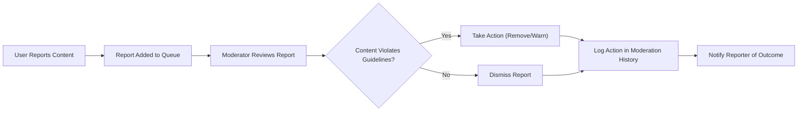

# Content Moderation and Administrative Functions

## Introduction and Purpose

This document defines the business requirements for content moderation and administrative functions within the economic/political discussion board. The moderation system ensures content quality, maintains community standards, and provides administrative oversight while maintaining the platform's simple and straightforward design philosophy.

## Moderator Tools and Responsibilities

### Moderator Role Definition
Moderators are responsible for maintaining the quality and integrity of discussions while upholding community guidelines. They serve as community stewards who ensure discussions remain focused, respectful, and aligned with the platform's economic/political focus.

### Content Moderation Tools
WHEN a moderator accesses the moderation dashboard, THE system SHALL provide access to the following moderation functions:
- View reported content queue with prioritization based on severity and recency
- Review flagged posts and comments with full context and user history
- Access user management interface for account actions and warnings
- View moderation history and statistics for performance tracking
- Manage content categories and discussion organization

### Specific Moderator Permissions
WHERE the actor is a moderator, THE system SHALL permit the following actions:
- Review and approve/reject reported content within 24 hours of submission
- Temporarily suspend user accounts for guideline violations (1-30 days based on severity)
- Remove inappropriate posts and comments with clear justification
- Pin important discussions to the top of relevant sections for up to 7 days
- Lock discussions that violate community guidelines or become unproductive
- Send warnings to users for minor infractions with educational guidance
- Access user activity logs for moderation context and pattern recognition

### Moderation Scope
WHILE performing moderation duties, THE moderator SHALL only have access to public content and user interactions relevant to their moderation responsibilities. Moderators SHALL NOT have access to private user data unless required for specific moderation actions.

## Content Review Process

### Content Reporting System
WHEN any user encounters inappropriate content, THE system SHALL provide a reporting mechanism with the following options:
- Spam or irrelevant content (automated detection with human review)
- Harassment or personal attacks (immediate flagging for moderator review)
- False information or misinformation (requires evidence-based review)
- Off-topic discussions (economic/political focus enforcement)
- Copyright violations (DMCA compliance process)
- Other guideline violations (custom explanation required)

### Report Handling Workflow

### Content Review Timeline
WHEN content is reported, THE system SHALL ensure moderators review it within 24 hours during business days. For urgent reports (harassment, illegal content), THE system SHALL provide expedited review within 4 hours.

### Appeal Process
IF a user disagrees with moderation action, THEN THE system SHALL provide an appeal mechanism where users can request reconsideration of the decision. Appeals SHALL be reviewed by a different moderator than the original decision-maker within 48 hours.

## User Management Functions

### User Account Management
WHERE the actor is a moderator, THE system SHALL provide tools to manage user accounts including:
- View user activity history (posts, comments, reports)
- Suspend accounts for guideline violations with specified duration
- Remove spam accounts and associated content
- Restore mistakenly suspended accounts with apology notification
- Track user warning history and escalation patterns

### Account Suspension Process
WHEN suspending a user account, THE system SHALL:
- Specify the reason for suspension with reference to specific guideline violations
- Set suspension duration (1-30 days for temporary, permanent for severe/repeated violations)
- Notify the user of suspension and reason via email and platform notification
- Provide appeal instructions and expected review timeline
- Log suspension action in moderation history for accountability

### User Warning System
WHEN issuing warnings to users, THE system SHALL:
- Record warnings in user history with timestamp and moderator information
- Escalate warnings based on violation frequency (3 warnings within 90 days triggers review)
- Automatically notify users of warnings with educational content about guidelines
- Track warning expiration periods (warnings expire after 180 days of good behavior)
- Provide warning templates for consistent messaging

## Reporting and Analytics

### Moderation Statistics
THE system SHALL provide moderators with access to moderation statistics including:
- Number of reports processed per day/week/month with trend analysis
- Average response time to reports with performance benchmarks
- Most common violation types with category breakdown
- User compliance rates and improvement trends
- Moderator performance metrics for quality assurance

### Content Quality Metrics
WHERE content moderation is active, THE system SHALL track:
- Content removal rates by category with justification analysis
- User reporting patterns and false positive rates
- Moderation effectiveness metrics (reduction in repeat violations)
- Community guideline adherence trends over time
- User satisfaction with moderation decisions

### User Behavior Analytics
THE system SHALL provide insights into user behavior patterns relevant to moderation:
- Users with high report rates (both submitting and receiving reports)
- Users frequently reported by others with pattern analysis
- Content posting patterns of problematic users for early intervention
- Successful appeal rates and common appeal reasons
- User rehabilitation success after warnings/suspensions

## System Configuration

### Moderation Thresholds
THE system SHALL allow configuration of moderation thresholds including:
- Automatic flagging thresholds for reported content (3+ reports triggers review)
- Warning escalation rules based on violation history
- Suspension trigger criteria for repeated or severe violations
- Content quality scoring parameters for automated detection
- Spam detection sensitivity levels

### Notification Settings
WHERE moderation actions occur, THE system SHALL provide configurable notification options:
- Email notifications for urgent reports requiring immediate attention
- In-platform notifications for routine actions and status updates
- Summary reports for moderation activity (daily/weekly)
- Alert thresholds for unusual activity patterns requiring investigation
- Escalation procedures for unresolved or complex cases

### Content Guidelines Management
THE system SHALL provide a mechanism to manage and update community guidelines that moderators enforce. Guideline updates SHALL require administrator approval and SHALL be communicated to users with 7-day advance notice.

## Error Handling and Edge Cases

### Moderation Error Recovery
IF a moderation action fails, THEN THE system SHALL:
- Preserve the original content state to prevent data loss
- Log the error for administrator review and system improvement
- Notify the moderator of the failure with suggested retry options
- Provide manual override capabilities for critical situations
- Maintain audit trail of all attempted actions

### Concurrent Moderation
WHILE multiple moderators are active, THE system SHALL prevent conflicting moderation actions through proper locking mechanisms. WHEN two moderators attempt to moderate the same content simultaneously, THE system SHALL:
- Implement optimistic locking to prevent race conditions
- Provide conflict resolution interface for overlapping actions
- Log all attempted actions for review and reconciliation
- Notify moderators of potential conflicts before finalizing actions

### Data Integrity
THE system SHALL ensure that all moderation actions are properly logged and reversible when appropriate. WHERE moderation actions need to be reversed, THE system SHALL:
- Maintain complete action history with before/after states
- Provide rollback capabilities for mistaken actions
- Preserve original content even when removed from public view
- Track all modifications for audit purposes

### Privacy Considerations
WHILE performing moderation duties, THE system SHALL protect user privacy by only exposing necessary information for moderation purposes. Moderators SHALL NOT have access to:
- User email addresses unless required for suspension notifications
- Private message content between users
- Password or authentication information
- Financial or payment information

## Integration Requirements

### Authentication Integration
THE moderation system SHALL integrate with the existing user authentication system to verify moderator permissions. WHEN a user's moderator status changes, THE system SHALL immediately update their access privileges across all moderation interfaces.

### Content System Integration
WHERE content moderation occurs, THE system SHALL seamlessly integrate with the post and comment management systems. Moderation actions SHALL automatically update content visibility and user permissions without requiring manual synchronization.

### Notification Integration
THE moderation system SHALL integrate with the platform's notification system to alert users of moderation actions. Notifications SHALL be customizable based on action severity and user preference settings.

## Performance Requirements

### Response Time
WHEN moderators perform actions, THE system SHALL respond within 2 seconds for standard operations. Critical moderation actions (content removal, user suspension) SHALL process within 5 seconds to ensure timely intervention.

### Queue Management
THE system SHALL efficiently manage reported content queues to prevent backlog accumulation. THE average time from report to moderator action SHALL not exceed 24 hours during normal operation.

### Scalability
THE moderation system SHALL scale to handle increasing content volume as the platform grows. The system SHALL support up to 100 simultaneous moderator sessions without performance degradation.

## Business Rules Summary

### Moderation Principles
THE moderation system SHALL operate based on the following core principles:
- Transparency: All moderation actions shall be documented and explainable
- Consistency: Similar violations shall receive similar responses
- Proportionality: Actions shall be proportional to violation severity
- Education: Moderation shall include guidance for improvement
- Fairness: All users shall be treated equally under established guidelines

### User Protection
THE system SHALL protect users from moderation errors through:
- Clear appeal processes for disputed actions
- Multi-level review for significant actions (suspensions, permanent bans)
- Regular moderation quality audits
- User feedback mechanisms for process improvement

### Community Standards Enforcement
Moderation actions SHALL focus on maintaining:
- Respectful discourse even during heated debates
- Fact-based discussions with evidence support
- Economic/political focus without topic dilution
- Civil engagement without personal attacks

> *Developer Note: This document defines **business requirements only**. All technical implementations (architecture, APIs, database design, etc.) are at the discretion of the development team.*