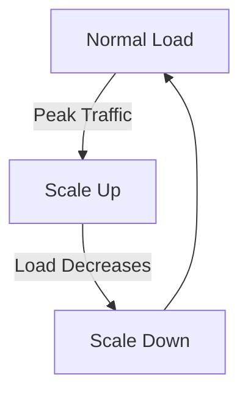
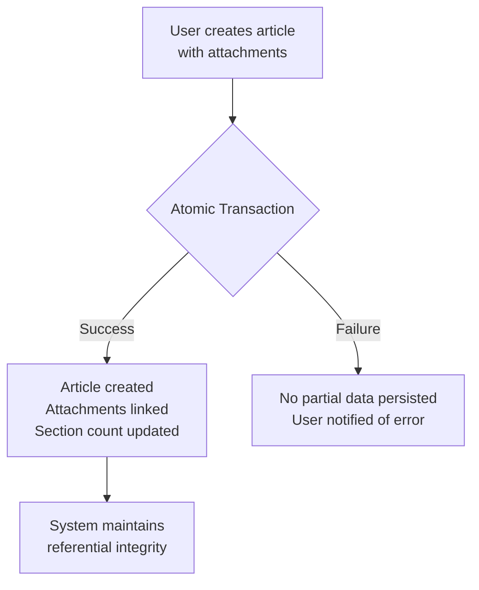
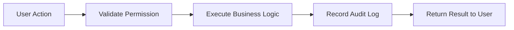
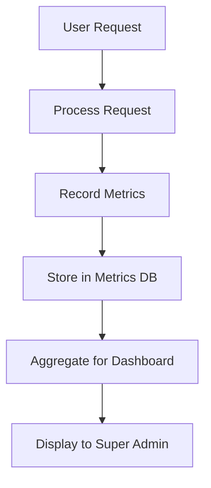
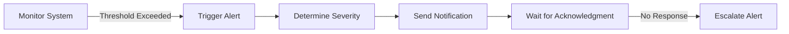
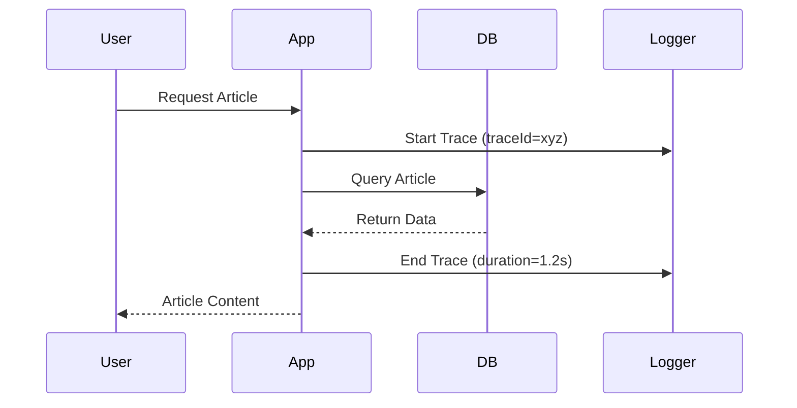
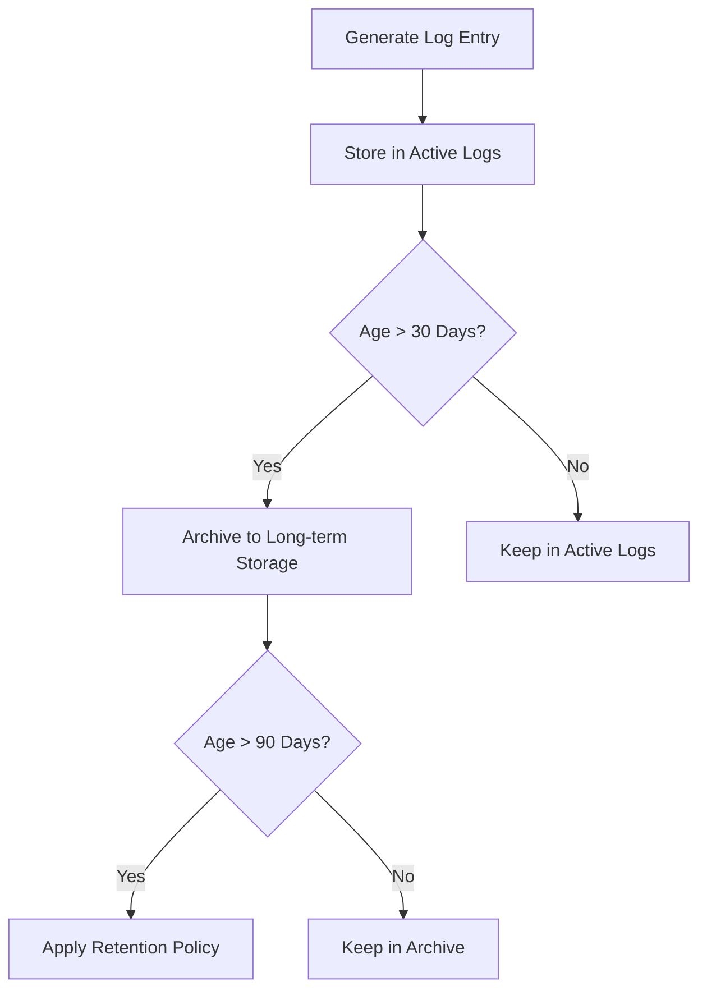
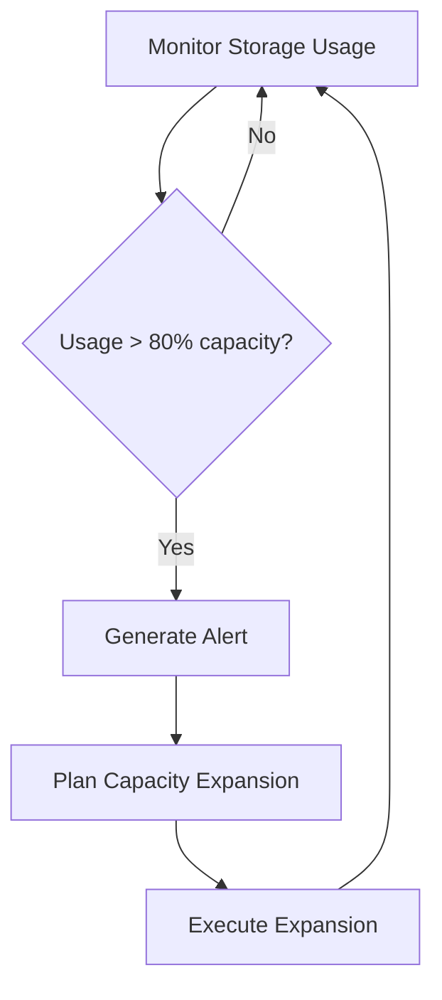
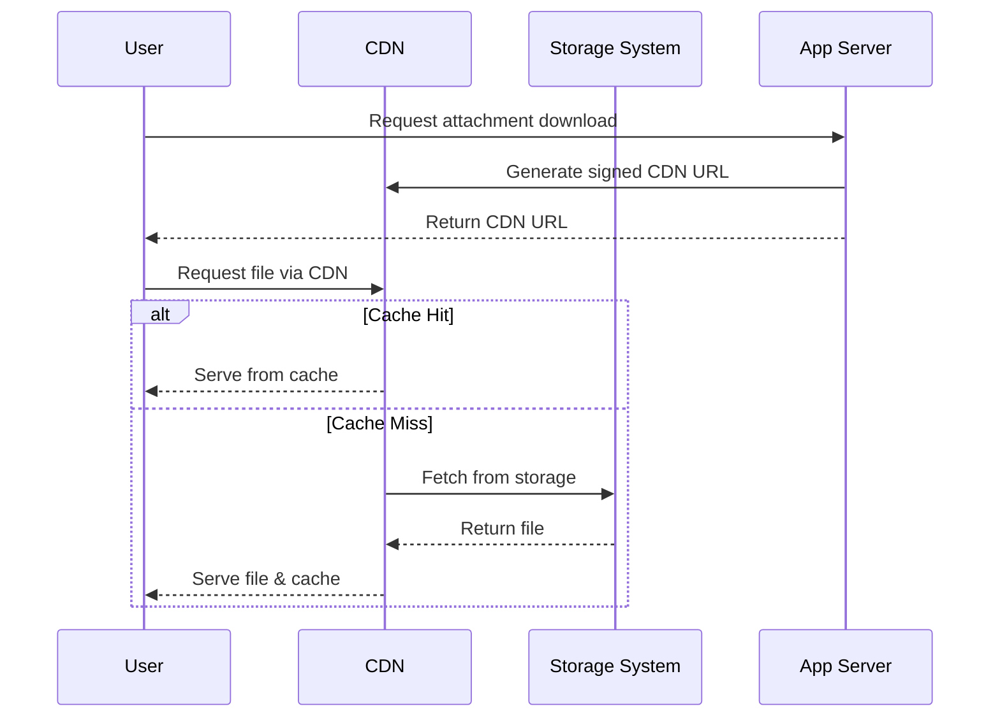
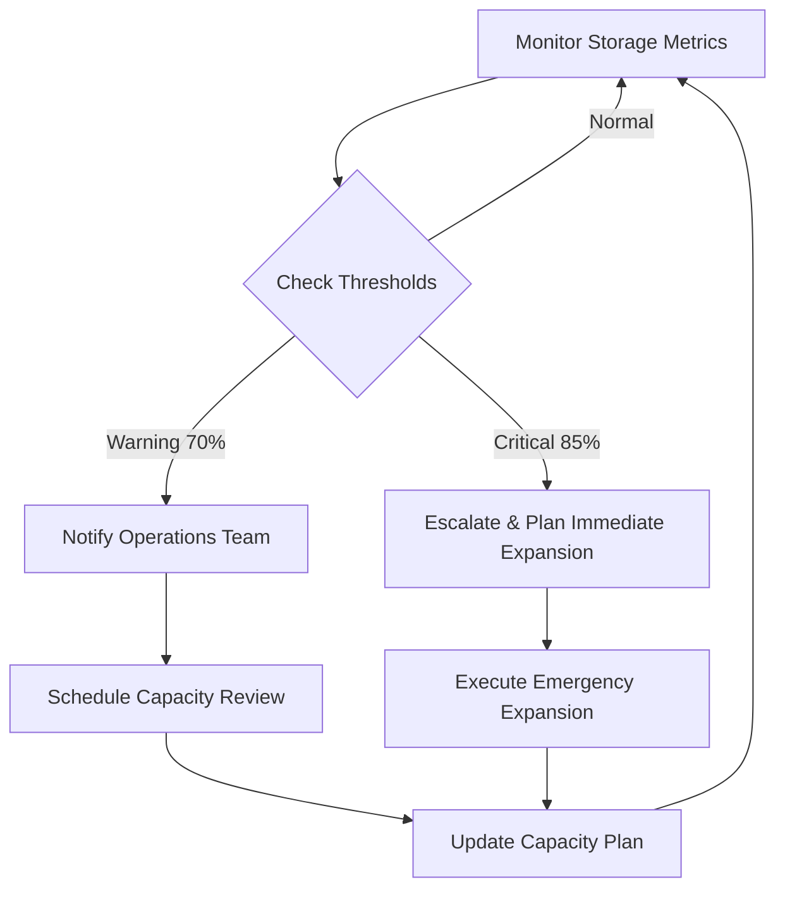

**discussionBoard — Performance SLOs, security policies, data integrity, storage requirements**

Performance SLOs, security policies, data integrity, storage requirements

# Performance Requirements

Performance SLOs and scalability targets.

## Performance SLOs

Define response time targets, throughput limits, and scalability requirements.

### Response Time Service Level Objectives

THE system SHALL meet the following response time targets for all user operations:

**Article Operations:**
WHEN a user views an article list, THE system SHALL respond within 500ms for the first page.
WHEN a user views a single article, THE system SHALL respond within 300ms.
WHEN a user creates or edits an article, THE system SHALL complete the operation within 1 second.

**Comment Operations:**
WHEN a user views comments for an article, THE system SHALL respond within 400ms.
WHEN a user creates or edits a comment, THE system SHALL complete the operation within 800ms.

**Search Operations:**
WHEN a user performs a search, THE system SHALL return results within 2 seconds.

**User Profile Operations:**
WHEN a user views a profile, THE system SHALL respond within 400ms.
WHEN a user edits their profile, THE system SHALL complete the operation within 500ms.

IF response times exceed these thresholds, THE system SHALL trigger performance monitoring alerts.

### Throughput Capacity Targets

THE system SHALL support the following concurrent user capacity:

WHILE operating at peak load, THE system SHALL handle:
- 1,000 concurrent authenticated users
- 5,000 concurrent guest users viewing content
- 100 concurrent article creation operations per minute
- 500 concurrent comment creation operations per minute
- 200 concurrent search operations per minute

THE system SHALL maintain these throughput levels during sustained 95th percentile load.

IF throughput capacity approaches 80% of these limits, THE system SHALL trigger scaling alerts.

### Scalability Requirements

THE system SHALL scale horizontally to accommodate growth:

WHEN user traffic increases by 50% over baseline, THE system SHALL maintain performance SLOs without degradation.
WHEN storage requirements grow beyond initial capacity, THE system SHALL support seamless storage expansion.
WHEN concurrent user sessions exceed current capacity, THE system SHALL automatically provision additional resources.

THE system SHALL support scaling from 10,000 to 100,000 registered users without architectural changes.
THE system SHALL maintain data consistency across all scaled instances.

IF scaling operations fail, THE system SHALL maintain service availability with graceful degradation.

### Latency Guarantees

THE system SHALL provide consistent latency performance across all geographic regions:

WHEN users access the system from the same geographic region as the primary data center, THE system SHALL maintain sub-100ms network latency.
WHEN users access from different continents, THE system SHALL maintain sub-500ms network latency.

THE system SHALL ensure database query latency remains below 50ms for 95% of queries.
THE system SHALL maintain file attachment download latency below 2 seconds for files under 10MB.

IF latency exceeds guaranteed thresholds for more than 5% of requests, THE system SHALL trigger investigation alerts.

### Performance Monitoring and Reporting

THE system SHALL continuously monitor performance metrics:

WHEN performance metrics are collected, THE system SHALL track:
- Response times for all major operations
- Error rates and types
- Throughput by operation type
- Resource utilization (CPU, memory, storage)
- Concurrent user counts

THE system SHALL generate performance reports:
- Daily performance summaries
- Weekly trend analysis
- Monthly capacity planning reports

THE system SHALL alert administrators:
- WHEN SLO violations occur
- WHEN performance degrades by more than 20%
- WHEN capacity thresholds are approached

IF monitoring systems detect anomalies, THE system SHALL preserve diagnostic data for investigation.

## Rate Limiting and Throttling

Define rate limiting policies and abuse prevention requirements.

### Rate Limiting Policies

### API Rate Limiting

WHEN a user performs any API operation, THE system SHALL:
1. Enforce rate limits based on user authentication status
2. Track request counts per user per time window
3. Return appropriate error responses when limits are exceeded

IF a guest user exceeds rate limits, THE system SHALL:
1. Return HTTP 429 Too Many Requests response
2. Include retry-after header indicating when to retry
3. Log the rate limit violation for monitoring

IF an authenticated member exceeds rate limits, THE system SHALL:
1. Return HTTP 429 Too Many Requests response
2. Apply progressive penalties for repeated violations
3. Notify administrators of potential abuse patterns

### Operation-Specific Rate Limits

WHEN a user creates articles, THE system SHALL:
1. Limit to 10 article creations per hour per user
2. Allow burst creation of up to 3 articles within 5 minutes
3. Track creation patterns across all sections

WHEN a user posts comments, THE system SHALL:
1. Limit to 50 comments per hour per user
2. Allow burst posting of up to 10 comments within 5 minutes
3. Monitor comment velocity across multiple articles

WHEN a user performs search operations, THE system SHALL:
1. Limit to 100 searches per hour per user
2. Allow burst searching of up to 20 searches within 5 minutes
3. Cache frequent search results to reduce load

### Administrator Rate Limits

WHEN an administrator performs administrative actions, THE system SHALL:
1. Apply higher rate limits than regular users
2. Monitor administrative action patterns for potential abuse
3. Alert super administrators of suspicious administrative activity

### Throttling Mechanisms

### Dynamic Throttling

WHEN the system experiences high load, THE system SHALL:
1. Dynamically adjust rate limits based on system capacity
2. Prioritize read operations over write operations during peak load
3. Gradually restore normal limits when system load decreases

IF a user exhibits abusive behavior patterns, THE system SHALL:
1. Automatically reduce their rate limits
2. Apply progressive throttling based on violation severity
3. Require administrator intervention to restore normal limits

### Resource-Based Throttling

WHEN users upload attachments, THE system SHALL:
1. Throttle large file uploads to prevent bandwidth exhaustion
2. Limit concurrent uploads per user to prevent resource hogging
3. Monitor storage usage patterns across users

WHEN users perform expensive search operations, THE system SHALL:
1. Throttle complex search queries with multiple filters
2. Limit search result sizes to prevent memory exhaustion
3. Cache expensive search operations to improve performance

### Geographic Throttling

WHEN requests originate from high-risk geographic regions, THE system SHALL:
1. Apply stricter rate limits based on geographic risk assessment
2. Monitor for coordinated attacks from multiple IP addresses
3. Allow administrators to customize geographic throttling rules

### Abuse Prevention Strategies

### Pattern Detection

WHEN the system detects suspicious activity patterns, THE system SHALL:
1. Automatically flag accounts exhibiting bot-like behavior
2. Detect and prevent coordinated spam attacks
3. Identify and block content scraping attempts

IF a user attempts to create multiple accounts for abuse, THE system SHALL:
1. Detect and block account creation from same IP addresses
2. Prevent email domain abuse through pattern matching
3. Require additional verification for suspicious registrations

### Content-Based Abuse Prevention

WHEN users create articles or comments, THE system SHALL:
1. Scan for spam keywords and patterns in real-time
2. Prevent rapid posting of similar content across sections
3. Flag potentially harmful or inappropriate content for review

IF abusive content is detected, THE system SHALL:
1. Automatically throttle the offending user's posting capabilities
2. Queue suspicious content for administrator review
3. Apply temporary restrictions while content is under review

### Administrator Abuse Prevention

WHEN administrators perform actions, THE system SHALL:
1. Log all administrative actions for audit purposes
2. Require secondary approval for high-impact actions
3. Prevent administrators from abusing their privileges

### Cooldown Period Requirements

### Account Creation Cooldown

WHEN a user account is created from a suspicious IP address, THE system SHALL:
1. Impose a 24-hour cooldown period before full posting privileges
2. Limit new accounts to viewing-only during cooldown period
3. Gradually increase posting limits as account reputation builds

### Violation Cooldown Periods

IF a user exceeds rate limits, THE system SHALL:
1. Apply a 15-minute cooldown period for the violated operation type
2. Gradually increase cooldown duration for repeated violations
3. Reset cooldown counters after 24 hours of compliant behavior

### Administrative Action Cooldowns

WHEN administrators perform sensitive actions, THE system SHALL:
1. Impose a 5-minute cooldown between user bans from same administrator
2. Require 1-hour cooldown between section creation/deletion operations
3. Prevent rapid mass deletions without supervisory approval

### Content Modification Cooldowns

WHEN users edit their content repeatedly, THE system SHALL:
1. Limit article edits to 3 revisions per hour
2. Apply 10-minute cooldown between comment edits
3. Prevent rapid content modification that could indicate abuse

### Search Operation Cooldowns

WHEN users perform identical searches repeatedly, THE system SHALL:
1. Apply increasing cooldown periods for identical search queries
2. Cache search results to reduce repeated database queries
3. Educate users about search result caching to reduce abuse

# Security Requirements

Security policies, encryption, and compliance requirements.

## Security Policies

Define security policies including encryption, input validation, and compliance.

### Security Framework

### Security Framework

THE discussion board system SHALL maintain a comprehensive security framework to protect user data and prevent unauthorized access.

WHEN any authentication request is processed, THE system SHALL verify credentials against stored, encrypted values.

IF a user submits incorrect credentials, THE system SHALL reject the authentication attempt without revealing whether the username or password was incorrect.

AFTER five consecutive failed authentication attempts, THE system SHALL temporarily lock the account for 15 minutes.

WHILE a user is banned, THE system SHALL prevent all authentication attempts for that user account.

WHEN a user changes their password, THE system SHALL invalidate all existing sessions for that user.

THE system SHALL require session re-authentication for administrative actions (section creation, user banning, administrator promotion).

THE system SHALL log all authentication attempts, including success/failure status and IP address.

THE system SHALL enforce the principle of least privilege, where users only have access to functionality appropriate for their role.

WHEN processing any user request, THE system SHALL verify that the requesting user has appropriate permissions for the requested action.

IF an unauthorized access attempt is detected, THE system SHALL log the event and alert the security monitoring system.

THE system SHALL maintain audit trails for all administrative actions, including who performed the action and when.

WHEN a user is banned, THE system SHALL record the administrator who performed the ban and the reason provided.

THE system SHALL protect against cross-site request forgery (CSRF) for all state-changing operations.

THE system SHALL implement secure session management with random session identifiers and proper session expiration policies.

### Encryption Requirements

### Encryption Requirements

THE discussion board system SHALL encrypt all user passwords using a modern, industry-standard hashing algorithm with appropriate salt.

THE system SHALL NEVER store passwords in plain text format at any point in the system.

WHEN transmitting sensitive data over the network, THE system SHALL use secure TLS/SSL encryption.

THE system SHALL enforce TLS 1.2 or later for all external communications.

THE system SHALL encrypt sensitive data at rest, including user email addresses and authentication tokens.

WHERE file attachments are stored, THE system SHALL ensure they are protected from unauthorized access through proper access control mechanisms.

THE system SHALL implement secure key management practices for all encryption keys, including regular key rotation.

WHEN handling payment information or other regulated data, THE system SHALL comply with relevant industry encryption standards.

THE system SHALL encrypt all communication between internal system components when they transmit sensitive user data.

THE system SHALL use cryptographically secure random number generators for all security-critical operations.

THE system SHALL protect encryption keys with physical and logical controls appropriate for the classification of the data being protected.

IF encryption keys are compromised, THE system SHALL support secure key rotation without data loss.

THE system SHALL encrypt all backup data containing sensitive user information.

THE system SHALL maintain an inventory of all encryption mechanisms and their associated key management processes.

### Compliance Standards

### Compliance Standards

THE discussion board system SHALL comply with relevant data protection regulations including GDPR for European users and CCPA for California users.

WHEN a user requests account deletion, THE system SHALL permanently delete their personal data within 30 days as required by data protection regulations.

THE system SHALL maintain records of data processing activities as required by compliance frameworks.

THE system SHALL implement appropriate technical and organizational measures to protect personal data.

THE system SHALL provide users with access to their personal data upon request, as required by data protection laws.

THE system SHALL obtain explicit consent from users before processing their personal data for purposes beyond basic service functionality.

WHEN handling special categories of data, THE system SHALL apply additional safeguards as required by applicable regulations.

THE system SHALL maintain data retention policies that comply with legal requirements for different types of user-generated content.

THE system SHALL implement mechanisms to respond to data subject requests, including access, rectification, and deletion requests.

THE system SHALL conduct regular security assessments to ensure ongoing compliance with relevant standards.

THE system SHALL maintain documentation of security controls and compliance measures for audit purposes.

THE system SHALL train personnel on data protection requirements and secure handling of user data.

THE system SHALL establish incident response procedures for data breaches as required by applicable regulations.

WHERE the system processes data of minors, THE system SHALL implement additional protections and obtain parental consent as required by law.

THE system SHALL comply with accessibility standards to ensure users with disabilities can access the platform.

### Input Validation Policies

### Input Validation Policies

THE discussion board system SHALL validate all user inputs before processing them.

WHEN processing article content, THE system SHALL sanitize HTML content to prevent cross-site scripting (XSS) attacks.

THE system SHALL validate all file uploads for allowed file types and maximum size limits.

WHEN processing user-provided URLs in comments or profiles, THE system SHALL validate the URL format and apply appropriate security measures.

THE system SHALL validate all form inputs against expected data types and length constraints.

THE system SHALL reject input containing SQL injection patterns or other malicious code patterns.

WHEN displaying user-generated content, THE system SHALL apply output encoding to prevent script execution.

THE system SHALL validate all authentication parameters to prevent injection attacks.

THE system SHALL implement parameterized queries for all database operations to prevent SQL injection.

THE system SHALL validate upload file extensions against a whitelist of allowed file types.

THE system SHALL scan uploaded files for malware before making them available for download.

THE system SHALL limit the maximum size of individual file attachments to prevent denial of service attacks.

THE system SHALL validate email addresses during registration to ensure proper format.

THE system SHALL validate password complexity requirements during account creation and password changes.

THE system SHALL implement rate limiting on input forms to prevent automated abuse.

THE system SHALL validate all API inputs against strict schemas to prevent malformed requests.

THE system SHALL log all validation failures for security monitoring purposes.

### OWASP Security Measures

### OWASP Security Measures

THE discussion board system SHALL implement security controls addressing the OWASP Top 10 security risks.

THE system SHALL protect against injection attacks by implementing proper input validation and parameterized queries.

THE system SHALL implement strong authentication and session management to prevent broken authentication vulnerabilities.

THE system SHALL protect sensitive data through encryption both in transit and at rest.

THE system SHALL implement proper XML processing to prevent XML external entity (XXE) attacks.

THE system SHALL implement access control at every layer to prevent broken access control vulnerabilities.

THE system SHALL implement proper security configuration management to prevent security misconfiguration.

THE system SHALL use components with known vulnerabilities only after thorough security assessment and patching.

THE system SHALL implement proper logging and monitoring to detect and respond to security incidents.

THE system SHALL implement business logic validation to prevent business logic flaws.

THE system SHALL protect against cross-site scripting (XSS) through proper input sanitization and output encoding.

THE system SHALL implement security headers including Content Security Policy (CSP) and HTTP Strict Transport Security (HSTS).

THE system SHALL conduct regular security testing, including penetration testing and vulnerability assessments.

THE system SHALL maintain an inventory of all software components and their security patch status.

THE system SHALL implement secure software development lifecycle practices, including security requirements and threat modeling.

THE system SHALL provide security awareness training for developers and administrators.

THE system SHALL establish incident response procedures aligned with OWASP incident response guidelines.

THE system SHALL maintain security documentation including architecture diagrams, data flow diagrams, and security controls matrix.

THE system SHALL implement automated security testing as part of the continuous integration pipeline.

## Availability and Reliability

Define availability targets, reliability expectations, and failover policies.

### Service Availability Targets

### Service Availability Targets

THE discussionBoard system SHALL meet the following availability targets:

WHEN users attempt to access core discussion board features, THE system SHALL be available for use.
WHEN calculating monthly availability, THE system SHALL consider all planned and unplanned downtime.
THE system SHALL maintain 99.5% availability for read operations (viewing articles, comments, profiles).
THE system SHALL maintain 99.0% availability for write operations (creating articles, comments, profile updates).
THE system SHALL maintain 99.8% availability for user authentication and account management.

IF the system experiences downtime during scheduled maintenance, THE system SHALL count this time as unavailable.
IF the system experiences partial availability where some features work while others fail, THEN THE system SHALL consider the affected features as unavailable for that time period.

**Availability Measurement**:
- Availability SHALL be measured monthly
- Measurement SHALL include all user-facing services
- The formula SHALL be: (total time - downtime) / total time × 100%

**Downtime Definition**:
- Time when users cannot perform intended operations
- Time when error rates exceed 5% for that service
- Time when response latency exceeds 10 seconds for > 50% of requests

### Uptime and Reliability Expectations

### Uptime and Reliability Expectations

WHEN THE system is operating normally, IT SHALL respond to user requests consistently.
THE system SHALL maintain continuous operation with minimal service interruptions.

**Reliability Metrics**:
THE system SHALL achieve 99.9% reliability for user sessions.
THE system SHALL achieve 99.5% reliability for data persistence operations.
THE system SHALL achieve 99.7% reliability for search functionality.

**Failure Recovery**:
WHEN a service component fails, THE system SHALL detect the failure within 5 minutes.
WHEN a failure is detected, THE system SHALL automatically attempt recovery.
IF automatic recovery cannot restore service within 15 minutes, THEN THE system SHALL alert administrators.

**Graceful Degradation**:
WHEN THE system experiences high load, IT SHALL gracefully degrade non-essential features.
IF search functionality becomes overloaded, THEN THE system SHALL prioritize article viewing and commenting.
IF file upload services become unavailable, THEN THE system SHALL allow article creation without attachments while displaying a clear message to users.

**Service Level Expectations**:
Administrators SHALL receive monthly reliability reports.
Users SHALL experience consistent performance during published service hours.
The system SHALL maintain configuration that prevents cascading failures.

### Error Budget Policy

### Error Budget Policy

**Error Budget Definition**:
THE system SHALL maintain an error budget for each availability target.
WHEN calculating error budget, THE system SHALL subtract actual downtime from permitted downtime.
THE system SHALL define error budget as: (1 - availability target) × total time.

**Budget Allocation**:
For 99.5% read availability: THE monthly error budget SHALL be 3.6 hours.
For 99.0% write availability: THE monthly error budget SHALL be 7.2 hours.
For 99.8% auth availability: THE monthly error budget SHALL be 1.44 hours.

**Budget Consumption Rules**:
WHEN the error budget is consumed by < 50%, THE system SHALL operate normally with monitoring.
WHEN the error budget is consumed by 50-75%, THEN administrators SHALL investigate root causes.
WHEN the error budget is consumed by 75-90%, THEN administrators SHALL implement mitigation plans.
IF the error budget is consumed by > 90%, THEN THE system SHALL freeze non-essential deployments and changes.

**Budget Reset**:
THE error budget SHALL reset at the beginning of each calendar month.
Consumed budget SHALL carry over to future months for trend analysis only.
Administrators SHALL review error budget consumption in monthly reliability reports.

**Budget Protection**:
IF a deployment would likely consume significant error budget, THEN THE system SHALL require approval from super administrators.
Planned maintenance SHALL be scheduled to minimize error budget impact.
High-risk changes SHALL be implemented during low-traffic periods.

### System Resilience and Fault Tolerance

### System Resilience and Fault Tolerance

**Component Isolation**:
WHEN a single component fails, THE system SHALL prevent failure propagation to other components.
IF the article service fails, THEN user authentication and profile viewing SHALL remain available.
IF the comment service fails, THEN article viewing and user profiles SHALL remain available.

**Data Resilience**:
THE system SHALL prevent data loss during service failures.
WHEN write operations fail, THE system SHALL provide clear error messages and preserve user input where possible.
IF an article fails to save, THEN THE system SHALL offer to save it as a draft for later completion.

**Recovery Time Objectives (RTO)**:
THE system SHALL recover from minor service disruptions within 5 minutes.
THE system SHALL recover from major service disruptions within 1 hour.
THE system SHALL restore full functionality after planned maintenance within 30 minutes.

**Recovery Point Objectives (RPO)**:
THE system SHALL lose no more than 5 minutes of user data during unplanned failures.
User account data SHALL have near-zero data loss tolerance.
Article and comment data SHALL have maximum 15 minutes data loss tolerance.

**Failure Scenarios**:
WHEN the database becomes unavailable, THE system SHALL display appropriate maintenance messages.
WHEN file storage becomes unavailable, THE system SHALL allow article creation without attachments.
WHEN authentication services fail, THE system SHALL allow read-only access to public content.

**Monitoring and Alerting**:
THE system SHALL monitor all critical services for availability.
WHEN availability drops below target thresholds, THE system SHALL alert administrators.
Administrators SHALL receive alerts within 10 minutes of service degradation.

# Data Integrity and Storage

Data integrity constraints and storage requirements.

## Data Integrity and Storage

Define backup policies, data retention, and storage tier requirements.

### Data Integrity Constraints

### Data Integrity Constraints

THE system SHALL maintain referential integrity between all related entities.

WHEN a user is deleted, THEN THE system SHALL:
1. Delete all articles authored by that user
2. Delete all comments authored by that user
3. Delete any pending administrator requests submitted by that user
4. Remove any administrator privileges associated with that user

WHEN a section is deleted, THEN THE system SHALL:
1. Prevent creation of new articles in that section
2. Preserve existing articles in that section with their original section reference
3. Display a placeholder identifier for the deleted section when showing those articles

WHEN an article is deleted, THEN THE system SHALL:
1. Delete all comments attached to that article
2. Delete all file and image attachments associated with that article

WHERE data relationships exist, THE system SHALL enforce cascade deletion according to business rules defined in [Section Deletion] and [User Account Deletion].

### Backup and Recovery Policies

### Backup and Recovery Policies

THE system SHALL implement automated backup schedules.

WHEN performing backups, THE system SHALL:
1. Create daily incremental backups of all user-generated content and metadata
2. Create weekly full backups of the entire dataset
3. Retain daily backups for 7 days
4. Retain weekly backups for 4 weeks
5. Store backups in geographically separate locations

IF data corruption or loss is detected, THEN THE system SHALL:
1. Provide administrators with the ability to initiate data restoration
2. Allow restoration to specific points in time within the retention window
3. Log all restoration operations with administrator identity and timestamp

THE system SHALL validate backup integrity through periodic verification checks.
WHERE recovery is required, THE system SHALL provide recovery point objective (RPO) of maximum 24 hours.

### Data Retention and Purging

### Data Retention and Purging

THE system SHALL define retention periods for different data types.

WHEN storing user content, THE system SHALL retain:
1. User account data while the account is active
2. Articles and comments indefinitely unless manually deleted
3. Administrator requests for 90 days after resolution (approval or rejection)
4. Ban records for the duration of the ban plus 180 days

WHERE users request account deletion, THE system SHALL:
1. Permanently delete all personal data associated with the account
2. Purge all articles and comments created by the user
3. Remove all file and image attachments uploaded by the user
4. Complete the deletion process within 72 hours of request confirmation

THE system SHALL implement automated purging of transient data:
1. Delete incomplete article drafts after 30 days of inactivity
2. Remove orphaned file attachments not linked to any article after 60 days
3. Purge temporary upload cache files after 7 days

IF regulatory requirements change, THEN THE system SHALL allow administrators to adjust retention periods.

### Storage Requirements and Management

### Storage Requirements and Management

THE system SHALL handle storage of different content types:

WHERE users upload files and images, THE system SHALL:
1. Support multiple file and image attachments per article
2. Validate file types before accepting uploads
3. Scan uploaded content for malware before storage
4. Compress images to reduce storage requirements while maintaining quality

THE system SHALL implement storage tiering:
1. Store frequently accessed content (user profiles, recent articles) in high-performance storage
2. Archive older articles and comments (older than 365 days) to cost-effective storage
3. Maintain accessibility of archived content with acceptable retrieval latency

THE system SHALL monitor storage capacity:
1. Alert administrators when storage utilization exceeds 80% of capacity
2. Provide storage usage reports by content type (articles, comments, attachments)
3. Implement automatic cleanup of temporary files to prevent storage exhaustion

WHEN storage capacity is approached, THEN THE system SHALL provide administrators with options to expand storage or purge non-essential data.

### Consistency Guarantees

### Consistency Guarantees

THE system SHALL maintain consistency across data operations.

WHERE users perform content creation or modification, THE system SHALL:
1. Ensure atomic updates when creating articles with multiple attachments
2. Maintain transactional consistency when editing article content and tags
3. Prevent data corruption during concurrent edits to the same article

WHEN displaying content lists, THE system SHALL:
1. Provide eventual consistency for article counts and comment counts
2. Display accurate author information even when user profiles are being updated
3. Show consistent section information across all articles within that section

THE system SHALL implement consistency checks:
1. Periodically verify referential integrity between articles, sections, and users
2. Detect and report orphaned attachments not linked to valid articles
3. Validate that all comments reference existing articles and users
4. Ensure banned users cannot appear as active authors on new content

WHERE replication is employed for availability, THE system SHALL maintain eventual consistency with conflict resolution rules for administrative operations.

## Audit and Observability

Define audit logging, monitoring, alerting, and observability requirements.

### Audit Logging

WHEN any administrative action is performed, THE system SHALL record an audit log entry containing:
1. The actor's user ID and role
2. The exact action performed
3. The target resource affected (article ID, comment ID, user ID, etc.)
4. The timestamp of the action
5. The result of the action (success or failure)

WHEN a user account status changes, THE system SHALL record an audit log entry containing the old and new status values.

WHEN an administrator approval request is processed, THE system SHALL record an audit log entry containing the request ID, decision, and reason.

WHEN a user is banned or unbanned, THE system SHALL record an audit log entry containing the ban reason and duration.

THE system SHALL retain audit logs for at least 90 days.

THE system SHALL prevent modification or deletion of audit logs by any user, including administrators.

WHEN administrators view audit logs, THE system SHALL require super administrator privileges.

**Audit Log Schema (Business Perspective):**
- User: Who performed the action
- Action: What was done (e.g., "ban user", "delete article", "approve admin request")
- Target: What resource was affected
- Timestamp: When it happened
- Details: Additional context (old/new values, reason, etc.)
- Result: Success or failure with error code

**Mermaid Flow for Audit Log Generation:**

### System Monitoring

THE system SHALL monitor application health status continuously.

THE system SHALL track the following key performance indicators (KPIs):
1. Average response time for article loading
2. Average response time for search operations
3. User authentication success rate
4. Database connection health
5. File upload success rate

WHEN system performance degrades below acceptable thresholds, THE system SHALL emit performance metrics for analysis.

THE system SHALL track user activity metrics including:
1. Number of active users per hour
2. Number of articles created per day
3. Number of comments posted per day
4. Number of search queries executed per hour

WHEN a system component fails, THE system SHALL emit detailed error logs containing:
1. Error type and message
2. Stack trace or error context
3. User ID (if available)
4. Request details (endpoint, parameters)
5. Timestamp

**Monitoring Dashboard Requirements:**
- Super administrators SHALL have access to a monitoring dashboard
- The dashboard SHALL display real-time system health status
- The dashboard SHALL show historical performance trends
- The dashboard SHALL display current user activity metrics

**Health Check Endpoint:**
THE system SHALL provide a health check endpoint that reports:
1. Application status (healthy/unhealthy)
2. Database connectivity status
3. File storage availability
4. Current system load

**Mermaid Monitoring Flow:**

### Alerting Policies

WHEN system availability drops below 99% over a 5-minute period, THE system SHALL send an alert to super administrators.

WHEN database connectivity is lost, THE system SHALL immediately send a critical alert to super administrators.

WHEN file storage reaches 80% capacity, THE system SHALL send a warning alert to super administrators.

WHEN authentication failure rate exceeds 10% over a 15-minute period, THE system SHALL send an alert to super administrators.

WHEN an unexpected system shutdown occurs, THE system SHALL send a critical alert to super administrators upon restart.

WHEN audit logs show suspicious patterns (e.g., multiple failed admin privilege escalation attempts), THE system SHALL send a security alert to super administrators.

**Alert Severity Levels:**
- CRITICAL: Immediate action required (system down, security breach)
- WARNING: Attention needed but system functional (performance degradation, capacity warning)
- INFO: Informational (routine notifications, maintenance reminders)

**Alert Delivery Channels:**
THE system SHALL support multiple alert delivery methods:
1. Email notifications to super administrators
2. In-system notifications visible on the admin dashboard
3. Optional integration with external monitoring services

**Alert Escalation:**
IF a critical alert remains unacknowledged for 15 minutes, THE system SHALL escalate the alert to additional super administrators.

**Mermaid Alert Flow:**

### Observability and Diagnostics

THE system SHALL provide request tracing for debugging complex user interactions.

WHEN a user reports an issue, THE system SHALL allow super administrators to trace the user's recent actions through correlated logs.

THE system SHALL maintain correlated log entries for individual user sessions, allowing reconstruction of user journeys.

WHEN performance issues are detected, THE system SHALL provide detailed diagnostic information including:
1. Slow database queries with execution times
2. Memory usage patterns
3. CPU utilization trends
4. Network latency measurements

THE system SHALL log user search patterns (anonymized) for analyzing popular topics and improving search relevance.

**Tracing Requirements:**
- Each user request SHALL receive a unique trace ID
- All log entries for a single request SHALL include the same trace ID
- Trace IDs SHALL be included in error responses to users for support reference

**Log Aggregation:**
THE system SHALL aggregate logs from all system components into a centralized location accessible to super administrators.

**Diagnostic Tools:**
Super administrators SHALL have access to diagnostic tools that can:
1. Query logs by user ID, trace ID, or time range
2. Filter logs by severity level
3. Search for specific error patterns
4. Generate usage reports

**Performance Tracing:**
WHEN article loading exceeds 2 seconds, THE system SHALL record detailed timing information for each processing step.

**Mermaid Observability Flow:**

### Data Retention and Archiving

THE system SHALL retain application logs for 30 days for operational troubleshooting.

THE system SHALL retain audit logs for 90 days for compliance and investigation purposes.

WHEN logs exceed retention periods, THE system SHALL archive them to long-term storage.

Super administrators SHALL be able to configure log retention periods based on storage capacity and compliance requirements.

**Log Rotation:**
THE system SHALL implement log rotation to prevent disk space exhaustion.

WHEN log files exceed 100MB in size, THE system SHALL rotate to a new log file.

**Archive Access:**
Archived logs SHALL remain accessible to super administrators for historical investigation.

**Performance Impact:**
Logging operations SHALL not degrade system performance for end users by more than 5%.

**Storage Considerations:**
THE system SHALL estimate storage requirements based on:
1. Expected number of daily active users
2. Average number of actions per user
3. Average log entry size
4. Retention period configuration

**Compliance Alignment:**
Log retention policies SHALL align with general data protection principles for audit trails.

**Mermaid Retention Flow:**

# Concurrency and Data Consistency

Concurrency control policies, race condition handling, and data consistency guarantees.

## Concurrency Control Policies

Define optimistic/pessimistic locking strategies, conflict resolution, and retry semantics for concurrent operations.

### Concurrent Article and Comment Operations

THE system SHALL handle concurrent operations on articles and comments without data corruption.

WHEN multiple users simultaneously create articles in the same section, THE system SHALL:
1. Process all creation requests independently
2. Assign unique sequential identifiers to each article
3. Maintain article ordering consistency across all users

WHEN multiple users simultaneously comment on the same article, THE system SHALL:
1. Process all comment creation requests independently
2. Assign unique sequential identifiers to each comment
3. Maintain chronological ordering of comments across all users

WHEN a user edits an article while other users are viewing it, THE system SHALL:
1. Allow the edit operation to proceed
2. Display the updated content to subsequent viewers
3. Preserve the original content for users already viewing the page

WHEN a user deletes an article while other users are viewing it, THE system SHALL:
1. Complete the deletion operation
2. Show a "not found" message to subsequent viewers
3. Allow current viewers to continue reading until they navigate away

WHEN concurrent operations would violate data integrity constraints, THE system SHALL reject the operation that would cause the violation.

### Optimistic Locking Strategies

THE system SHALL implement optimistic locking for article and comment editing operations.

WHEN a user attempts to edit an article, THE system SHALL:
1. Record the current version timestamp of the article
2. Require the user to submit the version timestamp with their edit
3. Compare the submitted timestamp with the current article timestamp

IF the submitted timestamp matches the current article timestamp during edit submission, THE system SHALL:
1. Apply the user's changes
2. Update the article's modification timestamp
3. Return success to the user

IF the submitted timestamp does not match the current article timestamp during edit submission, THE system SHALL:
1. Reject the edit operation
2. Return the current article content to the user
3. Provide an option to merge changes or overwrite

WHEN a user attempts to edit a comment, THE system SHALL apply the same optimistic locking strategy as for articles.

WHEN an administrator deletes a section while users are browsing articles within it, THE system SHALL:
1. Complete the section deletion
2. Redirect users viewing articles in that section to the main sections list
3. Prevent new article creation in the deleted section

### Conflict Resolution Mechanisms

THE system SHALL provide clear conflict resolution when concurrent operations create conflicts.

WHEN two users simultaneously edit the same article and create a version conflict, THE system SHALL:
1. Detect the conflict using version comparison
2. Present both versions of the content to the second editor
3. Allow the second editor to choose between:
   - Keeping their changes and overwriting the first editor's
   - Discarding their changes and keeping the first editor's
   - Manually merging both sets of changes

WHEN an administrator attempts to delete an article while a user is editing it, THE system SHALL:
1. Complete the deletion operation
2. Prevent the editing user from saving their changes
3. Show a "article no longer exists" message to the editing user

WHEN multiple administrators simultaneously ban the same user, THE system SHALL:
1. Process the first ban request
2. Reject subsequent ban requests with "user already banned" message
3. Record all ban attempts in the audit log

WHEN concurrent article creation would exceed system capacity limits, THE system SHALL:
1. Process requests in arrival order
2. Queue excess requests temporarily
3. Return appropriate capacity exceeded messages when limits are reached

### Race Condition Prevention

THE system SHALL prevent race conditions in critical operations.

WHEN a user submits an administrator request, THE system SHALL:
1. Check if the user already has a pending request
2. Prevent duplicate request submission
3. Return "request already pending" if applicable

WHEN multiple super administrators simultaneously approve the same admin request, THE system SHALL:
1. Process the first approval
2. Reject subsequent approvals with "request already processed"
3. Ensure the user is promoted only once

WHEN a user attempts to delete their account while having active content, THE system SHALL:
1. Lock the user account during deletion
2. Prevent new article/comment creation during deletion
3. Complete content deletion before account removal

WHEN concurrent file uploads for the same article occur, THE system SHALL:
1. Process uploads sequentially
2. Assign unique filenames to prevent overwrites
3. Maintain attachment ordering consistency

WHEN users simultaneously search with the same criteria, THE system SHALL:
1. Process search requests independently
2. Return consistent results for identical queries
3. Cache frequent search patterns to improve performance

### Retry Semantics for Failed Operations

THE system SHALL provide clear retry semantics for operations that may fail due to concurrency issues.

WHEN an article edit operation fails due to version conflict, THE system SHALL:
1. Provide automatic retry with merged content option
2. Limit retry attempts to prevent infinite loops
3. Return clear error messages explaining the conflict

WHEN a comment submission fails due to temporary system issues, THE system SHALL:
1. Allow automatic retry of the submission
2. Preserve the comment content during retry attempts
3. Provide manual retry option after automatic attempts expire

WHEN file upload fails due to network issues, THE system SHALL:
1. Provide resumable upload capability
2. Maintain upload progress across retries
3. Clear failed uploads after maximum retry attempts

WHEN user authentication fails due to concurrent session issues, THE system SHALL:
1. Allow immediate retry with fresh credentials
2. Prevent account lockout due to concurrent login attempts
3. Provide clear guidance on resolving authentication conflicts

WHEN administrator operations fail due to permission conflicts, THE system SHALL:
1. Return specific permission conflict messages
2. Allow retry after permission verification
3. Log all permission conflict incidents for audit purposes

## Data Consistency Guarantees

Define consistency models, transactional boundary requirements, and idempotency guarantees.

### Consistency Models for Discussion Board Operations

THE system SHALL maintain eventual consistency for read operations across all discussion board content.

WHEN a user creates an article, THE system SHALL ensure the article is immediately visible to the author.
WHEN a user creates an article, THE system SHALL ensure the article appears in section lists within 5 seconds.
WHEN a user edits an article, THE system SHALL ensure all readers see the updated content within 10 seconds.

WHEN a user creates a comment, THE system SHALL ensure the comment is immediately visible to the author.
WHEN a user creates a comment, THE system SHALL ensure the comment appears on the article page within 3 seconds.

WHEN an administrator bans a user, THE system SHALL prevent the banned user from logging in immediately.
WHEN an administrator bans a user, THE system SHALL ensure the ban status is reflected across all user sessions within 30 seconds.

IF a user attempts to view content that is being modified, THE system SHALL display the most recently committed version.
IF network partitions occur, THE system SHALL prioritize availability over consistency for read operations.

### Transactional Boundary Requirements

THE system SHALL treat article creation as a single atomic transaction.
THE system SHALL treat comment creation as a single atomic transaction.
THE system SHALL treat user registration as a single atomic transaction.
THE system SHALL treat account deletion as a single atomic transaction.

WHEN a user creates an article with attachments, THE system SHALL:
1. Create the article record
2. Process all file uploads
3. Associate attachments with the article
4. Commit all changes atomically

IF any step in article creation fails, THE system SHALL roll back all changes and return an error.

WHEN a user deletes their account, THE system SHALL:
1. Delete all user articles and their comments
2. Delete all user comments on other articles
3. Remove user profile information
4. Delete the user account
5. Commit all deletions atomically

IF account deletion fails at any step, THE system SHALL roll back all changes and maintain account integrity.

WHEN an administrator approves an admin request, THE system SHALL:
1. Update the admin request status to approved
2. Grant administrator privileges to the user
3. Commit both changes atomically

IF privilege granting fails, THE system SHALL revert the admin request status to pending.

### Atomic Operation Guarantees

THE system SHALL ensure article creation is atomic - either all components succeed or none persist.
THE system SHALL ensure comment creation is atomic - either the comment is created or no partial data remains.
THE system SHALL ensure user registration is atomic - either the account is fully created or no partial registration exists.

WHEN a user edits an article, THE system SHALL:
1. Validate all changes
2. Update the article content
3. Update the modification timestamp
4. Commit all updates atomically

IF article editing fails validation, THE system SHALL reject the entire update operation.

WHEN an administrator creates a section, THE system SHALL:
1. Validate section name uniqueness
2. Create the section record
3. Commit the creation atomically

IF section creation fails validation, THE system SHALL not create any partial section data.

WHEN a user attaches files to an article, THE system SHALL:
1. Validate file size and type restrictions
2. Upload all files successfully
3. Create attachment records
4. Associate attachments with the article
5. Commit all operations atomically

IF any file upload fails, THE system SHALL roll back all attachments and return an error.

### Idempotency Guarantees for Critical Operations

THE system SHALL ensure that retrying article creation with identical parameters produces the same result.
THE system SHALL ensure that retrying comment creation with identical parameters produces the same result.
THE system SHALL ensure that retrying user registration with identical parameters produces the same result.

WHEN a user submits an article creation request multiple times due to network issues, THE system SHALL:
1. Detect duplicate requests using request identifiers
2. Return the same article ID for identical requests
3. Prevent creation of duplicate articles

WHEN a user submits a comment creation request multiple times, THE system SHALL:
1. Detect duplicate comments using content and context matching
2. Return the same comment ID for identical requests
3. Prevent creation of duplicate comments

WHEN an administrator approves an admin request multiple times, THE system SHALL:
1. Detect that the request is already approved
2. Return success without granting duplicate privileges
3. Maintain the single approved status

WHEN a user attempts to delete their account multiple times, THE system SHALL:
1. Verify the account exists before deletion
2. Return success for subsequent deletion attempts
3. Prevent errors from multiple deletion operations

IF an idempotent operation fails due to system error, THE system SHALL allow retry without side effects.
IF an idempotent operation succeeds but the client doesn't receive confirmation, THE system SHALL return the same success result on retry.

# Storage Capacity

Storage capacity planning and CDN requirements.

## Storage Capacity Requirements

Define storage requirements and capacity planning for file storage.

### Attachment Storage Capacity

### Attachment Storage Capacity

THE system SHALL provide storage for user-uploaded attachments (files and images) associated with articles.

WHEN a user uploads an attachment to an article, THE system SHALL:
1. Store the file in a durable storage system
2. Validate the file size against configured limits
3. Generate a unique identifier for the stored file
4. Record metadata (filename, file type, file size) alongside the article

IF the file size exceeds the configured maximum limit, THE system SHALL reject the upload request.

WHILE the system is operational, THE system SHALL maintain storage capacity to accommodate:
- Active attachments for all articles
- Historical attachments for deleted articles (according to retention policy)
- Growth projections based on user activity trends

THE system SHALL provide monitoring capabilities to track:
- Total storage used by attachments
- Storage growth rate over time
- Projected storage capacity exhaustion dates

**Capacity Planning Workflow**:

### CDN Integration for File Delivery

### CDN Integration for File Delivery

WHEN users request to download attachments (files or images), THE system SHALL:
1. Serve the files through a Content Delivery Network (CDN) when configured
2. Provide direct storage access for environments without CDN
3. Ensure file downloads are available with low latency

THE system SHALL integrate with CDN services to:
- Cache frequently accessed attachments
- Distribute file delivery across geographic regions
- Reduce load on primary storage systems

WHEN serving files through a CDN, THE system SHALL:
1. Generate signed URLs with appropriate expiration times
2. Configure appropriate cache-control headers
3. Purge CDN cache when attachments are modified or deleted

IF the CDN service is unavailable, THE system SHALL fall back to direct storage access.

**CDN File Delivery Flow**:

THE system SHALL configure CDN cache policies to:
- Cache images for extended periods (e.g., 30 days)
- Cache documents for moderate periods (e.g., 7 days)
- Respect file modification timestamps for cache invalidation

### Capacity Planning and Management

### Capacity Planning and Management

THE system SHALL maintain capacity planning documentation that includes:
1. Current storage utilization metrics
2. Historical growth trends
3. Projected capacity requirements for 6, 12, and 24 months
4. Cost projections for storage expansion

WHEN planning storage capacity, THE system SHALL consider:
1. **User growth projections**: Based on registered user count trends
2. **Attachment upload frequency**: Average attachments per article
3. **Average file sizes**: Separately for images and documents
4. **Retention requirements**: Duration attachments must be kept
5. **Peak usage scenarios**: Concurrent uploads during high activity periods

THE system SHALL implement automated capacity alerts:

WHEN storage utilization reaches 70% of capacity, THE system SHALL generate a warning alert.

WHEN storage utilization reaches 85% of capacity, THE system SHALL generate a critical alert.

THE system SHALL provide capacity reporting that includes:
- Storage used by file type category (images vs. documents)
- Storage distribution across time periods (recent vs. archival)
- Top users by storage consumption
- Cost attribution by section or user category

**Capacity Planning Triggers**:

THE system SHALL maintain documentation on storage tiering strategies:
1. **Hot storage**: Recently uploaded and frequently accessed files
2. **Warm storage**: Less frequently accessed historical attachments
3. **Cold storage**: Rarely accessed archival attachments

WHERE multi-tier storage is implemented, THE system SHALL automatically move attachments between tiers based on access patterns and age.