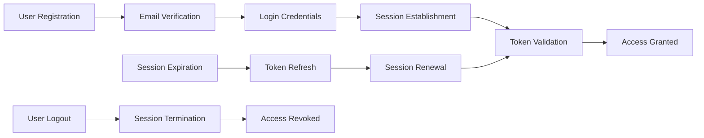
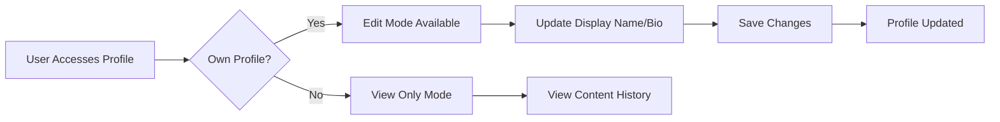
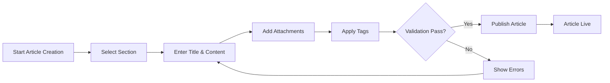
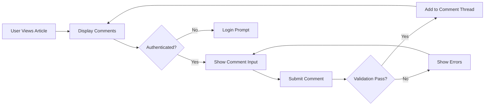

# Economic/Political Discussion Board - Complete Requirements Specification

## Executive Summary

This document provides comprehensive business requirements for an Economic/Political Discussion Board platform. The system enables authenticated users to participate in structured discussions across organized sections, with robust content creation, moderation, and administrative capabilities.

### Business Model

**Why This Service Exists**
The platform addresses the need for structured, moderated discussion spaces for economic and political topics where users can engage in meaningful discourse while maintaining content quality through administrative oversight.

**Revenue Strategy**
Initial focus on user adoption and engagement metrics with potential future monetization through premium features, sponsored sections, or advertising partnerships.

**Growth Plan**
Target acquisition of academic, professional, and engaged citizen users interested in economic and political discourse through content quality and community moderation.

**Success Metrics**
- User registration and retention rates
- Content creation frequency and engagement metrics
- Section participation statistics
- Administrative efficiency in content moderation

## User Actors and Authentication Requirements

### User Actor Definitions

#### Regular User
- Authenticated member who can create content, participate in discussions
- Can submit administrator promotion requests
- Subject to standard content moderation

#### Administrator
- Elevated privileges for content and user management
- Can manage sections, moderate content, ban users
- Requires supervision from super administrators

#### Super Administrator
- Highest authority level with ultimate system control
- Can promote/demote administrators
- Has complete system oversight capabilities

### Authentication System Requirements

**Core Authentication Functions**

**EARS Requirements:**
- WHEN a user attempts to register, THE system SHALL validate email format and password strength requirements
- WHEN a user logs in with valid credentials, THE system SHALL create authenticated session with appropriate permissions
- WHEN a user requests password change, THE system SHALL verify current password and update credentials
- WHEN a user initiates account deletion, THE system SHALL permanently remove all user data including articles and comments
- THE system SHALL maintain user sessions securely with configurable timeout periods
- THE system SHALL prevent banned users from accessing authenticated features

**Session Management**
- THE user session SHALL expire after 30 minutes of inactivity
- JWT tokens SHALL include user ID, role, and permissions array in payload
- Refresh tokens SHALL have 7-day expiration for seamless session continuation

## User Profile Management Requirements

### Profile Data Structure
- Each user profile SHALL contain display name and biographical text
- Profiles SHALL display user-created content statistics
- Profile viewing SHALL be accessible to all authenticated users

### Profile Management Functions
- WHEN a user edits their profile, THE system SHALL validate display name length and content restrictions
- THE system SHALL display comprehensive user activity including article and comment history
- Profile updates SHALL be reflected immediately across all user content displays

## Section Management Requirements

### Section Structure
- Each section SHALL have unique name and descriptive text
- Sections SHALL be organized categorically (Politics, Economy, Current Affairs)
- Section creation and modification SHALL be restricted to administrators

### Section Access Requirements
- WHEN a user browses the platform, THE system SHALL display available sections
- THE system SHALL allow users to view article listings within specific sections
- Section reorganization SHALL require super administrator approval

## Article Management Requirements

### Article Creation Process
- WHEN a user creates an article, THE system SHALL require title, content text, and section selection
- THE system SHALL support multiple file and image attachments per article
- Users SHALL be able to add free-text tags to categorize content
- Article editing SHALL be restricted to original authors and administrators

### Content Requirements
- Article titles SHALL have minimum 5-character and maximum 200-character limits
- Article content SHALL support rich text formatting with security validation
- File attachments SHALL have size restrictions and type validation
- Tag input SHALL support multiple comma-separated values with character limits

## Article Browsing and Search Requirements

### Listing and Pagination
- THE system SHALL display article lists with title, author, tags, comment count, and timestamp
- Article lists SHALL NOT display full content in summary views
- Pagination SHALL support configurable page sizes with navigation controls

### Sorting and Filtering
- WHEN viewing article lists, THE system SHALL provide newest-first and oldest-first sorting options
- THE system SHALL enable search functionality across article titles and content
- Tag-based filtering SHALL allow users to narrow article listings

### Search Functionality
- THE system SHALL implement full-text search across article titles and content
- Search results SHALL maintain pagination and sorting consistency
- WHERE multiple tags are selected, THE system SHALL apply AND logic for filtering

## Comment System Requirements

### Comment Structure
- Comments SHALL be single-level only without nested reply functionality
- Each comment SHALL display author, content, and creation timestamp
- Comment editing SHALL be restricted to original authors and administrators

### Comment Management
- WHEN a user views an article, THE system SHALL display all associated comments
- Comments SHALL be sorted chronologically with oldest comments first
- THE system SHALL prevent comment spam through rate limiting and content validation

## Administrator System Requirements

### Promotion Process
- WHEN a user requests administrator status, THE system SHALL require justification text
- Super administrators SHALL review pending requests with approve/reject capability
- WHERE promotion is approved, THE system SHALL update user role and permissions

### Administrator Hierarchy
- THE system SHALL maintain two administrator levels: regular and super administrator
- Super administrators SHALL have authority to promote/demote other administrators
- Self-demotion prevention SHALL be enforced for super administrators

### Administrative Capabilities
- Administrators SHALL retain all regular user functionality plus moderation tools
- Section management SHALL include create, edit, and delete operations
- Content moderation SHALL allow article and comment removal across all users
- User management SHALL include ban/unban functionality with reason tracking

## Banning System Requirements

### Banning Process
- WHEN an administrator bans a user, THE system SHALL record detailed reason
- Banned users SHALL be prevented from logging in and accessing authenticated features
- Existing content from banned users SHALL remain visible with banned status indication

### Ban Management
- Administrators SHALL maintain viewable ban records with reasons and dates
- Unbanning process SHALL restore user access while preserving ban history
- Ban duration tracking SHALL support temporary and permanent ban scenarios

## Business Rules and Constraints

### Content Validation Rules
- Article titles SHALL be unique within each section to prevent duplication
- User display names SHALL be unique across the platform
- Content moderation SHALL follow predefined guidelines for appropriate discourse

### Performance Requirements
- Article listings SHALL load within 2 seconds for typical database sizes
- Search functionality SHALL return results within 3 seconds for common queries
- Comment display SHALL be instantaneous for articles with up to 100 comments

### Security Requirements
- User authentication SHALL enforce strong password policies
- File uploads SHALL undergo malware scanning and type verification
- Administrative actions SHALL be logged for audit purposes

## Error Handling Requirements

### User-Facing Error Scenarios
- WHEN authentication fails, THE system SHALL provide clear error messages without security details
- WHERE content validation fails, THE system SHALL indicate specific field requirements
- IF system errors occur, THE system SHALL maintain graceful degradation with user notifications

## Success Criteria

### Functional Validation
- All user registration and authentication workflows SHALL function correctly
- Content creation and management SHALL maintain data integrity and permissions
- Administrative functions SHALL enforce proper role-based access control

### User Experience Metrics
- System responsiveness SHALL meet specified performance requirements
- Content discovery through browsing and search SHALL be intuitive and efficient
- Administrative tools SHALL provide comprehensive moderation capabilities

This document defines **business requirements only**. All technical implementations (architecture, APIs, database design, etc.) are at the discretion of the development team.