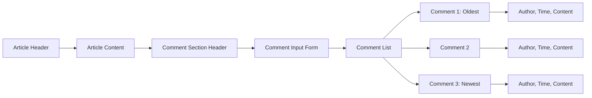

# Comment System Requirements for Economic/Political Discussion Board

## Document Overview
This document specifies the comprehensive requirements for the comment system functionality within the Economic/Political Discussion Board. The comment system enables users to engage in discussions on articles while maintaining a structured, single-level commenting architecture.

## Comment Creation Process

### Comment Creation Authorization
- WHEN a user views an article, THE system SHALL display a comment input form for authenticated users
- WHERE a user is not authenticated (guest), THE system SHALL hide the comment input form
- THE comment creation interface SHALL be clearly distinguishable from article content

### Comment Content Requirements
- **Required Fields**:
  - Comment content/text (minimum 1 character, maximum 10,000 characters)
  - Article ID association (automatically linked to current article)
  - Author ID (automatically associated with authenticated user)
- **Content Validation**:
  - WHEN a user submits a comment, THE system SHALL validate that content is not empty
  - IF comment content contains malicious code or scripts, THEN THE system SHALL reject the submission
  - THE comment content SHALL support basic text formatting (line breaks, paragraphs)

### Submission Process
- WHEN a user submits a comment, THE system SHALL immediately display a loading indicator
- IF the comment submission succeeds, THEN THE system SHALL:
  - Add the comment to the visible comment list
  - Clear the comment input form
  - Update the article's comment count
- IF the comment submission fails, THEN THE system SHALL display an appropriate error message

## Comment Display Requirements

### Comment Visibility Rules
- THE system SHALL display all approved comments on article pages
- WHILE viewing an article, THE system SHALL load comments automatically
- Banned users' comments SHALL remain visible unless manually deleted by administrators

### Comment Information Display
Each displayed comment SHALL show:
- Author's display name (linked to user profile)
- Comment content
- Timestamp of creation (formatted as "X minutes/hours/days ago")
- Edit/delete controls (for comment author and administrators)

### Comment Sorting
- THE system SHALL display comments sorted by creation time, oldest first
- THE comment sequence SHALL maintain chronological order
- Newly added comments SHALL appear at the bottom of the comment list

## Comment Layout Structure

## Single-Level Comment Architecture

### Structural Constraints
- THE comment system SHALL implement single-level comments only
- Comments SHALL NOT support nested replies or threading
- Each comment SHALL exist as an independent entity directly associated with the article

### Benefits of Single-Level Structure
- Simplified user interface and navigation
- Consistent chronological ordering
- Reduced complexity for moderation
- Clear attribution and accountability

## Comment Editing and Deletion

### Author Editing Capabilities
- WHEN a comment author views their own comment, THE system SHALL display edit controls
- Authors SHALL be able to edit their comments within 24 hours of creation
- AFTER 24 hours, THE system SHALL disable editing for regular users
- Administrators SHALL retain editing capabilities for all comments regardless of age

### Editing Process
- WHEN a user clicks edit, THE system SHALL transform the comment display into an editable text area
- THE system SHALL preserve the original comment content during editing
- Users SHALL be able to cancel editing and revert to original content

### Deletion Rules
- Comment authors SHALL be able to delete their own comments at any time
- WHEN a comment is deleted by its author, THE system SHALL:
  - Immediately remove the comment from public view
  - Update the article's comment count
  - Maintain deletion record for audit purposes

## Administrator Moderation Capabilities

### Comment Management Privileges
- Administrators SHALL be able to view all comments on the platform
- Administrators SHALL have edit and delete capabilities for any comment
- Super administrators SHALL have identical comment management privileges

### Moderation Workflow
- WHEN an administrator edits a comment, THE system SHALL record the modification with timestamp and administrator ID
- IF an administrator deletes a comment, THEN THE system SHALL:
  - Remove the comment immediately
  - Record the deletion reason (optional)
  - Notify the comment author of the deletion (if policy requires)

### Bulk Moderation
- Administrators SHALL be able to select multiple comments for bulk actions
- Bulk actions SHALL include: delete selected comments, approve/report management

## Performance and Scalability Requirements

### Comment Loading Performance
- WHEN loading an article page, THE system SHALL load comments within 2 seconds
- THE comment list SHALL support pagination for articles with large numbers of comments
- IF an article has more than 50 comments, THEN THE system SHALL implement pagination

### Pagination Implementation
- Comments SHALL be paginated with 50 comments per page
- Users SHALL be able to navigate between comment pages
- THE pagination interface SHALL clearly indicate current page and total pages

### Real-time Updates (Optional Enhancement)
- WHERE real-time functionality is implemented, THE system SHALL update comment counts without page refresh
- New comments SHALL appear automatically for users viewing the article

## Error Handling and Validation

### Comment Submission Errors
- IF network connectivity is lost during comment submission, THEN THE system SHALL:
  - Display a connection error message
  - Preserve the comment content in draft state
  - Allow retry when connection is restored
- IF comment validation fails, THEN THE system SHALL:
  - Highlight the specific validation error
  - Preserve the entered content
  - Provide clear error message explaining the issue

### Permission Errors
- IF a user attempts to edit a comment they don't own, THEN THE system SHALL deny access
- IF a non-administrator attempts to moderate comments, THEN THE system SHALL display permission denied message

## Integration Requirements

### User Profile Integration
- Each comment SHALL link to the author's user profile
- WHEN viewing a user profile, THE system SHALL display their comment history
- Comment counts SHALL contribute to user activity metrics

### Article Integration
- Each article SHALL display accurate comment counts
- Comment creation SHALL increment the article's comment counter
- Comment deletion SHALL decrement the article's comment counter

### Notification System Integration (Future Enhancement)
- WHERE notification features are implemented, THE system SHALL notify article authors of new comments
- Users SHALL be able to receive notifications for comments on their articles

## Security and Privacy Requirements

### Content Security
- THE system SHALL sanitize all comment content to prevent XSS attacks
- Comment content SHALL be stored with proper encoding to prevent injection attacks
- User input SHALL be validated both client-side and server-side

### Privacy Considerations
- Comment authors' email addresses SHALL NOT be exposed in comment displays
- User activity through comments SHALL respect privacy settings
- Comment deletion SHALL comply with data retention policies

## Business Rules and Constraints

### Comment Moderation Policy
- THE system SHALL support automated content filtering for inappropriate language
- Administrators SHALL have tools to quickly identify and manage problematic comments
- Comment reporting functionality SHALL be available for community moderation

### Rate Limiting
- Users SHALL be limited to 10 comments per minute to prevent spam
- Administrators SHALL be exempt from rate limiting for moderation purposes

### Data Retention
- Deleted comments SHALL be retained in database archives for 30 days
- AFTER 30 days, THE system SHALL permanently remove deleted comments

## Success Metrics

### Performance Metrics
- Comment submission success rate: 99.9%
- Comment loading time: under 2 seconds for 50 comments
- Comment edit response time: under 1 second

### User Engagement Metrics
- Average comments per article: target 5+ comments
- User comment participation rate: target 25% of authenticated users
- Comment response time (first comment on new article): target under 1 hour

> *Developer Note: This document defines **business requirements only**. All technical implementations (architecture, APIs, database design, etc.) are at the discretion of the development team.*