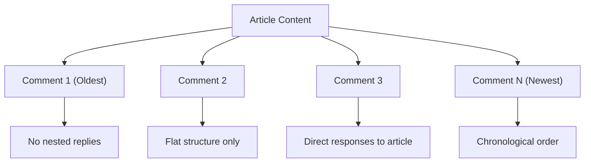
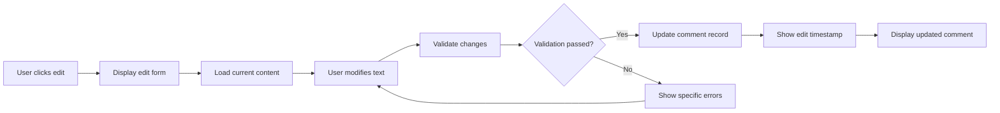
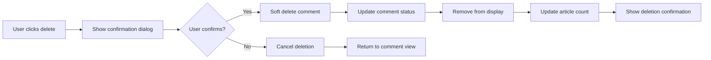
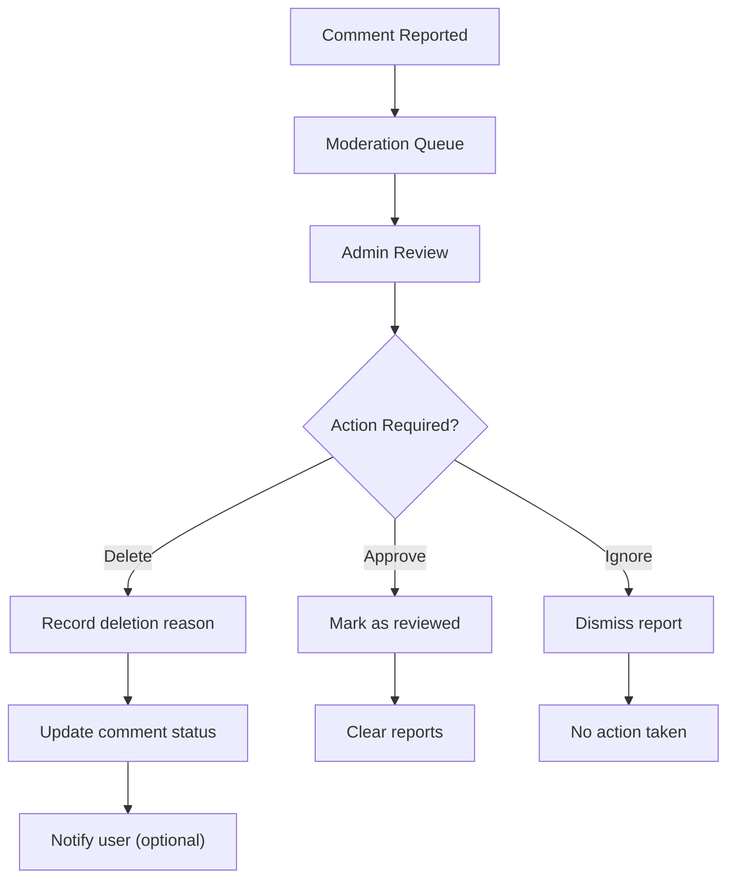
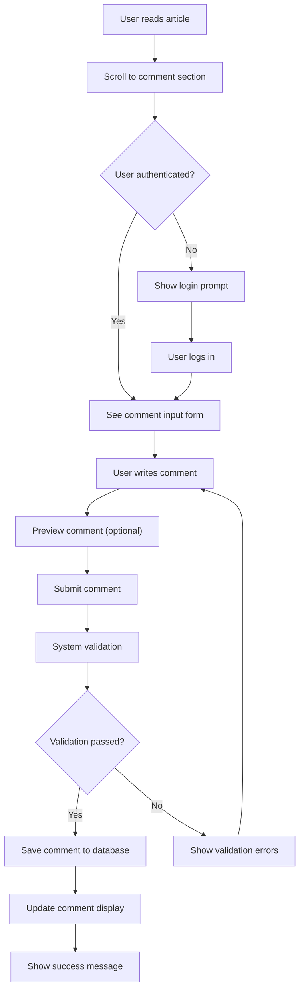
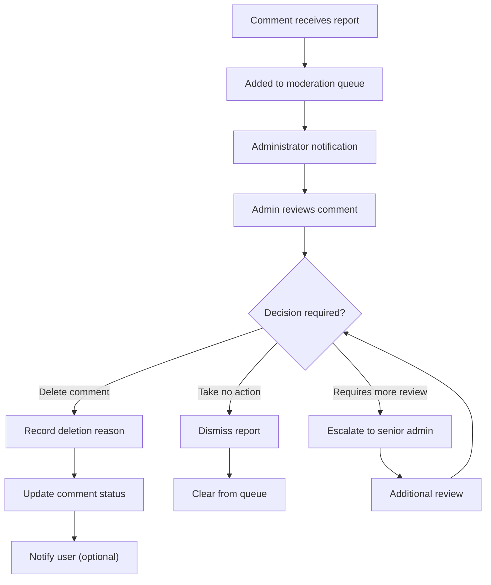

# Comment System Requirements Specification

## Executive Summary

This document defines the complete requirements for the comment system within the Economic/Political Discussion Board platform. The comment system enables authenticated users to engage in meaningful discussions on articles covering economic and political topics, providing a structured environment for substantive discourse while maintaining content quality through appropriate moderation controls.

## Comment Creation Requirements

### Comment Creation Process

**WHEN** a user views an article, **THE** system **SHALL** display a comment input form below the article content.

**WHEN** a user submits a comment, **THE** system **SHALL** validate the following requirements:
- The user must be authenticated with valid session credentials
- The comment content must contain at least 1 character and not exceed 1,000 characters
- The article being commented on must exist and be accessible to the user
- The user must not be banned or restricted from commenting

**IF** validation fails, **THEN THE** system **SHALL** display specific error messages indicating the reason for rejection.

**WHEN** validation passes, **THEN THE** system **SHALL**:
- Create a new comment record with unique identifier
- Associate the comment with the current user and target article
- Record the creation timestamp with millisecond precision
- Update the article's comment count immediately
- Display the new comment in the comment list without page refresh
- Send notification to the article author (if notifications are enabled)

### Comment Data Structure

Each comment **SHALL** maintain the following comprehensive data structure:

**Required Fields:**
- Comment ID (UUID v4 format)
- Article ID (foreign key reference)
- Author ID (foreign key reference to user)
- Content (plain text, Unicode supported)
- Creation timestamp (ISO 8601 format)
- Last modification timestamp (ISO 8601 format)
- Status (active, deleted, moderated)

**Optional Fields:**
- Edit history (array of previous versions)
- Moderation flags (if applicable)
- Report count (number of times comment was reported)

### Content Validation Rules

**THE** system **SHALL** enforce the following content validation rules:
- Minimum comment length: 1 character (prevents empty submissions)
- Maximum comment length: 1,000 characters (prevents excessive content)
- Prohibition of HTML tags and JavaScript code (security protection)
- Automatic trimming of leading and trailing whitespace
- Validation against prohibited content patterns (profanity, spam markers)
- Character encoding validation (UTF-8 compliance)

## Comment Display and Organization

### Comment Display Format

**WHEN** viewing an article, **THE** system **SHALL** display all active comments associated with that article.

Each displayed comment **SHALL** include the following information:
- Author's display name (clickable link to user profile)
- Author's avatar or profile picture (if available)
- Comment content with preserved line breaks and formatting
- Time posted (formatted as relative time, e.g., "2 hours ago")
- Edit and delete controls (visible only to comment author and administrators)
- Report button (for inappropriate content reporting)

### Comment Sorting and Organization

**THE** system **SHALL** implement single-level comment structure with the following characteristics:

**Sorting Requirements:**
- Comments **SHALL** be displayed in chronological order with oldest comments first
- New comments **SHALL** be appended to the bottom of the comment list
- Comment order **SHALL** remain consistent during user browsing sessions
- Pagination **SHALL** be implemented for articles with more than 50 comments

### Pagination Implementation

**WHEN** an article has more than 50 comments, **THE** system **SHALL**:
- Display comments in pages of 50 comments each
- Provide clear navigation controls (previous/next page links)
- Show current page position and total page count
- Maintain scroll position when navigating between pages
- Load subsequent pages via AJAX for seamless user experience

## Comment Editing and Deletion

### User Comment Management

**WHEN** a user views their own comment, **THE** system **SHALL** display edit and delete controls.

**Comment Editing Workflow:**

**Editing Requirements:**
- Users **SHALL** be able to edit their comments within 24 hours of creation
- Each edit **SHALL** create a new version in the edit history
- The modification timestamp **SHALL** be updated for each edit
- Other users **SHALL** see that the comment has been edited

**Comment Deletion Workflow:**

**Deletion Requirements:**
- Comment deletion **SHALL** be a soft delete (mark as deleted rather than physical removal)
- Deleted comments **SHALL** remain in the database for audit purposes
- Only the comment author and administrators **SHALL** be able to view deleted comments
- Article comment counts **SHALL** be updated immediately after deletion

### Administrative Comment Management

**WHEN** administrators view comments, **THE** system **SHALL** provide comprehensive moderation tools.

**Administrator Capabilities:**
- Delete any comment regardless of authorship
- View complete comment history including edits
- Access user information for each comment
- Bulk moderation actions for multiple comments
- Comment restoration capabilities for mistaken deletions

## Moderation and Administrative Controls

### Moderation Interface Requirements

**THE** system **SHALL** provide administrators with a dedicated moderation interface featuring:

**Moderation Dashboard:**
- Real-time list of recently reported comments
- Filtering options by user, article, or report type
- Bulk action capabilities for efficient moderation
- Search functionality across all comments

**Individual Comment Moderation:**
- Full comment context with article reference
- User history and previous moderation actions
- Reason selection for moderation actions
- Option to notify user of moderation decision

### Automated Moderation Features

**THE** system **SHALL** implement automated moderation checks including:
- Rate limiting to prevent comment spam
- Content similarity detection for duplicate comments
- Profanity filtering with configurable sensitivity
- URL and link validation for security
- Pattern matching for common spam indicators

### Moderation Workflow

**WHEN** an administrator moderates a comment, **THE** system **SHALL**:

## Business Rules and Constraints

### Content Ownership Rules

**THE** system **SHALL** enforce strict content ownership principles:
- Users can only edit their own comments
- Users can only delete their own comments
- Comment authorship cannot be transferred
- Deleted comments are permanently removed from public view

### Moderation Policy Enforcement

**THE** system **SHALL** implement the following moderation policies:
- Comments must adhere to community guidelines
- Hate speech, harassment, and threats are strictly prohibited
- Commercial advertising and spam are not allowed
- Copyright infringement will result in immediate removal

### Performance Constraints

**THE** system **SHALL** maintain performance under the following conditions:
- Loading comments for articles with up to 500 comments within 2 seconds
- Comment submission processing within 500 milliseconds
- Simultaneous comment creation by up to 100 users
- Efficient pagination for articles with thousands of comments

## Performance Requirements

### Response Time Expectations

**THE** system **SHALL** achieve the following performance benchmarks:
- Comment display: Within 1 second for typical articles
- Comment submission: Within 500 milliseconds
- Comment editing: Within 300 milliseconds
- Bulk moderation actions: Within 2 seconds for 50 comments

### Scalability Requirements

**THE** system **SHALL** support:
- Up to 1,000 concurrent comment submissions
- Articles with up to 10,000 comments
- Efficient comment retrieval through database indexing
- Caching mechanisms for frequently accessed comment threads

### Database Performance

**THE** system **SHALL** implement:
- Proper indexing on comment tables for fast retrieval
- Efficient foreign key relationships between comments, users, and articles
- Database connection pooling for high concurrent usage
- Query optimization for comment sorting and filtering

## Security Requirements

### Content Security

**THE** system **SHALL** implement comprehensive security measures:
- Input sanitization to prevent XSS attacks
- Content validation to block malicious code
- File upload scanning for attached content
- Rate limiting to prevent comment spam

### Authentication Security

**WHEN** handling comment operations, **THE** system **SHALL**:
- Verify user authentication for all comment actions
- Validate session integrity during comment submission
- Implement CSRF protection for comment forms
- Log security-related events for monitoring

### Data Protection

**THE** system **SHALL** ensure:
- Comment data is encrypted in transit (HTTPS)
- User information is protected according to privacy policies
- Audit trails are maintained for moderation actions
- Data retention policies are followed for deleted comments

## User Workflows

### Complete Comment Creation Journey

### Comment Moderation Workflow

## Error Handling Scenarios

### Comment Submission Errors

**IF** a user attempts to submit an empty comment, **THEN THE** system **SHALL**:
- Display error message: "Comment cannot be empty"
- Highlight the comment input field
- Maintain the user's session and article context

**IF** a user exceeds the character limit, **THEN THE** system **SHALL**:
- Display current character count and limit
- Prevent submission until within limits
- Provide truncation suggestion if applicable

**IF** the system experiences high load during submission, **THEN THE** system **SHALL**:
- Queue the comment for processing
- Show processing status to the user
- Retry submission automatically
- Provide fallback mechanism if persistent failure

### Authentication-Related Errors

**IF** a user's session expires during comment editing, **THEN THE** system **SHALL**:
- Save draft comment content locally
- Prompt user to re-authenticate
- Restore draft after successful login
- Preserve editing context

**IF** a banned user attempts to comment, **THEN THE** system **SHALL**:
- Display appropriate ban notification
- Log the attempt for administrative review
- Prevent any comment submission
- Provide ban appeal information if applicable

## Integration Requirements

### User Profile Integration

**THE** comment system **SHALL** integrate seamlessly with user profiles:
- Comment author names link to user profiles
- User profile pages display comment history
- Comment counts contribute to user activity metrics
- Profile updates reflect immediately in comment displays

### Article System Integration

**THE** comment system **SHALL** maintain strong integration with articles:
- Comment counts update article metadata in real-time
- Article deletion triggers cascading comment removal
- Comment references validate article existence
- Article access controls apply to comment visibility

### Notification System Integration

**WHERE** notifications are implemented, **THE** system **SHALL** provide:
- Notifications to article authors for new comments
- Moderation notifications for reported content
- User notifications for comment responses (if threading added)
- Administrative alerts for moderation queue status

## Future Considerations

### Enhanced Comment Features

While the current system implements single-level commenting, future enhancements could include:

**Comment Threading Support:**
- Nested reply functionality
- Thread collapse/expand controls
- Quote referencing for context
- Thread notification systems

**Advanced Comment Features:**
- Comment voting and reputation systems
- Rich text formatting options
- File and image attachments in comments
- Comment search across multiple articles

### Moderation Enhancements

**Future moderation improvements could include:**
- AI-powered content moderation assistance
- Community moderation through user voting
- Automated toxicity detection
- Advanced spam filtering algorithms

### Performance Optimizations

**Scalability improvements for future growth:**
- Distributed comment storage architecture
- Advanced caching strategies for popular articles
- Real-time comment streaming for high-traffic discussions
- Database sharding for massive comment volumes

## Success Criteria

### Functional Validation

**THE** comment system **SHALL** be considered successful when:
- Users can seamlessly create, edit, and delete comments
- Comment display performs efficiently under all conditions
- Moderation tools provide comprehensive administrative control
- Integration with other system components works flawlessly

### User Experience Metrics

**Success metrics for user experience include:**
- Comment submission success rate > 99%
- Average comment load time < 1 second
- User satisfaction with comment interface > 4/5 stars
- Moderation response time < 30 minutes for reported comments

### Technical Performance Indicators

**System performance success criteria:**
- Database query performance under load conditions
- Concurrent user support without degradation
- Error rate below 0.1% for comment operations
- Uptime availability > 99.9% for comment functionality

This comprehensive specification provides backend developers with all necessary business requirements to implement a robust, scalable, and user-friendly comment system for the Economic/Political Discussion Board platform. The requirements ensure that the comment functionality supports meaningful discourse while maintaining platform integrity and performance standards.

> *Developer Note: This document defines **business requirements only**. All technical implementations (architecture, APIs, database design, etc.) are at the discretion of the development team.*