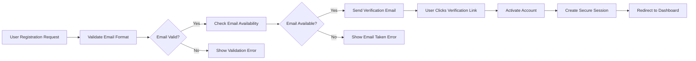
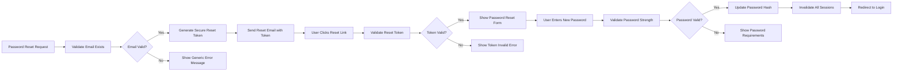
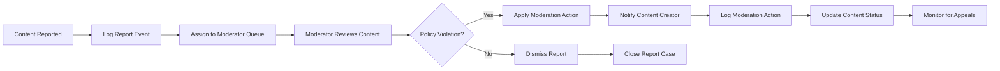

# Security and Privacy Requirements for Economic/Political Discussion Board

## Document Overview

This document defines the security and privacy requirements for the simple economic/political discussion board platform. The requirements focus on business-level security needs, user privacy expectations, and content protection mechanisms that ensure a safe and trustworthy discussion environment.

## Authentication Security Requirements

### User Authentication Flow

**WHEN** a user attempts to register for the discussion board, **THE** system **SHALL** require email verification before account activation.

**WHEN** a user logs in with valid credentials, **THE** system **SHALL** create a secure session that expires after 30 days of inactivity.

**WHEN** a user enters incorrect login credentials three times within 5 minutes, **THE** system **SHALL** temporarily lock the account for 15 minutes.

**WHEN** a user logs out or their session expires, **THE** system **SHALL** immediately invalidate their authentication token.

### Permission-Based Access Control

**WHILE** a user is authenticated as a guest, **THE** system **SHALL** restrict access to read-only browsing of public discussions.

**WHILE** a user is authenticated as a member, **THE** system **SHALL** grant permissions to create posts, upload attachments, and comment on discussions.

**WHILE** a user is authenticated as a moderator, **THE** system **SHALL** provide administrative access to manage content, moderate discussions, and handle user reports.

**IF** an unauthorized user attempts to access moderator functions, **THEN THE** system **SHALL** deny access and log the security event.

### Session Management

**THE** system **SHALL** maintain user sessions using secure tokens that include user role information.

**WHEN** a user changes their password, **THE** system **SHALL** invalidate all existing sessions for that user account.

**WHERE** sensitive operations are performed, **THE** system **SHALL** require re-authentication.

## Data Privacy Requirements

### User Information Protection

**THE** system **SHALL** protect user email addresses from public visibility to other users.

**WHEN** storing user data, **THE** system **SHALL** encrypt sensitive personal information at rest.

**WHEN** transmitting user data over networks, **THE** system **SHALL** use secure encrypted connections.

### Privacy by Design

**THE** system **SHALL** minimize collection of personal data to only what is necessary for discussion board functionality.

**WHEN** a user deletes their account, **THE** system **SHALL** permanently remove their personal information within 30 days.

**WHERE** user analytics are collected, **THE** system **SHALL** anonymize data to protect individual privacy.

### Data Retention Policies

**THE** system **SHALL** retain user activity logs for 90 days for security monitoring purposes.

**WHEN** content is deleted by users or moderators, **THE** system **SHALL** remove associated metadata within 7 days.

## Content Security Requirements

### Attachment Security

**WHEN** users upload file attachments to posts, **THE** system **SHALL** scan files for malware and viruses.

**WHEN** image attachments are uploaded, **THE** system **SHALL** validate file formats and resize large images to prevent abuse.

**IF** a file attachment exceeds 10MB in size, **THEN THE** system **SHALL** reject the upload and notify the user.

**WHERE** file types pose security risks, **THE** system **SHALL** restrict uploads to approved formats only.

### Discussion Content Protection

**THE** system **SHALL** protect discussion content from unauthorized modification by users other than the original author.

**WHEN** content is reported for policy violations, **THE** system **SHALL** make it temporarily inaccessible pending moderator review.

**WHILE** content is under moderation review, **THE** system **SHALL** preserve the original content for audit purposes.

### Anti-Abuse Measures

**WHEN** a user attempts to post identical content multiple times within 1 hour, **THE** system **SHALL** rate-limit their posting capability.

**IF** automated posting behavior is detected, **THEN THE** system **SHALL** implement additional verification steps.

## User Data Protection

### Personal Information Security

**THE** system **SHALL** ensure that user passwords are stored using industry-standard hashing algorithms.

**WHEN** users reset their passwords, **THE** system **SHALL** require strong password criteria including minimum length and complexity.

**WHERE** users provide optional profile information, **THE** system **SHALL** make it clear what information is publicly visible.

### Communication Security

**WHEN** sending email notifications to users, **THE** system **SHALL** avoid including sensitive information in subject lines.

**WHEN** users receive password reset emails, **THE** system **SHALL** provide clear expiration timeframes for reset links.

## Compliance Requirements

### Basic Platform Standards

**THE** system **SHALL** comply with general data protection principles for user privacy.

**WHEN** handling user data, **THE** system **SHALL** provide transparency about data collection and usage.

**WHERE** legal requirements apply to discussion content, **THE** system **SHALL** implement appropriate content moderation mechanisms.

### Accessibility and Inclusion

**THE** system **SHALL** ensure that security measures do not create barriers for users with disabilities.

**WHEN** implementing security features, **THE** system **SHALL** consider diverse user needs and capabilities.

## Security Incident Handling

### Error Scenarios and User Communication

**WHEN** authentication fails due to invalid credentials, **THE** system **SHALL** display a generic error message without revealing whether the username or email exists.

**IF** a security breach is detected, **THEN THE** system **SHALL** immediately notify administrators and affected users.

**WHEN** users encounter access denied errors, **THE** system **SHALL** provide clear, user-friendly explanations of the restriction.

### Recovery Processes

**WHEN** users forget their passwords, **THE** system **SHALL** provide a secure self-service password reset process.

**IF** user accounts are compromised, **THEN THE** system **SHALL** allow administrators to temporarily suspend accounts and assist with recovery.

**WHERE** content is accidentally deleted, **THE** system **SHALL** provide reasonable recovery options based on backup availability.

### Security Monitoring

**THE** system **SHALL** log security-related events including failed login attempts, permission violations, and content moderation actions.

**WHEN** unusual activity patterns are detected, **THE** system **SHALL** alert administrators for investigation.

## Authentication Flow Diagrams

### User Registration Security Flow

### Password Reset Security Flow

### Content Moderation Security Flow

## Implementation Guidelines

### Security-First Approach

All security requirements should be implemented with a "security by design" philosophy, ensuring that protection mechanisms are integrated into the platform from the beginning rather than added as an afterthought.

### User Experience Balance

Security measures should be implemented in a way that maintains the simplicity and usability of the discussion board, avoiding unnecessary complexity that would detract from the user experience.

### Progressive Security

The system should implement security measures that scale appropriately with the platform's growth, starting with essential protections and enhancing security as the user base and content volume increase.

## Security Monitoring and Incident Response

### Real-time Security Monitoring

**THE** system **SHALL** monitor for suspicious activities including:
- Multiple failed login attempts from same IP address
- Unusual posting patterns indicating automated behavior
- Attempts to access restricted moderator functions
- Large volume of content reports from single user

**WHEN** suspicious activity is detected, **THE** system **SHALL**:
- Log detailed security events for investigation
- Alert administrators immediately for critical threats
- Implement temporary protective measures when necessary
- Provide clear audit trails for security analysis

### Incident Response Procedures

**IF** a security breach is confirmed, **THEN THE** system **SHALL**:
- Immediately isolate affected systems or accounts
- Preserve evidence for forensic analysis
- Notify affected users with clear guidance
- Implement remediation measures to prevent recurrence
- Conduct post-incident review and improvement planning

**WHEN** handling security incidents, **THE** team **SHALL**:
- Follow established incident response protocols
- Maintain clear communication with stakeholders
- Document all actions taken during incident response
- Learn from incidents to improve future security

## Data Protection and Privacy Compliance

### User Consent Management

**WHEN** collecting user data, **THE** system **SHALL**:
- Provide clear information about data usage
- Obtain explicit consent for data processing
- Allow users to withdraw consent easily
- Maintain records of consent for audit purposes

**WHERE** data processing changes occur, **THE** system **SHALL**:
- Notify users of changes in data handling
- Obtain renewed consent when required
- Provide options for data deletion or portability
- Maintain transparency in data practices

### Cross-Border Data Transfer

**IF** user data needs to be transferred across borders, **THEN THE** system **SHALL**:
- Ensure adequate data protection standards
- Implement appropriate safeguards for transfers
- Provide clear information about data locations
- Comply with relevant international data protection laws

## Security Testing Requirements

### Regular Security Assessments

**THE** system **SHALL** undergo regular security testing including:
- Vulnerability scanning and penetration testing
- Code review for security vulnerabilities
- Security architecture reviews
- Third-party security assessments

**WHEN** security vulnerabilities are identified, **THE** team **SHALL**:
- Prioritize fixes based on risk assessment
- Implement patches in timely manner
- Test fixes thoroughly before deployment
- Monitor for similar vulnerabilities in other components

### Security Training Requirements

**ALL** team members involved in development **SHALL** receive:
- Regular security awareness training
- Specific training on secure coding practices
- Incident response procedure training
- Updates on emerging security threats

## Business Continuity and Disaster Recovery

### Data Backup and Recovery

**THE** system **SHALL** implement comprehensive backup strategies including:
- Regular automated backups of all critical data
- Secure off-site storage of backup data
- Regular testing of backup restoration procedures
- Clear recovery time and recovery point objectives

**WHEN** data recovery is needed, **THE** system **SHALL**:
- Provide clear recovery procedures
- Maintain data integrity during restoration
- Minimize data loss through transaction logging
- Ensure business continuity during recovery operations

### System Resilience

**THE** system **SHALL** be designed for resilience including:
- Redundant components to prevent single points of failure
- Load balancing for high availability
- Graceful degradation during peak loads
- Automated failover mechanisms for critical services

> *Developer Note: This document defines **business requirements only**. All technical implementations (architecture, APIs, database design, etc.) are at the discretion of the development team.*