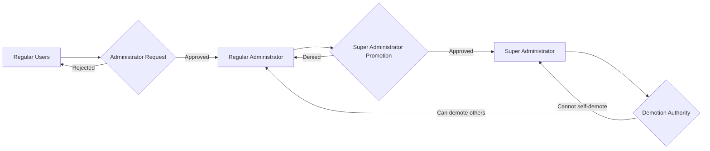
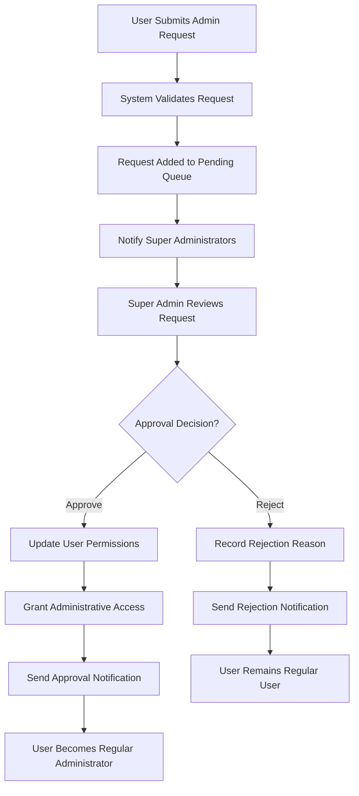
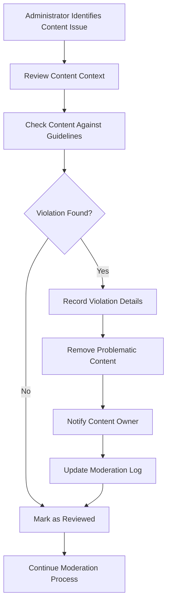
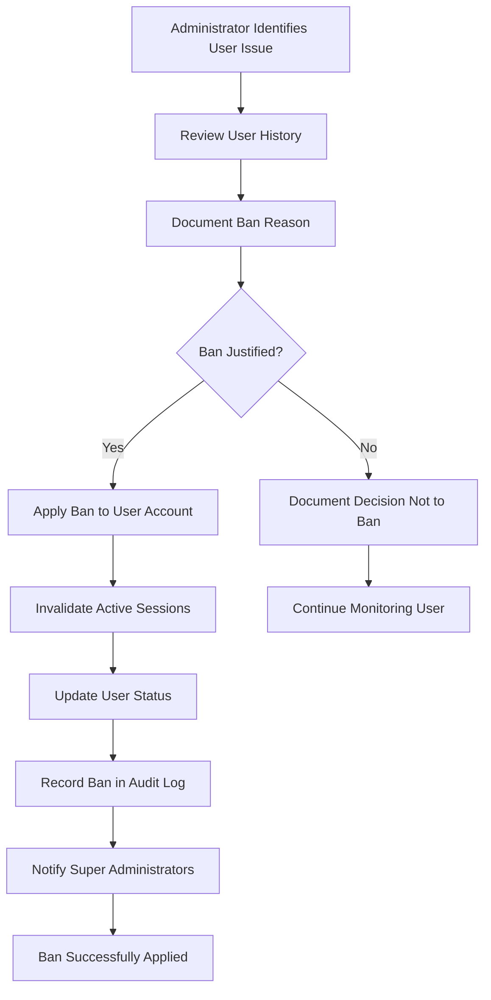

# Administrator System Requirements

## Document Overview
This document defines the complete administrator system for the Economic/Political Discussion Board. It specifies the administrator hierarchy, promotion processes, and administrative capabilities required to manage and moderate the discussion platform effectively.

## Administrator Hierarchy and Grades

### Administrator Role Definitions
The system implements a two-tier administrative hierarchy with distinct permission levels and responsibilities.

#### Regular Administrator Role
Regular administrators are users who have been promoted from regular user status with enhanced moderation capabilities.

**EARS Requirements:**
- WHEN a user is approved for administrator promotion, THE system SHALL grant regular administrator privileges
- THE regular administrator SHALL have all standard user capabilities plus administrative functions
- WHILE acting as a regular administrator, THE user SHALL be able to perform content moderation tasks
- IF a regular administrator attempts to perform super administrator functions, THEN THE system SHALL deny the action

#### Super Administrator Role
Super administrators hold the highest level of authority with ultimate system control capabilities.

**EARS Requirements:**
- THE super administrator SHALL have all regular administrator capabilities plus additional authority
- WHERE super administrator privileges are required, THE system SHALL grant access only to super administrators
- WHEN a super administrator performs administrative actions, THE system SHALL log the activity with administrative level
- WHILE a user holds super administrator status, THE system SHALL allow them to manage administrator hierarchy

### Administrator Hierarchy Structure
The administrator system follows a pyramid structure with clear reporting relationships and escalation paths.

**EARS Requirements:**
- THE administrator hierarchy SHALL maintain clear separation between regular and super administrator roles
- WHERE promotion authority is exercised, THE system SHALL require super administrator approval
- WHEN administrator roles change, THE system SHALL update user permissions immediately

## Administrator Promotion Process

### Promotion Request Submission
Users can request administrator status through a formal submission process.

**EARS Requirements:**
- WHEN a user submits an administrator promotion request, THE system SHALL require a written reason
- THE promotion request SHALL include the submitting user's identity and timestamp
- IF a user submits multiple promotion requests, THEN THE system SHALL track request history
- WHERE a pending request exists, THE system SHALL prevent duplicate submissions

### Request Review Workflow
Super administrators manage the review and approval process for promotion requests.

**EARS Requirements:**
- WHEN a promotion request is submitted, THE system SHALL notify all super administrators
- THE super administrator SHALL be able to view all pending promotion requests
- WHERE a request requires review, THE super administrator SHALL be able to approve or reject it
- WHEN a request is approved, THE system SHALL automatically promote the user to regular administrator
- IF a request is rejected, THEN THE system SHALL notify the requesting user with optional feedback

### Promotion Criteria and Conditions
The system enforces specific criteria for administrator promotions.

**EARS Requirements:**
- THE system SHALL require super administrator approval for all promotions to regular administrator
- WHERE super administrator promotion is considered, THE system SHALL require existing super administrator consensus
- WHEN promoting a regular administrator to super administrator, THE system SHALL log the promoting administrator
- IF promotion criteria are not met, THEN THE system SHALL prevent the promotion action

## Administrative Capabilities

### Section Management Functions
Administrators have exclusive authority to create and manage discussion sections.

**EARS Requirements:**
- WHEN an administrator creates a section, THE system SHALL require section name and description
- THE administrator SHALL be able to edit section names and descriptions
- WHERE section deletion is required, THE system SHALL allow administrators to remove sections
- IF a section contains articles, THEN THE system SHALL handle content preservation or deletion appropriately

### Content Moderation Authority
Administrators can moderate user-generated content across the platform.

**EARS Requirements:**
- THE administrator SHALL be able to delete any article regardless of authorship
- WHEN an administrator deletes an article, THE system SHALL remove all associated comments
- THE administrator SHALL be able to delete any comment on any article
- WHERE content moderation is performed, THE system SHALL log the moderator and action taken
- IF controversial content is identified, THEN THE administrator SHALL be able to remove it immediately

### User Management Capabilities
Administrators can manage user accounts and access permissions.

**EARS Requirements:**
- WHEN an administrator bans a user, THE system SHALL require a recorded reason
- THE administrator SHALL be able to view the list of all banned users
- WHERE user banning is implemented, THE system SHALL prevent banned users from logging in
- THE administrator SHALL be able to unban users with appropriate justification
- IF a user is banned, THEN their existing content SHALL remain visible on the platform

### Administrative Oversight Functions
Super administrators have additional oversight capabilities.

**EARS Requirements:**
- THE super administrator SHALL be able to promote regular administrators to super administrator status
- WHEN managing administrator hierarchy, THE super administrator SHALL be able to demote other super administrators
- WHERE demotion authority is exercised, THE system SHALL prevent self-demotion of super administrators
- THE super administrator SHALL have visibility into all administrative actions across the platform

## System Security and Constraints

### Administrative Action Auditing
All administrative actions are logged for security and accountability.

**EARS Requirements:**
- WHEN any administrative action is performed, THE system SHALL record the administrator, action, timestamp, and target
- THE system SHALL maintain an audit trail of all promotion and demotion actions
- WHERE content moderation occurs, THE system SHALL log the specific content modified or removed
- IF administrative actions are disputed, THEN THE audit trail SHALL provide evidence for review

### Self-Demotion Prevention
The system includes safeguards to prevent accidental loss of administrative oversight.

**EARS Requirements:**
- THE system SHALL prevent super administrators from demoting themselves
- WHEN a super administrator attempts self-demotion, THE system SHALL display an error message
- WHERE administrator hierarchy integrity is at risk, THE system SHALL require at least one active super administrator
- IF the last super administrator attempts self-demotion, THEN THE system SHALL prevent the action entirely

### Error Handling and Validation
The system includes comprehensive error handling for administrative functions.

**EARS Requirements:**
- WHEN invalid administrative actions are attempted, THE system SHALL provide clear error messages
- THE system SHALL validate all promotion and demotion requests before processing
- WHERE permission conflicts occur, THE system SHALL prioritize security over convenience
- IF administrative functions fail, THEN THE system SHALL maintain platform stability and data integrity

## Administrator Permission Matrix

| Action | Regular User | Regular Administrator | Super Administrator |
|--------|--------------|----------------------|---------------------|
| Create articles | ✅ | ✅ | ✅ |
| Write comments | ✅ | ✅ | ✅ |
| Edit profile | ✅ | ✅ | ✅ |
| Submit admin request | ✅ | ❌ | ❌ |
| Create sections | ❌ | ✅ | ✅ |
| Edit sections | ❌ | ✅ | ✅ |
| Delete sections | ❌ | ✅ | ✅ |
| Delete any article | ❌ | ✅ | ✅ |
| Delete any comment | ❌ | ✅ | ✅ |
| Ban users | ❌ | ✅ | ✅ |
| Unban users | ❌ | ✅ | ✅ |
| View ban list | ❌ | ✅ | ✅ |
| Approve admin requests | ❌ | ❌ | ✅ |
| Promote administrators | ❌ | ❌ | ✅ |
| Demote administrators | ❌ | ❌ | ✅ |

## Business Rules and Constraints

### Promotion Business Rules
- Administrator promotions must be justified with written reasons
- Super administrator promotions require careful consideration and consensus
- Promotion records must be maintained for audit purposes
- Users cannot request administrator status multiple times within a short period

### Moderation Constraints
- Content deletion should preserve platform integrity while respecting user contributions
- Banning decisions must include documented reasons for transparency
- Administrative actions should be reversible when appropriate
- Moderation policies should be consistently applied across all users

### Security Requirements
- Administrative accounts require enhanced security measures
- Audit trails must be tamper-resistant and comprehensive
- Permission escalation should follow principle of least privilege
- System must prevent administrative privilege abuse

## Administrative Workflows

### Complete Administrator Promotion Workflow

### Content Moderation Workflow

### User Banning Workflow

## Error Handling Scenarios

### Promotion Request Errors
- IF a user submits an invalid promotion request, THEN THE system SHALL reject the submission with specific error details
- WHEN promotion request validation fails, THE system SHALL preserve user input for correction
- WHERE duplicate requests are detected, THE system SHALL notify the user of existing pending request

### Administrative Action Errors
- IF an administrator attempts unauthorized actions, THE system SHALL log the attempt and deny access
- WHEN administrative functions encounter system errors, THE system SHALL maintain data integrity and provide error recovery
- WHERE audit logging fails, THE system SHALL prioritize security over logging completeness

### Permission Conflict Resolution
- IF conflicting permissions are detected during administrative actions, THE system SHALL apply conservative security measures
- WHEN permission hierarchies become inconsistent, THE system SHALL automatically escalate to super administrator review
- WHERE administrative actions affect multiple users, THE system SHALL ensure atomic transaction completion

## Performance Requirements

### Administrative Interface Performance
- THE system SHALL load administrator interfaces within 2 seconds under normal load
- WHEN managing large user lists, THE system SHALL implement efficient pagination with response times under 3 seconds
- Administrative actions SHALL complete within 5 seconds for typical operations

### Audit Log Performance
- THE system SHALL maintain audit log query performance with response times under 2 seconds for recent entries
- Historical audit data SHALL remain accessible with reasonable performance degradation for older records
- Audit log exports SHALL be available within 30 seconds for typical date ranges

## Integration Requirements

### Authentication System Integration
- THE administrator system SHALL integrate with user authentication to verify administrative privileges
- Role-based access control SHALL be consistently enforced across all administrative functions
- Permission changes SHALL be immediately reflected in user session management

### Content Management Integration
- Administrative content moderation SHALL maintain referential integrity with article and comment systems
- User banning actions SHALL synchronize with content access controls
- Section management SHALL integrate with article categorization and display systems

### Notification System Integration
- Promotion approvals and rejections SHALL trigger appropriate user notifications
- Content moderation actions SHALL notify affected users when appropriate
- System-wide administrative changes SHALL be communicated to relevant stakeholders

This document provides the complete business requirements for the administrator system. The implementation details, including specific API endpoints, database schemas, and technical architecture, are left to the discretion of the development team based on these business requirements.