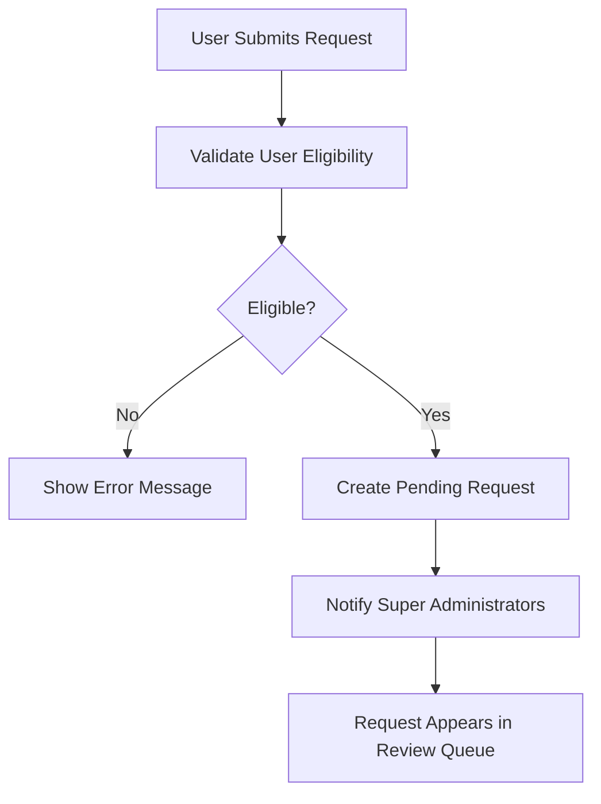
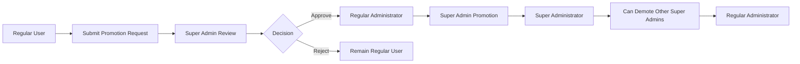

# Administrator System Requirements Specification

## Document Overview

This document provides comprehensive business requirements for the administrator system of the Economic/Political Discussion Board. The administrator system establishes a hierarchical governance structure that enables effective content moderation, user management, and platform administration while maintaining accountability and preventing abuse of power.

## Administrator Promotion Process

### Promotion Request Submission

WHEN a regular user wishes to become an administrator, THE system SHALL provide a dedicated interface for submitting administrator promotion requests.

**Request Submission Requirements:**
- THE user MUST be authenticated and have an active account status
- THE request interface SHALL require a reason text field with minimum 50 characters and maximum 500 characters
- THE system SHALL validate that the user does not have any pending promotion requests
- THE submission SHALL include a confirmation dialog to prevent accidental requests

**Request Processing Workflow:**

**Request Data Structure:**
- Request ID (unique identifier)
- User ID (requestor)
- Submission timestamp
- Reason text (50-500 characters)
- Status (pending, approved, rejected)
- Review timestamp (when processed)
- Reviewing administrator ID
- Review notes (optional)

### Promotion Request Review

WHEN a super administrator accesses the promotion request review interface, THE system SHALL display:
- List of all pending requests in chronological order
- For each request: user display name, request date, reason text
- Quick action buttons for approve/reject decisions
- Request statistics (total pending, average processing time)

**Approval Process:**
WHEN a super administrator approves a promotion request, THE system SHALL:
- Update the user's role from "user" to "admin"
- Record the approval with timestamp and approving administrator ID
- Send notification to the newly promoted administrator
- Remove the request from pending status
- Log the promotion event for audit purposes

**Rejection Process:**
WHEN a super administrator rejects a promotion request, THE system SHALL:
- Record the rejection with timestamp, rejecting administrator ID, and optional rejection reason
- Send notification to the user with rejection information
- Prevent the user from submitting new requests for 30 days
- Maintain rejection records for future reference

## Administrator Grades and Hierarchy

### Grade Definitions and Privileges

The system implements a two-tier administrator hierarchy with clearly defined privileges and responsibilities:

**Regular Administrator:**
- **Primary Role**: Content moderation and section management
- **Authentication Level**: Elevated privileges beyond regular users
- **Key Capabilities**:
  - Create, edit, and delete discussion sections
  - Delete any article regardless of ownership
  - Delete any comment regardless of ownership
  - Ban and unban users from the platform
  - View banned users list with corresponding reasons
- **Limitations**: Cannot promote other users or manage administrator grades

**Super Administrator:**
- **Primary Role**: System administration and user management
- **Authentication Level**: Highest privilege level
- **Additional Capabilities Beyond Regular Administrator**:
  - View pending administrator promotion requests
  - Approve or reject requests for administrator status
  - Promote regular administrators to super administrator
  - Demote other super administrators to regular administrator
  - Access system-wide configuration settings
- **Critical Constraint**: Cannot demote themselves (system protection)

### Hierarchy Management Workflow

### Promotion and Demotion Processes

**Promotion from Regular to Super Administrator:**
WHEN a super administrator promotes a regular administrator, THE system SHALL:
- Require explicit confirmation with risk acknowledgment
- Record the promotion with timestamp and promoting administrator ID
- Update the user's role from "admin" to "superAdmin"
- Notify the promoted user of their new privileges and responsibilities
- Log the promotion event for comprehensive audit trail

**Demotion from Super to Regular Administrator:**
WHEN a super administrator demotes another super administrator, THE system SHALL:
- Validate that the demoting administrator is not targeting themselves
- Require confirmation with detailed reason documentation
- Record the demotion with timestamp, demoting administrator ID, and demotion reason
- Update the user's role from "superAdmin" to "admin"
- Notify the demoted user with explanation and appeal process
- Maintain demotion records for compliance and accountability

## Administrator Capabilities Matrix

### Comprehensive Permission Framework

| Functionality | Regular User | Regular Administrator | Super Administrator |
|----------------|--------------|---------------------|-------------------|
| **Account Management** | | | |
| Register new account | ✅ | ❌ | ❌ |
| Login to platform | ✅ | ✅ | ✅ |
| Change password | ✅ | ✅ | ✅ |
| Delete own account | ✅ | ✅ | ✅ |
| **Content Creation** | | | |
| Create articles | ✅ | ✅ | ✅ |
| Edit own articles | ✅ | ✅ | ✅ |
| Delete own articles | ✅ | ✅ | ✅ |
| Create comments | ✅ | ✅ | ✅ |
| Edit own comments | ✅ | ✅ | ✅ |
| Delete own comments | ✅ | ✅ | ✅ |
| **Section Management** | | | |
| Create sections | ❌ | ✅ | ✅ |
| Edit sections | ❌ | ✅ | ✅ |
| Delete sections | ❌ | ✅ | ✅ |
| **Content Moderation** | | | |
| Delete any article | ❌ | ✅ | ✅ |
| Delete any comment | ❌ | ✅ | ✅ |
| **User Management** | | | |
| Ban users | ❌ | ✅ | ✅ |
| Unban users | ❌ | ✅ | ✅ |
| View banned users | ❌ | ✅ | ✅ |
| **Administrator Management** | | | |
| Submit admin request | ✅ | ❌ | ❌ |
| Approve admin requests | ❌ | ❌ | ✅ |
| Promote administrators | ❌ | ❌ | ✅ |
| Demote administrators | ❌ | ❌ | ✅ |

### Section Management Capabilities

**Section Creation Process:**
WHEN an administrator creates a new section, THE system SHALL:
- Validate section name uniqueness across the platform
- Require section name between 2-50 characters
- Require section description between 10-500 characters
- Record creation timestamp and administrator identity
- Make the section immediately available for article posting

**Section Modification Authority:**
Administrators SHALL have full CRUD (Create, Read, Update, Delete) capabilities for sections:
- Edit section names and descriptions while maintaining content integrity
- Delete sections with appropriate handling of existing articles
- Reorder sections for optimal user experience
- Export section data for analysis and reporting

### Content Moderation Workflows

**Article Moderation:**
WHEN an administrator moderates an article, THE system SHALL provide:
- Quick action buttons for common moderation tasks
- Detailed article information including author, creation date, content
- Moderation history showing previous actions
- Option to notify the author of moderation decisions

**Comment Moderation:**
Administrators SHALL be able to:
- View all comments on the platform with filtering capabilities
- Delete inappropriate comments with reason recording
- Bulk moderate comments for efficiency
- Access comment statistics for trend analysis

### User Management Functions

**Banning Process Implementation:**
WHEN an administrator bans a user, THE system SHALL:
- Require a ban reason with minimum 10 characters
- Provide ban duration options (permanent or temporary)
- Immediately revoke the user's authentication access
- Preserve the user's existing content with "banned user" attribution
- Record the ban with comprehensive audit information

**User Management Interface:**
THE administrator interface SHALL provide:
- Search and filter capabilities for user management
- User activity statistics and behavior patterns
- Quick access to user profiles and content history
- Export functionality for compliance reporting

## Authorization and Access Control

### Role-Based Access Enforcement

**Authentication Integration:**
THE administrator system SHALL integrate seamlessly with the platform's authentication system:
- JWT tokens SHALL include role information for immediate privilege verification
- Role changes SHALL be reflected in real-time across all system components
- Session management SHALL handle role transitions gracefully

**API Endpoint Protection:**
ALL administrative API endpoints SHALL implement:
- Role verification before processing requests
- Comprehensive logging of all administrative actions
- Rate limiting to prevent abuse of administrative functions
- Input validation to prevent security vulnerabilities

### Audit Trail Requirements

**Comprehensive Action Logging:**
THE system SHALL maintain detailed audit logs for all administrative actions including:
- Administrator identity and role at time of action
- Timestamp of the action
- Specific action performed with parameters
- Target user or content affected
- Outcome of the action (success/failure)
- IP address and user agent information

**Audit Log Access Control:**
- Regular administrators: Can view their own action logs
- Super administrators: Can view all administrative action logs
- Audit logs SHALL be immutable once written
- Log retention policy: Minimum 365 days for compliance

## Business Rules and Validation

### Promotion Request Limitations

**Request Frequency Controls:**
- Users can submit only one pending promotion request at a time
- After rejection, users must wait 30 days before submitting new requests
- Administrators cannot submit promotion requests (already elevated)

**Eligibility Requirements:**
- Minimum account age: 30 days
- Minimum article contribution: 10 articles
- Minimum comment contribution: 50 comments
- No active bans or disciplinary actions

### Administrator Count Management

**System Integrity Rules:**
- THE system SHALL maintain a minimum of one super administrator at all times
- IF the last super administrator attempts self-demotion, THE system SHALL prevent the action
- Administrator-to-user ratio SHALL be monitored with alerts for imbalance

**Content Preservation During Role Changes:**
WHEN an administrator is demoted or loses privileges:
- Their user-generated content SHALL remain intact
- Administrative actions they performed SHALL remain in audit logs
- Privilege revocation SHALL be immediate and comprehensive

## Performance and Scalability Requirements

### Response Time Expectations

**Administrative Interface Performance:**
- Administrator panel loading: ≤ 2 seconds
- Promotion request processing: ≤ 1 second
- User management operations: ≤ 500 milliseconds
- Content moderation actions: ≤ 1 second

**Scalability Considerations:**
- Support for up to 100 simultaneous administrator sessions
- Efficient performance with user base up to 10,000 regular users
- Audit log system capable of handling high-volume administrative activity

### Error Handling and Recovery

**Request Processing Failures:**
IF promotion request processing fails, THE system SHALL:
- Maintain request in pending status
- Notify super administrators of the failure
- Provide retry mechanisms with error diagnostics
- Preserve all request data for recovery

**Conflicting Operations Handling:**
WHEN multiple administrators attempt conflicting actions, THE system SHALL:
- Implement optimistic locking to prevent data corruption
- Provide clear conflict resolution messages
- Maintain transaction integrity across all operations

## Security Requirements

### Privilege Escalation Prevention

**Authorization Validation:**
ALL administrative actions SHALL undergo comprehensive authorization checks:
- Verify current role privileges before action execution
- Prevent privilege escalation through parameter manipulation
- Validate target permissions match requester privileges

### Abuse Prevention Mechanisms

**Rate Limiting Implementation:**
- Administrative actions SHALL be rate-limited to prevent abuse
- Bulk operations SHALL require additional verification
- Suspicious patterns SHALL trigger security alerts

**Multi-Factor Authentication Consideration:**
FOR sensitive administrative actions, THE system MAY require:
- Additional authentication verification
- Secondary approval from another administrator
- Time-delayed execution for high-impact operations

## Integration Requirements

### Notification System Integration

**Promotion Notification Workflow:**
WHEN administrator status changes occur, THE system SHALL:
- Send immediate notifications to affected users
- Provide detailed information about new privileges and responsibilities
- Include guidance on proper use of administrative powers

### Reporting System Integration

**Moderation Effectiveness Tracking:**
THE administrator system SHALL integrate with reporting functionality to:
- Track moderation action outcomes
- Measure administrator performance metrics
- Generate compliance and effectiveness reports

## Future Enhancement Considerations

### Advanced Moderation Features

**Potential Future Capabilities:**
- Automated content flagging based on machine learning
- Advanced user behavior analysis for proactive moderation
- Integrated communication tools for administrator coordination

### Internationalization Support

**Multi-language Administration:**
- Support for administrator interfaces in multiple languages
- Cultural adaptation of moderation guidelines
- Localized notification templates

## Compliance and Governance

### Data Protection Compliance

**Privacy and Security Standards:**
- Administrative actions SHALL comply with data protection regulations
- User data access SHALL be logged and monitored
- Export capabilities SHALL support legal compliance requirements

### Transparency and Accountability

**Administrator Conduct Guidelines:**
- Clear code of conduct for administrator behavior
- Regular review of administrative actions
- User feedback mechanisms for administrator performance

This comprehensive specification provides the complete business requirements for the administrator system, ensuring robust governance capabilities while maintaining platform integrity and user trust. The requirements focus exclusively on business logic and user workflows, leaving technical implementation decisions to the development team's expertise.