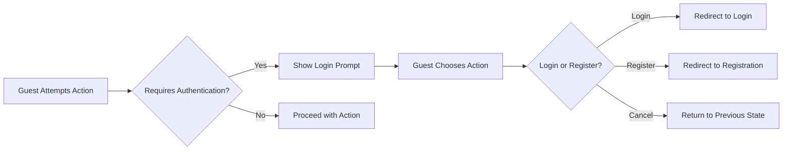
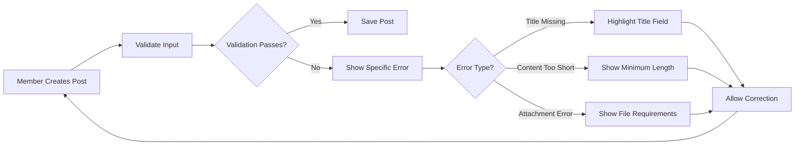
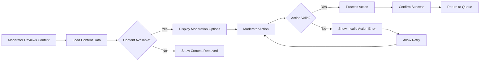
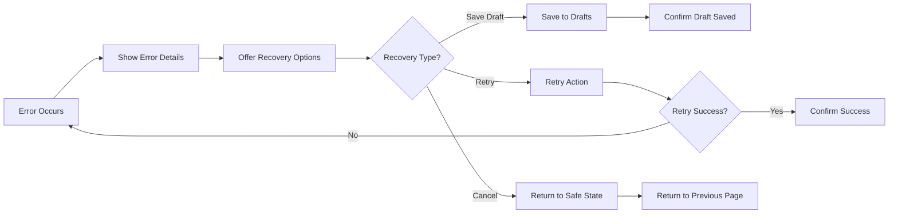

# Error Handling and User Support Requirements

## 1. Introduction and Overview

This document defines the comprehensive error handling and user support requirements for the economic/political discussion board platform. The primary goal is to ensure that users experience minimal disruption and receive clear guidance when errors occur, while maintaining the simplicity and straightforward nature of the platform as requested.

### Scope
- Complete error scenarios across all user journeys (guest, member, moderator)
- User-friendly error messaging and communication strategies
- Comprehensive recovery processes and troubleshooting guidance
- Support channels and escalation procedures
- Error prevention and quality assurance measures

### Business Objectives
- Minimize user frustration during error conditions
- Provide clear, actionable paths to resolution
- Maintain platform reliability and user trust
- Support users effectively with minimal complexity
- Ensure consistent error handling across all platform features

## 2. Error Scenarios by User Journey

### 2.1 Guest User Error Scenarios

#### Authentication and Access Errors

**EARS Requirements:**
- WHEN a guest attempts to create a post, THE system SHALL display a clear authentication prompt with registration and login options
- IF a guest attempts to access moderator-only content, THEN THE system SHALL show "Access Denied" message with explanation of required permissions
- WHERE content requires authentication, THE system SHALL provide clear registration/login options without losing user context
- WHEN a guest encounters authentication-related errors, THE system SHALL preserve their browsing state and return them to the same location after successful authentication

#### Content Access Errors
- WHEN a guest searches for content, THE system SHALL return appropriate results or "No Results Found" message with search optimization suggestions
- IF a guest attempts to view deleted or private content, THEN THE system SHALL show "Content Unavailable" message with alternative content suggestions
- WHILE browsing public content, THE system SHALL handle pagination errors gracefully by maintaining user position in content lists
- WHERE content loading fails due to network issues, THE system SHALL provide retry options with estimated wait times

### 2.2 Member User Error Scenarios

#### Content Creation Errors

**EARS Requirements:**
- WHEN a member submits a post with missing title, THE system SHALL highlight the title field with specific error message "Post title is required"
- IF a member attempts to upload an unsupported file type, THEN THE system SHALL show supported format list (JPG, PNG, PDF, DOC, TXT) with size limits
- WHILE uploading attachments, THE system SHALL provide real-time progress indication and handle timeout errors with automatic retry capability
- WHERE attachment exceeds size limit, THE system SHALL show maximum size requirement (images: 5MB, documents: 10MB) with file compression suggestions
- WHEN network connectivity is lost during post creation, THE system SHALL automatically save draft content and attempt recovery upon reconnection

#### Comment and Interaction Errors
- WHEN a member posts a comment, THE system SHALL validate content length (10-2000 characters) and format requirements
- IF a member attempts to edit someone else's content, THEN THE system SHALL show ownership error message "You can only edit your own content"
- WHILE interacting with posts, THE system SHALL handle concurrent modification conflicts with merge options or version comparison
- WHERE comment posting fails due to discussion locking, THE system SHALL provide moderator contact information and explanation

### 2.3 Moderator Error Scenarios

#### Content Moderation Errors

**EARS Requirements:**
- WHEN a moderator attempts to moderate already-processed content, THE system SHALL show status update "This content was already moderated by [moderator name] at [timestamp]"
- IF moderation action conflicts with another moderator, THEN THE system SHALL show conflict resolution options including action prioritization
- WHILE processing bulk moderation actions, THE system SHALL handle partial failures gracefully with individual error reporting for each item
- WHERE moderator action requires justification, THE system SHALL enforce justification input before proceeding with content removal

#### User Management Errors
- WHEN a moderator suspends a user, THE system SHALL confirm action and require specific reason selection from predefined categories
- IF moderator action lacks proper justification, THEN THE system SHALL require justification input with minimum 20-character requirement
- WHERE multiple moderators handle same case, THE system SHALL prevent duplicate actions with real-time synchronization
- WHEN user management actions affect ongoing discussions, THE system SHALL provide impact assessment and confirmation requirements

## 3. User-Friendly Error Messages

### 3.1 Message Design Principles

**Clear and Actionable Messages:**
- Use plain language appropriate for economic/political discussion context
- Provide specific guidance on how to resolve the error
- Include relevant context about what went wrong
- Suggest alternative actions when possible
- Maintain consistent tone and formatting across all error types

**Examples of Good Error Messages:**
- "Your post couldn't be published because the title is required. Please add a title between 10-200 characters and try again."
- "File upload failed: The maximum file size is 10MB. Your file is 15MB. Please compress the file or choose a smaller version."
- "Comment posting failed: This discussion has been locked by a moderator. Please contact support if you believe this is an error."
- "Authentication required: You need to register or login to perform this action. Your current progress has been saved."

### 3.2 Error Message Categories

#### Validation Errors
- **Field-specific errors**: Highlight problematic fields with clear instructions and examples
- **Format errors**: Explain expected format with specific examples and pattern requirements
- **Length errors**: Show current length vs required length with character count display
- **Content restrictions**: Explain prohibited content with specific guideline references

#### System Errors
- **Temporary failures**: Indicate retry options with estimated wait time and alternative actions
- **Permanent failures**: Provide alternative actions or support contact with escalation paths
- **Timeout errors**: Suggest reducing content complexity, saving work, and trying later
- **Resource limitations**: Explain current limits and upgrade options when available

#### Permission Errors
- **Authentication required**: Clear path to login/registration with context preservation
- **Insufficient permissions**: Explain required user level with upgrade path information
- **Content restrictions**: Clarify why access is denied with specific policy references
- **Geographic restrictions**: Explain location-based limitations with potential workarounds

## 4. Recovery Processes

### 4.1 Automated Recovery

**EARS Requirements:**
- WHEN a network connection is lost during post creation, THE system SHALL attempt to save draft automatically every 30 seconds
- IF an attachment upload fails, THEN THE system SHALL retain other successful uploads and provide individual retry options
- WHILE experiencing temporary server errors, THE system SHALL implement exponential backoff for retries with user progress indication
- WHERE user input is lost due to technical issues, THE system SHALL attempt recovery from browser cache or temporary storage

### 4.2 User-Initiated Recovery

**Post Creation Recovery:**

**EARS Requirements:**
- WHEN post creation fails due to validation errors, THE system SHALL preserve entered content with error highlighting
- IF a user encounters an unexpected error, THEN THE system SHALL provide "Try Again" option with error details and support contact
- WHERE recovery involves data loss risk, THE system SHALL provide clear warnings with backup options and confirmation requirements
- WHEN multiple recovery attempts fail, THE system SHALL escalate to automated support ticket creation with error context

### 4.3 Data Preservation Strategies

**Form Data Preservation:**
- Auto-save drafts every 30 seconds during content creation with version history
- Restore form state after browser refresh or navigation errors with user confirmation
- Maintain attachment upload progress across page reloads with resume capability
- Preserve user preferences and settings during error conditions with fallback options

**Session Recovery:**
- Preserve user context during authentication errors with session restoration
- Maintain browsing state after temporary outages with position memory
- Restore moderation queue state after system interruptions with conflict resolution
- Save user work progress during unexpected closures with recovery prompts

## 5. Support Channels

### 5.1 Built-in Support Features

**Self-Help Resources:**
- Context-sensitive help linked to specific error messages with step-by-step guides
- FAQ section addressing common issues with search functionality and categorization
- Video tutorials for complex features with transcript options and downloadable resources
- Interactive troubleshooting wizards that guide users through problem resolution

**Community Support:**
- Peer-to-peer help forums with topic categorization and expert identification
- Moderator-assisted guidance with response time commitments and escalation paths
- User-generated troubleshooting content with voting and verification systems
- Knowledge base integration with user-contributed solutions and best practices

### 5.2 Direct Support Channels

**Contact Methods:**
- In-platform messaging to moderators with read receipts and response tracking
- Email support for complex issues with ticket management and status updates
- Emergency contact for critical platform issues with 24/7 monitoring
- Live chat availability during peak usage hours with queue management

**Response Time Expectations:**
- General inquiries: Within 24 hours with initial acknowledgment within 4 hours
- Technical issues: Within 4 business hours with progress updates every 2 hours
- Critical platform issues: Within 1 hour with continuous communication until resolution
- Feature requests: Within 48 hours with status tracking and implementation timelines

### 5.3 Escalation Procedures

**Support Tiers:**
- **Tier 1**: Automated solutions and self-help with basic issue resolution
- **Tier 2**: Moderator assistance for platform issues with technical support
- **Tier 3**: Administrative support for account/system problems with engineering resources
- **Tier 4**: Executive escalation for critical business-impacting issues

**EARS Requirements:**
- WHEN a user reports a content issue, THE system SHALL route to appropriate moderator based on issue type and severity
- IF a technical issue affects multiple users, THEN THE system SHALL escalate to administrative support with automated user notifications
- WHERE support request requires specific expertise, THE system SHALL route to specialized moderators with skill matching
- WHEN support response times exceed commitments, THE system SHALL automatically escalate with priority adjustment

## 6. Troubleshooting Guides

### 6.1 Common Issue Resolution

**Authentication Problems:**
- Password reset procedures with security verification and confirmation steps
- Account recovery options with identity verification and temporary access grants
- Two-factor authentication troubleshooting with backup code generation and recovery
- Session management issues with browser compatibility guidance and cache clearing

**Content Creation Issues:**
- Attachment upload troubleshooting with file format conversion suggestions
- Formatting guide for complex content with preview functionality and validation
- Performance optimization tips for large posts with content segmentation advice
- Network connectivity issues with offline mode and synchronization options

**Platform Access Problems:**
- Browser compatibility guidance with supported versions and extension recommendations
- Network connectivity troubleshooting with diagnostic tools and alternative access methods
- Mobile app specific issues with device-specific guidance and compatibility matrices
- Performance problems with system requirements and optimization suggestions

### 6.2 Step-by-Step Guides

**Post Creation Troubleshooting:**
1. Check internet connection stability with built-in connectivity test
2. Verify attachment file types and sizes with automatic validation
3. Review content for prohibited elements with real-time highlighting
4. Try simplified formatting with basic text mode option
5. Contact support if issue persists with automated error reporting

**Comment System Issues:**
1. Refresh page and retry with content preservation
2. Check if discussion is locked with status indicator
3. Verify comment length requirements with character counter
4. Clear browser cache if needed with guided instructions
5. Report persistent issues to moderators with context capture

**Attachment Upload Problems:**
1. Verify file size and type compliance with automatic checking
2. Check network connectivity and speed with performance metrics
3. Try alternative file formats with conversion suggestions
4. Reduce file size with compression options and tools
5. Contact support with automatic log collection for analysis

### 6.3 Preventive Guidance

**Best Practices:**
- Regular browser updates with version checking and update reminders
- Stable internet connection recommendations with performance monitoring
- Content backup procedures with automated saving and export options
- Platform update notifications with change logs and feature highlights

**EARS Requirements:**
- WHEN users experience frequent timeout errors, THE system SHALL suggest connection improvements with specific configuration advice
- IF attachment uploads consistently fail, THEN THE system SHALL provide file preparation guidelines with tool recommendations
- WHERE performance issues are reported, THE system SHALL offer optimization recommendations with measurable impact
- WHEN common user errors are detected, THE system SHALL provide proactive guidance with prevention tips

## 7. Error Prevention Strategies

### 7.1 Proactive Error Detection

**Input Validation:**
- Real-time validation during content creation with immediate feedback
- Progressive enhancement for complex features with graceful degradation
- Graceful degradation for unsupported browsers with feature detection
- Predictive error prevention with pattern recognition and user guidance

**System Monitoring:**
- Performance threshold alerts with trend analysis and prediction
- Usage pattern analysis for error prediction with preventive measures
- Automated health checks with self-healing capabilities and reporting
- Resource utilization monitoring with capacity planning and scaling

### 7.2 User Education

**Onboarding Guidance:**
- Platform usage tutorials with interactive exercises and proficiency testing
- Common mistake prevention with scenario-based learning and examples
- Feature discovery assistance with guided tours and exploration incentives
- Best practice education with community examples and expert recommendations

**Proactive Notifications:**
- Maintenance schedule announcements with impact assessment and preparation guidance
- Feature deprecation warnings with migration paths and alternative options
- Performance optimization suggestions with measurable benefits and implementation guidance
- Security update notifications with importance levels and action requirements

### 7.3 Quality Assurance

**Testing Requirements:**
- Comprehensive error scenario testing with edge case coverage and validation
- User experience validation with usability testing and feedback incorporation
- Recovery process verification with failure simulation and success measurement
- Performance testing under error conditions with stability assessment

**Continuous Improvement:**
- Error analytics and trend analysis with root cause identification
- User feedback incorporation with satisfaction measurement and improvement tracking
- Regular error handling reviews with process optimization and best practice updates
- Industry standard compliance with regular audits and certification maintenance

## 8. Implementation Guidelines

### 8.1 Error Handling Priorities

**Critical Errors (Immediate Fix):**
- Data loss prevention with automatic backup and recovery verification
- Security vulnerabilities with immediate patching and user notification
- Platform availability issues with redundancy and failover mechanisms
- User privacy breaches with containment and regulatory compliance

**Important Errors (Short-term Fix):**
- User workflow interruptions with alternative paths and workarounds
- Content creation failures with draft preservation and recovery options
- Authentication problems with multiple access methods and fallback mechanisms
- Performance degradation with optimization and resource allocation

**Minor Errors (Long-term Improvement):**
- Cosmetic issues with user experience impact assessment
- Performance optimizations with measurable benefit analysis
- User experience enhancements with satisfaction improvement goals
- Feature improvements with user value and complexity evaluation

### 8.2 Monitoring and Reporting

**Error Metrics:**
- Error frequency by type and severity with trend analysis and forecasting
- User recovery success rates with improvement tracking and goal setting
- Support request resolution times with efficiency measurement and optimization
- User satisfaction with error handling with continuous feedback collection

**Improvement Tracking:**
- Error reduction targets with measurable objectives and timeline
- User satisfaction metrics with correlation analysis and impact measurement
- Support efficiency measurements with resource optimization and automation
- Quality improvement indicators with benchmarking and best practice adoption

### 8.3 Compliance and Standards

**Industry Standards:**
- Accessibility compliance with WCAG guidelines and user testing
- Security standards with regular audits and vulnerability assessment
- Privacy regulations with data protection and user consent management
- Performance benchmarks with industry comparison and improvement goals

**Internal Standards:**
- Error message consistency with style guide adherence and review process
- Recovery process standardization with documentation and training requirements
- Support channel integration with service level agreements and monitoring
- Quality assurance processes with continuous improvement and validation

> *Developer Note: This document defines **business requirements only**. All technical implementations (architecture, APIs, database design, etc.) are at the discretion of the development team.*