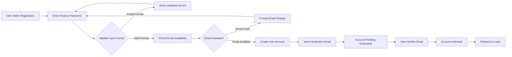
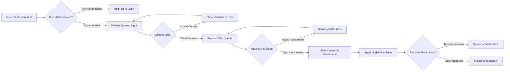
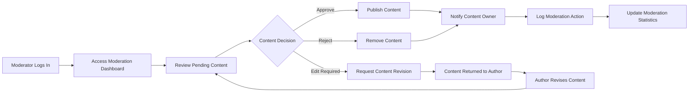

# Security Requirements for Economic/Political Discussion Board

## Introduction & Scope

This document defines the comprehensive security requirements for a simple economic/political discussion board platform. The security framework ensures that user data, content, and attachments are protected while maintaining the platform's core functionality for open discussion. The security approach balances protection with usability, focusing on essential security measures that don't compromise the straightforward user experience.

### Security Philosophy
THE discussion board SHALL implement security measures that protect user data without compromising the platform's simplicity and usability. Security controls SHALL be transparent to legitimate users while effectively preventing unauthorized access and malicious activities.

## Authentication Security

### User Authentication Requirements

WHEN a user attempts to register for an account, THE system SHALL validate email format and require password complexity meeting minimum security standards.

WHEN a user logs in, THE system SHALL authenticate credentials against stored values and establish a secure session with appropriate permissions.

WHILE a user is authenticated, THE system SHALL maintain session security and prevent session hijacking through secure token management.

IF authentication fails, THEN THE system SHALL provide generic error messages without revealing specific failure reasons to prevent information disclosure.

### Session Management Requirements

THE system SHALL use secure HTTP-only cookies for session management with proper expiration policies.

WHEN a user logs out, THE system SHALL invalidate the session token immediately and clear all authentication data.

WHERE sessions are inactive for more than 24 hours, THE system SHALL automatically expire the session and require re-authentication.

### Password Security Requirements

THE system SHALL require passwords to be at least 8 characters with a mix of uppercase letters, lowercase letters, numbers, and symbols.

WHEN a user creates or changes a password, THE system SHALL store it using secure hashing algorithms with salt to prevent rainbow table attacks.

IF a user enters an incorrect password 5 times within 10 minutes, THEN THE system SHALL temporarily lock the account for 15 minutes to prevent brute force attacks.

## Data Protection

### User Data Protection

THE system SHALL protect user personal information including email addresses, registration details, and activity history.

WHEN storing user data, THE system SHALL encrypt sensitive information at rest using industry-standard encryption methods.

WHERE user data is transmitted over networks, THE system SHALL use secure HTTPS encryption to prevent interception.

### Content Data Protection

THE system SHALL ensure that user-generated content is protected from unauthorized access, modification, or deletion.

WHILE content is being created or edited, THE system SHALL prevent data loss through auto-save functionality and version control.

IF content is deleted by a user, THEN THE system SHALL provide a confirmation step before permanent deletion to prevent accidental data loss.

### Data Backup Requirements

THE system SHALL perform regular backups of all user content and system data according to a defined backup schedule.

WHEN performing backups, THE system SHALL ensure backup data is encrypted and stored securely in separate locations.

WHERE backup restoration is required, THE system SHALL provide clear procedures for data recovery with minimal data loss.

## Content Privacy

### Content Visibility Requirements

THE system SHALL allow public viewing of posts and comments by default to encourage open discussion.

WHERE users create content, THE system SHALL respect their privacy settings if implemented in future versions.

WHEN content is marked as private or restricted, THE system SHALL enforce access controls to prevent unauthorized viewing.

### Access Control Requirements

THE system SHALL implement role-based access control for all content operations based on user authentication status.

WHEN a guest user attempts to create content, THE system SHALL redirect to registration/login with appropriate messaging.

WHILE content is being moderated, THE system SHALL restrict public visibility until approved by moderators.

## Attachment Security

### File Upload Security

WHEN users upload attachments, THE system SHALL validate file types and sizes against predefined security policies.

THE system SHALL restrict uploads to common image formats (JPG, PNG, GIF) and document formats (PDF, DOC, TXT) with specific size limitations.

IF a file exceeds 10MB in size, THEN THE system SHALL reject the upload with an appropriate error message explaining the limitation.

### Attachment Storage Security

THE system SHALL store uploaded files in a secure, isolated storage location with proper access controls.

WHEN serving attachments, THE system SHALL validate user permissions before allowing download or viewing.

WHERE attachments contain sensitive information, THE system SHALL implement access logging to track file access patterns.

### Malware Protection

THE system SHALL scan uploaded files for malware and viruses using updated security definitions.

IF a file is detected as malicious, THEN THE system SHALL reject the upload and log the incident for security monitoring.

WHERE suspicious files are identified, THE system SHALL quarantine them for further analysis by security personnel.

## Moderation Security

### Moderator Access Requirements

THE system SHALL provide moderators with appropriate tools for content management while maintaining security boundaries.

WHEN moderators take action on content, THE system SHALL log all moderation activities with timestamps and user identification.

WHERE moderation actions affect user content, THE system SHALL notify the content owner with explanation of the action taken.

### Abuse Prevention

THE system SHALL implement rate limiting to prevent spam and abuse through automated posting tools.

WHEN users report content, THE system SHALL process reports securely and confidentially to protect reporter privacy.

IF a user is identified as abusive, THEN THE system SHALL allow moderators to suspend or restrict the account according to established policies.

## Security Workflows

### User Registration Security Flow

### Content Creation Security Flow

### Moderation Security Flow

## Compliance & Best Practices

### Industry Standards

THE system SHALL follow OWASP security guidelines for web applications to prevent common vulnerabilities.

WHEN handling user data, THE system SHALL comply with relevant privacy regulations and data protection laws.

WHERE security vulnerabilities are discovered, THE system SHALL provide timely patches and security updates.

### Security Monitoring

THE system SHALL implement security logging for all critical operations including authentication attempts and content modifications.

WHEN security events occur, THE system SHALL alert administrators appropriately based on severity levels.

IF unauthorized access is detected, THEN THE system SHALL trigger security protocols to contain and investigate the incident.

### Security Testing

THE system SHALL undergo regular security testing and vulnerability assessments to identify potential weaknesses.

WHEN new features are deployed, THE system SHALL include security review in the deployment process to ensure proper protection.

WHERE third-party components are used, THE system SHALL monitor for security updates and apply them promptly.

## Security Requirements Summary

### Critical Security Controls

| Security Control | Requirement | Priority | Implementation Timeline |
|------------------|-------------|----------|-------------------------|
| Authentication | Secure session management with JWT tokens | High | Initial Release |
| Data Protection | Encryption of sensitive data at rest and in transit | High | Initial Release |
| File Uploads | Malware scanning and file type validation | High | Initial Release |
| Access Control | Role-based permissions for all operations | Medium | Initial Release |
| Audit Logging | Comprehensive logging of security events | Medium | Phase 1 |
| Rate Limiting | Prevention of spam and abuse | Medium | Initial Release |
| Backup Security | Secure backup procedures with encryption | Medium | Phase 1 |
| Incident Response | Defined procedures for security incidents | Low | Phase 2 |

### Security Success Criteria

- Users can register and authenticate securely without data exposure or privacy concerns
- Content and attachments are protected from unauthorized access, modification, or deletion
- Moderators can perform their duties with appropriate security controls and audit trails
- The system resists common web application security threats including injection attacks and cross-site scripting
- Security incidents are detectable and traceable through comprehensive logging and monitoring
- Data backup and recovery procedures ensure business continuity in case of security incidents

### Security Metrics and Monitoring

THE system SHALL track the following security metrics for continuous improvement:
- Number of failed login attempts per user and overall
- Frequency of security-related incidents and their resolution times
- User satisfaction with security features and privacy protections
- Compliance with security policies and regulatory requirements
- Effectiveness of security controls in preventing unauthorized access

### Security Training and Awareness

THE system SHALL provide security awareness guidance for users regarding:
- Password security best practices
- Safe attachment handling procedures
- Recognition of potential security threats
- Reporting procedures for security concerns

This security requirements document provides the foundation for building a secure economic/political discussion board that protects user data while enabling productive discussions. The requirements focus on essential security measures that balance protection with the platform's straightforward, minimal design philosophy.

> *Developer Note: This document defines **business security requirements only**. All technical implementations (encryption methods, authentication protocols, database security, etc.) are at the discretion of the development team.*