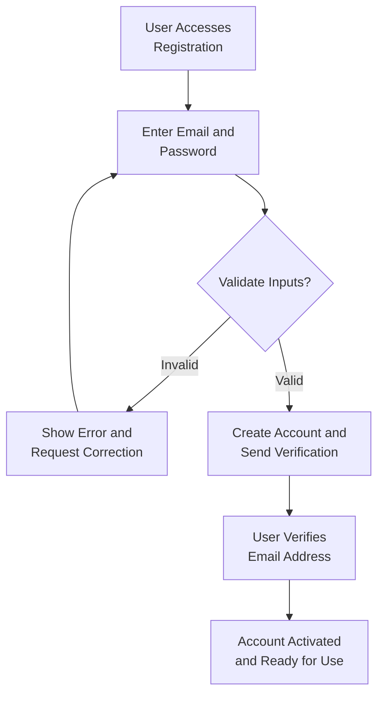
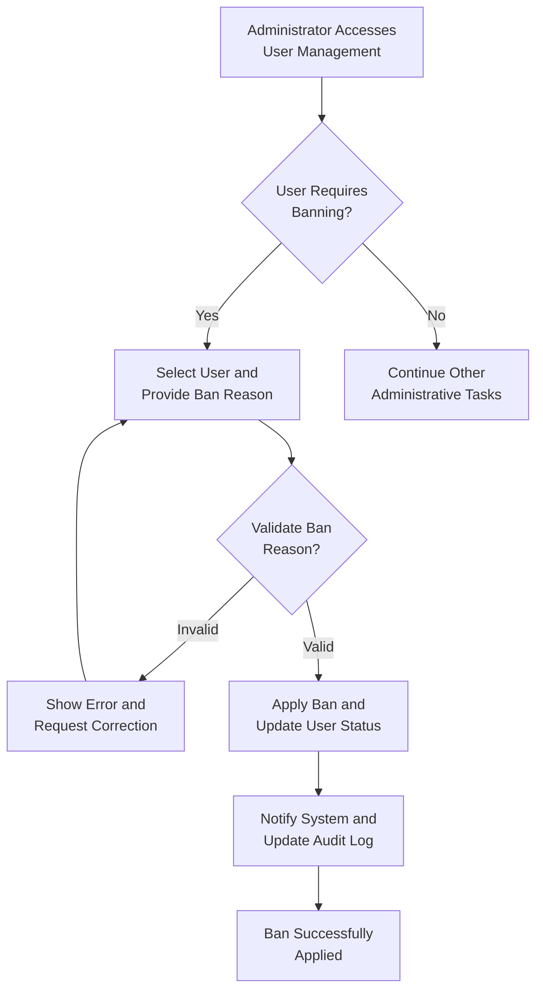

# Economic/Political Discussion Board Requirements Specification

## Overview

The Economic/Political Discussion Board provides a specialized platform for moderated discussions on economic and political topics. The system supports user-generated content with comprehensive moderation capabilities, section-based organization, and multi-level administrative controls.

## User Account Management

### User Registration
- **Registration Initiation**: WHEN a user accesses the registration page, THE system SHALL display email and password input fields
- **Email Validation**: THE system SHALL validate email format and ensure it meets standard email pattern requirements
- **Password Requirements**: THE password SHALL require minimum 8 characters including at least one uppercase letter, one lowercase letter, and one number
- **Account Creation**: WHEN valid email and password are provided, THE system SHALL create a user account and send verification email
- **Email Verification**: THE user SHALL receive an email with verification link that must be clicked within 24 hours

### User Authentication
- **Login Process**: WHEN a user provides email and password, THE system SHALL validate credentials against stored hash values
- **Session Management**: UPON successful authentication, THE system SHALL create a secure session token valid for 30 days
- **Password Reset**: WHERE a user forgets password, THE system SHALL provide password reset functionality via email verification
- **Session Security**: THE system SHALL invalidate sessions after 30 minutes of inactivity

### Account Management
- **Password Change**: WHEN an authenticated user requests password change, THE system SHALL require current password verification
- **Account Deletion**: WHERE a user deletes their account, THE system SHALL permanently remove all associated articles, comments, and profile data
- **Deletion Confirmation**: THE system SHALL require explicit confirmation before account deletion due to irreversible consequences

## User Profile System

### Profile Structure
- **Profile Creation**: WHEN a user account is created, THE system SHALL automatically create a default profile
- **Required Information**: EACH profile SHALL contain display name (required) and bio text (optional)
- **Display Name Constraints**: THE display name SHALL be unique across all users and contain 2-50 characters
- **Bio Length Limits**: THE bio text SHALL support up to 500 characters of user-provided content

### Profile Management
- **Profile Editing**: WHEN a user edits their profile, THE system SHALL validate display name uniqueness and bio length
- **Profile Viewing**: ANY user SHALL be able to view other users' profiles including display name, bio, and content statistics
- **Content Statistics**: USER profiles SHALL display article count, comment count, and registration date
- **Content Lists**: WHERE a user profile is viewed, THE system SHALL display paginated lists of articles and comments created by that user

## Section Management

### Section Creation and Organization
- **Section Structure**: EACH section SHALL have a unique name and description for categorization
- **Default Sections**: THE system SHALL initially include Politics, Economy, and Current Affairs sections
- **Section Descriptions**: EACH section description SHALL contain 10-200 characters explaining the section's purpose
- **Section Visibility**: ALL sections SHALL be visible to all users regardless of authentication status

### Section Administration
- **Creation Authorization**: ONLY administrators SHALL create new sections
- **Editing Privileges**: Administrators SHALL modify section names and descriptions
- **Deletion Restrictions**: WHERE a section contains articles, THE system SHALL prevent deletion without administrator override
- **Section Browsing**: USERS SHALL browse articles filtered by section with paginated results

## Article Management System

### Article Creation
- **Content Requirements**: EACH article SHALL have title (required, 5-200 characters), content (required, minimum 50 characters), and section selection
- **Attachment Support**: USERS SHALL attach multiple files and images to articles with size limits of 10MB per file
- **Tag System**: USERS SHALL add free-text tags to articles with maximum 10 tags per article
- **Content Validation**: THE system SHALL validate article content for prohibited content before publishing

### Article Operations
- **Editing Capabilities**: ARTICLE authors SHALL edit title, content, attachments, and tags after publication
- **Deletion Authority**: USERS SHALL delete their own articles; administrators SHALL delete any article
- **Content Preservation**: WHEN an article is deleted, THE system SHALL remove all associated comments and attachments
- **Version History**: THE system SHALL maintain edit history for audit purposes

### Article Display
- **List View**: ARTICLE lists SHALL display title, author, tags, comment count, and posting time
- **Detail View**: INDIVIDUAL article pages SHALL show full content with attachments and metadata
- **Sorting Options**: USERS SHALL sort articles by newest first or oldest first
- **Pagination**: ALL article lists SHALL support pagination with 20 articles per page

## Article Browsing and Search

### Browsing Interface
- **Section Filtering**: USERS SHALL browse articles filtered by specific sections
- **Tag Filtering**: THE system SHALL provide tag-based filtering for refined content discovery
- **Author Filtering**: USERS SHALL view articles by specific authors through profile links
- **Time-based Filtering**: THE interface SHALL support date range filtering for articles

### Search Functionality
- **Search Scope**: USERS SHALL search article titles and content using full-text search
- **Search Results**: SEARCH results SHALL be paginated with relevance ranking
- **Combined Filters**: USERS SHALL combine search terms with section and tag filters
- **Performance**: SEARCH operations SHALL return results within 2 seconds for typical queries

## Comment System

### Comment Operations
- **Creation Process**: AUTHENTICATED users SHALL write comments on articles with content length 1-1000 characters
- **Flat Structure**: COMMENTS SHALL be single-level only without nested replies
- **Editing Rights**: COMMENT authors SHALL edit their comments within 1 hour of posting
- **Deletion Authority**: USERS SHALL delete their own comments; administrators SHALL delete any comment

### Comment Display
- **Sorting Order**: COMMENTS SHALL display in chronological order (oldest first)
- **Author Attribution**: EACH comment SHALL display author name, posting time, and content
- **Moderation Indicators**: WHERE comments are edited, THE system SHALL display edit timestamp
- **Content Preservation**: COMMENT deletions SHALL be permanent with no archive

## Administrator System

### Administrator Promotion Process
- **Request Submission**: ANY user SHALL submit an administrator promotion request with reason text
- **Request Review**: SUPER administrators SHALL review pending requests in a dedicated interface
- **Approval Authority**: ONLY super administrators SHALL approve or reject promotion requests
- **Approval Notification**: WHEN approved, THE user SHALL receive notification and gain administrator privileges

### Administrator Hierarchy
- **Grade Structure**: THE system SHALL maintain two administrator grades: regular and super
- **Regular Administrator**: BASIC administrators SHALL manage content, sections, and user banning
- **Super Administrator**: SUPER administrators SHALL have all regular privileges plus promotion/demotion authority
- **Self-Protection**: SUPER administrators SHALL not demote themselves to prevent system lockout

### Administrator Capabilities
- **Section Management**: ALL administrators SHALL create, edit, and delete discussion sections
- **Content Moderation**: ADMINISTRATORS SHALL delete any article or comment regardless of author
- **User Management**: ADMINISTRATORS SHALL ban and unban users with recorded reasons
- **Administrative Interface**: THE system SHALL provide dedicated admin dashboard for all management tasks

## User Banning System

### Ban Implementation
- **Ban Authorization**: WHEN an administrator initiates a ban, THE system SHALL verify administrator privileges
- **Reason Requirement**: EACH ban SHALL include a mandatory reason text of 10-500 characters
- **Ban Enforcement**: BANNED users SHALL be immediately prevented from logging in
- **Session Termination**: ACTIVE sessions of banned users SHALL be invalidated

### Ban Consequences
- **Access Restrictions**: BANNED users SHALL not create new content or edit existing content
- **Content Preservation**: EXISTING articles and comments by banned users SHALL remain visible
- **Profile Access**: BANNED users' profiles SHALL remain accessible to other users
- **Ban Duration**: BANS SHALL remain in effect until explicitly removed by administrators

### Ban Management
- **Ban List**: ADMINISTRATORS SHALL view paginated list of all banned users
- **Ban Details**: FOR each banned user, THE system SHALL display ban reason, date, and administrator
- **Unban Process**: ADMINISTRATORS SHALL be able to unban users with optional unban reason
- **Audit Trail**: ALL ban and unban actions SHALL be logged with timestamps and administrator identifiers

## System Architecture Requirements

### Performance Standards
- **Response Time**: PAGE loads SHALL complete within 3 seconds for standard operations
- **Search Performance**: SEARCH queries SHALL return results within 2 seconds
- **Concurrent Users**: THE system SHALL support 1000 concurrent users during peak usage
- **Data Integrity**: ALL data operations SHALL maintain consistency across distributed components

### Security Requirements
- **Authentication Security**: USER passwords SHALL be stored using industry-standard hashing algorithms
- **Session Protection**: SESSION tokens SHALL be encrypted and protected against hijacking
- **Input Validation**: ALL user inputs SHALL be sanitized to prevent injection attacks
- **Access Control**: THE system SHALL enforce role-based access control for all operations

### Data Management
- **Backup Strategy**: THE system SHALL perform daily backups of all persistent data
- **Data Retention**: USER content SHALL be retained according to platform retention policies
- **Export Capability**: USERS SHALL be able to export their content upon request
- **Privacy Compliance**: THE system SHALL adhere to relevant data protection regulations

## Error Handling and User Experience

### Error Scenarios
- **Authentication Failures**: WHEN login fails, THE system SHALL provide specific error messages
- **Access Denied**: WHERE users attempt unauthorized actions, THE system SHALL explain permission requirements
- **System Errors**: FOR technical failures, THE system SHALL display user-friendly error pages
- **Validation Errors**: INPUT validation failures SHALL highlight specific fields requiring correction

### User Interface Standards
- **Responsive Design**: THE interface SHALL work seamlessly on desktop and mobile devices
- **Accessibility**: THE system SHALL meet WCAG 2.1 AA accessibility standards
- **Consistent Navigation**: ALL pages SHALL maintain consistent navigation and branding
- **Progressive Enhancement**: CORE functionality SHALL work without JavaScript enabled

## Workflow Diagrams

### User Registration Workflow


### Article Creation Workflow
```mermaid
graph TD
    A["Authenticated User
Starts New Article"] --> B["Select Section and
Enter Title/Content"]
    B --> C["Add Attachments
and Tags"]
    C --> D{"Content Valid?"]
    D -->|"Invalid"| E["Highlight Issues
for Correction"]
    D -->|"Valid"| F["Submit Article
for Publishing"]
    F --> G["Article Published
with Timestamp"]
    E --> B
```

### Administrator Ban Workflow


## Integration Requirements

### External Services
- **Email Service**: THE system SHALL integrate with email service for verification and notifications
- **File Storage**: ATTACHMENTS SHALL be stored using secure cloud storage service
- **Search Engine**: FULL-TEXT search SHALL utilize dedicated search engine for performance
- **CDN Integration**: STATIC assets SHALL be served through content delivery network

### Monitoring and Analytics
- **Performance Monitoring**: THE system SHALL monitor response times and error rates
- **Usage Analytics**: PLATFORM usage statistics SHALL be collected for business intelligence
- **Security Monitoring**: SECURITY events SHALL be logged and monitored for threats
- **Audit Logging**: ALL administrative actions SHALL be logged for compliance

## Deployment and Maintenance

### Deployment Specifications
- **Environment Setup**: THE system SHALL support development, staging, and production environments
- **Scalability**: ARCHITECTURE SHALL support horizontal scaling for increased load
- **Database Requirements**: PERSISTENT storage SHALL use relational database with transaction support
- **Caching Strategy**: FREQUENTLY accessed data SHALL be cached for performance optimization

### Maintenance Procedures
- **Regular Updates**: THE system SHALL support seamless deployment of updates
- **Database Maintenance**: REGULAR maintenance tasks SHALL ensure database performance
- **Backup Procedures**: AUTOMATED backup procedures SHALL protect against data loss
- **Disaster Recovery**: THE system SHALL include recovery procedures for major failures

## Regulatory Compliance

### Data Protection
- **Privacy Compliance**: THE system SHALL comply with GDPR and relevant privacy regulations
- **User Rights**: USERS SHALL have rights to access, correct, and delete their personal data
- **Data Portability**: USERS SHALL be able to export their data in standard formats
- **Consent Management**: THE system SHALL manage user consents for data processing

### Content Moderation
- **Legal Compliance**: CONTENT moderation SHALL comply with applicable laws and regulations
- **Reporting System**: USERS SHALL be able to report inappropriate content for review
- **Transparent Policies**: CONTENT policies SHALL be clearly communicated to all users
- **Appeal Process**: USERS SHALL have recourse to appeal content removal decisions

## Quality Assurance Requirements

### Testing Standards
- **Unit Testing**: ALL backend functionality SHALL be covered by comprehensive unit tests
- **Integration Testing**: SYSTEM integrations SHALL be thoroughly tested
- **Performance Testing**: LOAD testing SHALL validate performance under expected loads
- **Security Testing**: PENETRATION testing SHALL identify and address vulnerabilities

### Quality Metrics
- **Code Coverage**: TEST coverage SHALL exceed 80% for critical functionality
- **Performance Benchmarks**: RESPONSE times SHALL meet specified performance requirements
- **Security Standards**: THE system SHALL pass security audits without critical findings
- **Accessibility Compliance**: ACCESSIBILITY testing SHALL verify WCAG 2.1 AA compliance

This comprehensive specification provides the foundation for developing a robust Economic/Political Discussion Board that meets all functional requirements while ensuring security, performance, and maintainability standards are achieved.