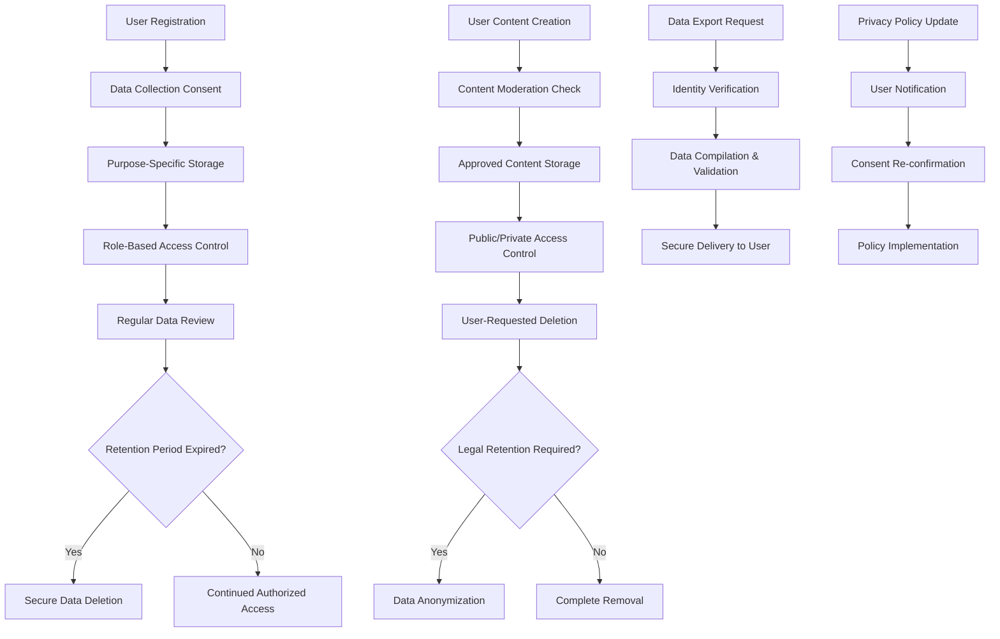

# Data Privacy and Management Requirements

## Executive Summary

This document defines the comprehensive data privacy and management requirements for the economic/political discussion board. The platform must implement robust privacy protection measures while maintaining the simple design philosophy. All requirements focus on business-level data handling, user rights implementation, and regulatory compliance without specifying technical implementation details.

## Data Storage Requirements

### Core Data Categories and Business Rules

**WHEN** a user registers for the discussion board, **THE** system **SHALL** collect and store only essential account information:
- Email address for account verification and communication
- Unique username for public identification
- Encrypted password following industry-standard hashing algorithms
- Registration timestamp and account status

**WHILE** users participate in discussions, **THE** system **SHALL** maintain comprehensive content records:
- Post content with creation and modification timestamps
- Comment threads with parent-child relationships
- File attachments including images and documents
- User engagement metrics (views, replies, likes)

**WHERE** users provide optional profile information, **THE** system **SHALL** store:
- Biography text (maximum 500 characters)
- Location information at country/region level
- Professional background relevant to economic/political discussions
- Avatar preferences and display settings

### Data Minimization Implementation

**THE** system **SHALL** adhere to data minimization principles throughout all operations:
- **WHEN** designing data collection forms, **THE** system **SHALL** exclude non-essential fields
- **IF** data collection is not required for core functionality, **THEN THE** system **SHALL** not collect it
- **WHERE** possible, **THE** system **SHALL** use pseudonymization to protect user identities
- **WHILE** processing user data, **THE** system **SHALL** regularly review data necessity

### Data Classification and Handling

**THE** system **SHALL** implement data classification based on sensitivity:
- **Public Data**: Posts, comments, and public profile information
- **Private Data**: Email addresses, authentication credentials, private messages
- **Sensitive Data**: Payment information, government identifiers, health information

**WHEN** handling different data classifications, **THE** system **SHALL** apply appropriate security measures:
- Public data accessible to all platform visitors
- Private data protected with role-based access controls
- Sensitive data encrypted with advanced cryptographic standards

## Privacy Policy Compliance Framework

### Transparency and User Communication

**WHEN** users register for the platform, **THE** system **SHALL** present clear privacy policy information:
- Data collection purposes and usage explanations
- Third-party data sharing policies and restrictions
- User rights and control mechanisms
- Contact information for privacy inquiries

**THE** privacy policy **SHALL** be written in clear, understandable language without legal jargon:
- Maximum reading level equivalent to 8th grade comprehension
- Specific examples of data usage scenarios
- Visual explanations of data flow processes
- Interactive consent management interface

### Consent Management System

**WHEN** obtaining user consent, **THE** system **SHALL** implement granular consent options:
- Separate consent for different data processing activities
- Clear opt-in mechanisms without pre-selected options
- Easy withdrawal process for consent management
- Historical record of consent changes

**IF** users withdraw consent for essential data processing, **THEN THE** system **SHALL**:
- Explain functional limitations resulting from consent withdrawal
- Provide account deletion option if core functionality becomes unavailable
- Maintain audit trail of consent changes for compliance purposes
- Notify users of any service impact before processing withdrawal

### Regulatory Compliance Implementation

**THE** system **SHALL** comply with global privacy regulations including:
- GDPR requirements for European Union users
- CCPA/CPRA for California residents
- LGPD for Brazilian users
- PIPEDA for Canadian users

**WHEN** processing user data, **THE** system **SHALL** implement privacy-by-design principles:
- Data protection integrated into system architecture
- Default privacy settings favoring user protection
- Regular privacy impact assessments for new features
- Documentation of compliance measures for audit purposes

## User Data Management and Access Controls

### User Rights Implementation

**WHEN** users exercise their data rights, **THE** system **SHALL** provide comprehensive access:
- **Right to Access**: Complete data export within 30 days of request
- **Right to Rectification**: Easy correction mechanisms for inaccurate data
- **Right to Erasure**: Account deletion with data removal within 72 hours
- **Right to Restriction**: Temporary data processing limitations
- **Right to Data Portability**: Machine-readable data export formats
- **Right to Object**: Opt-out mechanisms for specific processing activities

### Role-Based Access Control System

**THE** system **SHALL** implement strict access controls based on user roles:
- **Guest Users**: Read-only access to public content only
- **Member Users**: Access to own data and public discussions
- **Moderators**: Additional access to moderation tools and reported content
- **Administrators**: Full system access with comprehensive audit logging

**WHEN** accessing user data, **THE** system **SHALL** maintain detailed access logs:
- Timestamp of access attempts
- User identity making the access request
- Specific data elements accessed
- Purpose of access documented
- Duration of access session

### Data Processing Accountability

**THE** system **SHALL** maintain comprehensive records of data processing activities:
- Data inventory documenting all personal data categories
- Processing purposes for each data category
- Data retention periods and deletion schedules
- Third-party data sharing agreements and compliance
- Data protection impact assessment results

## Data Retention Policies and Procedures

### User Account Data Retention

**WHEN** users delete their accounts, **THE** system **SHALL** implement structured retention rules:
- Immediate removal of personally identifiable information within 30 days
- Anonymization of content where legal requirements permit retention
- Preservation of moderation records for 90 days post-deletion
- Complete data purge after legal retention periods expire

**WHERE** legal requirements mandate specific retention periods, **THE** system **SHALL**:
- Document applicable regulations and retention requirements
- Implement automated retention period tracking
- Provide exception handling for legal preservation orders
- Maintain separation between operational data and legal holds

### Content Retention Framework

**THE** system **SHALL** maintain discussion content according to these principles:
- Posts and comments retained for platform operational lifetime
- Deleted content maintained in archive for 30 days before permanent removal
- Moderation actions logged with timestamps and rationale
- Content version history preserved for audit purposes

**WHEN** implementing content retention, **THE** system **SHALL** balance:
- User expectations for content permanence
- Legal requirements for data preservation
- Storage efficiency and performance considerations
- Privacy rights for content removal requests

### System Log Retention and Management

**THE** system **SHALL** implement tiered log retention policies:
- Security logs retained for 12 months with detailed analysis
- Access logs maintained for 6 months for audit purposes
- Performance logs kept for 3 months for optimization
- Debug logs purged within 24 hours of creation

**WHERE** logs contain personal data, **THE** system **SHALL** implement:
- Automatic anonymization after 30 days for non-essential data
- Selective retention of necessary log elements only
- Secure storage with encryption for sensitive log data
- Regular review of log retention effectiveness

## Data Export and Deletion Processes

### Comprehensive Data Export Functionality

**WHEN** users request data exports, **THE** system **SHALL** provide complete data packages:
- All posts created by the user with timestamps and engagement metrics
- Complete comment history with context and reply chains
- Profile information including registration details and preferences
- Activity history showing discussion participation patterns
- File attachments uploaded by the user with metadata

**THE** export process **SHALL** meet these business requirements:
- Completion within 30 calendar days of verified request
- Multiple format options including PDF, JSON, and CSV
- Secure delivery through encrypted channels
- Verification of data completeness and accuracy

### Account Deletion and Data Removal

**WHEN** users request account deletion, **THE** system **SHALL** implement thorough removal processes:
- Identity verification through multiple authentication factors
- Confirmation process explaining deletion consequences
- Progressive deletion with user notification at each stage
- Final confirmation after completion of deletion process

**THE** deletion implementation **SHALL** address these scenarios:
- **Standard Deletion**: Complete removal of personal data within 72 hours
- **Legal Preservation**: Anonymization where content must be retained
- **Content Attribution**: Replacement of username with "Deleted User" marker
- **Moderation Records**: Maintenance of necessary moderation history

### Request Verification and Security

**THE** system **SHALL** implement robust verification for data requests:
- Multi-factor authentication for sensitive data operations
- Suspicious activity detection with additional verification steps
- Request tracking with status updates for users
- Fraud prevention measures for unauthorized access attempts

**IF** suspicious activity is detected during request processing, **THEN THE** system **SHALL**:
- Temporarily suspend the request pending investigation
- Notify the account owner of potential security issues
- Implement additional identity verification measures
- Log the incident for security analysis and improvement

## Security Considerations and Breach Response

### Data Protection Implementation

**THE** system **SHALL** implement comprehensive data protection measures:
- Encryption of all sensitive data both at rest and in transit
- Industry-standard hashing algorithms for password storage
- Regular security updates and vulnerability patching
- Secure key management for cryptographic operations

**WHEN** storing file attachments, **THE** system **SHALL** implement:
- Virus scanning for all uploaded files
- Access controls based on content sensitivity
- Secure storage with redundancy and backup
- Performance optimization for efficient delivery

### Security Breach Response Protocol

**IF** a data breach occurs, **THEN THE** system **SHALL** execute immediate response:
- Notification of affected users within 72 hours of discovery
- Detailed explanation of breach scope and impact
- Guidance for users on protective measures
- Cooperation with regulatory authorities as required

**THE** breach response **SHALL** include these components:
- Incident containment to prevent further data exposure
- Forensic analysis to determine breach cause and extent
- Communication plan for stakeholders and affected parties
- Remediation measures to prevent recurrence
- Documentation for regulatory compliance and improvement

### Regular Security Assessment Program

**THE** system **SHALL** conduct ongoing security assessments:
- Quarterly vulnerability scans and penetration testing
- Annual privacy impact assessments for new features
- Continuous monitoring for suspicious activity patterns
- Regular review of security controls and effectiveness

**WHEN** conducting assessments, **THE** system **SHALL** focus on:
- Data protection effectiveness across all storage layers
- Access control implementation and enforcement
- Security incident detection and response capabilities
- Compliance with evolving regulatory requirements

## Compliance Monitoring and Audit Requirements

### Regular Compliance Audits

**THE** system **SHALL** implement structured compliance monitoring:
- Quarterly audits of privacy policy implementation
- Monthly review of data processing activities
- Annual comprehensive privacy compliance assessment
- Continuous monitoring of regulatory changes

**WHEN** conducting audits, **THE** system **SHALL** evaluate:
- Adherence to stated privacy policies and practices
- Effectiveness of user consent management
- Data minimization and purpose limitation compliance
- Security measures and incident response readiness

### User Education and Communication

**THE** system **SHALL** provide comprehensive privacy education:
- Clear guidance on user rights and how to exercise them
- Regular updates about privacy policy changes
- Educational content about data protection best practices
- Accessible contact channels for privacy questions

**WHEN** communicating about privacy, **THE** system **SHALL** ensure:
- Timely notification of significant policy changes
- Clear explanation of changes and user options
- Multiple communication channels for different preferences
- Documentation of all privacy-related communications

### Incident Reporting and Improvement

**THE** system **SHALL** maintain detailed incident records:
- All privacy-related incidents with timestamps and details
- Resolution actions taken and effectiveness assessment
- User communications and feedback received
- Systemic improvements implemented as result

**WHERE** privacy incidents occur, **THE** system **SHALL**:
- Conduct root cause analysis to prevent recurrence
- Implement corrective actions based on findings
- Update policies and procedures as necessary
- Communicate improvements to users and stakeholders

## Data Flow and Processing Documentation

## Implementation Success Metrics

### Privacy Protection Effectiveness

**THE** system **SHALL** measure privacy implementation success through:
- User satisfaction surveys focusing on privacy perceptions
- Reduction in privacy-related support requests over time
- Compliance audit results and regulatory assessment outcomes
- Security incident frequency and severity trends

### Data Management Efficiency

**KEY PERFORMANCE INDICATORS** for data privacy management include:
- Data export request processing time (target: <30 days)
- Account deletion completion time (target: <72 hours)
- Privacy incident response time (target: <24 hours)
- User consent management effectiveness (target: >90% understanding)

### Continuous Improvement Metrics

**THE** system **SHALL** track improvement through:
- Regular privacy impact assessment scores
- User feedback on privacy feature usability
- Compliance gap identification and resolution rates
- Security control effectiveness measurements

> *Developer Note: This document defines **business requirements only**. All technical implementations (database design, encryption methods, API structures, etc.) are at the discretion of the development team.*