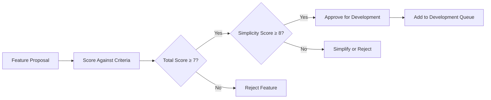

# Future Roadmap for Simple Economic/Political Discussion Board

## Executive Summary

This roadmap outlines the strategic development plan for the simple economic/political discussion board, adhering strictly to the user's requirement for a straightforward, minimal design. The development philosophy prioritizes simplicity, usability, and focused functionality over feature bloat.

### Development Philosophy

**Core Principles:**
- **Simplicity First**: Every feature must justify its existence against the "simple" requirement
- **User-Centered Design**: Focus on what users actually need, not what's technically possible
- **Incremental Enhancement**: Small, meaningful improvements rather than massive redesigns
- **Technical Debt Avoidance**: Clean architecture that supports future growth without complexity

**Scope Management:**
THE discussion board SHALL maintain its simple nature throughout all development phases. WHEN considering new features, THE team SHALL evaluate them against the "simple" requirement criteria.

## Phase 1: Core Features (Launch - Months 1-3)

### Minimum Viable Product Objectives
Phase 1 delivers the absolute minimum required for a functional discussion board while ensuring the platform remains simple and accessible.

**Core Discussion Features Implementation:**
- WHEN a member creates a post, THE system SHALL support basic text formatting including paragraphs and line breaks
- WHEN users browse discussions, THE system SHALL display posts in chronological order with clear timestamps
- THE system SHALL allow members to comment on existing posts with nested reply support up to 3 levels
- WHERE discussions grow large, THE system SHALL implement basic pagination for performance

**Attachment Support Requirements:**
- WHEN creating posts, THE system SHALL support image uploads up to 5MB in JPG, PNG, and GIF formats
- THE system SHALL support common document types (PDF, DOC, TXT) up to 10MB per file
- WHERE attachments exceed size limits, THE system SHALL provide clear error messages with specific guidance
- THE system SHALL limit attachments to 3 files per post to maintain simplicity

**Basic User Management System:**
- THE system SHALL provide guest browsing of public content without registration requirements
- WHEN users register, THE system SHALL require email verification with clear instructions
- THE system SHALL provide basic moderator tools for content management and user reporting
- WHERE user accounts are created, THE system SHALL implement secure password storage

### Phase 1 Success Criteria
- **User Onboarding**: 95% of users can create posts without assistance within 2 minutes of registration
- **Attachment Reliability**: Attachment upload success rate > 98% across all supported file types
- **Performance Standards**: Average page load time < 3 seconds for typical usage scenarios
- **User Satisfaction**: Initial user feedback indicates platform meets "simple" expectation

## Phase 2: Enhanced Features (Months 4-6)

### Quality of Life Improvements Focus
Phase 2 focuses on improving user experience without adding complexity, based on real user feedback from Phase 1.

**Enhanced Discussion Features:**
- WHEN browsing discussions, THE system SHALL add basic search functionality across post titles and content
- THE system SHALL implement thread following/notification system for interested discussions
- WHERE users want organization, THE system SHALL add simple category tagging with 5-7 broad topics
- WHEN users interact with content, THE system SHALL provide basic voting system for quality indication

**Attachment Improvements Implementation:**
- WHEN uploading images, THE system SHALL provide automatic thumbnail generation for faster browsing
- THE system SHALL add basic file type validation to prevent unsupported format uploads
- WHERE multiple attachments are needed, THE system SHALL support up to 5 files per post
- THE system SHALL implement attachment preview functionality for common document types

**User Experience Enhancements:**
- THE system SHALL implement basic mobile responsiveness for on-the-go discussion participation
- WHEN errors occur, THE system SHALL provide user-friendly error messages with specific resolution steps
- THE system SHALL add basic keyboard shortcuts for power users who prefer efficiency
- WHERE performance optimization is needed, THE system SHALL implement lazy loading for images

### Implementation Timeline and Validation
- **Begin Development**: 3 months after successful Phase 1 launch metrics are achieved
- **Feature Rollout**: Incremental deployment over 2-month period with user feedback collection
- **Validation Process**: Each feature undergoes A/B testing with 100+ users before full deployment
- **Success Measurement**: Feature adoption rates > 60% for enhancements to be considered successful

## Phase 3: Advanced Capabilities (Months 7-12)

### Optional Advanced Features Based on Community Growth
Phase 3 introduces features that enhance functionality while maintaining simplicity, implemented only if user adoption justifies the complexity.

**Advanced Content Management Requirements:**
- WHERE moderation workload increases beyond manual capacity, THE system SHALL implement automated content flagging based on user reporting patterns
- THE system SHALL add basic analytics for discussion trends and popular topics
- WHEN users request organization, THE system SHALL implement simple topic following with notification preferences
- WHERE content quality varies, THE system SHALL implement basic user reputation scoring

**Enhanced Attachment Support Features:**
- THE system SHALL add basic document preview functionality for PDF and text files
- WHERE security is concerned, THE system SHALL implement virus scanning for all uploads
- THE system SHALL add attachment search capabilities within user's own uploads
- WHEN storage management becomes necessary, THE system SHALL implement attachment cleanup for inactive accounts

**Community Building Features:**
- THE system SHALL implement basic user reputation system based on post quality and engagement
- WHEN community grows beyond 5,000 users, THE system SHALL add simple moderation tools for trusted users
- THE system SHALL implement basic content recommendation based on user discussion history
- WHERE user interaction patterns emerge, THE system SHALL provide community health metrics

### Conditional Implementation Framework
```mermaid
graph TB
    A["Feature Consideration"] --> B{"User Base > 5,000?"}
    B -->|Yes| C{"Feature Usage > 40%?"}
    B -->|No| D["Postpone Feature"]
    C -->|Yes| E{"Maintains Simplicity?"}
    C -->|No| F[\"Re-evaluate Need\"]
    E -->|Yes| G["Schedule Implementation"]
    E -->|No| H["Simplify or Reject"]
```

**Implementation Conditions:**
- IF user adoption exceeds 5,000 active users, THEN THE system SHALL prioritize scalability enhancements
- WHERE feature complexity threatens simplicity, THE team SHALL reconsider implementation approach
- WHEN user feedback indicates feature confusion, THE team SHALL simplify or remove the feature

## Prioritization Framework

### Feature Evaluation Criteria
All potential features must pass these weighted criteria (scale 1-10, minimum score 7 required):

**Essential Criteria (Weight: 40%):**
- Alignment with "simple discussion board" vision (must score ≥8)
- Benefit to 80%+ of users (must score ≥7)
- Implementation without significant complexity (must score ≥8)

**Technical Considerations (Weight: 30%):**
- Implementation effort vs. user value ratio
- Maintenance burden assessment
- Impact on system performance

**User Value Assessment (Weight: 30%):**
- Solves real user problems identified in feedback
- Enhances core discussion experience
- Supports platform growth objectives

### Decision Making Process


**Evaluation Process:**
- WHEN evaluating new features, THE team SHALL use weighted scoring against simplicity criteria
- WHERE features score below threshold, THE team SHALL postpone or reject them
- IF multiple features compete, THE team SHALL prioritize based on user impact scores

## Long-term Vision

### Sustainable Growth Strategy
THE discussion board SHALL maintain its simple nature while supporting organic community growth. THE system SHALL scale technically without becoming complex for users.

**Growth Management Principles:**
- WHEN user base doubles, THE system SHALL undergo simplicity review to ensure maintained focus
- WHERE feature requests increase, THE team SHALL prioritize based on core discussion value
- THE platform SHALL resist feature creep through regular simplicity audits

### Community-led Development Approach
WHILE the platform grows, THE development approach SHALL remain user-focused. THE team SHALL prioritize features based on actual user needs rather than technical possibilities.

**User Feedback Integration:**
- THE system SHALL maintain open feedback channels for feature requests
- WHEN user suggestions are received, THE team SHALL evaluate against simplicity criteria
- WHERE community consensus emerges, THE team SHALL consider implementation

### Technology Evolution Strategy
THE system SHALL adopt new technologies only when they provide clear user benefits without adding complexity. WHERE new technologies complicate the user experience, THE team SHALL avoid them.

**Technology Adoption Criteria:**
- MUST improve user experience measurably
- MUST maintain or reduce system complexity
- MUST have clear maintenance and support path
- MUST align with long-term platform vision

## Risk Mitigation Strategies

### Scope Creep Prevention Measures
- **Monthly Feature Reviews**: Regular assessment of all features against "simple" criteria
- **User Feedback Integration**: Direct user input in prioritization decisions
- **Clear Rejection Policy**: Established process for saying "no" to complex features
- **Simplicity Metrics**: Quantitative measures of platform complexity

### Technical Debt Management
- **Quarterly Code Quality Assessments**: Regular review of implementation complexity
- **Scheduled Refactoring**: Planned simplification efforts based on complexity metrics
- **Performance Monitoring**: Continuous assessment of system responsiveness
- **User Experience Testing**: Regular validation with new and existing users

### User Experience Protection
- **A/B Testing Implementation**: All significant changes tested with user groups
- **User Feedback Channels**: Multiple avenues for collecting user experience data
- **Usability Testing**: Regular sessions with new users to identify complexity
- **Feature Adoption Monitoring**: Tracking how users actually use implemented features

## Success Metrics and Measurement

### Phase Completion Criteria

**Phase 1 Success Metrics:**
- **User Competence**: 95% of users can create posts without assistance
- **System Reliability**: Attachment upload success rate > 98%
- **Performance Standards**: Average page load time < 3 seconds
- **User Satisfaction**: Net Promoter Score > 30 for simplicity

**Phase 2 Success Metrics:**
- **Feature Adoption**: User satisfaction with search functionality > 4/5
- **Platform Accessibility**: Mobile usage comprises > 40% of traffic
- **Error Reduction**: User-reported error rate reduction by 50% from Phase 1
- **Engagement Improvement**: Time spent on platform increases by 25%

**Phase 3 Success Metrics:**
- **Community Management**: Automated moderation handles 80% of content
- **User Retention**: User retention rate > 70% at 6 months
- **Feature Alignment**: Feature usage rates align with implementation priorities
- **Growth Sustainability**: Platform maintains simplicity while supporting growth

### Continuous Improvement Process
THE system SHALL undergo regular evaluation against simplicity metrics. WHEN metrics indicate complexity growth, THE team SHALL implement simplification measures.

**Improvement Cycle:**
1. Quarterly complexity assessment using established metrics
2. User feedback analysis for pain points and confusion areas
3. Implementation of simplification measures where needed
4. Measurement of improvement impact on user experience

### Long-term Health Indicators
- **Simplicity Score**: Maintain score > 8/10 on quarterly assessments
- **User Satisfaction**: Keep satisfaction with simplicity > 4/5
- **Feature Usage**: Ensure 80%+ of implemented features see > 40% adoption
- **Performance Maintenance**: Page load times remain under 3 seconds

> *Developer Note: This document defines **business requirements only**. All technical implementations (architecture, APIs, database design, etc.) are at the discretion of the development team.*