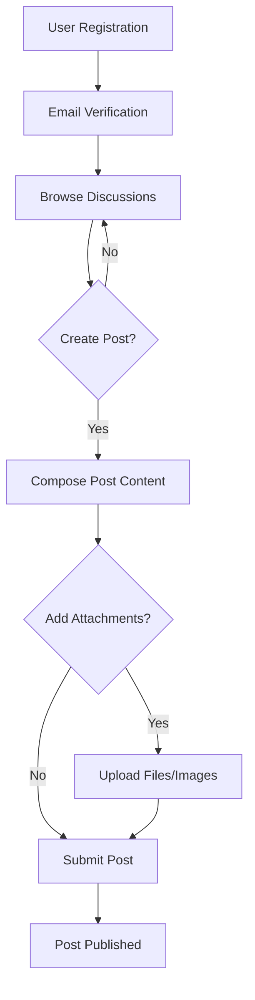
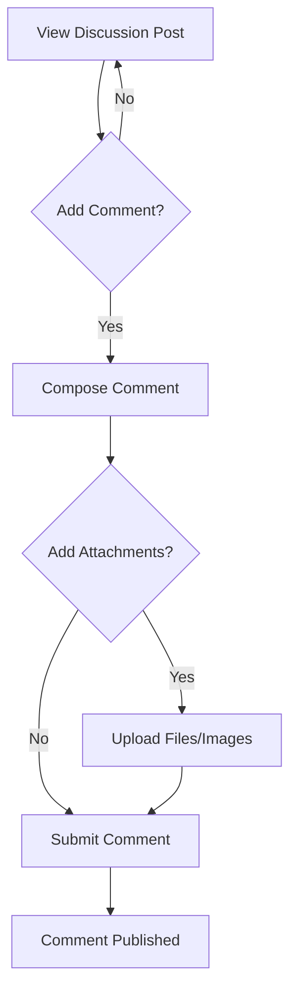

# Simple Economic/Political Discussion Board Requirements Analysis

## Executive Summary

This document specifies the requirements for a straightforward economic and political discussion board platform. The system enables users to create discussion posts, comment on existing discussions, and attach images/files to support their arguments. The design philosophy emphasizes simplicity and minimal complexity while maintaining core discussion functionality.

## Core Features Overview

### Discussion Board Foundation
- **Post Creation**: Users can create text-based discussion posts with titles and content
- **Comment System**: Users can reply to posts with threaded comments
- **Attachment Support**: Posts and comments support image and file attachments
- **Content Organization**: Simple chronological display of discussions

### User Experience Principles
- **Minimal Interface**: Clean, distraction-free design focused on content
- **Straightforward Navigation**: Intuitive browsing and posting workflows
- **Performance Focus**: Fast loading times and responsive interactions
- **Accessibility**: Basic accessibility standards compliance

## User Actors

### Registered User
- **Description**: Standard user who can create posts, comment, and upload attachments
- **Permissions**: Create/edit own posts, comment on any post, upload attachments
- **Authentication**: Email/password registration with email verification

### Guest User
- **Description**: Non-registered visitor who can browse content
- **Permissions**: Read posts and comments only
- **Authentication**: No authentication required for viewing

### Administrator
- **Description**: System administrator with moderation capabilities
- **Permissions**: All user permissions plus content moderation and user management
- **Authentication**: Enhanced security with admin-specific login

## Functional Requirements

### Post Management

**WHEN** a registered user creates a new discussion post, **THE** system **SHALL**:
- Accept post title (maximum 200 characters)
- Accept post content (maximum 10,000 characters)
- Support Markdown formatting for text content
- Generate unique post identifier
- Record creation timestamp and author information
- Display post in chronological order on main discussion board

**WHEN** a user edits their existing post, **THE** system **SHALL**:
- Allow modification of title and content
- Preserve original creation timestamp
- Record edit history with timestamp
- Update post display with latest content

### Comment System

**WHEN** a registered user adds a comment to a post, **THE** system **SHALL**:
- Accept comment text (maximum 2,000 characters)
- Support Markdown formatting
- Generate unique comment identifier
- Record creation timestamp and author information
- Display comments in chronological order under parent post
- Support threaded replies (maximum nesting depth: 3 levels)

**WHEN** a user edits their comment, **THE** system **SHALL**:
- Allow modification of comment text
- Preserve original creation timestamp
- Record edit history with timestamp
- Update comment display with latest content

### Attachment Handling

**WHEN** a user attaches a file to a post or comment, **THE** system **SHALL**:
- Accept image files (JPG, PNG, GIF) up to 10MB each
- Accept document files (PDF, DOC, DOCX, TXT) up to 25MB each
- Validate file type and size before upload
- Generate unique file identifier for each attachment
- Store attachments securely with access control
- Display image attachments inline with content
- Provide download links for document attachments
- Support maximum 5 attachments per post/comment

**WHEN** a user views a post with attachments, **THE** system **SHALL**:
- Display image attachments inline at appropriate size
- Show document attachments as downloadable links
- Provide file size and type information for each attachment
- Ensure attachment access controls are enforced

### User Registration and Authentication

**WHEN** a new user registers for an account, **THE** system **SHALL**:
- Collect email address, username, and password
- Validate email format and uniqueness
- Validate username availability (3-20 characters, alphanumeric)
- Enforce password strength requirements (minimum 8 characters)
- Send email verification link to confirm account
- Require email verification before posting privileges

**WHEN** a user authenticates, **THE** system **SHALL**:
- Validate credentials against stored user data
- Generate secure session token upon successful login
- Maintain session for 30 days with "remember me" option
- Provide logout functionality that invalidates session
- Support password reset via email verification

## Business Rules

### Content Validation Rules

**WHEN** a user submits a post or comment, **THE** system **SHALL**:
- Validate content length against established limits
- Check for prohibited content (spam, hate speech, illegal material)
- Ensure Markdown formatting is properly sanitized
- Prevent duplicate content submissions within 5 minutes
- Enforce rate limiting (maximum 10 posts per hour per user)

**WHEN** processing attachments, **THE** system **SHALL**:
- Scan files for malware using basic virus detection
- Validate file types against allowed extensions
- Enforce maximum file size limits per attachment type
- Prevent upload of executable files or scripts
- Apply basic content filtering for inappropriate images

### User Behavior Guidelines

**WHEN** a user interacts with the platform, **THE** system **SHALL**:
- Track user activity for moderation purposes
- Allow users to report inappropriate content
- Provide clear community guidelines during registration
- Enforce respectful discourse through content moderation
- Support user blocking functionality to prevent harassment

## Error Handling Requirements

### Authentication Errors

**WHEN** authentication fails due to invalid credentials, **THE** system **SHALL**:
- Display generic error message ("Invalid email or password")
- Implement account lockout after 5 failed attempts (30-minute lock)
- Provide clear password reset instructions
- Log failed login attempts for security monitoring

### Content Creation Errors

**WHEN** post/comment creation fails, **THE** system **SHALL**:
- Preserve user's draft content when possible
- Provide specific error messages for validation failures
- Handle server errors gracefully with user-friendly messages
- Support retry mechanisms for transient failures

### Attachment Upload Errors

**WHEN** file upload fails, **THE** system **SHALL**:
- Provide specific error messages for file size/type violations
- Handle network interruptions with resume capability
- Validate file integrity after upload completion
- Provide clear instructions for acceptable file formats

## Performance Requirements

### Response Time Expectations

**WHEN** loading the discussion board homepage, **THE** system **SHALL**:
- Display latest 20 posts within 2 seconds under normal load
- Support pagination for browsing older content
- Cache frequently accessed content for 5 minutes
- Maintain performance with up to 100 concurrent users

**WHEN** users interact with the platform, **THE** system **SHALL**:
- Process post creation within 3 seconds
- Handle comment submissions within 2 seconds
- Complete file uploads within 30 seconds for maximum file sizes
- Support search functionality with sub-3-second response times

### System Availability

**WHEN** operating normally, **THE** system **SHALL**:
- Maintain 99% uptime during business hours
- Provide graceful degradation during maintenance
- Support backup and recovery procedures
- Monitor system health and performance metrics

## Security Requirements

### Authentication Security

**WHEN** handling user authentication, **THE** system **SHALL**:
- Hash passwords using bcrypt with appropriate salt rounds
- Use HTTPS for all authentication and data transmission
- Implement secure session management with expiration
- Protect against common web vulnerabilities (XSS, CSRF)

### Data Protection

**WHEN** storing user data and content, **THE** system **SHALL**:
- Encrypt sensitive user information at rest
- Implement proper access controls for user content
- Secure file attachments with appropriate permissions
- Maintain audit logs for security incidents

### Content Privacy

**WHEN** displaying user-generated content, **THE** system **SHALL**:
- Respect user privacy settings if implemented
- Prevent unauthorized access to user data
- Implement proper content sanitization
- Protect against information leakage

## Content Lifecycle Management

### Content Creation Workflow

### Comment Interaction Flow

### Moderation Process

**WHEN** content requires moderation, **THE** system **SHALL**:
- Allow administrators to review reported content
- Provide tools for content removal or editing
- Notify users of moderation actions taken
- Maintain moderation audit trails
- Support bulk moderation operations

### Content Archival and Deletion

**WHEN** managing content lifecycle, **THE** system **SHALL**:
- Archive old discussions after 2 years of inactivity
- Allow users to delete their own posts and comments
- Provide administrator override for content removal
- Maintain deleted content in archive for 30 days
- Support content recovery within archival period

## Implementation Guidelines

### Development Principles
- **Keep It Simple**: Implement only essential features initially
- **Progressive Enhancement**: Add complexity only when justified
- **User-Centric Design**: Prioritize ease of use over feature richness
- **Performance First**: Optimize for fast loading and responsiveness

### Technical Constraints
- **Attachment Storage**: Use cloud storage for file attachments
- **Database Design**: Simple relational structure for posts, comments, users
- **Caching Strategy**: Basic caching for frequently accessed content
- **Security Baseline**: Standard web security practices implementation

### Success Criteria
- **User Satisfaction**: Intuitive interface with minimal learning curve
- **Performance Metrics**: Sub-3-second page loads under normal load
- **Reliability**: 99% uptime with graceful error handling
- **Scalability**: Support for 1,000+ registered users

This requirements analysis provides a comprehensive yet straightforward foundation for developing a simple economic/political discussion board that meets the core functionality requirements while maintaining the requested minimal complexity approach.