# Prisma Markdown

> Generated by [`prisma-markdown`](https://github.com/samchon/prisma-markdown)

- [Systematic](#systematic)
- [Actors](#actors)
- [Communities](#communities)
- [Content](#content)
- [Comments](#comments)
- [Voting](#voting)
- [Karma](#karma)
- [Subscriptions](#subscriptions)
- [Moderation](#moderation)
- [Analytics](#analytics)
- [default](#default)

## Systematic

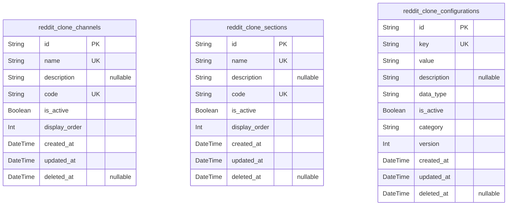

### `reddit_clone_channels`

Platform channels that organize content streams and communities. Channels
represent distinct content categories or streams that users can subscribe
to and browse. Each channel contains multiple communities and provides a
way to categorize content across the platform. {@link
reddit_clone_communities.id}

Properties as follows:

- `id`: Primary Key.
- `name`: Channel name that identifies the content stream.
- `description`: Detailed description explaining the channel's purpose and content focus.
- `code`: Unique channel code used for URL generation and API references.
- `is_active`: Whether the channel is currently active and visible to users.
- `display_order`: Order in which channels should be displayed in listings.
- `created_at`: Timestamp when the channel was created.
- `updated_at`: Timestamp when the channel was last updated.
- `deleted_at`: Timestamp when the channel was soft deleted.

### `reddit_clone_sections`

Organizational sections that group channels and content for better
navigation. Sections provide a higher-level organizational structure for
the platform, allowing content to be grouped into logical categories that
span multiple channels. [reddit_clone_channels.id](#reddit_clone_channels)

Properties as follows:

- `id`: Primary Key.
- `name`: Section name that identifies the organizational category.
- `description`: Detailed description explaining the section's purpose and content scope.
- `code`: Unique section code used for URL generation and API references.
- `is_active`: Whether the section is currently active and visible to users.
- `display_order`: Order in which sections should be displayed in navigation.
- `created_at`: Timestamp when the section was created.
- `updated_at`: Timestamp when the section was last updated.
- `deleted_at`: Timestamp when the section was soft deleted.

### `reddit_clone_configurations`

Platform-wide configuration settings that control system behavior and
features. These configurations store global platform settings that affect
all users and communities, including feature flags, limits, and system
parameters.

Properties as follows:

- `id`: Primary Key.
- `key`: Unique configuration key that identifies the setting.
- `value`: Configuration value stored as string for flexibility.
- `description`: Detailed description explaining the configuration's purpose and usage.
- `data_type`: Data type of the configuration value (string, boolean, integer, double).
- `is_active`: Whether the configuration is currently active and being applied.
- `category`: Category grouping for organizing related configurations.
- `version`: Configuration version for tracking changes and updates.
- `created_at`: Timestamp when the configuration was created.
- `updated_at`: Timestamp when the configuration was last updated.
- `deleted_at`: Timestamp when the configuration was soft deleted.

## Actors

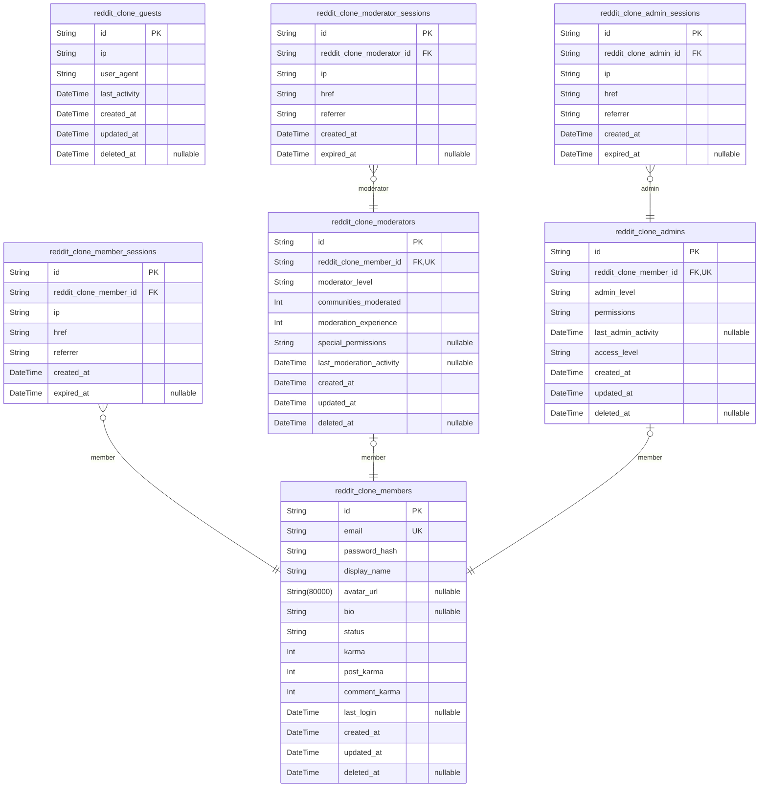

### `reddit_clone_guests`

Temporary visitor accounts for users browsing the platform without
registration. Guests can view public content but cannot create posts,
comments, or vote. These accounts are typically short-lived and used for
exploration before registration.

Properties as follows:

- `id`: Primary Key.
- `ip`: IP address of the guest user for tracking and security purposes.
- `user_agent`: Browser user agent string for compatibility tracking.
- `last_activity`: Timestamp of the guest's last interaction with the platform.
- `created_at`: Timestamp when the guest session was created.
- `updated_at`: Timestamp when the guest session was last updated.
- `deleted_at`: Timestamp when the guest session was soft deleted.

### `reddit_clone_members`

Registered users who can create content, vote, comment, and participate
in communities. Members form the core user base of the platform and have
full access to community features. {@link
reddit_clone_member_sessions.id}

Properties as follows:

- `id`: Primary Key.
- `email`: Unique email address used for authentication and communication.
- `password_hash`: Hashed password for secure authentication using bcrypt algorithm.
- `display_name`: Public display name shown to other users on the platform.
- `avatar_url`: URL to the user's profile picture or avatar.
- `bio`: Short biography or description written by the user.
- `status`: Account status: active, suspended, banned, or deactivated.
- `karma`: Total karma points earned from post and comment votes.
- `post_karma`: Karma earned specifically from post votes.
- `comment_karma`: Karma earned specifically from comment votes.
- `last_login`: Timestamp of the user's last successful login.
- `created_at`: Timestamp when the member account was created.
- `updated_at`: Timestamp when the member account was last updated.
- `deleted_at`: Timestamp when the member account was soft deleted.

### `reddit_clone_member_sessions`

Authentication sessions for member users tracking login activity and
connection context. Used for audit tracing of member actions and session
management. [reddit_clone_members.id](#reddit_clone_members)

Properties as follows:

- `id`: Primary Key.
- `reddit_clone_member_id`: Belonged member's [reddit_clone_members.id](#reddit_clone_members).
- `ip`: IP address of the connection.
- `href`: Connection URL where the session was established.
- `referrer`: Referrer URL that directed the user to the platform.
- `created_at`: Session creation timestamp.
- `expired_at`: Session expiration timestamp.

### `reddit_clone_moderators`

Community moderators who manage specific communities and enforce
community guidelines. Moderators have elevated permissions within their
assigned communities including content removal and user management.
[reddit_clone_moderator_sessions.id](#reddit_clone_moderator_sessions)

Properties as follows:

- `id`: Primary Key.
- `reddit_clone_member_id`: Base member account for the moderator. [reddit_clone_members.id](#reddit_clone_members).
- `moderator_level`: Moderator permission level: junior, senior, or lead moderator.
- `communities_moderated`: Number of communities currently moderated by this user.
- `moderation_experience`: Total months of moderation experience on the platform.
- `special_permissions`: Special moderation permissions granted by administrators.
- `last_moderation_activity`: Timestamp of the last moderation action performed.
- `created_at`: Timestamp when the moderator role was assigned.
- `updated_at`: Timestamp when the moderator profile was last updated.
- `deleted_at`: Timestamp when the moderator role was revoked.

### `reddit_clone_moderator_sessions`

Authentication sessions for moderator users tracking login activity and
connection context. Used for audit tracing of moderation actions and
session management. [reddit_clone_moderators.id](#reddit_clone_moderators)

Properties as follows:

- `id`: Primary Key.
- `reddit_clone_moderator_id`: Belonged moderator's [reddit_clone_moderators.id](#reddit_clone_moderators).
- `ip`: IP address of the connection.
- `href`: Connection URL where the session was established.
- `referrer`: Referrer URL that directed the user to the platform.
- `created_at`: Session creation timestamp.
- `expired_at`: Session expiration timestamp.

### `reddit_clone_admins`

Platform administrators with system-wide management capabilities
including user management, community oversight, and platform
configuration. Administrators have the highest level of permissions.
[reddit_clone_admin_sessions.id](#reddit_clone_admin_sessions)

Properties as follows:

- `id`: Primary Key.
- `reddit_clone_member_id`
  > Base member account for the administrator. {@link
  > reddit_clone_members.id}.
- `admin_level`: Administrative permission level: junior, senior, or system administrator.
- `permissions`: Comma-separated list of specific administrative permissions.
- `last_admin_activity`: Timestamp of the last administrative action performed.
- `access_level`
  > System access level determining which administrative features are
  > available.
- `created_at`: Timestamp when the administrator role was assigned.
- `updated_at`: Timestamp when the administrator profile was last updated.
- `deleted_at`: Timestamp when the administrator role was revoked.

### `reddit_clone_admin_sessions`

Authentication sessions for administrator users tracking login activity
and connection context. Used for audit tracing of administrative actions
and session management. [reddit_clone_admins.id](#reddit_clone_admins)

Properties as follows:

- `id`: Primary Key.
- `reddit_clone_admin_id`: Belonged administrator's [reddit_clone_admins.id](#reddit_clone_admins).
- `ip`: IP address of the connection.
- `href`: Connection URL where the session was established.
- `referrer`: Referrer URL that directed the user to the platform.
- `created_at`: Session creation timestamp.
- `expired_at`: Session expiration timestamp.

## Communities

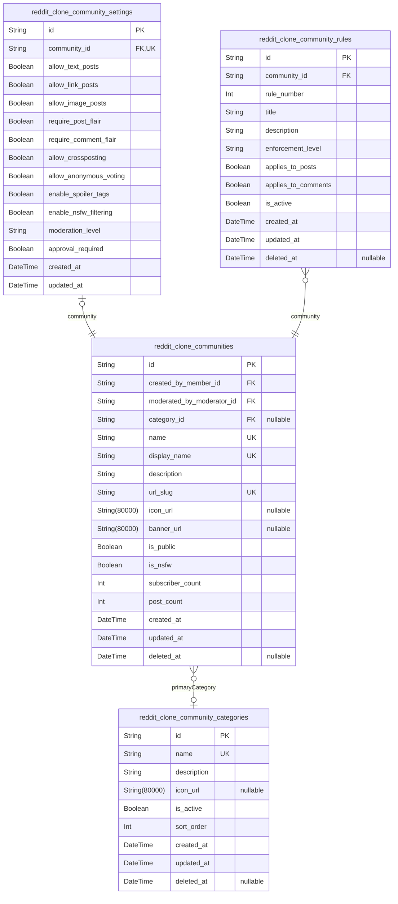

### `reddit_clone_communities`

Core community entities representing subreddit-like communities where
users can post content and engage in discussions. Each community has
unique settings, rules, and categorization. Communities are created by
members and managed by moderators.

Properties as follows:

- `id`: Primary Key.
- `created_by_member_id`: Community creator's member identifier. [reddit_clone_members.id](#reddit_clone_members)
- `moderated_by_moderator_id`
  > Primary moderator responsible for community management. {@link
  > reddit_clone_moderators.id}
- `category_id`
  > Primary category classification for the community. {@link
  > reddit_clone_community_categories.id}
- `name`: Unique community name displayed to users (e.g., 'programming', 'gaming').
- `display_name`: Human-readable display name for the community.
- `description`: Detailed description explaining the community's purpose and focus.
- `url_slug`: URL-friendly identifier used in community URLs (e.g., 'r/programming').
- `icon_url`: Community icon image URL for visual representation.
- `banner_url`: Community banner image URL for header display.
- `is_public`: Whether the community is publicly visible or requires approval to join.
- `is_nsfw`: Whether the community contains Not Safe For Work content.
- `subscriber_count`: Current number of subscribers to the community.
- `post_count`: Current number of posts in the community.
- `created_at`: Timestamp when the community was created.
- `updated_at`: Timestamp when the community was last updated.
- `deleted_at`: Timestamp when the community was soft-deleted.

### `reddit_clone_community_settings`

Community-specific settings and configurations that control community
behavior, moderation rules, and display preferences. Each community has
exactly one settings record.

Properties as follows:

- `id`: Primary Key.
- `community_id`
  > Community that these settings belong to. {@link
  > reddit_clone_communities.id}
- `allow_text_posts`: Whether text posts are allowed in this community.
- `allow_link_posts`: Whether link posts are allowed in this community.
- `allow_image_posts`: Whether image posts are allowed in this community.
- `require_post_flair`: Whether posts must have flair assigned.
- `require_comment_flair`: Whether comments must have flair assigned.
- `allow_crossposting`: Whether crossposting from other communities is allowed.
- `allow_anonymous_voting`: Whether voting is anonymous in this community.
- `enable_spoiler_tags`: Whether spoiler tags are enabled for content.
- `enable_nsfw_filtering`: Whether NSFW content filtering is enabled.
- `moderation_level`: Community moderation strictness level (relaxed, standard, strict).
- `approval_required`: Whether posts require moderator approval before publication.
- `created_at`: Timestamp when the settings were created.
- `updated_at`: Timestamp when the settings were last updated.

### `reddit_clone_community_rules`

Community-specific rules and guidelines that members must follow. Each
community can have multiple rules with specific enforcement levels.

Properties as follows:

- `id`: Primary Key.
- `community_id`: Community that this rule belongs to. [reddit_clone_communities.id](#reddit_clone_communities)
- `rule_number`: Sequential rule number for ordering and reference.
- `title`: Short title summarizing the rule.
- `description`: Detailed description explaining the rule and its purpose.
- `enforcement_level`: Rule enforcement strictness (warning, removal, ban).
- `applies_to_posts`: Whether this rule applies to posts.
- `applies_to_comments`: Whether this rule applies to comments.
- `is_active`: Whether this rule is currently active and enforced.
- `created_at`: Timestamp when the rule was created.
- `updated_at`: Timestamp when the rule was last updated.
- `deleted_at`: Timestamp when the rule was soft-deleted.

### `reddit_clone_community_categories`

Category classification system for organizing communities by topic or
theme. Categories help users discover relevant communities.

Properties as follows:

- `id`: Primary Key.
- `name`: Unique category name (e.g., 'Technology', 'Gaming', 'Sports').
- `description`: Description explaining the category's focus and scope.
- `icon_url`: Category icon image URL for visual representation.
- `is_active`: Whether this category is active and available for use.
- `sort_order`: Display order for category listing (lower numbers appear first).
- `created_at`: Timestamp when the category was created.
- `updated_at`: Timestamp when the category was last updated.
- `deleted_at`: Timestamp when the category was soft-deleted.

## Content

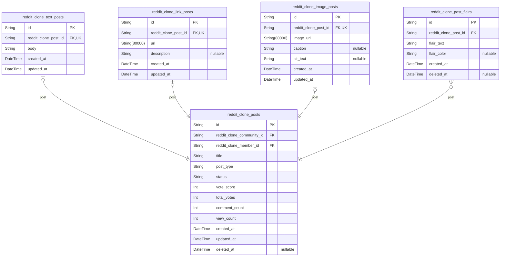

### `reddit_clone_posts`

Main post entity containing shared attributes for all post types. Posts
are the primary content units created by users within communities. Each
post can be of type text, link, or image, with type-specific attributes
stored in subtype tables. [reddit_clone_communities.id](#reddit_clone_communities) {@link
reddit_clone_members.id}

Properties as follows:

- `id`: Primary Key.
- `reddit_clone_community_id`: Community where the post is published. [reddit_clone_communities.id](#reddit_clone_communities)
- `reddit_clone_member_id`: Member who created the post. [reddit_clone_members.id](#reddit_clone_members)
- `title`: Post title displayed to users.
- `post_type`: Type of post: text, link, or image.
- `status`: Post status: draft, published, archived, or removed.
- `vote_score`: Current vote score (upvotes - downvotes).
- `total_votes`: Total number of votes received.
- `comment_count`: Number of comments on the post.
- `view_count`: Number of times the post was viewed.
- `created_at`: When the post was created.
- `updated_at`: When the post was last updated.
- `deleted_at`: When the post was soft deleted.

### `reddit_clone_text_posts`

Text post subtype containing the body content for text-based posts. Text
posts include detailed content that users write directly on the platform.
[reddit_clone_posts.id](#reddit_clone_posts)

Properties as follows:

- `id`: Primary Key.
- `reddit_clone_post_id`: Reference to the main post entity. [reddit_clone_posts.id](#reddit_clone_posts)
- `body`: The main content of the text post.
- `created_at`: When the text post was created.
- `updated_at`: When the text post was last updated.

### `reddit_clone_link_posts`

Link post subtype containing URL and metadata for external link posts.
Link posts redirect users to external content while providing context and
discussion. [reddit_clone_posts.id](#reddit_clone_posts)

Properties as follows:

- `id`: Primary Key.
- `reddit_clone_post_id`: Reference to the main post entity. [reddit_clone_posts.id](#reddit_clone_posts)
- `url`: The external URL being shared.
- `description`: Optional description of the linked content.
- `created_at`: When the link post was created.
- `updated_at`: When the link post was last updated.

### `reddit_clone_image_posts`

Image post subtype containing image metadata and storage information.
Image posts allow users to share visual content with captions and
descriptions. [reddit_clone_posts.id](#reddit_clone_posts)

Properties as follows:

- `id`: Primary Key.
- `reddit_clone_post_id`: Reference to the main post entity. [reddit_clone_posts.id](#reddit_clone_posts)
- `image_url`: URL to the uploaded image.
- `caption`: Caption describing the image.
- `alt_text`: Accessibility text describing the image.
- `created_at`: When the image post was created.
- `updated_at`: When the image post was last updated.

### `reddit_clone_post_flairs`

Post flair entity for categorizing and tagging posts. Flairs help users
identify post topics and communities organize content by themes. {@link
reddit_clone_posts.id}

Properties as follows:

- `id`: Primary Key.
- `reddit_clone_post_id`: Reference to the post being flaired. [reddit_clone_posts.id](#reddit_clone_posts)
- `flair_text`: The display text of the flair.
- `flair_color`: Color code for the flair display.
- `created_at`: When the flair was applied.
- `deleted_at`: When the flair was removed.

## Comments

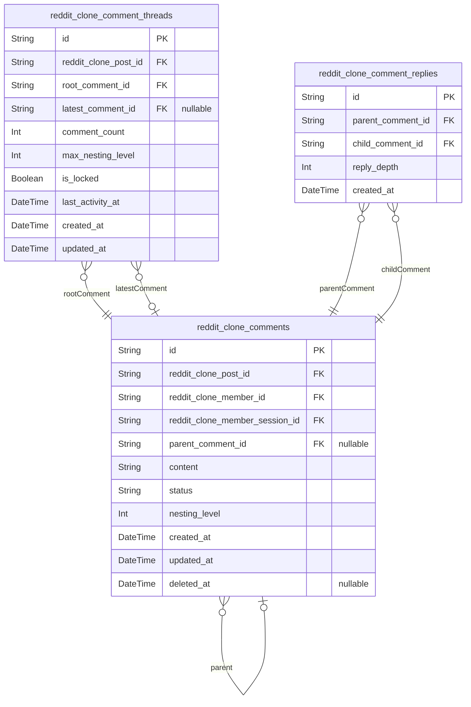

### `reddit_clone_comments`

Main comment entity containing comment content, author information, and
moderation status. Comments support nested replies up to 10 levels deep
and can be associated with posts in any community. {@link
reddit_clone_posts.id} [reddit_clone_members.id](#reddit_clone_members)

Properties as follows:

- `id`: Primary Key.
- `reddit_clone_post_id`
  > Associated post where this comment is posted. {@link
  > reddit_clone_posts.id}
- `reddit_clone_member_id`: Member who created this comment. [reddit_clone_members.id](#reddit_clone_members)
- `reddit_clone_member_session_id`
  > Session when the comment was created. {@link
  > reddit_clone_member_sessions.id}
- `parent_comment_id`
  > Parent comment for nested replies (nullable for top-level comments).
  > [reddit_clone_comments.id](#reddit_clone_comments)
- `content`: Comment text content with markdown formatting support.
- `status`: Comment moderation status (pending, approved, removed, locked).
- `nesting_level`: Depth level in comment hierarchy (0 for top-level comments).
- `created_at`: Timestamp when the comment was created.
- `updated_at`: Timestamp when the comment was last modified.
- `deleted_at`: Timestamp when the comment was soft-deleted.

### `reddit_clone_comment_threads`

Thread management table for organizing comment hierarchies and tracking
thread properties. Supports efficient loading and navigation of comment
threads. [reddit_clone_comments.id](#reddit_clone_comments) [reddit_clone_posts.id](#reddit_clone_posts)

Properties as follows:

- `id`: Primary Key.
- `reddit_clone_post_id`: Post containing this comment thread. [reddit_clone_posts.id](#reddit_clone_posts)
- `root_comment_id`: Root comment that started this thread. [reddit_clone_comments.id](#reddit_clone_comments)
- `latest_comment_id`: Most recent comment in this thread. [reddit_clone_comments.id](#reddit_clone_comments)
- `comment_count`: Total number of comments in this thread.
- `max_nesting_level`: Maximum nesting depth reached in this thread.
- `is_locked`: Whether this thread is locked for new comments.
- `last_activity_at`: Timestamp of the most recent activity in this thread.
- `created_at`: Timestamp when the thread was created.
- `updated_at`: Timestamp when thread properties were last updated.

### `reddit_clone_comment_replies`

Junction table for managing reply relationships between comments.
Supports efficient querying of reply chains and nested comment
structures. [reddit_clone_comments.id](#reddit_clone_comments)

Properties as follows:

- `id`: Primary Key.
- `parent_comment_id`: Parent comment being replied to. [reddit_clone_comments.id](#reddit_clone_comments)
- `child_comment_id`: Child comment that is the reply. [reddit_clone_comments.id](#reddit_clone_comments)
- `reply_depth`: Depth level of this reply in the hierarchy.
- `created_at`: Timestamp when the reply relationship was created.

## Voting

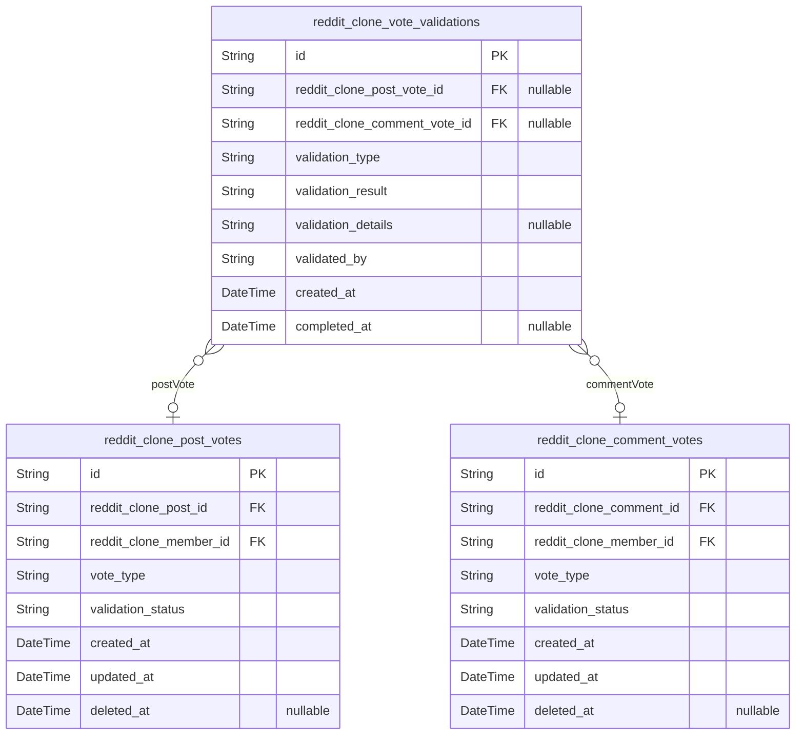

### `reddit_clone_post_votes`

Records individual votes cast by members on posts. Each vote represents a
single member's upvote or downvote on a specific post. This table enables
vote counting, karma calculation, and post ranking algorithms. {@link
reddit_clone_posts.id} [reddit_clone_members.id](#reddit_clone_members)

Properties as follows:

- `id`: Primary Key.
- `reddit_clone_post_id`: Target post being voted on. [reddit_clone_posts.id](#reddit_clone_posts)
- `reddit_clone_member_id`: Member who cast the vote. [reddit_clone_members.id](#reddit_clone_members)
- `vote_type`: Type of vote cast: 'upvote' or 'downvote'. Determines karma impact.
- `validation_status`
  > Status of vote validation: 'pending', 'valid', 'suspicious', 'invalid'.
  > Used for vote integrity checks.
- `created_at`: Timestamp when the vote was cast.
- `updated_at`: Timestamp when the vote was last updated.
- `deleted_at`: Timestamp when the vote was soft deleted.

### `reddit_clone_comment_votes`

Records individual votes cast by members on comments. Each vote
represents a single member's upvote or downvote on a specific comment.
Supports comment ranking and user karma calculation. {@link
reddit_clone_comments.id} [reddit_clone_members.id](#reddit_clone_members)

Properties as follows:

- `id`: Primary Key.
- `reddit_clone_comment_id`: Target comment being voted on. [reddit_clone_comments.id](#reddit_clone_comments)
- `reddit_clone_member_id`: Member who cast the vote. [reddit_clone_members.id](#reddit_clone_members)
- `vote_type`: Type of vote cast: 'upvote' or 'downvote'. Determines karma impact.
- `validation_status`
  > Status of vote validation: 'pending', 'valid', 'suspicious', 'invalid'.
  > Used for vote integrity checks.
- `created_at`: Timestamp when the vote was cast.
- `updated_at`: Timestamp when the vote was last updated.
- `deleted_at`: Timestamp when the vote was soft deleted.

### `reddit_clone_vote_validations`

Tracks validation processes for suspicious voting patterns. Used by the
system to detect and manage vote manipulation, ensuring voting integrity
across the platform. [reddit_clone_post_votes.id](#reddit_clone_post_votes) {@link
reddit_clone_comment_votes.id}

Properties as follows:

- `id`: Primary Key.
- `reddit_clone_post_vote_id`: Reference to post vote being validated. [reddit_clone_post_votes.id](#reddit_clone_post_votes)
- `reddit_clone_comment_vote_id`
  > Reference to comment vote being validated. {@link
  > reddit_clone_comment_votes.id}
- `validation_type`
  > Type of validation being performed: 'pattern_analysis', 'rate_limit',
  > 'suspicious_behavior', 'manual_review'.
- `validation_result`
  > Result of the validation: 'clean', 'suspicious', 'invalid',
  > 'requires_review'.
- `validation_details`: Detailed information about the validation findings and reasoning.
- `validated_by`
  > Entity that performed the validation: 'system', 'moderator_id',
  > 'admin_id'.
- `created_at`: Timestamp when the validation was initiated.
- `completed_at`: Timestamp when the validation was completed.

## Karma

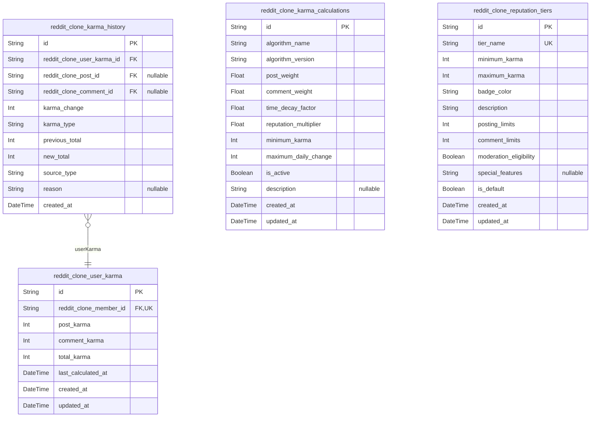

### `reddit_clone_user_karma`

Stores current karma totals for users, tracking both post karma and
comment karma separately. Each user has one karma record that accumulates
points from votes on their content. Karma is calculated as upvotes minus
downvotes and serves as the user's reputation score on the platform.

Properties as follows:

- `id`: Primary Key.
- `reddit_clone_member_id`
  > Reference to the member whose karma is being tracked. {@link
  > reddit_clone_members.id}
- `post_karma`
  > Total karma points earned from posts. Each upvote adds +1, each downvote
  > subtracts -1.
- `comment_karma`
  > Total karma points earned from comments. Each upvote adds +1, each
  > downvote subtracts -1.
- `total_karma`: Sum of post_karma and comment_karma. Used for overall reputation ranking.
- `last_calculated_at`: Timestamp when karma was last recalculated to ensure data freshness.
- `created_at`: When the karma record was first created for the user.
- `updated_at`: When the karma record was last updated with new calculations.

### `reddit_clone_karma_history`

Historical record of karma changes for audit trail and analysis. Tracks
every karma adjustment with timestamp, source, and reason. Used for
debugging karma calculations and providing transparency to users about
their reputation changes.

Properties as follows:

- `id`: Primary Key.
- `reddit_clone_user_karma_id`
  > Reference to the user karma record being modified. {@link
  > reddit_clone_user_karma.id}
- `reddit_clone_post_id`
  > Reference to the post that generated this karma change, if applicable.
  > [reddit_clone_posts.id](#reddit_clone_posts)
- `reddit_clone_comment_id`
  > Reference to the comment that generated this karma change, if applicable.
  > [reddit_clone_comments.id](#reddit_clone_comments)
- `karma_change`
  > Amount of karma added or subtracted. Positive for upvotes, negative for
  > downvotes.
- `karma_type`
  > Type of karma change: 'post_upvote', 'post_downvote', 'comment_upvote',
  > 'comment_downvote'.
- `previous_total`: Total karma before this change occurred.
- `new_total`: Total karma after this change was applied.
- `source_type`: Source of the karma change: 'vote', 'moderation', 'system_adjustment'.
- `reason`
  > Detailed reason for the karma change, such as which post/comment was
  > voted on.
- `created_at`: Timestamp when this karma change was recorded.

### `reddit_clone_karma_calculations`

Configuration and algorithms for karma calculation. Stores different
calculation methods, weighting factors, and parameters used in the karma
system. Allows for A/B testing of different karma algorithms and gradual
algorithm updates.

Properties as follows:

- `id`: Primary Key.
- `algorithm_name`
  > Name of the karma calculation algorithm, e.g., 'standard', 'weighted',
  > 'time_decay'.
- `algorithm_version`: Version identifier for the algorithm to track changes over time.
- `post_weight`: Weighting factor for post karma in overall calculation.
- `comment_weight`: Weighting factor for comment karma in overall calculation.
- `time_decay_factor`: Factor for reducing impact of older votes over time.
- `reputation_multiplier`: Multiplier for votes from high-reputation users.
- `minimum_karma`: Minimum karma value to prevent negative reputation spirals.
- `maximum_daily_change`: Maximum karma change allowed per day to prevent gaming.
- `is_active`: Whether this calculation method is currently active.
- `description`: Detailed description of the algorithm and its parameters.
- `created_at`: When this calculation method was created.
- `updated_at`: When this calculation method was last modified.

### `reddit_clone_reputation_tiers`

Defines reputation tiers and their corresponding karma thresholds. Used
to categorize users into reputation levels (e.g., New User, Trusted User,
Community Leader) based on their karma scores. Each tier has associated
privileges and visual indicators.

Properties as follows:

- `id`: Primary Key.
- `tier_name`
  > Name of the reputation tier, e.g., 'New User', 'Active Member', 'Trusted
  > User'.
- `minimum_karma`: Minimum karma required to achieve this tier.
- `maximum_karma`: Maximum karma for this tier (exclusive). Use -1 for no maximum.
- `badge_color`: CSS color code for the tier badge display.
- `description`: Description of the tier and its associated privileges.
- `posting_limits`: Maximum posts per hour allowed for this tier.
- `comment_limits`: Maximum comments per hour allowed for this tier.
- `moderation_eligibility`: Whether users in this tier can be nominated as moderators.
- `special_features`: Comma-separated list of special features available to this tier.
- `is_default`: Whether this is the default tier for new users.
- `created_at`: When this reputation tier was created.
- `updated_at`: When this reputation tier was last modified.

## Subscriptions

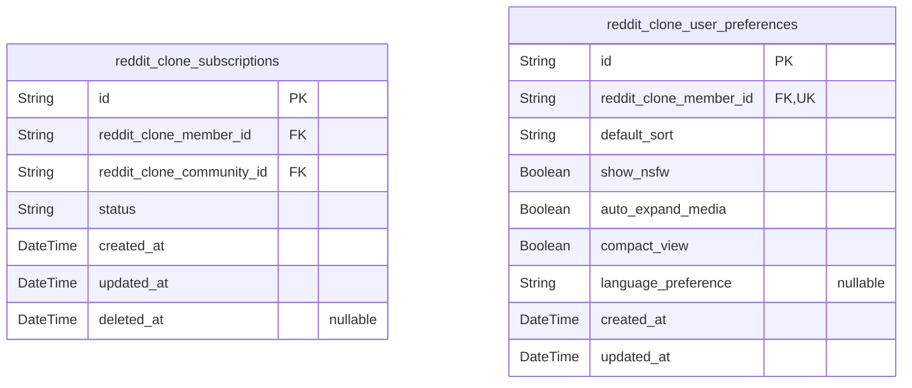

### `reddit_clone_subscriptions`

Core subscription relationship between users and communities. Tracks
which communities users are subscribed to and manages subscription
status. Users can independently subscribe/unsubscribe from communities,
and this table enables personalized feed generation based on subscription
relationships. [reddit_clone_members.id](#reddit_clone_members) {@link
reddit_clone_communities.id}

Properties as follows:

- `id`: Primary Key.
- `reddit_clone_member_id`: Subscribed member's identifier. [reddit_clone_members.id](#reddit_clone_members)
- `reddit_clone_community_id`: Subscribed community's identifier. [reddit_clone_communities.id](#reddit_clone_communities)
- `status`
  > Subscription status indicating whether the subscription is active,
  > inactive, or pending.
- `created_at`: Timestamp when the subscription was created.
- `updated_at`: Timestamp when the subscription was last updated.
- `deleted_at`: Timestamp when the subscription was soft deleted, allowing for recovery.

### `reddit_clone_user_preferences`

User-specific preferences for feed customization and display settings.
Stores individual user preferences for how their subscribed content is
presented, including sorting preferences, content filters, and display
options. [reddit_clone_members.id](#reddit_clone_members)

Properties as follows:

- `id`: Primary Key.
- `reddit_clone_member_id`
  > Member identifier for preference association. {@link
  > reddit_clone_members.id}
- `default_sort`
  > Default sorting preference for the user's feed (hot, new, top,
  > controversial).
- `show_nsfw`: Whether to show NSFW (Not Safe For Work) content in feeds.
- `auto_expand_media`: Automatically expand media content in feed displays.
- `compact_view`: Use compact view for feed display to show more content per page.
- `language_preference`: Preferred language for content filtering and display.
- `created_at`: Timestamp when preferences were initially set.
- `updated_at`: Timestamp when preferences were last modified.

## Moderation

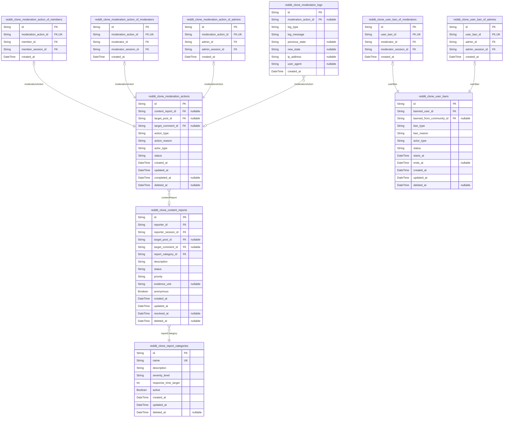

### `reddit_clone_content_reports`

User-submitted content reports for inappropriate or rule-violating
content. Contains report details, reporter information, and moderation
status. Reports can target posts, comments, or other content types.
[reddit_clone_posts.id](#reddit_clone_posts), [reddit_clone_comments.id](#reddit_clone_comments)

Properties as follows:

- `id`: Primary Key.
- `reporter_id`: User who submitted the report. [reddit_clone_members.id](#reddit_clone_members)
- `reporter_session_id`: Session when report was submitted. [reddit_clone_member_sessions.id](#reddit_clone_member_sessions)
- `target_post_id`: Reported post if applicable. [reddit_clone_posts.id](#reddit_clone_posts)
- `target_comment_id`: Reported comment if applicable. [reddit_clone_comments.id](#reddit_clone_comments)
- `report_category_id`: Category of the report. [reddit_clone_report_categories.id](#reddit_clone_report_categories)
- `description`: Detailed explanation of the report provided by the user.
- `status`: Current status of the report (pending, reviewed, resolved, dismissed).
- `priority`: Report priority level (low, medium, high, critical).
- `evidence_urls`: Comma-separated URLs providing evidence for the report.
- `anonymous`: Whether the reporter wishes to remain anonymous.
- `created_at`: When the report was submitted.
- `updated_at`: When the report was last updated.
- `resolved_at`: When the report was resolved by a moderator.
- `deleted_at`: When the report was soft deleted.

### `reddit_clone_moderation_actions`

Main moderation action entity containing shared attributes for all
moderation actions. This table serves as the central record for all
moderation activities performed across the platform, with subtype tables
providing actor-specific details. [reddit_clone_content_reports.id](#reddit_clone_content_reports)

Properties as follows:

- `id`: Primary Key.
- `content_report_id`
  > Associated content report if applicable. {@link
  > reddit_clone_content_reports.id}
- `target_post_id`: Post targeted by moderation action. [reddit_clone_posts.id](#reddit_clone_posts)
- `target_comment_id`: Comment targeted by moderation action. [reddit_clone_comments.id](#reddit_clone_comments)
- `action_type`
  > Type of moderation action (remove, approve, lock, spoiler, nsfw,
  > quarantine).
- `action_reason`: Detailed reason for the moderation action.
- `actor_type`
  > Type of actor performing the action (member, moderator, admin). Used for
  > quick filtering and categorization.
- `status`: Current status of the action (pending, completed, reversed, appealed).
- `created_at`: When the moderation action was taken.
- `updated_at`: When the moderation action was last updated.
- `completed_at`: When the moderation action was completed.
- `deleted_at`: When the moderation action was soft deleted.

### `reddit_clone_moderation_action_of_members`

Member-specific details for moderation actions performed by regular
members. Links moderation actions to member actors and sessions for
proper audit trail tracking. [reddit_clone_moderation_actions.id](#reddit_clone_moderation_actions)

Properties as follows:

- `id`: Primary Key.
- `moderation_action_id`: Associated moderation action. [reddit_clone_moderation_actions.id](#reddit_clone_moderation_actions)
- `member_id`
  > Member who performed the moderation action. {@link
  > reddit_clone_members.id}
- `member_session_id`: Session when action was performed. [reddit_clone_member_sessions.id](#reddit_clone_member_sessions)
- `created_at`: When the member moderation action was recorded.

### `reddit_clone_moderation_action_of_moderators`

Moderator-specific details for moderation actions performed by community
moderators. Links moderation actions to moderator actors and sessions for
comprehensive audit trails. [reddit_clone_moderation_actions.id](#reddit_clone_moderation_actions)

Properties as follows:

- `id`: Primary Key.
- `moderation_action_id`: Associated moderation action. [reddit_clone_moderation_actions.id](#reddit_clone_moderation_actions)
- `moderator_id`
  > Moderator who performed the moderation action. {@link
  > reddit_clone_moderators.id}
- `moderator_session_id`
  > Session when action was performed. {@link
  > reddit_clone_moderator_sessions.id}
- `created_at`: When the moderator moderation action was recorded.

### `reddit_clone_moderation_action_of_admins`

Administrator-specific details for moderation actions performed by
platform administrators. Links moderation actions to admin actors and
sessions for system-wide audit capability. {@link
reddit_clone_moderation_actions.id}

Properties as follows:

- `id`: Primary Key.
- `moderation_action_id`: Associated moderation action. [reddit_clone_moderation_actions.id](#reddit_clone_moderation_actions)
- `admin_id`: Admin who performed the moderation action. [reddit_clone_admins.id](#reddit_clone_admins)
- `admin_session_id`: Session when action was performed. [reddit_clone_admin_sessions.id](#reddit_clone_admin_sessions)
- `created_at`: When the admin moderation action was recorded.

### `reddit_clone_report_categories`

Predefined categories for content reports to standardize reporting and
moderation workflows. Used to classify user reports for efficient
processing.

Properties as follows:

- `id`: Primary Key.
- `name`: Category name (e.g., spam, harassment, hate speech).
- `description`: Detailed description of what this category includes.
- `severity_level`: Default severity level for this category (low, medium, high, critical).
- `response_time_target`: Target response time in hours for this category.
- `active`: Whether this category is currently active for reporting.
- `created_at`: When the report category was created.
- `updated_at`: When the report category was last updated.
- `deleted_at`: When the report category was soft deleted.

### `reddit_clone_moderation_logs`

Comprehensive audit trail of all moderation activities for transparency
and accountability. Records complete history of moderation decisions and
actions. [reddit_clone_moderation_actions.id](#reddit_clone_moderation_actions)

Properties as follows:

- `id`: Primary Key.
- `moderation_action_id`: Associated moderation action. [reddit_clone_moderation_actions.id](#reddit_clone_moderation_actions)
- `log_type`
  > Type of log entry (action_taken, decision_made, appeal_handled,
  > policy_change).
- `log_message`: Detailed description of the moderation event.
- `previous_state`: JSON representation of the state before the moderation action.
- `new_state`: JSON representation of the state after the moderation action.
- `ip_address`: IP address from which the moderation action was performed.
- `user_agent`: User agent string of the moderator's browser.
- `created_at`: When the moderation log entry was created.

### `reddit_clone_user_bans`

Records of user bans imposed by moderators or administrators. Tracks ban
duration, reason, and appeal status for comprehensive user management.
[reddit_clone_members.id](#reddit_clone_members)

Properties as follows:

- `id`: Primary Key.
- `banned_user_id`: User who is being banned. [reddit_clone_members.id](#reddit_clone_members)
- `banned_from_community_id`
  > Community from which the user is banned. {@link
  > reddit_clone_communities.id}
- `ban_type`: Type of ban (temporary, permanent, shadow).
- `ban_reason`: Detailed reason for the ban.
- `actor_type`: Type of actor imposing the ban (moderator, admin).
- `status`: Current status of the ban (active, expired, appealed, overturned).
- `starts_at`: When the ban period begins.
- `ends_at`: When the ban period ends (null for permanent bans).
- `created_at`: When the ban was imposed.
- `updated_at`: When the ban was last updated.
- `deleted_at`: When the ban was soft deleted.

### `reddit_clone_user_ban_of_moderators`

Moderator-specific details for user bans imposed by community moderators.
Links user bans to moderator actors and sessions for proper audit trail.
[reddit_clone_user_bans.id](#reddit_clone_user_bans)

Properties as follows:

- `id`: Primary Key.
- `user_ban_id`: Associated user ban. [reddit_clone_user_bans.id](#reddit_clone_user_bans)
- `moderator_id`: Moderator who imposed the ban. [reddit_clone_moderators.id](#reddit_clone_moderators)
- `moderator_session_id`: Session when ban was imposed. [reddit_clone_moderator_sessions.id](#reddit_clone_moderator_sessions)
- `created_at`: When the moderator ban action was recorded.

### `reddit_clone_user_ban_of_admins`

Administrator-specific details for user bans imposed by platform
administrators. Links user bans to admin actors and sessions for
system-wide audit capability. [reddit_clone_user_bans.id](#reddit_clone_user_bans)

Properties as follows:

- `id`: Primary Key.
- `user_ban_id`: Associated user ban. [reddit_clone_user_bans.id](#reddit_clone_user_bans)
- `admin_id`: Admin who imposed the ban. [reddit_clone_admins.id](#reddit_clone_admins)
- `admin_session_id`: Session when ban was imposed. [reddit_clone_admin_sessions.id](#reddit_clone_admin_sessions)
- `created_at`: When the admin ban action was recorded.

## Analytics

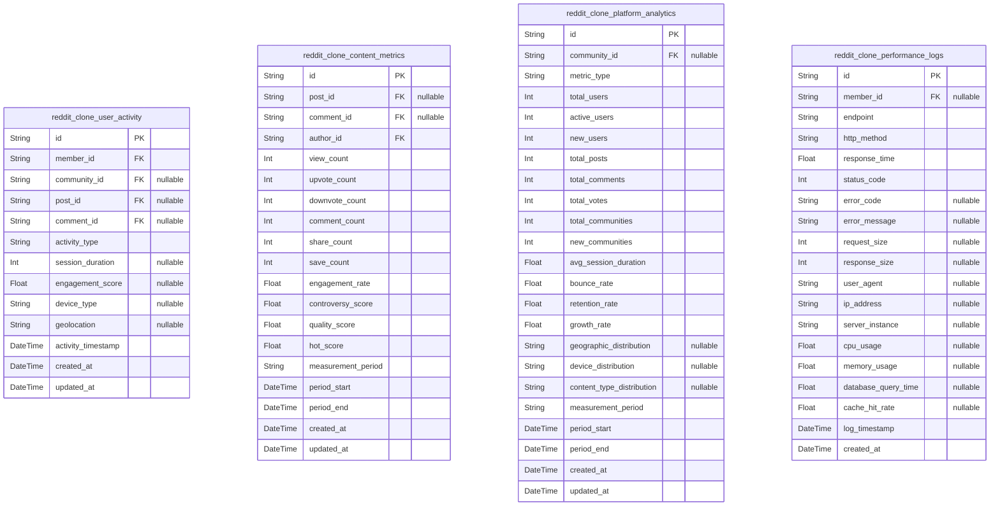

### `reddit_clone_user_activity`

Tracks user engagement metrics and activity patterns across the platform.
Captures user interactions with communities, content creation, voting
behavior, and session data for analytics and business intelligence.
[reddit_clone_members.id](#reddit_clone_members), [reddit_clone_communities.id](#reddit_clone_communities),
[reddit_clone_posts.id](#reddit_clone_posts), [reddit_clone_comments.id](#reddit_clone_comments)

Properties as follows:

- `id`: Primary Key.
- `member_id`
  > Reference to the member whose activity is being tracked. {@link
  > reddit_clone_members.id}
- `community_id`
  > Reference to the community where activity occurred. {@link
  > reddit_clone_communities.id}
- `post_id`
  > Reference to the post involved in the activity. {@link
  > reddit_clone_posts.id}
- `comment_id`
  > Reference to the comment involved in the activity. {@link
  > reddit_clone_comments.id}
- `activity_type`
  > Type of user activity (post_view, comment_create, vote_cast,
  > subscription_add, etc.).
- `session_duration`: Duration of user session in seconds for this activity period.
- `engagement_score`: Calculated engagement score based on activity intensity and quality.
- `device_type`: Type of device used for the activity (web, mobile_app, tablet).
- `geolocation`: Geographic location of the user during the activity.
- `activity_timestamp`: Exact timestamp when the activity occurred.
- `created_at`: Record creation timestamp.
- `updated_at`: Record last update timestamp.

### `reddit_clone_content_metrics`

Measures content performance metrics including engagement rates, view
counts, vote ratios, and quality indicators for posts and comments.
Provides data for content recommendation algorithms and quality
assessment. [reddit_clone_posts.id](#reddit_clone_posts), {@link
reddit_clone_comments.id}, [reddit_clone_members.id](#reddit_clone_members)

Properties as follows:

- `id`: Primary Key.
- `post_id`: Reference to the post being measured. [reddit_clone_posts.id](#reddit_clone_posts)
- `comment_id`: Reference to the comment being measured. [reddit_clone_comments.id](#reddit_clone_comments)
- `author_id`: Reference to the content author. [reddit_clone_members.id](#reddit_clone_members)
- `view_count`: Total number of views for the content.
- `upvote_count`: Total number of upvotes received.
- `downvote_count`: Total number of downvotes received.
- `comment_count`: Number of comments on the content.
- `share_count`: Number of times content was shared.
- `save_count`: Number of times content was saved by users.
- `engagement_rate`: Calculated engagement rate (interactions per view).
- `controversy_score`: Score indicating content controversy level based on vote ratio.
- `quality_score`: Algorithmic quality assessment score.
- `hot_score`: Hot algorithm score for content ranking.
- `measurement_period`: Time period for metrics (hourly, daily, weekly, monthly).
- `period_start`: Start timestamp of the measurement period.
- `period_end`: End timestamp of the measurement period.
- `created_at`: Record creation timestamp.
- `updated_at`: Record last update timestamp.

### `reddit_clone_platform_analytics`

Aggregated platform-wide analytics including user growth, content volume,
engagement trends, and business metrics. Used for strategic
decision-making and performance tracking. {@link
reddit_clone_communities.id}

Properties as follows:

- `id`: Primary Key.
- `community_id`
  > Reference to the community for community-specific analytics. {@link
  > reddit_clone_communities.id}
- `metric_type`
  > Type of platform metric (user_growth, content_volume, engagement,
  > revenue, etc.).
- `total_users`: Total number of registered users at period end.
- `active_users`: Number of active users during the period.
- `new_users`: Number of new users registered during the period.
- `total_posts`: Total number of posts created during the period.
- `total_comments`: Total number of comments created during the period.
- `total_votes`: Total number of votes cast during the period.
- `total_communities`: Total number of communities at period end.
- `new_communities`: Number of new communities created during the period.
- `avg_session_duration`: Average user session duration in seconds.
- `bounce_rate`: Percentage of single-page sessions.
- `retention_rate`: User retention rate percentage.
- `growth_rate`: Platform growth rate percentage.
- `geographic_distribution`: JSON string representing user geographic distribution.
- `device_distribution`: JSON string representing device usage distribution.
- `content_type_distribution`: JSON string representing content type distribution.
- `measurement_period`: Time period for analytics (daily, weekly, monthly).
- `period_start`: Start timestamp of the measurement period.
- `period_end`: End timestamp of the measurement period.
- `created_at`: Record creation timestamp.
- `updated_at`: Record last update timestamp.

### `reddit_clone_performance_logs`

Tracks system performance metrics including response times, error rates,
resource utilization, and API endpoint performance. Used for monitoring
system health and identifying performance bottlenecks. {@link
reddit_clone_members.id}

Properties as follows:

- `id`: Primary Key.
- `member_id`
  > Reference to the member whose request triggered the performance log.
  > [reddit_clone_members.id](#reddit_clone_members)
- `endpoint`: API endpoint or page that was accessed.
- `http_method`: HTTP method used for the request (GET, POST, PUT, DELETE).
- `response_time`: Response time in milliseconds.
- `status_code`: HTTP status code returned.
- `error_code`: Error code if request failed.
- `error_message`: Detailed error message if request failed.
- `request_size`: Size of the request in bytes.
- `response_size`: Size of the response in bytes.
- `user_agent`: User agent string from the request.
- `ip_address`: IP address of the requester.
- `server_instance`: Identifier of the server instance that handled the request.
- `cpu_usage`: CPU usage percentage at time of request.
- `memory_usage`: Memory usage percentage at time of request.
- `database_query_time`: Time spent on database queries in milliseconds.
- `cache_hit_rate`: Cache hit rate percentage for the request.
- `log_timestamp`: Exact timestamp when the performance measurement was taken.
- `created_at`: Record creation timestamp.

## default

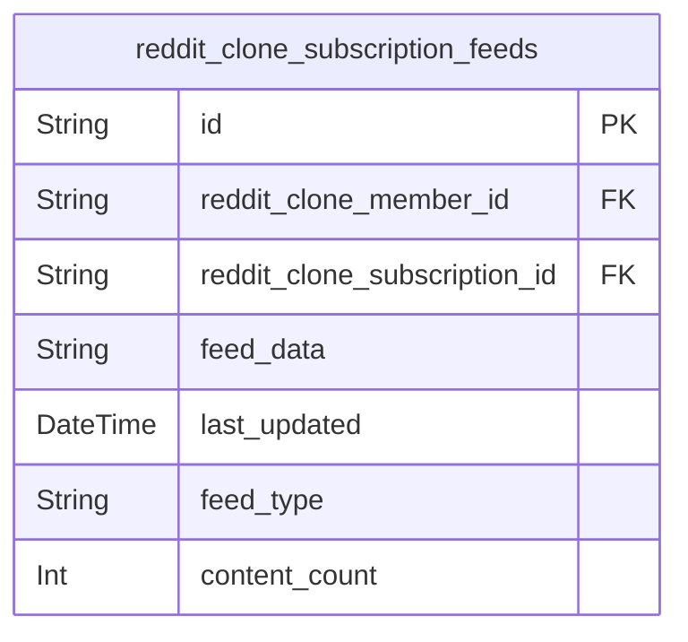

### `reddit_clone_subscription_feeds`

Materialized view for optimized subscription feed generation.
Pre-computes and caches personalized feed data for efficient content
delivery to subscribed users. This denormalized view improves performance
by aggregating subscription relationships and community content. {@link
reddit_clone_subscriptions.id} [reddit_clone_members.id](#reddit_clone_members) {@link
reddit_clone_communities.id}

Properties as follows:

- `id`: Primary Key.
- `reddit_clone_member_id`: Member identifier for personalized feed. [reddit_clone_members.id](#reddit_clone_members)
- `reddit_clone_subscription_id`
  > Subscription relationship identifier. {@link
  > reddit_clone_subscriptions.id}
- `feed_data`
  > JSON structure containing aggregated feed content from subscribed
  > communities.
- `last_updated`: Timestamp when the feed data was last refreshed.
- `feed_type`: Type of feed (hot, new, top, controversial) for sorting algorithm.
- `content_count`: Number of content items in the current feed for pagination optimization.
