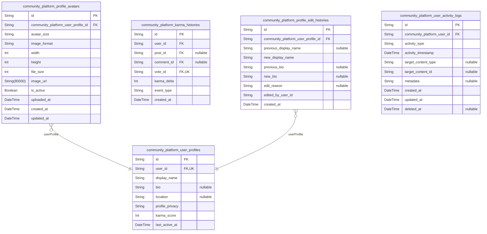
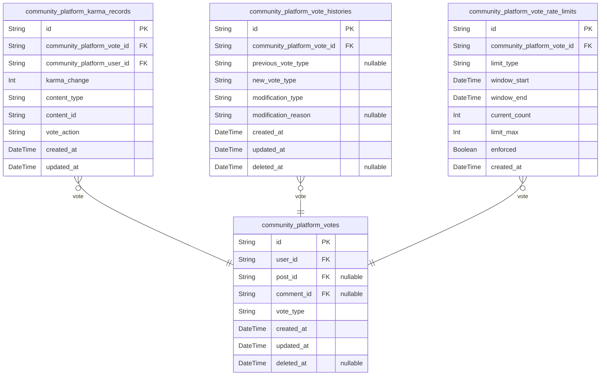
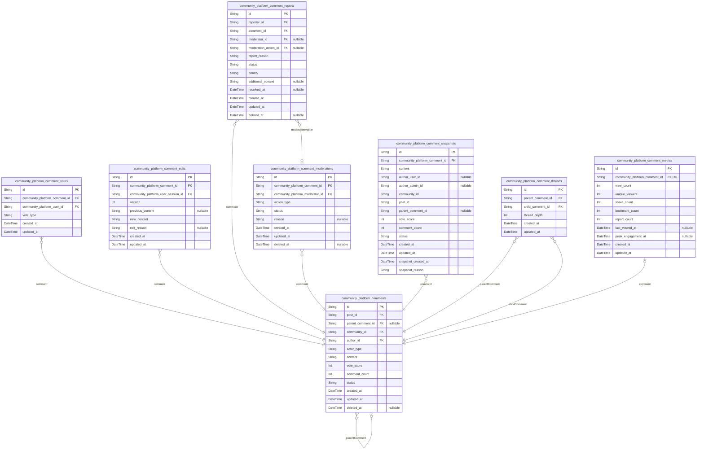
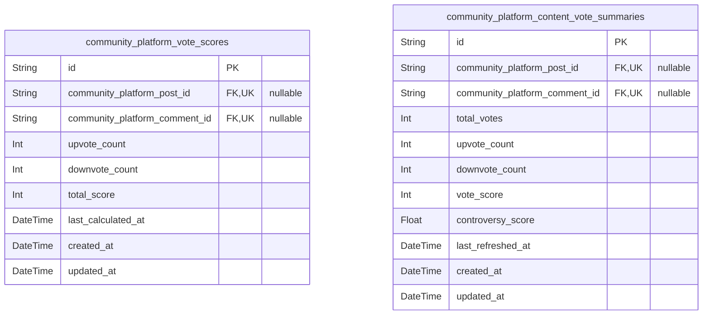

# Prisma Markdown

> Generated by [`prisma-markdown`](https://github.com/samchon/prisma-markdown)

- [Actors](#actors)
- [Systematic](#systematic)
- [Profiles](#profiles)
- [Communities](#communities)
- [Posts](#posts)
- [Voting](#voting)
- [Comments](#comments)
- [Feeds](#feeds)
- [Moderation](#moderation)
- [default](#default)

## Actors

```mermaid
erDiagram
"community_platform_users" {
  String id PK
  String email UK
  String password_hash
  String username UK
  Boolean email_verified
  String account_status
  DateTime created_at
  DateTime updated_at
  DateTime deleted_at "nullable"
}
"community_platform_user_sessions" {
  String id PK
  String community_platform_user_id FK
  String access_token UK
  String refresh_token UK
  String ip_address
  String user_agent
  String referrer "nullable"
  DateTime created_at
  DateTime updated_at
  DateTime expired_at
}
"community_platform_user_password_resets" {
  String id PK
  String community_platform_user_id FK
  String reset_token UK
  DateTime expires_at
  DateTime used_at "nullable"
  DateTime created_at
  DateTime updated_at
}
"community_platform_user_email_verifications" {
  String id PK
  String community_platform_user_id FK
  String token UK
  String status
  DateTime expires_at
  DateTime verified_at "nullable"
  DateTime created_at
}
"community_platform_moderators" {
  String id PK
  String email UK
  String password_hash
  String username UK
  String display_name
  String bio "nullable"
  String(80000) avatar_url "nullable"
  Boolean is_active
  Boolean is_verified
  DateTime last_login_at "nullable"
  DateTime created_at
  DateTime updated_at
  DateTime deleted_at "nullable"
}
"community_platform_moderator_sessions" {
  String id PK
  String community_platform_moderator_id FK
  String access_token UK
  String refresh_token UK
  String ip
  String user_agent
  String href
  String referrer "nullable"
  DateTime created_at
  DateTime expired_at
}
"community_platform_moderator_password_resets" {
  String id PK
  String community_platform_moderator_id FK
  String reset_token UK
  DateTime expires_at
  DateTime used_at "nullable"
  DateTime created_at
  DateTime updated_at
}
"community_platform_moderator_email_verifications" {
  String id PK
  String community_platform_moderator_id FK,UK
  String token UK
  String ip
  String user_agent
  String referrer "nullable"
  DateTime expired_at
  DateTime verified_at "nullable"
}
"community_platform_admins" {
  String id PK
  String email UK
  String password_hash
  DateTime created_at
  DateTime updated_at
  DateTime deleted_at "nullable"
}
"community_platform_admin_sessions" {
  String id PK
  String community_platform_admin_id FK
  String access_token UK
  String refresh_token UK
  String ip
  String href
  String referrer "nullable"
  DateTime created_at
  DateTime expired_at
}
"community_platform_admin_password_resets" {
  String id PK
  String community_platform_admin_id FK
  String reset_token UK
  DateTime expires_at
  DateTime used_at "nullable"
  DateTime created_at
  DateTime updated_at
}
"community_platform_admin_email_verifications" {
  String id PK
  String community_platform_admin_id FK
  String token UK
  String email
  DateTime expires_at
  DateTime verified_at "nullable"
  DateTime created_at
  DateTime updated_at
}
"community_platform_user_sessions" }o--|| "community_platform_users" : user
"community_platform_user_password_resets" }o--|| "community_platform_users" : user
"community_platform_user_email_verifications" }o--|| "community_platform_users" : user
"community_platform_moderator_sessions" }o--|| "community_platform_moderators" : moderator
"community_platform_moderator_password_resets" }o--|| "community_platform_moderators" : moderator
"community_platform_moderator_email_verifications" |o--|| "community_platform_moderators" : moderator
"community_platform_admin_sessions" }o--|| "community_platform_admins" : admin
"community_platform_admin_password_resets" }o--|| "community_platform_admins" : admin
"community_platform_admin_email_verifications" }o--|| "community_platform_admins" : admin
```

### `community_platform_users`

Registered user accounts with email/password authentication credentials
and profile information.

This table stores the core identity information for platform users,
including their authentication credentials, unique username, and account
status. Users register with email and password, choose a unique username,
and can manage their account settings. This table serves as the root
entity for user authentication workflows, session management, and profile
integration.

The table maintains referential integrity with user profiles, sessions,
and authentication support tables while enforcing unique constraints on
email and username to prevent duplicate accounts.

Properties as follows:

- `id`: Primary Key.
- `email`
  > User's email address used for authentication and notifications. Must be
  > unique across all users.
- `password_hash`: Hashed password for user authentication using secure hashing algorithm.
- `username`
  > Unique username chosen by the user for platform identification and
  > display.
- `email_verified`
  > Indicates whether the user's email address has been verified through the
  > email verification process.
- `account_status`: Current status of the user account: active, suspended, or deleted.
- `created_at`: Timestamp when the user account was created.
- `updated_at`: Timestamp when the user account was last updated.
- `deleted_at`
  > Timestamp when the user account was soft-deleted, allowing for account
  > recovery.

### `community_platform_user_sessions`

JWT session tokens for user authentication with access and refresh token
support.

This table stores authentication sessions for users, tracking login
events, session duration, and connection context. Each session represents
a distinct login instance with its own access and refresh tokens,
allowing for secure authentication management and session lifecycle
control.

Sessions are managed through authentication flows rather than direct user
CRUD operations, providing an audit trail of user login activity across
different devices and locations.

Properties as follows:

- `id`: Primary Key.
- `community_platform_user_id`: Belonged user's [community_platform_users.id](#community_platform_users).
- `access_token`: JWT access token for authenticated API requests.
- `refresh_token`: JWT refresh token for obtaining new access tokens.
- `ip_address`: IP address of the user's connection for security tracking.
- `user_agent`: Browser or client user agent string for device identification.
- `referrer`: HTTP referrer header for tracking login source context.
- `created_at`: Timestamp when the session was created.
- `updated_at`: Timestamp when the session was last updated.
- `expired_at`: Timestamp when the session expires and becomes invalid.

### `community_platform_user_password_resets`

Password reset tokens with expiration tracking for secure user account
recovery.

Stores temporary tokens that allow users to reset their passwords
securely. Each token has a limited validity period and can only be used
once. Tokens are automatically expired after use or when their validity
period ends.

This table supports the password reset workflow where users request a
password reset, receive a token via email, and use that token to set a
new password.

Properties as follows:

- `id`: Primary Key.
- `community_platform_user_id`
  > Reference to the user account requesting password reset. {@link
  > community_platform_users.id}
- `reset_token`: Unique token string used for password reset verification.
- `expires_at`: Timestamp when the reset token expires and becomes invalid.
- `used_at`: Timestamp when the reset token was successfully used.
- `created_at`: Timestamp when the reset token was created.
- `updated_at`: Timestamp when the reset token record was last updated.

### `community_platform_user_email_verifications`

Email verification tokens for user registration confirmation.

This table stores verification tokens sent to users during the
registration process to confirm their email addresses. Each token has a
limited validity period and tracks the verification workflow state.
Tokens are generated uniquely per verification attempt and expire after a
configured time window.

The verification process involves generating a unique token, sending it
via email, and requiring the user to click the verification link. The
status field tracks whether the token is pending, verified, or expired.
Once verified, the token cannot be reused for security purposes.

Properties as follows:

- `id`: Primary Key.
- `community_platform_user_id`
  > Reference to the user account requiring email verification. {@link
  > community_platform_users.id}
- `token`
  > Unique verification token sent to the user's email address for
  > confirmation.
- `status`: Verification workflow state: 'pending', 'verified', or 'expired'.
- `expires_at`: Timestamp when the verification token expires and becomes invalid.
- `verified_at`: Timestamp when the user successfully verified their email address.
- `created_at`: Timestamp when the verification token was created for audit trail.

### `community_platform_moderators`

Community moderator accounts with email/password authentication
credentials and moderation privileges. This table stores the core
identity information for moderators, including authentication
credentials, profile data, and moderation-specific settings. Moderators
are authenticated users with elevated permissions to manage content and
users within their assigned communities.

Each moderator account represents a distinct actor type with its own
authentication flow and business logic. Moderators can be assigned to
multiple communities and have varying permission levels based on
community-specific moderator roles. This table serves as the canonical
identity record used across the system for moderator authentication and
authorization.

Moderator sessions are managed through {@link
community_platform_moderator_sessions} and password reset functionality
is handled by [community_platform_moderator_password_resets](#community_platform_moderator_password_resets). Email
verification for moderator registration is managed by {@link
community_platform_moderator_email_verifications}.

Properties as follows:

- `id`: Primary Key.
- `email`
  > Moderator's email address used for authentication and notifications. Must
  > be unique across all moderator accounts.
- `password_hash`
  > Hashed password for moderator authentication using secure hashing
  > algorithm.
- `username`
  > Unique moderator username displayed across the platform. Must be unique
  > and follow platform naming conventions.
- `display_name`
  > Public display name shown to community members. Can be different from
  > username.
- `bio`: Optional biography text describing the moderator's role and background.
- `avatar_url`: URL to the moderator's avatar image for profile display.
- `is_active`
  > Indicates whether the moderator account is active and can perform
  > moderation actions.
- `is_verified`
  > Indicates whether the moderator's email address has been verified through
  > the email verification process.
- `last_login_at`: Timestamp of the moderator's last successful login for activity tracking.
- `created_at`: Timestamp when the moderator account was created.
- `updated_at`: Timestamp when the moderator account was last updated.
- `deleted_at`
  > Timestamp when the moderator account was soft-deleted, allowing for
  > account recovery.

### `community_platform_moderator_sessions`

JWT session tokens for moderator authentication with access and refresh
token support. This table tracks active moderator sessions with
connection metadata and security context.

Each session record represents an authenticated moderator connection to
the platform, storing JWT tokens for API access and maintaining session
state. Sessions include IP address tracking, user agent information, and
expiration management for security purposes.

Sessions are managed through authentication flows and provide the
foundation for moderator API access and permission enforcement across the
platform. [community_platform_moderators.id](#community_platform_moderators)

Properties as follows:

- `id`: Primary Key.
- `community_platform_moderator_id`
  > Reference to the moderator account this session belongs to. {@link
  > community_platform_moderators.id}
- `access_token`: JWT access token for API authentication with limited expiration time.
- `refresh_token`
  > JWT refresh token for obtaining new access tokens without
  > re-authentication.
- `ip`: IP address of the moderator's connection for security tracking.
- `user_agent`: User agent string from the moderator's browser or client application.
- `href`: Current URL or endpoint being accessed when the session was created.
- `referrer`: Referrer URL indicating where the moderator came from.
- `created_at`: Timestamp when the session was created.
- `expired_at`
  > Timestamp when the session expires and requires refresh or
  > re-authentication.

### `community_platform_moderator_password_resets`

Password reset tokens for moderator account recovery with expiration
tracking.

This table stores temporary password reset tokens that allow moderators
to securely reset their passwords. Each token is generated when a
moderator requests a password reset and includes an expiration timestamp
to ensure security. The tokens are single-use and become invalid after
the reset process is completed or the expiration time is reached.

Tokens are associated with specific moderator accounts and include
metadata about the reset request for audit purposes. This system ensures
that only authorized password resets can occur while maintaining security
through time-limited tokens.

Properties as follows:

- `id`: Primary Key.
- `community_platform_moderator_id`
  > Moderator who requested the password reset. {@link
  > community_platform_moderators.id}
- `reset_token`: Unique password reset token generated for the reset request.
- `expires_at`: Timestamp when the reset token expires and becomes invalid.
- `used_at`: Timestamp when the reset token was successfully used.
- `created_at`: Timestamp when the reset token was created.
- `updated_at`: Timestamp when the reset token record was last updated.

### `community_platform_moderator_email_verifications`

Email verification tokens for moderator registration confirmation with
session tracking.

Stores verification tokens sent to moderator email addresses during
registration process with comprehensive session metadata for audit
trails. Each token is unique to a specific moderator registration attempt
and expires after a set period for security purposes. This table supports
the email verification workflow required for moderator account
activation.

Tokens are generated when a moderator registers and are validated when
the moderator clicks the verification link. Successful verification
activates the moderator account, while expired tokens require re-sending
verification emails. Includes IP tracking, user agent information, and
referrer data for security auditing.

This table follows the session pattern with expiration tracking and
connection metadata, ensuring proper audit trails for moderator account
verification processes.

Properties as follows:

- `id`: Primary Key.
- `community_platform_moderator_id`: Belonged moderator's [community_platform_moderators.id](#community_platform_moderators).
- `token`: Unique verification token sent to moderator's email address.
- `ip`: IP address from which the verification request originated.
- `user_agent`: User agent string of the browser/client making the request.
- `referrer`: HTTP referrer header value for tracking source.
- `expired_at`: Expiration timestamp for the verification token.
- `verified_at`: Timestamp when the email was successfully verified.

### `community_platform_admins`

Platform administrator accounts with email/password authentication and
system-wide privileges.

This table stores the core identity information for platform
administrators who have system-wide privileges to manage all communities,
users, and platform settings. Each administrator has a unique email
address and password hash for authentication. Administrators can perform
system-wide moderation actions, manage platform configuration, and
oversee community operations.

The table maintains temporal tracking for audit purposes and supports
soft deletion through the deleted_at field. Administrators are distinct
from regular users and community moderators, having elevated permissions
across the entire platform.

Properties as follows:

- `id`: Primary Key.
- `email`: Administrator's email address used for authentication and communication.
- `password_hash`: Hashed password for administrator authentication security.
- `created_at`: Timestamp when the administrator account was created.
- `updated_at`: Timestamp when the administrator account was last updated.
- `deleted_at`: Timestamp when the administrator account was soft deleted, null if active.

### `community_platform_admin_sessions`

JWT session tokens for administrator authentication with access and
refresh token support. This table tracks administrator login sessions,
connection metadata, and token lifecycle management.

Each session represents a single authenticated connection from an
administrator to the platform. Sessions include access and refresh tokens
for secure authentication, along with connection information for security
auditing. Sessions automatically expire based on configured timeouts to
maintain security.

Sessions are managed through the authentication system and provide the
foundation for administrator access to platform management features.
[community_platform_admins.id](#community_platform_admins)

Properties as follows:

- `id`: Primary Key.
- `community_platform_admin_id`: Associated administrator's [community_platform_admins.id](#community_platform_admins).
- `access_token`: JWT access token for API authentication and authorization.
- `refresh_token`
  > JWT refresh token for obtaining new access tokens without
  > re-authentication.
- `ip`: IP address of the client connection for security auditing.
- `href`: Full URL of the initial authentication request.
- `referrer`: HTTP referrer header from the client browser.
- `created_at`: Timestamp when the session was created.
- `expired_at`: Timestamp when the session expires and becomes invalid.

### `community_platform_admin_password_resets`

Password reset tokens with expiration for administrator account recovery.

This table stores secure password reset tokens that allow administrators
to reset their passwords through a secure verification process. Each
token is single-use and has a limited validity period to ensure account
security. The tokens are generated when administrators request password
resets and are invalidated after use or expiration.

Tokens reference the specific administrator account and include creation
timestamps, expiration tracking, and usage status to prevent unauthorized
access. This system ensures that only authorized administrators can reset
passwords through verified email channels.

Properties as follows:

- `id`: Primary Key.
- `community_platform_admin_id`
  > Reference to the administrator account requiring password reset. {@link
  > community_platform_admins.id}
- `reset_token`: Secure password reset token generated for administrator verification.
- `expires_at`: Timestamp when the reset token expires and becomes invalid.
- `used_at`
  > Timestamp when the reset token was successfully used to reset the
  > password.
- `created_at`: Timestamp when the reset token was created.
- `updated_at`: Timestamp when the reset token record was last updated.

### `community_platform_admin_email_verifications`

Email verification tokens for administrator registration confirmation.

Stores verification tokens sent to administrator email addresses during
registration or email change processes. Each token has a limited validity
period and is used once to confirm email ownership. This table supports
the authentication flow by ensuring administrators verify their email
addresses before gaining full access to the platform.

Related to [community_platform_admins](#community_platform_admins) for administrator identity
verification.

Properties as follows:

- `id`: Primary Key.
- `community_platform_admin_id`: Target administrator's [community_platform_admins.id](#community_platform_admins).
- `token`: Unique verification token sent to the administrator's email address.
- `email`: Email address being verified for the administrator account.
- `expires_at`: Timestamp when the verification token expires and becomes invalid.
- `verified_at`: Timestamp when the email was successfully verified, null if pending.
- `created_at`: Timestamp when the verification token was created.
- `updated_at`: Timestamp when the verification record was last updated.

## Systematic

```mermaid
erDiagram
"community_platform_system_configurations" {
  String id PK
  String config_key UK
  String config_value
  String config_type
  String description
  String scope
  Boolean is_active
  DateTime created_at
  DateTime updated_at
  DateTime deleted_at "nullable"
}
"community_platform_audit_logs" {
  String id PK
  String actor_id FK
  String actor_type
  String event_type
  String event_subtype "nullable"
  String target_entity_type
  String target_entity_id "nullable"
  String ip_address "nullable"
  String user_agent "nullable"
  String request_id "nullable"
  String action_details "nullable"
  String outcome
  String error_message "nullable"
  String metadata "nullable"
  DateTime created_at
  DateTime updated_at
}
"community_platform_maintenance_windows" {
  String id PK
  String description
  DateTime start_time
  DateTime end_time
  String status
  String impact_level
  DateTime created_at
  DateTime updated_at
  DateTime deleted_at "nullable"
}
"community_platform_error_logs" {
  String id PK
  String error_code
  String error_message
  String error_type
  String severity_level
  String stack_trace "nullable"
  String(80000) request_url "nullable"
  String request_method "nullable"
  String user_agent "nullable"
  String ip_address "nullable"
  String user_id "nullable"
  String component
  String environment
  Boolean resolved
  DateTime resolved_at "nullable"
  String resolved_by "nullable"
  DateTime created_at
  DateTime updated_at
}
"community_platform_api_rate_limits" {
  String id PK
  String community_platform_system_configuration_id FK "nullable"
  String api_endpoint
  String actor_type
  String rate_limit_type
  Int requests_per_period
  Int time_period_seconds
  String enforcement_action
  Boolean is_active
  DateTime last_enforcement_at "nullable"
  Int enforcement_count
  DateTime created_at
  DateTime updated_at
  DateTime deleted_at "nullable"
}
"community_platform_system_metrics" {
  String id PK
  String metric_type
  Float metric_value
  String metric_unit
  String component "nullable"
  String endpoint "nullable"
  String aggregation_period
  Int sample_count
  Boolean threshold_exceeded
  DateTime recorded_at
  DateTime created_at
  DateTime updated_at
}
"community_platform_content_moderation_filters" {
  String id PK
  String created_by_admin_id FK
  String rule_name UK
  String filter_type
  String pattern
  String description
  String action_type
  String severity_level
  String target_content_type
  Boolean is_active
  Boolean case_sensitive
  Boolean match_whole_word
  Int priority
  DateTime expires_at "nullable"
  Int match_count
  DateTime last_matched_at "nullable"
  DateTime created_at
  DateTime updated_at
  DateTime deleted_at "nullable"
}
"community_platform_email_templates" {
  String id PK
  String name UK
  String subject
  String body_html
  String body_text
  String template_type
  Boolean is_active
  String description "nullable"
  DateTime created_at
  DateTime updated_at
  DateTime deleted_at "nullable"
}
"community_platform_notification_settings" {
  String id PK
  String email_template_id FK "nullable"
  String system_configuration_id FK "nullable"
  String notification_type
  String channel_name
  String description
  Boolean enabled
  Boolean default_enabled
  String status
  Int delivery_delay_minutes "nullable"
  Int rate_limit_per_hour "nullable"
  String priority_level
  Int retry_count
  Int retry_delay_minutes
  Int expiration_hours
  Int batch_size "nullable"
  Int delivery_timeout_seconds
  DateTime created_at
  DateTime updated_at
  DateTime deleted_at "nullable"
}
"community_platform_backup_schedules" {
  String id PK
  String schedule_name UK
  String description "nullable"
  String backup_type
  String frequency
  Int retention_days
  String target_storage
  String storage_config "nullable"
  Boolean is_enabled
  DateTime last_execution "nullable"
  DateTime next_execution "nullable"
  String execution_status
  String error_message "nullable"
  Int success_count
  Int failure_count
  DateTime created_at
  DateTime updated_at
  DateTime deleted_at "nullable"
}
"community_platform_system_alerts" {
  String id PK
  String system_configuration_id FK "nullable"
  String alert_name UK
  String alert_type
  String severity_level
  Boolean is_active
  Int cooldown_period
  DateTime created_at
  DateTime updated_at
  DateTime deleted_at "nullable"
}
"community_platform_platform_statistics" {
  String id PK
  DateTime period_start
  DateTime period_end
  Int total_users
  Int active_users_daily
  Int active_users_monthly
  Int total_communities
  Int active_communities
  Int total_posts
  Int posts_created
  Int total_comments
  Int comments_created
  Int total_votes
  Int votes_cast
  Int total_views
  Int views_recorded
  Float average_karma
  Int new_users_registered
  Float user_retention_rate
  DateTime created_at
  DateTime updated_at
}
"community_platform_api_rate_limit_enforcements" {
  String id PK
  String api_rate_limit_id FK
  String user_id FK "nullable"
  String moderator_id FK "nullable"
  String admin_id FK "nullable"
  String enforcement_action
  String enforcement_reason
  Int request_count
  Int limit_threshold
  Int enforcement_duration_minutes "nullable"
  String client_ip
  String user_agent "nullable"
  DateTime created_at
}
"community_platform_api_rate_limit_usages" {
  String id PK
  String community_platform_api_rate_limit_id FK
  Int usage_count
  DateTime peak_usage_time
  Float average_response_time
  Float error_rate
  DateTime period_start
  DateTime period_end
  DateTime created_at
  DateTime updated_at
  DateTime deleted_at "nullable"
}
"community_platform_notification_setting_user_overrides" {
  String id PK
  String notification_setting_id FK
  String user_id FK
  String override_value
  DateTime created_at
  DateTime updated_at
  DateTime deleted_at "nullable"
}
"community_platform_notification_setting_logs" {
  String id PK
  String notification_setting_id FK
  String actor_type
  String action_type
  String changed_fields
  String old_values "nullable"
  String new_values "nullable"
  String change_description "nullable"
  String ip_address "nullable"
  String user_agent "nullable"
  DateTime created_at
}
"community_platform_system_alert_notification_methods" {
  String id PK
  String system_alert_id FK
  String notification_method_type_id FK
  Boolean is_active
  Int retry_count
}
"community_platform_system_alert_target_roles" {
  String id PK
  String community_platform_system_alert_id FK
  String target_role
  DateTime created_at
  DateTime updated_at
}
"community_platform_system_alert_escalation_rules" {
  String id PK
  String system_alert_id FK
  String rule_name
  String description "nullable"
  String escalation_condition_type
  Int escalation_level
  DateTime created_at
  DateTime updated_at
}
"community_platform_system_alert_threshold_configs" {
  String id PK
  String system_alert_id FK
  String threshold_name
  String data_type
  String comparison_operator
  String threshold_value
  Boolean is_enabled
  String description "nullable"
  DateTime created_at
  DateTime updated_at
  DateTime deleted_at "nullable"
}
"community_platform_system_alert_notification_method_types" {
  String id PK
  String name UK
  String description
  String configuration_schema "nullable"
  Boolean supports_rich_content
  Boolean supports_attachments
  String delivery_guarantee
}
"community_platform_notification_setting_log_of_users" {
  String id PK
  String notification_setting_log_id FK,UK
  String user_id FK
  DateTime created_at
  DateTime updated_at
}
"community_platform_notification_setting_log_of_moderators" {
  String id PK
  String notification_setting_log_id FK,UK
  String community_platform_moderator_id FK
  String community_platform_moderator_session_id FK "nullable"
  DateTime created_at
  DateTime updated_at
}
"community_platform_notification_setting_log_of_admins" {
  String id PK
  String community_platform_admin_id FK
  String community_platform_notification_setting_log_id FK,UK
  DateTime created_at
  DateTime updated_at
  DateTime deleted_at "nullable"
}
"community_platform_system_alert_notification_method_configs" {
  String id PK
  String community_platform_system_alert_notification_method_id FK
  String config_key
  String config_value
  String config_type
  DateTime created_at
  DateTime updated_at
}
"community_platform_system_alert_escalation_rule_notifications" {
  String id PK
  String system_alert_escalation_rule_id FK
  String system_alert_notification_method_id FK
  Int escalation_level
  String configuration "nullable"
  Boolean enabled
  Int priority
  DateTime created_at
  DateTime updated_at
  DateTime deleted_at "nullable"
}
"community_platform_system_alert_escalation_rule_targets" {
  String id PK
  String system_alert_escalation_rule_id FK
  String system_alert_target_role_id FK
  String permissions
  DateTime created_at
  DateTime updated_at
  DateTime deleted_at "nullable"
}
"community_platform_system_alert_escalation_rule_thresholds" {
  String id PK
  String system_alert_escalation_rule_id FK
  String threshold_type
  String comparison_operator
  Float threshold_value
  String unit
  Int duration_window "nullable"
  Int consecutive_occurrences "nullable"
  String validation_rules "nullable"
  String description
  Boolean is_active
  DateTime created_at
  DateTime updated_at
  DateTime deleted_at "nullable"
}
"community_platform_api_rate_limits" }o--o| "community_platform_system_configurations" : systemConfiguration
"community_platform_notification_settings" }o--o| "community_platform_email_templates" : emailTemplate
"community_platform_notification_settings" }o--o| "community_platform_system_configurations" : systemConfiguration
"community_platform_system_alerts" }o--o| "community_platform_system_configurations" : systemConfiguration
"community_platform_api_rate_limit_enforcements" }o--|| "community_platform_api_rate_limits" : apiRateLimit
"community_platform_api_rate_limit_usages" }o--|| "community_platform_api_rate_limits" : rateLimit
"community_platform_notification_setting_user_overrides" }o--|| "community_platform_notification_settings" : notificationSetting
"community_platform_notification_setting_logs" }o--|| "community_platform_notification_settings" : notificationSetting
"community_platform_system_alert_notification_methods" }o--|| "community_platform_system_alerts" : systemAlert
"community_platform_system_alert_notification_methods" }o--|| "community_platform_system_alert_notification_method_types" : notificationMethodType
"community_platform_system_alert_target_roles" }o--|| "community_platform_system_alerts" : systemAlert
"community_platform_system_alert_escalation_rules" }o--|| "community_platform_system_alerts" : systemAlert
"community_platform_system_alert_threshold_configs" }o--|| "community_platform_system_alerts" : systemAlert
"community_platform_notification_setting_log_of_users" |o--|| "community_platform_notification_setting_logs" : notificationSettingLog
"community_platform_notification_setting_log_of_moderators" |o--|| "community_platform_notification_setting_logs" : notificationSettingLog
"community_platform_notification_setting_log_of_admins" |o--|| "community_platform_notification_setting_logs" : notificationSettingLog
"community_platform_system_alert_notification_method_configs" }o--|| "community_platform_system_alert_notification_methods" : notificationMethod
"community_platform_system_alert_escalation_rule_notifications" }o--|| "community_platform_system_alert_escalation_rules" : escalationRule
"community_platform_system_alert_escalation_rule_notifications" }o--|| "community_platform_system_alert_notification_methods" : notificationMethod
"community_platform_system_alert_escalation_rule_targets" }o--|| "community_platform_system_alert_escalation_rules" : escalationRule
"community_platform_system_alert_escalation_rule_targets" }o--|| "community_platform_system_alert_target_roles" : targetRole
"community_platform_system_alert_escalation_rule_thresholds" }o--|| "community_platform_system_alert_escalation_rules" : escalationRule
```

### `community_platform_system_configurations`

Platform-wide configuration settings and system parameters that control
global platform behavior.

This table stores all system-level configurations that apply across the
entire platform, including feature flags, rate limits, security settings,
and operational parameters. Each configuration has a unique key, typed
value, and descriptive metadata to ensure proper system operation.

Configurations are managed by platform administrators and can be
dynamically updated without requiring code changes. The system supports
various value types including strings, numbers, booleans, and JSON
objects for complex configurations.

All configuration changes are tracked through the standard temporal
fields, allowing administrators to audit configuration history and roll
back changes if necessary. Configurations can be marked as active or
inactive to enable gradual rollout of changes.

This table serves as the central repository for all platform-wide
settings that need to be configurable at runtime, supporting the
platform's operational flexibility and maintainability.

Properties as follows:

- `id`: Primary Key.
- `config_key`
  > Unique identifier for the configuration setting. Used to reference the
  > configuration in code and administration interfaces.
- `config_value`
  > The actual value of the configuration setting. Interpreted according to
  > the config_type field.
- `config_type`
  > Data type of the configuration value. Valid values: 'string', 'boolean',
  > 'int', 'double', 'json'.
- `description`
  > Human-readable description explaining the purpose and usage of this
  > configuration setting.
- `scope`
  > Scope of the configuration's applicability. Valid values: 'global',
  > 'environment', 'instance'.
- `is_active`
  > Whether this configuration setting is currently active and being applied
  > by the system.
- `created_at`: Timestamp when this configuration was initially created.
- `updated_at`: Timestamp when this configuration was last modified.
- `deleted_at`
  > Timestamp when this configuration was soft-deleted, allowing for audit
  > trail and potential restoration.

### `community_platform_audit_logs`

System-wide audit trail capturing all significant security events, user
actions, and compliance activities.

This table serves as the central repository for security auditing,
compliance tracking, and forensic analysis. It records events such as
user logins, content modifications, administrative actions, and system
configuration changes. Each record includes detailed context about the
event, the actor who performed it, the target entity affected, and the
outcome.

The audit trail supports security investigations, regulatory compliance
requirements, and system monitoring. Records are immutable once created
and provide a complete historical record of platform activity for
auditing purposes.

Audit logs reference a single actor through the actor_id field with an
actor_type discriminator to identify whether the action was performed by
a user, moderator, or administrator. This ensures referential integrity
and simplifies query patterns.

All audit records include comprehensive metadata including IP addresses,
user agents, request identifiers, and detailed action descriptions to
support forensic analysis and compliance reporting.

Properties as follows:

- `id`: Primary Key.
- `actor_id`
  > Reference to the actor who performed the action. The actor_type field
  > identifies whether this is a user, moderator, or administrator. {@link
  > community_platform_users.id}, [community_platform_moderators.id](#community_platform_moderators),
  > [community_platform_admins.id](#community_platform_admins)
- `actor_type`
  > Type of actor who performed the action: 'user', 'moderator', or 'admin'.
  > This field works with actor_id to identify the specific actor.
- `event_type`
  > Type of audit event (e.g., 'user_login', 'content_create',
  > 'content_edit', 'content_delete', 'user_ban', 'system_config_change').
- `event_subtype`
  > Subcategory of the event for detailed classification (e.g.,
  > 'post_create', 'comment_create', 'community_create').
- `target_entity_type`
  > Type of entity affected by the action (e.g., 'user', 'post', 'comment',
  > 'community', 'system').
- `target_entity_id`: ID of the specific entity affected by the action.
- `ip_address`: IP address from which the action was performed.
- `user_agent`: User agent string of the client that performed the action.
- `request_id`: Unique identifier for the HTTP request that triggered the action.
- `action_details`
  > Detailed description of the action performed, including any relevant
  > context.
- `outcome`: Result of the action (e.g., 'success', 'failure', 'partial_success').
- `error_message`: Error message if the action failed.
- `metadata`: Additional metadata about the event in JSON format.
- `created_at`: Timestamp when the audit event was recorded.
- `updated_at`
  > Timestamp when the audit event was last updated. Typically matches
  > created_at since audit records are immutable.

### `community_platform_maintenance_windows`

Scheduled maintenance periods and system downtime tracking for platform
infrastructure.

This table manages scheduled maintenance windows that allow platform
administrators to notify users about planned downtime and track
maintenance completion. Each maintenance window includes start and end
times, description of work being performed, impact level assessment, and
tracking of maintenance status from scheduled through completion.

Maintenance windows support both planned maintenance (regular updates,
infrastructure improvements) and emergency maintenance (notifications for
unexpected downtime). The table provides audit trails for maintenance
activities and supports reporting on system availability metrics.

Created by system administrators through the administrative interface and
visible to users via maintenance notifications that display relevant
downtime information.

Properties as follows:

- `id`: Primary Key.
- `description`
  > Detailed description of the maintenance work being performed during the
  > scheduled window.
- `start_time`: Scheduled start time of the maintenance window when downtime begins.
- `end_time`
  > Scheduled end time of the maintenance window when service is expected to
  > be restored.
- `status`
  > Current status of the maintenance window (scheduled, in-progress,
  > completed, cancelled).
- `impact_level`: Impact assessment level for the maintenance (low, medium, high, critical).
- `created_at`: Timestamp when the maintenance window was scheduled and created.
- `updated_at`: Timestamp when the maintenance window record was last updated.
- `deleted_at`
  > Timestamp when the maintenance window record was soft-deleted (nullable
  > for active records).

### `community_platform_error_logs`

System error logging and exception tracking table for platform-wide error
monitoring.

This table captures all system errors and exceptions that occur during
platform operation, providing comprehensive audit trails for debugging
and system health monitoring. Each record includes detailed error
information, severity classification, contextual metadata, and resolution
status tracking.

The error logs support various error types including application
exceptions, database errors, API failures, authentication errors, and
system-level failures. They integrate with the platform's monitoring and
alerting systems to provide real-time error detection and historical
analysis capabilities.

Error logs are automatically generated by the system's error handling
middleware and provide developers with the necessary context to diagnose
and resolve issues efficiently. The logs include stack traces, request
details, user context, and environmental information to facilitate
comprehensive error analysis.

[community_platform_system_configurations](#community_platform_system_configurations) defines error logging
configurations and retention policies that govern this table's data
management lifecycle.

Properties as follows:

- `id`: Primary Key.
- `error_code`
  > Unique error code identifier for categorizing and referencing specific
  > error types.
- `error_message`: Detailed error message describing the exception or failure condition.
- `error_type`
  > Error category classification such as 'application', 'database', 'api',
  > 'authentication', or 'system'.
- `severity_level`
  > Error severity classification: 'critical', 'error', 'warning', 'info', or
  > 'debug'.
- `stack_trace`: Complete stack trace for debugging and error analysis purposes.
- `request_url`: URL of the request that triggered the error, if applicable.
- `request_method`: HTTP method of the request that triggered the error.
- `user_agent`: User agent string from the request that caused the error.
- `ip_address`: IP address of the client that triggered the error.
- `user_id`: ID of the authenticated user who triggered the error, if applicable.
- `component`
  > System component where the error occurred (e.g., 'authentication',
  > 'posts', 'comments', 'feeds').
- `environment`
  > Environment where the error occurred: 'production', 'staging',
  > 'development', or 'testing'.
- `resolved`
  > Whether the error has been resolved or acknowledged by the development
  > team.
- `resolved_at`: Timestamp when the error was marked as resolved.
- `resolved_by`: ID of the administrator who resolved the error.
- `created_at`: Timestamp when the error was logged.
- `updated_at`: Timestamp when the error record was last updated.

### `community_platform_api_rate_limits`

API rate limiting configuration and enforcement tracking system. This
table manages rate limiting rules for different API endpoints, tracks
enforcement actions, and maintains usage patterns for audit and
optimization purposes.

Each record represents a rate limiting rule for a specific API endpoint
and actor type combination. The system tracks actual usage against
configured limits and records enforcement actions when limits are
exceeded. This enables fair API usage, prevents abuse, and provides
comprehensive monitoring for platform performance optimization.

The table integrates with the broader systematic infrastructure to
provide centralized rate limiting management across all platform
components. [community_platform_system_configurations](#community_platform_system_configurations) provides
global rate limiting settings, while this table handles endpoint-specific
enforcement. Actor-specific rate limiting ensures appropriate access
levels for different user types.

Properties as follows:

- `id`: Primary Key.
- `community_platform_system_configuration_id`
  > Reference to the system configuration that defines global rate limiting
  > settings. [community_platform_system_configurations.id](#community_platform_system_configurations)
- `api_endpoint`
  > The specific API endpoint path that this rate limit applies to. Examples:
  > '/api/v1/posts', '/api/v1/comments', '/api/v1/users'.
- `actor_type`
  > Type of actor this rate limit applies to: 'user', 'moderator', 'admin',
  > or 'global' for system-wide limits.
- `rate_limit_type`
  > Type of rate limiting: 'requests_per_minute', 'requests_per_hour',
  > 'requests_per_day', or 'burst' for short-term limits.
- `requests_per_period`: Maximum number of requests allowed within the specified time period.
- `time_period_seconds`
  > Time period in seconds for which the rate limit applies (e.g., 60 for
  > per-minute, 3600 for hourly limits).
- `enforcement_action`
  > Action to take when rate limit is exceeded: 'block' (immediate
  > rejection), 'delay' (throttle requests), or 'warn' (allow with warning).
- `is_active`: Whether this rate limiting rule is currently active and being enforced.
- `last_enforcement_at`: Timestamp of the last enforcement action taken for this rate limit rule.
- `enforcement_count`: Total number of enforcement actions taken for this rate limit rule.
- `created_at`: Timestamp when this rate limiting rule was created.
- `updated_at`: Timestamp when this rate limit rule was last updated.
- `deleted_at`: Timestamp when this rate limit rule was soft-deleted (if applicable).

### `community_platform_system_metrics`

Platform performance metrics and health monitoring data for system-wide
tracking and analysis.

This table stores aggregated performance metrics collected from various
platform components to monitor system health, performance trends, and
identify potential issues. Metrics include response times, throughput
rates, error percentages, and resource utilization data.

Key metrics tracked:
- API response times across different endpoints
- Database query performance and connection metrics
- System uptime and availability percentages
- Error rates and exception tracking
- Resource utilization (CPU, memory, disk usage)
- User activity and traffic patterns

The data supports performance optimization, capacity planning, and
proactive issue detection. Metrics are aggregated at regular intervals
(e.g., hourly, daily) to provide trend analysis while maintaining
manageable data volume.

Properties as follows:

- `id`: Primary Key.
- `metric_type`
  > Type of metric being recorded (e.g., api_response_time,
  > database_query_time, error_rate, uptime_percentage).
- `metric_value`: Numerical value of the recorded metric.
- `metric_unit`
  > Unit of measurement for the metric value (e.g., milliseconds, percentage,
  > requests_per_second).
- `component`
  > Specific platform component the metric relates to (e.g., api_gateway,
  > database, authentication_service).
- `endpoint`: Specific API endpoint or service method being measured.
- `aggregation_period`
  > Time period over which the metric was aggregated (e.g., hourly, daily,
  > weekly).
- `sample_count`: Number of samples used to calculate this aggregated metric value.
- `threshold_exceeded`: Indicates whether this metric exceeded configured performance thresholds.
- `recorded_at`: Timestamp when this metric aggregation was recorded.
- `created_at`: Timestamp when this metric record was created.
- `updated_at`: Timestamp when this metric record was last updated.

### `community_platform_content_moderation_filters`

Automated content filtering rules and keyword lists for platform-wide
content moderation.

This table stores predefined filtering rules that automatically scan and
moderate content across all communities. It includes keyword-based
filtering, pattern matching rules, and automated moderation actions. Each
filter rule can be configured with specific matching criteria, action
types, and activation status.

Filters can target various content types including post titles, post
bodies, comment text, and user-generated content. The system uses these
rules to automatically flag, hide, or remove content that violates
platform guidelines.

These rules are independently managed by platform administrators and can
be prioritized, enabled/disabled, and tracked for effectiveness.

[community_platform_admins.id](#community_platform_admins) tracks which administrator created
and manages each filtering rule.

Properties as follows:

- `id`: Primary Key.
- `created_by_admin_id`
  > Administrator who created this filtering rule. {@link
  > community_platform_admins.id}
- `rule_name`: Descriptive name for the filtering rule for administrative identification.
- `filter_type`
  > Type of filtering rule (keyword, regex_pattern, content_category,
  > spam_detection).
- `pattern`: The actual filtering pattern or keyword to match against content.
- `description`: Detailed description of what this filter targets and why it exists.
- `action_type`: Action to take when content matches (flag, hide, remove, require_review).
- `severity_level`: Severity level of the violation (low, medium, high, critical).
- `target_content_type`
  > Type of content this filter applies to (post_title, post_body, comment,
  > username).
- `is_active`: Whether this filtering rule is currently active and being enforced.
- `case_sensitive`: Whether the pattern matching should be case-sensitive.
- `match_whole_word`: Whether to match whole words only or allow partial matches.
- `priority`
  > Priority level for rule application order (lower numbers = higher
  > priority).
- `expires_at`: When this filtering rule expires and becomes inactive.
- `match_count`: Counter tracking how many times this rule has matched content.
- `last_matched_at`: When this rule last matched content.
- `created_at`: When this filtering rule was created.
- `updated_at`: When this filtering rule was last updated.
- `deleted_at`: When this filtering rule was soft deleted (if applicable).

### `community_platform_email_templates`

System email templates for notifications and communications.

This table stores predefined email templates used by the platform for
various system notifications including user registration confirmations,
password reset emails, community notifications, and other automated
communications. Templates support both HTML and plain text formats to
ensure compatibility across different email clients.

Each template includes subject line, content body, and metadata for
template management. Templates can be activated or deactivated as needed,
and soft deletion allows for template archival while maintaining
referential integrity.

Properties as follows:

- `id`: Primary Key.
- `name`: Unique identifier name for the email template used in code references.
- `subject`: Email subject line template with support for variable substitution.
- `body_html`: HTML formatted email body content with template variables.
- `body_text`: Plain text version of the email body for clients that don't support HTML.
- `template_type`
  > Category of email template (e.g., registration, notification,
  > password_reset).
- `is_active`: Whether this template is currently active and available for use.
- `description`: Human-readable description of the template's purpose and usage.
- `created_at`: Timestamp when the template was created.
- `updated_at`: Timestamp when the template was last updated.
- `deleted_at`: Timestamp when the template was soft deleted, allowing for archival.

### `community_platform_notification_settings`

Platform-wide notification configuration and delivery settings.

This table stores system-level notification preferences and delivery
configurations that apply across the entire platform. It includes
settings for different notification types (email, push, in-app), delivery
optimization parameters, rate limiting rules, and platform-wide
notification behavior.

The configuration supports multiple notification channels with
independent settings for each channel type. Settings include delivery
timing, content formatting, user preference defaults, and performance
optimization parameters.

This table integrates with the [community_platform_email_templates](#community_platform_email_templates)
table for email notification content and the {@link
community_platform_system_configurations} table for general platform
settings. It also serves as the default configuration that users can
override through their personal notification preferences.

Properties as follows:

- `id`: Primary Key.
- `email_template_id`
  > Reference to email template for standardized notification content
  > formatting. [community_platform_email_templates.id](#community_platform_email_templates)
- `system_configuration_id`
  > Reference to system configuration for platform-wide settings integration.
  > [community_platform_system_configurations.id](#community_platform_system_configurations)
- `notification_type`
  > Type of notification being configured (e.g., 'email', 'push', 'in_app',
  > 'system').
- `channel_name`
  > Specific notification channel within the type (e.g., 'welcome_email',
  > 'comment_reply_push').
- `description`
  > User-friendly description of this notification configuration for
  > administrative interfaces.
- `enabled`: Whether this notification channel is currently active.
- `default_enabled`: Default state for new users (users can override this preference).
- `status`
  > Configuration status (active, inactive, draft, archived) for lifecycle
  > management.
- `delivery_delay_minutes`: Minimum delay before notification delivery for batching optimization.
- `rate_limit_per_hour`: Maximum number of notifications per user per hour to prevent spam.
- `priority_level`: Notification priority (low, medium, high, critical) for delivery ordering.
- `retry_count`: Number of delivery retry attempts before marking as failed.
- `retry_delay_minutes`: Delay between delivery retry attempts.
- `expiration_hours`: Time after which undelivered notifications expire and are discarded.
- `batch_size`: Maximum number of notifications to process in a single batch.
- `delivery_timeout_seconds`: Timeout for notification delivery attempts.
- `created_at`: Timestamp when this notification configuration was created.
- `updated_at`: Timestamp when this notification configuration was last updated.
- `deleted_at`: Timestamp when this notification configuration was soft deleted.

### `community_platform_backup_schedules`

Configuration and tracking for automated data backup schedules.

This table manages backup configurations including schedule frequency,
retention policies, storage targets, and execution status. It serves as
the central hub for automated backup operations across the platform,
ensuring data protection and disaster recovery capabilities.

Each backup schedule defines a specific backup job with its own
configuration, target storage, and execution pattern. The system uses
this table to determine when backups should run, what data to include,
and how long to retain backup copies.

Backup schedules can be configured for different data types (full
database, partial backups, specific components) and can target various
storage destinations (local storage, cloud storage, external systems).

Properties as follows:

- `id`: Primary Key.
- `schedule_name`: Unique name identifying this backup schedule for administrative reference.
- `description`
  > Detailed description of what this backup schedule protects and its
  > purpose.
- `backup_type`
  > Type of backup operation (full, incremental, differential,
  > component-specific).
- `frequency`
  > Backup frequency schedule (daily, weekly, monthly, custom cron
  > expression).
- `retention_days`: Number of days to retain backup copies before automatic deletion.
- `target_storage`: Storage destination for backups (local, s3, azure, google_cloud, custom).
- `storage_config`
  > JSON configuration for the target storage provider with connection
  > details.
- `is_enabled`: Whether this backup schedule is currently active and should execute.
- `last_execution`: Timestamp of the most recent successful backup execution.
- `next_execution`: Scheduled timestamp for the next backup execution.
- `execution_status`
  > Current status of the backup schedule (pending, running, completed,
  > failed, disabled).
- `error_message`: Error details from the last failed backup execution for troubleshooting.
- `success_count`: Total number of successful backup executions for this schedule.
- `failure_count`: Total number of failed backup executions for this schedule.
- `created_at`: Timestamp when this backup schedule was created.
- `updated_at`: Timestamp when this backup schedule was last updated.
- `deleted_at`: Timestamp when this backup schedule was soft-deleted.

### `community_platform_system_alerts`

System alert configurations and notification rules for platform-wide
monitoring.

This table stores core system alert definitions including alert types,
severity levels, and activation status. Alerts can be configured for
various system events such as performance degradation, security
incidents, resource thresholds, and maintenance notifications.

Each alert configuration includes activation status, severity
classification, and basic triggering conditions. Complex escalation rules
and threshold configurations are stored in separate normalized tables to
maintain 1NF compliance.

[community_platform_system_configurations.id](#community_platform_system_configurations) provides global
system settings that may influence alert behavior. Alert configurations
are managed through system administration interfaces and support targeted
notification delivery based on administrator roles.

Properties as follows:

- `id`: Primary Key.
- `system_configuration_id`
  > Reference to system configuration that may affect alert behavior. {@link
  > community_platform_system_configurations.id}
- `alert_name`: Unique identifier name for the alert configuration.
- `alert_type`: Category of alert such as performance, security, maintenance, or resource.
- `severity_level`: Severity classification: info, warning, error, or critical.
- `is_active`: Whether this alert configuration is currently enabled.
- `cooldown_period`: Minimum time in seconds between repeated alerts of same type.
- `created_at`: Timestamp when this alert configuration was created.
- `updated_at`: Timestamp when this alert configuration was last updated.
- `deleted_at`: Timestamp when this alert configuration was soft-deleted.

### `community_platform_platform_statistics`

Aggregated platform usage statistics and analytics for monitoring
platform health and growth.

This table stores comprehensive platform-wide metrics collected at
regular intervals, providing insights into user engagement, content
creation patterns, and overall platform performance. Statistics are
aggregated to enable efficient reporting and trend analysis without
querying individual user or content tables.

The statistics include user activity metrics (daily/monthly active
users), content creation rates (posts/comments per period), engagement
metrics (votes, views), and growth indicators. Each record represents a
snapshot of platform performance at a specific point in time, allowing
for historical trend analysis and performance monitoring.

These statistics are essential for business intelligence, capacity
planning, and identifying platform health issues. They support the
systematic monitoring requirements defined in the platform
specifications.

Properties as follows:

- `id`: Primary Key.
- `period_start`: Start timestamp of the statistics aggregation period.
- `period_end`: End timestamp of the statistics aggregation period.
- `total_users`: Total number of registered users on the platform.
- `active_users_daily`: Number of unique users active in the past 24 hours.
- `active_users_monthly`: Number of unique users active in the past 30 days.
- `total_communities`: Total number of communities created on the platform.
- `active_communities`: Number of communities with activity in the current period.
- `total_posts`: Total number of posts created on the platform.
- `posts_created`: Number of new posts created during the aggregation period.
- `total_comments`: Total number of comments created on the platform.
- `comments_created`: Number of new comments created during the aggregation period.
- `total_votes`: Total number of votes cast on the platform.
- `votes_cast`: Number of votes cast during the aggregation period.
- `total_views`: Total number of post views on the platform.
- `views_recorded`: Number of post views recorded during the aggregation period.
- `average_karma`: Average karma score across all users.
- `new_users_registered`: Number of new users registered during the period.
- `user_retention_rate`: Percentage of users who remained active from previous period.
- `created_at`: Timestamp when this statistics record was created.
- `updated_at`: Timestamp when this statistics record was last updated.

### `community_platform_api_rate_limit_enforcements`

Detailed tracking of individual rate limit enforcement actions for audit
and analysis purposes.

This table records each instance where API rate limiting is enforced,
capturing the specific API endpoint, the actor making the request, the
enforcement timestamp, and the nature of the enforcement action. This
data supports compliance auditing, usage pattern analysis, and system
optimization by providing granular visibility into rate limit enforcement
events.

Each record represents a single enforcement action triggered when an
actor exceeds their rate limit quota for a specific API endpoint. The
enforcement details include the action taken (e.g., request rejection,
temporary blocking) and supporting metadata for analysis.

This table integrates with [community_platform_api_rate_limits](#community_platform_api_rate_limits) for
endpoint configuration reference and with actor tables ({@link
community_platform_users}, [community_platform_moderators](#community_platform_moderators), {@link
community_platform_admins}) for identity tracking.

Properties as follows:

- `id`: Primary Key.
- `api_rate_limit_id`
  > Reference to the API rate limit configuration that triggered this
  > enforcement. [community_platform_api_rate_limits.id](#community_platform_api_rate_limits)
- `user_id`
  > Reference to the user actor who triggered the rate limit enforcement.
  > Nullable as enforcement may apply to different actor types. {@link
  > community_platform_users.id}
- `moderator_id`
  > Reference to the moderator actor who triggered the rate limit
  > enforcement. Nullable as enforcement may apply to different actor types.
  > [community_platform_moderators.id](#community_platform_moderators)
- `admin_id`
  > Reference to the admin actor who triggered the rate limit enforcement.
  > Nullable as enforcement may apply to different actor types. {@link
  > community_platform_admins.id}
- `enforcement_action`
  > Type of enforcement action taken when rate limit was exceeded. Common
  > values include 'request_rejected', 'temporary_block', 'delayed_response'.
- `enforcement_reason`
  > Detailed reason for the enforcement, including specific rate limit
  > violation details.
- `request_count`: Number of requests made by the actor that triggered the enforcement.
- `limit_threshold`
  > The rate limit threshold that was exceeded, representing the maximum
  > allowed requests per time window.
- `enforcement_duration_minutes`
  > Duration of the enforcement action in minutes, if applicable (e.g.,
  > temporary block duration).
- `client_ip`
  > IP address of the client making the requests, for additional tracking and
  > analysis.
- `user_agent`
  > User agent string from the HTTP request headers, for client
  > identification.
- `created_at`: Timestamp when the enforcement action was recorded.

### `community_platform_api_rate_limit_usages`

Usage pattern analysis tracking for API endpoint usage across different
actor types.

This table captures detailed usage patterns for API endpoints, enabling
analysis of consumption patterns across different user roles and actor
types. It tracks usage metrics, peak usage times, and consumption trends
to support capacity planning, rate limit optimization, and performance
monitoring.

The data collected helps identify high-traffic endpoints, understand
usage patterns by actor type, and optimize API rate limiting strategies
based on actual usage patterns. Access parent rate limit configuration
via the [community_platform_api_rate_limits](#community_platform_api_rate_limits) relationship.

Properties as follows:

- `id`: Primary Key.
- `community_platform_api_rate_limit_id`
  > Reference to the parent rate limit configuration. {@link
  > community_platform_api_rate_limits.id}
- `usage_count`: Number of API calls made during the tracking period.
- `peak_usage_time`: Timestamp of peak usage during the tracking period.
- `average_response_time`: Average response time for API calls in milliseconds.
- `error_rate`: Percentage of API calls that resulted in errors.
- `period_start`: Start timestamp of the usage tracking period.
- `period_end`: End timestamp of the usage tracking period.
- `created_at`: Timestamp when this usage pattern record was created.
- `updated_at`: Timestamp when this usage pattern record was last updated.
- `deleted_at`
  > Timestamp when this usage pattern record was soft deleted (nullable for
  > active records).

### `community_platform_notification_setting_user_overrides`

User-specific notification preference overrides that allow individual
users to customize notification settings beyond platform defaults.

This table stores individual user preferences that override the
system-wide notification settings defined in {@link
community_platform_notification_settings}. Each record represents a
specific user's customization for a particular notification type,
enabling personalized notification experiences while maintaining
platform-wide defaults.

Users can override settings such as email notifications, push
notifications, frequency preferences, and content filtering rules. The
system will always prioritize user-specific overrides when available,
falling back to platform defaults when no override exists.

The table supports granular control over notification preferences,
allowing users to fine-tune their notification experience based on their
individual preferences and usage patterns.

Properties as follows:

- `id`: Primary Key.
- `notification_setting_id`
  > Reference to the platform notification setting being overridden. {@link
  > community_platform_notification_settings.id}
- `user_id`
  > Reference to the user who created this override. {@link
  > community_platform_users.id}
- `override_value`
  > The user-specific override value for this notification setting. This
  > value takes precedence over the platform default when the user is
  > involved.
- `created_at`: Timestamp when this override was first created by the user.
- `updated_at`: Timestamp when this override was last modified by the user.
- `deleted_at`
  > Timestamp when this override was soft-deleted by the user. Allows for
  > preference recovery.

### `community_platform_notification_setting_logs`

Audit trail for notification configuration changes, tracking
modifications to settings and delivery parameters.

This table provides comprehensive logging of all changes made to
notification settings across the platform. It captures who made the
change, when it occurred, what specific settings were modified, and the
before/after values for complete auditability. Each log entry represents
a single modification event to notification settings, supporting both
platform-wide and user-specific notification configurations.

The audit trail supports compliance requirements, troubleshooting, and
rollback capabilities by preserving the complete history of notification
configuration changes. It integrates with the notification settings table
to provide context for each modification and uses proper subtype pattern
for actor references to maintain data integrity.

Properties as follows:

- `id`: Primary Key.
- `notification_setting_id`
  > Reference to the notification setting that was modified. {@link
  > community_platform_notification_settings.id}
- `actor_type`: Type of actor who performed the modification (user, moderator, admin).
- `action_type`
  > Type of modification action performed (create, update, delete, enable,
  > disable).
- `changed_fields`: JSON array of field names that were modified in this change event.
- `old_values`
  > JSON object containing the previous values of modified fields before the
  > change.
- `new_values`: JSON object containing the new values of modified fields after the change.
- `change_description`: Human-readable description of what was changed and why.
- `ip_address`: IP address of the actor who performed the change for security auditing.
- `user_agent`: User agent string of the client that performed the change.
- `created_at`: Timestamp when the configuration change was logged.

### `community_platform_system_alert_notification_methods`

Junction table connecting system alerts to their configured notification
methods, enabling multiple notification methods per alert.

This table establishes a many-to-many relationship between system alerts
and notification delivery methods, allowing each alert to be configured
with multiple notification channels such as email, SMS, push
notifications, webhooks, etc. Each record represents a specific
notification method assignment for a particular system alert.

The junction structure supports flexible alert notification strategies
where different alert types can use different combinations of
notification methods based on severity, time of day, or other criteria.
This normalized design enables system administrators to configure
sophisticated notification workflows without altering the core alert
system structure.

Integrity constraints ensure that alerts have valid notification method
configurations and that duplicate method assignments for the same alert
are prevented.

Properties as follows:

- `id`: Primary Key.
- `system_alert_id`
  > References the parent system alert that this notification method belongs
  > to. [community_platform_system_alerts.id](#community_platform_system_alerts)
- `notification_method_type_id`
  > References the notification method type configuration. {@link
  > community_platform_system_alert_notification_method_types.id}
- `is_active`
  > Whether this notification method assignment is currently active for the
  > alert.
- `retry_count`
  > Number of retry attempts configured for this notification method when
  > delivery fails.

### `community_platform_system_alert_target_roles`

Normalized table for alert target role assignments, supporting multiple
roles per alert.

This table establishes relationships between system alerts and the target
roles that should receive notifications for those alerts. Each system
alert can target multiple roles (e.g., administrators, moderators,
specific user groups), and each role type can be associated with multiple
alerts. This normalization allows flexible alert targeting without
hardcoding role-specific logic in the alert configuration.

The table supports the systematic notification system by enabling
role-based alert distribution, ensuring that different types of alerts
reach the appropriate audience based on their responsibilities and
permissions within the platform.

Properties as follows:

- `id`: Primary Key.
- `community_platform_system_alert_id`
  > Reference to the parent system alert requiring role-based targeting.
  > [community_platform_system_alerts.id](#community_platform_system_alerts)
- `target_role`
  > Role type identifier that should receive the alert notifications. Values
  > include 'admin', 'moderator', 'user', or custom role identifiers.
- `created_at`: Timestamp when the role assignment was created for the system alert.
- `updated_at`: Timestamp when the role assignment was last updated.

### `community_platform_system_alert_escalation_rules`

Core escalation rule definitions for system alerts. Each rule defines
escalation conditions, notification methods, and target roles for alert
escalation workflows.

Escalation rules determine how alerts progress through different levels
when not acknowledged or resolved within specified timeframes. Rules
include conditions for escalation triggers, notification methods for each
escalation level, and target roles that should receive escalated
notifications.

This table integrates with [community_platform_system_alerts](#community_platform_system_alerts) for
alert definitions and serves as the parent for escalation-specific
configuration tables.

Properties as follows:

- `id`: Primary Key.
- `system_alert_id`
  > Reference to the parent system alert definition. {@link
  > community_platform_system_alerts.id}
- `rule_name`: Unique name identifier for the escalation rule configuration.
- `description`: Detailed description of the escalation rule's purpose and behavior.
- `escalation_condition_type`
  > Type of condition that triggers escalation (time-based, severity-based,
  > manual).
- `escalation_level`
  > Numerical level indicating the escalation stage (1 = initial, 2 = first
  > escalation, etc.).
- `created_at`: Timestamp when the escalation rule was created.
- `updated_at`: Timestamp when the escalation rule was last updated.

### `community_platform_system_alert_threshold_configs`

Normalized table for system alert threshold configurations with
structured data types.

This table stores threshold settings for system alerts, allowing flexible
configuration of alert conditions with proper data types and comparison
operators. Each threshold configuration belongs to a specific system
alert and defines the conditions that trigger the alert.

Threshold configurations support various data types including numeric
values, percentage thresholds, count-based triggers, and boolean
conditions. The table enables complex alerting logic while maintaining
data integrity through proper normalization.

Each threshold configuration includes the comparison operator, threshold
value, data type specification, and activation status. This design
supports sophisticated alerting systems that can monitor system metrics,
performance indicators, and operational thresholds across the platform.

The table integrates with [community_platform_system_alerts](#community_platform_system_alerts) to
provide comprehensive alert management capabilities for platform
monitoring and operational oversight.

Properties as follows:

- `id`: Primary Key.
- `system_alert_id`
  > Reference to the parent system alert. {@link
  > community_platform_system_alerts.id}
- `threshold_name`
  > Descriptive name for the threshold configuration, identifying its purpose
  > and context.
- `data_type`
  > Data type of the threshold value (e.g., 'number', 'percentage', 'count',
  > 'boolean').
- `comparison_operator`
  > Comparison operator for threshold evaluation (e.g., '>', '<', '>=', '<=',
  > '==', '!=').
- `threshold_value`
  > The threshold value to compare against, stored as string to support
  > various data types.
- `is_enabled`
  > Whether this threshold configuration is currently active and being
  > monitored.
- `description`: Detailed description of what this threshold monitors and when it triggers.
- `created_at`: Timestamp when this threshold configuration was created.
- `updated_at`: Timestamp when this threshold configuration was last updated.
- `deleted_at`
  > Timestamp when this threshold configuration was soft deleted, if
  > applicable.

### `community_platform_system_alert_notification_method_types`

Lookup table defining available notification method types for system
alerts with configuration schemas and capabilities.

This table serves as a reference catalog for notification method types
that can be configured in the system. Each type defines the available
notification channels (email, SMS, push notifications, webhooks, etc.)
along with their specific configuration requirements and capability
constraints. The table provides the metadata needed to validate and
process notification configurations consistently across the platform.

Types define both technical implementations (like SMTP configuration for
email) and platform capabilities (such as whether the method supports
rich content, attachments, or templating). This enables the system to
provide appropriate configuration interfaces and validation rules for
each notification method type.

Properties as follows:

- `id`: Primary Key.
- `name`
  > Unique name identifier for the notification method type (e.g., 'email',
  > 'sms', 'push_notification', 'webhook').
- `description`
  > Human-readable description explaining what this notification method type
  > represents and its intended use cases.
- `configuration_schema`
  > JSON schema defining the configuration parameters required for this
  > notification method type.
- `supports_rich_content`
  > Whether this notification method type supports rich content formatting
  > like HTML, Markdown, or template variables.
- `supports_attachments`
  > Whether this notification method type supports file attachments or
  > embedded media.
- `delivery_guarantee`: Delivery guarantee level: 'at_most_once', 'at_least_once', 'exactly_once'.

### `community_platform_notification_setting_log_of_users`

Subtype table for notification setting logs performed by user actors,
maintaining referential integrity and eliminating nullable foreign keys.

This table establishes a clean relationship between notification setting
logs and user actors, ensuring that each log entry performed by a user
has a dedicated reference without requiring nullable foreign keys in the
main notification setting logs table. It supports the systematic tracking
of notification configuration changes made by user actors within the
platform.

Each record represents a specific notification setting log entry
performed by a user actor, linking back to the main notification setting
log and the user who performed the action. This design ensures proper
actor-specific relationships and maintains data integrity across the
notification system.

Properties as follows:

- `id`: Primary Key.
- `notification_setting_log_id`
  > Reference to the main notification setting log entry. {@link
  > community_platform_notification_setting_logs.id}
- `user_id`
  > Reference to the user actor who performed the notification setting
  > change. [community_platform_users.id](#community_platform_users)
- `created_at`
  > Timestamp when this user-specific notification setting log entry was
  > created.
- `updated_at`
  > Timestamp when this user-specific notification setting log entry was last
  > updated.

### `community_platform_notification_setting_log_of_moderators`

Subtype table for notification setting logs performed by moderator
actors. This table ensures proper actor-specific relationships by
maintaining a clean reference to moderator actors and eliminating
nullable foreign keys. Each record represents a notification setting log
entry specifically performed by a moderator actor, providing clear
separation from other actor types.

This table connects to the main {@link
community_platform_notification_setting_logs} table via a unique foreign
key relationship, ensuring that each notification setting log entry is
properly attributed to a specific moderator actor. The design maintains
referential integrity and supports efficient querying of
moderator-specific notification setting activities.

The table supports audit trail requirements for notification
configuration changes made by moderators, enabling comprehensive tracking
of who modified what settings and when. This is essential for platform
administration and compliance purposes.

Properties as follows:

- `id`: Primary Key.
- `notification_setting_log_id`
  > Reference to the main notification setting log entry. {@link
  > community_platform_notification_setting_logs.id}
- `community_platform_moderator_id`
  > Reference to the moderator actor who performed the notification setting
  > change. [community_platform_moderators.id](#community_platform_moderators)
- `community_platform_moderator_session_id`
  > Reference to the moderator session context for audit trail compliance.
  > [community_platform_moderator_sessions.id](#community_platform_moderator_sessions)
- `created_at`: Timestamp when the moderator notification setting log entry was created.
- `updated_at`
  > Timestamp when the moderator notification setting log entry was last
  > updated.

### `community_platform_notification_setting_log_of_admins`

Subtype table for notification setting logs performed by admin actors,
providing clean actor reference separation.

This table stores audit trail records specifically for notification
setting modifications performed by platform administrators. Each record
captures a single notification setting change event initiated by an admin
actor, linking to the main notification setting log entry.

The table ensures proper referential integrity by maintaining a direct
relationship to the admin actor table, eliminating the need for nullable
foreign keys or polymorphic ownership patterns. This design supports
comprehensive audit trails for administrative actions on notification
settings while maintaining clean separation from user and moderator actor
logs.

Each log entry includes timestamp information for tracking when the
change occurred. The table integrates with the broader notification
system to provide complete visibility into configuration changes made by
administrators, with all business logic fields properly stored in the
parent notification setting logs table.

Properties as follows:

- `id`: Primary Key.
- `community_platform_admin_id`
  > Admin actor who performed the notification setting change. {@link
  > community_platform_admins.id}
- `community_platform_notification_setting_log_id`
  > Reference to the main notification setting log entry. {@link
  > community_platform_notification_setting_logs.id}
- `created_at`: Timestamp when the notification setting change was logged.
- `updated_at`: Timestamp when the log entry was last updated.
- `deleted_at`: Timestamp when the log entry was soft-deleted for audit purposes.

### `community_platform_system_alert_notification_method_configs`

Stores method-specific configuration settings for notification method
assignments, decomposed from JSON to maintain First Normal Form
compliance.

This table contains individual configuration parameters for different
notification methods such as email, SMS, push notifications, webhooks,
and other notification delivery mechanisms. Each configuration setting is
stored as an atomic value rather than JSON blobs to ensure proper
database normalization and efficient querying.

The table supports various notification method types with their specific
requirements, including SMTP settings for email, API endpoints for
webhooks, device tokens for push notifications, and other method-specific
parameters. All configurations are tied to specific notification method
assignments and can be validated against the notification method type
constraints.

Properties as follows:

- `id`: Primary Key.
- `community_platform_system_alert_notification_method_id`
  > References the notification method this configuration belongs to. {@link
  > community_platform_system_alert_notification_methods.id}
- `config_key`
  > Configuration parameter key name (e.g., 'smtp_host', 'api_endpoint',
  > 'device_token').
- `config_value`: Configuration parameter value stored as string representation.
- `config_type`
  > Data type of the configuration value (e.g., 'string', 'number',
  > 'boolean', 'uri').
- `created_at`: Timestamp when this configuration was created.
- `updated_at`: Timestamp when this configuration was last updated.

### `community_platform_system_alert_escalation_rule_notifications`

Junction table connecting escalation rules to notification methods with
level-specific configurations. Each record represents a notification
method assigned to a specific escalation level within an escalation rule,
storing configuration settings that apply only to that particular level.

This table enables the many-to-many relationship between {@link
community_platform_system_alert_escalation_rules} and {@link
community_platform_system_alert_notification_methods}, allowing each
escalation rule to use multiple notification methods at different
escalation levels with level-specific settings. The level field
determines which escalation level (1, 2, 3, etc.) this notification
method applies to, while the configuration fields store settings specific
to that level-method combination.

Properties as follows:

- `id`: Primary Key.
- `system_alert_escalation_rule_id`
  > Reference to the escalation rule this notification assignment belongs to.
  > [community_platform_system_alert_escalation_rules.id](#community_platform_system_alert_escalation_rules)
- `system_alert_notification_method_id`
  > Reference to the notification method assigned to this escalation level.
  > [community_platform_system_alert_notification_methods.id](#community_platform_system_alert_notification_methods)
- `escalation_level`
  > The escalation level this notification method applies to (1 for first
  > level, 2 for second level, etc.). Determines when this notification
  > method should be triggered during the escalation process.
- `configuration`
  > Level-specific configuration settings for this notification method,
  > stored as JSON. Contains method-specific parameters like message
  > templates, delivery timing, retry settings, and other customization
  > options.
- `enabled`
  > Whether this notification method is enabled for this escalation level.
  > Allows temporary disabling of specific notification methods without
  > removing the assignment.
- `priority`
  > Priority order for notification delivery within this escalation level.
  > Lower numbers indicate higher priority for delivery sequencing.
- `created_at`: Timestamp when this notification assignment was created.
- `updated_at`: Timestamp when this notification assignment was last updated.
- `deleted_at`
  > Timestamp when this notification assignment was soft deleted, allowing
  > for restoration if needed.

### `community_platform_system_alert_escalation_rule_targets`

Junction table connecting system alert escalation rules to target roles
with escalation-specific permissions.

This table establishes a many-to-many relationship between escalation
rules and the roles that should be notified at each escalation level.
Each record defines which roles receive notifications for specific
escalation rules and what permissions they have at that escalation level.
The permissions field allows for granular control over what actions each
role can perform when notified at a particular escalation stage.

For example, a 'moderator' role might have read-only permissions at the
first escalation level, but gain approval/denial permissions at higher
escalation levels. This enables sophisticated escalation workflows where
different roles gain different capabilities as alerts progress through
the escalation hierarchy.

The table ensures that escalation notifications are properly targeted and
that role permissions are appropriately scoped to each escalation level,
maintaining security and workflow integrity throughout the alert
management process.

Properties as follows:

- `id`: Primary Key.
- `system_alert_escalation_rule_id`
  > Reference to the escalation rule being configured. {@link
  > community_platform_system_alert_escalation_rules.id}
- `system_alert_target_role_id`
  > Reference to the target role being assigned to this escalation level.
  > [community_platform_system_alert_target_roles.id](#community_platform_system_alert_target_roles)
- `permissions`
  > JSON-encoded permissions configuration defining what actions this role
  > can perform at this escalation level. Contains role-specific capabilities
  > like 'read_only', 'approve_deny', 'escalate', 'resolve', etc.
- `created_at`: Timestamp when this escalation rule target assignment was created.
- `updated_at`: Timestamp when this escalation rule target assignment was last updated.
- `deleted_at`
  > Timestamp when this escalation rule target assignment was soft-deleted,
  > if applicable.

### `community_platform_system_alert_escalation_rule_thresholds`

Stores threshold configurations for escalation conditions with specific
values and validation rules.

This table provides detailed threshold configuration for system alert
escalation rules, allowing for precise control over when escalation
conditions are triggered. Each threshold includes specific numeric
values, comparison operators, and validation rules to ensure proper
escalation behavior.

Thresholds are used to define the conditions under which alerts should
escalate to higher levels of notification or different response
protocols. This enables sophisticated alert management where escalation
is triggered by specific metric thresholds rather than simple time-based
rules.

[community_platform_system_alert_escalation_rules](#community_platform_system_alert_escalation_rules)

Properties as follows:

- `id`: Primary Key.
- `system_alert_escalation_rule_id`
  > Reference to the parent escalation rule that this threshold belongs to.
  > [community_platform_system_alert_escalation_rules.id](#community_platform_system_alert_escalation_rules)
- `threshold_type`
  > Type of threshold being configured (e.g., 'cpu_usage', 'memory_usage',
  > 'error_rate', 'response_time').
- `comparison_operator`
  > Comparison operator for threshold evaluation (e.g., 'greater_than',
  > 'less_than', 'equal_to', 'not_equal_to').
- `threshold_value`: Numeric value that triggers the threshold condition.
- `unit`
  > Unit of measurement for the threshold value (e.g., 'percent',
  > 'milliseconds', 'count', 'megabytes').
- `duration_window`
  > Time window in seconds over which the threshold is evaluated for
  > sustained conditions.
- `consecutive_occurrences`
  > Number of consecutive threshold breaches required before escalation is
  > triggered.
- `validation_rules`
  > JSON string containing additional validation rules and constraints for
  > the threshold.
- `description`
  > Human-readable description of what this threshold monitors and when it
  > should trigger escalation.
- `is_active`
  > Whether this threshold configuration is currently active and being
  > evaluated.
- `created_at`: Timestamp when this threshold configuration was created.
- `updated_at`: Timestamp when this threshold configuration was last updated.
- `deleted_at`: Timestamp when this threshold configuration was soft deleted.

## Profiles

### `community_platform_user_profiles`

User profile information including display name, biography, avatar
references, karma score, and privacy settings.

This table stores the public-facing profile data for authenticated users,
separate from their authentication credentials. It includes the user's
display name (which may differ from their authentication username),
biography text, location information, privacy settings, karma score based
on voting activity, and avatar image references.

The profile maintains a 1:1 relationship with the user authentication
record and supports comprehensive profile management features including
privacy controls and activity tracking. The karma score enables user
reputation tracking across the platform.

This table is subsidiary to the main user authentication table and cannot
exist independently. Profile-specific temporal fields like last activity
tracking are stored here, while account lifecycle fields remain in the
parent table.

Properties as follows:

- `id`: Primary Key.
- `user_id`
  > Reference to the authenticated user's identity. {@link
  > community_platform_users.id}
- `display_name`
  > User's public display name that appears on their profile and posts. This
  > may differ from their authentication username.
- `bio`: User's biography or description text that appears on their profile page.
- `location`: User's location information for profile display.
- `profile_privacy`: Privacy setting for the user's profile (public, private, friends-only).
- `karma_score`
  > User's accumulated karma score based on post and comment voting activity.
  > Can be positive or negative.
- `last_active_at`: Timestamp when the user was last active on the platform.

### `community_platform_profile_avatars`

Avatar image storage and management for user profiles with support for
multiple sizes and formats.

This table stores avatar images in various resolutions and formats to
support responsive display across different devices and contexts. Each
avatar is associated with a specific user profile and can have multiple
size variations (thumbnail, small, medium, large) to optimize loading
performance.

The table tracks image metadata including format, dimensions, file size,
and upload timestamps. Avatars are managed through user profile
operations and support version control for avatar updates.

Properties as follows:

- `id`: Primary Key.
- `community_platform_user_profile_id`
  > Reference to the user profile that owns this avatar. {@link
  > community_platform_user_profiles.id}
- `avatar_size`: Size category of the avatar image (thumbnail, small, medium, large).
- `image_format`: Image format (JPEG, PNG, WebP, etc.).
- `width`: Image width in pixels.
- `height`: Image height in pixels.
- `file_size`: File size in bytes.
- `image_url`: URL to the stored avatar image.
- `is_active`: Whether this avatar version is currently active for the user.
- `uploaded_at`: Timestamp when the avatar was uploaded.
- `created_at`: Timestamp when this avatar record was created.
- `updated_at`: Timestamp when this avatar record was last updated.

### `community_platform_karma_histories`

Complete history of karma changes for audit and calculation purposes.

This table tracks every individual karma adjustment event in the system,
providing a comprehensive audit trail for karma calculations. Each record
represents a single karma change caused by a vote on a post or comment,
including the user affected, the karma delta (+1 for upvote, -1 for
downvote), and the content that triggered the change.

The history enables verification of karma calculations, supports dispute
resolution, and provides transparency in the reputation system. It also
serves as the foundation for karma recalculation if vote records are
modified or deleted.

Properties as follows:

- `id`: Primary Key.
- `user_id`
  > User whose karma was affected by this change. {@link
  > community_platform_users.id}
- `post_id`
  > Post that triggered this karma change, if applicable. {@link
  > community_platform_posts.id}
- `comment_id`
  > Comment that triggered this karma change, if applicable. {@link
  > community_platform_comments.id}
- `vote_id`
  > Specific vote record that caused this karma change. {@link
  > community_platform_votes.id}
- `karma_delta`
  > Amount of karma changed by this event. Positive for upvotes, negative for
  > downvotes.
- `event_type`
  > Type of karma event: 'post_upvote', 'post_downvote', 'comment_upvote',
  > 'comment_downvote', 'vote_removed'.
- `created_at`: Timestamp when this karma change occurred.

### `community_platform_profile_edit_histories`

Audit trail of profile modifications including display name changes, bio
updates, and other profile attribute edits.

This table tracks all changes made to user profiles, providing a complete
history of modifications for audit and recovery purposes. Each record
represents a single edit operation, capturing the previous values, new
values, and metadata about the edit event. The history enables tracking
profile evolution over time and supports features like rollback
capabilities and moderation oversight.

Profiles can be edited by their owners or by moderators/admins in certain
circumstances. The edit history provides transparency and accountability
for all profile modifications. {@link
community_platform_user_profiles.id}

Properties as follows:

- `id`: Primary Key.
- `community_platform_user_profile_id`
  > Reference to the user profile being edited. {@link
  > community_platform_user_profiles.id}
- `previous_display_name`
  > The display name value before this edit operation. Nullable for initial
  > profile creation where no previous value exists.
- `new_display_name`: The display name value after this edit operation.
- `previous_bio`
  > The bio text value before this edit operation. Nullable for initial
  > profile creation or when bio was previously empty.
- `new_bio`: The bio text value after this edit operation.
- `edit_reason`
  > Optional reason provided for the edit, particularly useful for
  > moderator-initiated changes.
- `edited_by_user_id`
  > Reference to the user who performed the edit. For self-edits, this
  > matches the profile owner. [community_platform_users.id](#community_platform_users)
- `created_at`: Timestamp when this edit record was created.

### `community_platform_user_activity_logs`

Tracks user activity patterns and engagement metrics for profile insights
and analytics.

This table records detailed logs of user interactions with the platform,
including content creation, voting, commenting, and community
interactions. Each log entry captures the type of activity, timestamp,
and relevant metadata for analyzing user engagement patterns.

The activity logs support user profile analytics by providing data on
user behavior, engagement frequency, and content preferences. This data
helps identify active users, track engagement trends, and provide
insights for personalized content recommendations.

Logs are automatically generated by system events and are used for both
individual user profile insights and aggregate platform analytics.

Properties as follows:

- `id`: Primary Key.
- `community_platform_user_id`
  > Reference to the user associated with this activity log. {@link
  > community_platform_users.id}
- `activity_type`
  > Type of user activity being logged, such as 'post_created',
  > 'comment_added', 'vote_cast', 'community_joined', etc.
- `activity_timestamp`: Exact timestamp when the activity occurred.
- `target_content_type`
  > Type of content targeted by the activity, such as 'post', 'comment',
  > 'community', 'user', etc.
- `target_content_id`
  > ID of the specific content targeted by the activity, referencing the
  > appropriate content table.
- `metadata`
  > Additional metadata about the activity in JSON format, such as vote
  > direction, comment length, post type, etc.
- `created_at`: Timestamp when this log entry was created.
- `updated_at`: Timestamp when this log entry was last updated.
- `deleted_at`: Timestamp when this log entry was soft deleted.

## Communities

```mermaid
erDiagram
"community_platform_communities" {
  String id PK
  String owner_id FK
  String name UK
  String description
  String(80000) icon_url "nullable"
  DateTime created_at
  DateTime updated_at
  DateTime deleted_at "nullable"
}
"community_platform_community_subscriptions" {
  String id PK
  String user_id FK
  String community_id FK
  DateTime created_at
  DateTime updated_at
  String status
}
"community_platform_community_moderators" {
  String id PK
  String community_platform_community_id FK
  String community_platform_moderator_id FK
  String role
  String permissions
  DateTime assigned_at
  String assigned_by
  DateTime revoked_at "nullable"
  String revoked_by "nullable"
  String notes "nullable"
  DateTime created_at
  DateTime updated_at
}
"community_platform_community_bans" {
  String id PK
  String community_platform_user_id FK
  String community_platform_community_id FK
  String community_platform_moderator_id FK
  String reason
  String ban_type
  Int duration_days "nullable"
  DateTime banned_at
  DateTime expires_at "nullable"
  String status
  DateTime revoked_at "nullable"
  String revoked_reason "nullable"
  DateTime created_at
  DateTime updated_at
  DateTime deleted_at "nullable"
}
"community_platform_community_reports" {
  String id PK
  String reporter_user_id FK
  String resolving_moderator_id FK "nullable"
  String reported_post_id FK "nullable"
  String reported_comment_id FK "nullable"
  String community_id FK
  String reason
  String status
  String resolution_reason "nullable"
  DateTime created_at
  DateTime updated_at
  DateTime resolved_at "nullable"
}
"community_platform_community_settings" {
  String id PK
  String community_platform_community_id FK,UK
  DateTime created_at
  DateTime updated_at
  DateTime deleted_at "nullable"
  Boolean post_approval_required
  String default_post_visibility
  Boolean allow_image_posts
  Boolean allow_link_posts
  Boolean allow_text_posts
  Int minimum_karma_to_post
  Int minimum_karma_to_comment
  Int post_title_min_length
  Int post_title_max_length
  Int max_posts_per_day_per_user
  Boolean auto_remove_reported_posts
  Int report_threshold_for_removal
  Boolean allow_nsfw_content
  Boolean require_nsfw_flag
  Boolean allow_crossposting
  Boolean allow_user_flairs
  Boolean allow_post_flairs
  String notification_frequency
}
"community_platform_community_statistics" {
  String id PK
  String community_platform_community_id FK,UK
  Int subscriber_count
  Int post_count
  Int comment_count
  Int total_votes
  Int daily_active_users
  Int weekly_active_users
  Int monthly_active_users
  Int total_views
  Float average_post_score
  DateTime created_at
  DateTime updated_at
}
"community_platform_community_rules" {
  String id PK
  String community_platform_community_id FK
  String title
  String description
  Int rule_order
  Boolean is_active
  DateTime created_at
  DateTime updated_at
  DateTime deleted_at "nullable"
}
"community_platform_community_categories" {
  String id PK
  String name UK
  String description
  DateTime created_at
  DateTime updated_at
  DateTime deleted_at "nullable"
}
"community_platform_community_announcements" {
  String id PK
  String community_platform_community_id FK
  String community_platform_moderator_id FK
  String title
  String content
  String status
  Boolean is_pinned
  DateTime pinned_at "nullable"
  DateTime published_at "nullable"
  DateTime created_at
  DateTime updated_at
  DateTime deleted_at "nullable"
}
"community_platform_community_logs" {
  String id PK
  String community_platform_community_id FK
  String community_platform_user_id FK
  String community_platform_post_id FK "nullable"
  String community_platform_comment_id FK "nullable"
  String target_user_id FK "nullable"
  String action_type
  String action_details "nullable"
  String ip_address "nullable"
  String user_agent "nullable"
  DateTime created_at
  DateTime updated_at
  DateTime deleted_at "nullable"
}
"community_platform_community_snapshots" {
  String id PK
  String community_platform_community_id FK
  String snapshot_name
  String snapshot_description "nullable"
  String(80000) snapshot_icon_url "nullable"
  Int snapshot_subscriber_count
  Int snapshot_post_count
  Int snapshot_active_user_count
  String snapshot_settings_json
  Int snapshot_moderator_count
  String snapshot_owner_id
  String snapshot_reason
  String snapshot_metadata "nullable"
  DateTime created_at
}
"community_platform_community_category_assignments" {
  String id PK
  String community_id FK
  String community_category_id FK
  DateTime created_at
  DateTime updated_at
  DateTime deleted_at "nullable"
}
"community_platform_community_subscriptions" }o--|| "community_platform_communities" : community
"community_platform_community_moderators" }o--|| "community_platform_communities" : community
"community_platform_community_bans" }o--|| "community_platform_communities" : community
"community_platform_community_reports" }o--|| "community_platform_communities" : community
"community_platform_community_settings" |o--|| "community_platform_communities" : community
"community_platform_community_statistics" |o--|| "community_platform_communities" : community
"community_platform_community_rules" }o--|| "community_platform_communities" : community
"community_platform_community_announcements" }o--|| "community_platform_communities" : community
"community_platform_community_logs" }o--|| "community_platform_communities" : community
"community_platform_community_snapshots" }o--|| "community_platform_communities" : community
"community_platform_community_category_assignments" }o--|| "community_platform_communities" : community
"community_platform_community_category_assignments" }o--|| "community_platform_community_categories" : category
```

### `community_platform_communities`

Core community definitions storing community information including unique
names, descriptions, icons, ownership, and creation metadata.

Communities represent topic-focused discussion groups where users can
share content and engage in discussions. Each community has a unique name
that serves as its identifier across the platform. Communities are
created by users who become the owners with full moderation privileges.

The table maintains community state including creation timestamps, update
tracking, and optional soft deletion for community management.
Communities reference user profiles for ownership and can be configured
with various settings through related tables.

Properties as follows:

- `id`: Primary Key.
- `owner_id`
  > User who created and owns this community. {@link
  > community_platform_users.id}
- `name`
  > Unique community name that serves as the primary identifier. Must be
  > unique across the platform and follow community naming conventions.
- `description`
  > Community description explaining the purpose, topics, and rules of the
  > community.
- `icon_url`: URL to the community icon image used for visual identification.
- `created_at`: Timestamp when the community was created.
- `updated_at`: Timestamp when the community was last updated.
- `deleted_at`: Timestamp when the community was soft deleted, null if active.

### `community_platform_community_subscriptions`

Tracks user subscriptions to communities, enabling the platform's
subscription-based content creation model.

This table implements the many-to-many relationship between users and
communities, where each record represents a user's subscription to a
specific community. The subscription status determines whether the user
can create posts in that community, as required by the platform's
business rules.

Key business rules enforced:
- Users must be subscribed to a community to create posts within it
- Each user can subscribe to multiple communities
- Each community can have multiple subscribers
- Subscription status can be active or inactive

The table serves as the foundation for community engagement features,
including subscription counts, community discovery, and personalized
content feeds based on user subscriptions.

Properties as follows:

- `id`: Primary Key.
- `user_id`: Subscribing user's identity. [community_platform_users.id](#community_platform_users)
- `community_id`
  > Target community being subscribed to. {@link
  > community_platform_communities.id}
- `created_at`: Timestamp when the user subscribed to the community.
- `updated_at`: Timestamp when the subscription was last updated.
- `status`
  > Subscription status indicating whether the subscription is active or
  > inactive.

### `community_platform_community_moderators`

Tracks moderator assignments and permissions for each community. This
table establishes the relationship between communities and moderators,
defining the moderator hierarchy and permission levels within each
community. The community creator automatically becomes the owner with
full permissions, and owners can appoint additional moderators with
specific privileges.

Moderators have defined permissions including content deletion, user
banning, and report management within their assigned communities. This
table ensures proper access control and maintains the moderator
assignment history for audit purposes.

Properties as follows:

- `id`: Primary Key.
- `community_platform_community_id`
  > Reference to the community where moderation occurs. {@link
  > community_platform_communities.id}
- `community_platform_moderator_id`
  > Reference to the moderator account assigned to this community. {@link
  > community_platform_moderators.id}
- `role`
  > Moderator role within the community, such as 'owner', 'moderator', or
  > 'junior_moderator'. Owners have full permissions while other roles may
  > have restricted privileges.
- `permissions`
  > JSON string containing specific permission flags granted to this
  > moderator for the community. Includes abilities like delete_posts,
  > delete_comments, ban_users, manage_reports, etc.
- `assigned_at`: Timestamp when the moderator was assigned to this community.
- `assigned_by`
  > Reference to the moderator who made this assignment. For owners created
  > during community creation, this references the community creator. {@link
  > community_platform_moderators.id}
- `revoked_at`
  > Timestamp when the moderator assignment was revoked, if applicable. Null
  > indicates active assignment.
- `revoked_by`
  > Reference to the moderator who revoked this assignment, if applicable.
  > [community_platform_moderators.id](#community_platform_moderators)
- `notes`
  > Optional notes about the moderator assignment, such as reason for
  > appointment or special permissions.
- `created_at`: Timestamp when this moderator assignment record was created.
- `updated_at`: Timestamp when this moderator assignment record was last updated.

### `community_platform_community_bans`

Tracks user bans from communities with duration, reason, and moderator
information.

This table manages community-specific bans where users are prohibited
from posting or commenting in a particular community. Each ban record
includes the banned user, the community where the ban applies, the
moderator who issued the ban, the ban duration, reason, and current
status. Bans can be temporary (with expiration) or permanent, and users
can appeal bans through the moderation system.

The ban system supports community governance by allowing moderators to
enforce community rules while maintaining transparency through detailed
ban records and appeal processes.

Properties as follows:

- `id`: Primary Key.
- `community_platform_user_id`
  > The user who is banned from the community. {@link
  > community_platform_users.id}
- `community_platform_community_id`
  > The community where the ban applies. {@link
  > community_platform_communities.id}
- `community_platform_moderator_id`: The moderator who issued the ban. [community_platform_moderators.id](#community_platform_moderators)
- `reason`: The reason for the ban as provided by the moderator.
- `ban_type`
  > Type of ban: 'temporary' for time-limited bans or 'permanent' for
  > indefinite bans.
- `duration_days`: Duration of temporary ban in days. Null for permanent bans.
- `banned_at`: Timestamp when the ban was issued.
- `expires_at`: Timestamp when temporary ban expires. Null for permanent bans.
- `status`: Current status of the ban: 'active', 'expired', 'revoked', or 'appealed'.
- `revoked_at`: Timestamp when ban was revoked by a moderator. Null if still active.
- `revoked_reason`: Reason provided when revoking the ban.
- `created_at`: Timestamp when the ban record was created.
- `updated_at`: Timestamp when the ban record was last updated.
- `deleted_at`: Timestamp when the ban record was soft deleted.

### `community_platform_community_reports`

Content reports submitted by users within communities for moderator review.

This table tracks reports of inappropriate content across the platform,
allowing users to flag posts or comments they believe violate community
guidelines. Reports are reviewed by community moderators who can approve
the report (resulting in content deletion) or dismiss it (keeping the
content visible).

Each report references the specific content being reported (either a
[community_platform_posts.id](#community_platform_posts) or {@link
community_platform_comments.id}), the user who submitted the report, and
the moderator who resolves it. The status field tracks the lifecycle from
initial submission through resolution or dismissal.

The reporting system is essential for community self-moderation and
maintaining content quality standards across the platform.

Properties as follows:

- `id`: Primary Key.
- `reporter_user_id`
  > User who submitted this content report. {@link
  > community_platform_users.id}
- `resolving_moderator_id`
  > Moderator who resolved this report, if resolved. {@link
  > community_platform_moderators.id}
- `reported_post_id`: Post being reported, if applicable. [community_platform_posts.id](#community_platform_posts)
- `reported_comment_id`
  > Comment being reported, if applicable. {@link
  > community_platform_comments.id}
- `community_id`
  > Community where the content was reported. {@link
  > community_platform_communities.id}
- `reason`
  > Reason text provided by the reporter explaining why this content should
  > be moderated.
- `status`: Current status of this report in the moderation workflow.
- `resolution_reason`
  > Reason provided by the moderator explaining their decision to approve or
  > dismiss the report.
- `created_at`: Timestamp when this report was submitted by the user.
- `updated_at`: Timestamp when this report was last updated, including resolution actions.
- `resolved_at`: Timestamp when this report was resolved by a moderator.

### `community_platform_community_settings`

Community-specific settings and configuration options that control
community behavior and moderation rules.\n\nStores configuration
parameters that customize how each community operates, including post
approval requirements, content visibility settings, user permissions, and
moderation workflows. These settings can be modified by community
moderators and owners to tailor the community experience to their
specific needs.\n\nMaintains a one-to-one relationship with {@link
community_platform_communities.id}, ensuring each community has exactly
one settings record that controls its operational parameters and behavior
across the platform.

Properties as follows:

- `id`: Primary Key.
- `community_platform_community_id`
  > Reference to the community that owns these settings. {@link
  > community_platform_communities.id}
- `created_at`: Timestamp when these community settings were first created.
- `updated_at`: Timestamp when these community settings were last modified.
- `deleted_at`: Timestamp when these settings were soft-deleted, or null if active.
- `post_approval_required`
  > Whether posts require moderator approval before being visible to the
  > community.
- `default_post_visibility`: Default visibility setting for new posts (public, restricted, private).
- `allow_image_posts`: Whether community allows image post submissions by users.
- `allow_link_posts`: Whether community allows link post submissions by users.
- `allow_text_posts`: Whether community allows text post submissions by users.
- `minimum_karma_to_post`
  > Minimum user karma required to create posts in this community, or 0 for
  > no requirement.
- `minimum_karma_to_comment`
  > Minimum user karma required to comment in this community, or 0 for no
  > requirement.
- `post_title_min_length`: Minimum character length required for post titles.
- `post_title_max_length`: Maximum character length allowed for post titles.
- `max_posts_per_day_per_user`
  > Maximum number of posts a single user can create per day in this
  > community.
- `auto_remove_reported_posts`
  > Whether posts should be automatically removed after reaching a certain
  > number of reports.
- `report_threshold_for_removal`
  > Number of reports required to automatically remove a post when
  > auto_remove_reported_posts is enabled.
- `allow_nsfw_content`: Whether Not Safe For Work (NSFW) content is allowed in this community.
- `require_nsfw_flag`: Whether NSFW content must be flagged by users when posted.
- `allow_crossposting`: Whether posts can be crossposted from other communities.
- `allow_user_flairs`: Whether users can assign custom flairs to their posts in this community.
- `allow_post_flairs`: Whether moderators can assign post flairs for categorization.
- `notification_frequency`
  > Default notification frequency settings for community announcements
  > (immediate, daily, weekly).

### `community_platform_community_statistics`

Tracks real-time statistics and engagement metrics for each community.

This table maintains up-to-date counts of subscribers, posts, comments,
votes, and other engagement metrics for community performance monitoring
and display purposes. Statistics are updated incrementally as community
activity occurs.

Each record represents the current state of community statistics at a
specific point in time. The table supports efficient retrieval of
community metrics for display on community pages and in community
listings.

Statistics include subscriber counts, post creation metrics, comment
activity, voting patterns, and overall engagement levels. These metrics
help community owners understand community health and growth patterns.

[community_platform_communities.id](#community_platform_communities)

Properties as follows:

- `id`: Primary Key.
- `community_platform_community_id`
  > Reference to the community these statistics belong to. {@link
  > community_platform_communities.id}
- `subscriber_count`: Current number of subscribers to the community.
- `post_count`: Total number of posts created in the community.
- `comment_count`: Total number of comments made in the community.
- `total_votes`: Total number of votes cast on content within the community.
- `daily_active_users`: Number of unique users who interacted with the community today.
- `weekly_active_users`: Number of unique users who interacted with the community this week.
- `monthly_active_users`: Number of unique users who interacted with the community this month.
- `total_views`: Total number of views across all community content.
- `average_post_score`: Average vote score across all posts in the community.
- `created_at`: When this statistics record was created.
- `updated_at`: When this statistics record was last updated.

### `community_platform_community_rules`

Community-specific rules and guidelines that define acceptable behavior
and content standards within each community.

Each community can define multiple rules that moderators enforce. Rules
can be ordered by priority and include detailed descriptions for clarity.
This table supports community governance by providing clear guidelines
that users must follow when participating in community discussions.

Rules are managed through the community settings interface and are
displayed prominently to users when joining or participating in the
community.

Properties as follows:

- `id`: Primary Key.
- `community_platform_community_id`
  > Reference to the community that owns this rule. {@link
  > community_platform_communities.id}
- `title`: Short title or name of the rule that summarizes its purpose.
- `description`
  > Detailed description of the rule including specific requirements and
  > examples.
- `rule_order`: Display order for the rule within the community's rule list.
- `is_active`: Whether the rule is currently active and being enforced.
- `created_at`: Timestamp when the rule was created.
- `updated_at`: Timestamp when the rule was last updated.
- `deleted_at`: Timestamp when the rule was soft-deleted, if applicable.

### `community_platform_community_categories`

Community categorization system for organizing communities into logical
groups.

This table defines the available categories that communities can be
assigned to, enabling better discovery and organization of communities
based on topics, interests, or themes. Each category has a unique name
and description to help users understand the type of communities it
contains.

Categories are managed independently and can be assigned to multiple
communities through the community categorization relationship. This
supports the platform's community discovery features by allowing users to
browse communities by category.

The categorization system helps users find relevant communities based on
their interests and provides a structured way to organize the growing
number of communities on the platform.

Properties as follows:

- `id`: Primary Key.
- `name`: Unique category name used for display and identification.
- `description`: Detailed explanation of what types of communities belong to this category.
- `created_at`: Timestamp when the category was created.
- `updated_at`: Timestamp when the category was last updated.
- `deleted_at`: Timestamp when the category was soft deleted, if applicable.

### `community_platform_community_announcements`

Stores community announcements and pinned messages created by moderators
and administrators.

Announcements are official communications from community leadership that
can be pinned to appear prominently at the top of community pages. Each
announcement belongs to a specific community and is authored by a user
with appropriate permissions. Announcements support rich text content and
can be pinned/unpinned by authorized users.

Announcements serve as important communication tools for community
management, allowing moderators to share updates, rules, events, and
other important information with community members. The pinning feature
ensures critical announcements remain visible to all community visitors.

Announcements have a status workflow (draft, published, archived) to
manage their lifecycle and visibility. Only users with moderator or
administrator privileges can create and manage announcements within their
respective communities.

Properties as follows:

- `id`: Primary Key.
- `community_platform_community_id`
  > The community that this announcement belongs to. {@link
  > community_platform_communities.id}
- `community_platform_moderator_id`
  > The moderator who created this announcement. Must have appropriate
  > permissions for the community. [community_platform_moderators.id](#community_platform_moderators)
- `title`: The title of the announcement that appears as the heading.
- `content`: The rich text content of the announcement supporting markdown formatting.
- `status`
  > The current status of the announcement: 'draft', 'published', or
  > 'archived'. Controls visibility and editing permissions.
- `is_pinned`
  > Whether this announcement is pinned and should appear prominently at the
  > top of the community page.
- `pinned_at`
  > The timestamp when this announcement was last pinned. Null if never
  > pinned.
- `published_at`
  > The timestamp when this announcement was published. Null if still in
  > draft status.
- `created_at`: When this announcement was originally created.
- `updated_at`: When this announcement was last modified.
- `deleted_at`: When this announcement was soft-deleted. Null if active.

### `community_platform_community_logs`

Audit logs for community moderation actions and administrative changes.
This table provides a comprehensive audit trail for all moderation
activities within communities, including content deletions, user bans,
community settings modifications, and other administrative actions. Each
log entry captures the action type, target entity, actor responsible,
timestamp, and detailed metadata for compliance and transparency
purposes.

Logs are essential for community governance, allowing moderators and
administrators to review historical actions, investigate disputes, and
maintain accountability. The system automatically creates log entries
whenever moderation actions occur, ensuring a complete record of
community management activities.

This table supports the moderation workflow by providing visibility into
community management decisions and enabling audit trails for compliance
requirements. Log entries are immutable once created to maintain the
integrity of the audit trail.

Properties as follows:

- `id`: Primary Key.
- `community_platform_community_id`
  > The community where the moderation action occurred. {@link
  > community_platform_communities.id}
- `community_platform_user_id`
  > The user who performed the action (moderator, admin, or community owner).
  > [community_platform_users.id](#community_platform_users)
- `community_platform_post_id`
  > Target post for post-related moderation actions. {@link
  > community_platform_posts.id}
- `community_platform_comment_id`
  > Target comment for comment-related moderation actions. {@link
  > community_platform_comments.id}
- `target_user_id`
  > Target user for user-related moderation actions (bans, warnings). {@link
  > community_platform_users.id}
- `action_type`
  > Type of moderation action performed. Valid values: 'delete_post',
  > 'delete_comment', 'ban_user', 'unban_user', 'update_settings',
  > 'add_moderator', 'remove_moderator', 'approve_content', 'reject_content'.
- `action_details`
  > Detailed description of the action including context, reasons, and
  > specific changes made.
- `ip_address`
  > IP address of the actor when the action was performed for security
  > auditing.
- `user_agent`: User agent string of the actor's browser/device for security auditing.
- `created_at`: Timestamp when the moderation action was logged.
- `updated_at`
  > Timestamp when the log entry was last updated (for corrections or
  > additional metadata).
- `deleted_at`
  > Timestamp when the log entry was soft-deleted (for compliance retention
  > policies).

### `community_platform_community_snapshots`

Point-in-time snapshots of community state for audit trails and recovery
scenarios.

This table captures the complete state of a community at specific moments
in time, storing denormalized copies of key community attributes
including name, description, icon references, settings configurations,
and statistical data. Each snapshot represents a historical record that
can be used for auditing community changes, recovering from accidental
modifications, or analyzing community evolution over time.

Snapshots are typically created during significant community events such
as ownership transfers, major setting changes, or scheduled backups. The
denormalized approach ensures that historical community states can be
reconstructed without complex joins across multiple tables.

[community_platform_communities.id](#community_platform_communities) represents the community being
snapshotted, while the snapshot itself contains a frozen copy of the
community's state at the moment of capture.

Properties as follows:

- `id`: Primary Key.
- `community_platform_community_id`
  > Reference to the community being snapshotted. {@link
  > community_platform_communities.id}
- `snapshot_name`: Community name at the time of snapshot capture.
- `snapshot_description`: Community description text at the time of snapshot capture.
- `snapshot_icon_url`: Community icon URL at the time of snapshot capture.
- `snapshot_subscriber_count`: Number of subscribers at the time of snapshot capture.
- `snapshot_post_count`: Number of posts in the community at the time of snapshot capture.
- `snapshot_active_user_count`: Number of active users in the community at the time of snapshot capture.
- `snapshot_settings_json`
  > JSON representation of community settings and configurations at snapshot
  > time.
- `snapshot_moderator_count`: Number of moderators assigned to the community at snapshot time.
- `snapshot_owner_id`
  > Community owner at the time of snapshot capture. {@link
  > community_platform_users.id}
- `snapshot_reason`
  > Reason for creating this snapshot (e.g., 'backup', 'ownership_transfer',
  > 'major_change').
- `snapshot_metadata`: Additional metadata about the snapshot context in JSON format.
- `created_at`: Timestamp when the snapshot was created.

### `community_platform_community_category_assignments`

Junction table enabling many-to-many relationships between communities
and categories.

This table allows communities to be assigned to multiple categories and
categories to contain multiple communities. Each assignment represents a
community's membership in a specific category, enabling category-based
community discovery and filtering.

The unique constraint on (community_id, category_id) ensures that a
community cannot be assigned to the same category multiple times. This
maintains data integrity while supporting flexible categorization of
communities.

Community categorization enables features like browsing communities by
category, category-based recommendations, and targeted content discovery
based on user interests. [community_platform_communities.id](#community_platform_communities) {@link
community_platform_community_categories.id}

Properties as follows:

- `id`: Primary Key.
- `community_id`
  > Reference to the community being categorized. {@link
  > community_platform_communities.id}
- `community_category_id`
  > Reference to the category being assigned. {@link
  > community_platform_community_categories.id}
- `created_at`: Timestamp when the community was assigned to this category.
- `updated_at`: Timestamp when the assignment was last modified.
- `deleted_at`: Timestamp when the assignment was removed (soft delete).

## Posts

```mermaid
erDiagram
"community_platform_posts" {
  String id PK
  String author_id FK
  String community_id FK
  String title
  String post_type
  String status
  Boolean is_nsfw
  Boolean is_spoiler
  Boolean is_locked
  Boolean is_pinned
  Boolean is_archived
  DateTime created_at
  DateTime updated_at
  DateTime deleted_at "nullable"
}
"community_platform_post_snapshots" {
  String id PK
  String community_platform_post_id FK
  String reason
  DateTime created_at
  String moderator_id "nullable"
}
"community_platform_post_contents" {
  String id PK
  String community_platform_post_id FK,UK
  String content_type
  String text_content "nullable"
  String(80000) link_url "nullable"
  String link_title "nullable"
  String link_description "nullable"
  String image_filename "nullable"
  String image_mime_type "nullable"
  Int image_file_size "nullable"
  String image_dimensions "nullable"
  DateTime created_at
  DateTime updated_at
  DateTime deleted_at "nullable"
}
"community_platform_post_votes" {
  String id PK
  String user_id FK
  String post_id FK
  String vote_type
  DateTime created_at
  DateTime updated_at
  DateTime deleted_at "nullable"
}
"community_platform_post_reports" {
  String id PK
  String community_platform_post_id FK
  String community_platform_user_id FK
  String community_platform_moderator_id FK "nullable"
  String reason
  String status
  DateTime created_at
  DateTime updated_at
  DateTime resolved_at "nullable"
  String resolution_reason "nullable"
  DateTime deleted_at "nullable"
}
"community_platform_post_moderation_actions" {
  String id PK
  String community_platform_moderator_id FK
  String community_platform_post_id FK
  String community_platform_user_id FK "nullable"
  String action_type
  String reason
  Int ban_duration_days "nullable"
  DateTime created_at
  DateTime updated_at
}
"community_platform_post_statistics" {
  String id PK
  String community_platform_post_id FK,UK
  Int total_view_count
  Int unique_viewer_count
  Int total_comment_count
  Int total_upvote_count
  Int total_downvote_count
  DateTime last_view_timestamp "nullable"
  DateTime last_comment_timestamp "nullable"
  DateTime last_vote_timestamp "nullable"
  DateTime created_at
  DateTime updated_at
  DateTime deleted_at "nullable"
}
"community_platform_post_images" {
  String id PK
  String community_platform_post_id FK,UK
  String original_filename
  Int file_size
  String mime_type
  Int width
  Int height
  String storage_key
  String thumbnail_small_key "nullable"
  String thumbnail_medium_key "nullable"
  String thumbnail_large_key "nullable"
  String processing_status
}
"community_platform_post_links" {
  String id PK
  String community_platform_post_id FK,UK
  String(80000) url
  String domain
  String title "nullable"
  String description "nullable"
  String(80000) image_url "nullable"
  String(80000) favicon_url "nullable"
}
"community_platform_post_drafts" {
  String id PK
  String community_platform_post_id FK
  Boolean auto_save_enabled
  DateTime last_auto_save_at
  String draft_status
  DateTime created_at
  DateTime updated_at
  DateTime expires_at
}
"community_platform_post_views" {
  String id PK
  String community_platform_post_id FK
  String community_platform_user_id FK "nullable"
  DateTime viewed_at
  String ip_address "nullable"
  String user_agent "nullable"
  String referrer "nullable"
  String session_id "nullable"
}
"community_platform_post_type_rules" {
  String id PK
  String post_id FK,UK
  Int min_title_length
  Int max_title_length
  Int min_content_length "nullable"
  Int max_content_length "nullable"
  String allowed_url_domains "nullable"
  String allowed_image_formats "nullable"
  Int max_image_size "nullable"
  Boolean requires_content
  Boolean requires_url
  Boolean requires_image
  Boolean is_active
  DateTime created_at
  DateTime updated_at
  DateTime deleted_at "nullable"
}
"community_platform_post_content_texts" {
  String id PK
  String community_platform_post_id FK,UK
  String markdown_content
  String rendered_html
  Int content_length
  String formatting_level
  Boolean has_images
  Boolean has_code_blocks
  DateTime created_at
  DateTime updated_at
}
"community_platform_post_content_links" {
  String id PK
  String post_content_id FK,UK
  String domain
  String(80000) favicon_url "nullable"
  String(80000) preview_image_url "nullable"
  Boolean is_valid
  DateTime last_validation_at "nullable"
  DateTime created_at
  DateTime updated_at
  DateTime deleted_at "nullable"
}
"community_platform_post_content_images" {
  String id PK
  String community_platform_post_id FK,UK
  String filename
  String mime_type
  Int width
  Int height
  Int file_size
  String storage_path
  String status
  DateTime created_at
  DateTime updated_at
  DateTime deleted_at "nullable"
}
"community_platform_post_vote_histories" {
  String id PK
  String community_platform_post_vote_id FK
  String vote_history_type
  Int previous_vote_value "nullable"
  Int new_vote_value "nullable"
  DateTime created_at
}
"community_platform_post_snapshots" }o--|| "community_platform_posts" : post
"community_platform_post_contents" |o--|| "community_platform_posts" : post
"community_platform_post_votes" }o--|| "community_platform_posts" : post
"community_platform_post_reports" }o--|| "community_platform_posts" : post
"community_platform_post_moderation_actions" }o--|| "community_platform_posts" : post
"community_platform_post_statistics" |o--|| "community_platform_posts" : post
"community_platform_post_images" |o--|| "community_platform_posts" : post
"community_platform_post_links" |o--|| "community_platform_posts" : post
"community_platform_post_drafts" }o--|| "community_platform_posts" : post
"community_platform_post_views" }o--|| "community_platform_posts" : post
"community_platform_post_type_rules" |o--|| "community_platform_posts" : post
"community_platform_post_content_texts" |o--|| "community_platform_posts" : post
"community_platform_post_content_links" |o--|| "community_platform_post_contents" : postContent
"community_platform_post_content_images" |o--|| "community_platform_posts" : post
"community_platform_post_vote_histories" }o--|| "community_platform_post_votes" : vote
```

### `community_platform_posts`

Main post entity storing core post information including title, type,
author, community, and metadata.

This table represents the central post entity in the Reddit-like
community platform. Each post belongs to exactly one community and is
created by one authenticated user. Posts can be one of three types: text
posts (with content), link posts (with URL), or image posts (with image
references). The table tracks post lifecycle including creation, editing,
deletion, and moderation status.

Posts are independently managed entities that users can create, search,
filter, and manage across all communities. This primary stance ensures
comprehensive API endpoints for post operations including creation,
retrieval, updating, and deletion.

The table integrates with other components through foreign key
relationships: [community_platform_users.id](#community_platform_users) for author
identification, [community_platform_communities.id](#community_platform_communities) for community
assignment, and references to specialized content tables for
type-specific data storage.

Properties as follows:

- `id`: Primary Key.
- `author_id`: User who created this post. [community_platform_users.id](#community_platform_users)
- `community_id`
  > Community where this post is published. {@link
  > community_platform_communities.id}
- `title`
  > Post title that appears in feeds and post listings. Required for all post
  > types.
- `post_type`
  > Type of post: 'text', 'link', or 'image'. Determines which content table
  > stores the actual post data.
- `status`
  > Current status of the post: 'active', 'deleted', 'moderated', or 'draft'.
  > Controls visibility and management.
- `is_nsfw`
  > Flag indicating if post contains Not Safe For Work content. Affects
  > content filtering.
- `is_spoiler`
  > Flag indicating if post contains spoiler content. Requires user consent
  > to view.
- `is_locked`
  > Flag indicating if post comments are locked. Prevents new comments while
  > preserving existing ones.
- `is_pinned`
  > Flag indicating if post is pinned in its community. Appears at top of
  > community feed.
- `is_archived`
  > Flag indicating if post is archived. Prevents further voting and comments
  > after age threshold.
- `created_at`: Timestamp when the post was originally created.
- `updated_at`: Timestamp when the post was last modified.
- `deleted_at`: Timestamp when the post was soft-deleted. Null indicates post is active.

### `community_platform_post_snapshots`

Audit trail for post edits and deletions, preserving historical versions
for moderation and version control.

This table captures point-in-time snapshots of posts whenever they are
edited or deleted, allowing for content restoration, moderation review,
and auditing of post changes. Each snapshot preserves the complete state
of a post including its title, content, type, and metadata at the time
the snapshot was created.

Snapshots are automatically created when posts are edited by users or
moderated by community administrators. The table supports comprehensive
audit trails by capturing who made changes, when they were made, and the
reason for the modification (user edit, moderator action, etc.). This
historical record is essential for content moderation, dispute
resolution, and maintaining community standards.

The table integrates with the post lifecycle management system through
[community_platform_posts.id](#community_platform_posts) and supports moderation workflows by
preserving content that may have been deleted or heavily modified.
Snapshots are preserved indefinitely for audit purposes and can be
referenced to restore previous versions or investigate content changes.

Properties as follows:

- `id`: Primary Key.
- `community_platform_post_id`
  > Reference to the original post that this snapshot captures. {@link
  > community_platform_posts.id}
- `reason`
  > Reason for creating this snapshot, such as 'user edit', 'moderator
  > deletion', or 'content restoration'. Provides context for the change.
- `created_at`
  > Timestamp when this snapshot was created. Used to establish the
  > chronological order of post changes and audit trail sequencing.
- `moderator_id`
  > Reference to the moderator who triggered this snapshot if it was a
  > moderation action. [community_platform_moderators.id](#community_platform_moderators)

### `community_platform_post_contents`

Type-specific content storage for text posts, link posts, and image posts.

This table stores the actual content of posts based on their type. Each
post can be one of three types:
- Text posts: Store rich text content with formatting
- Link posts: Store URL and extracted metadata for link sharing
- Image posts: Store image upload information and thumbnails

The content is managed through the main post entity and provides the
specific data needed for each post type. This separation allows for
efficient storage and retrieval of different content types while
maintaining data integrity.

[community_platform_posts.id](#community_platform_posts)

Properties as follows:

- `id`: Primary Key.
- `community_platform_post_id`: Reference to the main post entity. [community_platform_posts.id](#community_platform_posts)
- `content_type`
  > Type of post content: 'text', 'link', or 'image'. Determines which
  > content field contains the actual data.
- `text_content`
  > Rich text content for text posts. Contains formatted text with markdown
  > or HTML support.
- `link_url`: URL for link posts. Must be a valid HTTP/HTTPS URL.
- `link_title`: Extracted title from the linked page for link posts.
- `link_description`: Extracted description or summary from the linked page.
- `image_filename`: Stored filename for uploaded image posts.
- `image_mime_type`: MIME type of the uploaded image for proper rendering.
- `image_file_size`: Size of the uploaded image file in bytes.
- `image_dimensions`: Image dimensions in format 'widthxheight' (e.g., '800x600').
- `created_at`: Timestamp when the post content was created.
- `updated_at`: Timestamp when the post content was last updated.
- `deleted_at`: Timestamp when the post content was soft-deleted.

### `community_platform_post_votes`

Individual vote records tracking user votes on posts with vote type and
timestamps.

This table stores each user's vote on each post, allowing for vote
changes, removals, and audit trails. Each record represents a single vote
instance with the vote type (upvote or downvote), timestamp, and
relationship to both the voting user and the target post.

The vote system follows the requirement that each user can only vote once
per post, but can change their vote type or remove it entirely. This
table enables the calculation of post scores by aggregating vote types
and supports the karma system by tracking vote impact on user reputation.

Properties as follows:

- `id`: Primary Key.
- `user_id`: Voting user's identity. [community_platform_users.id](#community_platform_users)
- `post_id`: Target post being voted on. [community_platform_posts.id](#community_platform_posts)
- `vote_type`
  > Type of vote: 'upvote' or 'downvote'. Determines whether the vote adds or
  > subtracts from the post score.
- `created_at`: Timestamp when the vote was initially cast.
- `updated_at`: Timestamp when the vote was last modified or changed.
- `deleted_at`: Timestamp when the vote was removed, allowing for soft deletion.

### `community_platform_post_reports`

Tracks user reports on posts with reporting reasons and moderation status.

This table stores reports submitted by users against posts that violate
community guidelines or platform rules. Each report includes the
reporting user, the reported post, a detailed reason for reporting, and
the current moderation status. Reports can be reviewed by community
moderators who can approve (delete the post) or dismiss (keep the post)
the report.

The reporting system supports community self-moderation by allowing users
to flag inappropriate content. Reports are processed according to
community-specific moderation rules and contribute to maintaining
platform content quality.

Reports reference the [community_platform_posts.id](#community_platform_posts) being reported,
the [community_platform_users.id](#community_platform_users) submitting the report, and
optionally the [community_platform_moderators.id](#community_platform_moderators) resolving the
report.

Properties as follows:

- `id`: Primary Key.
- `community_platform_post_id`: The reported post's [community_platform_posts.id](#community_platform_posts).
- `community_platform_user_id`: The user who submitted the report's [community_platform_users.id](#community_platform_users).
- `community_platform_moderator_id`
  > The moderator who resolved the report's {@link
  > community_platform_moderators.id}.
- `reason`
  > Detailed explanation provided by the user for why they are reporting the
  > post.
- `status`
  > Current status of the report: 'reported', 'under_review', 'approved',
  > 'dismissed'.
- `created_at`: Timestamp when the report was submitted.
- `updated_at`: Timestamp when the report was last updated.
- `resolved_at`: Timestamp when the report was resolved by a moderator.
- `resolution_reason`: Explanation provided by the moderator for their decision.
- `deleted_at`: Timestamp when the report was soft deleted.

### `community_platform_post_moderation_actions`

Tracks moderator actions specifically performed on posts, including post
deletions, approvals, and ban enforcement actions. Each record represents
a single moderation action taken by a moderator on a specific post, with
details about the action type, reasoning, and any associated user bans.

This table serves as the audit trail for post-specific moderation
activities, allowing for transparency and accountability in community
management. Actions are linked to both the moderator who performed them
and the post that was affected, with optional user ban associations for
enforcement actions.

Moderators can perform various actions on posts including deleting
inappropriate content, approving flagged posts, or banning users who
violate community guidelines. Each action is timestamped and includes the
moderator's reasoning for the decision.

[community_platform_moderators.id](#community_platform_moderators) represents the moderator who
performed the action. [community_platform_posts.id](#community_platform_posts) identifies the
post that was moderated. [community_platform_users.id](#community_platform_users) optionally
references any user who was banned as a result of the action.

Properties as follows:

- `id`: Primary Key.
- `community_platform_moderator_id`
  > Moderator who performed this action. {@link
  > community_platform_moderators.id}.
- `community_platform_post_id`: Post that was moderated. [community_platform_posts.id](#community_platform_posts).
- `community_platform_user_id`
  > User who was banned as a result of this action, if applicable. {@link
  > community_platform_users.id}.
- `action_type`: Type of moderation action performed (delete, approve, ban, warn, etc.).
- `reason`: Moderator's explanation for taking this action.
- `ban_duration_days`
  > Duration of ban in days, if this action included a ban. Null if no ban
  > was applied.
- `created_at`: Timestamp when this moderation action was performed.
- `updated_at`: Timestamp when this moderation action record was last updated.

### `community_platform_post_statistics`

Aggregated raw statistics for posts including view counts, comment
counts, and vote counts for performance optimization.

This table stores pre-calculated aggregated data from individual user
interactions to enable fast retrieval of post performance metrics. It
tracks raw counts of views, comments, and votes that serve as the
foundation for feed algorithm calculations and content analytics.

The statistics are updated periodically through background processes that
aggregate data from individual action tables. This denormalized approach
provides performance benefits for feed generation while maintaining data
integrity through scheduled updates.

Related entities: [community_platform_posts.id](#community_platform_posts) for the post being
tracked, [community_platform_post_views.id](#community_platform_post_views) for view count
aggregation, [community_platform_comments.id](#community_platform_comments) for comment count
aggregation, [community_platform_votes.id](#community_platform_votes) for vote count
aggregation.

Properties as follows:

- `id`: Primary Key.
- `community_platform_post_id`
  > Reference to the post these statistics belong to. {@link
  > community_platform_posts.id}.
- `total_view_count`: Total number of views the post has received.
- `unique_viewer_count`: Number of unique users who have viewed the post.
- `total_comment_count`: Total number of comments on the post.
- `total_upvote_count`: Total number of upvotes received.
- `total_downvote_count`: Total number of downvotes received.
- `last_view_timestamp`: Timestamp of the most recent view.
- `last_comment_timestamp`: Timestamp of the most recent comment.
- `last_vote_timestamp`: Timestamp of the most recent vote.
- `created_at`: When these statistics were first created.
- `updated_at`: When these statistics were last updated.
- `deleted_at`: Soft delete timestamp for statistics removal.

### `community_platform_post_images`

Image storage and metadata for image posts including upload information
and thumbnails.

This table stores all image-related metadata for image-type posts,
including original image information, thumbnail variants, and processing
status. Each image post references exactly one record in this table that
contains the actual image storage details and metadata. The table
supports multiple thumbnail sizes for optimized display across different
devices and contexts.

Images are stored externally with this table containing metadata
references. The processing status tracks whether thumbnails have been
generated and the image is ready for display.

Properties as follows:

- `id`: Primary Key.
- `community_platform_post_id`: Reference to the parent image post. [community_platform_posts.id](#community_platform_posts)
- `original_filename`: Original filename of the uploaded image as provided by the user.
- `file_size`: Size of the original image file in bytes.
- `mime_type`: MIME type of the image file (e.g., image/jpeg, image/png, image/gif).
- `width`: Width of the original image in pixels.
- `height`: Height of the original image in pixels.
- `storage_key`: Unique storage identifier for the original image file.
- `thumbnail_small_key`: Storage identifier for the small thumbnail variant (e.g., 150x150).
- `thumbnail_medium_key`: Storage identifier for the medium thumbnail variant (e.g., 400x400).
- `thumbnail_large_key`: Storage identifier for the large thumbnail variant (e.g., 800x800).
- `processing_status`
  > Current processing status of the image (pending, processing, completed,
  > failed).

### `community_platform_post_links`

Stores URL validation and metadata for link posts, including domain
extraction and preview data.

This table contains link-specific information for posts that are of type
'link'. It validates URLs, extracts domain information for
categorization, and stores preview metadata for generating link previews.
Each link post has exactly one entry in this table, establishing a 1:1
relationship with the parent post.

The domain extraction field enables community-specific link
categorization and filtering, while the preview metadata supports rich
link preview functionality in the user interface. URL validation ensures
that only properly formatted links are stored in the system.

This table works in conjunction with [community_platform_posts](#community_platform_posts) to
provide comprehensive link post functionality within the community
platform.

Properties as follows:

- `id`: Primary Key.
- `community_platform_post_id`
  > Reference to the parent post that contains this link. {@link
  > community_platform_posts.id}
- `url`
  > The validated URL for the link post. Must be a properly formatted
  > HTTP/HTTPS URL that passes validation checks.
- `domain`
  > Extracted domain name from the URL for categorization and filtering
  > purposes. This field is automatically populated during URL validation.
- `title`
  > Title extracted from the link preview metadata, used for displaying link
  > information without requiring full page load.
- `description`
  > Description extracted from the link preview metadata, providing a summary
  > of the linked content.
- `image_url`
  > URL of the preview image extracted from the link metadata for rich link
  > previews.
- `favicon_url`: URL of the favicon or site icon extracted from the link metadata.

### `community_platform_post_drafts`

Temporary storage for post drafts with auto-save functionality. Stores
draft-specific content and metadata that differs from published posts.
Drafts are automatically saved during post creation and can be resumed
later.

Each draft belongs to a specific post entity and maintains draft-specific
attributes that don't exist in the published post. Drafts can be
converted to published posts or discarded by the user. Key features
include auto-save tracking, draft expiration after 30 days of inactivity,
and content preservation during editing sessions.

Drafts maintain the same validation rules as published posts but allow
for temporary storage before final submission. All common post attributes
(title, post_type, community_id, author_id) are managed through the
parent post relationship.

Properties as follows:

- `id`: Primary Key.
- `community_platform_post_id`
  > Parent post that this draft belongs to. {@link
  > community_platform_posts.id}
- `auto_save_enabled`: Whether auto-save is enabled for this draft. Defaults to true.
- `last_auto_save_at`: Timestamp of the last automatic save operation.
- `draft_status`
  > Current status of the draft: 'active', 'converted', 'discarded', or
  > 'expired'.
- `created_at`: When the draft was first created.
- `updated_at`: When the draft was last modified.
- `expires_at`: When the draft will expire if not converted to a post.

### `community_platform_post_views`

Tracks individual post views for analytics and trending content
identification.

Each record represents a single view of a post by a user, capturing the
timestamp and metadata for analytics purposes. This data is used to
identify trending content, calculate view counts, and analyze user
engagement patterns.

The view tracking supports both authenticated users (tracked by user ID)
and anonymous users (tracked by session or IP). Views are aggregated to
provide post-level analytics and trending algorithms.

This table integrates with [community_platform_posts](#community_platform_posts) for post
reference and [community_platform_users](#community_platform_users) for user tracking when
available.

Properties as follows:

- `id`: Primary Key.
- `community_platform_post_id`: The viewed post's identifier. [community_platform_posts.id](#community_platform_posts)
- `community_platform_user_id`
  > The viewing user's identifier when authenticated. {@link
  > community_platform_users.id}
- `viewed_at`: Timestamp when the post was viewed.
- `ip_address`: IP address of the viewer for anonymous tracking.
- `user_agent`: Browser or client user agent string for analytics.
- `referrer`: HTTP referrer URL indicating where the view originated.
- `session_id`: Anonymous session identifier for tracking unique viewers.

### `community_platform_post_type_rules`

Validation rules and requirements for different post types (text, link,
image). This table defines the specific validation constraints that each
post type must follow, including minimum/maximum length requirements,
allowed formats, and content validation rules. These rules are enforced
during post creation and editing to ensure content quality and platform
consistency.

Each rule set applies to a specific post type and defines the business
logic constraints that posts of that type must satisfy. The rules are
referenced by validation workflows during post creation and editing
operations.

Properties as follows:

- `id`: Primary Key.
- `post_id`
  > Reference to the post that these rules apply to. {@link
  > community_platform_posts.id}
- `min_title_length`: Minimum required length for post titles in characters.
- `max_title_length`: Maximum allowed length for post titles in characters.
- `min_content_length`: Minimum required length for post content in characters.
- `max_content_length`: Maximum allowed length for post content in characters.
- `allowed_url_domains`: Comma-separated list of allowed URL domains for link posts.
- `allowed_image_formats`: Comma-separated list of allowed image formats for image posts.
- `max_image_size`: Maximum allowed file size for images in bytes.
- `requires_content`: Whether this post type requires content to be provided.
- `requires_url`: Whether this post type requires a URL to be provided.
- `requires_image`: Whether this post type requires an image to be provided.
- `is_active`: Whether these validation rules are currently active and enforced.
- `created_at`: Timestamp when these validation rules were created.
- `updated_at`: Timestamp when these validation rules were last updated.
- `deleted_at`: Timestamp when these validation rules were soft deleted.

### `community_platform_post_content_texts`

Stores rich text content specifically for text-type posts, including
markdown source, rendered HTML, and formatting metadata.

This table contains the detailed content for text posts, supporting
markdown formatting and rich text rendering. Each entry corresponds to
exactly one text post in the [community_platform_posts](#community_platform_posts) table,
providing the content body, formatting information, and rendering
metadata needed for display.

The table supports both raw markdown storage for editing purposes and
rendered HTML for efficient display. It also tracks content length,
formatting complexity, and validation status to ensure content quality
and proper rendering across different platforms.

Properties as follows:

- `id`: Primary Key.
- `community_platform_post_id`: Reference to the parent text post. [community_platform_posts.id](#community_platform_posts)
- `markdown_content`
  > Raw markdown source content as entered by the user. Supports full
  > markdown syntax including headers, lists, code blocks, and inline
  > formatting.
- `rendered_html`
  > HTML content rendered from the markdown source for efficient display.
  > This field is automatically generated and updated when markdown content
  > changes.
- `content_length`
  > Character count of the markdown content for validation and display
  > purposes.
- `formatting_level`
  > Indicates the complexity of formatting used in the content (basic,
  > intermediate, advanced) based on markdown features utilized.
- `has_images`
  > Indicates whether the content contains embedded image references that
  > require special handling.
- `has_code_blocks`
  > Indicates whether the content contains code blocks that require syntax
  > highlighting.
- `created_at`: Timestamp when the content was initially created.
- `updated_at`: Timestamp when the content was last modified.

### `community_platform_post_content_links`

Stores link-specific metadata and validation information for link posts,
including domain extraction, validation status, and cached metadata for
performance optimization. This table supports link post functionality
without duplicating core link data stored in the parent table.

Unlike the parent post_contents table which stores the core link URL,
title, and description, this subsidiary table focuses on link-specific
processing metadata such as domain extraction for categorization,
validation status for link integrity, and cached metadata for performance
optimization. This separation ensures proper normalization while
supporting specialized link post functionality.

Each link metadata record is tied to exactly one post content record
through the post_content_id foreign key, maintaining proper relationship
management while avoiding data duplication. The table supports efficient
link categorization through domain-based indexing and validation
tracking.

This table integrates with the broader post content system through the
community_platform_post_contents table, providing link-specific
enhancements without violating normalization principles.

Properties as follows:

- `id`: Primary Key.
- `post_content_id`
  > References the parent post content record. {@link
  > community_platform_post_contents.id}
- `domain`
  > Extracted domain name from the URL for categorization and filtering
  > purposes.
- `favicon_url`: URL to the favicon or site icon extracted from the linked webpage.
- `preview_image_url`
  > URL to a preview image extracted from the linked webpage for rich
  > previews.
- `is_valid`: Indicates whether the URL passed validation checks and is accessible.
- `last_validation_at`: Timestamp of the last URL validation check to ensure link integrity.
- `created_at`: Timestamp when the link metadata was created.
- `updated_at`: Timestamp when the link metadata was last updated.
- `deleted_at`: Timestamp when the link metadata was soft deleted, if applicable.

### `community_platform_post_content_images`

Stores image upload information and metadata for image posts. Contains
file details, dimensions, and processing status for images uploaded to
the platform.

Each image record belongs to exactly one post and provides the necessary
metadata for image display, processing, and storage management. Images
are processed through various stages (uploaded, processing, ready,
failed) to ensure proper handling and optimization.

The table maintains audit trails for image modifications and supports
soft deletion when images are removed from posts. Image dimensions and
file size information enable responsive display and storage optimization.

Properties as follows:

- `id`: Primary Key.
- `community_platform_post_id`
  > Reference to the parent post that contains this image. {@link
  > community_platform_posts.id}
- `filename`: Original filename of the uploaded image as provided by the user.
- `mime_type`: MIME type of the image file (e.g., image/jpeg, image/png, image/gif).
- `width`: Width of the image in pixels.
- `height`: Height of the image in pixels.
- `file_size`: Size of the image file in bytes.
- `storage_path`: Path to the image file in the storage system.
- `status`: Processing status of the image (uploaded, processing, ready, failed).
- `created_at`: Timestamp when the image record was created.
- `updated_at`: Timestamp when the image record was last updated.
- `deleted_at`: Timestamp when the image was soft deleted, null if active.

### `community_platform_post_vote_histories`

Complete audit trail of vote changes, removals, and modifications for
transparency and karma calculation tracking.

This table maintains a permanent record of all vote-related activities on
posts, providing full visibility into vote history for audit purposes and
accurate karma calculation. Each record captures a specific vote change
event, including the type of change (vote modification, removal, or
initial vote), the previous vote value (if applicable), and the new vote
value.

The audit trail supports transparency by allowing users and moderators to
see the complete voting history of a post, which is essential for
maintaining trust in the karma system. It also enables accurate karma
recalculation when votes are changed or removed, ensuring that user karma
scores reflect the true voting behavior.

This table integrates with the [community_platform_post_votes](#community_platform_post_votes)
table as its parent entity, tracking changes to individual vote records
rather than post-level voting directly. The historical records are
append-only and cannot be modified once created, ensuring the integrity
of the audit trail.

Properties as follows:

- `id`: Primary Key.
- `community_platform_post_vote_id`
  > Reference to the parent vote record that this history entry tracks.
  > [community_platform_post_votes.id](#community_platform_post_votes)
- `vote_history_type`
  > Type of vote history event: 'initial_vote', 'vote_change',
  > 'vote_removal', or 'vote_modification'.
- `previous_vote_value`
  > The previous vote value before the change occurred. Null for initial
  > votes.
- `new_vote_value`: The new vote value after the change occurred. Null for vote removals.
- `created_at`: Timestamp when the vote history record was created for audit purposes.

## Voting

### `community_platform_votes`

Core vote records storing user votes on posts and comments with vote type
and timestamps.

This table implements the voting system's core functionality by tracking
individual user votes on content items. Each record represents a single
vote cast by a user on either a post or a comment. The table supports
both upvotes and downvotes and enforces the one-vote-per-user-per-content
constraint through unique indexing.

The voting system integrates with karma calculation, where each vote
affects the content author's karma score. Votes are used to calculate
content scores for sorting algorithms and feed generation. The table
maintains audit trails through timestamps and supports vote modification
workflows.

Votes are subject to rate limiting and anti-abuse measures to prevent
manipulation. The system tracks vote changes and removals for
transparency and audit purposes. [community_platform_vote_scores](#community_platform_vote_scores)
aggregates vote data for performance optimization.

Properties as follows:

- `id`: Primary Key.
- `user_id`: User who cast the vote. [community_platform_users.id](#community_platform_users)
- `post_id`: Post being voted on, if applicable. [community_platform_posts.id](#community_platform_posts)
- `comment_id`
  > Comment being voted on, if applicable. {@link
  > community_platform_comments.id}
- `vote_type`: Type of vote cast - either 'upvote' or 'downvote'.
- `created_at`: Timestamp when the vote was initially cast.
- `updated_at`: Timestamp when the vote was last modified or removed.
- `deleted_at`: Timestamp when the vote was soft-deleted (vote removal).

### `community_platform_karma_records`

Individual karma impact records showing how each vote affected user karma
scores.

This table tracks the specific karma change resulting from each vote
action (upvote/downvote) on posts and comments. Each record represents a
single karma impact event, allowing for transparent karma calculation and
audit trails. The records support the voting system's requirement to show
how votes directly affect user reputation scores.

Records are created when votes are cast, changed, or removed, providing
complete visibility into karma calculation mechanics. This enables
debugging karma discrepancies, supporting user appeals, and maintaining
system integrity.

Properties as follows:

- `id`: Primary Key.
- `community_platform_vote_id`
  > The vote that caused this karma impact. {@link
  > community_platform_votes.id}
- `community_platform_user_id`
  > The user whose karma was affected by this vote. {@link
  > community_platform_users.id}
- `karma_change`: The amount of karma changed by this vote (+1 for upvote, -1 for downvote).
- `content_type`: Type of content that was voted on (post or comment).
- `content_id`: ID of the specific post or comment that was voted on.
- `vote_action`: The vote action that caused this karma change (upvote, downvote, remove).
- `created_at`: When this karma impact record was created.
- `updated_at`: When this karma impact record was last updated.

### `community_platform_vote_histories`

Complete audit trail of all vote changes, removals, and modifications for
transparency.

This table maintains a comprehensive history of every vote modification
in the system, providing full transparency and audit capabilities. Each
record captures the state of a vote before and after a change, including
vote type transitions (upvote/downvote), vote removals, and vote
creations. The history supports compliance requirements and enables
rollback capabilities for moderation purposes.

Records are created whenever a vote is created, modified, or deleted,
capturing the complete lifecycle of voting activity. This audit trail is
essential for detecting vote manipulation, investigating disputes, and
maintaining voting integrity across the platform.

Properties as follows:

- `id`: Primary Key.
- `community_platform_vote_id`: Reference to the vote being modified. [community_platform_votes.id](#community_platform_votes)
- `previous_vote_type`
  > The vote type before the modification occurred. Null for newly created
  > votes.
- `new_vote_type`: The vote type after the modification occurred.
- `modification_type`: Type of modification performed: 'create', 'update', 'remove'.
- `modification_reason`
  > Optional reason for the modification, used for audit and moderation
  > purposes.
- `created_at`: Timestamp when this history record was created.
- `updated_at`: Timestamp when this history record was last updated.
- `deleted_at`: Soft delete timestamp for audit trail preservation.

### `community_platform_vote_rate_limits`

Rate limiting records to prevent vote manipulation and enforce anti-abuse
measures.

This table tracks vote attempts within configured time windows to prevent
spam voting and manipulation. Each record represents a rate limit check
associated with a specific vote attempt, tracking whether the vote was
allowed or blocked due to rate limiting.

Rate limits are enforced based on user voting patterns, content type, and
time windows. This table provides the audit trail needed for moderation
and anti-abuse enforcement by linking each rate limit check to its
corresponding vote record.

As a subsidiary entity, this table inherits user and content context from
the parent vote record through the foreign key relationship.

[community_platform_votes.id](#community_platform_votes)

Properties as follows:

- `id`: Primary Key.
- `community_platform_vote_id`
  > Reference to the vote attempt being rate limited. {@link
  > community_platform_votes.id}
- `limit_type`
  > Type of rate limit being enforced (post_vote, comment_vote, overall_vote,
  > etc.).
- `window_start`: Start of the rate limit window for this attempt.
- `window_end`: End of the rate limit window for this attempt.
- `current_count`: Current count of votes within this window at the time of attempt.
- `limit_max`: Maximum allowed votes within this window.
- `enforced`: Whether this vote attempt was blocked due to rate limiting.
- `created_at`: Timestamp when this rate limit record was created.

## Comments

### `community_platform_comments`

Core comment storage table managing all user comments with threading
relationships and content lifecycle.

Stores comment content, author information, and threading metadata to
support unlimited nesting depth as specified in the comment system
requirements. Each comment belongs to a specific post and community, with
optional parent comment reference for building reply chains. Includes
vote score aggregation for performance and status tracking for moderation
workflows.

Critical relationships include: parent comment for reply threading {@link
community_platform_comments.id}, referenced post {@link
community_platform_posts.id}, author identity {@link
community_platform_users.id} or [community_platform_admins.id](#community_platform_admins), and
community context [community_platform_communities.id](#community_platform_communities).

Properties as follows:

- `id`: Primary Key.
- `post_id`
  > Reference to the post containing this comment. All comments must be
  > associated with a valid post for content organization and navigation.
  > [community_platform_posts.id](#community_platform_posts)
- `parent_comment_id`
  > Optional reference to parent comment for unlimited reply threading.
  > Supports unlimited nesting depth as required by the comment system
  > specification. [community_platform_comments.id](#community_platform_comments)
- `community_id`
  > Reference to the community where this comment was posted. Helps organize
  > content by community for moderation and discovery. {@link
  > community_platform_communities.id}
- `author_id`
  > Reference to the author of this comment. Uses actor_type field to
  > determine whether author is a user or admin. {@link
  > community_platform_users.id} or [community_platform_admins.id](#community_platform_admins)
- `actor_type`
  > Type of actor who authored this comment. Values: 'user' for regular
  > users, 'admin' for administrators. Determines which author table to
  > reference.
- `content`
  > The actual comment text content as entered by the author. Supports
  > markdown formatting and character validation according to community
  > guidelines.
- `vote_score`
  > Aggregated vote score (upvotes - downvotes) for performance optimization.
  > Updated real-time to support fast feed sorting algorithms.
- `comment_count`
  > Aggregated count of direct child comments for performance optimization.
  > Supports efficient nested comment counting without recursive queries.
- `status`
  > Comment status for moderation workflows. Values: 'published', 'deleted',
  > 'archived', 'under_review'. Supports comprehensive moderation as
  > specified in requirements.
- `created_at`
  > Timestamp when the comment was initially created. Used for sorting by
  > creation time and content lifecycle tracking.
- `updated_at`
  > Timestamp when the comment was last modified. Tracks editing activity and
  > supports 'last edited' display features.
- `deleted_at`
  > Timestamp when the comment was soft-deleted. Supports content recovery
  > and audit trail requirements for moderation.

### `community_platform_comment_votes`

Individual vote records for comments with user tracking and vote changes.
Each record represents a single user's vote on a specific comment,
supporting upvotes, downvotes, and vote removal. This table ensures the
one-vote-per-user-per-comment constraint and provides audit trail for
vote changes.

The vote records are used to calculate comment scores, track user voting
patterns, and support karma calculation when votes are cast on comments.
Each vote record maintains the current vote state and tracks when votes
are changed or removed.

This table integrates with the karma system through {@link
community_platform_karma_records} to track the impact of comment votes on
user reputation scores. Vote changes are logged for audit purposes and to
prevent vote manipulation.

Properties as follows:

- `id`: Primary Key.
- `community_platform_comment_id`: The comment being voted on. [community_platform_comments.id](#community_platform_comments)
- `community_platform_user_id`: The user casting the vote. [community_platform_users.id](#community_platform_users)
- `vote_type`
  > Type of vote cast: 'upvote' adds +1, 'downvote' adds -1, 'none' indicates
  > vote removal.
- `created_at`: Timestamp when the vote was initially cast.
- `updated_at`: Timestamp when the vote was last changed or removed.

### `community_platform_comment_edits`

Edit history tracking for comment modifications with version control.

Stores complete audit trail of all comment edits, including the content
before and after each modification. Each edit record represents a
specific version of a comment, allowing for full version history tracking
and content restoration if needed.

This table supports the comment editing functionality by preserving
historical versions while maintaining referential integrity with the main
comment entity. [community_platform_comments.id](#community_platform_comments)

Properties as follows:

- `id`: Primary Key.
- `community_platform_comment_id`
  > Reference to the comment being edited. {@link
  > community_platform_comments.id}
- `community_platform_user_session_id`
  > Reference to the user session that performed the edit for audit purposes.
  > [community_platform_user_sessions.id](#community_platform_user_sessions)
- `version`: Edit version number for sequential tracking of modifications.
- `previous_content`: Content of the comment before this edit was applied.
- `new_content`: Content of the comment after this edit was applied.
- `edit_reason`: Optional reason provided by the user for making the edit.
- `created_at`: Timestamp when this edit was recorded.
- `updated_at`: Timestamp when this edit record was last updated.

### `community_platform_comment_reports`

User reporting system for inappropriate comments with moderation workflows.

Stores user reports against specific comments that violate community
guidelines or contain inappropriate content. Each report includes the
reporting user, targeted comment, detailed reason for reporting, and
moderation workflow status. Reports can be approved (resulting in comment
deletion) or dismissed (keeping the comment visible) by community
moderators.

This table integrates with the {@link
community_platform_comment_moderations} table for tracking moderator
decisions and supports comprehensive audit trails for moderation
accountability. Reports remain visible to moderators until resolved, with
clear status tracking throughout the moderation lifecycle.

Properties as follows:

- `id`: Primary Key.
- `reporter_id`
  > Reporting user's [community_platform_users.id](#community_platform_users). Identifies which
  > user submitted the report while maintaining anonymity from other users.
- `comment_id`
  > Reported comment's [community_platform_comments.id](#community_platform_comments). Links to the
  > specific comment being reported for appropriate moderation action.
- `moderator_id`
  > Moderator's [community_platform_moderators.id](#community_platform_moderators) who handled the
  > report. Can be null until report is reviewed by a moderator.
- `moderation_action_id`
  > Associated [community_platform_comment_moderations.id](#community_platform_comment_moderations) when report
  > is approved or dismissed. Links to the specific moderation action taken.
- `report_reason`
  > Detailed explanation provided by the reporter describing why the comment
  > violates community guidelines. Required for all reports to ensure valid
  > moderation.
- `status`
  > Current status of the report in the moderation workflow. Values:
  > 'pending' (awaiting review), 'approved' (comment deleted), 'dismissed'
  > (comment kept), 'escalated' (requires higher review).
- `priority`
  > Priority level assigned based on report severity. Values: 'low' (minor
  > violations), 'medium' (policy violations), 'high' (serious violations),
  > 'critical' (immediate action required).
- `additional_context`
  > Optional additional context or evidence provided by the reporter to
  > support the report. Can include links, screenshots, or detailed
  > explanations.
- `resolved_at`
  > Timestamp when the report was resolved by a moderator. Null until the
  > report receives a final decision.
- `created_at`: Timestamp when the report was initially submitted by the user.
- `updated_at`
  > Timestamp when the report was last updated, including status changes or
  > moderator actions.
- `deleted_at`
  > Timestamp for soft deletion if the report needs to be removed without
  > losing moderation audit trails.

### `community_platform_comment_moderations`

Tracks moderator actions performed on comments, including deletion,
approval, and other moderation workflows.

This table serves as an audit trail for all moderator interventions on
comments, recording the specific action taken, the moderator who
performed it, and the current status of the moderation action. Each
record represents a single moderation event on a comment, allowing for
comprehensive tracking of comment moderation history.

The table supports various moderation workflows including comment
deletion, approval, flagging, and other moderator interventions. It
maintains relationships with both the moderated comment and the moderator
who performed the action, ensuring accountability and transparency in
community moderation processes.

[community_platform_comments](#community_platform_comments) [community_platform_moderators](#community_platform_moderators)

Properties as follows:

- `id`: Primary Key.
- `community_platform_comment_id`
  > Reference to the comment being moderated. {@link
  > community_platform_comments.id}
- `community_platform_moderator_id`
  > Reference to the moderator performing the action. {@link
  > community_platform_moderators.id}
- `action_type`
  > Type of moderation action performed (e.g., 'delete', 'approve', 'flag',
  > 'restore').
- `status`
  > Current status of the moderation action (e.g., 'pending', 'completed',
  > 'reversed').
- `reason`: Optional reason provided by the moderator for the action.
- `created_at`: Timestamp when the moderation action was initiated.
- `updated_at`: Timestamp when the moderation action was last updated.
- `deleted_at`: Timestamp when the moderation action was soft-deleted, if applicable.

### `community_platform_comment_snapshots`

Point-in-time snapshots of comments for audit trails and content
preservation.

This table captures the complete state of a comment at specific moments,
particularly when comments are edited or deleted. Each snapshot preserves
the comment content, author information, community context, voting
status, and metadata as they existed at the time of snapshot creation.
This enables comprehensive audit trails, content recovery, and historical
analysis of comment modifications.

Snapshots are automatically created during significant comment lifecycle
events such as edits (capturing previous version), deletions (preserving
deleted content), voting changes, or when requested for audit purposes.
They provide immutable records that cannot be modified, ensuring the
integrity of historical comment data for moderation and compliance
requirements.

Unlike the parent [community_platform_comments](#community_platform_comments) table which
represents the current state, this table preserves the complete
historical evolution of comments for transparency and accountability.
Each snapshot contains a denormalized copy of all comment fields at the
specific moment the snapshot was taken.

Properties as follows:

- `id`: Primary Key.
- `community_platform_comment_id`
  > Reference to the original comment that was snapshotted. {@link
  > community_platform_comments.id}.
- `content`
  > The complete comment content at the time of snapshot creation
  > (denormalized from parent).
- `author_user_id`
  > The user ID of the comment author at snapshot time. {@link
  > community_platform_users.id}.
- `author_admin_id`
  > The admin ID of the comment author at snapshot time (if posted by admin).
  > [community_platform_admins.id](#community_platform_admins).
- `community_id`
  > The community ID where the comment was posted at snapshot time
  > (denormalized). [community_platform_communities.id](#community_platform_communities).
- `post_id`
  > The post ID that the comment belonged to at snapshot time (denormalized).
  > [community_platform_posts.id](#community_platform_posts).
- `parent_comment_id`
  > The parent comment ID for threaded comments at snapshot time
  > (denormalized). [community_platform_comments.id](#community_platform_comments).
- `vote_score`: The aggregated vote score of the comment at snapshot time (denormalized).
- `comment_count`: The count of child comments at snapshot time (denormalized).
- `status`
  > The comment status (active, deleted, reported) at snapshot time
  > (denormalized).
- `created_at`: The original comment creation timestamp (denormalized from parent).
- `updated_at`: The last update timestamp of the comment at snapshot time (denormalized).
- `snapshot_created_at`: Timestamp when this specific snapshot was created.
- `snapshot_reason`: Reason for creating the snapshot (edit, delete, audit, moderation).

### `community_platform_comment_threads`

Thread relationship management for efficient nested comment retrieval.

This table stores parent-child relationships between comments to enable
unlimited nesting depth and efficient tree traversal. Each record
represents a connection between a parent comment and its child comment,
allowing for hierarchical comment structures with proper indexing for
fast retrieval.

Key features:
- Supports unlimited nesting depth for comment replies
- Enables efficient tree traversal and comment thread reconstruction
- Maintains thread integrity through foreign key constraints
- Provides performance optimization through composite indexes

The thread relationships are essential for displaying nested comment
trees, calculating reply counts, and maintaining proper comment hierarchy
within the platform.

Properties as follows:

- `id`: Primary Key.
- `parent_comment_id`
  > Reference to the parent comment in the thread. {@link
  > community_platform_comments.id}
- `child_comment_id`
  > Reference to the child comment in the thread. {@link
  > community_platform_comments.id}
- `thread_depth`
  > Depth level of this comment within the thread hierarchy. Root comments
  > have depth 0.
- `created_at`: Timestamp when this thread relationship was created.
- `updated_at`: Timestamp when this thread relationship was last updated.

### `community_platform_comment_metrics`

Performance metrics and engagement statistics for comment analysis. This
table tracks comprehensive analytics data including view counts,
engagement rates, and performance indicators for individual comments.
These metrics support content quality assessment, user engagement
analysis, and platform optimization efforts.

The metrics collected here provide insights into how users interact with
comments, including view patterns and engagement levels. This data is
essential for understanding content quality, identifying popular
discussion topics, and optimizing the comment experience.

This table maintains a one-to-one relationship with {@link
community_platform_comments}, ensuring each comment has its dedicated
metrics tracking for comprehensive performance analysis.

Properties as follows:

- `id`: Primary Key.
- `community_platform_comment_id`
  > Reference to the comment being tracked. {@link
  > community_platform_comments.id}
- `view_count`: Total number of times this comment has been viewed by users.
- `unique_viewers`: Count of distinct users who have viewed this comment.
- `share_count`: Number of times this comment has been shared externally.
- `bookmark_count`: Number of times users have bookmarked this comment.
- `report_count`: Total number of times this comment has been reported.
- `last_viewed_at`: Timestamp of the most recent view of this comment.
- `peak_engagement_at`: Timestamp when this comment received the highest engagement.
- `created_at`: Timestamp when these metrics were first created.
- `updated_at`: Timestamp when these metrics were last updated.

## Feeds

```mermaid
erDiagram
"community_platform_feeds" {
  String id PK
  String community_id FK "nullable"
  String feed_type
  String feed_name
  String description "nullable"
  String default_sort_algorithm_id
  Boolean is_public
  Boolean requires_subscription
  Int max_content_age_days "nullable"
  DateTime created_at
  DateTime updated_at
  DateTime deleted_at "nullable"
}
"community_platform_feed_algorithms" {
  String id PK
  String algorithm_type UK
  String algorithm_name
  String description
  Float time_decay_factor "nullable"
  Float vote_weight "nullable"
  Float controversy_threshold "nullable"
  Int time_window_hours "nullable"
  Boolean is_active
  DateTime created_at
  DateTime updated_at
  DateTime deleted_at "nullable"
}
"community_platform_feed_items" {
  String id PK
  String community_platform_feed_id FK
  Float hot_score
  Float new_score
  Float top_score
  Float controversial_score
  DateTime last_score_update
  Boolean is_active
  DateTime created_at
  DateTime updated_at
  DateTime deleted_at "nullable"
}
"community_platform_feed_paginations" {
  String id PK
  String community_platform_feed_id FK
  String user_id FK
  String algorithm_id FK
  String cursor_position
  String last_content_id "nullable"
  Int items_per_page
  Int current_page
  Int total_items_viewed
  DateTime last_accessed_at
  DateTime created_at
  DateTime updated_at
}
"community_platform_content_discoveries" {
  String id PK
  String user_id FK "nullable"
  String community_id FK "nullable"
  String post_id FK "nullable"
  String comment_id FK "nullable"
  String discovery_algorithm
  Float recommendation_score
  String discovery_reason "nullable"
  Float user_engagement_score "nullable"
  String algorithm_version
  Boolean is_active
  Int shown_count
  Int click_count
  DateTime last_shown_at "nullable"
  DateTime created_at
  DateTime updated_at
  DateTime deleted_at "nullable"
}
"community_platform_user_feed_preferences" {
  String id PK
  String community_platform_user_id FK,UK
  String default_sort_algorithm
  Boolean show_nsfw_content
  Boolean auto_play_media
  Boolean compact_view
  Boolean hide_upvoted_posts
  Boolean hide_downvoted_posts
  String language_filter "nullable"
  Boolean community_recommendations
  DateTime created_at
  DateTime updated_at
}
"community_platform_feed_analytics" {
  String id PK
  String community_platform_user_id FK
  String community_platform_feed_item_id FK
  String interaction_type
  Int dwell_time_seconds "nullable"
  Float engagement_score "nullable"
  String feed_algorithm
  String feed_type
  DateTime interaction_timestamp
  String device_type "nullable"
  String session_id "nullable"
  Int scroll_position "nullable"
  Boolean is_organic
  DateTime created_at
  DateTime updated_at
}
"community_platform_feed_algorithm_configs" {
  String id PK
  String community_platform_feed_algorithm_id FK
  String version_name
  Float time_decay_factor
  Float vote_weight_multiplier
  Float controversial_threshold
  Int performance_threshold
  Boolean is_active
  DateTime created_at
  DateTime updated_at
  DateTime deleted_at "nullable"
}
"community_platform_feed_content_relationships" {
  String id PK
  String feed_item_id FK
  String post_id FK "nullable"
  String comment_id FK "nullable"
  String content_type
  DateTime cached_at "nullable"
  DateTime cache_expires_at "nullable"
  DateTime created_at
  DateTime updated_at
}
"community_platform_user_feed_settings" {
  String id PK
  String user_id FK,UK
  String default_feed_algorithm_id FK "nullable"
  Boolean include_nsfw_content
  Boolean show_community_recommendations
  Boolean auto_expand_media
  Boolean hide_upvoted_posts
  Boolean hide_downvoted_posts
  String preferred_content_types
  String excluded_communities "nullable"
  String included_communities "nullable"
  Int feed_refresh_interval
  String personalization_level
  DateTime created_at
  DateTime updated_at
  DateTime deleted_at "nullable"
}
"community_platform_feed_caches" {
  String id PK
  String user_id FK "nullable"
  String community_id FK "nullable"
  String feed_algorithm_id FK
  String cache_key UK
  String cached_data
  String status
  String invalidation_reason "nullable"
  Int cache_hits
  DateTime created_at
  DateTime updated_at
  DateTime expires_at
}
"community_platform_feed_performance_metrics" {
  String id PK
  String community_platform_feed_id FK
  Int response_time_ms
  Float cache_hit_rate
  Int cache_size_bytes "nullable"
  Int content_items_count
  Int database_query_count
  Float memory_usage_mb "nullable"
  Float cpu_usage_percent "nullable"
  String optimization_level "nullable"
  Boolean error_occurred
  String error_message "nullable"
  DateTime measured_at
  DateTime created_at
  DateTime updated_at
  DateTime deleted_at "nullable"
}
"community_platform_feed_filters" {
  String id PK
  String community_platform_feed_id FK "nullable"
  String community_platform_feed_algorithm_config_id FK "nullable"
  String filter_type
  String filter_value
  String filter_operator
  Boolean is_inclusive
  Int priority
  Boolean is_active
  String parameters "nullable"
  DateTime created_at
  DateTime updated_at
  DateTime deleted_at "nullable"
}
"community_platform_feed_type_definitions" {
  String id PK
  String community_platform_feed_id FK,UK
  String name UK
  String content_filters "nullable"
  String performance_config "nullable"
  DateTime created_at
  DateTime updated_at
}
"community_platform_feed_item_posts" {
  String id PK
  String community_platform_feed_item_id FK
  String community_platform_post_id FK
  DateTime created_at
  DateTime updated_at
}
"community_platform_feed_item_comments" {
  String id PK
  String community_platform_feed_item_id FK
  String community_platform_comment_id FK
  DateTime created_at
  DateTime updated_at
}
"community_platform_feed_items" }o--|| "community_platform_feeds" : feed
"community_platform_feed_paginations" }o--|| "community_platform_feeds" : feed
"community_platform_feed_paginations" }o--|| "community_platform_feed_algorithms" : algorithm
"community_platform_feed_analytics" }o--|| "community_platform_feed_items" : feedItem
"community_platform_feed_algorithm_configs" }o--|| "community_platform_feed_algorithms" : algorithm
"community_platform_feed_content_relationships" }o--|| "community_platform_feed_items" : feedItem
"community_platform_user_feed_settings" }o--o| "community_platform_feed_algorithms" : defaultFeedAlgorithm
"community_platform_feed_caches" }o--|| "community_platform_feed_algorithms" : feedAlgorithm
"community_platform_feed_performance_metrics" }o--|| "community_platform_feeds" : feed
"community_platform_feed_filters" }o--o| "community_platform_feeds" : feed
"community_platform_feed_filters" }o--o| "community_platform_feed_algorithm_configs" : algorithmConfig
"community_platform_feed_type_definitions" |o--|| "community_platform_feeds" : feed
"community_platform_feed_item_posts" }o--|| "community_platform_feed_items" : feedItem
"community_platform_feed_item_comments" }o--|| "community_platform_feed_items" : feedItem
```

### `community_platform_feeds`

Core feed definitions storing metadata for different feed types available
in the platform.

This table defines all available feed types including home feed
(subscribed communities), popular feed (all communities), and
community-specific feeds. Each feed configuration includes sorting
algorithm preferences, visibility settings, and content filtering
options. Home feeds are personalized for authenticated users based on
their subscriptions, while popular feeds aggregate content from all
communities. Community feeds focus on specific community content with
customizable filtering.

**Key Relationships:**
- Community-specific feeds reference {@link
community_platform_communities.id}
- Feed items are managed through separate {@link
community_platform_feed_items} table
- Sorting algorithms are configured in {@link
community_platform_feed_algorithms} table

Properties as follows:

- `id`: Primary Key.
- `community_id`
  > Target community for community-specific feeds, null for global feeds like
  > home and popular. [community_platform_communities.id](#community_platform_communities)
- `feed_type`
  > Type of feed: 'home' (subscribed), 'popular' (all communities),
  > 'community' (specific community)
- `feed_name`: Human-readable name for the feed displayed to users
- `description`: Optional description explaining the feed's purpose and content focus
- `default_sort_algorithm_id`
  > Reference to the default sorting algorithm configuration. {@link
  > community_platform_feed_algorithms.id}
- `is_public`: Whether this feed is accessible to unauthenticated users
- `requires_subscription`: Whether users must be subscribed to communities to view this feed
- `max_content_age_days`
  > Maximum age in days for content to appear in this feed, null for no age
  > limit
- `created_at`: Timestamp when this feed configuration was created
- `updated_at`: Timestamp when this feed configuration was last modified
- `deleted_at`: Timestamp when this feed was soft deleted, null if active

### `community_platform_feed_algorithms`

Stores configuration parameters for feed sorting algorithms including
Hot, New, Top, and Controversial methods. Each algorithm has specific
parameters that control how content is ranked and displayed in feeds.

The Hot algorithm uses time decay to prioritize recent engagement, the
New algorithm sorts by creation time, the Top algorithm ranks by vote
scores within time windows, and the Controversial algorithm identifies
content with high engagement near zero scores.

This table serves as the configuration source for feed generation
processes and is referenced by [community_platform_feed_items](#community_platform_feed_items) and
[community_platform_user_feed_preferences](#community_platform_user_feed_preferences) to determine sorting
behavior.

Properties as follows:

- `id`: Primary Key.
- `algorithm_type`
  > Type of sorting algorithm: 'hot', 'new', 'top', or 'controversial'. Each
  > type has specific ranking logic.
- `algorithm_name`: Human-readable name of the algorithm for display purposes.
- `description`: Detailed explanation of how the algorithm works and its intended use case.
- `time_decay_factor`
  > Decay factor for Hot algorithm that controls how quickly content ages out
  > of relevance. Higher values mean faster decay.
- `vote_weight`
  > Weight applied to votes in Top algorithm calculations. Controls how much
  > votes influence ranking.
- `controversy_threshold`
  > Threshold for Controversial algorithm to identify content with balanced
  > engagement near zero.
- `time_window_hours`
  > Time window in hours for Top algorithm to consider votes (e.g., 24h, 7d,
  > 30d, all-time).
- `is_active`
  > Whether this algorithm configuration is currently active and available
  > for use.
- `created_at`: Timestamp when this algorithm configuration was created.
- `updated_at`: Timestamp when this algorithm configuration was last updated.
- `deleted_at`: Timestamp when this algorithm configuration was soft deleted.

### `community_platform_feed_items`

Individual content items that appear in user feeds with their calculated
sorting scores and metadata.

This table serves as a junction table that connects feeds to content
items (posts or comments) with pre-calculated sorting scores. Each record
represents a piece of content that should appear in a specific feed type
with its algorithm-specific scores.

The table maintains sorting scores for Hot (time-decay), New (recency),
Top (vote-based), and Controversial (high engagement near zero)
algorithms. These scores are updated periodically to ensure accurate feed
ordering.

Feed items are subsidiary entities that exist to support feed
functionality and are managed through their parent feed entities. The
actual content references are maintained in separate junction tables to
ensure proper normalization.

This table is essential for delivering fast, personalized content feeds
to users while maintaining the platform's sophisticated sorting
algorithms through proper relational design.

[community_platform_feeds.id](#community_platform_feeds) is the parent feed that manages these
items.

[community_platform_feed_item_posts.id](#community_platform_feed_item_posts) and {@link
community_platform_feed_item_comments.id} contain the actual content
references.

Properties as follows:

- `id`: Primary Key.
- `community_platform_feed_id`
  > Reference to the parent feed that contains this item. {@link
  > community_platform_feeds.id}
- `hot_score`: Calculated Hot algorithm score based on time decay and engagement.
- `new_score`: New algorithm score based on recency and freshness.
- `top_score`: Top algorithm score based on vote totals and time factors.
- `controversial_score`: Controversial algorithm score for high engagement near zero.
- `last_score_update`: Timestamp when sorting scores were last calculated and updated.
- `is_active`: Indicates whether this feed item should be included in current feeds.
- `created_at`: Timestamp when this feed item was created.
- `updated_at`: Timestamp when this feed item was last updated.
- `deleted_at`: Timestamp when this feed item was soft-deleted.

### `community_platform_feed_paginations`

Tracks individual user feed pagination state, enabling users to resume
browsing from their last position across different feed types and sorting
algorithms.

This subsidiary table maintains cursor-based pagination information for
each user's navigation through content feeds. It supports multiple feed
types (home, popular, community-specific) and different sorting
algorithms by storing the exact pagination cursor position, page number,
and temporal context for efficient content loading.

Each record represents a specific user's pagination state for a
particular feed configuration, allowing seamless navigation experience
across sessions. The pagination state includes cursor information for
efficient content retrieval and timestamp tracking to manage state
expiration and cleanup.

This table works in conjunction with [community_platform_feeds](#community_platform_feeds) and
[community_platform_feed_algorithms](#community_platform_feed_algorithms) to provide comprehensive feed
navigation persistence, ensuring users can continue browsing from where
they left off regardless of feed type or sorting method.

Properties as follows:

- `id`: Primary Key.
- `community_platform_feed_id`
  > Parent feed configuration this pagination state belongs to. {@link
  > community_platform_feeds.id}.
- `user_id`
  > User whose pagination state is being tracked. {@link
  > community_platform_users.id}.
- `algorithm_id`
  > Sorting algorithm used for this pagination state. {@link
  > community_platform_feed_algorithms.id}.
- `cursor_position`
  > Current pagination cursor position for resuming feed navigation
  > efficiently.
- `last_content_id`
  > ID of the last content item displayed in the feed for reference and
  > context.
- `items_per_page`
  > Number of items displayed per page in this specific feed view
  > configuration.
- `current_page`: Current page number being displayed to the user.
- `total_items_viewed`: Cumulative count of items viewed by the user in this feed session.
- `last_accessed_at`: Timestamp when this pagination state was last accessed by the user.
- `created_at`: Timestamp when this pagination state tracking was initiated.
- `updated_at`: Timestamp when this pagination state was last modified.

### `community_platform_content_discoveries`

Content recommendation and discovery features for personalized feeds.

This table manages content discovery algorithms, recommendation settings,
and user-specific discovery preferences. It tracks user engagement with
recommended content to improve future recommendations and provides
personalized content discovery across the platform.

The table supports multiple discovery algorithms including collaborative
filtering, content-based recommendations, and trending content discovery.
Each discovery record represents a recommendation instance that can be
shown to users in their personalized feeds.

Discovery records are used to power the content recommendation engine
that suggests relevant posts, communities, and users based on individual
user behavior and platform-wide trends. {@link
community_platform_users.id} [community_platform_communities.id](#community_platform_communities)
[community_platform_posts.id](#community_platform_posts) {@link
community_platform_comments.id}

Properties as follows:

- `id`: Primary Key.
- `user_id`
  > User who receives the content recommendation. {@link
  > community_platform_users.id}
- `community_id`
  > Recommended community for discovery. {@link
  > community_platform_communities.id}
- `post_id`: Recommended post for discovery. [community_platform_posts.id](#community_platform_posts)
- `comment_id`: Recommended comment for discovery. [community_platform_comments.id](#community_platform_comments)
- `discovery_algorithm`
  > Algorithm used to generate this recommendation (collaborative_filtering,
  > content_based, trending, similar_users).
- `recommendation_score`: Confidence score for this recommendation (0.0 to 1.0).
- `discovery_reason`
  > Explanation for why this content was recommended (similar interests,
  > trending, user similarity).
- `user_engagement_score`
  > User engagement metric tracking how often users interact with this type
  > of recommendation.
- `algorithm_version`: Version of the discovery algorithm used to generate this recommendation.
- `is_active`
  > Whether this discovery recommendation is currently active and being shown
  > to users.
- `shown_count`: Number of times this recommendation has been shown to users.
- `click_count`: Number of times users have clicked on this recommendation.
- `last_shown_at`: Timestamp when this recommendation was last shown to a user.
- `created_at`: Timestamp when this discovery record was created.
- `updated_at`: Timestamp when this discovery record was last updated.
- `deleted_at`: Timestamp when this discovery record was soft-deleted.

### `community_platform_user_feed_preferences`

Stores user-specific feed customization preferences including default
sort algorithms, content filters, and personalized feed behavior.

Each user can customize their feed experience across different feed types
(Home, Popular, Community-specific). Preferences include default sorting
algorithms (Hot, New, Top, Controversial), content filtering options, and
personalized display settings. This table enables personalized content
discovery and ensures users see content according to their preferences.

The preferences are stored per-user and can be updated as users refine
their feed experience. This supports the platform's goal of providing
tailored content discovery while maintaining performance through
efficient preference retrieval.

Properties as follows:

- `id`: Primary Key.
- `community_platform_user_id`
  > References the user who owns these feed preferences. {@link
  > community_platform_users.id}
- `default_sort_algorithm`
  > Default sorting algorithm preference for the user's feed. Options: 'hot',
  > 'new', 'top', 'controversial'.
- `show_nsfw_content`: Whether to show NSFW (Not Safe For Work) content in feeds.
- `auto_play_media`: Whether to automatically play media content in feeds.
- `compact_view`: Whether to use compact view mode for feed display.
- `hide_upvoted_posts`: Whether to hide posts that the user has already upvoted.
- `hide_downvoted_posts`: Whether to hide posts that the user has already downvoted.
- `language_filter`: Preferred language filter for content display.
- `community_recommendations`: Whether to show community recommendations based on user interests.
- `created_at`: Timestamp when the feed preferences were created.
- `updated_at`: Timestamp when the feed preferences were last updated.

### `community_platform_feed_analytics`

Tracks user engagement analytics and behavior patterns for feed items.
Captures interactions such as views, clicks, dwell time, and engagement
metrics to enable personalized recommendations and performance
optimization. Supports A/B testing of feed algorithms and provides data
for content discovery features.

Each record represents a single user interaction with a feed item,
including timing information and engagement metrics. The analytics data
helps optimize feed algorithms, improve content discovery, and
personalize user experiences based on behavior patterns.

Properties as follows:

- `id`: Primary Key.
- `community_platform_user_id`
  > User who interacted with the feed item. {@link
  > community_platform_users.id}
- `community_platform_feed_item_id`
  > Feed item that was interacted with. {@link
  > community_platform_feed_items.id}
- `interaction_type`
  > Type of user interaction with the feed item (view, click, save, share,
  > etc.).
- `dwell_time_seconds`: Time spent viewing the feed item in seconds, indicating engagement level.
- `engagement_score`: Calculated engagement score based on interaction type and dwell time.
- `feed_algorithm`
  > Feed sorting algorithm used when this interaction occurred (Hot, New,
  > Top, Controversial).
- `feed_type`: Type of feed where the interaction occurred (home, popular, community).
- `interaction_timestamp`: Exact timestamp when the interaction occurred.
- `device_type`: Type of device used for the interaction (mobile, desktop, tablet).
- `session_id`: User session identifier for grouping interactions within a single session.
- `scroll_position`: Position in the feed where the item was displayed.
- `is_organic`: Whether this was an organic interaction or promoted content.
- `created_at`: Timestamp when this analytics record was created.
- `updated_at`: Timestamp when this analytics record was last updated.

### `community_platform_feed_algorithm_configs`

Configuration parameters and settings for feed sorting algorithms.

This table stores runtime configuration parameters that can be adjusted
independently of the algorithm definitions. Each algorithm can have
multiple configuration sets supporting different scenarios like A/B
testing, seasonal adjustments, or performance tuning. Configurations
include algorithm-specific parameters such as decay rates, weight
multipliers, and threshold values.

The configuration system allows platform administrators to fine-tune
content ranking without modifying core algorithm logic, enabling
experimentation and optimization of user engagement. {@link
community_platform_feed_algorithms.id}

Properties as follows:

- `id`: Primary Key.
- `community_platform_feed_algorithm_id`
  > References the parent algorithm this configuration applies to. {@link
  > community_platform_feed_algorithms.id}
- `version_name`
  > Human-readable name for this configuration version (e.g., 'Summer 2024',
  > 'A/B Test Group A').
- `time_decay_factor`
  > Time decay parameter for Hot algorithm that controls how quickly content
  > ages out of relevance.
- `vote_weight_multiplier`: Multiplier applied to vote scores in Top algorithm calculations.
- `controversial_threshold`
  > Threshold value for determining controversial content in Controversial
  > algorithm.
- `performance_threshold`: Performance threshold for algorithm execution optimization.
- `is_active`: Indicates whether this configuration is currently active and being used.
- `created_at`: Timestamp when this configuration was created.
- `updated_at`: Timestamp when this configuration was last updated.
- `deleted_at`: Timestamp when this configuration was soft-deleted, null if active.

### `community_platform_feed_content_relationships`

Mapping between feed items and their source content with metadata for
efficient retrieval and caching.

This table establishes relationships between feed items and the actual
content they represent, supporting multiple content types including posts
and comments. It enables efficient content retrieval for various feed
types (home feed, popular feed, community feed) and caching optimization.
Each relationship includes content type identification for proper routing
and metadata for performance optimization.

The relationships support the feed algorithms and sorting mechanisms by
providing direct links to source content with appropriate metadata for
efficient querying and caching strategies. {@link
community_platform_feed_items.id} and corresponding content references
provide the foundation for feed generation and delivery.

Key relationships include feed items pointing to posts and comments
through their respective identifiers, with metadata supporting the Hot,
New, Top, and Controversial sorting algorithms used across different feed
types.

Properties as follows:

- `id`: Primary Key.
- `feed_item_id`
  > References the specific feed item containing this content relationship.
  > [community_platform_feed_items.id](#community_platform_feed_items)
- `post_id`
  > References the post content when applicable. Nullable since not all feed
  > items contain posts. [community_platform_posts.id](#community_platform_posts)
- `comment_id`
  > References the comment content when applicable. Nullable since not all
  > feed items contain comments. [community_platform_comments.id](#community_platform_comments)
- `content_type`
  > Type of content being referenced (post, comment) for efficient query
  > filtering and routing.
- `cached_at`
  > Timestamp when this content relationship was last cached for performance
  > optimization.
- `cache_expires_at`: Timestamp when the cached relationship expires and requires refresh.
- `created_at`: Timestamp when this feed content relationship was created.
- `updated_at`: Timestamp when this feed content relationship was last updated.

### `community_platform_user_feed_settings`

Stores per-user feed preferences including default sorting algorithm,
content filters, and personalized feed behavior settings.

Each user can customize their feed experience with preferred sorting
algorithms, content filtering options, and personalized feed behavior.
This table enables personalized content discovery and ensures users see
content that matches their preferences. The settings include default
sorting method (Hot, New, Top, Controversial), content type filters,
community preferences, and personalized feed optimization settings.

This table integrates with [community_platform_users](#community_platform_users) for user
identity and [community_platform_feed_algorithms](#community_platform_feed_algorithms) for sorting
algorithm configurations.

Properties as follows:

- `id`: Primary Key.
- `user_id`
  > Reference to the user who owns these feed settings. {@link
  > community_platform_users.id}
- `default_feed_algorithm_id`
  > Reference to the user's preferred default sorting algorithm. {@link
  > community_platform_feed_algorithms.id}
- `include_nsfw_content`: Whether to include NSFW (Not Safe For Work) content in the user's feed.
- `show_community_recommendations`: Whether to show community recommendations based on user interests.
- `auto_expand_media`: Whether to automatically expand media (images, videos) in the feed.
- `hide_upvoted_posts`: Whether to hide posts that the user has already upvoted.
- `hide_downvoted_posts`: Whether to hide posts that the user has already downvoted.
- `preferred_content_types`: Comma-separated list of preferred content types (text,link,image).
- `excluded_communities`: Comma-separated list of community IDs to exclude from the user's feed.
- `included_communities`
  > Comma-separated list of community IDs to specifically include in the
  > user's feed.
- `feed_refresh_interval`: Preferred feed refresh interval in minutes (e.g., 5, 15, 30, 60).
- `personalization_level`
  > Level of personalization (low, medium, high) for feed content
  > recommendations.
- `created_at`: Timestamp when the feed settings were created.
- `updated_at`: Timestamp when the feed settings were last updated.
- `deleted_at`: Timestamp when the feed settings were soft deleted.

### `community_platform_feed_caches`

Cached feed results for performance optimization with expiration tracking
and cache invalidation logic.

This table stores pre-computed feed results to improve performance by
reducing database load during frequent feed requests. Each cache entry
represents a specific feed configuration including user preferences,
community filters, and sorting algorithms. The cache system supports
automatic expiration based on content freshness and manual invalidation
when underlying data changes.

Cache entries are automatically managed through expiration timestamps and
can be manually invalidated when content is updated, deleted, or when
user preferences change. The system tracks cache hits and misses to
optimize cache duration settings dynamically.

[community_platform_users.id](#community_platform_users) for personalized feed caching
[community_platform_communities.id](#community_platform_communities) for community-specific feed
caching
[community_platform_feed_algorithms.id](#community_platform_feed_algorithms) for algorithm-specific caching

Properties as follows:

- `id`: Primary Key.
- `user_id`
  > User identifier for personalized feed caching. Null for
  > public/unauthenticated feeds. [community_platform_users.id](#community_platform_users)
- `community_id`
  > Community identifier for community-specific feed caching. Null for
  > global/popular feeds. [community_platform_communities.id](#community_platform_communities)
- `feed_algorithm_id`
  > Feed algorithm identifier for algorithm-specific caching. {@link
  > community_platform_feed_algorithms.id}
- `cache_key`
  > Unique cache key representing the specific feed configuration and
  > parameters.
- `cached_data`: Serialized feed data containing the cached post and comment results.
- `status`
  > Cache status indicating whether the cache is active, expired, or
  > invalidated.
- `invalidation_reason`: Reason for cache invalidation when manually invalidated.
- `cache_hits`: Number of times this cache entry has been successfully served.
- `created_at`: Timestamp when the cache entry was created.
- `updated_at`: Timestamp when the cache entry was last updated.
- `expires_at`: Timestamp when the cache entry expires and should be refreshed.

### `community_platform_feed_performance_metrics`

Performance metrics tracking for feed delivery including response times,
cache hit rates, and optimization data.

This table captures detailed performance metrics for feed generation and
delivery across different feed types. It tracks response times, cache
efficiency, and optimization effectiveness to enable performance analysis
and system tuning. Performance metrics represent independent business
entities that can be queried and analyzed separately from feed
definitions.

Each record represents a performance measurement snapshot for a specific
feed delivery operation, including timing data, resource usage, and cache
performance metrics. This data supports performance monitoring, capacity
planning, and optimization efforts for the feed delivery system.

Properties as follows:

- `id`: Primary Key.
- `community_platform_feed_id`
  > Reference to the specific feed being measured. {@link
  > community_platform_feeds.id}
- `response_time_ms`: Total response time in milliseconds for feed generation and delivery.
- `cache_hit_rate`: Cache hit rate percentage for this feed delivery operation.
- `cache_size_bytes`: Size of cache used for this feed delivery in bytes.
- `content_items_count`: Number of content items processed for this feed.
- `database_query_count`: Number of database queries executed for this feed generation.
- `memory_usage_mb`: Memory usage in megabytes during feed generation.
- `cpu_usage_percent`: CPU usage percentage during feed generation.
- `optimization_level`: Optimization level applied for this feed generation.
- `error_occurred`: Whether an error occurred during feed generation.
- `error_message`: Error message if an error occurred during feed generation.
- `measured_at`: Timestamp when this performance measurement was taken.
- `created_at`: Timestamp when this performance record was created.
- `updated_at`: Timestamp when this performance record was last updated.
- `deleted_at`: Timestamp when this performance record was soft deleted.

### `community_platform_feed_filters`

Individual content filtering rules for feeds, decomposed from JSON
structures to maintain First Normal Form compliance.

This table stores discrete filter rules that can be applied during feed
generation to include or exclude specific content based on various
criteria. Each filter rule represents a single condition that can be
combined with other rules to create complex filtering logic for
personalized content feeds.

Filter rules support multiple types including content type filtering
(text, link, image), author-based filtering (specific users or user
groups), community-based filtering (include/exclude communities), keyword
filtering (content matching), and metadata-based filtering (vote scores,
creation dates, etc.). Each filter has a type, value, operator, and
optional parameters that define how the filtering condition should be
applied.

The decomposition from JSON to normalized fields enables efficient
querying, indexing, and maintenance of filter rules while preserving the
flexibility needed for complex feed personalization.

Properties as follows:

- `id`: Primary Key.
- `community_platform_feed_id`
  > Reference to the parent feed configuration that this filter belongs to.
  > [community_platform_feeds.id](#community_platform_feeds)
- `community_platform_feed_algorithm_config_id`
  > Reference to the feed algorithm configuration that uses this filter.
  > [community_platform_feed_algorithm_configs.id](#community_platform_feed_algorithm_configs)
- `filter_type`
  > Type of filter rule defining what content attribute is being filtered
  > (content_type, author, community, keywords, vote_score, created_at,
  > etc.).
- `filter_value`
  > The value to match against for this filter rule. Interpretation depends
  > on filter_type.
- `filter_operator`
  > Comparison operator for the filter (equals, contains, greater_than,
  > less_than, in, not_in, etc.).
- `is_inclusive`
  > Whether this filter includes matching content (true) or excludes matching
  > content (false).
- `priority`: Priority level for filter application order (lower numbers applied first).
- `is_active`: Whether this filter rule is currently active and should be applied.
- `parameters`
  > Optional JSON string containing additional parameters for complex filter
  > types.
- `created_at`: Timestamp when this filter rule was created.
- `updated_at`: Timestamp when this filter rule was last updated.
- `deleted_at`: Timestamp when this filter rule was soft deleted, or null if active.

### `community_platform_feed_type_definitions`

Lookup table defining the different feed types available in the platform
with their validation rules and configuration parameters.

This table serves as a reference for the feed system to ensure consistent
behavior across different feed types. Each feed type has specific
requirements for authentication, community access, and content filtering.
The definitions include validation rules that govern what content can
appear in each feed type and how it should be sorted.

Feed types include:
- Home feed: Shows content from communities the user is subscribed to
(requires authentication)
- Popular feed: Shows trending content from all communities (public access)
- Community feed: Shows content from a specific community (requires
community access)

Each feed type has associated sorting algorithms and performance
configurations that determine how content is retrieved and displayed.

Properties as follows:

- `id`: Primary Key.
- `community_platform_feed_id`
  > Reference to the parent feed definition. {@link
  > community_platform_feeds.id}
- `name`
  > Unique name identifier for the feed type (e.g., 'home', 'popular',
  > 'community').
- `content_filters`: JSON configuration for content filtering rules specific to this feed type.
- `performance_config`: JSON configuration for performance optimization settings.
- `created_at`: Timestamp when this feed type definition was created.
- `updated_at`: Timestamp when this feed type definition was last updated.

### `community_platform_feed_item_posts`

Junction table connecting feed items to post content for efficient feed
generation and content discovery.

This table establishes a many-to-many relationship between feed items
[community_platform_feed_items.id](#community_platform_feed_items) and post content {@link
community_platform_posts.id}, enabling efficient feed generation
algorithms to associate content with user feeds. It supports polymorphic
relationships by allowing feed items to reference different types of
content through separate junction tables. The relationship includes
timestamps for tracking content addition to feeds and supports proper
indexing for performance optimization.

The table design follows normalization principles by separating the
relationship metadata from the core content tables themselves, avoiding
data duplication while enabling efficient query patterns for feed
generation algorithms.

Properties as follows:

- `id`: Primary Key.
- `community_platform_feed_item_id`
  > Reference to the feed item that contains this post content. {@link
  > community_platform_feed_items.id}
- `community_platform_post_id`
  > Reference to the actual post content being included in the feed. {@link
  > community_platform_posts.id}
- `created_at`
  > Timestamp when this feed item to post relationship was created, tracking
  > when content was added to a feed.
- `updated_at`
  > Timestamp when this relationship was last updated, useful for tracking
  > modifications to feed content associations.

### `community_platform_feed_item_comments`

Junction table connecting feed items to comment content for proper
normalization of polymorphic relationships.

This table establishes a many-to-many relationship between feed items and
comments, enabling feed algorithms to include comment content alongside
post content. Each record represents a comment being included in a
specific feed item, allowing for flexible content discovery and
personalized feed generation.

The relationship supports efficient retrieval of comment content within
feeds while maintaining referential integrity between the Feeds component
and Comments component.

Properties as follows:

- `id`: Primary Key.
- `community_platform_feed_item_id`
  > Reference to the feed item that includes this comment. {@link
  > community_platform_feed_items.id}
- `community_platform_comment_id`
  > Reference to the comment content included in the feed. {@link
  > community_platform_comments.id}
- `created_at`: Timestamp when this comment was added to the feed item.
- `updated_at`: Timestamp when this relationship was last updated.

## Moderation

```mermaid
erDiagram
"community_platform_moderator_actions" {
  String id PK
  String moderator_id FK
  String community_id FK
  String target_user_id FK "nullable"
  String target_post_id FK "nullable"
  String target_comment_id FK "nullable"
  String action_type
  String action_reason "nullable"
  String additional_metadata "nullable"
  DateTime created_at
}
"community_platform_moderation_logs" {
  String id PK
  String moderator_id FK
  String target_user_id FK "nullable"
  String community_id FK "nullable"
  String target_post_id FK "nullable"
  String target_comment_id FK "nullable"
  String action_type
  String action_details "nullable"
  String previous_state "nullable"
  String new_state "nullable"
  String ip_address "nullable"
  String user_agent "nullable"
  DateTime created_at
}
"community_platform_ban_appeals" {
  String id PK
  String community_ban_id FK,UK
  String user_id FK
  String moderator_id FK "nullable"
  String appeal_reason
  String status
  String moderator_notes "nullable"
  String resolution_reason "nullable"
  DateTime created_at
  DateTime updated_at
  DateTime deleted_at "nullable"
  DateTime reviewed_at "nullable"
  DateTime resolved_at "nullable"
}
"community_platform_moderation_settings" {
  String id PK
  String community_id FK,UK
  Boolean auto_mod_enabled
  Int spam_filter_sensitivity
  Int auto_remove_report_threshold
  Boolean require_post_approval
  Boolean require_comment_approval
  Int max_post_length "nullable"
  Int max_comment_length "nullable"
  Int min_karma_to_post "nullable"
  Int min_karma_to_comment "nullable"
  Boolean auto_lock_controversial
  Float controversial_threshold "nullable"
  DateTime created_at
  DateTime updated_at
}
"community_platform_moderator_roles" {
  String id PK
  String community_platform_community_id FK
  String role_name
  Int permission_level
  Boolean can_manage_content
  Boolean can_manage_users
  Boolean can_manage_moderators
  Boolean can_resolve_reports
  Boolean can_manage_settings
  String description "nullable"
  DateTime created_at
  DateTime updated_at
  DateTime deleted_at "nullable"
}
"community_platform_ban_types" {
  String id PK
  String name UK
  String description
  Boolean is_temporary
  Int default_duration_days "nullable"
  Int min_duration_days "nullable"
  Int max_duration_days "nullable"
  Boolean is_active
  DateTime created_at
  DateTime updated_at
  DateTime deleted_at "nullable"
}
"community_platform_report_categories" {
  String id PK
  String name UK
  String description
  String severity_level
  Boolean is_active
  DateTime created_at
  DateTime updated_at
}
"community_platform_moderator_decisions" {
  String id PK
  String community_platform_moderator_id FK
  String status
  String reasoning
  DateTime created_at
  DateTime updated_at
  DateTime deleted_at "nullable"
}
```

### `community_platform_moderator_actions`

Audit trail of all moderator actions including content deletion, user
bans, and other moderation activities.

This table provides a complete historical record of all moderation
actions taken by community moderators. It serves as an accountability
mechanism and auditing system for platform governance. Each record tracks
who performed the action, what action was taken, when it occurred, and
what content or user was affected.

The audit trail supports transparency and allows for review of moderation
decisions. It also enables analytics on moderation patterns and helps
prevent moderator abuse by providing oversight capabilities for community
owners and platform administrators.

Properties as follows:

- `id`: Primary Key.
- `moderator_id`
  > Moderator who performed the action. {@link
  > community_platform_moderators.id}
- `community_id`
  > Community where the moderation action occurred. {@link
  > community_platform_communities.id}
- `target_user_id`
  > User who was targeted by the action (for bans, warnings, etc.). {@link
  > community_platform_users.id}
- `target_post_id`
  > Post that was affected by the action (for deletions, approvals, etc.).
  > [community_platform_posts.id](#community_platform_posts)
- `target_comment_id`
  > Comment that was affected by the action (for deletions, approvals, etc.).
  > [community_platform_comments.id](#community_platform_comments)
- `action_type`: Type of moderation action performed.
- `action_reason`: Reason provided by the moderator for taking the action.
- `additional_metadata`: Additional context or metadata about the moderation action.
- `created_at`: Timestamp when the moderation action was performed.

### `community_platform_moderation_logs`

Comprehensive audit trail of all moderation activities for compliance and
transparency purposes.

This table logs every moderation action performed across the platform,
providing a complete audit trail for compliance, accountability, and
dispute resolution. Each log entry captures who performed the action,
what action was taken, which content or user was affected, and when it
occurred.

The logs support various moderation workflows including content deletion,
user banning, report handling, and community management actions. This
centralized logging system ensures all moderation activities are properly
recorded and can be reviewed for quality assurance and compliance
auditing.

Properties as follows:

- `id`: Primary Key.
- `moderator_id`
  > The moderator who performed this action. {@link
  > community_platform_moderators.id}
- `target_user_id`
  > The user who was targeted by this moderation action, if applicable.
  > [community_platform_users.id](#community_platform_users)
- `community_id`
  > The community where this moderation action occurred. {@link
  > community_platform_communities.id}
- `target_post_id`
  > The post that was targeted by this moderation action, if applicable.
  > [community_platform_posts.id](#community_platform_posts)
- `target_comment_id`
  > The comment that was targeted by this moderation action, if applicable.
  > [community_platform_comments.id](#community_platform_comments)
- `action_type`
  > Type of moderation action performed (e.g., 'delete_post', 'ban_user',
  > 'approve_report', 'dismiss_report').
- `action_details`
  > Detailed description of the moderation action including reasoning and
  > context.
- `previous_state`: The state of the target before the moderation action was taken.
- `new_state`: The state of the target after the moderation action was taken.
- `ip_address`
  > IP address of the moderator when performing the action for security
  > auditing.
- `user_agent`: User agent string of the moderator's browser for technical auditing.
- `created_at`: Timestamp when the moderation action was logged.

### `community_platform_ban_appeals`

User appeals against community bans with status tracking and resolution
workflow.

This table manages the ban appeal process where users can formally
request reconsideration of community bans. Each appeal is tied to a
specific ban instance and follows a structured workflow from submission
through moderator review to final resolution. Appeals include detailed
reasoning from the user, status tracking, moderator review notes, and
timestamps for each stage of the process.

The appeal system provides transparency and due process for banned users
while giving moderators a structured framework for reviewing ban
decisions. Appeals can result in ban removal, modification, or upholding
of the original ban with detailed explanations.

Properties as follows:

- `id`: Primary Key.
- `community_ban_id`
  > Reference to the ban being appealed. {@link
  > community_platform_community_bans.id}.
- `user_id`: User who is appealing the ban. [community_platform_users.id](#community_platform_users).
- `moderator_id`
  > Moderator who reviewed the appeal. {@link
  > community_platform_moderators.id}.
- `appeal_reason`
  > Detailed explanation provided by the user for why the ban should be
  > reconsidered.
- `status`: Current status of the appeal (pending, under_review, approved, rejected).
- `moderator_notes`: Internal notes from the moderator reviewing the appeal.
- `resolution_reason`: Detailed explanation provided to the user for the appeal decision.
- `created_at`: Timestamp when the appeal was submitted by the user.
- `updated_at`: Timestamp when the appeal record was last updated.
- `deleted_at`: Timestamp when the appeal was soft deleted.
- `reviewed_at`: Timestamp when the appeal was assigned for moderator review.
- `resolved_at`: Timestamp when the appeal was resolved with a final decision.

### `community_platform_moderation_settings`

Stores community-specific moderation rules and configuration settings.

This table contains all moderation-related settings that are specific to
individual communities. It includes auto-moderation thresholds, content
filtering rules, spam detection parameters, and community-specific
moderation behavior. Each community has exactly one set of moderation
settings that controls how content and users are moderated within that
community.

The settings include automated moderation features like auto-removal
thresholds for reported content, spam detection sensitivity, content
filtering keywords, user behavior monitoring, and custom moderation rules
created by community owners and moderators. These settings allow
communities to tailor their moderation approach to their specific needs
and community guidelines.

Properties as follows:

- `id`: Primary Key.
- `community_id`
  > The community that these moderation settings belong to. {@link
  > community_platform_communities.id}
- `auto_mod_enabled`
  > Whether automated moderation is enabled for this community. When enabled,
  > certain moderation actions may be triggered automatically based on
  > configured rules.
- `spam_filter_sensitivity`
  > Spam filter sensitivity level from 1 (least sensitive) to 10 (most
  > sensitive). Controls how aggressively potential spam content is flagged.
- `auto_remove_report_threshold`
  > Number of reports required for automatic content removal. Content meeting
  > this threshold is automatically removed pending moderator review.
- `require_post_approval`
  > Whether posts require moderator approval before being published to the
  > community.
- `require_comment_approval`
  > Whether comments require moderator approval before being published to the
  > community.
- `max_post_length`
  > Maximum allowed length for posts in this community, in characters. Helps
  > prevent excessively long posts.
- `max_comment_length`
  > Maximum allowed length for comments in this community, in characters.
  > Helps prevent excessively long comments.
- `min_karma_to_post`
  > Minimum user karma required to create posts in this community. Helps
  > mitigate spam and low-quality content.
- `min_karma_to_comment`
  > Minimum user karma required to create comments in this community. Helps
  > mitigate spam and low-quality content.
- `auto_lock_controversial`
  > Whether to automatically lock posts that become highly controversial
  > (reaching a configured vote ratio threshold).
- `controversial_threshold`
  > Vote ratio threshold (upvotes/downvotes) that triggers automatic locking
  > of controversial posts.
- `created_at`: When these moderation settings were initially created for the community.
- `updated_at`: When these moderation settings were last modified.

### `community_platform_moderator_roles`

Defines moderator permission levels and hierarchy within communities.

This table establishes the moderator role hierarchy system where
community owners have the highest authority, followed by appointed
moderators. Each role defines specific permissions for content
management, user management, and community governance. The hierarchy
ensures that owners can appoint and remove moderators, while moderators
have elevated permissions but cannot remove each other or the owner.

Roles are community-specific, meaning a user can have different roles in
different communities. The permission levels determine what actions each
role can perform, including content deletion, user banning, moderator
management, and report resolution.

Properties as follows:

- `id`: Primary Key.
- `community_platform_community_id`
  > Community where this role applies. {@link
  > community_platform_communities.id}
- `role_name`
  > Name of the moderator role (e.g., 'owner', 'moderator',
  > 'junior_moderator').
- `permission_level`
  > Numerical permission level where higher numbers indicate greater
  > authority.
- `can_manage_content`: Whether this role can delete posts and comments within the community.
- `can_manage_users`: Whether this role can ban and unban users from the community.
- `can_manage_moderators`: Whether this role can appoint and remove other moderators.
- `can_resolve_reports`: Whether this role can approve or dismiss content reports.
- `can_manage_settings`: Whether this role can modify community settings and rules.
- `description`: Detailed description of the role's responsibilities and permissions.
- `created_at`: Timestamp when this role definition was created.
- `updated_at`: Timestamp when this role definition was last updated.
- `deleted_at`: Timestamp when this role definition was soft deleted, if applicable.

### `community_platform_ban_types`

Defines ban types with duration configurations for community moderation.

This table stores the different types of bans that can be applied within
communities, including temporary bans with configurable durations and
permanent bans. Each ban type includes default duration settings,
description, and configuration options that moderators can use when
banning users from communities.

The ban types support flexible moderation workflows by allowing
communities to define their own ban policies while maintaining
consistency across the platform. Temporary bans can have specific
durations (e.g., 1 day, 7 days, 30 days) while permanent bans remain
until manually lifted.

Properties as follows:

- `id`: Primary Key.
- `name`
  > Unique name identifier for the ban type (e.g., 'temporary_1day',
  > 'permanent').
- `description`: Human-readable description explaining the ban type's purpose and usage.
- `is_temporary`: Whether this ban type represents a temporary ban with a finite duration.
- `default_duration_days`: Default duration in days for temporary bans. Null for permanent bans.
- `min_duration_days`: Minimum allowed duration in days for temporary ban customization.
- `max_duration_days`: Maximum allowed duration in days for temporary ban customization.
- `is_active`: Whether this ban type is currently available for use by moderators.
- `created_at`: Timestamp when this ban type definition was created.
- `updated_at`: Timestamp when this ban type definition was last updated.
- `deleted_at`: Timestamp when this ban type was soft-deleted for audit purposes.

### `community_platform_report_categories`

Standardized report categories with descriptions and severity levels for
content reporting.

This table defines the available report categories that users can select
when reporting posts or comments. Each category includes a descriptive
name, detailed explanation of what constitutes a violation, and a
severity level to help moderators prioritize report handling.

Categories are used across the platform to ensure consistent reporting
and moderation workflows. Moderators can reference these categories when
reviewing reports and taking appropriate actions.

Properties as follows:

- `id`: Primary Key.
- `name`
  > Unique name of the report category (e.g., 'Spam', 'Harassment',
  > 'Inappropriate Content').
- `description`
  > Detailed description explaining what constitutes a violation in this
  > category.
- `severity_level`
  > Severity level indicating the urgency and impact of reports in this
  > category (e.g., 'Low', 'Medium', 'High', 'Critical').
- `is_active`
  > Whether this report category is currently active and available for
  > selection.
- `created_at`: Timestamp when this report category was created.
- `updated_at`: Timestamp when this report category was last updated.

### `community_platform_moderator_decisions`

Moderator decisions on user reports with approval/dismissal status and
reasoning.

This table tracks the resolution of user reports by moderators, recording
whether the report was approved (resulting in content deletion) or
dismissed (content remains). Each decision includes the moderator's
reasoning and timestamp for audit purposes. Decisions are linked to
specific reports and the moderators who made them.

Moderator decisions serve as the official resolution of user reports and
are used for transparency, audit trails, and moderator performance
tracking. The decision process ensures consistent moderation across the
platform.

Properties as follows:

- `id`: Primary Key.
- `community_platform_moderator_id`
  > Reference to the moderator who made the decision. {@link
  > community_platform_moderators.id}
- `status`: Decision status indicating whether the report was approved or dismissed.
- `reasoning`
  > Moderator's explanation for the decision, providing transparency and
  > guidance.
- `created_at`: Timestamp when the moderator decision was recorded.
- `updated_at`: Timestamp when the moderator decision was last updated.
- `deleted_at`: Timestamp when the moderator decision was soft deleted, if applicable.

## default

### `community_platform_vote_scores`

Materialized view for pre-calculated vote statistics to enable fast
content ranking and feed generation.

This materialized view aggregates individual vote records from {@link
community_platform_votes} to provide efficient access to vote counts and
scores for both posts and comments. The view is refreshed periodically or
on-demand to maintain consistency with the underlying vote data.

Unlike a denormalized table, this approach maintains data integrity by
deriving scores from the authoritative vote records while providing
performance benefits for sorting and ranking operations. The view
separates post and comment scoring through proper relational design.

This materialized view supports the platform's feed algorithms and
content ranking requirements without violating normalization principles.
[community_platform_posts.id](#community_platform_posts) {@link
community_platform_comments.id} [community_platform_votes.id](#community_platform_votes)

Properties as follows:

- `id`: Primary Key.
- `community_platform_post_id`: Reference to the scored post. [community_platform_posts.id](#community_platform_posts)
- `community_platform_comment_id`: Reference to the scored comment. [community_platform_comments.id](#community_platform_comments)
- `upvote_count`: Total number of upvotes calculated from individual vote records.
- `downvote_count`: Total number of downvotes calculated from individual vote records.
- `total_score`: Calculated score (upvote_count - downvote_count) for efficient sorting.
- `last_calculated_at`: Timestamp when the vote statistics were last calculated and refreshed.
- `created_at`: Timestamp when this score record was first created.
- `updated_at`: Timestamp when this score record was last updated.

### `community_platform_content_vote_summaries`

Materialized view for fast retrieval of vote statistics across all
content types.

This table provides pre-computed vote statistics for posts and comments
to enable efficient feed generation and content ranking. It aggregates
vote data from the voting system to provide real-time vote counts,
scores, and engagement metrics without requiring expensive joins and
aggregations at query time.

The materialized view is refreshed periodically to maintain performance
while providing accurate vote statistics for content sorting algorithms.
It supports the Hot, New, Top, and Controversial sorting algorithms used
in content feeds by providing immediate access to vote-based metrics.

This view integrates with both [community_platform_posts](#community_platform_posts) and
[community_platform_comments](#community_platform_comments) to provide comprehensive vote
statistics across all content types in the platform.

Properties as follows:

- `id`: Primary Key.
- `community_platform_post_id`
  > Reference to the post content for vote statistics. {@link
  > community_platform_posts.id}
- `community_platform_comment_id`
  > Reference to the comment content for vote statistics. {@link
  > community_platform_comments.id}
- `total_votes`: Total number of votes cast on this content item.
- `upvote_count`: Number of upvotes received by this content item.
- `downvote_count`: Number of downvotes received by this content item.
- `vote_score`: Net vote score calculated as upvote_count minus downvote_count.
- `controversy_score`: Controversy metric calculated based on vote distribution patterns.
- `last_refreshed_at`: Timestamp when this materialized view was last refreshed.
- `created_at`: Timestamp when this vote summary record was created.
- `updated_at`: Timestamp when this vote summary record was last updated.
