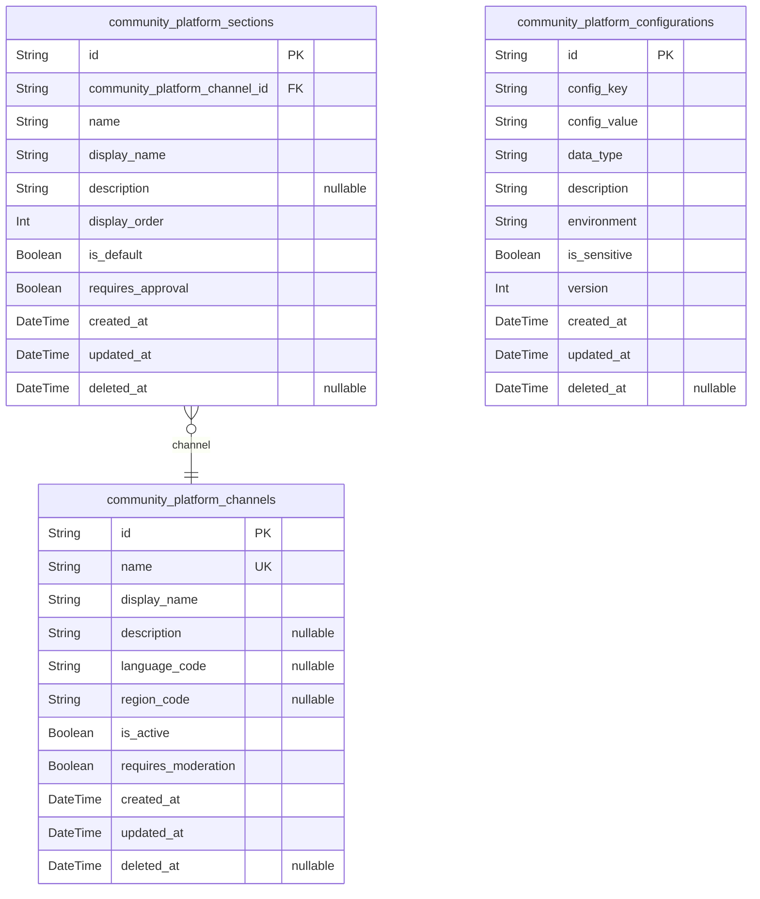
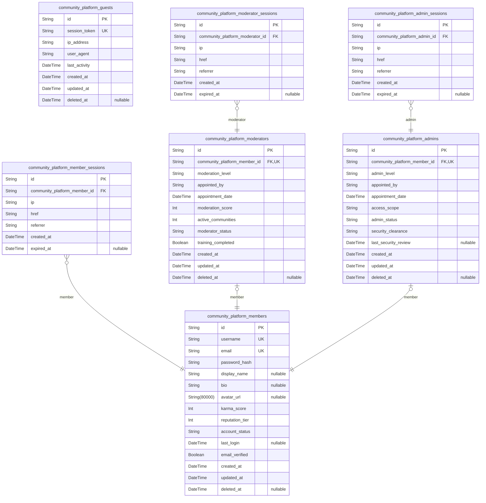
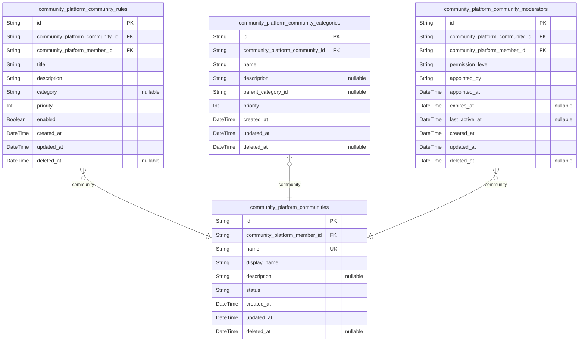
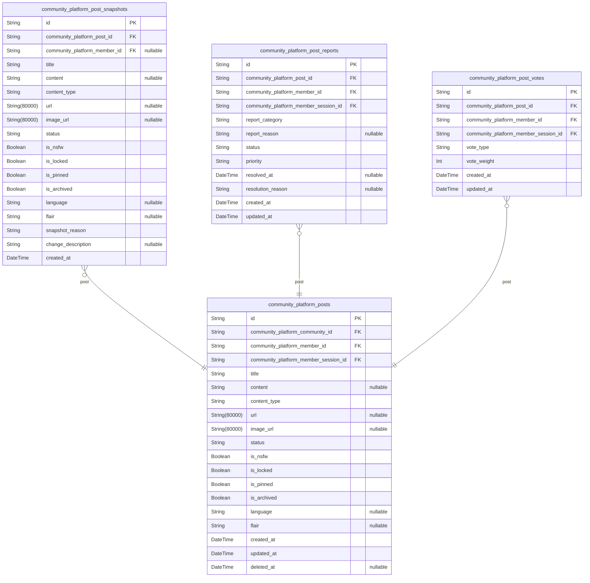
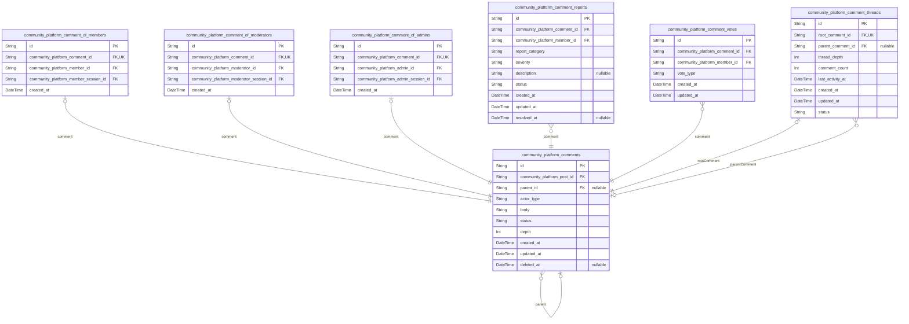
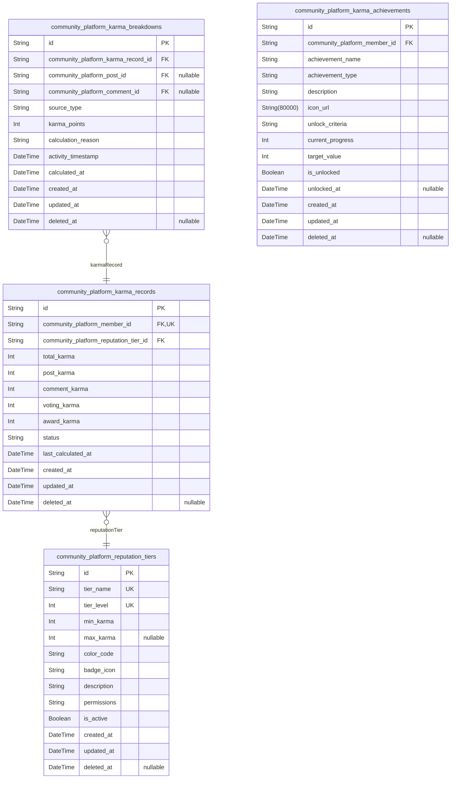
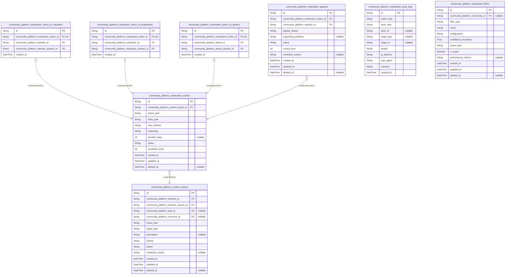
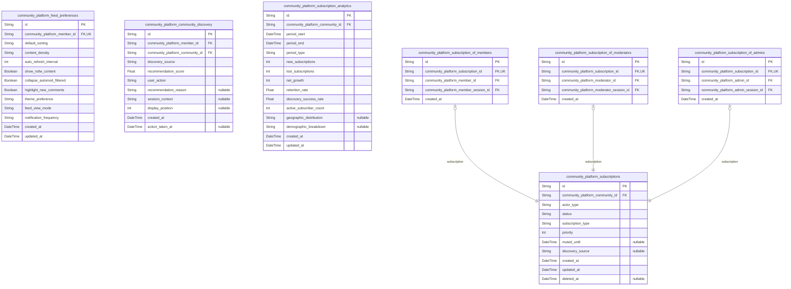
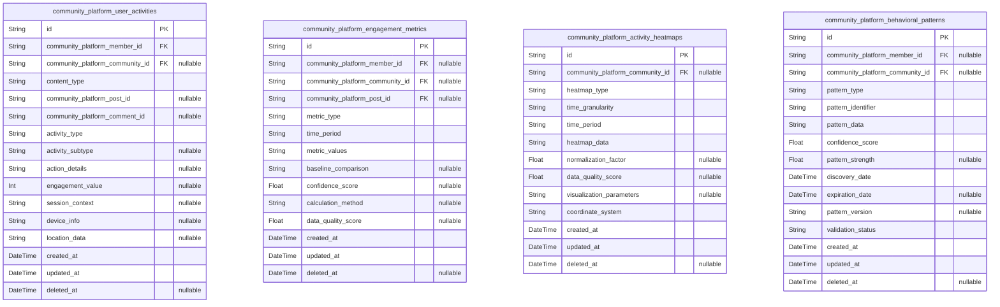
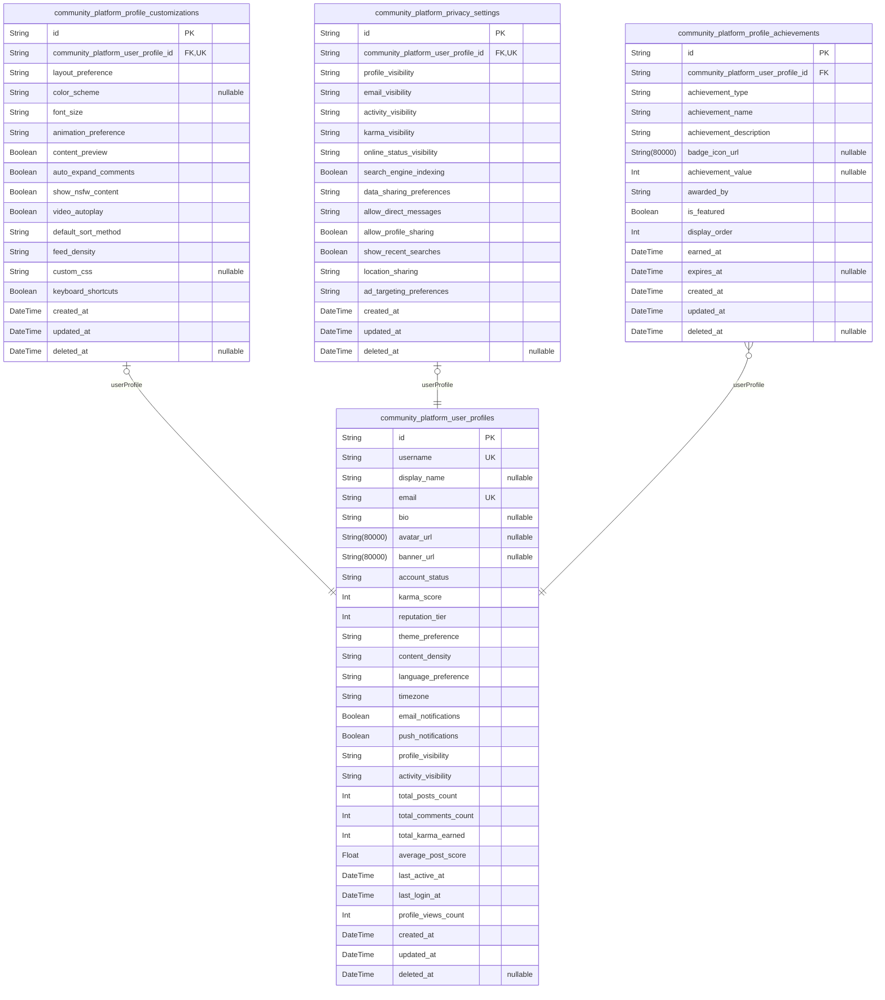

# Prisma Markdown

> Generated by [`prisma-markdown`](https://github.com/samchon/prisma-markdown)

- [Systematic](#systematic)
- [Actors](#actors)
- [Communities](#communities)
- [Posts](#posts)
- [Comments](#comments)
- [Karma](#karma)
- [Moderation](#moderation)
- [Subscriptions](#subscriptions)
- [Activity](#activity)
- [Profiles](#profiles)

## Systematic

### `community_platform_channels`

Platform channels representing distinct communication or content streams
within the community platform.

Channels serve as organizational units that group communities, content,
and users based on specific themes, languages, or geographic regions.
Each channel can have its own moderation policies, content guidelines,
and user base while sharing the core platform infrastructure.

Channels support platform segmentation for internationalization,
specialized content areas, or different user demographics. They provide
the foundation for community organization and content discovery across
the platform.

This entity requires comprehensive API operations including creation,
listing, updating channel properties, and managing channel-specific
settings. Users and administrators need to browse channels, filter by
language/region, and manage channel membership.

Properties as follows:

- `id`: Primary Key.
- `name`: Unique channel name identifier used for URL routing and system references.
- `display_name`: Human-readable channel name displayed to users in interface elements.
- `description`
  > Detailed description explaining the channel's purpose, scope, and target
  > audience.
- `language_code`
  > Primary language for the channel content using ISO 639-1 format (e.g.,
  > 'en', 'es', 'fr').
- `region_code`
  > Geographic region focus using ISO 3166-1 alpha-2 format (e.g., 'US',
  > 'EU', 'GB').
- `is_active`
  > Indicates whether the channel is currently active and accepting new
  > content.
- `requires_moderation`: Specifies if content in this channel requires pre-approval by moderators.
- `created_at`: Timestamp when the channel was first created in the system.
- `updated_at`: Timestamp of the last modification to channel settings or properties.
- `deleted_at`: Timestamp when the channel was soft-deleted for recovery purposes.

### `community_platform_sections`

Organizational sections within channels for categorizing communities and
content.

Sections provide hierarchical organization within channels, allowing for
logical grouping of communities by topic, content type, or user interest.
They enable better content discovery and navigation while maintaining
channel-level consistency.

Each section can have customized display properties, moderation rules,
and content guidelines. Sections support the platform's content
organization strategy and help users find relevant communities more
efficiently.

Properties as follows:

- `id`: Primary Key.
- `community_platform_channel_id`
  > Parent channel containing this section. {@link
  > community_platform_channels.id}
- `name`: Unique section name within the parent channel for system identification.
- `display_name`
  > Human-readable section name displayed in navigation and content
  > organization.
- `description`: Detailed explanation of the section's purpose and content focus area.
- `display_order`
  > Numerical order for section display within channel navigation and
  > listings.
- `is_default`: Indicates if this section is the default landing section for the channel.
- `requires_approval`
  > Specifies if communities in this section require moderator approval to
  > join.
- `created_at`: Timestamp when the section was created within the channel.
- `updated_at`: Timestamp of the last modification to section properties or settings.
- `deleted_at`: Timestamp when the section was soft-deleted for potential recovery.

### `community_platform_configurations`

Platform-wide configuration settings and system parameters.

This table stores all configurable platform settings that control system
behavior, feature flags, and operational parameters. Configuration values
can be adjusted without code changes, enabling dynamic platform
management.

Settings include performance parameters, feature toggles, content
policies, and system limits. The configuration system supports different
environments (production, staging, development) and allows for gradual
feature rollouts.

Properties as follows:

- `id`: Primary Key.
- `config_key`: Unique configuration key used to identify and retrieve the setting value.
- `config_value`
  > Configuration value stored as string with type interpretation by
  > consuming systems.
- `data_type`
  > Data type of the configuration value (string, integer, boolean, json,
  > array).
- `description`
  > Detailed explanation of the configuration setting's purpose and usage
  > guidelines.
- `environment`
  > Target environment for this configuration (production, staging,
  > development, all).
- `is_sensitive`
  > Indicates if the configuration value contains sensitive information
  > requiring protection.
- `version`
  > Configuration version number for tracking changes and supporting
  > rollbacks.
- `created_at`: Timestamp when the configuration setting was first created.
- `updated_at`: Timestamp of the last modification to the configuration value or metadata.
- `deleted_at`
  > Timestamp when the configuration was soft-deleted while preserving
  > history.

## Actors

### `community_platform_guests`

Unauthenticated users who can browse public content without registration.

Represents temporary guest access to the platform with limited
capabilities. Guests can view public communities, posts, and comments but
cannot create content, vote, or subscribe. Each guest session is tracked
for analytics and potential conversion to registered members.

Guest accounts are automatically created when users access the platform
without authentication and are maintained for the duration of their
browsing session. They provide a way to showcase platform content while
encouraging user registration for full functionality.

Properties as follows:

- `id`: Primary Key.
- `session_token`: Unique session identifier for guest tracking.
- `ip_address`: IP address of the guest for security and analytics.
- `user_agent`: Browser user agent string for device identification.
- `last_activity`: Timestamp of last guest activity for session management.
- `created_at`: Timestamp when guest session was created.
- `updated_at`: Timestamp when guest session was last updated.
- `deleted_at`: Timestamp when guest session was deleted (soft delete).

### `community_platform_members`

Registered users with full platform access and interaction capabilities.

Members are authenticated users who can create content, vote, comment,
subscribe to communities, and build reputation through the karma system.
Each member has a unique identity with profile information, activity
history, and community participation records.

Members form the core user base of the platform and have access to all
standard features including content creation, community management, and
social interactions. Their accounts are permanent and maintain
comprehensive activity tracking for personalized experiences.

Properties as follows:

- `id`: Primary Key.
- `username`: Unique username for member identification and display.
- `email`: Verified email address for authentication and communication.
- `password_hash`: Securely hashed password for account authentication.
- `display_name`: Optional display name for user profile customization.
- `bio`: User biography text for profile customization.
- `avatar_url`: URL to user's profile avatar image.
- `karma_score`: Current karma score representing user reputation.
- `reputation_tier`: Reputation tier level based on karma achievements.
- `account_status`: Current account status (active, suspended, banned).
- `last_login`: Timestamp of last successful login.
- `email_verified`: Whether email address has been verified.
- `created_at`: Timestamp when member account was created.
- `updated_at`: Timestamp when member account was last updated.
- `deleted_at`: Timestamp when member account was deleted (soft delete).

### `community_platform_member_sessions`

Authentication sessions for community platform members.

Tracks active login sessions for authenticated members, providing
security monitoring and session management. Each session records
connection context including IP address, user agent, and access patterns
for audit purposes.

Sessions are used for maintaining user authentication state across
platform interactions and provide the foundation for secure access
control. They support features like "remember me" functionality and
multi-device access while maintaining security standards.

Properties as follows:

- `id`: Primary Key.
- `community_platform_member_id`: Associated member's primary key. [community_platform_members.id](#community_platform_members)
- `ip`: IP address of the connection for security tracking.
- `href`: Connection URL for session context tracking.
- `referrer`: Referrer URL for traffic source analysis.
- `created_at`: Timestamp when session was created.
- `expired_at`: Timestamp when session expires (nullable for active sessions).

### `community_platform_moderators`

Users with elevated permissions for community moderation.

Moderators are trusted community members appointed to maintain content
quality, enforce community rules, and manage user interactions within
specific communities. They have access to advanced moderation tools and
decision-making capabilities.

Moderators play a crucial role in community health and safety, balancing
free expression with content standards. Their actions are tracked for
transparency and accountability, with clear escalation paths for complex
moderation scenarios.

Properties as follows:

- `id`: Primary Key.
- `community_platform_member_id`: Base member account reference. [community_platform_members.id](#community_platform_members)
- `moderation_level`: Moderation permission level (community, global).
- `appointed_by`: User who appointed this moderator for accountability.
- `appointment_date`: Timestamp when moderator was appointed.
- `moderation_score`: Performance score based on moderation effectiveness.
- `active_communities`: Number of communities currently moderating.
- `moderator_status`: Current moderator status (active, suspended, retired).
- `training_completed`: Whether moderator has completed required training.
- `created_at`: Timestamp when moderator record was created.
- `updated_at`: Timestamp when moderator record was last updated.
- `deleted_at`: Timestamp when moderator record was deleted (soft delete).

### `community_platform_moderator_sessions`

Authentication sessions for community platform moderators.

Specialized session tracking for moderator accounts with enhanced
security requirements. Records moderator-specific activities and provides
additional security monitoring for elevated privilege access.

Moderator sessions include additional context for audit trails and
security compliance, supporting the higher trust requirements of
moderation responsibilities while maintaining platform security
standards.

Properties as follows:

- `id`: Primary Key.
- `community_platform_moderator_id`
  > Associated moderator's primary key. {@link
  > community_platform_moderators.id}
- `ip`: IP address of the moderator connection.
- `href`: Connection URL for session context.
- `referrer`: Referrer URL for traffic source tracking.
- `created_at`: Timestamp when session was created.
- `expired_at`: Timestamp when session expires.

### `community_platform_admins`

System administrators with full platform control and configuration access.

Admins have the highest level of privileges for platform management,
system configuration, and global moderation. They can manage all users,
communities, and platform settings with comprehensive oversight
capabilities.

Admin accounts are carefully managed with strict security requirements
and comprehensive audit trails. Their actions affect the entire platform
and require the highest level of responsibility and accountability.

Properties as follows:

- `id`: Primary Key.
- `community_platform_member_id`: Base member account reference. [community_platform_members.id](#community_platform_members)
- `admin_level`: Administrative permission level (system, content, support).
- `appointed_by`: User who appointed this administrator.
- `appointment_date`: Timestamp when admin was appointed.
- `access_scope`: Scope of administrative access (global, regional, functional).
- `admin_status`: Current admin status (active, suspended, retired).
- `security_clearance`: Security clearance level for sensitive operations.
- `last_security_review`: Timestamp of last security review.
- `created_at`: Timestamp when admin record was created.
- `updated_at`: Timestamp when admin record was last updated.
- `deleted_at`: Timestamp when admin record was deleted (soft delete).

### `community_platform_admin_sessions`

Authentication sessions for community platform administrators.

High-security session tracking for administrator accounts with
comprehensive audit requirements. Includes enhanced security monitoring
and detailed activity logging for platform-wide administrative actions.

Admin sessions support the highest security standards with multi-factor
authentication requirements and detailed access logging. They provide the
foundation for secure platform administration while maintaining
accountability for all administrative actions.

Properties as follows:

- `id`: Primary Key.
- `community_platform_admin_id`
  > Associated administrator's primary key. {@link
  > community_platform_admins.id}
- `ip`: IP address of the admin connection.
- `href`: Connection URL for session context.
- `referrer`: Referrer URL for traffic source tracking.
- `created_at`: Timestamp when session was created.
- `expired_at`: Timestamp when session expires.

## Communities

### `community_platform_communities`

Core community entities representing subreddit-like communities on the
platform.

Each community serves as a container for user-generated content,
discussions, and member interactions. Communities can be created by
authenticated members and have configurable settings for privacy, content
rules, and moderation policies.

Communities support various states including active, restricted, and
private modes to accommodate different community needs. The platform
tracks community activity through separate materialized views rather than
denormalized fields.

Soft deletion is supported to maintain audit trails while allowing
community removal when necessary.

Properties as follows:

- `id`: Primary Key.
- `community_platform_member_id`
  > Community creator's member reference. {@link
  > community_platform_members.id}
- `name`
  > Unique community name used for identification and URL generation. Must be
  > 3-21 characters containing only letters, numbers, and hyphens.
- `display_name`
  > Human-readable community display name shown to users. Supports up to 100
  > characters with special characters and spaces.
- `description`
  > Community description explaining purpose, rules, and focus area. Maximum
  > 500 characters with markdown support.
- `status`
  > Current community status: active, restricted, private, or archived.
  > Controls visibility and participation rules.
- `created_at`
  > Timestamp when the community was created. Used for sorting and community
  > age calculations.
- `updated_at`
  > Timestamp of last community update. Tracks settings changes and metadata
  > modifications.
- `deleted_at`
  > Timestamp when community was soft deleted. Null indicates active
  > community.

### `community_platform_community_rules`

Community-specific rules and guidelines that govern member behavior and
content standards.

Each community can define multiple rules to establish clear expectations
for participation. Rules support hierarchical organization with ordering
and categorization for better user comprehension.

Rule violations are tracked through the moderation system and can result
in content removal or member restrictions. Rules are versioned to
maintain historical context for moderation decisions.

Community moderators can create, update, and reorder rules to adapt to
changing community needs while maintaining consistent enforcement
standards.

Properties as follows:

- `id`: Primary Key.
- `community_platform_community_id`: Community that owns this rule. [community_platform_communities.id](#community_platform_communities)
- `community_platform_member_id`
  > Member who created or last updated this rule. {@link
  > community_platform_members.id}
- `title`
  > Short, descriptive title for the rule. Maximum 100 characters for clear
  > identification.
- `description`
  > Detailed rule explanation with examples and context. Maximum 1000
  > characters with markdown support.
- `category`
  > Rule category for organizational grouping: content, behavior, posting, or
  > moderation.
- `priority`
  > Display priority for rule ordering. Lower numbers appear first in rule
  > lists.
- `enabled`: Whether this rule is currently active and being enforced by moderators.
- `created_at`: Timestamp when the rule was originally created.
- `updated_at`
  > Timestamp of last rule modification. Tracks changes for moderation
  > consistency.
- `deleted_at`
  > Timestamp when rule was soft deleted. Maintains historical context for
  > past moderation.

### `community_platform_community_categories`

Categorization system for organizing communities by topic, interest, or
theme.

Categories help users discover relevant communities and provide
organizational structure for the platform. Categories can be hierarchical
with parent-child relationships for detailed topic classification.

Each community can belong to multiple categories to support cross-topic
discovery. Category assignments are managed by community moderators with
platform-level oversight for consistency.

Category popularity metrics are tracked through separate materialized
views to maintain normalization while supporting discovery features.

Properties as follows:

- `id`: Primary Key.
- `community_platform_community_id`: Community being categorized. [community_platform_communities.id](#community_platform_communities)
- `name`
  > Category name for display and filtering. Examples: Technology, Sports,
  > Arts, Gaming, Science.
- `description`
  > Category description explaining scope and typical content. Helps users
  > understand category purpose.
- `parent_category_id`
  > Optional parent category reference for hierarchical organization. Enables
  > detailed topic classification. {@link
  > community_platform_community_categories.id}
- `priority`
  > Display priority for category ordering in discovery interfaces. Lower
  > numbers appear first.
- `created_at`: Timestamp when category was created. Used for tracking category lifecycle.
- `updated_at`
  > Timestamp of last category update. Tracks changes to category
  > organization.
- `deleted_at`
  > Timestamp when category was soft deleted. Maintains historical
  > relationships.

### `community_platform_community_moderators`

Moderator assignments linking users to communities they moderate.

This table establishes the many-to-many relationship between moderators
and communities, tracking appointment dates, permission levels, and
moderation activity. Each assignment includes specific moderation
permissions granted to the user for that community.

Moderator appointments can have different permission levels (full,
content, limited) to support distributed moderation teams. Activity
tracking helps identify active moderators and supports community health
monitoring.

Moderator assignments support temporary appointments with expiration
dates and can be revoked by community owners or platform administrators
when necessary.

Properties as follows:

- `id`: Primary Key.
- `community_platform_community_id`: Community being moderated. [community_platform_communities.id](#community_platform_communities)
- `community_platform_member_id`: Member assigned as moderator. [community_platform_members.id](#community_platform_members)
- `permission_level`
  > Moderator permission level: full (all permissions), content (post/comment
  > moderation), or limited (specific tasks).
- `appointed_by`
  > Entity that appointed this moderator: community_creator,
  > existing_moderator, or platform_admin.
- `appointed_at`: Timestamp when moderator was appointed to the community.
- `expires_at`
  > Optional expiration date for temporary moderator appointments. Null
  > indicates permanent assignment.
- `last_active_at`
  > Timestamp of last moderation activity. Used for identifying inactive
  > moderators.
- `created_at`: Timestamp when moderator assignment was created.
- `updated_at`
  > Timestamp of last assignment update. Tracks permission changes and
  > activity updates.
- `deleted_at`
  > Timestamp when moderator assignment was revoked. Maintains historical
  > record.

## Posts

### `community_platform_posts`

Core entity representing user-generated posts in communities.

Stores the main content created by community members across different
content types (text, link, image). Each post belongs to a specific
community and is created by an authenticated member through their active
session.

Posts support various content formats and include metadata for voting,
engagement tracking, and moderation. The status field manages post
lifecycle from creation through potential removal or archiving.

Soft deletion is supported to maintain audit trails while allowing
content moderation and user self-management. This version removes
denormalized count fields and adds essential platform features.

Key improvements:
- Removed denormalized counts (calculated via materialized views)
- Added NSFW flag for content filtering
- Added locking mechanism for moderation
- Added pinning for community highlighting
- Added archiving for content lifecycle
- Added language and flair support
- Enhanced status management

Properties as follows:

- `id`: Primary Key.
- `community_platform_community_id`
  > Target community where the post is published. {@link
  > community_platform_communities.id}
- `community_platform_member_id`: Member who created the post. [community_platform_members.id](#community_platform_members)
- `community_platform_member_session_id`
  > Session context for post creation. {@link
  > community_platform_member_sessions.id}
- `title`
  > Post title displayed to users. Required field with character limits for
  > proper content presentation.
- `content`
  > Post content body supporting different formats based on content type. May
  > contain text, markdown, or structured data.
- `content_type`
  > Type of post content: 'text', 'link', or 'image'. Determines how content
  > is processed and displayed.
- `url`
  > External URL for link posts. Validated as proper URI format when
  > content_type is 'link'.
- `image_url`
  > Image URL for image posts. Points to stored image asset when content_type
  > is 'image'.
- `status`
  > Current post status: 'draft', 'published', 'archived', 'removed',
  > 'locked', 'pinned', 'featured'. Manages post lifecycle and visibility.
- `is_nsfw`
  > Flag indicating Not Safe For Work content. Used for content filtering and
  > user preferences.
- `is_locked`
  > Flag indicating post is locked from further comments. Used for moderation
  > and dispute resolution.
- `is_pinned`
  > Flag indicating post is pinned to the top of the community. Used for
  > important announcements.
- `is_archived`
  > Flag indicating post is archived and read-only. Used for historical
  > content preservation.
- `language`
  > Language code of the post content (e.g., 'en', 'es', 'fr'). Used for
  > content filtering and localization.
- `flair`: Community-specific flair text for post categorization and customization.
- `created_at`: Timestamp when the post was initially created.
- `updated_at`: Timestamp when the post was last modified.
- `deleted_at`: Timestamp when the post was soft deleted. Null indicates active post.

### `community_platform_post_snapshots`

Historical snapshots of post content for audit trails and version control.

Captures point-in-time states of posts whenever significant changes
occur, such as content edits, status changes, or moderation actions. Each
snapshot preserves the complete post state at the time of capture.

Used for content moderation review, user dispute resolution, and platform
transparency. Snapshots maintain referential integrity with the original
post while providing immutable historical records.

Enhanced with actor tracking and detailed change reasons for better audit
trails.

Properties as follows:

- `id`: Primary Key.
- `community_platform_post_id`: Original post being snapshotted. [community_platform_posts.id](#community_platform_posts)
- `community_platform_member_id`
  > Member who triggered the snapshot creation. {@link
  > community_platform_members.id}
- `title`: Post title at the time of snapshot capture.
- `content`: Post content body at the time of snapshot capture.
- `content_type`: Content type at snapshot time: 'text', 'link', or 'image'.
- `url`: External URL for link posts at snapshot time.
- `image_url`: Image URL for image posts at snapshot time.
- `status`: Post status at the time of snapshot capture.
- `is_nsfw`: NSFW flag state at snapshot time.
- `is_locked`: Locked flag state at snapshot time.
- `is_pinned`: Pinned flag state at snapshot time.
- `is_archived`: Archived flag state at snapshot time.
- `language`: Language code at snapshot time.
- `flair`: Flair text at snapshot time.
- `snapshot_reason`
  > Reason for creating this snapshot: 'edit', 'moderation', 'archive',
  > 'status_change', 'user_request'.
- `change_description`: Detailed description of what changed in this snapshot.
- `created_at`: Timestamp when the snapshot was created.

### `community_platform_post_reports`

User reports of inappropriate or rule-violating posts for moderation review.

Stores reports submitted by community members when they encounter content
that violates platform rules or community guidelines. Each report
includes categorization, context, and reporter information.

Reports are processed through moderation workflows with status tracking
and resolution documentation. The system maintains audit trails for
transparency and quality assurance.

Properties as follows:

- `id`: Primary Key.
- `community_platform_post_id`: Post being reported. [community_platform_posts.id](#community_platform_posts)
- `community_platform_member_id`: Member submitting the report. [community_platform_members.id](#community_platform_members)
- `community_platform_member_session_id`
  > Session context for report submission. {@link
  > community_platform_member_sessions.id}
- `report_category`
  > Category of violation: 'spam', 'harassment', 'illegal', 'misinformation',
  > 'rule_violation'.
- `report_reason`: Detailed explanation of the violation with specific context and examples.
- `status`
  > Report processing status: 'pending', 'under_review', 'resolved',
  > 'dismissed'.
- `priority`
  > Processing priority: 'critical', 'high', 'medium', 'low'. Based on
  > violation severity.
- `resolved_at`: Timestamp when the report was resolved by moderators.
- `resolution_reason`: Explanation of the moderation decision and action taken.
- `created_at`: Timestamp when the report was submitted.
- `updated_at`: Timestamp when the report was last updated.

### `community_platform_post_votes`

Individual vote records for post engagement tracking and karma calculation.

Stores each upvote and downvote cast by community members on posts. Each
vote record includes voter information, vote direction, and timestamp for
accurate engagement metrics.

Used for calculating post scores, user karma contributions, and
generating personalized content recommendations. The system prevents
duplicate voting and maintains vote integrity.

Properties as follows:

- `id`: Primary Key.
- `community_platform_post_id`: Post being voted on. [community_platform_posts.id](#community_platform_posts)
- `community_platform_member_id`: Member casting the vote. [community_platform_members.id](#community_platform_members)
- `community_platform_member_session_id`
  > Session context for vote action. {@link
  > community_platform_member_sessions.id}
- `vote_type`
  > Direction of the vote: 'upvote' or 'downvote'. Determines karma impact
  > and post scoring.
- `vote_weight`
  > Weight of the vote for karma calculation. Defaults to 1, may vary based
  > on user reputation.
- `created_at`: Timestamp when the vote was cast.
- `updated_at`: Timestamp when the vote was last updated (if changed).

## Comments

### `community_platform_comments`

Main entity for user comments on posts with threaded discussion support.

Stores the core comment content including text, parent relationships for
threading, and engagement metrics. Comments support nested replies up to
10 levels deep and can be created by different actor types (members,
moderators, admins) through subtype entities.

Each comment maintains its own lifecycle independent from the parent
post, allowing for independent moderation, voting, and user management.
Comments can be edited within a limited timeframe and support soft
deletion for content moderation while preserving discussion context.

The entity includes status tracking for active, deleted, and moderated
states, with comprehensive audit trails for all modifications. Comments
form the foundation of community discussions and require efficient
querying for threaded display and user activity tracking.

Properties as follows:

- `id`: Primary Key.
- `community_platform_post_id`
  > Reference to the parent post where this comment is posted. {@link
  > community_platform_posts.id}
- `parent_id`
  > Self-referencing foreign key for comment threading. Points to the parent
  > comment for nested replies. [community_platform_comments.id](#community_platform_comments)
- `actor_type`
  > Type of actor who created the comment. Valid values: member, moderator,
  > admin. Used for quick filtering and relationship routing.
- `body`
  > Comment content text with markdown formatting support. Maximum length of
  > 10,000 characters to accommodate detailed discussions.
- `status`
  > Current comment status. Valid values: active, deleted, moderated.
  > Controls comment visibility and moderation state.
- `depth`
  > Nesting level of the comment within the thread. Root comments have depth
  > 0, replies have increasing depth values.
- `created_at`: Timestamp when the comment was originally created.
- `updated_at`
  > Timestamp when the comment was last modified. Updated on edits, status
  > changes, or engagement updates.
- `deleted_at`: Timestamp when the comment was soft deleted. Null if comment is active.

### `community_platform_comment_of_members`

Subtype entity for comments created by regular community members.

Stores member-specific context for comment creation including the
member's session information and creation timestamp. This entity enables
proper polymorphic ownership pattern where different actor types can
create comments while maintaining referential integrity and
actor-specific metadata.

Each comment created by a member has a corresponding record in this table
that links the main comment entity to the specific member and their
session context. This separation allows for efficient querying of
member-specific comment activity and proper audit trails.

The entity supports the platform's authentication system by tracking
which member created each comment and under which session context,
enabling comprehensive user activity tracking and moderation workflows.

Properties as follows:

- `id`: Primary Key.
- `community_platform_comment_id`
  > Reference to the main comment entity. {@link
  > community_platform_comments.id}
- `community_platform_member_id`
  > Reference to the member who created the comment. {@link
  > community_platform_members.id}
- `community_platform_member_session_id`
  > Reference to the member's session when the comment was created. {@link
  > community_platform_member_sessions.id}
- `created_at`: Timestamp when the member created this comment.

### `community_platform_comment_of_moderators`

Subtype entity for comments created by community moderators.

Stores moderator-specific context for comment creation including the
moderator's session information and creation timestamp. This entity
enables proper polymorphic ownership pattern where different actor types
can create comments while maintaining referential integrity and
actor-specific metadata.

Each comment created by a moderator has a corresponding record in this
table that links the main comment entity to the specific moderator and
their session context. This separation allows for efficient querying of
moderator-specific comment activity and proper audit trails.

The entity supports the platform's moderation system by tracking which
moderator created each comment and under which session context, enabling
comprehensive moderation activity tracking and accountability.

Properties as follows:

- `id`: Primary Key.
- `community_platform_comment_id`
  > Reference to the main comment entity. {@link
  > community_platform_comments.id}
- `community_platform_moderator_id`
  > Reference to the moderator who created the comment. {@link
  > community_platform_moderators.id}
- `community_platform_moderator_session_id`
  > Reference to the moderator's session when the comment was created. {@link
  > community_platform_moderator_sessions.id}
- `created_at`: Timestamp when the moderator created this comment.

### `community_platform_comment_of_admins`

Subtype entity for comments created by platform administrators.

Stores admin-specific context for comment creation including the admin's
session information and creation timestamp. This entity enables proper
polymorphic ownership pattern where different actor types can create
comments while maintaining referential integrity and actor-specific
metadata.

Each comment created by an admin has a corresponding record in this table
that links the main comment entity to the specific admin and their
session context. This separation allows for efficient querying of
admin-specific comment activity and proper audit trails.

The entity supports the platform's administration system by tracking
which admin created each comment and under which session context,
enabling comprehensive administrative activity tracking and system
accountability.

Properties as follows:

- `id`: Primary Key.
- `community_platform_comment_id`
  > Reference to the main comment entity. {@link
  > community_platform_comments.id}
- `community_platform_admin_id`
  > Reference to the admin who created the comment. {@link
  > community_platform_admins.id}
- `community_platform_admin_session_id`
  > Reference to the admin's session when the comment was created. {@link
  > community_platform_admin_sessions.id}
- `created_at`: Timestamp when the admin created this comment.

### `community_platform_comment_reports`

User reports for inappropriate or rule-violating comments.

Stores reports submitted by users flagging comments that violate
community guidelines or platform rules. Each report includes
categorization, severity assessment, and reporter context for effective
moderation workflows.

Reports are processed through the moderation system with priority based
on severity and community impact. The system maintains comprehensive
reporting history for pattern analysis, user education, and moderation
quality improvement.

Properties as follows:

- `id`: Primary Key.
- `community_platform_comment_id`: Reference to the reported comment. [community_platform_comments.id](#community_platform_comments)
- `community_platform_member_id`
  > Reference to the member who submitted the report. {@link
  > community_platform_members.id}
- `report_category`
  > Category of the reported violation. Valid values: spam, harassment,
  > illegal, misinformation, rule_violation.
- `severity`: Reported severity level. Valid values: low, medium, high, critical.
- `description`
  > Optional detailed explanation provided by the reporter. Maximum 1000
  > characters.
- `status`
  > Current report status. Valid values: pending, reviewing, resolved,
  > dismissed.
- `created_at`: Timestamp when the report was submitted.
- `updated_at`
  > Timestamp when the report was last updated. Updated during moderation
  > workflow.
- `resolved_at`: Timestamp when the report was resolved. Null if report is still active.

### `community_platform_comment_votes`

Individual votes (upvotes/downvotes) on comments for engagement scoring.

Stores each vote cast on comments, enabling the calculation of comment
scores and user karma contributions. The system prevents duplicate voting
and maintains vote integrity through unique constraints and validation
rules.

Votes contribute to comment visibility in sorting algorithms and user
reputation calculations. The entity supports vote changing within limited
timeframes and maintains audit trails for vote manipulation detection.

Properties as follows:

- `id`: Primary Key.
- `community_platform_comment_id`: Reference to the voted comment. [community_platform_comments.id](#community_platform_comments)
- `community_platform_member_id`
  > Reference to the member who cast the vote. {@link
  > community_platform_members.id}
- `vote_type`: Type of vote cast. Valid values: upvote, downvote.
- `created_at`: Timestamp when the vote was cast.
- `updated_at`: Timestamp when the vote was last updated. Used for vote change tracking.

### `community_platform_comment_threads`

Organizational structure for comment threading and nested discussions.

Maintains the hierarchical relationships between comments to enable
efficient threaded display and navigation. This entity supports the
platform's nested comment system with up to 10 levels of reply depth.

Used for optimizing comment retrieval, calculating thread statistics, and
supporting advanced comment navigation features. The system maintains
thread integrity through proper parent-child relationships and depth
validation.

As a primary entity, thread structures require independent management for
thread-level operations, moderation workflows, and analytics. Threads can
be locked, archived, or managed independently from individual comments
within them.

Properties as follows:

- `id`: Primary Key.
- `root_comment_id`
  > Reference to the root comment of this thread. {@link
  > community_platform_comments.id}
- `parent_comment_id`
  > Reference to the direct parent comment. {@link
  > community_platform_comments.id}
- `thread_depth`
  > Maximum depth of comments within this thread. Used for performance
  > optimization.
- `comment_count`: Total number of comments in this thread. Updated automatically.
- `last_activity_at`: Timestamp of the most recent activity in this thread.
- `created_at`: Timestamp when the thread structure was created.
- `updated_at`: Timestamp when the thread structure was last updated.
- `status`
  > Thread status for moderation and management. Valid values: active,
  > locked, archived.

## Karma

### `community_platform_karma_records`

Centralized karma tracking for user reputation management.

Stores comprehensive karma records that aggregate user contributions
across posts, comments, and voting activities. Each record represents a
user's total karma score at a specific point in time, enabling historical
tracking and reputation progression analysis.

The karma calculation follows platform-specific algorithms that consider
post upvotes, comment engagement, voting accuracy, and content quality
metrics. Records are updated in near real-time as user activities occur,
providing accurate reputation representation for content sorting and
community trust indicators.

Soft deletion is supported to maintain audit trails while allowing
content moderation adjustments to karma calculations.

Properties as follows:

- `id`: Primary Key.
- `community_platform_member_id`
  > User member whose karma is being tracked. {@link
  > community_platform_members.id}.
- `community_platform_reputation_tier_id`
  > Current reputation tier based on karma thresholds. {@link
  > community_platform_reputation_tiers.id}.
- `total_karma`
  > Current total karma score representing user reputation across all
  > activities.
- `post_karma`: Karma earned specifically from post creation and engagement.
- `comment_karma`: Karma earned specifically from comment creation and engagement.
- `voting_karma`: Karma earned from voting participation and accuracy.
- `award_karma`: Karma earned from special awards and recognition.
- `status`
  > Current karma calculation status. Valid values: active, frozen,
  > under_review.
- `last_calculated_at`: Timestamp when karma was last calculated and updated.
- `created_at`: Record creation timestamp.
- `updated_at`: Last update timestamp for karma adjustments.
- `deleted_at`: Soft deletion timestamp for audit trail maintenance.

### `community_platform_karma_breakdowns`

Detailed breakdown of karma sources and calculation components.

Provides granular tracking of how karma is earned across different
content types and activities. Each breakdown record links to a specific
karma action (post creation, comment, vote, etc.) and shows the exact
karma points awarded or deducted.

This subsidiary table supports the main karma records by providing
detailed audit trails for karma calculations, enabling transparency in
reputation scoring and supporting dispute resolution when karma
adjustments are needed.

Breakdown records are essential for understanding user behavior patterns
and improving karma calculation algorithms over time.

Properties as follows:

- `id`: Primary Key.
- `community_platform_karma_record_id`
  > Parent karma record this breakdown belongs to. {@link
  > community_platform_karma_records.id}.
- `community_platform_post_id`
  > Post that generated karma, if applicable. {@link
  > community_platform_posts.id}.
- `community_platform_comment_id`
  > Comment that generated karma, if applicable. {@link
  > community_platform_comments.id}.
- `source_type`
  > Type of activity that generated karma. Valid values: post_creation,
  > comment_creation, upvote_received, downvote_received,
  > voting_participation, award_given.
- `karma_points`: Karma points awarded or deducted for this specific activity.
- `calculation_reason`: Detailed explanation of how karma points were calculated.
- `activity_timestamp`: When the karma-generating activity occurred.
- `calculated_at`: When this karma breakdown was calculated.
- `created_at`: Record creation timestamp.
- `updated_at`: Last update timestamp.
- `deleted_at`: Soft deletion timestamp.

### `community_platform_reputation_tiers`

Configuration table defining reputation tiers and their karma thresholds.

Stores the platform's reputation system configuration, mapping karma
score ranges to specific reputation tiers with associated benefits and
privileges. Each tier represents a milestone in user progression within
the community platform.

Tiers are configurable to allow platform administrators to adjust
reputation progression curves based on community growth and engagement
patterns. This reference data is essential for determining user
privileges, content visibility, and moderation capabilities.

The tier system provides clear progression goals for users while
maintaining platform quality standards through reputation-based access
controls.

Properties as follows:

- `id`: Primary Key.
- `tier_name`
  > Name of the reputation tier (e.g., New User, Active Member, Trusted
  > Member).
- `tier_level`: Numerical level of the tier for sorting and comparison.
- `min_karma`: Minimum karma score required to achieve this tier.
- `max_karma`: Maximum karma score for this tier (exclusive).
- `color_code`: Hex color code for tier display in user interfaces.
- `badge_icon`: Icon identifier for tier badge display.
- `description`: Description of tier benefits and privileges.
- `permissions`: JSON string containing tier-specific permissions and capabilities.
- `is_active`: Whether this tier is currently active in the system.
- `created_at`: Tier creation timestamp.
- `updated_at`: Last update timestamp for tier configuration.
- `deleted_at`: Soft deletion timestamp.

### `community_platform_karma_achievements`

Trackable achievements and badges users can earn through platform
participation.

Stores achievement definitions and user progress toward earning various
badges and recognition within the community. Achievements provide
additional motivation and recognition beyond basic karma scoring,
celebrating specific accomplishments and community contributions.

Each achievement has specific unlock criteria that may involve karma
thresholds, content creation milestones, community participation metrics,
or special events. Users can track their progress toward achievements and
display earned badges on their profiles.

The achievement system enhances user engagement by providing clear goals
and recognition for positive community participation patterns.

Properties as follows:

- `id`: Primary Key.
- `community_platform_member_id`
  > User member who earned or is working toward this achievement. {@link
  > community_platform_members.id}.
- `achievement_name`: Name of the achievement or badge.
- `achievement_type`
  > Type of achievement. Valid values: karma_based, content_based,
  > community_based, special_event.
- `description`: Detailed description of the achievement and how to earn it.
- `icon_url`: URL to achievement badge icon for display.
- `unlock_criteria`: JSON string defining the criteria required to unlock this achievement.
- `current_progress`: User's current progress toward achievement completion.
- `target_value`: Target value required to complete the achievement.
- `is_unlocked`: Whether the user has successfully unlocked this achievement.
- `unlocked_at`: Timestamp when achievement was unlocked, if applicable.
- `created_at`: Record creation timestamp.
- `updated_at`: Last progress update timestamp.
- `deleted_at`: Soft deletion timestamp.

## Moderation

### `community_platform_content_reports`

User reports of inappropriate content across the platform with enhanced
relationship tracking.

Stores detailed reports submitted by users when they encounter content
that violates community guidelines or platform rules. Each report
includes specific violation categories, reporter information, and
contextual details to assist moderators in making informed decisions.

Reports can target various content types including posts, comments,
images, and user profiles. The system tracks report status through
moderation workflows and provides transparency to reporters about
resolution outcomes.

Enhanced with proper content entity relationships and comprehensive
status tracking to support complex moderation workflows. Soft deletion is
supported to maintain audit trails while allowing content moderation
history preservation.

Properties as follows:

- `id`: Primary Key.
- `community_platform_member_id`: Reporting member's identity. [community_platform_members.id](#community_platform_members).
- `community_platform_member_session_id`
  > Session context for the reporting action. {@link
  > community_platform_member_sessions.id}.
- `community_platform_post_id`: Reported post content target. [community_platform_posts.id](#community_platform_posts).
- `community_platform_comment_id`: Reported comment content target. [community_platform_comments.id](#community_platform_comments).
- `report_type`
  > Category of content violation being reported. Valid values: spam,
  > harassment, illegal_content, misinformation, rule_violation, copyright,
  > hate_speech, safety_concern.
- `target_type`
  > Type of content being reported. Valid values: post, comment,
  > user_profile, image, link, community.
- `description`
  > Detailed explanation from the reporter about why the content violates
  > guidelines.
- `priority`
  > Urgency level for moderation attention. Valid values: critical, high,
  > medium, low.
- `status`
  > Current status of the report. Valid values: submitted, under_review,
  > resolved, dismissed, escalated.
- `resolution_reason`: Explanation provided to reporter about the resolution outcome.
- `created_at`: Timestamp when the report was submitted.
- `updated_at`: Timestamp when the report was last updated.
- `deleted_at`: Timestamp when the report was soft deleted for audit purposes.

### `community_platform_moderation_actions`

Records of moderation decisions and actions taken on reported content
with proper actor subtype normalization.

Captures the complete lifecycle of moderation activities including
content removal, user warnings, temporary bans, and other enforcement
actions. Each action is linked to the original report and includes
detailed reasoning for transparency and audit purposes.

Uses proper polymorphic ownership pattern with actor_type field and
corresponding subtype tables for different actor types (members,
moderators, admins). The system maintains comprehensive records for
accountability and community trust building.

All actions are timestamped and include the specific rule violations that
prompted the moderation decision. Enhanced with escalation tracking and
multi-level review capabilities.

Properties as follows:

- `id`: Primary Key.
- `community_platform_content_report_id`
  > Original content report that triggered this moderation action. {@link
  > community_platform_content_reports.id}.
- `action_type`
  > Type of moderation action taken. Valid values: remove_content,
  > issue_warning, temporary_ban, permanent_ban, approve_content,
  > escalate_review.
- `actor_type`
  > Type of actor who performed the moderation action. Valid values: member,
  > moderator, admin. Used for quick filtering and subtype relationship
  > routing.
- `rule_violation`: Specific community rule or platform guideline that was violated.
- `reasoning`: Detailed explanation of the moderation decision and violation context.
- `duration_days`: For temporary actions, the number of days the action remains in effect.
- `status`
  > Current status of the moderation action. Valid values: active, appealed,
  > overturned, completed, under_review.
- `escalation_level`: Level of escalation for complex cases requiring multiple reviews.
- `created_at`: Timestamp when the moderation action was taken.
- `updated_at`: Timestamp when the moderation action was last updated.
- `deleted_at`: Timestamp when the moderation action was soft deleted for audit purposes.

### `community_platform_moderation_action_of_members`

Subtype entity for moderation actions performed by community members.

Stores member-specific context and session information for moderation
actions taken by regular community members. This subtype pattern ensures
proper normalization of actor-specific data while maintaining referential
integrity.

Each record links to the main moderation_action entity and includes the
member's identity and session context for audit purposes. This separation
allows for clean querying of member-performed actions and maintains data
consistency.

Used in conjunction with other actor subtype tables to support the
polymorphic ownership pattern required by the moderation system.

Properties as follows:

- `id`: Primary Key.
- `community_platform_moderation_action_id`
  > Main moderation action entity reference. {@link
  > community_platform_moderation_actions.id}.
- `community_platform_member_id`
  > Member who performed the moderation action. {@link
  > community_platform_members.id}.
- `community_platform_member_session_id`
  > Session context for the member's action. {@link
  > community_platform_member_sessions.id}.
- `created_at`: Timestamp when the member subtype record was created.

### `community_platform_moderation_action_of_moderators`

Subtype entity for moderation actions performed by community moderators.

Stores moderator-specific context and authorization information for
moderation actions taken by appointed community moderators. This subtype
pattern ensures proper normalization of actor-specific data while
maintaining referential integrity.

Each record links to the main moderation_action entity and includes the
moderator's identity and session context for audit purposes. This
separation allows for clean querying of moderator-performed actions and
maintains data consistency.

Used in conjunction with other actor subtype tables to support the
polymorphic ownership pattern required by the moderation system.

Properties as follows:

- `id`: Primary Key.
- `community_platform_moderation_action_id`
  > Main moderation action entity reference. {@link
  > community_platform_moderation_actions.id}.
- `community_platform_moderator_id`
  > Moderator who performed the moderation action. {@link
  > community_platform_moderators.id}.
- `community_platform_moderator_session_id`
  > Session context for the moderator's action. {@link
  > community_platform_moderator_sessions.id}.
- `created_at`: Timestamp when the moderator subtype record was created.

### `community_platform_moderation_action_of_admins`

Subtype entity for moderation actions performed by platform administrators.

Stores admin-specific context and authorization information for
moderation actions taken by platform administrators. This subtype pattern
ensures proper normalization of actor-specific data while maintaining
referential integrity.

Each record links to the main moderation_action entity and includes the
admin's identity and session context for audit purposes. This separation
allows for clean querying of admin-performed actions and maintains data
consistency.

Used in conjunction with other actor subtype tables to support the
polymorphic ownership pattern required by the moderation system.

Properties as follows:

- `id`: Primary Key.
- `community_platform_moderation_action_id`
  > Main moderation action entity reference. {@link
  > community_platform_moderation_actions.id}.
- `community_platform_admin_id`
  > Admin who performed the moderation action. {@link
  > community_platform_admins.id}.
- `community_platform_admin_session_id`
  > Session context for the admin's action. {@link
  > community_platform_admin_sessions.id}.
- `created_at`: Timestamp when the admin subtype record was created.

### `community_platform_moderation_appeals`

User appeals against moderation decisions and actions with enhanced
tracking capabilities.

Provides a formal process for users to contest moderation decisions they
believe were made in error or unfairly. Each appeal includes the original
moderation action reference, user's justification for the appeal, and
supporting evidence.

The system tracks appeal status through complex review workflows
including multi-level escalation and ensures transparent communication
between appellants and moderators. Appeals can result in action
overturning, modification, or confirmation based on review outcomes.

Enhanced with escalation tracking, review level indicators, and
comprehensive status history for complete appeal lifecycle management.

Properties as follows:

- `id`: Primary Key.
- `community_platform_moderation_action_id`
  > Moderation action being appealed. {@link
  > community_platform_moderation_actions.id}.
- `community_platform_member_id`: Member submitting the appeal. [community_platform_members.id](#community_platform_members).
- `appeal_reason`
  > Detailed explanation from the appellant justifying why the moderation
  > action should be reviewed.
- `supporting_evidence`
  > Additional context or evidence provided by the appellant to support their
  > case.
- `status`
  > Current status of the appeal. Valid values: submitted, under_review,
  > granted, denied, partially_granted, escalated, awaiting_response.
- `review_level`: Current level of review for multi-stage appeal processes.
- `resolution_reason`: Explanation provided by moderators for the appeal resolution decision.
- `created_at`: Timestamp when the appeal was submitted.
- `updated_at`: Timestamp when the appeal was last updated.
- `deleted_at`: Timestamp when the appeal was soft deleted for audit purposes.

### `community_platform_moderation_audit_logs`

Comprehensive audit trail for all moderation system activities.

Captures detailed logs of every action within the moderation workflow
including report creation, moderation decisions, appeal processing, and
system configuration changes. Each log entry includes actor information,
action details, timestamp, and outcome.

The audit system supports transparency, accountability, and compliance
requirements by maintaining immutable records of moderation activities.
Logs are used for performance monitoring, dispute resolution, and system
improvement analysis.

All audit records are retained according to data retention policies and
support forensic analysis when needed.

Properties as follows:

- `id`: Primary Key.
- `action_type`
  > Type of moderation system action being logged. Valid values:
  > report_submitted, action_taken, appeal_processed, filter_updated,
  > setting_changed.
- `actor_type`
  > Type of actor performing the action. Valid values: system, member,
  > moderator, admin.
- `actor_id`: Identifier of the specific actor performing the action.
- `target_type`
  > Type of entity being acted upon. Valid values: report, action, appeal,
  > filter, setting.
- `target_id`: Identifier of the specific target entity.
- `details`: Detailed description of the action including parameters and context.
- `ip_address`: IP address from which the action was performed for security tracking.
- `user_agent`: Browser or client information for the action source.
- `outcome`: Result of the action. Valid values: success, failure, partial_success.
- `created_at`: Timestamp when the audit event occurred.

### `community_platform_automated_filters`

Configuration and management of automated content filtering systems.

Stores filter rules, patterns, and machine learning models used for
automated content moderation. Each filter includes specific criteria,
confidence thresholds, and action parameters for automated
decision-making.

The system supports various filter types including keyword matching,
pattern detection, image analysis, and behavioral pattern recognition.
Filters can be community-specific or platform-wide depending on
configuration.

Filter performance metrics and false positive/negative rates are tracked
for continuous improvement and model retraining. All automated actions
are logged for human review and system transparency.

Properties as follows:

- `id`: Primary Key.
- `community_platform_community_id`
  > Community-specific filter configuration. {@link
  > community_platform_communities.id}.
- `filter_type`
  > Type of automated filter being configured. Valid values: keyword,
  > pattern, image, behavioral, ml_model.
- `name`: Descriptive name for the filter rule or pattern.
- `configuration`: JSON configuration containing filter parameters, patterns, and thresholds.
- `confidence_threshold`: Minimum confidence level required for automated action.
- `action_type`
  > Action to take when filter criteria are met. Valid values: flag, hold,
  > remove, notify.
- `is_active`: Whether the filter is currently active and processing content.
- `performance_metrics`
  > JSON object tracking filter accuracy, false positives, and improvement
  > data.
- `created_at`: Timestamp when the filter was created.
- `updated_at`: Timestamp when the filter was last updated.
- `deleted_at`: Timestamp when the filter was soft deleted.

## Subscriptions

### `community_platform_subscriptions`

Main subscription entity tracking user-community relationships with
polymorphic ownership support.

Represents the core subscription relationship between platform actors and
communities, enabling personalized feed generation and content
aggregation. The main entity contains shared business attributes while
subtype entities handle actor-specific data.

Each subscription tracks status lifecycle from active to muted to
inactive, with priority settings for feed ordering. The system supports
multiple actor types (members, moderators, admins) creating subscriptions
through the polymorphic ownership pattern.

Soft deletion maintains historical data for analytics while allowing
users to unsubscribe. Discovery source tracking helps optimize
recommendation algorithms and understand user behavior patterns.

Properties as follows:

- `id`: Primary Key.
- `community_platform_community_id`: Community being subscribed to. [community_platform_communities.id](#community_platform_communities).
- `actor_type`
  > Type of actor who created the subscription: member, moderator, or admin.
  > Enables efficient filtering and polymorphic relationship resolution.
- `status`
  > Subscription status: active, muted, or inactive. Active subscriptions
  > receive content, muted are temporarily paused, inactive are permanently
  > unsubscribed.
- `subscription_type`
  > Type of subscription: active (user-chosen) or suggested
  > (algorithm-recommended). Distinguishes user-initiated vs
  > system-recommended subscriptions.
- `priority`
  > User-defined priority for feed ordering (1-10). Higher priority
  > communities appear more prominently in personalized feeds.
- `muted_until`
  > Timestamp when a muted subscription will automatically reactivate. Null
  > for active or permanently inactive subscriptions.
- `discovery_source`
  > How this subscription was discovered: user_search,
  > algorithm_recommendation, friend_suggestion, trending, or
  > similar_communities.
- `created_at`: Timestamp when the subscription was initially created.
- `updated_at`: Timestamp when the subscription was last modified.
- `deleted_at`
  > Timestamp when the subscription was soft-deleted (unsubscribed). Null for
  > active subscriptions.

### `community_platform_feed_preferences`

Stores user-specific feed customization preferences and display settings.

Contains individual user preferences for how their personalized feed
should be generated and displayed. These preferences work in conjunction
with subscriptions to create tailored content experiences.

Preferences include content type filters, sorting defaults, display
density settings, and notification preferences. Each user can customize
their feed experience independently of their subscription list.

The system uses these preferences to optimize feed generation algorithms
and ensure users receive content in their preferred format and order.

Properties as follows:

- `id`: Primary Key.
- `community_platform_member_id`
  > Member whose preferences are being stored. {@link
  > community_platform_members.id}.
- `default_sorting`
  > Default sorting method for the user's feed: hot, new, top, or
  > controversial. Applied when user hasn't specified a preference for
  > current session.
- `content_density`
  > Preferred content display density: compact, standard, or detailed.
  > Affects how much information is shown per content item.
- `auto_refresh_interval`: Automatic feed refresh interval in minutes. Zero disables auto-refresh.
- `show_nsfw_content`
  > Whether to display Not Safe For Work content in the feed. Respects
  > community and content NSFW flags.
- `collapse_automod_filtered`
  > Whether to automatically collapse content filtered by automated
  > moderation systems.
- `highlight_new_comments`: Whether to visually highlight posts with new comments since last visit.
- `theme_preference`
  > Visual theme preference for feed display: light, dark, or auto (system
  > default).
- `feed_view_mode`
  > Preferred feed view mode: algorithmic, chronological, community_group, or
  > compact.
- `notification_frequency`
  > Preferred notification frequency for new content: immediate,
  > digest_daily, digest_weekly, or disabled.
- `created_at`: Timestamp when the preferences were initially created.
- `updated_at`: Timestamp when the preferences were last modified.

### `community_platform_community_discovery`

Tracks community discovery patterns and algorithm recommendations for users.

Records how users discover new communities through various channels
including algorithmic recommendations, search results, trending lists,
and social connections. Used to improve discovery algorithms and
understand user interest patterns.

Each discovery event includes the recommendation source, user interaction
outcome, and contextual data about why the community was suggested. This
data helps refine future recommendations and improve community matching
accuracy.

The system uses discovery patterns to identify successful recommendation
strategies and optimize the community discovery experience for all users.

Properties as follows:

- `id`: Primary Key.
- `community_platform_member_id`
  > Member who received the discovery recommendation. {@link
  > community_platform_members.id}.
- `community_platform_community_id`
  > Community that was recommended for discovery. {@link
  > community_platform_communities.id}.
- `discovery_source`
  > Source of the discovery recommendation: algorithm, search, trending,
  > friend_suggestion, similar_communities, or external_referral.
- `recommendation_score`
  > Algorithmic confidence score for this recommendation (0.0 to 1.0). Higher
  > scores indicate stronger algorithmic confidence in the match.
- `user_action`
  > User's response to the discovery recommendation: subscribed, viewed,
  > ignored, or dismissed.
- `recommendation_reason`
  > Algorithmic explanation for why this community was recommended. Includes
  > factors like similar interests, geographic proximity, or social
  > connections.
- `session_context`
  > Contextual information about the discovery session, including referring
  > content, search terms, or user activity patterns.
- `display_position`
  > Position where the recommendation was displayed in discovery interfaces.
  > Used for CTR analysis and positioning optimization.
- `created_at`: Timestamp when the discovery recommendation was presented to the user.
- `action_taken_at`
  > Timestamp when the user took action on the recommendation. Null if no
  > action was taken.

### `community_platform_subscription_analytics`

Aggregated analytics data for subscription patterns and community growth
metrics.

Provides system-level analytics on subscription trends, community growth
patterns, and user engagement metrics. Used for platform optimization,
community health monitoring, and business intelligence.

Analytics include subscription velocity, retention rates, discovery
effectiveness, and geographic distribution patterns. Data is aggregated
at various time intervals (hourly, daily, weekly) for trend analysis.

The system maintains these analytics separately from operational data to
ensure performance optimization and enable complex analytical queries
without impacting user-facing operations.

Properties as follows:

- `id`: Primary Key.
- `community_platform_community_id`: Community being analyzed. [community_platform_communities.id](#community_platform_communities).
- `period_start`: Start timestamp of the analytics period being measured.
- `period_end`: End timestamp of the analytics period being measured.
- `period_type`
  > Type of analytics period: hourly, daily, weekly, or monthly. Determines
  > aggregation level and retention policy.
- `new_subscriptions`: Number of new subscriptions gained during the period.
- `lost_subscriptions`: Number of subscriptions lost (unsubscribed) during the period.
- `net_growth`: Net subscription change (new minus lost) during the period.
- `retention_rate`: Subscription retention rate as percentage (0.0 to 1.0) for the period.
- `discovery_success_rate`
  > Success rate of discovery recommendations that led to subscriptions (0.0
  > to 1.0).
- `active_subscriber_count`: Total number of active subscribers at the end of the period.
- `geographic_distribution`
  > JSON-encoded geographic distribution data for subscribers by country or
  > region.
- `demographic_breakdown`: JSON-encoded demographic breakdown data for subscriber analysis.
- `created_at`: Timestamp when this analytics record was created.
- `updated_at`: Timestamp when this analytics record was last updated.

### `community_platform_subscription_of_members`

Subtype entity for subscriptions created by regular community members.

Stores member-specific subscription data including the member identifier
and session context. Each member subscription links to the main
subscription entity through a 1:1 relationship.

This subtype pattern enables proper referential integrity while
supporting multiple actor types creating subscriptions. Member
subscriptions represent the most common subscription type created through
user interaction with community discovery and feed features.

The subtype maintains the member's session context for audit trail
purposes and supports member-specific subscription management operations.

Properties as follows:

- `id`: Primary Key.
- `community_platform_subscription_id`
  > Reference to the main subscription entity. {@link
  > community_platform_subscriptions.id}.
- `community_platform_member_id`
  > Member who created the subscription. {@link
  > community_platform_members.id}.
- `community_platform_member_session_id`
  > Session context when the subscription was created. {@link
  > community_platform_member_sessions.id}.
- `created_at`: Timestamp when this member subscription was created.

### `community_platform_subscription_of_moderators`

Subtype entity for subscriptions created by community moderators.

Stores moderator-specific subscription data including the moderator
identifier and moderation context. Moderator subscriptions typically
represent administrative or moderation-related community following rather
than personal content consumption.

This subtype enables moderators to follow communities they moderate for
content monitoring, community management, and moderation workflow
support. The subscription type may differ from regular member
subscriptions in purpose and usage patterns.

The subtype maintains the moderator's session context and supports
moderator-specific subscription management operations within their
moderation responsibilities.

Properties as follows:

- `id`: Primary Key.
- `community_platform_subscription_id`
  > Reference to the main subscription entity. {@link
  > community_platform_subscriptions.id}.
- `community_platform_moderator_id`
  > Moderator who created the subscription. {@link
  > community_platform_moderators.id}.
- `community_platform_moderator_session_id`
  > Session context when the subscription was created. {@link
  > community_platform_moderator_sessions.id}.
- `created_at`: Timestamp when this moderator subscription was created.

### `community_platform_subscription_of_admins`

Subtype entity for subscriptions created by platform administrators.

Stores admin-specific subscription data including the administrator
identifier and administrative context. Admin subscriptions typically
represent system monitoring, platform management, or administrative
oversight purposes rather than personal content consumption.

This subtype enables administrators to follow communities for platform
health monitoring, content quality assessment, and administrative
workflow support. Admin subscriptions may have different visibility or
management requirements compared to regular member subscriptions.

The subtype maintains the admin's session context and supports
admin-specific subscription management operations within their
administrative responsibilities.

Properties as follows:

- `id`: Primary Key.
- `community_platform_subscription_id`
  > Reference to the main subscription entity. {@link
  > community_platform_subscriptions.id}.
- `community_platform_admin_id`
  > Administrator who created the subscription. {@link
  > community_platform_admins.id}.
- `community_platform_admin_session_id`
  > Session context when the subscription was created. {@link
  > community_platform_admin_sessions.id}.
- `created_at`: Timestamp when this admin subscription was created.

## Activity

### `community_platform_user_activities`

Comprehensive logging of all user activities across the platform with
improved polymorphic relationship handling.

Tracks individual user actions including content creation, voting,
commenting, and engagement activities. Each record captures detailed
metadata about the specific action performed, including target content,
community context, and interaction details.

Uses a polymorphic relationship pattern with content_type discriminator
to ensure clear relationship semantics. Activities are categorized by
type (post creation, comment voting, community subscription, etc.) and
include timestamps for temporal analysis.

Records are preserved indefinitely for historical trend analysis and user
activity auditing. This table forms the foundation for user engagement
analytics and behavior pattern detection.

Properties as follows:

- `id`: Primary Key.
- `community_platform_member_id`: User who performed the activity. [community_platform_members.id](#community_platform_members)
- `community_platform_community_id`
  > Community where activity occurred. {@link
  > community_platform_communities.id}
- `content_type`
  > Type of content targeted by the activity. Valid values: post, comment,
  > community, user_profile. Determines which content foreign key is
  > relevant.
- `community_platform_post_id`
  > Target post for post-related activities. {@link
  > community_platform_posts.id}
- `community_platform_comment_id`
  > Target comment for comment-related activities. {@link
  > community_platform_comments.id}
- `activity_type`
  > Type of activity performed. Valid values: post_creation,
  > comment_creation, post_vote, comment_vote, community_subscription,
  > content_report, moderation_action.
- `activity_subtype`: Specific subtype of activity for detailed categorization.
- `action_details`
  > JSON string containing detailed metadata about the specific action
  > performed.
- `engagement_value`
  > Quantitative value associated with the activity (e.g., vote direction,
  > karma change).
- `session_context`: Session identifier and context information for tracking user sessions.
- `device_info`: Information about the device used for the activity.
- `location_data`: Geographic location information if available.
- `created_at`: Timestamp when the activity was recorded.
- `updated_at`: Timestamp when the activity record was last updated.
- `deleted_at`: Timestamp when the activity record was soft deleted.

### `community_platform_engagement_metrics`

Aggregated engagement metrics for users, communities, and content with
improved data integrity constraints.

Pre-calculated metrics that summarize user engagement patterns over time
periods. These metrics support performance analysis, trend
identification, and user behavior insights without requiring real-time
aggregation.

Metrics include engagement rates, activity frequency, content performance
indicators, and community health scores. The table supports both
user-level and community-level analytics with temporal breakdowns.

Data is updated periodically through batch processing to maintain
performance while providing comprehensive analytics capabilities.
Includes validation constraints to ensure metric consistency.

Properties as follows:

- `id`: Primary Key.
- `community_platform_member_id`
  > User for whom metrics are calculated. {@link
  > community_platform_members.id}
- `community_platform_community_id`
  > Community for which metrics are calculated. {@link
  > community_platform_communities.id}
- `community_platform_post_id`: Post for which metrics are calculated. [community_platform_posts.id](#community_platform_posts)
- `metric_type`
  > Type of engagement metric being recorded. Valid values: daily_engagement,
  > weekly_activity, monthly_trends, content_performance, community_health.
- `time_period`: Time period covered by the metric (e.g., 2024-01, 2024-W01, 2024-01-15).
- `metric_values`: JSON string containing the calculated metric values and breakdowns.
- `baseline_comparison`: Comparison data against previous periods or platform averages.
- `confidence_score`: Statistical confidence in the metric calculation. Range: 0.0 to 1.0.
- `calculation_method`: Methodology used to calculate the metric.
- `data_quality_score`
  > Quality assessment score for the underlying data used in calculations.
  > Range: 0.0 to 1.0.
- `created_at`: Timestamp when the metric was calculated.
- `updated_at`: Timestamp when the metric was last updated.
- `deleted_at`: Timestamp when the metric record was soft deleted.

### `community_platform_activity_heatmaps`

Temporal and spatial activity patterns visualized as heatmap data with
standardized coordinate system.

Stores pre-calculated heatmap data showing activity concentration across
time periods and community distributions. Supports visual analytics for
identifying peak activity times, community engagement patterns, and user
behavior trends.

Heatmap data is aggregated at various granularities (hourly, daily,
weekly) to support different analytical views. Uses standardized
coordinate system for consistent cross-period comparisons. The data
enables identification of engagement patterns and optimization of content
delivery timing.

Used for platform optimization, community growth strategies, and user
experience improvements. Includes data quality validation for reliable
analytics.

Properties as follows:

- `id`: Primary Key.
- `community_platform_community_id`
  > Community for which heatmap data is calculated. {@link
  > community_platform_communities.id}
- `heatmap_type`
  > Type of heatmap data. Valid values: temporal_distribution,
  > community_concentration, user_activity_patterns, content_engagement.
- `time_granularity`: Granularity of the time data (hourly, daily, weekly, monthly).
- `time_period`: Specific time period covered by the heatmap data.
- `heatmap_data`
  > JSON string containing the heatmap values and coordinate data using
  > standardized coordinate system.
- `normalization_factor`: Factor used to normalize the heatmap data for consistent scaling.
- `data_quality_score`: Quality assessment score for the heatmap data. Range: 0.0 to 1.0.
- `visualization_parameters`: Parameters for rendering the heatmap visualization.
- `coordinate_system`: Standardized coordinate system used for the heatmap data.
- `created_at`: Timestamp when the heatmap data was generated.
- `updated_at`: Timestamp when the heatmap data was last updated.
- `deleted_at`: Timestamp when the heatmap record was soft deleted.

### `community_platform_behavioral_patterns`

Identified behavioral patterns and user segmentation data with improved
validation constraints.

Advanced analytics table that stores identified behavior patterns, user
segments, and predictive models. Supports personalized experiences,
targeted content delivery, and user behavior prediction.

Patterns include user engagement styles, content preferences, activity
rhythms, and community interaction patterns. Includes minimum confidence
thresholds and validation rules to ensure pattern quality. The data
enables sophisticated user segmentation and behavior prediction for
platform optimization.

Used by recommendation systems, content personalization algorithms, and
community growth strategies. Patterns are regularly validated and updated
based on new data.

Properties as follows:

- `id`: Primary Key.
- `community_platform_member_id`
  > User for whom behavioral pattern is identified. {@link
  > community_platform_members.id}
- `community_platform_community_id`
  > Community context for the behavioral pattern. {@link
  > community_platform_communities.id}
- `pattern_type`
  > Type of behavioral pattern identified. Valid values: engagement_style,
  > content_preference, activity_rhythm, social_behavior, moderation_pattern.
- `pattern_identifier`: Specific identifier for the pattern within the type category.
- `pattern_data`
  > JSON string containing the detailed pattern parameters and
  > characteristics.
- `confidence_score`
  > Statistical confidence in the pattern identification. Range: 0.0 to 1.0.
  > Minimum threshold: 0.7 for reliable patterns.
- `pattern_strength`: Strength or intensity of the identified pattern. Range: 0.0 to 1.0.
- `discovery_date`: Date when the pattern was first identified.
- `expiration_date`: Date when the pattern is considered expired or outdated.
- `pattern_version`: Version identifier for the pattern analysis methodology.
- `validation_status`
  > Current validation status of the pattern. Valid values: pending,
  > validated, rejected, expired.
- `created_at`: Timestamp when the pattern record was created.
- `updated_at`: Timestamp when the pattern record was last updated.
- `deleted_at`: Timestamp when the pattern record was soft deleted.

## Profiles

### `community_platform_user_profiles`

Comprehensive user profile information storing identity, preferences, and
reputation data.

Serves as the central hub for user identity presentation across the
platform, containing both public-facing information and private user
preferences. Each profile is linked to a specific user account through
polymorphic ownership pattern using actor_type field.

Profiles support rich customization including avatar management, bio
content with markdown support, and theme preferences. The profile system
integrates with karma tracking to display current reputation tiers and
achievement badges earned through platform participation.

Soft deletion is supported to maintain audit trails while allowing users
to manage their digital identity. Profiles maintain comprehensive
activity statistics and community engagement metrics as specified in
business requirements.

**Business Requirements Implementation:**
- Username validation (3-20 alphanumeric characters)
- Email authentication integration
- Account status tracking (active/suspended/banned)
- Karma score and reputation tier display
- Community subscription management
- Activity statistics aggregation

Properties as follows:

- `id`: Primary Key.
- `username`
  > Unique username identifier (3-20 alphanumeric characters). Must be unique
  > across the entire platform and validated for format compliance.
- `display_name`
  > User's preferred display name shown across the platform. Optional
  > alternative to username for identity presentation.
- `email`
  > Verified email address for authentication and communication. Must be
  > unique and validated for email format.
- `bio`
  > User biography supporting rich text formatting with markdown. Maximum
  > 5000 characters for detailed self-expression.
- `avatar_url`
  > URL pointing to user's profile avatar image. Supports multiple
  > resolutions for optimal display across devices.
- `banner_url`
  > URL for profile banner image displayed at the top of profile pages.
  > Optional customization element.
- `account_status`
  > Current account status: active, suspended, or banned. Controls platform
  > access and visibility.
- `karma_score`
  > Current karma score representing user reputation. Integrated with karma
  > calculation system.
- `reputation_tier`
  > Reputation tier level (1-5) based on karma thresholds. Determines
  > platform privileges.
- `theme_preference`
  > User interface theme preference: light, dark, or auto (system default).
  > Controls visual appearance of the platform.
- `content_density`
  > Preferred content display density: compact, normal, or detailed. Affects
  > information presentation layout.
- `language_preference`
  > Preferred language for platform interface and content. Supports
  > internationalization features.
- `timezone`
  > User's timezone for proper timestamp display and scheduling. Uses IANA
  > timezone database format.
- `email_notifications`
  > Global setting controlling email notification preferences. Can be
  > overridden by specific notification types.
- `push_notifications`
  > Global setting for push notification delivery. Manages mobile and browser
  > notification preferences.
- `profile_visibility`
  > Overall profile visibility setting: public, followers_only, or private.
  > Controls who can view profile information.
- `activity_visibility`
  > Activity history visibility: public, followers_only, or private.
  > Determines which activities are publicly visible.
- `total_posts_count`
  > Total number of posts created by the user across all communities.
  > Activity statistic.
- `total_comments_count`
  > Total number of comments written by the user across all communities.
  > Engagement metric.
- `total_karma_earned`
  > Lifetime karma earned through content creation and community
  > participation. Reputation metric.
- `average_post_score`
  > Average score of user's posts calculated from upvotes/downvotes. Content
  > quality indicator.
- `last_active_at`
  > Timestamp of user's last platform activity. Used for engagement tracking
  > and presence indicators.
- `last_login_at`
  > Timestamp of user's last authentication/login event. Security and
  > activity tracking.
- `profile_views_count`
  > Total number of times the profile has been viewed by other users. Public
  > metric for profile popularity.
- `created_at`
  > Profile creation timestamp. Records when the user first set up their
  > profile identity.
- `updated_at`
  > Last profile modification timestamp. Tracks when profile information was
  > last updated.
- `deleted_at`
  > Soft deletion timestamp. Records when profile was deleted while
  > maintaining audit trail.

### `community_platform_profile_customizations`

Advanced profile customization options and user interface preferences.

Stores granular customization settings that allow users to personalize
their platform experience beyond basic profile information. These
settings control visual presentation, interaction patterns, and display
preferences specific to individual user preferences.

Customizations include layout configurations, color scheme adjustments,
and specialized display options for different content types. The system
supports progressive customization where users can start with defaults
and gradually refine their experience based on usage patterns.

All customization changes are tracked with timestamps to support
preference evolution analysis and potential rollback capabilities.
Customizations require independent API management as users need direct
control over these settings.

Properties as follows:

- `id`: Primary Key.
- `community_platform_user_profile_id`
  > Parent user profile owning these customizations. {@link
  > community_platform_user_profiles.id}
- `layout_preference`
  > Preferred layout style: card, compact, or detailed. Controls how content
  > is organized and displayed.
- `color_scheme`
  > Custom color scheme preferences beyond basic theme. Allows personalized
  > visual branding.
- `font_size`
  > Preferred font size scaling: small, medium, or large. Supports
  > accessibility requirements.
- `animation_preference`
  > UI animation preferences: full, reduced, or none. Accommodates motion
  > sensitivity.
- `content_preview`
  > Whether to show content previews on hover or click. Controls information
  > disclosure timing.
- `auto_expand_comments`
  > Automatically expand comment threads or require manual expansion. Affects
  > reading flow.
- `show_nsfw_content`
  > Display Not Safe For Work content with warnings or hide completely.
  > Content safety control.
- `video_autoplay`
  > Autoplay embedded videos or require manual activation. Bandwidth and
  > preference consideration.
- `default_sort_method`
  > Default content sorting method: hot, new, top, or controversial. Personal
  > discovery preference.
- `feed_density`
  > Feed content density: minimal, standard, or maximum. Controls information
  > density in feeds.
- `custom_css`
  > Custom CSS rules for advanced users to modify appearance. Limited to
  > approved safe properties.
- `keyboard_shortcuts`
  > Enable keyboard navigation shortcuts for power users. Accessibility and
  > efficiency feature.
- `created_at`
  > Customization creation timestamp. Records when preferences were first
  > established.
- `updated_at`
  > Last customization modification timestamp. Tracks preference evolution
  > over time.
- `deleted_at`: Soft deletion timestamp. Maintains history of customization changes.

### `community_platform_privacy_settings`

Granular privacy controls and data sharing preferences for user profiles.

Provides detailed control over what profile information is visible to
different audience types (public, followers, private). Each setting
allows users to balance personal privacy with community engagement based
on individual comfort levels.

Privacy settings cover multiple aspects including profile visibility,
activity tracking, message permissions, and data sharing preferences. The
system supports different privacy levels for various profile elements,
allowing fine-tuned control over digital identity presentation.

Changes to privacy settings are logged for transparency and users receive
confirmation when sensitive privacy options are modified. Privacy
settings require independent API endpoints for proper user management.

Properties as follows:

- `id`: Primary Key.
- `community_platform_user_profile_id`
  > User profile owning these privacy settings. {@link
  > community_platform_user_profiles.id}
- `profile_visibility`
  > Overall profile visibility level: public, followers_only, or private.
  > Base privacy control.
- `email_visibility`
  > Email address visibility: private, moderators_only, or trusted_users.
  > Contact information privacy.
- `activity_visibility`
  > Activity history visibility: public, followers_only, or private. Controls
  > activity tracking display.
- `karma_visibility`
  > Karma score display: public, hidden, or approximate. Reputation privacy
  > control.
- `online_status_visibility`
  > Online status indicator: show_to_all, show_to_followers, or hidden.
  > Presence privacy.
- `search_engine_indexing`
  > Allow search engines to index profile content. Controls external
  > visibility.
- `data_sharing_preferences`
  > Data sharing for analytics: none, anonymized, or full. GDPR compliance
  > setting.
- `allow_direct_messages`
  > Direct message permissions: everyone, followers_only, or nobody.
  > Communication control.
- `allow_profile_sharing`: Permit other users to share profile links. Social sharing control.
- `show_recent_searches`: Display recent search history on profile. Search privacy setting.
- `location_sharing`
  > Geographic location sharing: country, region, or disabled. Geographic
  > privacy.
- `ad_targeting_preferences`
  > Advertising targeting: personalized, category_only, or disabled. Ad
  > privacy control.
- `created_at`
  > Privacy settings creation timestamp. Records initial privacy
  > configuration.
- `updated_at`: Last privacy settings modification. Tracks privacy preference changes.
- `deleted_at`: Soft deletion timestamp. Maintains privacy setting history.

### `community_platform_profile_achievements`

User achievement tracking and milestone recognition system.

Records and displays user accomplishments, badges, and milestones earned
through platform participation. Achievements serve as gamification
elements that encourage positive engagement and reward quality
contributions to the community.

Each achievement represents a specific accomplishment such as karma
milestones, content creation benchmarks, community participation levels,
or special recognition awards. The system supports both automated
achievement granting based on platform metrics and manual awards from
moderators for exceptional contributions.

Achievement data integrates with user profiles to display accomplishment
badges and provides motivation for continued platform engagement through
visible recognition of user contributions. Achievements require
independent API management for proper awarding and display control.

Properties as follows:

- `id`: Primary Key.
- `community_platform_user_profile_id`
  > User profile earning these achievements. {@link
  > community_platform_user_profiles.id}
- `achievement_type`
  > Type of achievement: karma_milestone, content_creation,
  > community_contribution, or special_award.
- `achievement_name`
  > Display name of the achievement for user recognition. Example: 'First
  > Post' or 'Karma Master'.
- `achievement_description`
  > Detailed description explaining how the achievement was earned and its
  > significance.
- `badge_icon_url`
  > URL to achievement badge icon displayed on user profile. Visual
  > recognition element.
- `achievement_value`
  > Numerical value associated with the achievement, such as karma threshold
  > reached.
- `awarded_by`: Entity that granted the achievement: system, moderator, or community_vote.
- `is_featured`
  > Whether this achievement should be prominently displayed on the user
  > profile.
- `display_order`
  > Sorting order for achievement display on profile. Lower numbers appear
  > first.
- `earned_at`
  > Timestamp when the achievement was earned by the user. Milestone
  > recording.
- `expires_at`
  > Optional expiration date for time-limited achievements. Null for
  > permanent achievements.
- `created_at`: Achievement record creation timestamp. System tracking field.
- `updated_at`: Last achievement modification timestamp. Update tracking.
- `deleted_at`: Soft deletion timestamp. Maintains achievement history.
