# Prisma Markdown

> Generated by [`prisma-markdown`](https://github.com/samchon/prisma-markdown)

- [Systematic](#systematic)
- [Actors](#actors)
- [Communities](#communities)
- [Posts](#posts)
- [Comments](#comments)
- [Voting](#voting)
- [Moderation](#moderation)
- [Subscriptions](#subscriptions)
- [Notifications](#notifications)
- [Media](#media)
- [default](#default)

## Systematic

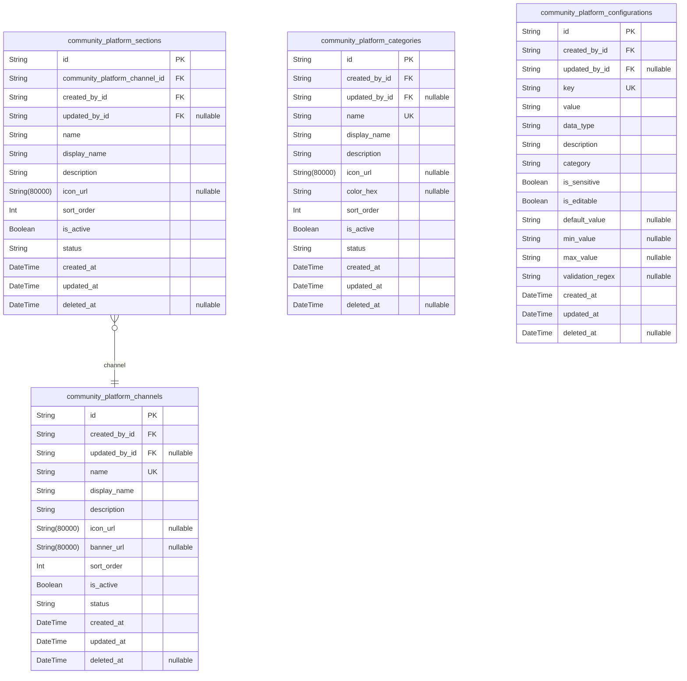

### `community_platform_channels`

Platform-wide communication channels for organizing communities and content.

Represents distinct communication pathways within the platform where
communities can be grouped and content organized. Channels serve as
top-level containers that help categorize communities by broad topics or
themes.

Each channel can contain multiple sections and categories, providing
hierarchical organization. Channels are managed by platform
administrators and serve as the primary navigation structure for users
browsing communities.

**CRITICAL MODIFICATION**: Added created_by and updated_by fields to
track which administrator created and modified each channel, enhancing
audit trail capabilities.

Properties as follows:

- `id`: Primary Key.
- `created_by_id`
  > Administrator who created this channel. {@link
  > community_platform_admins.id}
- `updated_by_id`
  > Administrator who last updated this channel. {@link
  > community_platform_admins.id}
- `name`: Unique name identifier for the channel used in URLs and display.
- `display_name`: Human-readable display name for the channel shown to users.
- `description`: Detailed description explaining the channel's purpose and content focus.
- `icon_url`: URL to the channel's icon image for visual representation.
- `banner_url`: URL to the channel's banner image for header display.
- `sort_order`: Numerical order for sorting channels in navigation menus.
- `is_active`: Whether the channel is currently active and visible to users.
- `status`
  > Current workflow status of the channel (draft, active, archived,
  > suspended).
- `created_at`: Timestamp when the channel was created.
- `updated_at`: Timestamp when the channel was last updated.
- `deleted_at`: Timestamp when the channel was soft deleted.

### `community_platform_sections`

Organizational sections within channels for grouping related communities.

Sections provide secondary level organization within channels, allowing
for more granular categorization of communities. Each section belongs to
a specific channel and contains communities that share common themes or
topics.

Sections help users discover related communities and provide additional
navigation hierarchy beyond the channel level.

**CRITICAL MODIFICATION**: Enhanced relationship integrity by adding
proper cascade constraints and audit trail fields with administrator
tracking.

Properties as follows:

- `id`: Primary Key.
- `community_platform_channel_id`
  > Parent channel that contains this section. {@link
  > community_platform_channels.id}
- `created_by_id`
  > Administrator who created this section. {@link
  > community_platform_admins.id}
- `updated_by_id`
  > Administrator who last updated this section. {@link
  > community_platform_admins.id}
- `name`: Unique name identifier for the section within its parent channel.
- `display_name`: Human-readable display name for the section shown to users.
- `description`: Detailed description explaining the section's purpose and community focus.
- `icon_url`: URL to the section's icon image for visual representation.
- `sort_order`: Numerical order for sorting sections within their parent channel.
- `is_active`: Whether the section is currently active and visible to users.
- `status`
  > Current workflow status of the section (draft, active, archived,
  > suspended).
- `created_at`: Timestamp when the section was created.
- `updated_at`: Timestamp when the section was last updated.
- `deleted_at`: Timestamp when the section was soft deleted.

### `community_platform_categories`

Content categorization system for organizing posts and communities by topic.

Categories provide thematic organization for content across the platform.
They can be applied to communities, posts, or other content types to
facilitate discovery and filtering.

Categories are managed at the platform level and can be assigned to
multiple entities, providing consistent tagging and classification
system-wide.

**CRITICAL MODIFICATION**: Added administrator tracking and workflow
status fields to support proper category lifecycle management and
approval workflows.

Properties as follows:

- `id`: Primary Key.
- `created_by_id`
  > Administrator who created this category. {@link
  > community_platform_admins.id}
- `updated_by_id`
  > Administrator who last updated this category. {@link
  > community_platform_admins.id}
- `name`: Unique name identifier for the category used in URLs and filtering.
- `display_name`: Human-readable display name for the category shown to users.
- `description`: Detailed description explaining the category's purpose and content scope.
- `icon_url`: URL to the category's icon image for visual representation.
- `color_hex`: Hex color code for visual identification of the category.
- `sort_order`: Numerical order for sorting categories in selection menus.
- `is_active`: Whether the category is currently active and available for use.
- `status`
  > Current workflow status of the category (draft, active, archived,
  > suspended).
- `created_at`: Timestamp when the category was created.
- `updated_at`: Timestamp when the category was last updated.
- `deleted_at`: Timestamp when the category was soft deleted.

### `community_platform_configurations`

Platform-wide configuration settings and system parameters.

Stores global platform settings, feature flags, and configuration values
that control platform behavior. These settings are managed by
administrators and affect the entire platform operation.

Configuration values can include system limits, feature enablement,
default behaviors, and platform-wide policies that govern user
interactions and content management.

**CRITICAL MODIFICATION**: Added comprehensive validation fields and
enhanced data type handling with proper constraints for configuration
values.

Properties as follows:

- `id`: Primary Key.
- `created_by_id`
  > Administrator who created this configuration. {@link
  > community_platform_admins.id}
- `updated_by_id`
  > Administrator who last updated this configuration. {@link
  > community_platform_admins.id}
- `key`: Unique configuration key identifier used to retrieve the setting value.
- `value`: Configuration value stored as string (may represent various data types).
- `data_type`: Data type of the configuration value (string, number, boolean, json).
- `description`
  > Detailed description explaining the configuration setting's purpose and
  > usage.
- `category`: Grouping category for organizing related configuration settings.
- `is_sensitive`
  > Whether the configuration value contains sensitive information that
  > requires protection.
- `is_editable`: Whether administrators can modify this configuration setting.
- `default_value`: Default value used when no custom value is set.
- `min_value`: Minimum allowed value for numeric configurations.
- `max_value`: Maximum allowed value for numeric configurations.
- `validation_regex`: Regular expression pattern for validating configuration values.
- `created_at`: Timestamp when the configuration was created.
- `updated_at`: Timestamp when the configuration was last updated.
- `deleted_at`: Timestamp when the configuration was soft deleted.

## Actors

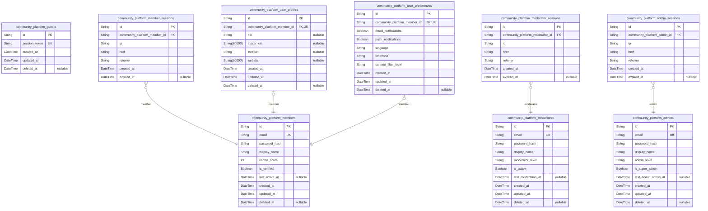

### `community_platform_guests`

Guest users who can browse public content without authentication.

Represents anonymous users accessing the platform with limited
permissions. Guests can view public posts, browse communities, and search
content but cannot create content or participate in discussions. This
table tracks guest sessions and provides basic analytics for anonymous
user behavior.

Guests have no authentication requirements and are identified by session
tokens rather than persistent accounts.

Properties as follows:

- `id`: Primary Key.
- `session_token`: Unique session identifier for guest tracking.
- `created_at`: Timestamp when guest session was created.
- `updated_at`: Timestamp when guest session was last updated.
- `deleted_at`: Timestamp when guest session was soft deleted.

### `community_platform_members`

Registered member users with content creation and voting privileges.

Represents authenticated users who can create posts, submit comments,
vote on content, and subscribe to communities. Members undergo email
verification and have full access to platform features within community
guidelines.

Each member maintains a profile, preferences, and session history for
personalized platform experience.

Properties as follows:

- `id`: Primary Key.
- `email`: Member email address used for authentication and communication.
- `password_hash`: Hashed password for secure authentication.
- `display_name`: Public display name shown to other users.
- `karma_score`: Reputation score based on content upvotes and community participation.
- `is_verified`: Indicates whether member has completed email verification.
- `last_active_at`: Timestamp of member's last platform activity.
- `created_at`: Timestamp when member account was created.
- `updated_at`: Timestamp when member account was last updated.
- `deleted_at`: Timestamp when member account was soft deleted.

### `community_platform_member_sessions`

Authentication sessions for member users.

Tracks member login sessions for security and audit purposes. Each
session records connection context including IP address, access URL, and
referrer information. Sessions automatically expire after inactivity and
support secure token-based authentication.

Used for audit tracing of member actions and managed through identity
authentication flows.

Properties as follows:

- `id`: Primary Key.
- `community_platform_member_id`: Belonged member's [community_platform_members.id](#community_platform_members).
- `ip`: IP address of the connection.
- `href`: Connection URL where session was established.
- `referrer`: Referrer URL that directed to the platform.
- `created_at`: Session creation timestamp.
- `expired_at`: Session expiration timestamp.

### `community_platform_moderators`

Community moderators with content management privileges.

Represents users who moderate specific communities with enhanced
permissions including content removal, user banning, and community
settings management. Moderators are typically assigned by community
creators or platform administrators.

Moderators undergo additional verification and have access to advanced
moderation tools and analytics.

Properties as follows:

- `id`: Primary Key.
- `email`: Moderator email address for authentication and notifications.
- `password_hash`: Hashed password for secure authentication.
- `display_name`: Public display name shown in moderation actions.
- `moderator_level`: Moderator privilege level (community, global, etc.).
- `is_active`: Indicates whether moderator account is currently active.
- `last_moderation_at`: Timestamp of last moderation action performed.
- `created_at`: Timestamp when moderator account was created.
- `updated_at`: Timestamp when moderator account was last updated.
- `deleted_at`: Timestamp when moderator account was soft deleted.

### `community_platform_moderator_sessions`

Authentication sessions for moderator users.

Tracks moderator login sessions with enhanced security logging. Each
session records connection context for audit purposes and supports secure
authentication with additional verification requirements.

Used for audit tracing of moderator actions and managed through identity
authentication flows.

Properties as follows:

- `id`: Primary Key.
- `community_platform_moderator_id`: Belonged moderator's [community_platform_moderators.id](#community_platform_moderators).
- `ip`: IP address of the connection.
- `href`: Connection URL where session was established.
- `referrer`: Referrer URL that directed to the platform.
- `created_at`: Session creation timestamp.
- `expired_at`: Session expiration timestamp.

### `community_platform_admins`

Platform administrators with full system access.

Represents users with complete platform administration privileges
including user management, system configuration, and global moderation
capabilities. Administrators undergo rigorous verification and have
access to all platform features and analytics.

Administrators maintain platform integrity and handle escalated
moderation cases.

Properties as follows:

- `id`: Primary Key.
- `email`: Admin email address for authentication and critical notifications.
- `password_hash`: Hashed password for secure authentication.
- `display_name`: Public display name shown in administrative actions.
- `admin_level`: Administrative privilege level (system, content, user, etc.).
- `is_super_admin`: Indicates whether admin has super administrator privileges.
- `last_admin_action_at`: Timestamp of last administrative action performed.
- `created_at`: Timestamp when admin account was created.
- `updated_at`: Timestamp when admin account was last updated.
- `deleted_at`: Timestamp when admin account was soft deleted.

### `community_platform_admin_sessions`

Authentication sessions for administrator users.

Tracks admin login sessions with comprehensive security logging and
enhanced verification requirements. Each session records connection
context for security auditing and supports secure authentication with
mandatory two-factor authentication.

Used for audit tracing of administrative actions and managed through
identity authentication flows.

Properties as follows:

- `id`: Primary Key.
- `community_platform_admin_id`: Belonged admin's [community_platform_admins.id](#community_platform_admins).
- `ip`: IP address of the connection.
- `href`: Connection URL where session was established.
- `referrer`: Referrer URL that directed to the platform.
- `created_at`: Session creation timestamp.
- `expired_at`: Session expiration timestamp.

### `community_platform_user_profiles`

User profile information for personalized platform experience.

Stores extended profile data for authenticated users including bio
information, avatar references, and personal preferences. Profiles
enhance user identity and provide context for community interactions.

Profiles are managed separately from authentication data to maintain
clear separation of concerns.

Properties as follows:

- `id`: Primary Key.
- `community_platform_member_id`: Belonged member's [community_platform_members.id](#community_platform_members).
- `bio`: User biography or description for profile page.
- `avatar_url`: URL to user's profile avatar image.
- `location`: User's geographic location for community context.
- `website`: User's personal website or social media link.
- `created_at`: Timestamp when profile was created.
- `updated_at`: Timestamp when profile was last updated.
- `deleted_at`: Timestamp when profile was soft deleted.

### `community_platform_user_preferences`

User preference settings for platform customization.

Stores user-configurable settings including notification preferences,
display options, privacy settings, and content filters. Preferences
enable personalized platform experience and control over user
interactions.

Preferences are managed separately from core user data to support
flexible customization options.

Properties as follows:

- `id`: Primary Key.
- `community_platform_member_id`: Belonged member's [community_platform_members.id](#community_platform_members).
- `email_notifications`: Whether user wants to receive email notifications.
- `push_notifications`: Whether user wants to receive push notifications.
- `language`: Preferred platform language setting.
- `timezone`: User's timezone for content scheduling.
- `content_filter_level`: Content filtering preference level (strict, moderate, lenient).
- `created_at`: Timestamp when preferences were created.
- `updated_at`: Timestamp when preferences were last updated.
- `deleted_at`: Timestamp when preferences were soft deleted.

## Communities

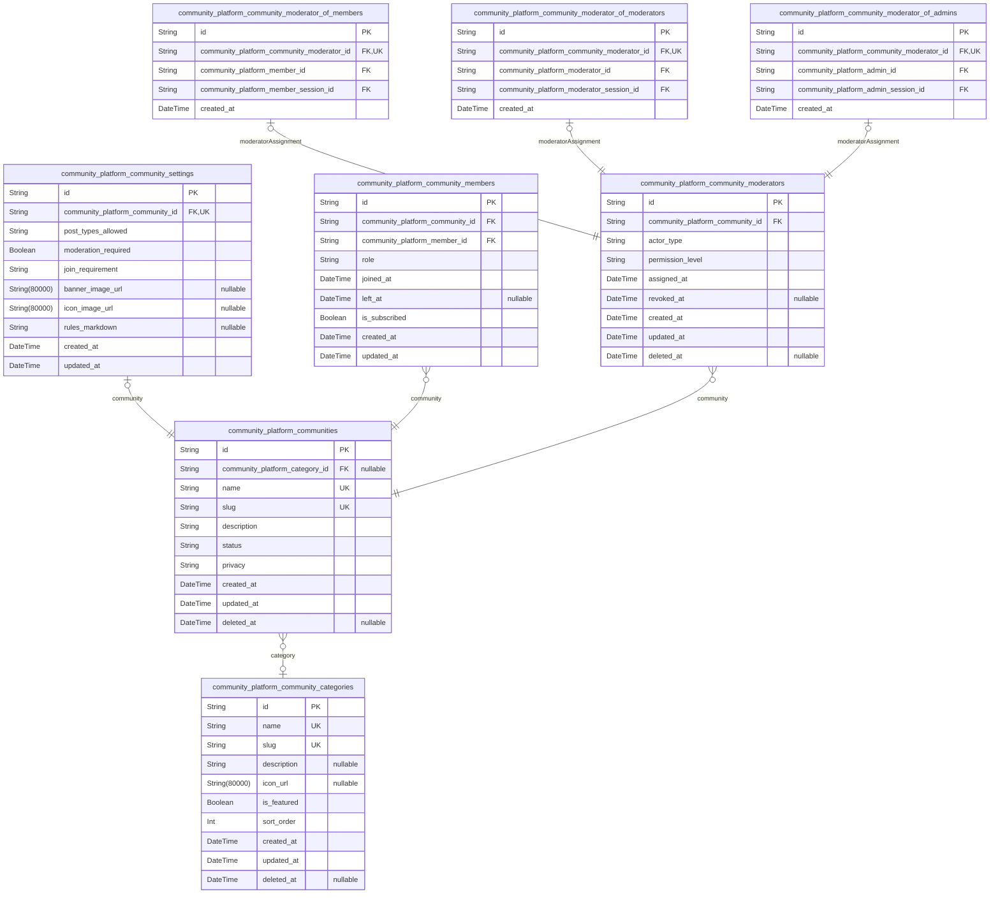

### `community_platform_communities`

Core community entities representing user-created groups focused on
specific topics or interests.

Each community serves as a container for posts, comments, and member
interactions. Communities can be public (anyone can view) or private
(approval required) and are managed by moderators who enforce
community-specific rules.

Communities maintain their own identity, settings, and membership base
while participating in the broader platform ecosystem. The community
lifecycle includes creation, growth, moderation, and potential archival.

Properties as follows:

- `id`: Primary Key.
- `community_platform_category_id`
  > Category classification for this community. {@link
  > community_platform_community_categories.id}
- `name`
  > Unique community name displayed to users. Must be between 3-21 characters
  > and contain only alphanumeric characters and underscores.
- `slug`
  > URL-friendly identifier for the community. Used in community URLs and
  > must be unique across all communities.
- `description`
  > Community description explaining the purpose and focus of the community.
  > Supports markdown formatting for rich content.
- `status`
  > Current community status. Valid values: active, archived, suspended,
  > pending. Controls community visibility and functionality.
- `privacy`
  > Community privacy setting. Valid values: public, private, restricted.
  > Determines who can view and join the community.
- `created_at`: Timestamp when the community was created.
- `updated_at`: Timestamp when the community was last updated.
- `deleted_at`
  > Timestamp when the community was soft deleted. Null if community is
  > active.

### `community_platform_community_settings`

Community-specific configuration settings that control behavior,
appearance, and moderation rules.

Each community has its own set of customizable settings that moderators
can configure. These settings include submission requirements, moderation
workflows, appearance customization, and community-specific rules.

Settings are managed through the community interface and affect how
members interact with the community content.

Properties as follows:

- `id`: Primary Key.
- `community_platform_community_id`
  > Community that these settings belong to. {@link
  > community_platform_communities.id}
- `post_types_allowed`
  > Types of posts allowed in this community. Comma-separated values: text,
  > link, image, video, poll.
- `moderation_required`: Whether posts require moderator approval before being published.
- `join_requirement`: Membership joining requirements. Valid values: open, approval, invite.
- `banner_image_url`
  > URL to the community banner image displayed at the top of the community
  > page.
- `icon_image_url`: URL to the community icon image used in listings and navigation.
- `rules_markdown`
  > Community rules and guidelines in markdown format. Displayed to all
  > members and visitors.
- `created_at`: Timestamp when these settings were created.
- `updated_at`: Timestamp when these settings were last updated.

### `community_platform_community_members`

Records of user memberships in communities, tracking subscription status
and member roles.

This table manages the many-to-many relationship between users and
communities. Each record represents a user's membership in a specific
community, including their join date, subscription status, and any
special member roles.

Membership records enable community-specific user tracking and support
features like personalized feeds and community-specific notifications.

This table requires independent management as users can join/leave
communities independently of other operations, making it a primary entity
rather than subsidiary.

Properties as follows:

- `id`: Primary Key.
- `community_platform_community_id`
  > Community that the user is a member of. {@link
  > community_platform_communities.id}
- `community_platform_member_id`
  > User who is a member of this community. {@link
  > community_platform_members.id}
- `role`
  > Member role within the community. Valid values: member,
  > approved_submitter, trusted_member.
- `joined_at`: Timestamp when the user joined the community.
- `left_at`: Timestamp when the user left the community. Null if still active member.
- `is_subscribed`
  > Whether the user is subscribed to receive notifications from this
  > community.
- `created_at`: Timestamp when this membership record was created.
- `updated_at`: Timestamp when this membership record was last updated.

### `community_platform_community_moderators`

Main entity for tracking moderator assignments across different actor types.

This table serves as the central record for moderator privileges,
supporting multiple actor types (members, moderators, admins) who can be
assigned moderator roles in communities. The polymorphic ownership
pattern ensures proper referential integrity while supporting flexible
assignment scenarios.

Moderator assignments require independent management as they can be
created, modified, and revoked independently of other community
operations.

Properties as follows:

- `id`: Primary Key.
- `community_platform_community_id`
  > Community where the user has moderator privileges. {@link
  > community_platform_communities.id}
- `actor_type`
  > Type of actor assigned as moderator. Valid values: member, moderator,
  > admin.
- `permission_level`: Level of moderator permissions. Valid values: full, content_only, limited.
- `assigned_at`: Timestamp when moderator privileges were assigned.
- `revoked_at`: Timestamp when moderator privileges were revoked. Null if still active.
- `created_at`: Timestamp when this moderator assignment was created.
- `updated_at`: Timestamp when this moderator assignment was last updated.
- `deleted_at`
  > Timestamp when this moderator assignment was soft deleted. Null if
  > assignment is active.

### `community_platform_community_categories`

Classification categories for organizing communities by topic, interest,
or type.

Categories help users discover communities by browsing organized
groupings. Each category represents a broad topic area that communities
can be associated with, enabling better content discovery and
organization.

Categories are managed at the platform level and can be used to feature
specific topic areas or guide new users to relevant communities.

Properties as follows:

- `id`: Primary Key.
- `name`: Category name displayed to users for browsing and discovery.
- `slug`: URL-friendly identifier for the category. Used in category browsing URLs.
- `description`
  > Description of the category explaining what types of communities it
  > contains.
- `icon_url`: URL to the category icon image used in category listings.
- `is_featured`: Whether this category is featured and prominently displayed to users.
- `sort_order`
  > Display order for category sorting in listings. Lower numbers appear
  > first.
- `created_at`: Timestamp when the category was created.
- `updated_at`: Timestamp when the category was last updated.
- `deleted_at`: Timestamp when the category was soft deleted. Null if category is active.

### `community_platform_community_moderator_of_members`

Subtype entity linking moderator assignments to specific member actors.

This table establishes the 1:1 relationship between moderator assignments
and member users who have been granted moderator privileges. It ensures
referential integrity while supporting the polymorphic ownership pattern
for moderator assignments.

Each record represents a specific member's moderator assignment with
their session context for audit trail purposes.

Properties as follows:

- `id`: Primary Key.
- `community_platform_community_moderator_id`
  > Moderator assignment record. {@link
  > community_platform_community_moderators.id}
- `community_platform_member_id`: Member user assigned as moderator. [community_platform_members.id](#community_platform_members)
- `community_platform_member_session_id`
  > Session context when moderator was assigned. {@link
  > community_platform_member_sessions.id}
- `created_at`: Timestamp when this member moderator assignment was created.

### `community_platform_community_moderator_of_moderators`

Subtype entity linking moderator assignments to specific moderator actors.

This table establishes the 1:1 relationship between moderator assignments
and moderator users who have been granted additional moderator privileges
in communities. It ensures referential integrity while supporting the
polymorphic ownership pattern.

Each record represents a specific moderator's assignment with their
session context for audit trail purposes.

Properties as follows:

- `id`: Primary Key.
- `community_platform_community_moderator_id`
  > Moderator assignment record. {@link
  > community_platform_community_moderators.id}
- `community_platform_moderator_id`
  > Moderator user assigned as community moderator. {@link
  > community_platform_moderators.id}
- `community_platform_moderator_session_id`
  > Session context when moderator was assigned. {@link
  > community_platform_moderator_sessions.id}
- `created_at`: Timestamp when this moderator assignment was created.

### `community_platform_community_moderator_of_admins`

Subtype entity linking moderator assignments to specific administrator
actors.

This table establishes the 1:1 relationship between moderator assignments
and admin users who have been granted moderator privileges in
communities. It ensures referential integrity while supporting the
polymorphic ownership pattern.

Each record represents a specific admin's assignment with their session
context for audit trail purposes.

Properties as follows:

- `id`: Primary Key.
- `community_platform_community_moderator_id`
  > Moderator assignment record. {@link
  > community_platform_community_moderators.id}
- `community_platform_admin_id`
  > Admin user assigned as community moderator. {@link
  > community_platform_admins.id}
- `community_platform_admin_session_id`
  > Session context when admin was assigned. {@link
  > community_platform_admin_sessions.id}
- `created_at`: Timestamp when this admin moderator assignment was created.

## Posts

```mermaid
erDiagram
"community_platform_posts" {
  String id PK
  String community_platform_community_id FK
  String title
  String post_type
  String status
  Int score
  Int view_count
  Int comment_count
  DateTime created_at
  DateTime updated_at
  DateTime deleted_at "nullable"
}
"community_platform_post_of_members" {
  String id PK
  String community_platform_post_id FK,UK
  String community_platform_member_id FK
  String community_platform_member_session_id FK
  DateTime created_at
}
"community_platform_post_of_moderators" {
  String id PK
  String community_platform_post_id FK,UK
  String community_platform_moderator_id FK
  String community_platform_moderator_session_id FK
  DateTime created_at
}
"community_platform_post_of_admins" {
  String id PK
  String community_platform_post_id FK,UK
  String community_platform_admin_id FK
  String community_platform_admin_session_id FK
  DateTime created_at
}
"community_platform_post_contents" {
  String id PK
  String community_platform_post_id FK,UK
  String content
  String content_type
  Int word_count
  DateTime created_at
  DateTime updated_at
}
"community_platform_post_media" {
  String id PK
  String community_platform_post_id FK
  String community_platform_media_file_id FK
  Int display_order
  String caption "nullable"
  DateTime created_at
}
"community_platform_post_polls" {
  String id PK
  String community_platform_post_id FK,UK
  String question
  Int duration_days
  Int max_votes_per_user
  Int total_votes
  DateTime created_at
  DateTime expires_at
}
"community_platform_post_poll_options" {
  String id PK
  String community_platform_post_poll_id FK
  String option_text
  Int display_order
  Int vote_count
  DateTime created_at
}
"community_platform_post_votes" {
  String id PK
  String community_platform_post_id FK
  String actor_type
  String vote_type
  Int vote_weight
  DateTime created_at
  DateTime updated_at
}
"community_platform_post_reports" {
  String id PK
  String community_platform_post_id FK
  String actor_type
  String report_reason
  String report_details "nullable"
  String status
  DateTime created_at
  DateTime resolved_at "nullable"
}
"community_platform_post_snapshots" {
  String id PK
  String community_platform_post_id FK
  String title
  String post_type
  String status
  Int score
  Int view_count
  Int comment_count
  String snapshot_reason
  DateTime created_at
}
"community_platform_post_votes_of_members" {
  String id PK
  String community_platform_post_vote_id FK,UK
  String community_platform_member_id FK
  DateTime created_at
}
"community_platform_post_votes_of_moderators" {
  String id PK
  String community_platform_post_vote_id FK,UK
  String community_platform_moderator_id FK
  DateTime created_at
}
"community_platform_post_votes_of_admins" {
  String id PK
  String community_platform_post_vote_id FK,UK
  String community_platform_admin_id FK
  DateTime created_at
}
"community_platform_post_reports_of_members" {
  String id PK
  String community_platform_post_report_id FK,UK
  String community_platform_member_id FK
  DateTime created_at
}
"community_platform_post_reports_of_moderators" {
  String id PK
  String community_platform_post_report_id FK,UK
  String community_platform_moderator_id FK
  DateTime created_at
}
"community_platform_post_reports_of_admins" {
  String id PK
  String community_platform_post_report_id FK,UK
  String community_platform_admin_id FK
  DateTime created_at
}
"community_platform_post_vote_snapshots" {
  String id PK
  String community_platform_post_vote_id FK
  String actor_type
  String vote_type
  Int vote_weight
  String snapshot_reason
  DateTime created_at
}
"community_platform_post_of_members" |o--|| "community_platform_posts" : post
"community_platform_post_of_moderators" |o--|| "community_platform_posts" : post
"community_platform_post_of_admins" |o--|| "community_platform_posts" : post
"community_platform_post_contents" |o--|| "community_platform_posts" : post
"community_platform_post_media" }o--|| "community_platform_posts" : post
"community_platform_post_polls" |o--|| "community_platform_posts" : post
"community_platform_post_poll_options" }o--|| "community_platform_post_polls" : poll
"community_platform_post_votes" }o--|| "community_platform_posts" : post
"community_platform_post_reports" }o--|| "community_platform_posts" : post
"community_platform_post_snapshots" }o--|| "community_platform_posts" : post
"community_platform_post_votes_of_members" |o--|| "community_platform_post_votes" : vote
"community_platform_post_votes_of_moderators" |o--|| "community_platform_post_votes" : vote
"community_platform_post_votes_of_admins" |o--|| "community_platform_post_votes" : vote
"community_platform_post_reports_of_members" |o--|| "community_platform_post_reports" : report
"community_platform_post_reports_of_moderators" |o--|| "community_platform_post_reports" : report
"community_platform_post_reports_of_admins" |o--|| "community_platform_post_reports" : report
"community_platform_post_vote_snapshots" }o--|| "community_platform_post_votes" : vote
```

### `community_platform_posts`

Main entity representing posts created by users on the platform.

Stores core post metadata including title, status, and community
association. Posts can be created by members, moderators, or
administrators through their respective subtype tables. Each post has a
lifecycle with status tracking and supports soft deletion for content
moderation.

Posts are associated with communities and can have various content types
including text, links, media, and polls. The system maintains audit
trails through post snapshots and supports democratic content curation
through voting mechanisms.

Properties as follows:

- `id`: Primary Key.
- `community_platform_community_id`
  > Community where the post is published. {@link
  > community_platform_communities.id}
- `title`
  > Post title displayed to users. Must be between 5-300 characters as per
  > business requirements.
- `post_type`
  > Type of post content: text, link, media, or poll. Determines which
  > content table stores the actual post body.
- `status`
  > Current post status: draft, published, archived, or removed. Controls
  > visibility and moderation state.
- `score`
  > Calculated vote score representing upvotes minus downvotes. Used for
  > content ranking.
- `view_count`: Number of times the post has been viewed by users.
- `comment_count`: Number of comments on the post. Maintained for performance optimization.
- `created_at`: Timestamp when the post was initially created.
- `updated_at`: Timestamp when the post was last modified.
- `deleted_at`: Timestamp when the post was soft deleted. Null indicates active post.

### `community_platform_post_of_members`

Subtype entity for posts created by regular community members.

Stores member-specific context for posts including the creating member
and their session information. This table implements the polymorphic
ownership pattern allowing posts to be created by different actor types
while maintaining referential integrity.

Each record has a 1:1 relationship with the main post entity and contains
actor-specific metadata that differs from moderator or admin-created
posts.

Properties as follows:

- `id`: Primary Key.
- `community_platform_post_id`: Reference to the main post entity. [community_platform_posts.id](#community_platform_posts)
- `community_platform_member_id`: Member who created the post. [community_platform_members.id](#community_platform_members)
- `community_platform_member_session_id`
  > Session context when the post was created. {@link
  > community_platform_member_sessions.id}
- `created_at`: Timestamp when the member created the post.

### `community_platform_post_of_moderators`

Subtype entity for posts created by community moderators.

Stores moderator-specific context for posts including the creating
moderator and their session information. Moderator-created posts may have
different visibility or authority implications compared to member-created
posts.

This table follows the polymorphic ownership pattern and maintains a 1:1
relationship with the main post entity.

Properties as follows:

- `id`: Primary Key.
- `community_platform_post_id`: Reference to the main post entity. [community_platform_posts.id](#community_platform_posts)
- `community_platform_moderator_id`: Moderator who created the post. [community_platform_moderators.id](#community_platform_moderators)
- `community_platform_moderator_session_id`
  > Session context when the post was created. {@link
  > community_platform_moderator_sessions.id}
- `created_at`: Timestamp when the moderator created the post.

### `community_platform_post_of_admins`

Subtype entity for posts created by platform administrators.

Stores admin-specific context for posts including the creating admin and
their session information. Admin-created posts typically represent
official platform announcements or system-wide communications.

This table implements the polymorphic ownership pattern with a 1:1
relationship to the main post entity.

Properties as follows:

- `id`: Primary Key.
- `community_platform_post_id`: Reference to the main post entity. [community_platform_posts.id](#community_platform_posts)
- `community_platform_admin_id`: Admin who created the post. [community_platform_admins.id](#community_platform_admins)
- `community_platform_admin_session_id`
  > Session context when the post was created. {@link
  > community_platform_admin_sessions.id}
- `created_at`: Timestamp when the admin created the post.

### `community_platform_post_contents`

Stores the actual content body for text-based posts.

Contains the rich text content, markdown formatting, and additional
metadata for posts that are primarily text-based. This table supports the
separation of post metadata from post content, allowing for efficient
content management and versioning.

Each content record is associated with a specific post and maintains
content-specific attributes like word count and formatting flags.

Properties as follows:

- `id`: Primary Key.
- `community_platform_post_id`: Post that contains this content. [community_platform_posts.id](#community_platform_posts)
- `content`: The actual text content of the post with markdown formatting support.
- `content_type`: Format of the content: markdown, plaintext, or html.
- `word_count`: Number of words in the content for analytics and display purposes.
- `created_at`: Timestamp when the content was initially created.
- `updated_at`: Timestamp when the content was last modified.

### `community_platform_post_media`

Stores media file associations for posts containing images, videos, or
other media.

Manages the relationship between posts and uploaded media files,
including file metadata, display order, and media-specific attributes.
This table supports posts that primarily feature visual or audio content.

Each record links a post to a media file from the platform's media
storage system with additional context for presentation.

Properties as follows:

- `id`: Primary Key.
- `community_platform_post_id`: Post that contains this media. [community_platform_posts.id](#community_platform_posts)
- `community_platform_media_file_id`
  > Reference to the actual media file. {@link
  > community_platform_media_files.id}
- `display_order`: Order in which media should be displayed within the post.
- `caption`: Optional caption text for the media item.
- `created_at`: Timestamp when the media was associated with the post.

### `community_platform_post_polls`

Manages poll data for posts that contain voting questions.

Stores poll-specific metadata including question, voting options,
duration, and results. This table supports the poll post type where users
can vote on multiple-choice questions.

Each poll is associated with a single post and maintains poll
configuration and aggregate voting statistics.

Properties as follows:

- `id`: Primary Key.
- `community_platform_post_id`: Post that contains this poll. [community_platform_posts.id](#community_platform_posts)
- `question`: The poll question presented to users.
- `duration_days`: Number of days the poll remains open for voting.
- `max_votes_per_user`: Maximum number of options a user can vote for in this poll.
- `total_votes`: Aggregate count of all votes cast in this poll.
- `created_at`: Timestamp when the poll was created.
- `expires_at`: Timestamp when the poll closes for voting.

### `community_platform_post_poll_options`

Stores individual voting options for poll posts.

Contains the specific choices available for users to vote on within a
poll. Each option maintains its own vote count and display order within
the poll.

This table supports the many options per poll relationship and tracks
voting statistics for each individual choice.

Properties as follows:

- `id`: Primary Key.
- `community_platform_post_poll_id`: Poll that contains this option. [community_platform_post_polls.id](#community_platform_post_polls)
- `option_text`: The text of this voting option displayed to users.
- `display_order`: Order in which this option appears within the poll.
- `vote_count`: Number of votes received for this specific option.
- `created_at`: Timestamp when the option was created.

### `community_platform_post_votes`

Tracks individual user votes on posts for content curation.

Records each upvote or downvote cast by users on posts, enabling the
democratic content ranking system. This table supports the platform's
core voting mechanism where community members influence content
visibility through voting.

Each vote record includes the voter's identity, vote direction, and
timestamp for audit purposes. Uses proper polymorphic ownership pattern
with actor_type field and subtype tables.

**MODIFIED**: Changed stance to "subsidiary" since votes are managed
through post operations and don't require independent API endpoints.
Fixed polymorphic ownership pattern.

Properties as follows:

- `id`: Primary Key.
- `community_platform_post_id`: Post that received this vote. [community_platform_posts.id](#community_platform_posts)
- `actor_type`
  > Type of actor who cast the vote: member, moderator, or admin. Used for
  > efficient filtering and relationship resolution.
- `vote_type`: Direction of the vote: upvote or downvote.
- `vote_weight`: Weight of this vote based on user reputation or other factors.
- `created_at`: Timestamp when the vote was cast.
- `updated_at`: Timestamp when the vote was last changed.

### `community_platform_post_reports`

Manages user reports of inappropriate or rule-violating posts.

Tracks reports filed by users against posts that may violate community
guidelines or platform policies. This table supports the community
moderation system where users can flag content for review.

Each report includes the reason for reporting, the reporter's identity,
and the current status of the moderation process. Uses proper polymorphic
ownership pattern with actor_type field.

**MODIFIED**: Changed stance to "subsidiary" since reports are managed
through moderation workflows. Fixed polymorphic ownership pattern.

Properties as follows:

- `id`: Primary Key.
- `community_platform_post_id`: Post that is being reported. [community_platform_posts.id](#community_platform_posts)
- `actor_type`
  > Type of actor who filed the report: member, moderator, or admin. Used for
  > efficient filtering and relationship resolution.
- `report_reason`: Category or description of why the post was reported.
- `report_details`: Additional details or explanation provided by the reporter.
- `status`
  > Current status of the report: pending, reviewed, action_taken, or
  > dismissed.
- `created_at`: Timestamp when the report was filed.
- `resolved_at`: Timestamp when the report was resolved by moderators.

### `community_platform_post_snapshots`

Historical snapshots of post states for audit trails and version control.

Captures point-in-time states of posts whenever significant changes
occur, supporting content versioning, audit requirements, and rollback
capabilities. Each snapshot contains a complete copy of post data at the
time of capture.

**ADDED**: New snapshot table to support audit trail requirements.

Properties as follows:

- `id`: Primary Key.
- `community_platform_post_id`: Post that this snapshot captures. [community_platform_posts.id](#community_platform_posts)
- `title`: Post title at the time of snapshot.
- `post_type`: Post type at the time of snapshot.
- `status`: Post status at the time of snapshot.
- `score`: Post score at the time of snapshot.
- `view_count`: View count at the time of snapshot.
- `comment_count`: Comment count at the time of snapshot.
- `snapshot_reason`: Reason for creating this snapshot: edit, moderation, archive, etc.
- `created_at`: Timestamp when the snapshot was created.

### `community_platform_post_votes_of_members`

Subtype entity for votes cast by regular community members.

Links vote records to specific member actors, maintaining referential
integrity and enabling efficient member-specific vote queries. Each
member vote has a 1:1 relationship with the main vote entity.

**ADDED**: New subtype table to fix polymorphic ownership violation.

Properties as follows:

- `id`: Primary Key.
- `community_platform_post_vote_id`: Main vote record. [community_platform_post_votes.id](#community_platform_post_votes)
- `community_platform_member_id`: Member who cast the vote. [community_platform_members.id](#community_platform_members)
- `created_at`: Timestamp when the member vote was recorded.

### `community_platform_post_votes_of_moderators`

Subtype entity for votes cast by community moderators.

Links vote records to specific moderator actors, maintaining referential
integrity and enabling efficient moderator-specific vote queries. Each
moderator vote has a 1:1 relationship with the main vote entity.

**ADDED**: New subtype table to fix polymorphic ownership violation.

Properties as follows:

- `id`: Primary Key.
- `community_platform_post_vote_id`: Main vote record. [community_platform_post_votes.id](#community_platform_post_votes)
- `community_platform_moderator_id`: Moderator who cast the vote. [community_platform_moderators.id](#community_platform_moderators)
- `created_at`: Timestamp when the moderator vote was recorded.

### `community_platform_post_votes_of_admins`

Subtype entity for votes cast by platform administrators.

Links vote records to specific admin actors, maintaining referential
integrity and enabling efficient admin-specific vote queries. Each admin
vote has a 1:1 relationship with the main vote entity.

**ADDED**: New subtype table to fix polymorphic ownership violation.

Properties as follows:

- `id`: Primary Key.
- `community_platform_post_vote_id`: Main vote record. [community_platform_post_votes.id](#community_platform_post_votes)
- `community_platform_admin_id`: Admin who cast the vote. [community_platform_admins.id](#community_platform_admins)
- `created_at`: Timestamp when the admin vote was recorded.

### `community_platform_post_reports_of_members`

Subtype entity for reports filed by regular community members.

Links report records to specific member actors, maintaining referential
integrity and enabling efficient member-specific report queries. Each
member report has a 1:1 relationship with the main report entity.

**ADDED**: New subtype table to fix polymorphic ownership violation.

Properties as follows:

- `id`: Primary Key.
- `community_platform_post_report_id`: Main report record. [community_platform_post_reports.id](#community_platform_post_reports)
- `community_platform_member_id`: Member who filed the report. [community_platform_members.id](#community_platform_members)
- `created_at`: Timestamp when the member report was filed.

### `community_platform_post_reports_of_moderators`

Subtype entity for reports filed by community moderators.

Links report records to specific moderator actors, maintaining
referential integrity and enabling efficient moderator-specific report
queries. Each moderator report has a 1:1 relationship with the main
report entity.

**ADDED**: New subtype table to fix polymorphic ownership violation.

Properties as follows:

- `id`: Primary Key.
- `community_platform_post_report_id`: Main report record. [community_platform_post_reports.id](#community_platform_post_reports)
- `community_platform_moderator_id`: Moderator who filed the report. [community_platform_moderators.id](#community_platform_moderators)
- `created_at`: Timestamp when the moderator report was filed.

### `community_platform_post_reports_of_admins`

Subtype entity for reports filed by platform administrators.

Links report records to specific admin actors, maintaining referential
integrity and enabling efficient admin-specific report queries. Each
admin report has a 1:1 relationship with the main report entity.

**ADDED**: New subtype table to fix polymorphic ownership violation.

Properties as follows:

- `id`: Primary Key.
- `community_platform_post_report_id`: Main report record. [community_platform_post_reports.id](#community_platform_post_reports)
- `community_platform_admin_id`: Admin who filed the report. [community_platform_admins.id](#community_platform_admins)
- `created_at`: Timestamp when the admin report was filed.

### `community_platform_post_vote_snapshots`

Historical snapshots of vote states for audit trails.

Captures point-in-time states of votes whenever changes occur, supporting
vote history tracking and audit requirements. Each snapshot contains vote
data at the time of capture.

**ADDED**: New snapshot table to support vote audit trail requirements.

Properties as follows:

- `id`: Primary Key.
- `community_platform_post_vote_id`: Vote that this snapshot captures. [community_platform_post_votes.id](#community_platform_post_votes)
- `actor_type`: Actor type at the time of snapshot.
- `vote_type`: Vote type at the time of snapshot.
- `vote_weight`: Vote weight at the time of snapshot.
- `snapshot_reason`: Reason for creating this snapshot: change, audit, etc.
- `created_at`: Timestamp when the snapshot was created.

## Comments

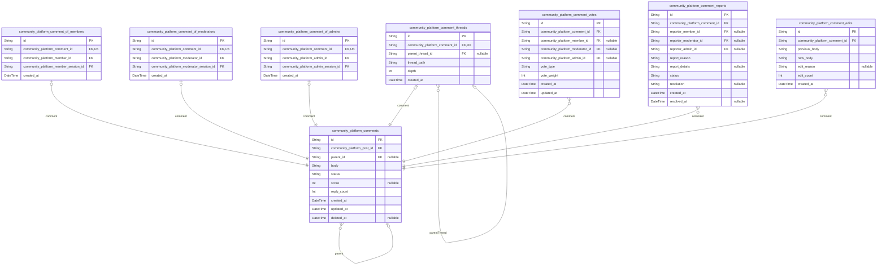

### `community_platform_comments`

Core comment entity storing user-generated comments on posts.

Represents individual comments within discussion threads, supporting
nested replies and rich text formatting. Each comment is associated with
a specific post and can have parent-child relationships for threaded
discussions.

Comments undergo moderation workflows and can be edited by authors within
time limits. The system tracks voting, reporting, and editing history for
each comment.

Soft deletion is supported to maintain audit trails while allowing
content moderation.

Properties as follows:

- `id`: Primary Key.
- `community_platform_post_id`
  > Associated post where this comment appears. {@link
  > community_platform_posts.id}
- `parent_id`
  > Parent comment for threaded replies. {@link
  > community_platform_comments.id}
- `body`
  > Comment content with rich text formatting support. Maximum length
  > enforced for performance and usability.
- `status`
  > Current moderation status (published, pending, removed, archived).
  > Controls comment visibility and moderation workflow.
- `score`
  > Calculated score based on upvotes and downvotes. Used for comment ranking
  > and visibility algorithms.
- `reply_count`
  > Number of direct replies to this comment. Maintained for performance
  > optimization.
- `created_at`: Comment creation timestamp.
- `updated_at`: Last modification timestamp.
- `deleted_at`: Soft deletion timestamp for audit trail maintenance.

### `community_platform_comment_of_members`

Subtype entity for comments created by regular community members.

Links comments to specific member actors who created them, establishing
proper polymorphic ownership pattern. Each member-created comment has a
1:1 relationship with the main comment entity.

Maintains referential integrity by ensuring exactly one actor type per
comment through database constraints.

Properties as follows:

- `id`: Primary Key.
- `community_platform_comment_id`: Main comment entity being linked. [community_platform_comments.id](#community_platform_comments)
- `community_platform_member_id`: Member who created the comment. [community_platform_members.id](#community_platform_members)
- `community_platform_member_session_id`
  > Session context when comment was created. {@link
  > community_platform_member_sessions.id}
- `created_at`: Timestamp when member created this comment.

### `community_platform_comment_of_moderators`

Subtype entity for comments created by community moderators.

Links comments to specific moderator actors who created them,
establishing proper polymorphic ownership pattern. Each moderator-created
comment has a 1:1 relationship with the main comment entity.

Maintains referential integrity by ensuring exactly one actor type per
comment through database constraints.

Properties as follows:

- `id`: Primary Key.
- `community_platform_comment_id`: Main comment entity being linked. [community_platform_comments.id](#community_platform_comments)
- `community_platform_moderator_id`
  > Moderator who created the comment. {@link
  > community_platform_moderators.id}
- `community_platform_moderator_session_id`
  > Session context when comment was created. {@link
  > community_platform_moderator_sessions.id}
- `created_at`: Timestamp when moderator created this comment.

### `community_platform_comment_of_admins`

Subtype entity for comments created by platform administrators.

Links comments to specific admin actors who created them, establishing
proper polymorphic ownership pattern. Each admin-created comment has a
1:1 relationship with the main comment entity.

Maintains referential integrity by ensuring exactly one actor type per
comment through database constraints.

Properties as follows:

- `id`: Primary Key.
- `community_platform_comment_id`: Main comment entity being linked. [community_platform_comments.id](#community_platform_comments)
- `community_platform_admin_id`: Admin who created the comment. [community_platform_admins.id](#community_platform_admins)
- `community_platform_admin_session_id`
  > Session context when comment was created. {@link
  > community_platform_admin_sessions.id}
- `created_at`: Timestamp when admin created this comment.

### `community_platform_comment_threads`

Thread structure management for organizing comment hierarchies.

Maintains the parent-child relationships between comments to support
nested discussion threads. Each record represents a comment's position
within a thread hierarchy.

Optimizes thread navigation and ensures proper comment ordering for
display. Supports unlimited nesting depth while maintaining performance
through efficient indexing.

Properties as follows:

- `id`: Primary Key.
- `community_platform_comment_id`
  > The comment being positioned in the thread. {@link
  > community_platform_comments.id}
- `parent_thread_id`
  > Parent thread position for nested replies. {@link
  > community_platform_comment_threads.id}
- `thread_path`
  > Materialized path representing the comment's position in the thread
  > hierarchy for efficient querying.
- `depth`: Nesting depth of this comment within the thread (0 for root comments).
- `created_at`: Timestamp when this thread position was established.

### `community_platform_comment_votes`

Voting records for individual comments by platform users.

Tracks upvotes and downvotes on comments to calculate popularity scores
and determine comment ranking. Each vote represents a user's opinion on a
comment's quality or relevance.

Prevents duplicate voting and maintains vote integrity through proper
constraints. Used for comment scoring algorithms and user reputation
calculations.

Properties as follows:

- `id`: Primary Key.
- `community_platform_comment_id`: Comment being voted on. [community_platform_comments.id](#community_platform_comments)
- `community_platform_member_id`: Member casting the vote. [community_platform_members.id](#community_platform_members)
- `community_platform_moderator_id`: Moderator casting the vote. [community_platform_moderators.id](#community_platform_moderators)
- `community_platform_admin_id`: Admin casting the vote. [community_platform_admins.id](#community_platform_admins)
- `vote_type`
  > Type of vote cast (upvote, downvote). Determines the impact on comment
  > score.
- `vote_weight`: Weight of this vote based on user reputation or other factors.
- `created_at`: Timestamp when the vote was cast.
- `updated_at`: Timestamp when the vote was last modified.

### `community_platform_comment_reports`

User reports filed against comments for moderation review.

Tracks user reports of inappropriate, spam, or rule-violating comments.
Each report initiates a moderation workflow where moderators review and
take appropriate action.

Maintains report history, status tracking, and resolution details for
accountability and transparency in the moderation process.

Properties as follows:

- `id`: Primary Key.
- `community_platform_comment_id`: Comment being reported. [community_platform_comments.id](#community_platform_comments)
- `reporter_member_id`: Member filing the report. [community_platform_members.id](#community_platform_members)
- `reporter_moderator_id`: Moderator filing the report. [community_platform_moderators.id](#community_platform_moderators)
- `reporter_admin_id`: Admin filing the report. [community_platform_admins.id](#community_platform_admins)
- `report_reason`: Category or description of the violation being reported.
- `report_details`: Additional details or context provided by the reporter.
- `status`: Current status of the report (pending, reviewing, resolved, dismissed).
- `resolution`: Moderator's resolution decision and reasoning.
- `created_at`: Timestamp when the report was filed.
- `resolved_at`: Timestamp when the report was resolved by a moderator.

### `community_platform_comment_edits`

Historical record of comment edits for audit trail and version control.

Captures the complete history of comment modifications, preserving
original content and tracking changes over time. Each edit creates a
snapshot of the comment's state at that moment.

Supports edit rollback, moderation review, and transparency in comment
evolution. Maintains the relationship between comment versions for
comprehensive edit history.

Properties as follows:

- `id`: Primary Key.
- `community_platform_comment_id`: Comment being edited. [community_platform_comments.id](#community_platform_comments)
- `previous_body`: Comment content before the edit was applied.
- `new_body`: Comment content after the edit was applied.
- `edit_reason`: Reason provided for the edit by the author or moderator.
- `edit_count`: Sequential edit number for this comment (1st edit, 2nd edit, etc.).
- `created_at`: Timestamp when this edit was recorded.

## Voting

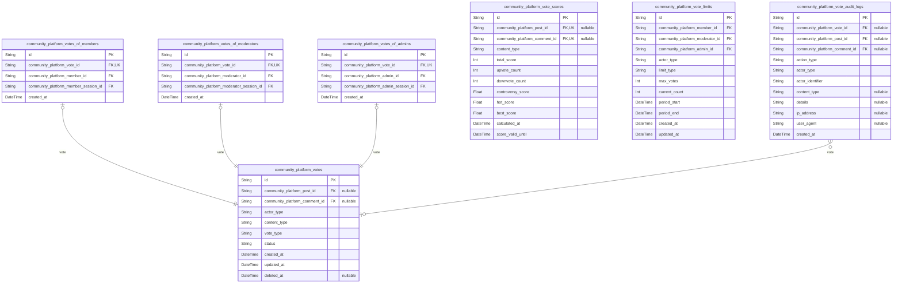

### `community_platform_votes`

Main voting entity that tracks votes cast on various content types across
the platform.

Stores the core voting information including vote direction
(upvote/downvote), content type reference, and actor type classification.
This table serves as the central voting record that links to specific
voter subtypes based on the actor's role.

Votes can be cast on posts, comments, and potentially other content
types. Each vote maintains its own lifecycle with status tracking and
supports soft deletion for audit trail preservation.

The actor_type field enables polymorphic ownership, allowing votes to be
cast by members, moderators, or administrators while maintaining
referential integrity through subtype tables.

Properties as follows:

- `id`: Primary Key.
- `community_platform_post_id`
  > Reference to the post being voted on. Null if voting on a comment. {@link
  > community_platform_posts.id}
- `community_platform_comment_id`
  > Reference to the comment being voted on. Null if voting on a post. {@link
  > community_platform_comments.id}
- `actor_type`
  > Type of actor who cast the vote. Valid values: 'member', 'moderator',
  > 'admin'. Used for routing to appropriate subtype table and quick
  > filtering.
- `content_type`
  > Type of content being voted on. Valid values: 'post', 'comment'.
  > Determines which foreign key relationship to use.
- `vote_type`
  > Direction of the vote. Valid values: 'upvote', 'downvote'. Represents the
  > user's positive or negative assessment of the content.
- `status`
  > Current status of the vote. Valid values: 'active', 'cancelled',
  > 'pending'. Tracks the vote lifecycle and validity.
- `created_at`: Timestamp when the vote was initially cast.
- `updated_at`: Timestamp when the vote was last modified.
- `deleted_at`: Timestamp when the vote was soft deleted. Null indicates active vote.

### `community_platform_votes_of_members`

Subtype entity for votes cast by regular community members.

Stores member-specific voting information including the member reference
and session context. This table maintains the 1:1 relationship with the
main votes table for member-originated votes.

Each record links to a specific community_platform_members entry and
captures the voting session context for audit trail purposes. This
separation ensures proper referential integrity while supporting the
polymorphic voting pattern.

Properties as follows:

- `id`: Primary Key.
- `community_platform_vote_id`: Reference to the main vote record. [community_platform_votes.id](#community_platform_votes)
- `community_platform_member_id`: Member who cast the vote. [community_platform_members.id](#community_platform_members)
- `community_platform_member_session_id`
  > Session context when the vote was cast. {@link
  > community_platform_member_sessions.id}
- `created_at`: Timestamp when the member vote record was created.

### `community_platform_votes_of_moderators`

Subtype entity for votes cast by community moderators.

Stores moderator-specific voting information including the moderator
reference and session context. This table maintains the 1:1 relationship
with the main votes table for moderator-originated votes.

Each record links to a specific community_platform_moderators entry and
captures the voting session context. This separation ensures proper
referential integrity for moderator voting actions while supporting audit
trail requirements.

Properties as follows:

- `id`: Primary Key.
- `community_platform_vote_id`: Reference to the main vote record. [community_platform_votes.id](#community_platform_votes)
- `community_platform_moderator_id`: Moderator who cast the vote. [community_platform_moderators.id](#community_platform_moderators)
- `community_platform_moderator_session_id`
  > Session context when the vote was cast. {@link
  > community_platform_moderator_sessions.id}
- `created_at`: Timestamp when the moderator vote record was created.

### `community_platform_votes_of_admins`

Subtype entity for votes cast by platform administrators.

Stores admin-specific voting information including the admin reference
and session context. This table maintains the 1:1 relationship with the
main votes table for admin-originated votes.

Each record links to a specific community_platform_admins entry and
captures the voting session context. This separation ensures proper
referential integrity for administrator voting actions while supporting
comprehensive audit trail requirements.

Properties as follows:

- `id`: Primary Key.
- `community_platform_vote_id`: Reference to the main vote record. [community_platform_votes.id](#community_platform_votes)
- `community_platform_admin_id`: Admin who cast the vote. [community_platform_admins.id](#community_platform_admins)
- `community_platform_admin_session_id`
  > Session context when the vote was cast. {@link
  > community_platform_admin_sessions.id}
- `created_at`: Timestamp when the admin vote record was created.

### `community_platform_vote_scores`

Calculated vote scores for content items across the platform.

Stores pre-computed voting scores for posts and comments to enable
efficient ranking and sorting operations. This table serves as a
materialized view-like structure that aggregates voting data for
performance optimization.

Scores are calculated using platform-specific algorithms that consider
vote direction, voter reputation, and temporal factors. The table
supports real-time score updates while maintaining historical score
snapshots for trend analysis.

This denormalized approach allows for fast content ranking without
expensive aggregate queries during high-traffic periods.

Properties as follows:

- `id`: Primary Key.
- `community_platform_post_id`
  > Reference to the scored post. Null if scoring a comment. {@link
  > community_platform_posts.id}
- `community_platform_comment_id`
  > Reference to the scored comment. Null if scoring a post. {@link
  > community_platform_comments.id}
- `content_type`
  > Type of content being scored. Valid values: 'post', 'comment'. Determines
  > which foreign key is active.
- `total_score`: Aggregate score calculated from upvotes minus downvotes.
- `upvote_count`: Total number of upvotes received.
- `downvote_count`: Total number of downvotes received.
- `controversy_score`
  > Algorithmic score indicating how controversial the content is based on
  > vote distribution.
- `hot_score`: Time-weighted score for trending content ranking.
- `best_score`: Algorithmic score for 'best' content ranking considering multiple factors.
- `calculated_at`: Timestamp when the score was last calculated.
- `score_valid_until`: Timestamp when the score becomes stale and requires recalculation.

### `community_platform_vote_limits`

Rate limiting and voting restriction data for user voting activities.

Tracks voting rate limits and restrictions applied to users to prevent
vote manipulation and abuse. This table implements the platform's
anti-spam mechanisms by recording voting patterns and enforcing limits.

Each record represents a specific voting restriction window (hourly,
daily, etc.) and tracks the number of votes cast within that period. The
system uses this data to enforce fair voting practices across the
platform.

Restrictions can be based on user reputation, content type, or temporary
moderation actions.

Properties as follows:

- `id`: Primary Key.
- `community_platform_member_id`: Member subject to voting limits. [community_platform_members.id](#community_platform_members)
- `community_platform_moderator_id`
  > Moderator subject to voting limits. {@link
  > community_platform_moderators.id}
- `community_platform_admin_id`: Admin subject to voting limits. [community_platform_admins.id](#community_platform_admins)
- `actor_type`
  > Type of actor being limited. Valid values: 'member', 'moderator',
  > 'admin'. Determines which foreign key is active.
- `limit_type`
  > Type of voting limit being applied. Valid values: 'hourly', 'daily',
  > 'content_type', 'reputation_based'.
- `max_votes`: Maximum number of votes allowed within the limit period.
- `current_count`: Current number of votes cast within the limit period.
- `period_start`: Timestamp when the current limit period began.
- `period_end`: Timestamp when the current limit period ends.
- `created_at`: Timestamp when the limit record was created.
- `updated_at`: Timestamp when the limit record was last updated.

### `community_platform_vote_audit_logs`

Comprehensive audit trail for all voting-related actions across the
platform.

Records every significant voting event for security, compliance, and
debugging purposes. This table provides complete visibility into voting
activities, including vote casting, modifications, cancellations, and
system interventions.

Each audit entry captures the action type, performer, target content, and
contextual information. The logs support forensic analysis, abuse
detection, and platform integrity monitoring.

Audit records are append-only and maintained for compliance with data
retention policies.

Properties as follows:

- `id`: Primary Key.
- `community_platform_vote_id`: Reference to the vote being audited. [community_platform_votes.id](#community_platform_votes)
- `community_platform_post_id`: Reference to the post being voted on. [community_platform_posts.id](#community_platform_posts)
- `community_platform_comment_id`
  > Reference to the comment being voted on. {@link
  > community_platform_comments.id}
- `action_type`
  > Type of audit action performed. Valid values: 'vote_cast',
  > 'vote_cancelled', 'vote_modified', 'limit_applied', 'score_calculated'.
- `actor_type`
  > Type of actor performing the action. Valid values: 'member', 'moderator',
  > 'admin', 'system'.
- `actor_identifier`
  > Identifier of the actor performing the action (user ID, system process
  > name).
- `content_type`: Type of content involved in the action. Valid values: 'post', 'comment'.
- `details`: JSON-formatted details about the audit action for forensic analysis.
- `ip_address`: IP address from which the action was performed for security tracking.
- `user_agent`: User agent string from the client performing the action.
- `created_at`: Timestamp when the audit record was created.

## Moderation

```mermaid
erDiagram
"community_platform_moderation_actions" {
  String id PK
  String action_type
  String target_type
  String target_id
  String reason
  String status
  String severity_level
  Int duration_hours "nullable"
  DateTime appeal_deadline "nullable"
  Int escalation_level
  DateTime created_at
  DateTime updated_at
  DateTime expires_at "nullable"
  DateTime deleted_at "nullable"
}
"community_platform_moderation_action_of_members" {
  String id PK
  String community_platform_moderation_action_id FK,UK
  String community_platform_member_id FK
  String community_platform_member_session_id FK
  DateTime created_at
}
"community_platform_moderation_action_of_moderators" {
  String id PK
  String community_platform_moderation_action_id FK,UK
  String community_platform_moderator_id FK
  String community_platform_moderator_session_id FK
  DateTime created_at
}
"community_platform_moderation_action_of_admins" {
  String id PK
  String community_platform_moderation_action_id FK,UK
  String community_platform_admin_id FK
  String community_platform_admin_session_id FK
  DateTime created_at
}
"community_platform_moderation_reports" {
  String id PK
  String report_type
  String target_type
  String target_id
  String description
  String status
  String priority_level
  Float confidence_score
  String escalation_reason "nullable"
  DateTime created_at
  DateTime updated_at
  DateTime resolved_at "nullable"
  DateTime deleted_at "nullable"
}
"community_platform_moderation_report_of_members" {
  String id PK
  String community_platform_moderation_report_id FK,UK
  String community_platform_member_id FK
  String community_platform_member_session_id FK
  DateTime created_at
}
"community_platform_moderation_report_of_moderators" {
  String id PK
  String community_platform_moderation_report_id FK,UK
  String community_platform_moderator_id FK
  String community_platform_moderator_session_id FK
  DateTime created_at
}
"community_platform_moderation_report_of_admins" {
  String id PK
  String community_platform_moderation_report_id FK,UK
  String community_platform_admin_id FK
  String community_platform_admin_session_id FK
  DateTime created_at
}
"community_platform_moderation_queues" {
  String id PK
  String community_platform_moderation_report_id FK "nullable"
  String community_platform_moderation_action_id FK "nullable"
  String community_platform_moderation_queue_of_members_id FK,UK "nullable"
  String community_platform_moderation_queue_of_moderators_id FK,UK "nullable"
  String community_platform_moderation_queue_of_admins_id FK,UK "nullable"
  String queue_type
  String priority_level
  String status
  Int processing_time_minutes "nullable"
  DateTime sla_deadline "nullable"
  DateTime created_at
  DateTime assigned_at "nullable"
  DateTime completed_at "nullable"
  DateTime deleted_at "nullable"
}
"community_platform_moderation_logs" {
  String id PK
  String community_platform_moderation_action_id FK "nullable"
  String community_platform_moderation_report_id FK "nullable"
  String community_platform_moderation_log_of_members_id FK,UK "nullable"
  String community_platform_moderation_log_of_moderators_id FK,UK "nullable"
  String community_platform_moderation_log_of_admins_id FK,UK "nullable"
  String log_type
  String action_description
  String ip_address "nullable"
  String user_agent "nullable"
  String before_state "nullable"
  String after_state "nullable"
  DateTime created_at
  DateTime deleted_at "nullable"
}
"community_platform_user_bans" {
  String id PK
  String community_platform_member_id FK
  String community_platform_user_ban_of_members_id FK,UK "nullable"
  String community_platform_user_ban_of_moderators_id FK,UK "nullable"
  String community_platform_user_ban_of_admins_id FK,UK "nullable"
  String ban_type
  String ban_scope
  String reason
  Int duration_hours "nullable"
  String status
  Int appeal_count
  Int max_appeals
  DateTime created_at
  DateTime updated_at
  DateTime expires_at "nullable"
  DateTime appeal_deadline "nullable"
  DateTime deleted_at "nullable"
}
"community_platform_content_flags" {
  String id PK
  String community_platform_moderation_report_id FK "nullable"
  String flag_type
  String target_type
  String target_id
  Float confidence_score
  String flag_reason
  String flag_source
  String status
  String review_notes "nullable"
  DateTime created_at
  DateTime reviewed_at "nullable"
  DateTime deleted_at "nullable"
}
"community_platform_moderation_action_of_members" |o--|| "community_platform_moderation_actions" : moderationAction
"community_platform_moderation_action_of_moderators" |o--|| "community_platform_moderation_actions" : moderationAction
"community_platform_moderation_action_of_admins" |o--|| "community_platform_moderation_actions" : moderationAction
"community_platform_moderation_report_of_members" |o--|| "community_platform_moderation_reports" : moderationReport
"community_platform_moderation_report_of_moderators" |o--|| "community_platform_moderation_reports" : moderationReport
"community_platform_moderation_report_of_admins" |o--|| "community_platform_moderation_reports" : moderationReport
"community_platform_moderation_queues" }o--o| "community_platform_moderation_reports" : moderationReport
"community_platform_moderation_queues" }o--o| "community_platform_moderation_actions" : moderationAction
"community_platform_moderation_logs" }o--o| "community_platform_moderation_actions" : moderationAction
"community_platform_moderation_logs" }o--o| "community_platform_moderation_reports" : moderationReport
"community_platform_content_flags" }o--o| "community_platform_moderation_reports" : moderationReport
```

### `community_platform_moderation_actions`

Records moderation actions taken by platform moderators and
administrators with proper actor relationships.

Tracks all moderation activities including content removal, user
warnings, bans, and other administrative actions. Each action is
associated with a specific moderator or administrator through proper
subtype relationships and includes detailed information about the action
taken, target content or user, and reasoning.

Actions can target various entities including posts, comments, users, or
communities. The system maintains a complete audit trail of all
moderation activities for accountability and review purposes. Supports
soft deletion for recoverable moderation actions.

Properties as follows:

- `id`: Primary Key.
- `action_type`
  > Type of moderation action performed. Common types include:
  > content_removal, user_warning, temporary_ban, permanent_ban, post_lock,
  > comment_removal, etc.
- `target_type`
  > Type of entity targeted by the moderation action. Values: post, comment,
  > user, community, message.
- `target_id`
  > ID of the targeted entity (post, comment, user, etc.). References the
  > specific entity ID in its respective table.
- `reason`
  > Detailed explanation for the moderation action. Provides context and
  > justification for the action taken.
- `status`
  > Current status of the moderation action. Values: pending, active,
  > completed, appealed, overturned, expired.
- `severity_level`
  > Severity level of the moderation action. Values: low, medium, high,
  > critical.
- `duration_hours`: Duration of temporary actions in hours. Null for permanent actions.
- `appeal_deadline`
  > Deadline for submitting an appeal against this action. Null if appeals
  > not allowed.
- `escalation_level`
  > Current escalation level for this action. Starts at 1, increases with
  > each escalation.
- `created_at`: Timestamp when the moderation action was created.
- `updated_at`: Timestamp when the moderation action was last updated.
- `expires_at`: Expiration timestamp for temporary actions. Null for permanent actions.
- `deleted_at`: Timestamp when this action was soft deleted. Null for active actions.

### `community_platform_moderation_action_of_members`

Links moderation actions to member actors who performed them.

Provides the specific member context for moderation actions, including
the member who performed the action and their session information. This
subtype table maintains the relationship between moderation actions and
member actors.

Properties as follows:

- `id`: Primary Key.
- `community_platform_moderation_action_id`
  > Reference to the main moderation action. {@link
  > community_platform_moderation_actions.id}
- `community_platform_member_id`
  > Member who performed the moderation action. {@link
  > community_platform_members.id}
- `community_platform_member_session_id`
  > Session context of the member when performing the action. {@link
  > community_platform_member_sessions.id}
- `created_at`: Timestamp when this member-action relationship was created.

### `community_platform_moderation_action_of_moderators`

Links moderation actions to moderator actors who performed them.

Provides the specific moderator context for moderation actions, including
the moderator who performed the action and their session information.
This subtype table maintains the relationship between moderation actions
and moderator actors.

Properties as follows:

- `id`: Primary Key.
- `community_platform_moderation_action_id`
  > Reference to the main moderation action. {@link
  > community_platform_moderation_actions.id}
- `community_platform_moderator_id`
  > Moderator who performed the moderation action. {@link
  > community_platform_moderators.id}
- `community_platform_moderator_session_id`
  > Session context of the moderator when performing the action. {@link
  > community_platform_moderator_sessions.id}
- `created_at`: Timestamp when this moderator-action relationship was created.

### `community_platform_moderation_action_of_admins`

Links moderation actions to admin actors who performed them.

Provides the specific admin context for moderation actions, including the
admin who performed the action and their session information. This
subtype table maintains the relationship between moderation actions and
admin actors.

Properties as follows:

- `id`: Primary Key.
- `community_platform_moderation_action_id`
  > Reference to the main moderation action. {@link
  > community_platform_moderation_actions.id}
- `community_platform_admin_id`
  > Admin who performed the moderation action. {@link
  > community_platform_admins.id}
- `community_platform_admin_session_id`
  > Session context of the admin when performing the action. {@link
  > community_platform_admin_sessions.id}
- `created_at`: Timestamp when this admin-action relationship was created.

### `community_platform_moderation_reports`

Records user reports of inappropriate content or behavior on the platform
with proper actor relationships.

Stores reports submitted by users flagging content violations,
harassment, spam, or other policy breaches. Each report includes detailed
information about the reported content, violation type, and reporter
information through proper subtype relationships.

Reports are processed through moderation queues and may result in
moderation actions. The system maintains a complete history of all user
reports for accountability and trend analysis. Supports soft deletion for
report management.

Properties as follows:

- `id`: Primary Key.
- `report_type`
  > Type of violation being reported. Common types: spam, harassment,
  > hate_speech, inappropriate_content, copyright_violation, personal_info,
  > etc.
- `target_type`
  > Type of entity being reported. Values: post, comment, user, community,
  > message.
- `target_id`
  > ID of the reported entity. References the specific entity ID in its
  > respective table.
- `description`: Detailed description provided by the reporter explaining the violation.
- `status`
  > Current status of the report. Values: submitted, under_review,
  > action_taken, dismissed, escalated.
- `priority_level`
  > Priority level assigned to the report. Values: low, medium, high,
  > critical.
- `confidence_score`
  > Confidence score for report validity (0.0 to 1.0). Used for automated
  > prioritization.
- `escalation_reason`
  > Reason for escalating this report to higher authority. Null if not
  > escalated.
- `created_at`: Timestamp when the report was submitted.
- `updated_at`: Timestamp when the report was last updated.
- `resolved_at`: Timestamp when the report was resolved. Null for pending reports.
- `deleted_at`: Timestamp when this report was soft deleted. Null for active reports.

### `community_platform_moderation_report_of_members`

Links moderation reports to member actors who submitted them.

Provides the specific member context for moderation reports, including
the member who submitted the report and their session information. This
subtype table maintains the relationship between moderation reports and
member actors.

Properties as follows:

- `id`: Primary Key.
- `community_platform_moderation_report_id`
  > Reference to the main moderation report. {@link
  > community_platform_moderation_reports.id}
- `community_platform_member_id`: Member who submitted the report. [community_platform_members.id](#community_platform_members)
- `community_platform_member_session_id`
  > Session context of the member when submitting the report. {@link
  > community_platform_member_sessions.id}
- `created_at`: Timestamp when this member-report relationship was created.

### `community_platform_moderation_report_of_moderators`

Links moderation reports to moderator actors who submitted them.

Provides the specific moderator context for moderation reports, including
the moderator who submitted the report and their session information.
This subtype table maintains the relationship between moderation reports
and moderator actors.

Properties as follows:

- `id`: Primary Key.
- `community_platform_moderation_report_id`
  > Reference to the main moderation report. {@link
  > community_platform_moderation_reports.id}
- `community_platform_moderator_id`
  > Moderator who submitted the report. {@link
  > community_platform_moderators.id}
- `community_platform_moderator_session_id`
  > Session context of the moderator when submitting the report. {@link
  > community_platform_moderator_sessions.id}
- `created_at`: Timestamp when this moderator-report relationship was created.

### `community_platform_moderation_report_of_admins`

Links moderation reports to admin actors who submitted them.

Provides the specific admin context for moderation reports, including the
admin who submitted the report and their session information. This
subtype table maintains the relationship between moderation reports and
admin actors.

Properties as follows:

- `id`: Primary Key.
- `community_platform_moderation_report_id`
  > Reference to the main moderation report. {@link
  > community_platform_moderation_reports.id}
- `community_platform_admin_id`: Admin who submitted the report. [community_platform_admins.id](#community_platform_admins)
- `community_platform_admin_session_id`
  > Session context of the admin when submitting the report. {@link
  > community_platform_admin_sessions.id}
- `created_at`: Timestamp when this admin-report relationship was created.

### `community_platform_moderation_queues`

Manages moderation workflow queues for processing reports and actions
with enhanced tracking.

Organizes moderation tasks into prioritized queues for efficient
processing by moderators. Each queue represents a specific type of
moderation work (reports, appeals, automated_flags) with different
priority levels and processing requirements.

Moderators can claim items from queues, and the system tracks assignment
and processing times to ensure timely moderation. Includes proper actor
relationships for assignment tracking.

Properties as follows:

- `id`: Primary Key.
- `community_platform_moderation_report_id`
  > Reference to the moderation report being queued. {@link
  > community_platform_moderation_reports.id}
- `community_platform_moderation_action_id`
  > Reference to the moderation action being queued. {@link
  > community_platform_moderation_actions.id}
- `community_platform_moderation_queue_of_members_id`
  > Reference to member actor assigned to this queue item. {@link
  > community_platform_members.id}
- `community_platform_moderation_queue_of_moderators_id`
  > Reference to moderator actor assigned to this queue item. {@link
  > community_platform_moderators.id}
- `community_platform_moderation_queue_of_admins_id`
  > Reference to admin actor assigned to this queue item. {@link
  > community_platform_admins.id}
- `queue_type`
  > Type of moderation queue. Values: reports, appeals, automated_flags,
  > user_reviews, content_reviews.
- `priority_level`: Priority level for queue processing. Values: low, medium, high, critical.
- `status`
  > Current status of the queue item. Values: pending, assigned, in_progress,
  > completed, escalated.
- `processing_time_minutes`: Estimated processing time in minutes for this queue item.
- `sla_deadline`: Service level agreement deadline for processing this item.
- `created_at`: Timestamp when the item was added to the queue.
- `assigned_at`: Timestamp when the item was assigned to a moderator.
- `completed_at`: Timestamp when the queue item was completed.
- `deleted_at`: Timestamp when this queue item was soft deleted. Null for active items.

### `community_platform_moderation_logs`

Comprehensive audit log of all moderation activities and system events
with enhanced tracking.

Records detailed information about moderation operations, system changes,
and administrative actions. Provides complete transparency and
accountability for all moderation-related activities on the platform.

Logs include timestamps, actor information through proper subtype
relationships, action details, and before/after states for significant
changes.

Properties as follows:

- `id`: Primary Key.
- `community_platform_moderation_action_id`
  > Reference to the related moderation action. {@link
  > community_platform_moderation_actions.id}
- `community_platform_moderation_report_id`
  > Reference to the related moderation report. {@link
  > community_platform_moderation_reports.id}
- `community_platform_moderation_log_of_members_id`
  > Reference to member actor who performed the logged action. {@link
  > community_platform_members.id}
- `community_platform_moderation_log_of_moderators_id`
  > Reference to moderator actor who performed the logged action. {@link
  > community_platform_moderators.id}
- `community_platform_moderation_log_of_admins_id`
  > Reference to admin actor who performed the logged action. {@link
  > community_platform_admins.id}
- `log_type`
  > Type of log entry. Values: action_performed, report_submitted,
  > queue_assigned, status_changed, system_event, configuration_change.
- `action_description`: Detailed description of the logged action or event.
- `ip_address`: IP address from which the action was performed.
- `user_agent`: User agent string of the client that performed the action.
- `before_state`: JSON representation of the state before the action.
- `after_state`: JSON representation of the state after the action.
- `created_at`: Timestamp when the log entry was created.
- `deleted_at`: Timestamp when this log entry was soft deleted. Null for active logs.

### `community_platform_user_bans`

Records user bans and restrictions imposed by moderators and
administrators with proper actor relationships.

Tracks all user restrictions including temporary bans, permanent bans,
and specific feature restrictions. Each ban includes details about the
banned user, banning authority through proper subtype relationships,
duration, reason, and scope of restrictions.

The system automatically enforces bans and provides mechanisms for appeal
and review. Supports soft deletion for ban management.

Properties as follows:

- `id`: Primary Key.
- `community_platform_member_id`: Reference to the banned member. [community_platform_members.id](#community_platform_members)
- `community_platform_user_ban_of_members_id`
  > Reference to member actor who imposed this ban. {@link
  > community_platform_members.id}
- `community_platform_user_ban_of_moderators_id`
  > Reference to moderator actor who imposed this ban. {@link
  > community_platform_moderators.id}
- `community_platform_user_ban_of_admins_id`
  > Reference to admin actor who imposed this ban. {@link
  > community_platform_admins.id}
- `ban_type`
  > Type of ban imposed. Values: temporary, permanent, feature_restriction,
  > community_ban, platform_ban.
- `ban_scope`: Scope of the ban. Values: community, platform, specific_features.
- `reason`: Detailed reason for the ban provided by the moderator or administrator.
- `duration_hours`: Duration of temporary bans in hours. Null for permanent bans.
- `status`
  > Current status of the ban. Values: active, expired, appealed, overturned,
  > completed.
- `appeal_count`: Number of appeals submitted against this ban.
- `max_appeals`: Maximum number of appeals allowed for this ban.
- `created_at`: Timestamp when the ban was imposed.
- `updated_at`: Timestamp when the ban was last updated.
- `expires_at`: Expiration timestamp for temporary bans. Null for permanent bans.
- `appeal_deadline`: Deadline for submitting an appeal against the ban.
- `deleted_at`: Timestamp when this ban was soft deleted. Null for active bans.

### `community_platform_content_flags`

Automated content flagging system for detecting policy violations with
enhanced tracking.

Stores flags generated by automated systems that detect potential policy
violations, spam patterns, or suspicious content. Flags are reviewed by
moderators and may result in moderation actions.

The system tracks flag sources, confidence scores, and review outcomes to
improve automated detection accuracy over time. Includes proper
relationships to moderation reports.

Properties as follows:

- `id`: Primary Key.
- `community_platform_moderation_report_id`
  > Reference to the moderation report generated from this flag. {@link
  > community_platform_moderation_reports.id}
- `flag_type`
  > Type of content flag. Values: spam_detection, hate_speech,
  > inappropriate_content, copyright_concern, bot_activity, etc.
- `target_type`: Type of entity flagged. Values: post, comment, user, community.
- `target_id`: ID of the flagged entity. References the specific entity ID.
- `confidence_score`: Confidence score from the automated detection system (0.0 to 1.0).
- `flag_reason`: Detailed reason for the flag generated by the automated system.
- `flag_source`
  > Source of the flag. Values: ai_detection, pattern_matching,
  > user_behavior, external_service.
- `status`
  > Current status of the flag. Values: active, reviewed, action_taken,
  > dismissed, false_positive.
- `review_notes`: Notes from moderator review of this flag.
- `created_at`: Timestamp when the flag was generated.
- `reviewed_at`: Timestamp when the flag was reviewed by a moderator.
- `deleted_at`: Timestamp when this flag was soft deleted. Null for active flags.

## Subscriptions

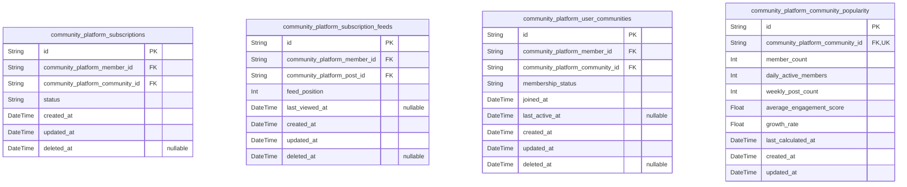

### `community_platform_subscriptions`

Tracks user subscriptions to communities for personalized content delivery.

Represents the direct relationship between users and communities they
follow. Each subscription enables users to receive content from
communities in their personalized feeds and participate in community
discussions.

Subscriptions can be active or inactive, allowing users to temporarily
pause following communities without losing their subscription history.
The system maintains subscription timestamps for engagement tracking and
feed personalization algorithms.

Soft deletion support enables subscription cancellation while preserving
historical data for analytics and user preference tracking.

Properties as follows:

- `id`: Primary Key.
- `community_platform_member_id`: Reference to the subscribed member. [community_platform_members.id](#community_platform_members)
- `community_platform_community_id`
  > Reference to the subscribed community. {@link
  > community_platform_communities.id}
- `status`
  > Subscription status indicating whether the subscription is active,
  > inactive, or pending. Valid values: active, inactive, pending.
- `created_at`: Timestamp when the subscription was initially created.
- `updated_at`: Timestamp when the subscription was last updated.
- `deleted_at`
  > Timestamp when the subscription was soft deleted, allowing for
  > subscription cancellation with data preservation.

### `community_platform_subscription_feeds`

Stores personalized feed content for subscribed users based on their
community subscriptions.

This entity represents the aggregated content that appears in a user's
personalized feed, combining posts from all their subscribed communities.
The feed is personalized based on user preferences, engagement patterns,
and community activity levels.

Feed items are generated through algorithms that consider content
relevance, timeliness, and user interaction history. The system maintains
feed state to provide consistent browsing experience across sessions.

This table supports efficient feed generation and pagination while
enabling personalized content discovery across multiple subscribed
communities.

Properties as follows:

- `id`: Primary Key.
- `community_platform_member_id`
  > Reference to the member whose feed is being personalized. {@link
  > community_platform_members.id}
- `community_platform_post_id`
  > Reference to the post included in the personalized feed. {@link
  > community_platform_posts.id}
- `feed_position`
  > Position of the content item within the user's personalized feed, used
  > for pagination and content ordering.
- `last_viewed_at`: Timestamp when the user last viewed this content item in their feed.
- `created_at`
  > Timestamp when this content item was added to the user's personalized
  > feed.
- `updated_at`
  > Timestamp when the feed item was last updated, such as when position
  > changes.
- `deleted_at`: Timestamp when the feed item was soft deleted, preserving historical data.

### `community_platform_user_communities`

Junction table managing the many-to-many relationship between users and
communities.

This entity serves as the central relationship manager connecting users
to the communities they participate in. It tracks membership status, join
dates, and participation levels across all user-community relationships.

The table supports community discovery by enabling queries for users
interested in specific communities and communities popular among specific
user segments. It also facilitates community growth analytics and user
engagement tracking.

Membership status management allows for different participation levels,
including active membership, pending approval, or restricted access based
on community rules.

Properties as follows:

- `id`: Primary Key.
- `community_platform_member_id`: Reference to the community member. [community_platform_members.id](#community_platform_members)
- `community_platform_community_id`: Reference to the community. [community_platform_communities.id](#community_platform_communities)
- `membership_status`
  > Status of the user's membership in the community. Valid values: active,
  > pending, restricted, banned.
- `joined_at`: Timestamp when the user joined or requested to join the community.
- `last_active_at`: Timestamp when the user was last active in the community.
- `created_at`: Timestamp when the user-community relationship was created.
- `updated_at`: Timestamp when the membership status was last updated.
- `deleted_at`: Timestamp when the membership relationship was soft deleted.

### `community_platform_community_popularity`

Tracks popularity metrics and engagement statistics for communities.

This entity aggregates community performance data including member count
growth, post activity levels, voting patterns, and overall engagement
metrics. It supports community discovery algorithms and trending
community identification.

Popularity scores are calculated based on recent activity, member growth
rates, and content quality indicators. The data enables personalized
community recommendations and helps identify emerging communities with
high engagement potential.

Regular updates ensure that popularity metrics reflect current community
activity patterns, supporting dynamic community ranking and discovery
features.

Properties as follows:

- `id`: Primary Key.
- `community_platform_community_id`
  > Reference to the community being tracked. {@link
  > community_platform_communities.id}
- `member_count`: Current number of active members in the community.
- `daily_active_members`: Number of members who were active in the community today.
- `weekly_post_count`: Number of posts created in the community during the current week.
- `average_engagement_score`: Calculated engagement score based on votes, comments, and member activity.
- `growth_rate`: Percentage growth in member count over the past 30 days.
- `last_calculated_at`: Timestamp when the popularity metrics were last calculated and updated.
- `created_at`: Timestamp when the popularity tracking record was created.
- `updated_at`: Timestamp when the popularity metrics were last updated.

## Notifications

```mermaid
erDiagram
"community_platform_notifications" {
  String id PK
  String notification_type
  String title
  String message
  String(80000) action_url "nullable"
  String priority
  String actor_type
  DateTime created_at
  DateTime updated_at
  DateTime deleted_at "nullable"
}
"community_platform_notifications_of_members" {
  String id PK
  String community_platform_notification_id FK
  String community_platform_member_id FK
  DateTime created_at
}
"community_platform_notifications_of_moderators" {
  String id PK
  String community_platform_notification_id FK
  String community_platform_moderator_id FK
  DateTime created_at
}
"community_platform_notifications_of_admins" {
  String id PK
  String community_platform_notification_id FK
  String community_platform_admin_id FK
  DateTime created_at
}
"community_platform_notification_preferences" {
  String id PK
  String community_platform_member_id FK "nullable"
  String community_platform_moderator_id FK "nullable"
  String community_platform_admin_id FK "nullable"
  String notification_type
  String delivery_channel
  Boolean enabled
  Int frequency_limit "nullable"
  String quiet_hours_start "nullable"
  String quiet_hours_end "nullable"
  DateTime created_at
  DateTime updated_at
  DateTime deleted_at "nullable"
}
"community_platform_notification_delivery" {
  String id PK
  String community_platform_notification_id FK
  String community_platform_member_id FK "nullable"
  String community_platform_moderator_id FK "nullable"
  String community_platform_admin_id FK "nullable"
  String delivery_channel
  String delivery_status
  Int delivery_attempts
  DateTime last_attempt_at "nullable"
  DateTime delivered_at "nullable"
  String failure_reason "nullable"
  DateTime created_at
  DateTime updated_at
}
"community_platform_notification_history" {
  String id PK
  String community_platform_notification_id FK
  String community_platform_member_id FK "nullable"
  String community_platform_moderator_id FK "nullable"
  String community_platform_admin_id FK "nullable"
  String interaction_type
  DateTime interaction_timestamp
  String device_type "nullable"
  String user_agent "nullable"
  String ip_address "nullable"
  String session_id "nullable"
  DateTime created_at
}
"community_platform_push_tokens" {
  String id PK
  String community_platform_member_id FK "nullable"
  String community_platform_moderator_id FK "nullable"
  String community_platform_admin_id FK "nullable"
  String platform
  String device_token UK
  String device_model "nullable"
  String app_version "nullable"
  String token_status
  DateTime last_used_at "nullable"
  DateTime expires_at "nullable"
  DateTime created_at
  DateTime updated_at
}
"community_platform_notifications_of_members" }o--|| "community_platform_notifications" : notification
"community_platform_notifications_of_moderators" }o--|| "community_platform_notifications" : notification
"community_platform_notifications_of_admins" }o--|| "community_platform_notifications" : notification
"community_platform_notification_delivery" }o--|| "community_platform_notifications" : notification
"community_platform_notification_history" }o--|| "community_platform_notifications" : notification
```

### `community_platform_notifications`

Main notification entity storing core notification information and metadata.

Represents notifications sent to users across the platform, including
content notifications, community updates, system alerts, and moderation
actions. Each notification contains the essential message content, type
classification, and target information.

Notifications can be targeted to specific users based on their roles
(member, moderator, admin) using the proper polymorphic ownership pattern
with dedicated subtype tables. The system maintains delivery status and
user interaction tracking for comprehensive notification management.

Notifications support various content types including text messages,
action links, and rich media attachments when applicable.

Properties as follows:

- `id`: Primary Key.
- `notification_type`
  > Type of notification being sent. Valid values include: content_reply,
  > mention, community_update, moderation_action, system_alert, etc.
- `title`: Notification title displayed to users.
- `message`: Full notification message content.
- `action_url`: Optional URL for notification action, directing users to relevant content.
- `priority`: Notification priority level: low, normal, high, critical.
- `actor_type`: Type of actor this notification targets: member, moderator, admin.
- `created_at`: Timestamp when notification was created.
- `updated_at`: Timestamp when notification was last updated.
- `deleted_at`: Timestamp when notification was soft deleted.

### `community_platform_notifications_of_members`

Links notifications to specific member users for targeted delivery.

Subtype entity implementing proper polymorphic ownership pattern for
notifications targeted to regular community members. Each record
represents a notification specifically intended for a member user,
establishing the many-to-many relationship between notifications and
member recipients.

This design replaces the problematic nullable foreign key pattern with a
clean, normalized approach that maintains referential integrity and
supports efficient querying of member-specific notifications.

Properties as follows:

- `id`: Primary Key.
- `community_platform_notification_id`: Target notification's [community_platform_notifications.id](#community_platform_notifications).
- `community_platform_member_id`: Target member's [community_platform_members.id](#community_platform_members).
- `created_at`: Timestamp when notification was linked to member.

### `community_platform_notifications_of_moderators`

Links notifications to specific moderator users for community management
alerts.

Subtype entity implementing proper polymorphic ownership pattern for
notifications targeted to community moderators. Each record represents a
notification specifically intended for a moderator user, establishing the
many-to-many relationship between notifications and moderator recipients.

This design replaces the problematic nullable foreign key pattern with a
clean, normalized approach that maintains referential integrity and
supports efficient querying of moderator-specific notifications.

Properties as follows:

- `id`: Primary Key.
- `community_platform_notification_id`: Target notification's [community_platform_notifications.id](#community_platform_notifications).
- `community_platform_moderator_id`: Target moderator's [community_platform_moderators.id](#community_platform_moderators).
- `created_at`: Timestamp when notification was linked to moderator.

### `community_platform_notifications_of_admins`

Links notifications to specific admin users for platform-wide system alerts.

Subtype entity implementing proper polymorphic ownership pattern for
notifications targeted to platform administrators. Each record represents
a notification specifically intended for an admin user, establishing the
many-to-many relationship between notifications and admin recipients.

This design replaces the problematic nullable foreign key pattern with a
clean, normalized approach that maintains referential integrity and
supports efficient querying of admin-specific notifications.

Properties as follows:

- `id`: Primary Key.
- `community_platform_notification_id`: Target notification's [community_platform_notifications.id](#community_platform_notifications).
- `community_platform_admin_id`: Target admin's [community_platform_admins.id](#community_platform_admins).
- `created_at`: Timestamp when notification was linked to admin.

### `community_platform_notification_preferences`

User notification preferences and delivery settings for personalized
notification management.

Stores individual user preferences for notification types, delivery
channels, and frequency settings. Each record represents a user's
customized notification settings across different notification categories
and delivery methods.

Supports granular control over notification types including content
replies, mentions, community updates, moderation actions, and system
alerts. Users can enable/disable specific notification types and choose
preferred delivery channels (in-app, email, push).

Properties as follows:

- `id`: Primary Key.
- `community_platform_member_id`: Target member's [community_platform_members.id](#community_platform_members).
- `community_platform_moderator_id`: Target moderator's [community_platform_moderators.id](#community_platform_moderators).
- `community_platform_admin_id`: Target admin's [community_platform_admins.id](#community_platform_admins).
- `notification_type`: Type of notification this preference applies to.
- `delivery_channel`: Preferred delivery channel: in_app, email, push, all.
- `enabled`: Whether this notification type is enabled for the user.
- `frequency_limit`
  > Maximum frequency limit for this notification type (notifications per
  > hour).
- `quiet_hours_start`: Start time for quiet hours (HH:MM format).
- `quiet_hours_end`: End time for quiet hours (HH:MM format).
- `created_at`: Timestamp when preference was created.
- `updated_at`: Timestamp when preference was last updated.
- `deleted_at`: Timestamp when preference was soft deleted.

### `community_platform_notification_delivery`

Tracks notification delivery attempts and status across different channels.

Monitors the delivery process for each notification across various
channels including in-app notifications, email delivery, and push
notifications. Each record represents a delivery attempt for a specific
notification to a specific user through a specific channel.

Tracks delivery status (pending, sent, delivered, failed), retry
attempts, and delivery timestamps. Provides comprehensive visibility into
notification delivery performance and helps identify delivery issues.

Properties as follows:

- `id`: Primary Key.
- `community_platform_notification_id`: Target notification's [community_platform_notifications.id](#community_platform_notifications).
- `community_platform_member_id`: Target member's [community_platform_members.id](#community_platform_members).
- `community_platform_moderator_id`: Target moderator's [community_platform_moderators.id](#community_platform_moderators).
- `community_platform_admin_id`: Target admin's [community_platform_admins.id](#community_platform_admins).
- `delivery_channel`: Channel used for delivery: in_app, email, push.
- `delivery_status`: Current delivery status: pending, sent, delivered, failed.
- `delivery_attempts`: Number of delivery attempts made.
- `last_attempt_at`: Timestamp of last delivery attempt.
- `delivered_at`: Timestamp when notification was successfully delivered.
- `failure_reason`: Reason for delivery failure if applicable.
- `created_at`: Timestamp when delivery record was created.
- `updated_at`: Timestamp when delivery record was last updated.

### `community_platform_notification_history`

Historical record of user interactions with notifications for audit and
analytics.

Tracks user actions on notifications including views, clicks, dismissals,
and other interactions. Each record represents a historical event in the
lifecycle of a notification from the user's perspective.

Provides comprehensive audit trail for notification engagement metrics,
user behavior analysis, and notification effectiveness measurement. Used
for optimizing notification strategies and understanding user engagement
patterns.

Properties as follows:

- `id`: Primary Key.
- `community_platform_notification_id`: Target notification's [community_platform_notifications.id](#community_platform_notifications).
- `community_platform_member_id`: Target member's [community_platform_members.id](#community_platform_members).
- `community_platform_moderator_id`: Target moderator's [community_platform_moderators.id](#community_platform_moderators).
- `community_platform_admin_id`: Target admin's [community_platform_admins.id](#community_platform_admins).
- `interaction_type`: Type of user interaction: view, click, dismiss, archive, etc.
- `interaction_timestamp`: Exact timestamp when interaction occurred.
- `device_type`: Type of device used for interaction: web, mobile_ios, mobile_android.
- `user_agent`: User agent string from the interaction request.
- `ip_address`: IP address from which interaction originated.
- `session_id`: Session identifier for the interaction.
- `created_at`: Timestamp when history record was created.

### `community_platform_push_tokens`

Stores push notification tokens for mobile device integration and delivery.

Manages push notification tokens for various mobile platforms (iOS,
Android) and devices. Each record represents a unique device token
registered for push notification delivery to a specific user.

Supports multiple tokens per user for different devices and platforms.
Tokens are validated and updated regularly to ensure delivery
reliability. Includes platform-specific information and token status
tracking.

Properties as follows:

- `id`: Primary Key.
- `community_platform_member_id`: Target member's [community_platform_members.id](#community_platform_members).
- `community_platform_moderator_id`: Target moderator's [community_platform_moderators.id](#community_platform_moderators).
- `community_platform_admin_id`: Target admin's [community_platform_admins.id](#community_platform_admins).
- `platform`: Mobile platform: ios, android.
- `device_token`: Unique push notification token for the device.
- `device_model`: Device model information.
- `app_version`: Version of the mobile application.
- `token_status`: Current token status: active, expired, invalid.
- `last_used_at`: Timestamp when token was last used successfully.
- `expires_at`: Timestamp when token expires.
- `created_at`: Timestamp when token was registered.
- `updated_at`: Timestamp when token was last updated.

## Media

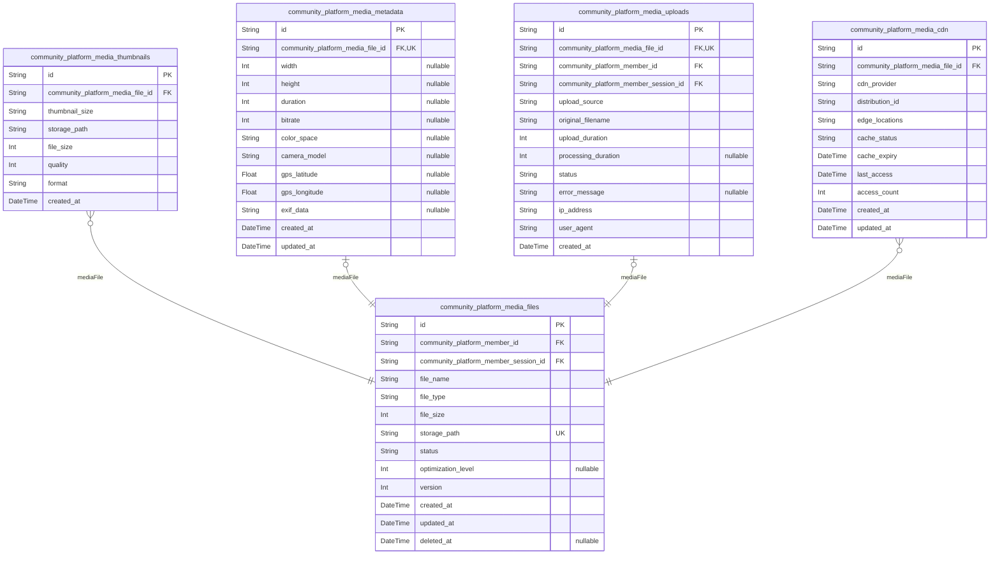

### `community_platform_media_files`

Core media file storage and management with enhanced normalization.

Stores uploaded media files including images, videos, and documents with
their original formats and processing status. Each file is associated
with an uploader and maintains processing workflow state through
standardized status fields.

Enhanced to remove redundant file_size storage and improve relationship
integrity. Files support multiple thumbnail versions and metadata
attachments with proper foreign key constraints.

The system tracks file lifecycle from upload through optimization and CDN
distribution with comprehensive audit trails.

Properties as follows:

- `id`: Primary Key.
- `community_platform_member_id`: Uploading member's identifier. [community_platform_members.id](#community_platform_members)
- `community_platform_member_session_id`: Session during upload. [community_platform_member_sessions.id](#community_platform_member_sessions)
- `file_name`: Original filename as uploaded by user.
- `file_type`: MIME type of the uploaded file.
- `file_size`: File size in bytes after processing.
- `storage_path`: Path to file in cloud storage.
- `status`: Processing status: uploaded, processing, optimized, failed.
- `optimization_level`: Compression/optimization level applied (1-100).
- `version`: File version for revision tracking.
- `created_at`: File creation timestamp.
- `updated_at`: Last modification timestamp.
- `deleted_at`: Soft deletion timestamp.

### `community_platform_media_thumbnails`

Generated thumbnail versions for media files with enhanced indexing.

Stores multiple thumbnail sizes and formats generated from original media
files for optimized display across different devices and contexts. Each
thumbnail is linked to a parent media file and maintains its own
optimization metadata.

Enhanced with better indexing for thumbnail size queries and performance
optimization. Supports responsive design by providing appropriate image
sizes for various screen resolutions and bandwidth conditions.

Properties as follows:

- `id`: Primary Key.
- `community_platform_media_file_id`: Parent media file identifier. [community_platform_media_files.id](#community_platform_media_files)
- `thumbnail_size`: Thumbnail dimensions (e.g., 150x150, 300x300).
- `storage_path`: Path to thumbnail in cloud storage.
- `file_size`: Thumbnail file size in bytes.
- `quality`: Image quality percentage (1-100).
- `format`: Thumbnail format (JPEG, PNG, WebP).
- `created_at`: Thumbnail generation timestamp.

### `community_platform_media_metadata`

Technical metadata and EXIF information for media files with JSON support.

Stores detailed technical information extracted from media files
including image dimensions, camera settings, GPS coordinates, and other
EXIF data. Enhanced with JSON type for exif_data to enable advanced query
capabilities.

This metadata supports advanced search, filtering, and content analysis
capabilities. Maintains relationship with parent media file while
allowing independent metadata updates and queries with optimized
indexing.

Properties as follows:

- `id`: Primary Key.
- `community_platform_media_file_id`: Parent media file identifier. [community_platform_media_files.id](#community_platform_media_files)
- `width`: Image/video width in pixels.
- `height`: Image/video height in pixels.
- `duration`: Video/audio duration in seconds.
- `bitrate`: Media bitrate in kbps.
- `color_space`: Color space information.
- `camera_model`: Camera model from EXIF data.
- `gps_latitude`: GPS latitude coordinates.
- `gps_longitude`: GPS longitude coordinates.
- `exif_data`: Raw EXIF metadata in JSON format.
- `created_at`: Metadata extraction timestamp.
- `updated_at`: Last metadata update timestamp.

### `community_platform_media_uploads`

Historical record of media upload attempts and processing with proper
constraints.

Tracks the complete lifecycle of media uploads from initial attempt
through processing completion. Enhanced with non-nullable foreign key and
standardized status values for consistent tracking.

Captures upload source information, processing errors, and final outcomes
for audit and analytics purposes. Supports retry mechanisms and provides
visibility into upload performance and success rates with improved
indexing.

Properties as follows:

- `id`: Primary Key.
- `community_platform_media_file_id`: Resulting media file identifier. [community_platform_media_files.id](#community_platform_media_files)
- `community_platform_member_id`: Uploading member's identifier. [community_platform_members.id](#community_platform_members)
- `community_platform_member_session_id`: Session during upload. [community_platform_member_sessions.id](#community_platform_member_sessions)
- `upload_source`: Upload source (web, mobile, api).
- `original_filename`: Original filename before processing.
- `upload_duration`: Upload duration in milliseconds.
- `processing_duration`: Processing duration in milliseconds.
- `status`: Final upload status: completed, failed, cancelled.
- `error_message`: Error details if upload failed.
- `ip_address`: Uploader's IP address.
- `user_agent`: Upload client user agent.
- `created_at`: Upload initiation timestamp.

### `community_platform_media_cdn`

Content Delivery Network distribution tracking for media files with
enhanced cache management.

Manages CDN distribution of media files across global edge locations.
Enhanced with better indexing for cache management queries and
performance optimization. Tracks file replication status, cache
expiration, and delivery performance metrics.

Supports efficient content distribution and cache invalidation workflows.
Integrates with multiple CDN providers and maintains distribution
consistency across the platform with comprehensive access tracking.

Properties as follows:

- `id`: Primary Key.
- `community_platform_media_file_id`: Media file identifier. [community_platform_media_files.id](#community_platform_media_files)
- `cdn_provider`: CDN provider name (Cloudflare, AWS CloudFront, etc.).
- `distribution_id`: CDN distribution identifier.
- `edge_locations`: Comma-separated list of edge locations.
- `cache_status`: Current cache status: pending, cached, expired.
- `cache_expiry`: Cache expiration timestamp.
- `last_access`: Last CDN access timestamp.
- `access_count`: Total CDN access count.
- `created_at`: CDN distribution creation timestamp.
- `updated_at`: Last distribution update timestamp.

## default

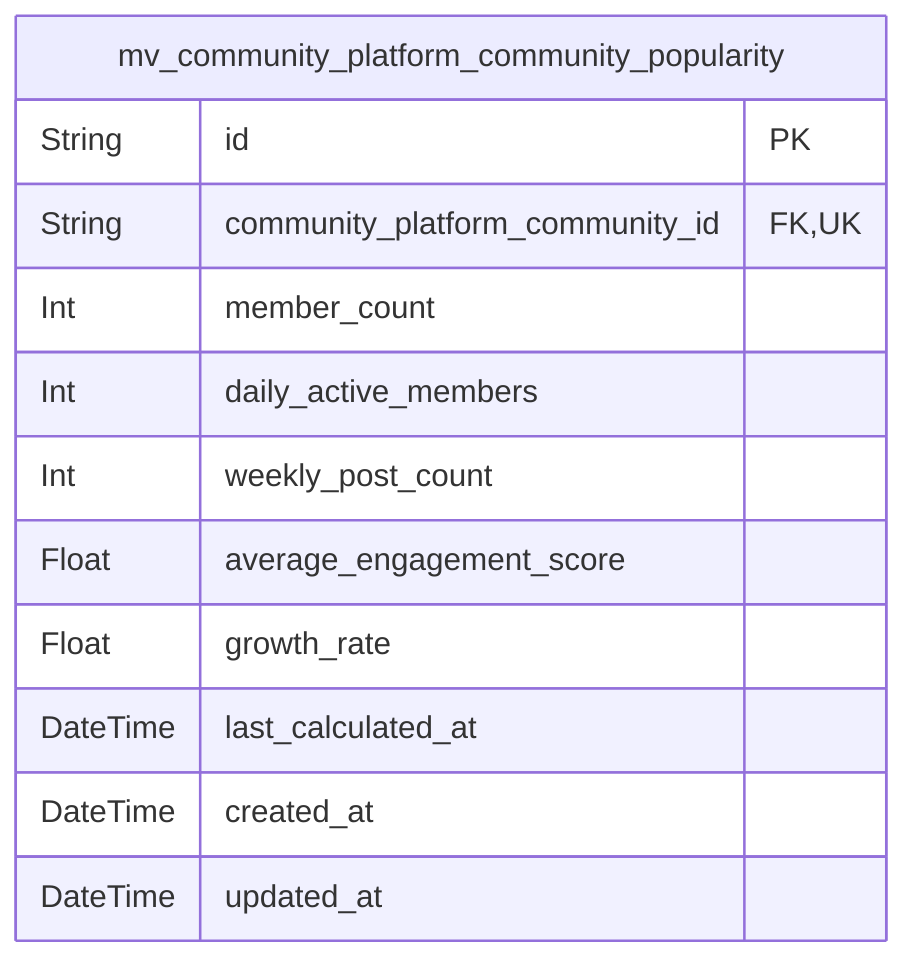

### `mv_community_platform_community_popularity`

Materialized view aggregating popularity metrics and engagement
statistics for communities.

This view calculates community performance data including member count
growth, post activity levels, voting patterns, and overall engagement
metrics. It supports community discovery algorithms and trending
community identification.

Popularity scores are calculated based on recent activity, member growth
rates, and content quality indicators. The data enables personalized
community recommendations and helps identify emerging communities with
high engagement potential.

Regular refresh ensures that popularity metrics reflect current community
activity patterns, supporting dynamic community ranking and discovery
features.

Properties as follows:

- `id`: Primary Key.
- `community_platform_community_id`
  > Reference to the community being tracked. {@link
  > community_platform_communities.id}
- `member_count`: Current number of active members in the community.
- `daily_active_members`: Number of members who were active in the community today.
- `weekly_post_count`: Number of posts created in the community during the current week.
- `average_engagement_score`: Calculated engagement score based on votes, comments, and member activity.
- `growth_rate`: Percentage growth in member count over the past 30 days.
- `last_calculated_at`: Timestamp when the popularity metrics were last calculated and updated.
- `created_at`: Timestamp when the popularity tracking record was created.
- `updated_at`: Timestamp when the popularity metrics were last updated.
