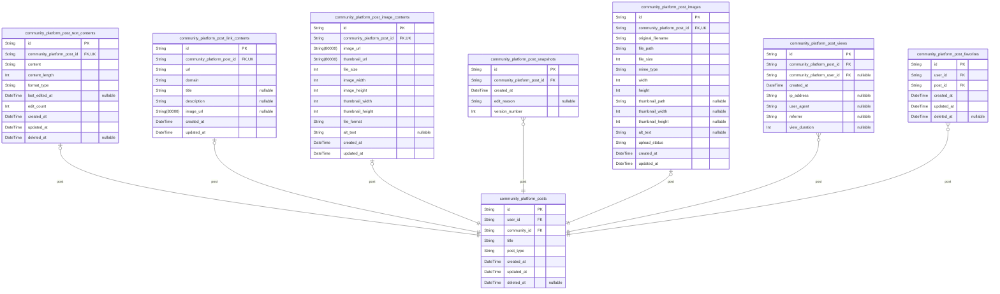
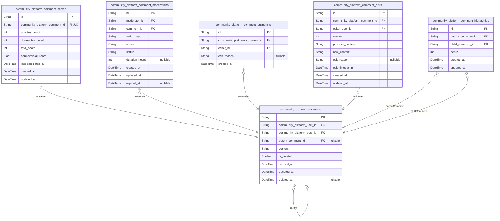
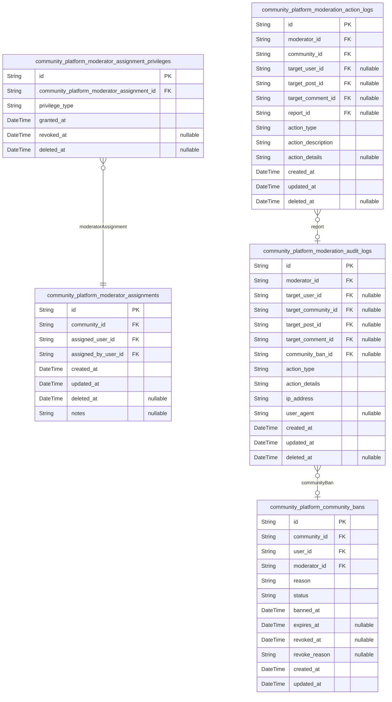

# Prisma Markdown

> Generated by [`prisma-markdown`](https://github.com/samchon/prisma-markdown)

- [Actors](#actors)
- [Systematic](#systematic)
- [Communities](#communities)
- [Posts](#posts)
- [Comments](#comments)
- [Voting](#voting)
- [Moderation](#moderation)

## Actors

```mermaid
erDiagram
"community_platform_users" {
  String id PK
  String email UK
  String password_hash
  String username UK
  String display_name "nullable"
  String bio "nullable"
  String(80000) avatar_url "nullable"
  Int karma
  Boolean email_verified
  DateTime created_at
  DateTime updated_at
  DateTime deleted_at "nullable"
}
"community_platform_user_sessions" {
  String id PK
  String community_platform_user_id FK
  String access_token UK
  String refresh_token UK
  String ip
  String href
  String referrer "nullable"
  String user_agent
  DateTime created_at
  DateTime expired_at
}
"community_platform_user_password_resets" {
  String id PK
  String community_platform_user_id FK
  String token UK
  DateTime expires_at
  DateTime used_at "nullable"
  DateTime created_at
  DateTime updated_at
}
"community_platform_user_email_verifications" {
  String id PK
  String community_platform_user_id FK
  String token UK
  DateTime expires_at
  DateTime verified_at "nullable"
  DateTime created_at
  DateTime updated_at
}
"community_platform_moderators" {
  String id PK
  String email UK
  String password_hash
  String username UK
  String display_name
  String bio "nullable"
  String(80000) avatar_url "nullable"
  Boolean is_active
  String permission_level
  DateTime last_login_at "nullable"
  DateTime created_at
  DateTime updated_at
  DateTime deleted_at "nullable"
}
"community_platform_moderator_sessions" {
  String id PK
  String community_platform_moderator_id FK
  String ip
  String href
  String referrer
  DateTime created_at
  DateTime expired_at
}
"community_platform_moderator_password_resets" {
  String id PK
  String community_platform_moderator_id FK
  String token UK
  DateTime expired_at
  DateTime used_at "nullable"
  DateTime created_at
  DateTime updated_at
}
"community_platform_moderator_email_verifications" {
  String id PK
  String community_platform_moderator_id FK
  String token UK
  DateTime expires_at
  DateTime verified_at "nullable"
  DateTime created_at
  DateTime updated_at
}
"community_platform_admins" {
  String id PK
  String email UK
  String password_hash
  String display_name
  String permissions_level
  Boolean is_active
  DateTime last_login_at "nullable"
  DateTime created_at
  DateTime updated_at
  DateTime deleted_at "nullable"
}
"community_platform_admin_sessions" {
  String id PK
  String community_platform_admin_id FK
  String access_token UK
  String refresh_token UK
  String ip
  String user_agent
  DateTime created_at
  DateTime expired_at
}
"community_platform_admin_password_resets" {
  String id PK
  String community_platform_admin_id FK
  String reset_token UK
  DateTime expires_at
  DateTime used_at "nullable"
  DateTime created_at
  DateTime updated_at
}
"community_platform_admin_email_verifications" {
  String id PK
  String community_platform_admin_id FK
  String token UK
  String email
  DateTime expires_at
  DateTime verified_at "nullable"
  DateTime created_at
  DateTime updated_at
}
"community_platform_user_sessions" }o--|| "community_platform_users" : user
"community_platform_user_password_resets" }o--|| "community_platform_users" : user
"community_platform_user_email_verifications" }o--|| "community_platform_users" : user
"community_platform_moderator_sessions" }o--|| "community_platform_moderators" : moderator
"community_platform_moderator_password_resets" }o--|| "community_platform_moderators" : moderator
"community_platform_moderator_email_verifications" }o--|| "community_platform_moderators" : moderator
"community_platform_admin_sessions" }o--|| "community_platform_admins" : admin
"community_platform_admin_password_resets" }o--|| "community_platform_admins" : admin
"community_platform_admin_email_verifications" }o--|| "community_platform_admins" : admin
```

### `community_platform_users`

Registered user accounts with email and password authentication
credentials, supporting profile management and karma tracking.

This table stores the core identity information for platform users,
including authentication credentials, profile data, and karma scores.
Users authenticate with email and password, and maintain a unique
username for public identification. Profile information includes display
name, biography text, and avatar image URL. The karma score represents
the user's reputation based on voting activity across their posts and
comments.

Each user account supports the full range of platform activities
including community creation, content posting, voting, and commenting.
Account deletion is supported through soft deletion, preserving
referential integrity while removing user content from public view.

Properties as follows:

- `id`: Primary Key.
- `email`: User's email address used for authentication and communication.
- `password_hash`: Hashed password for user authentication security.
- `username`: Unique username chosen by the user for public identification.
- `display_name`: User's preferred display name shown on their profile and posts.
- `bio`: User biography text providing personal introduction and interests.
- `avatar_url`: URL to the user's avatar image for profile representation.
- `karma`: User's reputation score calculated from post and comment voting activity.
- `email_verified`: Indicates whether the user's email address has been verified.
- `created_at`: Timestamp when the user account was created.
- `updated_at`: Timestamp when the user account was last updated.
- `deleted_at`: Timestamp when the user account was soft deleted.

### `community_platform_user_sessions`

JWT session tokens for user authentication with access and refresh token
management.

Tracks active user sessions with connection metadata for security
auditing. Each session represents a distinct login event with associated
JWT tokens for API authentication. Sessions expire based on configured
token lifetimes and can be revoked for security purposes.

Sessions are managed through authentication flows rather than direct user
CRUD operations. Each session belongs to exactly one user actor and
contains the necessary context for API access control and security
monitoring. [community_platform_users.id](#community_platform_users)

Properties as follows:

- `id`: Primary Key.
- `community_platform_user_id`: Belonged user's [community_platform_users.id](#community_platform_users).
- `access_token`: JWT access token for API authentication with short expiration period.
- `refresh_token`: JWT refresh token for obtaining new access tokens with longer expiration.
- `ip`: Client IP address for security auditing and geographic tracking.
- `href`: Full URL of the page where the session was created for context tracking.
- `referrer`: HTTP referrer header value for traffic source analysis.
- `user_agent`: Client browser or application user agent string for device identification.
- `created_at`: Timestamp when the session was created and tokens were issued.
- `expired_at`: Timestamp when the session expires and tokens become invalid.

### `community_platform_user_password_resets`

Password reset tokens for user account recovery with 1-hour expiration
period.

Stores temporary tokens that allow users to reset their passwords
securely. Each token is valid for exactly one hour from creation and can
only be used once. Tokens are generated when users request password reset
and are invalidated after successful password change or expiration.

This table supports the password recovery workflow by providing secure
token management with expiration tracking and usage validation. {@link
community_platform_users.id}

Properties as follows:

- `id`: Primary Key.
- `community_platform_user_id`
  > Reference to the user requesting password reset. {@link
  > community_platform_users.id}
- `token`: Secure password reset token generated for user verification.
- `expires_at`: Timestamp when the password reset token expires (1 hour from creation).
- `used_at`: Timestamp when the token was successfully used for password reset.
- `created_at`: Timestamp when the password reset token was created.
- `updated_at`: Timestamp when the token record was last updated.

### `community_platform_user_email_verifications`

Stores email verification tokens for user account registration
confirmation with expiration tracking.

This table manages the email verification process during user
registration. Each record contains a unique verification token that is
sent to the user's email address for account confirmation. The token has
a limited validity period to ensure security, and the verification status
is tracked to prevent reuse.

The verification process involves generating a unique token, sending it
via email, and marking it as verified once the user clicks the
verification link. Expired tokens are automatically cleaned up to
maintain database efficiency and security.

This table supports the user authentication workflow by ensuring that
only verified email addresses can be used for account registration,
preventing spam and ensuring account ownership validation.

[community_platform_users.id](#community_platform_users)

Properties as follows:

- `id`: Primary Key.
- `community_platform_user_id`
  > Reference to the user account requiring email verification. {@link
  > community_platform_users.id}
- `token`
  > Unique verification token sent to the user's email address for account
  > confirmation.
- `expires_at`: Timestamp when the verification token expires and becomes invalid.
- `verified_at`
  > Timestamp when the email was successfully verified, null if not yet
  > verified.
- `created_at`: Timestamp when the verification token was created.
- `updated_at`: Timestamp when the verification record was last updated.

### `community_platform_moderators`

Community moderator accounts with authentication credentials, profile
information, and moderation permissions tracking.

Moderators are community members with elevated permissions to manage
content, ban users, and handle reports within their assigned communities.
This table stores their authentication credentials, profile data, and
tracks their moderation capabilities and status.

Moderators authenticate using email and password, and their sessions are
managed through [community_platform_moderator_sessions](#community_platform_moderator_sessions). Password
recovery and email verification are handled through dedicated support
tables.

Properties as follows:

- `id`: Primary Key.
- `email`: Email address used for authentication and communication.
- `password_hash`: Hashed password for secure authentication.
- `username`: Unique username identifier for the moderator.
- `display_name`: Public display name shown to other users.
- `bio`: Biographical information or description provided by the moderator.
- `avatar_url`: URL to the moderator's avatar image.
- `is_active`
  > Whether the moderator account is currently active and can perform
  > moderation actions.
- `permission_level`: Permission level indicating the scope of moderation capabilities.
- `last_login_at`: Timestamp of the most recent successful login.
- `created_at`: Timestamp when the moderator account was created.
- `updated_at`: Timestamp when the moderator account was last updated.
- `deleted_at`: Timestamp when the moderator account was soft-deleted.

### `community_platform_moderator_sessions`

JWT session tokens for moderator authentication with access and refresh
token management.

Tracks active moderator sessions with connection metadata, IP addresses,
and expiration timestamps for secure session management. Each session
belongs to exactly one moderator and provides authentication context for
moderator actions across the platform.

[community_platform_moderators.id](#community_platform_moderators)

Properties as follows:

- `id`: Primary Key.
- `community_platform_moderator_id`: Belonged moderator's [community_platform_moderators.id](#community_platform_moderators).
- `ip`: IP address of the moderator's connection for security tracking.
- `href`: Current page URL where the session was created for context tracking.
- `referrer`: HTTP referrer header value for session origin tracking.
- `created_at`: Timestamp when the session was created.
- `expired_at`: Timestamp when the session expires for security management.

### `community_platform_moderator_password_resets`

Password reset tokens for moderator accounts with 1-hour expiration period.

Stores temporary tokens that allow moderators to reset their passwords
securely. Each token is valid for exactly one hour from creation and can
only be used once. Tokens are automatically invalidated after use or
expiration.

This table supports the password recovery workflow for moderators,
ensuring secure authentication while maintaining account security. Tokens
are generated when a moderator requests password reset and are verified
during the reset process. [community_platform_moderators.id](#community_platform_moderators)

Properties as follows:

- `id`: Primary Key.
- `community_platform_moderator_id`
  > Reference to the moderator account requesting password reset. {@link
  > community_platform_moderators.id}
- `token`
  > Unique password reset token generated for the moderator. Used to verify
  > the password reset request.
- `expired_at`
  > Timestamp when the password reset token expires. Tokens are valid for 1
  > hour from creation.
- `used_at`
  > Timestamp when the password reset token was successfully used. Null
  > indicates the token is still valid.
- `created_at`: Timestamp when the password reset token was created.
- `updated_at`: Timestamp when the password reset token record was last updated.

### `community_platform_moderator_email_verifications`

Email verification tokens for moderator account registration confirmation.

This table stores verification tokens sent to moderator email addresses
during account registration. Each token has a limited validity period and
is used to confirm the moderator's email ownership before allowing full
account activation. Tokens are generated during registration and consumed
when the moderator clicks the verification link.

Tokens are associated with specific moderator accounts through the
moderator foreign key. Once verified, the token is marked as used to
prevent reuse. This table supports the moderator authentication workflow
and ensures email verification integrity.

[community_platform_moderators.id](#community_platform_moderators)

Properties as follows:

- `id`: Primary Key.
- `community_platform_moderator_id`
  > Moderator account requiring email verification. {@link
  > community_platform_moderators.id}
- `token`
  > Unique verification token sent to the moderator's email address for
  > account confirmation.
- `expires_at`: Timestamp when the verification token expires and becomes invalid.
- `verified_at`
  > Timestamp when the token was successfully verified, null if not yet
  > verified.
- `created_at`: Timestamp when the verification token was created.
- `updated_at`: Timestamp when the verification token was last updated.

### `community_platform_admins`

Platform administrator accounts with system-wide authentication
credentials and admin permissions.

Stores administrator identity information including email authentication
credentials and permission tracking. Administrators have elevated
system-wide permissions for platform management, user moderation, and
system configuration.

This table serves as the canonical identity record for administrator
actors, with authentication flows managed through separate session and
verification tables. [community_platform_admin_sessions](#community_platform_admin_sessions) handles
JWT session management, [community_platform_admin_password_resets](#community_platform_admin_password_resets)
manages password recovery tokens, and {@link
community_platform_admin_email_verifications} handles email verification
workflows.

Properties as follows:

- `id`: Primary Key.
- `email`: Administrator email address used for authentication and communication.
- `password_hash`: Hashed password for administrator authentication security.
- `display_name`: Public display name shown to users for administrator identification.
- `permissions_level`
  > Administrator permission level defining system access scope and
  > capabilities.
- `is_active`
  > Indicates whether the administrator account is currently active and
  > enabled.
- `last_login_at`: Timestamp of the administrator's most recent successful login.
- `created_at`: Timestamp when the administrator account was created.
- `updated_at`: Timestamp when the administrator account was last updated.
- `deleted_at`: Timestamp when the administrator account was soft-deleted, null if active.

### `community_platform_admin_sessions`

JWT session tokens for administrator authentication with access and
refresh token management.

Stores active administrator sessions with JWT tokens, expiration
timestamps, and connection information for session lifecycle management.
Each session belongs to exactly one administrator and tracks
authentication state for secure platform access.

Sessions are managed through authentication flows and provide the
foundation for administrator access control across the platform. {@link
community_platform_admins.id}

Properties as follows:

- `id`: Primary Key.
- `community_platform_admin_id`: Administrator who owns this session. [community_platform_admins.id](#community_platform_admins)
- `access_token`: JWT access token for API authentication and authorization.
- `refresh_token`: JWT refresh token for session renewal without re-authentication.
- `ip`: IP address of the client connection for security auditing.
- `user_agent`: HTTP User-Agent header for client device identification.
- `created_at`: Timestamp when the session was created.
- `expired_at`: Timestamp when the session expires and requires renewal.

### `community_platform_admin_password_resets`

Stores password reset tokens for administrator accounts with 1-hour
expiration periods.

This table supports the password recovery flow for platform
administrators. Each token is generated when an admin requests a password
reset and expires after 1 hour for security purposes. The tokens are
single-use and become invalid after successful password change or
expiration.

Tokens reference the [community_platform_admins.id](#community_platform_admins) they belong to
and include timestamp tracking for expiration management.

Properties as follows:

- `id`: Primary Key.
- `community_platform_admin_id`
  > Reference to the administrator account requesting password reset. {@link
  > community_platform_admins.id}
- `reset_token`: Unique password reset token generated for the administrator account.
- `expires_at`: Timestamp when the password reset token expires (1 hour from creation).
- `used_at`
  > Timestamp when the password reset token was successfully used to change
  > password.
- `created_at`: Timestamp when the password reset token was created.
- `updated_at`: Timestamp when the password reset token record was last updated.

### `community_platform_admin_email_verifications`

Email verification tokens for administrator account registration
confirmation.

Stores verification tokens sent to administrator email addresses during
account registration or email change processes. Each token has a limited
validity period and can only be used once for verification.

This table supports the email verification workflow by providing secure
token storage with expiration tracking and verification status
management. Tokens are generated when administrators register new
accounts or change their email addresses, and are invalidated after
successful verification or expiration.

Properties as follows:

- `id`: Primary Key.
- `community_platform_admin_id`
  > Administrator account requiring email verification. {@link
  > community_platform_admins.id}
- `token`: Unique verification token sent to the administrator's email address.
- `email`: Email address being verified for the administrator account.
- `expires_at`: Timestamp when the verification token expires and becomes invalid.
- `verified_at`: Timestamp when the email verification was successfully completed.
- `created_at`: Timestamp when the verification token was created.
- `updated_at`: Timestamp when the verification record was last updated.

## Systematic

```mermaid
erDiagram
"community_platform_configurations" {
  String id PK
  String config_key UK
  String config_value
  String data_type
  String scope
  String description
  Boolean is_active
  DateTime created_at
  DateTime updated_at
  DateTime deleted_at "nullable"
}
"community_platform_audit_logs" {
  String id PK
  String community_id FK "nullable"
  String post_id FK "nullable"
  String comment_id FK "nullable"
  String actor_type
  String actor_id
  String action_type
  String action_details "nullable"
  String ip_address
  String user_agent "nullable"
  Boolean success
  String error_message "nullable"
  DateTime created_at
  DateTime updated_at
}
"community_platform_report_categories" {
  String id PK
  String name UK
  String display_name
  String description
  String severity_level
  String moderation_guidelines
  Boolean is_active
  DateTime created_at
  DateTime updated_at
  DateTime deleted_at "nullable"
}
"community_platform_system_snapshots" {
  String id PK
  DateTime created_at UK
  DateTime updated_at
  DateTime deleted_at "nullable"
  Int total_users
  Int active_users_24h
  Int active_users_7d
  Int active_users_30d
  Int total_communities
  Int active_communities
  Int total_posts
  Int posts_24h
  Int posts_7d
  Int total_comments
  Int comments_24h
  Int comments_7d
  Int total_votes
  Int votes_24h
  Int votes_7d
  Int total_subscriptions
  Int new_subscriptions_24h
  Float avg_posts_per_user
  Float avg_comments_per_user
  Float avg_votes_per_user
  Float user_growth_rate
  Float content_growth_rate
  Float engagement_rate
  Int peak_concurrent_users
  Float avg_session_duration
  Float bounce_rate
  Float retention_rate_7d
  Float retention_rate_30d
  Int moderation_actions_24h
  Int reports_resolved_24h
  Float system_uptime_percentage
  Float avg_response_time
  Float error_rate
  String snapshot_period
  String snapshot_notes "nullable"
}
"community_platform_feature_flags" {
  String id PK
  String name UK
  String description
  String flag_type
  String status
  Boolean boolean_value "nullable"
  Int percentage_value "nullable"
  DateTime rollout_started_at "nullable"
  DateTime rollout_completed_at "nullable"
  DateTime created_at
  DateTime updated_at
  DateTime deleted_at "nullable"
}
"community_platform_api_rate_limits" {
  String id PK
  String endpoint_path
  String http_method
  Int max_requests
  Int time_window_seconds
  Int current_usage
  DateTime window_start_time
  DateTime window_end_time
  Boolean is_active
  String description "nullable"
  DateTime created_at
  DateTime updated_at
}
"community_platform_system_alerts" {
  String id PK
  String alert_type
  String severity
  String status
  String title
  String description
  String source_component
  DateTime acknowledged_at "nullable"
  DateTime resolved_at "nullable"
  String resolution_notes "nullable"
  DateTime created_at
  DateTime updated_at
}
"community_platform_maintenance_windows" {
  String id PK
  String title
  String description
  String maintenance_type
  DateTime scheduled_start
  DateTime scheduled_end
  DateTime actual_start "nullable"
  DateTime actual_end "nullable"
  String status
  String notification_message
  DateTime notification_sent_at "nullable"
  String impact_level
  String affected_services
  DateTime created_at
  DateTime updated_at
  DateTime deleted_at "nullable"
}
"community_platform_error_logs" {
  String id PK
  String error_code
  String error_message
  String severity
  String source_component
  String stack_trace "nullable"
  String request_id "nullable"
  String user_agent "nullable"
  String ip_address "nullable"
  Int http_status "nullable"
  String error_context "nullable"
  DateTime resolved_at "nullable"
  String resolution_status
  String resolution_notes "nullable"
  DateTime occurred_at
  DateTime created_at
  DateTime updated_at
}
"community_platform_auth_tokens" {
  String id PK
  String token_type
  String token_value UK
  DateTime created_at
  DateTime updated_at
  DateTime deleted_at "nullable"
  DateTime expires_at
  DateTime used_at "nullable"
  String ip_address "nullable"
  String user_agent "nullable"
}
"community_platform_user_activities" {
  String id PK
  String user_id FK
  String post_id FK "nullable"
  String comment_id FK "nullable"
  String activity_type
  String activity_details "nullable"
  String ip_address "nullable"
  String user_agent "nullable"
  Boolean login_success "nullable"
  Boolean content_created "nullable"
  Int engagement_score "nullable"
  DateTime created_at
  DateTime updated_at
}
"community_platform_system_notifications" {
  String id PK
  String related_community_id FK "nullable"
  String related_post_id FK "nullable"
  String related_comment_id FK "nullable"
  String notification_type
  String title
  String message
  String priority
  String status
  Boolean is_broadcast
  String(80000) action_url "nullable"
  DateTime created_at
  DateTime processed_at "nullable"
}
"community_platform_moderation_queues" {
  String id PK
  String community_platform_moderator_id FK "nullable"
  String community_platform_post_id FK "nullable"
  String community_platform_comment_id FK "nullable"
  String status
  String priority
  DateTime assigned_at "nullable"
  DateTime review_started_at "nullable"
  DateTime resolved_at "nullable"
  String resolution "nullable"
  String resolution_reason "nullable"
  DateTime created_at
  DateTime updated_at
}
"community_platform_audit_log_of_users" {
  String id PK
  String community_platform_audit_log_id FK,UK
  String community_platform_user_id FK
  DateTime created_at
  DateTime updated_at
  DateTime deleted_at "nullable"
}
"community_platform_audit_log_of_moderators" {
  String id PK
  String community_platform_audit_log_id FK,UK
  DateTime created_at
  DateTime updated_at
  DateTime deleted_at "nullable"
}
"community_platform_audit_log_of_admins" {
  String id PK
  String community_platform_audit_log_id FK,UK
  String community_platform_admin_id FK,UK
}
"community_platform_feature_flag_targeting_rules" {
  String id PK
  String community_platform_feature_flag_id FK
  String rule_key
  String rule_value
  String rule_operator
  String description "nullable"
  Boolean is_active
  Int priority
  DateTime created_at
  DateTime updated_at
  DateTime deleted_at "nullable"
}
"community_platform_feature_flag_environments" {
  String id PK
  String feature_flag_id FK,UK
  Boolean is_enabled
  Int rollout_percentage "nullable"
  DateTime created_at
  DateTime updated_at
  DateTime deleted_at "nullable"
}
"community_platform_auth_token_of_users" {
  String id PK
  String community_platform_auth_token_id FK,UK
  String community_platform_user_id FK,UK
}
"community_platform_auth_token_of_moderators" {
  String id PK
  String auth_token_id FK,UK
  String moderator_id FK
  DateTime created_at
  DateTime updated_at
}
"community_platform_auth_token_of_admins" {
  String id PK
  String community_platform_auth_token_id FK,UK
  String community_platform_admin_id FK
  DateTime created_at
  DateTime updated_at
}
"community_platform_system_notification_of_users" {
  String id PK
  String community_platform_system_notification_id FK,UK
  String community_platform_user_id FK
  DateTime delivered_at
  DateTime read_at "nullable"
  DateTime dismissed_at "nullable"
  Int interaction_count
  String delivery_status
  DateTime created_at
  DateTime updated_at
}
"community_platform_system_notification_of_moderators" {
  String id PK
  String community_platform_moderator_id FK
  String community_platform_system_notification_id FK,UK
  Boolean is_read
  DateTime delivered_at
  DateTime read_at "nullable"
  DateTime dismissed_at "nullable"
  String moderation_context "nullable"
}
"community_platform_system_notification_of_admins" {
  String id PK
  String community_platform_system_notification_id FK
  String community_platform_admin_id FK
  DateTime delivered_at
  DateTime read_at "nullable"
  DateTime acknowledged_at "nullable"
  String delivery_status
  DateTime created_at
  DateTime updated_at
}
"community_platform_system_notification_broadcast_deliveries" {
  String id PK
  String system_notification_id FK
  String delivery_status
  Int total_recipients
  Int delivered_count
  Int failed_count
  DateTime scheduled_at "nullable"
  DateTime started_at "nullable"
  DateTime completed_at "nullable"
  String error_message "nullable"
  DateTime created_at
  DateTime updated_at
}
"community_platform_feature_flag_environment_details" {
  String id PK
  String community_platform_feature_flag_id FK
  String community_platform_feature_flag_environment_id FK
  DateTime created_at
  DateTime updated_at
}
"community_platform_feature_flag_environment_targeting_rules" {
  String id PK
  String community_platform_feature_flag_environment_id FK
  String rule_key
  String rule_value
  DateTime created_at
  DateTime updated_at
  DateTime deleted_at "nullable"
}
"community_platform_feature_flag_environment_detail_targeting_rules" {
  String id PK
  String community_platform_feature_flag_environment_detail_id FK
  String rule_key
  String rule_value
  String rule_operator
  Int rule_order
  Boolean is_active
  DateTime created_at
  DateTime updated_at
  DateTime deleted_at "nullable"
}
"community_platform_feature_flag_environment_detail_configuration_overrides" {
  String id PK
  String community_platform_feature_flag_environment_detail_id FK
  String config_key
  String config_value
  DateTime created_at
  DateTime updated_at
  DateTime deleted_at "nullable"
}
"community_platform_audit_log_of_users" |o--|| "community_platform_audit_logs" : auditLog
"community_platform_audit_log_of_moderators" |o--|| "community_platform_audit_logs" : auditLog
"community_platform_audit_log_of_admins" |o--|| "community_platform_audit_logs" : auditLog
"community_platform_feature_flag_targeting_rules" }o--|| "community_platform_feature_flags" : featureFlag
"community_platform_feature_flag_environments" |o--|| "community_platform_feature_flags" : featureFlag
"community_platform_auth_token_of_users" |o--|| "community_platform_auth_tokens" : authToken
"community_platform_auth_token_of_moderators" |o--|| "community_platform_auth_tokens" : authToken
"community_platform_auth_token_of_admins" |o--|| "community_platform_auth_tokens" : authToken
"community_platform_system_notification_of_users" |o--|| "community_platform_system_notifications" : systemNotification
"community_platform_system_notification_of_moderators" |o--|| "community_platform_system_notifications" : notification
"community_platform_system_notification_of_admins" }o--|| "community_platform_system_notifications" : systemNotification
"community_platform_system_notification_broadcast_deliveries" }o--|| "community_platform_system_notifications" : systemNotification
"community_platform_feature_flag_environment_details" }o--|| "community_platform_feature_flags" : featureFlag
"community_platform_feature_flag_environment_details" }o--|| "community_platform_feature_flag_environments" : environment
"community_platform_feature_flag_environment_targeting_rules" }o--|| "community_platform_feature_flag_environments" : featureFlagEnvironment
"community_platform_feature_flag_environment_detail_targeting_rules" }o--|| "community_platform_feature_flag_environment_details" : featureFlagEnvironmentDetail
"community_platform_feature_flag_environment_detail_configuration_overrides" }o--|| "community_platform_feature_flag_environment_details" : featureFlagEnvironmentDetail
```

### `community_platform_configurations`

Stores platform-wide configuration settings and feature flags that
control system behavior and enable/disable features globally.

This table serves as the centralized configuration management system for
the entire platform. It stores key-value pairs with type information,
scoping capabilities, and audit trails. Configuration values can control
feature toggles, system behavior parameters, and platform-wide settings.

Each configuration entry includes metadata for proper validation and
usage context. The scope field allows configurations to be applied
globally, per-environment, or per-feature. {@link
community_platform_feature_flags} extends this functionality with more
sophisticated feature toggle management.

Properties as follows:

- `id`: Primary Key.
- `config_key`
  > Unique identifier for the configuration setting. Used to retrieve
  > configuration values programmatically.
- `config_value`
  > The actual configuration value stored as string. Interpretation depends
  > on data_type field.
- `data_type`
  > Data type of the configuration value (boolean, integer, string, json,
  > etc.).
- `scope`: Scope of the configuration (global, environment, feature, user_group).
- `description`: Human-readable description of what this configuration controls.
- `is_active`
  > Whether this configuration setting is currently active and should be
  > applied.
- `created_at`: Timestamp when this configuration was created.
- `updated_at`: Timestamp when this configuration was last updated.
- `deleted_at`: Timestamp when this configuration was soft-deleted for versioning.

### `community_platform_audit_logs`

Comprehensive audit trail of all significant system events and user
actions for security monitoring and compliance requirements.

This table captures detailed information about platform activities
including user authentication events, content creation/modification,
voting actions, moderation activities, and system operations. Each record
includes actor identification, action type, target entity references, IP
address tracking, and comprehensive metadata for forensic analysis.

The audit logs support security monitoring, compliance reporting, and
incident investigation by providing a complete historical record of
platform activities. Records are append-only and cannot be modified to
ensure audit integrity.

Properties as follows:

- `id`: Primary Key.
- `community_id`
  > Community where the action occurred. {@link
  > community_platform_communities.id}
- `post_id`
  > Post that was the target of the action. {@link
  > community_platform_posts.id}
- `comment_id`
  > Comment that was the target of the action. {@link
  > community_platform_comments.id}
- `actor_type`: Type of actor who performed the action (user, moderator, admin, system).
- `actor_id`
  > ID of the actor who performed the action (references user_id,
  > moderator_id, or admin_id based on actor_type).
- `action_type`
  > Type of action performed (e.g., login, create_post, edit_comment, vote,
  > moderate, delete).
- `action_details`
  > Detailed description of the action performed, including any relevant
  > metadata.
- `ip_address`: IP address from which the action was performed.
- `user_agent`: User agent string of the client that performed the action.
- `success`: Whether the action was successful or resulted in an error.
- `error_message`: Error message if the action failed, null if successful.
- `created_at`: Timestamp when the audit record was created.
- `updated_at`: Timestamp when the audit record was last updated.

### `community_platform_report_categories`

Standardized categories for content reports with predefined reasons and
moderation guidelines for consistent reporting across the platform.

This table provides a centralized system for categorizing user reports,
ensuring consistent handling of reported content and standardized
moderation workflows. Each category includes predefined reasons that
users can select when reporting content, along with specific moderation
guidelines that help moderators handle reports consistently.

Categories are used by both users (when selecting report reasons) and
moderators (when reviewing and acting on reports). The system supports
platform-wide standardization while allowing for community-specific
customizations through category assignments.

[community_platform_reports](#community_platform_reports) reference these categories to
categorize user-submitted reports.

Properties as follows:

- `id`: Primary Key.
- `name`
  > Unique name identifier for the report category used for internal
  > reference and display.
- `display_name`
  > User-friendly display name shown to users when selecting report
  > categories.
- `description`
  > Detailed description explaining the purpose and scope of this report
  > category.
- `severity_level`
  > Severity classification (low, medium, high, critical) that determines
  > moderation priority and handling procedures.
- `moderation_guidelines`
  > Specific guidelines and procedures for moderators handling reports in
  > this category.
- `is_active`: Whether this report category is currently active and available for use.
- `created_at`: Timestamp when this report category was created.
- `updated_at`: Timestamp when this report category was last updated.
- `deleted_at`: Timestamp when this report category was soft-deleted.

### `community_platform_system_snapshots`

Periodic snapshots of platform statistics including user counts, content
volumes, and engagement metrics for trend analysis.

This table captures comprehensive platform metrics at regular intervals
to enable historical trend analysis, performance monitoring, and business
intelligence reporting. Each snapshot represents a point-in-time
measurement of platform health and growth.

Key metrics tracked include user registration patterns, content creation
rates, community growth statistics, and overall engagement levels. These
snapshots are used for capacity planning, feature adoption analysis, and
identifying seasonal usage patterns.

Snapshots are typically generated on a scheduled basis (daily, weekly,
monthly) and provide the foundation for platform analytics dashboards and
executive reporting.

Properties as follows:

- `id`: Primary Key.
- `created_at`
  > Timestamp when this snapshot was captured, representing the point-in-time
  > measurement.
- `updated_at`: Timestamp when this snapshot was last updated for audit trail purposes.
- `deleted_at`
  > Timestamp when this snapshot was soft deleted, allowing for data
  > retention policies.
- `total_users`: Total number of registered users on the platform at snapshot time.
- `active_users_24h`: Number of users who were active within the last 24 hours.
- `active_users_7d`: Number of users who were active within the last 7 days.
- `active_users_30d`: Number of users who were active within the last 30 days.
- `total_communities`: Total number of communities created on the platform.
- `active_communities`: Number of communities with recent activity (posts/comments).
- `total_posts`: Total number of posts created across all communities.
- `posts_24h`: Number of posts created within the last 24 hours.
- `posts_7d`: Number of posts created within the last 7 days.
- `total_comments`: Total number of comments created across all posts.
- `comments_24h`: Number of comments created within the last 24 hours.
- `comments_7d`: Number of comments created within the last 7 days.
- `total_votes`: Total number of votes cast on posts and comments.
- `votes_24h`: Number of votes cast within the last 24 hours.
- `votes_7d`: Number of votes cast within the last 7 days.
- `total_subscriptions`: Total number of community subscriptions across all users.
- `new_subscriptions_24h`: Number of new community subscriptions created within the last 24 hours.
- `avg_posts_per_user`: Average number of posts created per active user.
- `avg_comments_per_user`: Average number of comments created per active user.
- `avg_votes_per_user`: Average number of votes cast per active user.
- `user_growth_rate`: Percentage growth rate of user base compared to previous period.
- `content_growth_rate`
  > Percentage growth rate of total content (posts + comments) compared to
  > previous period.
- `engagement_rate`
  > Overall platform engagement rate calculated as active users divided by
  > total users.
- `peak_concurrent_users`: Maximum number of users concurrently active during the snapshot period.
- `avg_session_duration`: Average duration of user sessions in minutes.
- `bounce_rate`: Percentage of users who leave the platform after viewing only one page.
- `retention_rate_7d`
  > Percentage of new users who return to the platform within 7 days of
  > registration.
- `retention_rate_30d`
  > Percentage of new users who return to the platform within 30 days of
  > registration.
- `moderation_actions_24h`: Number of moderation actions performed within the last 24 hours.
- `reports_resolved_24h`: Number of content reports resolved by moderators within the last 24 hours.
- `system_uptime_percentage`: Platform uptime percentage for the period covered by the snapshot.
- `avg_response_time`: Average API response time in milliseconds.
- `error_rate`: Percentage of requests that resulted in errors.
- `snapshot_period`: Time period covered by this snapshot (daily, weekly, monthly).
- `snapshot_notes`: Optional notes or observations about this snapshot period.

### `community_platform_feature_flags`

Feature toggle system allowing controlled rollout of new features and A/B
testing capabilities across the platform.

Stores feature flag configurations with various rollout strategies
including boolean toggles, percentage-based releases, and user-specific
targeting. Supports environment-specific configurations and provides
audit trail for flag changes.

Used by platform administrators to safely deploy new features with
gradual rollout, conduct A/B testing experiments, and manage feature
availability across different user segments.

Properties as follows:

- `id`: Primary Key.
- `name`: Unique identifier for the feature flag used in code references.
- `description`
  > Human-readable description explaining the feature flag's purpose and
  > usage.
- `flag_type`: Type of feature flag: 'boolean', 'percentage', or 'user_specific'.
- `status`: Current status of the feature flag: 'active', 'inactive', or 'archived'.
- `boolean_value`: Boolean value for boolean-type flags when enabled/disabled.
- `percentage_value`: Percentage value (0-100) for percentage-based rollout flags.
- `rollout_started_at`: Timestamp when the feature flag rollout was initiated.
- `rollout_completed_at`: Timestamp when the feature flag rollout was completed.
- `created_at`: Timestamp when the feature flag was created.
- `updated_at`: Timestamp when the feature flag was last updated.
- `deleted_at`: Timestamp when the feature flag was soft deleted.

### `community_platform_api_rate_limits`

Rate limiting configuration and tracking for API endpoints to prevent
abuse and ensure fair resource allocation.

This table stores rate limit rules for specific API endpoints, tracks
current usage against those limits, and manages expiration timers for
rate limit windows. Each record represents a rate limit configuration for
a specific endpoint-method combination with real-time usage tracking.

Rate limits are enforced per endpoint basis, allowing different limits
for different API operations while preventing API abuse and ensuring fair
resource distribution across users.

Properties as follows:

- `id`: Primary Key.
- `endpoint_path`
  > API endpoint path pattern that this rate limit applies to (e.g.,
  > '/api/posts', '/api/comments/*').
- `http_method`: HTTP method this rate limit applies to (GET, POST, PUT, DELETE, etc.).
- `max_requests`: Maximum number of requests allowed within the time window.
- `time_window_seconds`: Time window in seconds for the rate limit (e.g., 3600 for hourly limits).
- `current_usage`: Current number of requests made within the current time window.
- `window_start_time`: Timestamp when the current rate limit window started.
- `window_end_time`: Timestamp when the current rate limit window expires.
- `is_active`: Whether this rate limit configuration is currently active and enforced.
- `description`: Human-readable description of what this rate limit protects.
- `created_at`: Timestamp when this rate limit configuration was created.
- `updated_at`: Timestamp when this rate limit configuration was last updated.

### `community_platform_system_alerts`

System-generated alerts and notifications for platform administrators
regarding performance issues, security concerns, and system events.

This table tracks all automated alerts generated by the platform
monitoring systems. Alerts cover performance degradation, security
incidents, system errors, and other critical events requiring
administrator attention. Each alert includes type classification,
severity level, current status, and resolution tracking.

Alerts are managed through administrator workflows where they can be
acknowledged, investigated, and resolved. The system maintains a complete
audit trail of alert lifecycle from creation to resolution.

Related entities: [community_platform_configurations](#community_platform_configurations) for system
settings, [community_platform_error_logs](#community_platform_error_logs) for error tracking,
[community_platform_system_snapshots](#community_platform_system_snapshots) for performance metrics.

Properties as follows:

- `id`: Primary Key.
- `alert_type`
  > Category of the alert such as performance, security, system, or
  > maintenance.
- `severity`: Severity level indicating impact (critical, high, medium, low).
- `status`: Current state of the alert (new, acknowledged, investigating, resolved).
- `title`: Brief descriptive title summarizing the alert condition.
- `description`: Detailed description of the alert including symptoms and impact.
- `source_component`: System component or service that generated the alert.
- `acknowledged_at`: Timestamp when administrator first acknowledged the alert.
- `resolved_at`: Timestamp when alert was marked as resolved.
- `resolution_notes`: Administrator notes describing how the alert was resolved.
- `created_at`: Timestamp when the alert was initially generated by the system.
- `updated_at`: Timestamp of last update to the alert record.

### `community_platform_maintenance_windows`

Scheduled maintenance periods and platform downtime notifications to
manage user expectations and service availability.

Tracks planned and emergency maintenance windows with start/end times,
notification content, and status management. Used by platform
administrators to schedule downtime and communicate service interruptions
to users.

Maintenance windows can be scheduled in advance for planned maintenance
or created reactively for emergency situations. Each window includes
notification content that is displayed to users before and during the
maintenance period.

Related entities: [community_platform_configurations](#community_platform_configurations) for platform
settings, [community_platform_system_alerts](#community_platform_system_alerts) for alert generation.

Properties as follows:

- `id`: Primary Key.
- `title`: Descriptive title of the maintenance window for administrative reference.
- `description`: Detailed description of the maintenance activities and impact on users.
- `maintenance_type`: Type of maintenance: planned, emergency, security, performance, etc.
- `scheduled_start`: Planned start time of the maintenance window.
- `scheduled_end`: Planned end time of the maintenance window.
- `actual_start`: Actual start time when maintenance began (may differ from scheduled).
- `actual_end`: Actual end time when maintenance completed.
- `status`: Current status: scheduled, active, completed, cancelled.
- `notification_message`: Message displayed to users about the maintenance window.
- `notification_sent_at`: When the maintenance notification was sent to users.
- `impact_level`: Impact severity: low, medium, high, critical.
- `affected_services`: List of platform services affected by the maintenance.
- `created_at`: When the maintenance window was created.
- `updated_at`: When the maintenance window was last updated.
- `deleted_at`: Soft delete timestamp for historical tracking.

### `community_platform_error_logs`

Centralized error logging and exception tracking system for monitoring
platform health and identifying bugs requiring developer attention.

This table captures all system errors, exceptions, and issues that occur
during platform operation. It provides comprehensive error metadata
including severity levels, source information, stack traces, and
contextual data to assist developers in debugging and resolving issues.

Each error log entry includes timestamps for when the error occurred and
when it was resolved, along with status tracking to monitor error
resolution workflows. The table supports filtering by error severity,
source component, and resolution status for efficient monitoring and
alerting.

Related entities: [community_platform_configurations](#community_platform_configurations) for system
settings that might influence error behavior, {@link
community_platform_system_alerts} for error-triggered alerts.

Properties as follows:

- `id`: Primary Key.
- `error_code`
  > Unique error code identifier for categorizing and referencing specific
  > error types.
- `error_message`
  > Human-readable error message describing the exception or issue that
  > occurred.
- `severity`
  > Error severity level indicating impact (critical, error, warning, info,
  > debug).
- `source_component`
  > System component or module where the error originated (e.g.,
  > authentication, posts, comments).
- `stack_trace`: Full stack trace or detailed error information for debugging purposes.
- `request_id`
  > Correlation ID for tracing the request flow across multiple system
  > components.
- `user_agent`
  > Client user agent string for identifying the source of problematic
  > requests.
- `ip_address`: IP address of the client that triggered the error for security monitoring.
- `http_status`: HTTP status code associated with the error response.
- `error_context`: Additional contextual information about the error circumstances.
- `resolved_at`: Timestamp when the error was resolved or acknowledged by developers.
- `resolution_status`
  > Current status of error resolution (open, investigating, resolved,
  > ignored).
- `resolution_notes`: Developer notes documenting the error resolution process and findings.
- `occurred_at`: Timestamp when the error originally occurred in the system.
- `created_at`: Timestamp when this error log entry was created in the database.
- `updated_at`: Timestamp when this error log entry was last updated.

### `community_platform_auth_tokens`

Central authentication token repository storing temporary authentication
credentials with expiration tracking.

This table serves as a generic container for authentication tokens used
across the platform, supporting email verification, password reset, and
other temporary authentication workflows. Each token has a defined
purpose, expiration timeframe, and security metadata for audit purposes.

The table maintains token lifecycle management with creation, usage
tracking, and automatic expiration. Security features include IP address
tracking, user agent recording, and strict expiration enforcement to
prevent token reuse.

Tokens are managed through subtype relationships with specific actor
tables to maintain normalization and ensure each token belongs to exactly
one actor type (user, moderator, or admin).

Properties as follows:

- `id`: Primary Key.
- `token_type`: Type of authentication token indicating its purpose and usage context.
- `token_value`: The actual token value used for authentication verification.
- `created_at`: Timestamp when the token was generated and stored.
- `updated_at`: Timestamp when the token was last updated.
- `deleted_at`: Timestamp when the token was soft deleted.
- `expires_at`: Timestamp when the token becomes invalid and cannot be used.
- `used_at`: Timestamp when the token was successfully used for authentication.
- `ip_address`: IP address from which the token was requested for security tracking.
- `user_agent`: User agent string from the requesting device for audit purposes.

### `community_platform_user_activities`

Tracks user login patterns, content creation frequency, and engagement
metrics for security and analytics purposes.

This table provides comprehensive activity tracking for regular users
across the platform. It captures login events, content creation patterns,
voting activities, and engagement metrics to support security monitoring,
user behavior analysis, and platform optimization.

Records are created automatically when users perform significant actions
like logging in, creating content, voting, or engaging with community
features. The data supports anomaly detection for security purposes and
provides insights into user engagement patterns for product optimization.

Related entities: [community_platform_users](#community_platform_users), {@link
community_platform_posts}, [community_platform_comments](#community_platform_comments)

Properties as follows:

- `id`: Primary Key.
- `user_id`
  > Reference to the user who performed the activity. {@link
  > community_platform_users.id}.
- `post_id`
  > Reference to the post involved in the activity. {@link
  > community_platform_posts.id}.
- `comment_id`
  > Reference to the comment involved in the activity. {@link
  > community_platform_comments.id}.
- `activity_type`
  > Type of activity performed (login, post_create, comment_create, vote,
  > etc.).
- `activity_details`: Additional details about the activity for context and debugging.
- `ip_address`: IP address from which the activity was performed for security tracking.
- `user_agent`: User agent string for device and browser identification.
- `login_success`: Whether a login attempt was successful (only for login activities).
- `content_created`: Whether content was created during this activity.
- `engagement_score`: Calculated engagement score for the activity.
- `created_at`: Timestamp when the activity was recorded.
- `updated_at`: Timestamp when the activity record was last updated.

### `community_platform_system_notifications`

Core system notification entity storing notification content, type,
priority, and lifecycle status.

This table contains the common notification data shared across all
notification types. Actor-specific targeting and relationships are
handled through dedicated subtype tables to maintain proper normalization
and avoid polymorphic ownership patterns.

Notifications support various types including report alerts, moderation
actions, platform announcements, and user-specific activities. The
notification lifecycle is tracked from creation through delivery,
reading, and potential dismissal.

Broadcast notifications are handled through a separate broadcast flag and
dedicated delivery tracking tables. Community-specific and
content-specific notifications maintain proper relationships through
foreign key references.

Properties as follows:

- `id`: Primary Key.
- `related_community_id`
  > Community context for community-specific notifications. {@link
  > community_platform_communities.id}
- `related_post_id`
  > Related post for post-specific notifications. {@link
  > community_platform_posts.id}
- `related_comment_id`
  > Related comment for comment-specific notifications. {@link
  > community_platform_comments.id}
- `notification_type`: Type of notification indicating the category and purpose of the message.
- `title`: Notification title providing a brief summary of the content.
- `message`: Full notification message content with detailed information.
- `priority`
  > Notification priority level (low, normal, high, urgent) for delivery
  > handling.
- `status`
  > Current system status of the notification (pending, processing,
  > completed).
- `is_broadcast`: Indicates if this is a broadcast notification intended for all users.
- `action_url`: Optional URL for notification actions or deep linking to relevant content.
- `created_at`: Timestamp when the notification was created.
- `processed_at`: Timestamp when the notification was processed by the system.

### `community_platform_moderation_queues`

Tracks content items awaiting moderation review with workflow state
management.

This table manages the moderation queue workflow for reported content,
tracking assignment to moderators, review status, and resolution
outcomes. It serves as the central coordination point for moderation
activities across the platform.

Each queue item represents a moderation task that needs review, whether
it's a reported post, comment, or other content. The workflow includes
assignment to specific moderators, tracking review progress, and
recording final resolution decisions.

Queue items are created when content is reported or flagged for review,
and they progress through various statuses (pending, assigned, in-review,
resolved) until completion. This system enables efficient moderation
workflow management and prevents duplicate reviews of the same content.

[community_platform_reports.id](#community_platform_reports) provides the original report
context, while [community_platform_moderators.id](#community_platform_moderators) tracks moderator
assignments for accountability and workload balancing.

Properties as follows:

- `id`: Primary Key.
- `community_platform_moderator_id`
  > Moderator assigned to review this queue item. {@link
  > community_platform_moderators.id}
- `community_platform_post_id`
  > Reference to the post being moderated, if applicable. {@link
  > community_platform_posts.id}
- `community_platform_comment_id`
  > Reference to the comment being moderated, if applicable. {@link
  > community_platform_comments.id}
- `status`
  > Current workflow status of the moderation queue item. Values: pending,
  > assigned, in-review, resolved, dismissed.
- `priority`: Priority level for moderation review. Values: low, normal, high, critical.
- `assigned_at`: Timestamp when the queue item was assigned to a moderator for review.
- `review_started_at`: Timestamp when the moderator began reviewing the content.
- `resolved_at`: Timestamp when the moderation review was completed and resolved.
- `resolution`
  > Final resolution decision. Values: approved, removed, warned, banned,
  > dismissed.
- `resolution_reason`: Detailed explanation of the resolution decision for audit purposes.
- `created_at`: Timestamp when the queue item was created.
- `updated_at`: Timestamp when the queue item was last updated.

### `community_platform_audit_log_of_users`

Subtype table for audit logs specifically performed by users, maintaining
the relationship between audit logs and user actors.

This table establishes a 1:1 relationship between audit log entries and
the user actors who performed those actions. It serves as a subtype table
that extends the main audit logs table with user-specific context,
enabling efficient querying of audit trails by user actor.

The relationship ensures that each audit log entry performed by a user is
properly attributed to that specific user actor, supporting
accountability and audit trail integrity across the platform.

Properties as follows:

- `id`: Primary Key.
- `community_platform_audit_log_id`: Associated audit log entry's [community_platform_audit_logs.id](#community_platform_audit_logs).
- `community_platform_user_id`
  > User actor who performed the audit action's {@link
  > community_platform_users.id}.
- `created_at`: Timestamp when this audit log subtype relationship was created.
- `updated_at`: Timestamp when this audit log subtype relationship was last updated.
- `deleted_at`: Timestamp when this audit log subtype relationship was soft deleted.

### `community_platform_audit_log_of_moderators`

Subtype table establishing the relationship between audit log entries and
moderator actors.

This table serves as a junction table that links audit log entries
specifically to moderator actors, providing accountability and
traceability for moderator activities. It maintains the 1:1 relationship
between audit logs and the moderator actors who performed the actions.

The table ensures that audit logs performed by moderators are properly
categorized and can be efficiently queried for moderation audit purposes
without violating foreign key direction constraints.

Properties as follows:

- `id`: Primary Key.
- `community_platform_audit_log_id`
  > Reference to the main audit log entry. {@link
  > community_platform_audit_logs.id}
- `created_at`: Timestamp when the moderator audit log relationship was created.
- `updated_at`: Timestamp when the moderator audit log relationship was last updated.
- `deleted_at`
  > Timestamp when the moderator audit log relationship was soft deleted, or
  > null if active.

### `community_platform_audit_log_of_admins`

Subtype table for audit logs specifically performed by administrators,
maintaining the relationship between audit logs and admin actors.

This table establishes a 1:1 relationship between audit log entries and
administrator actors, providing admin-specific context for audit trail
tracking. It supports accountability and review of administrative actions
across the platform.

Each record links an audit log entry with the specific administrator who
performed the action, enabling detailed tracking of administrative
activities for security monitoring and compliance requirements. {@link
community_platform_audit_logs.id} [community_platform_admins.id](#community_platform_admins)

Properties as follows:

- `id`: Primary Key.
- `community_platform_audit_log_id`
  > Reference to the main audit log entry. {@link
  > community_platform_audit_logs.id}
- `community_platform_admin_id`
  > Reference to the administrator who performed the audit action. {@link
  > community_platform_admins.id}

### `community_platform_feature_flag_targeting_rules`

Stores key-value targeting rules for user-specific feature flags,
enabling complex user segmentation and A/B testing configurations.

Each rule defines a specific condition that determines which users
receive a particular feature flag. Rules can target user attributes,
behavior patterns, or other segmentation criteria. The key-value
structure allows flexible rule definition without requiring schema
changes for new targeting criteria.

Rules are evaluated in conjunction with the main feature flag
configuration to determine flag activation for individual users. This
supports gradual rollouts, A/B testing, and targeted feature releases
based on user characteristics.

This table works with [community_platform_feature_flags](#community_platform_feature_flags) to provide
granular control over feature availability across the platform.

Properties as follows:

- `id`: Primary Key.
- `community_platform_feature_flag_id`
  > Reference to the feature flag this targeting rule applies to. {@link
  > community_platform_feature_flags.id}
- `rule_key`
  > The targeting rule key that defines the segmentation criteria (e.g.,
  > 'user_role', 'karma_threshold', 'join_date').
- `rule_value`
  > The value for the targeting rule that determines flag activation (e.g.,
  > 'moderator', '100', '2024-01-01').
- `rule_operator`
  > The comparison operator for rule evaluation (e.g., 'equals',
  > 'greater_than', 'contains').
- `description`: Human-readable description of what this targeting rule accomplishes.
- `is_active`: Whether this targeting rule is currently active and should be evaluated.
- `priority`
  > Rule evaluation priority (lower numbers evaluated first) for complex rule
  > combinations.
- `created_at`: Timestamp when this targeting rule was created.
- `updated_at`: Timestamp when this targeting rule was last modified.
- `deleted_at`: Timestamp when this targeting rule was soft-deleted, or null if active.

### `community_platform_feature_flag_environments`

Junction table linking feature flags to specific environments, supporting
environment-specific flag configurations.

This table enables feature flags to have different settings across
different environments (development, staging, production, etc.). Each
record represents a feature flag configuration for a specific
environment, allowing controlled rollout and testing of features.

Relationships:
- Links to [community_platform_feature_flags](#community_platform_feature_flags) for the feature flag
definition
- Links to environment entities for environment-specific configurations
- Supports granular control over feature availability across deployment
stages

Properties as follows:

- `id`: Primary Key.
- `feature_flag_id`
  > Reference to the feature flag being configured. {@link
  > community_platform_feature_flags.id}
- `is_enabled`: Whether the feature flag is enabled in this specific environment.
- `rollout_percentage`: Percentage of users who should see this feature when enabled (0-100).
- `created_at`: Timestamp when this environment configuration was created.
- `updated_at`: Timestamp when this environment configuration was last updated.
- `deleted_at`
  > Timestamp when this environment configuration was soft deleted, or null
  > if active.

### `community_platform_auth_token_of_users`

Junction table for 1:1 relationship mapping between authentication tokens
and user accounts.

This table establishes a strict one-to-one relationship where each
authentication token (email verification, password reset, etc.) is
uniquely assigned to a single user account. The unique constraints ensure
that tokens cannot be shared across multiple users and each user can only
have one active token of each type at a time.

Used by the authentication system to manage token ownership and validate
token-user associations during verification workflows. {@link
community_platform_auth_tokens.id} [community_platform_users.id](#community_platform_users)

Properties as follows:

- `id`: Primary Key.
- `community_platform_auth_token_id`
  > Associated authentication token's {@link
  > community_platform_auth_tokens.id}.
- `community_platform_user_id`: Associated user account's [community_platform_users.id](#community_platform_users).

### `community_platform_auth_token_of_moderators`

Junction table establishing 1:1 relationship between auth tokens and
moderators.

Each record links a specific authentication token (email verification,
password reset, etc.) to a moderator actor. This enables token-based
authentication flows specifically for moderators while maintaining proper
separation of concerns between token management and actor identity.

The table supports various token types including email verification
tokens, password reset tokens, and other authentication-related tokens
with expiration mechanisms. Each token is uniquely associated with
exactly one moderator through the auth_token_id constraint.

This table works in conjunction with {@link
community_platform_auth_tokens} for token storage and {@link
community_platform_moderators} for moderator identity management.

Properties as follows:

- `id`: Primary Key.
- `auth_token_id`
  > Reference to the authentication token. {@link
  > community_platform_auth_tokens.id}
- `moderator_id`: Reference to the moderator actor. [community_platform_moderators.id](#community_platform_moderators)
- `created_at`: Timestamp when the token-actor relationship was created.
- `updated_at`: Timestamp when the token-actor relationship was last updated.

### `community_platform_auth_token_of_admins`

Junction table establishing a 1:1 relationship between authentication
tokens and admin accounts.

This table serves as a subtype entity that links specific authentication
tokens (such as email verification tokens or password reset tokens) to
admin accounts. It ensures that each token is uniquely associated with
exactly one admin account, supporting the authentication workflow for
platform administrators.

The relationship maintains referential integrity between {@link
community_platform_auth_tokens} and [community_platform_admins](#community_platform_admins),
enabling secure token management and authentication flows specifically
for administrative users.

Properties as follows:

- `id`: Primary Key.
- `community_platform_auth_token_id`
  > Reference to the authentication token. {@link
  > community_platform_auth_tokens.id}
- `community_platform_admin_id`: Reference to the admin account. [community_platform_admins.id](#community_platform_admins)
- `created_at`: Timestamp when the token-admin relationship was established.
- `updated_at`: Timestamp when the token-admin relationship was last updated.

### `community_platform_system_notification_of_users`

User-specific notification delivery tracking with read status and user
interactions.

This table establishes a 1:1 relationship between system notifications
and individual users, tracking the delivery lifecycle of notifications to
specific users. It maintains read/unread status, delivery timestamps, and
user interaction tracking for personalized notification management.

Each record represents a notification instance delivered to a specific
user, allowing for individual notification state management separate from
the broadcast notification system. This enables features like marking
notifications as read, tracking user engagement with notifications, and
supporting user-specific notification preferences.

[community_platform_system_notifications.id](#community_platform_system_notifications) represents the source
notification being delivered. [community_platform_users.id](#community_platform_users)
identifies the recipient user.

Properties as follows:

- `id`: Primary Key.
- `community_platform_system_notification_id`
  > Source notification being delivered. {@link
  > community_platform_system_notifications.id}
- `community_platform_user_id`
  > Recipient user for this notification delivery. {@link
  > community_platform_users.id}
- `delivered_at`: Timestamp when the notification was successfully delivered to the user.
- `read_at`: Timestamp when the user marked the notification as read.
- `dismissed_at`: Timestamp when the user dismissed or cleared the notification.
- `interaction_count`: Number of times the user has interacted with this notification.
- `delivery_status`
  > Current delivery status of the notification (pending, delivered, failed,
  > read, dismissed).
- `created_at`: Timestamp when this delivery record was created.
- `updated_at`: Timestamp when this delivery record was last updated.

### `community_platform_system_notification_of_moderators`

Moderator-specific notification delivery tracking with moderation context.

This table tracks the delivery and read status of system notifications
specifically for moderators. It maintains the relationship between system
notifications and moderator actors, storing moderator-specific context
such as read status, delivery timestamps, and any moderation-specific
metadata.

Each record represents a single notification instance delivered to a
specific moderator, allowing for personalized notification tracking and
moderator-specific notification preferences. This enables features like
unread notification counts, notification dismissal, and
moderator-specific notification settings.

Related entities: [community_platform_moderators](#community_platform_moderators) for moderator
identity, [community_platform_system_notifications](#community_platform_system_notifications) for
notification content.

Properties as follows:

- `id`: Primary Key.
- `community_platform_moderator_id`: Target moderator's [community_platform_moderators.id](#community_platform_moderators).
- `community_platform_system_notification_id`
  > Target system notification's {@link
  > community_platform_system_notifications.id}.
- `is_read`: Whether the moderator has read the notification.
- `delivered_at`: Timestamp when the notification was delivered to the moderator.
- `read_at`: Timestamp when the moderator marked the notification as read.
- `dismissed_at`: Timestamp when the moderator dismissed the notification.
- `moderation_context`
  > Additional context specific to moderation scenarios, such as community ID
  > or report reference.

### `community_platform_system_notification_of_admins`

Admin-specific notification delivery tracking with system-wide context.

This table establishes the relationship between system notifications and
admin actors, tracking delivery status, read status, and admin-specific
interactions. Each record represents a specific notification delivered to
a particular admin user, allowing for targeted notification management
and tracking of admin engagement with system-wide alerts and
announcements.

Notifications can include platform-wide alerts, security notifications,
system maintenance announcements, and other administrative communications
that require admin attention. The tracking of delivery and read status
ensures that critical notifications are properly acknowledged by platform
administrators.

Properties as follows:

- `id`: Primary Key.
- `community_platform_system_notification_id`
  > Reference to the system notification being delivered. {@link
  > community_platform_system_notifications.id}
- `community_platform_admin_id`
  > Reference to the admin user receiving the notification. {@link
  > community_platform_admins.id}
- `delivered_at`: Timestamp when the notification was successfully delivered to the admin.
- `read_at`: Timestamp when the admin marked the notification as read.
- `acknowledged_at`: Timestamp when the admin acknowledged or acted upon the notification.
- `delivery_status`
  > Current status of notification delivery (pending, delivered, failed,
  > read, acknowledged).
- `created_at`: Timestamp when this delivery record was created.
- `updated_at`: Timestamp when this delivery record was last updated.

### `community_platform_system_notification_broadcast_deliveries`

Tracks delivery status and statistics for broadcast notifications sent to
all platform users simultaneously.

This table manages the delivery lifecycle of mass notifications,
including delivery attempts, success/failure tracking, and delivery
metrics. Broadcast notifications are sent to all users at once, requiring
efficient tracking of delivery status across the entire user base.

Each record represents the delivery status for a specific broadcast
notification, tracking when the notification was sent, delivery
completion status, and any delivery failures that occurred during the
broadcast process.

Properties as follows:

- `id`: Primary Key.
- `system_notification_id`
  > Reference to the broadcast notification being delivered. {@link
  > community_platform_system_notifications.id}
- `delivery_status`
  > Current status of the broadcast delivery process (pending, in_progress,
  > completed, failed).
- `total_recipients`: Total number of users who should receive this broadcast notification.
- `delivered_count`: Number of users who have successfully received the notification.
- `failed_count`
  > Number of users who failed to receive the notification due to delivery
  > errors.
- `scheduled_at`: When the broadcast notification is scheduled to be sent to users.
- `started_at`: When the broadcast delivery process actually began.
- `completed_at`
  > When the broadcast delivery process completed (successfully or with
  > failures).
- `error_message`
  > Description of any delivery failures that occurred during the broadcast
  > process.
- `created_at`: When this delivery tracking record was created.
- `updated_at`: When this delivery tracking record was last updated.

### `community_platform_feature_flag_environment_details`

Stores detailed environment-specific settings and metadata for feature
flag configurations.

This table provides granular control over feature flag behavior in
different environments, allowing for environment-specific rollout
percentages, targeting rules, and configuration overrides. Each record
represents the detailed settings for a specific feature flag in a
specific environment.

Key relationships:
- References [community_platform_feature_flags](#community_platform_feature_flags) for the feature
flag definition
- References [community_platform_feature_flag_environments](#community_platform_feature_flag_environments) for the
environment context
- Supports complex rollout strategies and A/B testing configurations

This table enables sophisticated feature management including gradual
rollouts, user segmentation, and environment-specific feature behavior.

Properties as follows:

- `id`: Primary Key.
- `community_platform_feature_flag_id`
  > Reference to the feature flag being configured. {@link
  > community_platform_feature_flags.id}
- `community_platform_feature_flag_environment_id`
  > Reference to the environment where these settings apply. {@link
  > community_platform_feature_flag_environments.id}
- `created_at`: Timestamp when this environment-specific configuration was created.
- `updated_at`: Timestamp when this environment-specific configuration was last updated.

### `community_platform_feature_flag_environment_targeting_rules`

Stores individual targeting rules for feature flags in specific
environments, enabling advanced user segmentation and A/B testing
configurations without JSON serialization.

Each record represents a single key-value targeting rule that applies to
a specific feature flag environment. This normalization allows for
complex targeting configurations while maintaining database integrity and
query performance. Rules can include user attributes, geographic
targeting, percentage rollouts, or any other segmentation criteria needed
for feature flag evaluation.

This table works in conjunction with {@link
community_platform_feature_flag_environments} to provide granular control
over feature flag behavior across different deployment environments.

Properties as follows:

- `id`: Primary Key.
- `community_platform_feature_flag_environment_id`
  > The feature flag environment this targeting rule applies to. {@link
  > community_platform_feature_flag_environments.id}
- `rule_key`
  > The targeting rule key that defines the segmentation criteria (e.g.,
  > 'user_role', 'geo_location', 'percentage').
- `rule_value`
  > The value associated with the targeting rule key, defining the specific
  > condition or threshold.
- `created_at`: Timestamp when this targeting rule was created.
- `updated_at`: Timestamp when this targeting rule was last modified.
- `deleted_at`
  > Timestamp when this targeting rule was soft-deleted, allowing for rule
  > archival and recovery.

### `community_platform_feature_flag_environment_detail_targeting_rules`

Stores individual targeting rules for feature flags in specific
environments, normalized from JSON data.

Each record represents a single targeting rule configuration that
determines which users should receive a specific feature flag setting.
These rules are normalized from JSON configuration data to enable
efficient querying and rule management. The rules support complex user
segmentation and A/B testing scenarios.

Targeting rules can include user attributes, geographic location, account
age, karma thresholds, and other criteria for feature flag evaluation.
Each rule is associated with a specific feature flag environment detail
configuration. {@link
community_platform_feature_flag_environment_details}

Properties as follows:

- `id`: Primary Key.
- `community_platform_feature_flag_environment_detail_id`
  > The feature flag environment detail configuration this targeting rule
  > belongs to. {@link
  > community_platform_feature_flag_environment_details.id}
- `rule_key`
  > The targeting rule key that identifies what type of targeting criteria
  > this rule represents (e.g., 'user_karma_threshold', 'account_age_days',
  > 'geographic_region').
- `rule_value`
  > The value for the targeting rule, which may represent thresholds,
  > specific values, or configuration parameters for the targeting criteria.
- `rule_operator`
  > The comparison operator for the targeting rule (e.g., 'equals',
  > 'greater_than', 'contains', 'in_list').
- `rule_order`
  > The evaluation order of this rule within the targeting rule set,
  > determining rule precedence when multiple rules apply.
- `is_active`
  > Whether this targeting rule is currently active and should be evaluated
  > during feature flag checks.
- `created_at`: Timestamp when this targeting rule was created.
- `updated_at`: Timestamp when this targeting rule was last updated.
- `deleted_at`
  > Timestamp when this targeting rule was soft deleted, or null if still
  > active.

### `community_platform_feature_flag_environment_detail_configuration_overrides`

Stores individual configuration overrides for feature flags in specific
environments, normalized from JSON data.

This table maintains key-value pairs for feature flag configuration
overrides, providing a normalized storage approach instead of JSON
serialization. Each record represents a single configuration override
setting that applies to a specific feature flag environment detail. The
key-value structure enables flexible configuration management while
maintaining database integrity and query performance.

Configuration overrides allow environment-specific customization of
feature flag behavior without modifying the core flag definition. This
supports complex A/B testing scenarios and environment-specific feature
variations.

[community_platform_feature_flag_environment_details.id](#community_platform_feature_flag_environment_details)

Properties as follows:

- `id`: Primary Key.
- `community_platform_feature_flag_environment_detail_id`
  > Reference to the feature flag environment detail this override belongs
  > to. [community_platform_feature_flag_environment_details.id](#community_platform_feature_flag_environment_details)
- `config_key`
  > The configuration key name for this override setting. Examples:
  > 'enabled', 'percentage', 'variant', 'threshold'
- `config_value`
  > The configuration value for this override setting. Stores the actual
  > override value as a string.
- `created_at`: Timestamp when this configuration override was created.
- `updated_at`: Timestamp when this configuration override was last updated.
- `deleted_at`
  > Timestamp when this configuration override was soft deleted, if
  > applicable.

## Communities

```mermaid
erDiagram
"community_platform_communities" {
  String id PK
  String owner_user_id FK
  String name UK
  String description
  String(80000) icon_url "nullable"
  DateTime created_at
  DateTime updated_at
  DateTime deleted_at "nullable"
}
"community_platform_community_snapshots" {
  String id PK
  String community_platform_community_id FK
  String name
  String description "nullable"
  String(80000) icon "nullable"
  String owner_id
  DateTime created_at
  String snapshot_reason "nullable"
}
"community_platform_community_subscriptions" {
  String id PK
  String community_platform_user_id FK
  String community_platform_community_id FK
  DateTime created_at
  DateTime updated_at
  DateTime deleted_at "nullable"
  DateTime subscribed_at
  DateTime unsubscribed_at "nullable"
}
"community_platform_community_moderators" {
  String id PK
  String user_id FK
  String community_id FK
  DateTime assigned_at
  String role_level
  Boolean is_active
  String assigned_by_user_id
  String notes "nullable"
  DateTime created_at
  DateTime updated_at
  DateTime deleted_at "nullable"
}
"community_platform_community_rules" {
  String id PK
  String community_platform_community_id FK
  String community_platform_moderator_id FK
  String rule_text
  Int rule_order
  Boolean is_active
  DateTime created_at
  DateTime updated_at
  DateTime deleted_at "nullable"
}
"community_platform_community_statistics" {
  String id PK
  String community_platform_community_id FK,UK
  Int subscriber_count
  Int post_count
  Int comment_count
  Int daily_active_users
  DateTime last_calculated_at
  DateTime created_at
  DateTime updated_at
}
"community_platform_community_announcements" {
  String id PK
  String community_platform_community_id FK
  String community_platform_user_id FK
  String title
  String content
  Boolean is_pinned
  String status
  DateTime pinned_at "nullable"
  DateTime created_at
  DateTime updated_at
}
"community_platform_community_invitations" {
  String id PK
  String community_platform_community_id FK
  String inviter_id FK
  String invitee_id FK
  String status
  String message "nullable"
  DateTime expires_at
  DateTime accepted_at "nullable"
  DateTime rejected_at "nullable"
  DateTime created_at
  DateTime updated_at
}
"community_platform_categories" {
  String id PK
  String parent_id FK "nullable"
  String name UK
  String description
  String slug UK
  Int display_order
  Boolean is_active
  Boolean is_featured
  String(80000) icon_url "nullable"
  String(80000) banner_url "nullable"
  DateTime created_at
  DateTime updated_at
  DateTime deleted_at "nullable"
}
"community_platform_community_flairs" {
  String id PK
  String community_platform_community_id FK
  String display_text
  String background_color "nullable"
  String text_color "nullable"
  String css_class "nullable"
  Boolean is_active
  DateTime created_at
  DateTime updated_at
  DateTime deleted_at "nullable"
}
"community_platform_community_wikis" {
  String id PK
  String community_platform_community_id FK
  String community_platform_user_id FK
  String title
  String slug
  String content
  String status
  DateTime created_at
  DateTime updated_at
  DateTime deleted_at "nullable"
}
"community_platform_community_flair_assignments" {
  String id PK
  String community_platform_user_id FK
  String community_platform_community_id FK
  String community_platform_community_flair_id FK
  String assigned_by_user_id FK
  DateTime created_at
  DateTime updated_at
  DateTime deleted_at "nullable"
  DateTime expired_at "nullable"
}
"community_platform_community_snapshots" }o--|| "community_platform_communities" : community
"community_platform_community_subscriptions" }o--|| "community_platform_communities" : community
"community_platform_community_moderators" }o--|| "community_platform_communities" : community
"community_platform_community_rules" }o--|| "community_platform_communities" : community
"community_platform_community_statistics" |o--|| "community_platform_communities" : community
"community_platform_community_announcements" }o--|| "community_platform_communities" : community
"community_platform_community_invitations" }o--|| "community_platform_communities" : community
"community_platform_categories" }o--o| "community_platform_categories" : parent
"community_platform_community_flairs" }o--|| "community_platform_communities" : community
"community_platform_community_wikis" }o--|| "community_platform_communities" : community
"community_platform_community_flair_assignments" }o--|| "community_platform_communities" : community
"community_platform_community_flair_assignments" }o--|| "community_platform_community_flairs" : flair
```

### `community_platform_communities`

Core community entity representing user-created communities for content
organization and discussion.

Communities serve as the primary organizational unit where users create
posts, engage in discussions, and build topic-focused communities. Each
community has a unique name, description, and visual identity managed by
community owners and moderators.

Key relationships:
- Owned by a user ([community_platform_users.id](#community_platform_users)) who becomes the
community owner
- Contains posts ([community_platform_posts](#community_platform_posts)) created by subscribed
users
- Managed by moderators ([community_platform_community_moderators](#community_platform_community_moderators))
assigned by the owner
- Tracked by subscriptions ({@link
community_platform_community_subscriptions}) for user membership
- Governed by community-specific rules ({@link
community_platform_community_rules})

Communities support the platform's core functionality of organizing
content by topic and enabling community-specific moderation and
governance.

Properties as follows:

- `id`: Primary Key.
- `owner_user_id`: Community owner's user identity. [community_platform_users.id](#community_platform_users)
- `name`: Unique community name used for identification and URL paths.
- `description`: Community description explaining the purpose and focus of the community.
- `icon_url`: URL to the community icon image for visual identification.
- `created_at`: Timestamp when the community was created.
- `updated_at`: Timestamp when the community was last updated.
- `deleted_at`: Timestamp when the community was soft-deleted, null if active.

### `community_platform_community_snapshots`

Point-in-time snapshots of community data for audit and historical tracking.

Captures the complete state of a community at specific moments in time,
enabling historical analysis and audit trails. Each snapshot preserves
all community attributes including name, description, icon, owner
information, and settings as they existed when the snapshot was created.

Used for tracking community evolution, auditing changes, and providing
historical context for moderation decisions. Snapshots are append-only
and never modified after creation to maintain data integrity.

Related to the main community entity via {@link
community_platform_communities.id} and supports version control for
community management.

Properties as follows:

- `id`: Primary Key.
- `community_platform_community_id`
  > Reference to the community being snapshotted. {@link
  > community_platform_communities.id}.
- `name`: Community name at the time of snapshot creation.
- `description`: Community description at the time of snapshot creation.
- `icon`: Community icon URL at the time of snapshot creation.
- `owner_id`
  > Community owner user ID at the time of snapshot creation. {@link
  > community_platform_users.id}.
- `created_at`: Timestamp when the community snapshot was created.
- `snapshot_reason`
  > Reason for creating this snapshot, such as 'moderation audit' or 'owner
  > change'.

### `community_platform_community_subscriptions`

Tracks user subscriptions to communities, enabling the many-to-many
relationship between users and communities.

This junction table records when users subscribe to communities and
maintains subscription status. Each record represents a user's
subscription to a specific community. The table supports the
subscription/unsubscription functionality required for community
participation and content creation permissions.

When a user subscribes to a community, they gain the ability to create
posts in that community. The subscription status is tracked with
timestamps for both creation and potential removal (soft delete). This
table is essential for building user feeds that show content only from
subscribed communities.

Relationships:
- Many users can subscribe to many communities
- Each subscription is unique per user-community pair
- Subscription status controls post creation permissions

[community_platform_users.id](#community_platform_users) and {@link
community_platform_communities.id}

Properties as follows:

- `id`: Primary Key.
- `community_platform_user_id`: Subscribing user's [community_platform_users.id](#community_platform_users).
- `community_platform_community_id`: Target community's [community_platform_communities.id](#community_platform_communities).
- `created_at`: Timestamp when the subscription was created.
- `updated_at`: Timestamp when the subscription was last updated.
- `deleted_at`: Timestamp when the subscription was soft deleted, null if active.
- `subscribed_at`: Timestamp when the user subscribed to the community.
- `unsubscribed_at`
  > Timestamp when the user unsubscribed from the community, null if
  > currently subscribed.

### `community_platform_community_moderators`

Junction table that assigns moderator roles to users for specific
communities.

This table tracks which users have moderator privileges in which
communities, including assignment dates and role information. It
establishes a many-to-many relationship between users and communities
with moderator-specific metadata.

Moderators can perform content management actions like deleting posts and
comments, banning users, and handling reports within their assigned
communities. The community owner can add and remove moderators, while
moderators can add other moderators but cannot remove each other.

Each record represents a specific moderator assignment to a community,
allowing users to moderate multiple communities and communities to have
multiple moderators.

Properties as follows:

- `id`: Primary Key.
- `user_id`
  > Reference to the user who is assigned as moderator. {@link
  > community_platform_users.id}
- `community_id`
  > Reference to the community where the user is assigned as moderator.
  > [community_platform_communities.id](#community_platform_communities)
- `assigned_at`: Timestamp when the user was assigned as moderator for this community.
- `role_level`
  > Moderator role level indicating privileges and permissions within the
  > community.
- `is_active`: Indicates whether the moderator assignment is currently active.
- `assigned_by_user_id`
  > Reference to the user who assigned this moderator role. {@link
  > community_platform_users.id}
- `notes`: Optional notes about the moderator assignment for administrative purposes.
- `created_at`: Timestamp when this moderator assignment record was created.
- `updated_at`: Timestamp when this moderator assignment record was last updated.
- `deleted_at`: Timestamp when this moderator assignment was soft-deleted.

### `community_platform_community_rules`

Stores community-specific rules and guidelines defined by community
moderators. Each rule contains the rule text, ordering information, and
status indicators. Rules are managed by community moderators and can be
enabled or disabled as needed.

Rules provide community-specific guidelines that members must follow when
participating in the community. Moderators can create, edit, and manage
these rules to maintain community standards and ensure appropriate
content behavior.

Related entities: [community_platform_communities](#community_platform_communities) for community
ownership, [community_platform_moderators](#community_platform_moderators) for rule creation and
management.

Properties as follows:

- `id`: Primary Key.
- `community_platform_community_id`: Community that owns this rule. [community_platform_communities.id](#community_platform_communities)
- `community_platform_moderator_id`: Moderator who created this rule. [community_platform_moderators.id](#community_platform_moderators)
- `rule_text`: The full text content of the community rule.
- `rule_order`: Display order for rule sorting within the community.
- `is_active`: Whether this rule is currently active and visible to community members.
- `created_at`: Timestamp when the rule was created.
- `updated_at`: Timestamp when the rule was last updated.
- `deleted_at`: Timestamp when the rule was soft-deleted.

### `community_platform_community_statistics`

Aggregated statistics for communities including subscriber counts, post
counts, and activity metrics.

This table stores pre-computed statistics for efficient retrieval and
display of community metrics. Statistics are updated periodically to
reflect current community activity levels. Used for displaying subscriber
counts, post volumes, and engagement metrics on community pages and
listings.

[community_platform_communities.id](#community_platform_communities)

Properties as follows:

- `id`: Primary Key.
- `community_platform_community_id`
  > Reference to the community these statistics belong to. {@link
  > community_platform_communities.id}
- `subscriber_count`: Current number of subscribers to the community.
- `post_count`: Total number of posts created in the community.
- `comment_count`: Total number of comments made in the community.
- `daily_active_users`: Number of unique users who interacted with the community today.
- `last_calculated_at`: Timestamp when these statistics were last calculated.
- `created_at`: Timestamp when this statistics record was created.
- `updated_at`: Timestamp when this statistics record was last updated.

### `community_platform_community_announcements`

Official announcements created by community moderators for distribution
to all community subscribers. These announcements serve as important
communications from community leadership regarding rules updates, events,
policy changes, or other significant community information. Announcements
are visible to all community subscribers and often appear prominently in
the community interface. Each announcement maintains creation timestamps,
moderator attribution, and content revision history for transparency and
audit purposes. Announcements support markdown formatting for rich text
content and can be pinned to remain visible at the top of announcement
lists.

Properties as follows:

- `id`: Primary Key.
- `community_platform_community_id`
  > The community this announcement belongs to. {@link
  > community_platform_communities.id}
- `community_platform_user_id`
  > The moderator who created this announcement. {@link
  > community_platform_users.id}
- `title`: Title of the announcement that provides a brief summary of the content.
- `content`
  > Full announcement content in markdown format supporting rich text
  > formatting.
- `is_pinned`
  > Whether this announcement is pinned and should appear at the top of
  > announcement lists.
- `status`
  > Current status of the announcement indicating visibility and lifecycle
  > state.
- `pinned_at`: Timestamp when the announcement was pinned, null if not pinned.
- `created_at`: Timestamp when the announcement was originally created.
- `updated_at`: Timestamp when the announcement was last updated or modified.

### `community_platform_community_invitations`

Community invitation system for private or restricted communities.

This table manages invitations sent to users to join specific
communities. Invitations can be sent by community moderators or owners to
grant access to private communities. Each invitation tracks the inviter,
invitee, target community, invitation status, and expiration details.

Invitations support various statuses including pending, accepted,
rejected, and expired. The system ensures that only valid, non-expired
invitations can be accepted and prevents duplicate invitations to the
same user for the same community.

Related entities: [community_platform_communities](#community_platform_communities), {@link
community_platform_users}, [community_platform_moderators](#community_platform_moderators)

Properties as follows:

- `id`: Primary Key.
- `community_platform_community_id`
  > Target community for the invitation. {@link
  > community_platform_communities.id}
- `inviter_id`: User who sent the invitation. [community_platform_users.id](#community_platform_users)
- `invitee_id`: User who received the invitation. [community_platform_users.id](#community_platform_users)
- `status`
  > Current status of the invitation. Valid values: 'pending', 'accepted',
  > 'rejected', 'expired'.
- `message`: Optional personalized message from the inviter to the invitee.
- `expires_at`
  > Expiration timestamp for the invitation. After this time, the invitation
  > becomes invalid.
- `accepted_at`: Timestamp when the invitation was accepted by the invitee.
- `rejected_at`: Timestamp when the invitation was rejected by the invitee.
- `created_at`: Timestamp when the invitation was created.
- `updated_at`: Timestamp when the invitation was last updated.

### `community_platform_categories`

Platform-wide categories for organizing communities by topic.

Categories provide a hierarchical organization system that helps users
discover communities based on their interests. Each category can contain
multiple communities, and communities can be assigned to one or more
categories. Categories are managed at the platform level and provide
browsing and discovery functionality.

Categories support hierarchical organization through parent-child
relationships, allowing for nested category structures. Each category
maintains metadata for display ordering, visibility settings, and usage
statistics.

Related entities: [community_platform_communities](#community_platform_communities) can be assigned
to categories through a many-to-many relationship.

Properties as follows:

- `id`: Primary Key.
- `parent_id`
  > Parent category for hierarchical organization. {@link
  > community_platform_categories.id}.
- `name`: Category name displayed to users for browsing and discovery.
- `description`: Detailed description explaining the category's purpose and content focus.
- `slug`
  > URL-friendly identifier for the category used in routing and API
  > endpoints.
- `display_order`: Numerical ordering for category display in lists and navigation menus.
- `is_active`: Whether the category is currently active and visible to users.
- `is_featured`: Whether the category should be highlighted as featured content.
- `icon_url`: URL to the category icon image for visual representation.
- `banner_url`: URL to the category banner image for category pages.
- `created_at`: Timestamp when the category was created.
- `updated_at`: Timestamp when the category was last updated.
- `deleted_at`: Timestamp when the category was soft-deleted, or null if active.

### `community_platform_community_flairs`

Community-specific flair definitions that moderators can assign to users
within their communities.

Flairs are badges or markers that help identify users and their roles
within a specific community context. Each community can define multiple
flairs with custom text, colors, and styling. Flairs are assigned to
users by community moderators and appear next to the user's name in posts
and comments within that community.

Flairs support community identity and user recognition systems. {@link
community_platform_communities} defines the community context, and user
assignments are managed through a separate junction table.

Properties as follows:

- `id`: Primary Key.
- `community_platform_community_id`
  > Community that owns this flair definition. {@link
  > community_platform_communities.id}
- `display_text`: Text that appears as the flair badge.
- `background_color`: Background color code for the flair badge.
- `text_color`: Text color code for optimal readability.
- `css_class`: Optional CSS class for custom styling.
- `is_active`: Whether this flair is currently available for assignment.
- `created_at`: When this flair definition was created.
- `updated_at`: When this flair definition was last updated.
- `deleted_at`: When this flair was soft-deleted.

### `community_platform_community_wikis`

Community wiki pages for shared information and guidelines within
communities.

Wiki pages provide community-specific documentation, rules, FAQs, and
shared knowledge bases that community members can collaboratively edit
and maintain. Each wiki page belongs to a specific community and can have
multiple versions tracked through snapshots.

Wiki pages support rich text content with formatting capabilities and can
be organized hierarchically within communities. Community moderators can
manage wiki page visibility and access permissions.

Related entities: [community_platform_communities](#community_platform_communities) for community
ownership, [community_platform_users](#community_platform_users) for author tracking, and
[community_platform_community_wiki_snapshots](#community_platform_community_wiki_snapshots) for version history.

Properties as follows:

- `id`: Primary Key.
- `community_platform_community_id`
  > Community that owns this wiki page. {@link
  > community_platform_communities.id}
- `community_platform_user_id`: User who created this wiki page. [community_platform_users.id](#community_platform_users)
- `title`: Title of the wiki page displayed to users.
- `slug`: URL-friendly identifier for the wiki page used in routing.
- `content`: Rich text content of the wiki page with formatting support.
- `status`: Current status of the wiki page (draft, published, archived).
- `created_at`: Timestamp when the wiki page was originally created.
- `updated_at`: Timestamp when the wiki page was last modified.
- `deleted_at`: Timestamp when the wiki page was soft-deleted, null if active.

### `community_platform_community_flair_assignments`

Junction table tracking user flair assignments within specific communities.

This table establishes a many-to-many relationship between users,
communities, and flairs, allowing community moderators to assign specific
flairs to users within their communities. Each assignment includes
timestamps for tracking when the flair was assigned and optionally when
it expires.

Flair assignments are community-specific, meaning the same user can have
different flairs in different communities. This supports community
customization and member identification features commonly found in
community platforms.

[community_platform_users.id](#community_platform_users) represents the user receiving the
flair assignment.
[community_platform_communities.id](#community_platform_communities) specifies the community where
the flair is assigned.
[community_platform_community_flairs.id](#community_platform_community_flairs) identifies the specific
flair being assigned.

The table supports both permanent and temporary flair assignments through
the optional expired_at field, allowing communities to grant time-limited
recognition or status indicators.

Properties as follows:

- `id`: Primary Key.
- `community_platform_user_id`: User receiving the flair assignment. [community_platform_users.id](#community_platform_users)
- `community_platform_community_id`
  > Community where the flair is assigned. {@link
  > community_platform_communities.id}
- `community_platform_community_flair_id`
  > Specific flair being assigned to the user. {@link
  > community_platform_community_flairs.id}
- `assigned_by_user_id`
  > User ID of the moderator or admin who assigned the flair. {@link
  > community_platform_users.id}
- `created_at`: Timestamp when the flair was assigned to the user in the community.
- `updated_at`: Timestamp when the flair assignment was last modified.
- `deleted_at`: Timestamp when the flair assignment was soft-deleted.
- `expired_at`
  > Optional timestamp when the flair assignment expires, allowing for
  > temporary assignments.

## Posts

### `community_platform_posts`

Main posts table storing core post metadata including title, author,
community, and type information.

Posts represent the primary content units within communities and serve as
the foundation for discussions and engagement. Each post belongs to
exactly one community and is created by one user. Posts support three
content types (text, link, image) with type-specific content stored in
separate tables for proper normalization.

This table maintains the core post identity and metadata while delegating
content storage to specialized child tables. {@link
community_platform_users} and [community_platform_communities](#community_platform_communities)
provide the author and community context respectively.

Properties as follows:

- `id`: Primary Key.
- `user_id`: Author user's [community_platform_users.id](#community_platform_users).
- `community_id`: Belonged community's [community_platform_communities.id](#community_platform_communities).
- `title`: Post title that appears in feeds and post listings.
- `post_type`: Type of post content: 'text', 'link', or 'image'.
- `created_at`: Timestamp when the post was created.
- `updated_at`: Timestamp when the post was last updated.
- `deleted_at`: Timestamp when the post was soft-deleted, null if active.

### `community_platform_post_text_contents`

Stores text content and formatting metadata specifically for text-type
posts.

This table contains the full text content, formatting information, and
content metadata for posts that are designated as text-type posts. Each
record represents the textual content associated with a single post,
maintaining a one-to-one relationship with the main posts table.

The content field stores the complete text body of the post, while
additional fields track formatting preferences, content length, and edit
history metadata. This separation allows for efficient content management
and version control while keeping the main posts table focused on core
metadata.

Text content is managed through the parent {@link
community_platform_posts} entity, with content creation and editing
operations flowing through the post management system.

Properties as follows:

- `id`: Primary Key.
- `community_platform_post_id`
  > References the parent post that contains this text content. {@link
  > community_platform_posts.id}
- `content`
  > The complete text content of the post including any formatting markup or
  > plain text.
- `content_length`
  > Character count of the text content for display optimization and
  > validation.
- `format_type`
  > Formatting type indicator (e.g., 'markdown', 'plaintext', 'richtext') for
  > content rendering.
- `last_edited_at`: Timestamp of the most recent content edit for version tracking.
- `edit_count`: Number of times this text content has been edited for transparency.
- `created_at`: Timestamp when the text content was initially created.
- `updated_at`: Timestamp when the text content was last modified.
- `deleted_at`
  > Timestamp when the text content was soft-deleted, allowing for content
  > recovery.

### `community_platform_post_link_contents`

Stores URL and link metadata for link-type posts with domain extraction
capabilities.

This table contains the specific content data for posts that are of type
'link'. Each link post references a URL and stores extracted domain
information for display purposes. The relationship with the main posts
table is 1:1, meaning each link content entry belongs to exactly one
post.

When displaying link posts in feeds, the domain name is extracted from
the URL and shown alongside the post title. This table enables efficient
querying of link-specific metadata without loading the entire post
content.

Properties as follows:

- `id`: Primary Key.
- `community_platform_post_id`: Reference to the parent post. [community_platform_posts.id](#community_platform_posts)
- `url`: The full URL of the link post. Must be a valid URI format.
- `domain`: Extracted domain name from the URL for display purposes.
- `title`: Optional title extracted from the linked page metadata.
- `description`: Optional description extracted from the linked page metadata.
- `image_url`: Optional image URL extracted from the linked page for preview.
- `created_at`: Timestamp when the link content was created.
- `updated_at`: Timestamp when the link content was last updated.

### `community_platform_post_image_contents`

Stores image metadata and storage information for image-type posts.
Contains image-specific details including dimensions, format, file size,
storage paths, and thumbnail information. Each record represents the
image content associated with a specific post.

This table supports image post functionality by providing the necessary
metadata for image rendering, thumbnail generation, and storage
management. The image content is tightly coupled with its parent post and
cannot exist independently.

Properties as follows:

- `id`: Primary Key.
- `community_platform_post_id`
  > Reference to the parent post that contains this image content. {@link
  > community_platform_posts.id}
- `image_url`: Full URL path to the original uploaded image file.
- `thumbnail_url`: URL path to the generated thumbnail image for faster loading.
- `file_size`: Size of the image file in bytes for storage management and optimization.
- `image_width`: Width of the original image in pixels for display optimization.
- `image_height`: Height of the original image in pixels for display optimization.
- `thumbnail_width`: Width of the thumbnail image in pixels for responsive display.
- `thumbnail_height`: Height of the thumbnail image in pixels for responsive display.
- `file_format`: Image file format (JPEG, PNG, GIF, etc.) for proper rendering.
- `alt_text`: Accessibility text description of the image content.
- `created_at`: Timestamp when the image content was created and uploaded.
- `updated_at`: Timestamp when the image content was last modified.

### `community_platform_post_snapshots`

Audit trail capturing metadata for post edit history and version control.
Each snapshot represents a point-in-time edit event with version tracking
and edit reason metadata.

This table follows proper snapshot pattern by storing only
snapshot-specific metadata while referencing the parent post for actual
content data. Snapshots are created automatically when posts are edited,
providing audit trail for content moderation and version rollback
capabilities.

[community_platform_posts.id](#community_platform_posts)

Properties as follows:

- `id`: Primary Key.
- `community_platform_post_id`
  > Reference to the original post that was snapshotted. {@link
  > community_platform_posts.id}
- `created_at`: Timestamp when this snapshot was created.
- `edit_reason`
  > Optional reason provided by the user for making the edit that triggered
  > this snapshot.
- `version_number`
  > Sequential version number for this snapshot within the post's edit
  > history.

### `community_platform_post_images`

Stores image metadata and storage information for image-type posts
including file paths, dimensions, thumbnails, and upload details.

This table contains all image-specific metadata for posts that are of
type 'image'. Each image post has exactly one entry in this table that
provides the necessary information to render and manage the image
content. The table includes original image details, thumbnail
information, and storage metadata for efficient image handling.

Key relationships:
- References [community_platform_posts.id](#community_platform_posts) for the parent post
- Contains image-specific metadata not stored in the main posts table
- Supports thumbnail generation and multiple image sizes
- Tracks upload and processing status for image posts

Properties as follows:

- `id`: Primary Key.
- `community_platform_post_id`
  > Reference to the parent post that contains this image. {@link
  > community_platform_posts.id}
- `original_filename`: Original filename of the uploaded image as provided by the user.
- `file_path`: Server file system path where the original image is stored.
- `file_size`: Size of the original image file in bytes.
- `mime_type`: MIME type of the image file (e.g., image/jpeg, image/png).
- `width`: Width of the original image in pixels.
- `height`: Height of the original image in pixels.
- `thumbnail_path`: Server file system path where the generated thumbnail is stored.
- `thumbnail_width`: Width of the thumbnail image in pixels.
- `thumbnail_height`: Height of the thumbnail image in pixels.
- `alt_text`: Alternative text description for accessibility.
- `upload_status`
  > Current status of the image upload and processing (pending, processing,
  > completed, failed).
- `created_at`: Timestamp when the image metadata was created.
- `updated_at`: Timestamp when the image metadata was last updated.

### `community_platform_post_views`

Tracks individual post views for engagement analytics and content
performance analysis.

Each record represents a single view event of a post, capturing when a
user viewed the content and providing engagement metrics for performance
tracking. Views are tracked regardless of whether the user is logged in,
with optional user association for authenticated sessions.

This table supports content performance analysis by providing granular
view data that can be aggregated to calculate total view counts, peak
viewing times, and user engagement patterns. The data is used for content
ranking algorithms, creator analytics, and platform performance metrics.

[community_platform_posts.id](#community_platform_posts) represents the viewed content, while
[community_platform_users.id](#community_platform_users) optionally identifies the viewing
user when authenticated.

Properties as follows:

- `id`: Primary Key.
- `community_platform_post_id`: Viewed post's [community_platform_posts.id](#community_platform_posts).
- `community_platform_user_id`: Viewing user's [community_platform_users.id](#community_platform_users) if authenticated.
- `created_at`: Timestamp when the post view occurred.
- `ip_address`: IP address of the viewer for geographic analysis and abuse prevention.
- `user_agent`: Browser or client user agent string for device and platform analysis.
- `referrer`: HTTP referrer URL indicating how the user arrived at the post.
- `view_duration`: Approximate view duration in seconds for engagement quality measurement.

### `community_platform_post_favorites`

Tracks user favorites/wishlist for posts, allowing users to save posts
for later reference. Each record represents a user marking a post as a
favorite.

This junction table establishes a many-to-many relationship between users
and posts for the favorites functionality. Users can favorite posts they
want to save for later viewing, and can unfavorite posts by removing the
record.

[community_platform_users.id](#community_platform_users) and [community_platform_posts.id](#community_platform_posts)

Properties as follows:

- `id`: Primary Key.
- `user_id`: User who favorited the post. [community_platform_users.id](#community_platform_users)
- `post_id`: Post that was favorited. [community_platform_posts.id](#community_platform_posts)
- `created_at`: Timestamp when the user favorited the post.
- `updated_at`: Timestamp when the favorite record was last updated.
- `deleted_at`: Timestamp when the favorite was removed (soft delete).

## Comments

### `community_platform_comments`

Core comment entity storing comment content, author relationships,
parent-child threading, and metadata.

Comments enable threaded discussions under posts with unlimited nesting
depth support. Each comment belongs to a specific post and can have a
parent comment for reply threading. Comments support editing, deletion,
voting, and moderation workflows.

Comments are independently managed entities that users can search across
posts, moderate through review workflows, and track through user activity
streams. [community_platform_posts.id](#community_platform_posts) provides the post context,
while [community_platform_users.id](#community_platform_users) identifies the author.

Properties as follows:

- `id`: Primary Key.
- `community_platform_user_id`: Author of the comment. [community_platform_users.id](#community_platform_users).
- `community_platform_post_id`: Post that this comment belongs to. [community_platform_posts.id](#community_platform_posts).
- `parent_comment_id`
  > Parent comment for reply threading. Null for top-level comments. {@link
  > community_platform_comments.id}.
- `content`: Comment text content with markdown support.
- `is_deleted`: Whether the comment has been soft-deleted.
- `created_at`: Timestamp when the comment was created.
- `updated_at`: Timestamp when the comment was last updated.
- `deleted_at`: Timestamp when the comment was soft-deleted.

### `community_platform_comment_scores`

Aggregated vote scores for comments, enabling efficient sorting by best,
new, and controversial algorithms.

This table stores pre-calculated vote statistics derived from individual
votes in the [community_platform_comment_votes](#community_platform_comment_votes) table. By
maintaining aggregated scores, the system can quickly retrieve comment
rankings without recalculating vote totals for each query. The scores are
updated whenever votes are added, changed, or removed.

The table supports various sorting algorithms:
- Best: Based on total_score (upvotes - downvotes)
- Controversial: Based on vote ratio and engagement
- Hot: Combination of score and recency

Scores are recalculated periodically or triggered by vote changes to
ensure accuracy while maintaining performance for high-traffic comment
sections.

Properties as follows:

- `id`: Primary Key.
- `community_platform_comment_id`
  > Reference to the comment being scored. {@link
  > community_platform_comments.id}
- `upvotes_count`: Total number of upvotes received by the comment.
- `downvotes_count`: Total number of downvotes received by the comment.
- `total_score`: Calculated score (upvotes_count - downvotes_count) used for sorting.
- `controversial_score`: Controversial algorithm score based on vote distribution and engagement.
- `last_calculated_at`: Timestamp when the scores were last recalculated.
- `created_at`: When this score record was first created.
- `updated_at`: When this score record was last updated.

### `community_platform_comment_moderations`

Tracks moderator actions performed on comments, including deletions,
approvals, and other moderation activities.

This table serves as an audit trail for comment moderation, recording who
performed what action on which comment and why. Each record represents a
single moderation event that can be reviewed for accountability and
transparency purposes.

Moderation actions are typically initiated through the reporting system
or direct moderator intervention. The table maintains a complete history
of all moderation activities for compliance and review purposes.

Related entities: [community_platform_moderators](#community_platform_moderators) (who performed
the action), [community_platform_comments](#community_platform_comments) (the comment being
moderated), [community_platform_community_bans](#community_platform_community_bans) (if the action
resulted in a ban).

Properties as follows:

- `id`: Primary Key.
- `moderator_id`
  > Moderator who performed the moderation action. {@link
  > community_platform_moderators.id}
- `comment_id`: Comment that was moderated. [community_platform_comments.id](#community_platform_comments)
- `action_type`
  > Type of moderation action performed (e.g., 'delete', 'approve',
  > 'ban_user', 'remove_ban').
- `reason`: Explanation or justification for the moderation action.
- `status`
  > Current status of the moderation action (e.g., 'active', 'reversed',
  > 'expired').
- `duration_hours`
  > Duration of temporary actions like temporary bans, in hours. Null for
  > permanent actions.
- `created_at`: Timestamp when the moderation action was performed.
- `updated_at`: Timestamp when the moderation record was last updated.
- `expired_at`
  > Timestamp when temporary moderation actions expire. Null for permanent
  > actions.

### `community_platform_comment_snapshots`

Audit trail for comment edits and version history. Captures metadata
about snapshot events while referencing parent comment data through
foreign key joins.

This table maintains historical version tracking for comment edits,
storing snapshot creation metadata while avoiding data duplication. Each
snapshot records the edit event context while preserving referential
integrity to the parent comment table for actual comment content and
state.

Snapshots are created automatically whenever a comment is edited and
serve as immutable records of edit events. They support version
comparison, audit trail requirements, and content moderation workflows
without duplicating parent table data.

Properties as follows:

- `id`: Primary Key.
- `community_platform_comment_id`
  > Reference to the original comment being snapshotted. {@link
  > community_platform_comments.id}
- `editor_id`
  > The user who performed the edit that triggered this snapshot. {@link
  > community_platform_users.id}
- `edit_reason`: Optional reason provided by the editor for the comment change.
- `created_at`: Timestamp when this snapshot was created.

### `community_platform_comment_edits`

Tracks comment edit history with timestamps, content changes, and version
control for transparency.

Each record represents a single edit operation on a comment, capturing
the content before and after the edit, the editor who made the change,
and the edit timestamp. This provides a complete audit trail for comment
modifications and supports version control functionality.

This table maintains the edit history for {@link
community_platform_comments} entities, enabling users to see how comments
have evolved over time and providing transparency in content modification
processes.

Properties as follows:

- `id`: Primary Key.
- `community_platform_comment_id`
  > Reference to the comment being edited. {@link
  > community_platform_comments.id}
- `editor_user_id`: User who performed the edit operation. [community_platform_users.id](#community_platform_users)
- `version`
  > Edit version number, starting from 1 for the first edit and incrementing
  > sequentially.
- `previous_content`: Content of the comment before this edit was applied.
- `new_content`: Content of the comment after this edit was applied.
- `edit_reason`: Optional reason provided by the editor for making the change.
- `edit_timestamp`: Exact timestamp when the edit was performed.
- `created_at`: Timestamp when this edit record was created.
- `updated_at`: Timestamp when this edit record was last updated.

### `community_platform_comment_hierarchies`

Maintains parent-child relationships for comment threading with unlimited
nesting depth support.

This table tracks the hierarchical structure of comments, enabling
efficient querying of comment trees and nested replies. Each record
represents a direct parent-child relationship between two comments, with
depth tracking for optimized tree traversal.

Used by the comment system to build threaded discussions and calculate
comment nesting levels for display purposes. {@link
community_platform_comments.id}

Properties as follows:

- `id`: Primary Key.
- `parent_comment_id`: Reference to the parent comment's [community_platform_comments.id](#community_platform_comments).
- `child_comment_id`: Reference to the child comment's [community_platform_comments.id](#community_platform_comments).
- `depth`
  > Depth level of the child comment relative to the root comment in the
  > thread.
- `created_at`: Timestamp when the hierarchical relationship was created.
- `updated_at`: Timestamp when the hierarchical relationship was last updated.

## Voting

```mermaid
erDiagram
"community_platform_post_votes" {
  String id PK
  String user_id FK
  String post_id FK
  String vote_type
  DateTime created_at
  DateTime updated_at
}
"community_platform_comment_votes" {
  String id PK
  String user_id FK
  String comment_id FK
  String vote_type
  DateTime created_at
  DateTime updated_at
}
"community_platform_post_vote_scores" {
  String id PK
  String community_platform_post_id FK,UK
  Int upvote_count
  Int downvote_count
  Int total_score
  DateTime last_updated_at
  DateTime created_at
  DateTime updated_at
}
"community_platform_comment_vote_scores" {
  String id PK
  String community_platform_comment_id FK,UK
  Int upvote_count
  Int downvote_count
  Int score
  DateTime last_updated_at
  DateTime created_at
}
"community_platform_vote_karma_impacts" {
  String id PK
  String user_id FK
  Int karma_delta
  DateTime created_at
  DateTime updated_at
}
"community_platform_vote_rate_limits" {
  String id PK
  String community_platform_user_id FK
  String entity_type
  String vote_type
  DateTime voted_at
  String ip_address
  String user_agent "nullable"
  DateTime created_at
  DateTime updated_at
  DateTime deleted_at "nullable"
}
"community_platform_voting_transactions" {
  String id PK
  String user_id FK
  String operation_type
  String vote_type
  String previous_vote_type "nullable"
  Int karma_impact
  DateTime transaction_timestamp
  String ip_address "nullable"
  String user_agent "nullable"
  DateTime created_at
  DateTime updated_at
}
"community_platform_vote_karma_impact_of_posts" {
  String id PK
  String community_platform_vote_karma_impact_id FK,UK
  String community_platform_post_vote_id FK,UK
  DateTime created_at
  DateTime updated_at
}
"community_platform_vote_karma_impact_of_comments" {
  String id PK
  String community_platform_vote_karma_impact_id FK,UK
  String community_platform_comment_vote_id FK,UK
}
"community_platform_vote_rate_limit_of_posts" {
  String id PK
  String vote_rate_limit_id FK,UK
  String post_id FK
  DateTime created_at
  DateTime updated_at
}
"community_platform_vote_rate_limit_of_comments" {
  String id PK
  String vote_rate_limit_id FK,UK
  String comment_id FK
  DateTime created_at
  DateTime updated_at
}
"community_platform_voting_transaction_of_posts" {
  String id PK
  String voting_transaction_id FK,UK
  String post_id FK
  DateTime created_at
  DateTime updated_at
}
"community_platform_voting_transaction_of_comments" {
  String id PK
  String voting_transaction_id FK,UK
  String comment_id FK
  DateTime created_at
  DateTime updated_at
}
"community_platform_voting_transaction_of_post_votes" {
  String id PK
  String voting_transaction_id FK,UK
  String post_vote_id FK
  String community_platform_voting_transaction_of_post_id FK
  DateTime created_at
  DateTime updated_at
  DateTime deleted_at "nullable"
}
"community_platform_voting_transaction_of_comment_votes" {
  String id PK
  String voting_transaction_of_comment_id FK,UK
  String comment_vote_id FK
  DateTime created_at
  DateTime updated_at
}
"community_platform_vote_karma_impact_of_posts" |o--|| "community_platform_vote_karma_impacts" : voteKarmaImpact
"community_platform_vote_karma_impact_of_posts" |o--|| "community_platform_post_votes" : postVote
"community_platform_vote_karma_impact_of_comments" |o--|| "community_platform_vote_karma_impacts" : voteKarmaImpact
"community_platform_vote_karma_impact_of_comments" |o--|| "community_platform_comment_votes" : commentVote
"community_platform_vote_rate_limit_of_posts" |o--|| "community_platform_vote_rate_limits" : voteRateLimit
"community_platform_vote_rate_limit_of_comments" |o--|| "community_platform_vote_rate_limits" : voteRateLimit
"community_platform_voting_transaction_of_posts" |o--|| "community_platform_voting_transactions" : votingTransaction
"community_platform_voting_transaction_of_comments" |o--|| "community_platform_voting_transactions" : votingTransaction
"community_platform_voting_transaction_of_post_votes" |o--|| "community_platform_voting_transactions" : votingTransaction
"community_platform_voting_transaction_of_post_votes" }o--|| "community_platform_post_votes" : postVote
"community_platform_voting_transaction_of_post_votes" }o--|| "community_platform_voting_transaction_of_posts" : parentTransaction
"community_platform_voting_transaction_of_comment_votes" |o--|| "community_platform_voting_transaction_of_comments" : votingTransactionOfComment
"community_platform_voting_transaction_of_comment_votes" }o--|| "community_platform_comment_votes" : commentVote
```

### `community_platform_post_votes`

Individual user votes on posts, tracking upvotes and downvotes with
timestamps and enforcing one-vote-per-user constraints.

This table maintains the voting history for posts, allowing users to
upvote or downvote content while preventing duplicate voting. Each vote
record captures the user's voting decision, timestamp, and relationship
to both the voter and the post being voted on.

The unique constraint on user_id and post_id ensures that each user can
only vote once per post, maintaining voting integrity across the
platform. Vote changes are tracked through updated_at timestamps for
audit purposes.

[community_platform_users.id](#community_platform_users) {\@link community_platform_posts.id}

Properties as follows:

- `id`: Primary Key.
- `user_id`: User who cast the vote. {\@link community_platform_users.id}
- `post_id`: Post that received the vote. {\@link community_platform_posts.id}
- `vote_type`: Type of vote cast by the user (upvote or downvote).
- `created_at`: Timestamp when the vote was initially cast.
- `updated_at`: Timestamp when the vote was last updated.

### `community_platform_comment_votes`

Tracks individual user votes on comments, maintaining vote history and
supporting vote changes while enforcing one-vote-per-user-per-comment
constraints.

Each record represents a single vote cast by a user on a comment, storing
the vote type (upvote/downvote) and timestamp. This table supports vote
changes by allowing users to update their vote or remove it entirely,
while maintaining the historical record of when votes were cast or
modified.

The table enforces business rules requiring that each user can only have
one active vote per comment at any given time, preventing duplicate
voting while allowing vote updates. Vote changes are tracked through
timestamps for audit purposes and karma calculation.

This table works in conjunction with {@link
community_platform_comment_vote_scores} for aggregated score calculations
and [community_platform_vote_karma_impacts](#community_platform_vote_karma_impacts) for tracking karma
changes resulting from votes.

Properties as follows:

- `id`: Primary Key.
- `user_id`
  > Reference to the user who cast the vote. {@link
  > community_platform_users.id}
- `comment_id`
  > Reference to the comment being voted on. {@link
  > community_platform_comments.id}
- `vote_type`
  > Type of vote cast: 'upvote' adds +1, 'downvote' subtracts -1, or 'none'
  > for removed vote.
- `created_at`: Timestamp when the vote was initially cast.
- `updated_at`: Timestamp when the vote was last modified or updated.

### `community_platform_post_vote_scores`

Aggregated vote scores for posts, providing fast retrieval of current
vote counts and supporting sorting algorithms.

This table maintains pre-calculated vote statistics for efficient feed
sorting and display. It stores the current upvote and downvote counts for
each post, along with the calculated total score (upvotes - downvotes).
The scores are updated incrementally as votes are cast or changed,
enabling fast retrieval for sorting algorithms like Hot, Top, and
Controversial.

Each record represents the current vote state of a specific post,
referenced through [community_platform_posts.id](#community_platform_posts). The table is
optimized for read-heavy operations required by content feeds and post
ranking systems.

Properties as follows:

- `id`: Primary Key.
- `community_platform_post_id`
  > Reference to the post for which these vote scores are calculated. {@link
  > community_platform_posts.id}
- `upvote_count`
  > Total number of upvotes received by the post. This count is incremented
  > when users upvote and decremented when votes are removed or changed.
- `downvote_count`
  > Total number of downvotes received by the post. This count is incremented
  > when users downvote and decremented when votes are removed or changed.
- `total_score`
  > Calculated score representing upvote_count minus downvote_count. Used for
  > sorting posts by popularity and ranking algorithms.
- `last_updated_at`
  > Timestamp when the vote scores were last updated. Used to track score
  > freshness and support time-based sorting algorithms.
- `created_at`: Timestamp when the vote score record was first created for the post.
- `updated_at`: Timestamp when the vote score record was last updated.

### `community_platform_comment_vote_scores`

Aggregated vote scores for comments, providing fast retrieval of current
vote counts and supporting sorting algorithms.

This table maintains pre-calculated vote statistics for efficient comment
sorting operations. It stores the current upvote and downvote counts for
each comment, along with the calculated score (upvotes - downvotes). The
data is updated whenever voting transactions occur to ensure real-time
accuracy while avoiding expensive aggregate queries.

Used by sorting algorithms for best, controversial, and top comment
rankings. [community_platform_comments.id](#community_platform_comments) {@link
community_platform_comment_votes}

Properties as follows:

- `id`: Primary Key.
- `community_platform_comment_id`
  > Reference to the comment being scored. {@link
  > community_platform_comments.id}
- `upvote_count`: Total number of upvotes received by the comment.
- `downvote_count`: Total number of downvotes received by the comment.
- `score`: Calculated vote score (upvote_count - downvote_count).
- `last_updated_at`: Timestamp when the vote scores were last updated.
- `created_at`: Timestamp when the score record was first created.

### `community_platform_vote_karma_impacts`

Main table for tracking karma impact operations, serving as the root
entity for vote-related karma changes. This table captures the core
metadata for karma impact events while delegating specific vote type
details to subtype tables.

This design follows the proper normalization pattern by avoiding nullable
foreign keys for polymorphic relationships. Instead, it uses dedicated
subtype tables for post votes and comment votes, ensuring data integrity
and efficient querying.

The table maintains audit trail capabilities with comprehensive temporal
tracking and supports transparent karma calculation across the platform.

Properties as follows:

- `id`: Primary Key.
- `user_id`
  > User whose karma is being affected by this vote. {@link
  > community_platform_users.id}
- `karma_delta`
  > Amount of karma change caused by this vote. Positive values for upvotes
  > (+1), negative for downvotes (-1).
- `created_at`: Timestamp when this karma impact was recorded.
- `updated_at`: Timestamp when this karma impact was last updated.

### `community_platform_vote_rate_limits`

Tracks vote rate limiting per user to prevent abuse and ensure fair
voting behavior. This table monitors voting patterns across posts and
comments to enforce rate limits and prevent spam voting. Each record
represents a vote action that contributes to rate limiting calculations.

Records in this table are used to determine if a user has exceeded voting
frequency thresholds. The system queries this table to check recent
voting activity before allowing new votes, ensuring fair participation
across the platform.

This table works in conjunction with {@link
community_platform_post_votes} and {@link
community_platform_comment_votes} to maintain voting integrity and
prevent automated voting abuse.

Properties as follows:

- `id`: Primary Key.
- `community_platform_user_id`: User who cast the vote. [community_platform_users.id](#community_platform_users)
- `entity_type`: Type of entity being voted on - either 'post' or 'comment'.
- `vote_type`: Type of vote cast - either 'upvote' or 'downvote'.
- `voted_at`: Timestamp when the vote was cast. Used for rate limiting calculations.
- `ip_address`
  > IP address of the user when the vote was cast. Used for additional abuse
  > prevention.
- `user_agent`
  > User agent string from the voting request. Helps identify automated
  > voting patterns.
- `created_at`: Timestamp when this rate limit record was created.
- `updated_at`: Timestamp when this rate limit record was last updated.
- `deleted_at`: Timestamp when this rate limit record was soft deleted, if applicable.

### `community_platform_voting_transactions`

Main voting transaction entity for audit trail and karma calculation
integrity.

This table serves as the central hub for voting operations, capturing the
core metadata of each vote transaction while delegating specific target
relationships to subtype tables. This design ensures proper normalization
and eliminates the polymorphic ownership pattern violation present in the
original schema.

Each transaction records the user who performed the vote, the operation
type, vote type, karma impact, and security context. Specific target
relationships (posts, comments, vote records) are managed through
dedicated subtype tables to maintain 3NF compliance.

[community_platform_users.id](#community_platform_users)

Properties as follows:

- `id`: Primary Key.
- `user_id`: User who performed the vote operation. [community_platform_users.id](#community_platform_users)
- `operation_type`: Type of vote operation performed: 'create', 'update', or 'delete'.
- `vote_type`: Type of vote: 'upvote' or 'downvote'.
- `previous_vote_type`: Previous vote type before update operation, if applicable.
- `karma_impact`
  > Net karma change resulting from this vote operation (+1 for upvote, -1
  > for downvote).
- `transaction_timestamp`: Exact timestamp when the vote operation was recorded.
- `ip_address`
  > IP address of the user who performed the vote operation for security
  > auditing.
- `user_agent`: User agent string from the HTTP request for client identification.
- `created_at`: Timestamp when this transaction record was created.
- `updated_at`: Timestamp when this transaction record was last updated.

### `community_platform_vote_karma_impact_of_posts`

Subtype table for karma impacts specifically resulting from post votes.
Contains the foreign key relationship to post_votes table.

This table tracks the karma change impact that occurs when users vote on
posts. Each record represents the karma effect of a single post vote,
linking back to the original vote record and storing the calculated karma
change amount. This enables accurate karma calculation and audit trail
maintenance for post voting activities.

The table maintains a 1:1 relationship with post_votes table through a
unique foreign key constraint, ensuring each vote has exactly one karma
impact record.

Properties as follows:

- `id`: Primary Key.
- `community_platform_vote_karma_impact_id`
  > Reference to the parent karma impact record. {@link
  > community_platform_vote_karma_impacts.id}
- `community_platform_post_vote_id`
  > Reference to the post vote that generated this karma impact. {@link
  > community_platform_post_votes.id}
- `created_at`: Timestamp when the karma impact was recorded.
- `updated_at`: Timestamp when the karma impact was last updated.

### `community_platform_vote_karma_impact_of_comments`

Subtype table for karma impacts specifically resulting from comment
votes. Contains the foreign key relationship to comment_votes table.

This table tracks the karma impact that occurs when a user votes on a
comment. Each record represents the karma change applied to the comment
author based on the vote action (upvote/downvote). The karma impact is
calculated and recorded separately from the vote itself to maintain
auditability and support karma recalculation if needed.

The table maintains a 1:1 relationship with the comment_votes table
through the parent karma impacts table, ensuring that each vote has
exactly one karma impact record. This separation allows for independent
karma tracking and supports scenarios where karma calculations might need
adjustment without affecting the original vote record.

Properties as follows:

- `id`: Primary Key.
- `community_platform_vote_karma_impact_id`
  > Reference to the parent karma impact record. {@link
  > community_platform_vote_karma_impacts.id}
- `community_platform_comment_vote_id`
  > Reference to the comment vote that generated this karma impact. {@link
  > community_platform_comment_votes.id}

### `community_platform_vote_rate_limit_of_posts`

Subtype table for vote rate limiting specifically targeting post votes.
Maintains the 1:1 relationship between rate limit records and post
entities, ensuring that each rate limit entry is properly scoped to a
specific post voting context.

This table serves as a junction between the general vote rate limiting
system and individual post voting activities. It enables tracking of vote
frequency restrictions per user per post, preventing vote spamming and
ensuring fair voting behavior across the platform.

Each record represents a specific rate limiting constraint applied to
post voting, linking back to the main rate limit configuration and the
targeted post. [community_platform_vote_rate_limits.id](#community_platform_vote_rate_limits) provides
the rate limiting rules, while [community_platform_posts.id](#community_platform_posts)
identifies the specific post being protected.

Properties as follows:

- `id`: Primary Key.
- `vote_rate_limit_id`
  > Reference to the main rate limit configuration. {@link
  > community_platform_vote_rate_limits.id}
- `post_id`
  > Reference to the post being protected by rate limiting. {@link
  > community_platform_posts.id}
- `created_at`: Timestamp when this rate limit relationship was established.
- `updated_at`: Timestamp when this rate limit relationship was last modified.

### `community_platform_vote_rate_limit_of_comments`

Subtype table for vote rate limiting specifically targeting comment
votes. Maintains the relationship between generic rate limit tracking and
comment-specific voting context.

This table extends the main rate limit tracking functionality to provide
comment-specific rate limiting enforcement. Each record represents a rate
limit instance that applies specifically to comment voting activities,
ensuring that users cannot spam comment votes beyond defined limits.

[community_platform_vote_rate_limits](#community_platform_vote_rate_limits) provides the core rate
limiting framework, while this subtype connects it to {@link
community_platform_comments} for targeted enforcement.

Properties as follows:

- `id`: Primary Key.
- `vote_rate_limit_id`
  > Reference to the main rate limit entity. {@link
  > community_platform_vote_rate_limits.id}
- `comment_id`
  > Reference to the comment being rate limited. {@link
  > community_platform_comments.id}
- `created_at`: Timestamp when this comment-specific rate limit record was created.
- `updated_at`: Timestamp when this comment-specific rate limit record was last updated.

### `community_platform_voting_transaction_of_posts`

Subtype table for voting transactions specifically targeting posts,
maintaining a 1:1 relationship with the main voting transaction entity.

This table provides specialized context for voting operations that target
posts, linking the general voting transaction record with the specific
post being voted on. It supports audit trail functionality, karma
calculation for post authors, and moderation workflows by preserving the
relationship between voting transactions and their post targets.

The table ensures data integrity by maintaining a unique constraint on
the voting transaction relationship, guaranteeing that each voting
transaction record has exactly one corresponding post target record.

Properties as follows:

- `id`: Primary Key.
- `voting_transaction_id`
  > Reference to the main voting transaction entity. {@link
  > community_platform_voting_transactions.id}
- `post_id`
  > Reference to the post being targeted by this voting transaction. {@link
  > community_platform_posts.id}
- `created_at`: Timestamp when this post-targeted voting transaction record was created.
- `updated_at`
  > Timestamp when this post-targeted voting transaction record was last
  > updated.

### `community_platform_voting_transaction_of_comments`

Subtype table for voting transactions specifically targeting comments,
maintaining a 1:1 relationship with the main voting transaction entity.

This table tracks voting operations performed on comments, including
upvotes, downvotes, vote changes, and vote removals. It serves as part of
the audit trail system for vote integrity tracking, karma calculation,
and moderation purposes. Each record represents a specific voting
transaction that targets a comment.

The table maintains referential integrity with both the main voting
transaction entity and the target comment, ensuring that all voting
operations on comments are properly tracked and auditable.

Properties as follows:

- `id`: Primary Key.
- `voting_transaction_id`
  > Reference to the main voting transaction entity. {@link
  > community_platform_voting_transactions.id}
- `comment_id`
  > Reference to the target comment being voted on. {@link
  > community_platform_comments.id}
- `created_at`: Timestamp when this voting transaction subtype record was created.
- `updated_at`: Timestamp when this voting transaction subtype record was last updated.

### `community_platform_voting_transaction_of_post_votes`

Subtype table specifically linking voting transactions to post vote
records for audit trail and karma calculation integrity.

Each record in this table represents a unique vote transaction targeting
a specific post vote record, maintaining the 1:1 relationship with voting
transactions and proper parent-child relationship with the post voting
transaction hierarchy. This enables precise tracking of voting operations
for moderation, karma reconciliation, and voting pattern analysis.

The table ensures that each voting transaction can be accurately traced
back to its specific post vote target, supporting the platform's voting
integrity requirements specified in the voting system documentation. This
subsidiary table properly references its parent table in the voting
transaction hierarchy.

Properties as follows:

- `id`: Primary Key.
- `voting_transaction_id`
  > Reference to the associated voting transaction's {@link
  > community_platform_voting_transactions.id} that represents this audit
  > trail entry.
- `post_vote_id`
  > Reference to the targeted post vote record's {@link
  > community_platform_post_votes.id} that this transaction is associated
  > with.
- `community_platform_voting_transaction_of_post_id`
  > Reference to the parent voting transaction of post record's {@link
  > community_platform_voting_transaction_of_posts.id} that this subtype
  > belongs to.
- `created_at`
  > Timestamp when this transaction subtype record was created for audit
  > trail purposes.
- `updated_at`
  > Timestamp when this transaction subtype record was last updated for
  > synchronization tracking.
- `deleted_at`
  > Timestamp when this transaction subtype record was soft deleted, allowing
  > for audit trail preservation while removing active functionality.

### `community_platform_voting_transaction_of_comment_votes`

Subtype table for voting transactions specifically targeting comment vote
records.

Maintains a 1:1 relationship with the parent {@link
community_platform_voting_transaction_of_comments} entity, providing
specialized tracking for transactions that affect individual comment
votes. This enables detailed audit trails for vote operations on
comments, supporting karma calculation integrity and moderation
oversight.

Each record represents a transaction that specifically targets a comment
vote, linking the general transaction context with the specific comment
vote being acted upon.

Properties as follows:

- `id`: Primary Key.
- `voting_transaction_of_comment_id`
  > Reference to the parent voting transaction entity for comments. {@link
  > community_platform_voting_transaction_of_comments.id}
- `comment_vote_id`
  > Reference to the specific comment vote being targeted by this
  > transaction. [community_platform_comment_votes.id](#community_platform_comment_votes)
- `created_at`: Timestamp when this subtype transaction record was created.
- `updated_at`: Timestamp when this subtype transaction record was last updated.

## Moderation

### `community_platform_community_bans`

Tracks user bans within specific communities with duration, reason, and
ban status information.

Each record represents a ban imposed on a user within a particular
community. Bans prevent users from creating posts or comments in the
banned community while allowing them to still view content. Moderators
can manage bans through the moderation system, including setting
durations, providing reasons, and revoking bans when appropriate.

Bans are community-specific, meaning a user banned from one community can
still participate in other communities unless banned there as well. The
system tracks ban status to automatically handle expiration and provide
audit trails for moderation actions.

Properties as follows:

- `id`: Primary Key.
- `community_id`: Community where the ban applies. [community_platform_communities.id](#community_platform_communities)
- `user_id`: User who is banned from the community. [community_platform_users.id](#community_platform_users)
- `moderator_id`: Moderator who imposed the ban. [community_platform_moderators.id](#community_platform_moderators)
- `reason`: Reason provided by the moderator for imposing the ban.
- `status`: Current status of the ban: active, expired, or revoked.
- `banned_at`: Timestamp when the ban was imposed.
- `expires_at`: Timestamp when the ban expires. Null indicates permanent ban.
- `revoked_at`: Timestamp when the ban was revoked by a moderator. Null if not revoked.
- `revoke_reason`: Reason provided when the ban was revoked.
- `created_at`: Timestamp when the ban record was created.
- `updated_at`: Timestamp when the ban record was last updated.

### `community_platform_moderator_assignments`

Tracks moderator role assignments within communities, recording
assignment metadata and relationships.

This table maintains the many-to-many relationship between users and
communities where users are granted moderator privileges. Each assignment
includes the assignment timestamp, the user who made the assignment, and
references to the community and user being assigned.

Moderator assignments support the community governance model where
community owners can delegate moderation responsibilities to trusted
community members. The system tracks assignment history for audit
purposes and supports role activation/deactivation workflows.

[community_platform_communities.id](#community_platform_communities) represents the community where
moderation privileges are granted. [community_platform_users.id](#community_platform_users)
identifies the user being assigned as moderator. {@link
community_platform_users.id} references the user who made the assignment.

Properties as follows:

- `id`: Primary Key.
- `community_id`
  > The community where moderator privileges are assigned. {@link
  > community_platform_communities.id}
- `assigned_user_id`: The user being assigned as moderator. [community_platform_users.id](#community_platform_users)
- `assigned_by_user_id`
  > The user who made this moderator assignment. {@link
  > community_platform_users.id}
- `created_at`: Timestamp when the moderator assignment was created.
- `updated_at`: Timestamp when the moderator assignment was last updated.
- `deleted_at`: Timestamp when the moderator assignment was soft deleted.
- `notes`: Optional notes about the moderator assignment for administrative purposes.

### `community_platform_moderation_audit_logs`

Comprehensive audit trail of all moderation activities for accountability
and review purposes.

This table records every moderation action performed across the platform,
including content deletions, user bans, moderator assignments, and
reporting actions. Each entry captures the moderator responsible, the
target entity (post, comment, user, or community), the action type, and
detailed context including IP address and user agent for security
auditing.

The audit trail supports compliance requirements, moderator performance
evaluation, and investigation of moderation disputes. All entries are
append-only and cannot be modified once created to maintain audit
integrity.

Related entities: [community_platform_moderators](#community_platform_moderators), {@link
community_platform_users}, [community_platform_communities](#community_platform_communities), {@link
community_platform_posts}, [community_platform_comments](#community_platform_comments), {@link
community_platform_community_bans}

Properties as follows:

- `id`: Primary Key.
- `moderator_id`
  > Moderator who performed the action. {@link
  > community_platform_moderators.id}
- `target_user_id`
  > User who was the target of the moderation action (if applicable). {@link
  > community_platform_users.id}
- `target_community_id`
  > Community where the moderation action occurred. {@link
  > community_platform_communities.id}
- `target_post_id`
  > Post that was moderated (if applicable). {@link
  > community_platform_posts.id}
- `target_comment_id`
  > Comment that was moderated (if applicable). {@link
  > community_platform_comments.id}
- `community_ban_id`
  > Community ban record associated with this audit entry (if applicable).
  > [community_platform_community_bans.id](#community_platform_community_bans)
- `action_type`
  > Type of moderation action performed (e.g., 'post_delete',
  > 'comment_delete', 'user_ban', 'moderator_assign', 'report_approve',
  > 'report_dismiss').
- `action_details`
  > Detailed description of the moderation action including context and
  > reasoning.
- `ip_address`
  > IP address from which the moderation action was performed for security
  > auditing.
- `user_agent`: User agent string of the browser/client used for the moderation action.
- `created_at`: Timestamp when the moderation action was recorded in the audit trail.
- `updated_at`
  > Timestamp when the audit entry was last updated (typically matches
  > created_at for audit integrity).
- `deleted_at`
  > Timestamp when the audit entry was soft deleted (for compliance
  > retention).

### `community_platform_moderation_action_logs`

Records community-level moderation activities including user bans,
moderator assignments, post/comment deletions, and governance actions.
Provides comprehensive audit trail for accountability and review
purposes.

This table serves as the central log for all moderation actions performed
across the platform. Each entry captures the specific action taken, the
moderator who performed it, the target entity (user, post, comment), and
the community context. The audit trail supports transparency, dispute
resolution, and moderation effectiveness analysis.

Actions include user bans/unbans, moderator assignments/removals,
post/comment deletions, report resolutions, and other community
governance activities. Each record provides complete context for the
action including timestamps, action descriptions, and references to all
related entities.

Properties as follows:

- `id`: Primary Key.
- `moderator_id`
  > Moderator who performed the action. {@link
  > community_platform_moderators.id}
- `community_id`
  > Community where the action was performed. {@link
  > community_platform_communities.id}
- `target_user_id`
  > Target user affected by the action (for bans, warnings, etc.). {@link
  > community_platform_users.id}
- `target_post_id`
  > Target post affected by the action (for deletions, etc.). {@link
  > community_platform_posts.id}
- `target_comment_id`
  > Target comment affected by the action (for deletions, etc.). {@link
  > community_platform_comments.id}
- `report_id`
  > Report that triggered this moderation action. {@link
  > community_platform_moderation_audit_logs.id}
- `action_type`
  > Type of moderation action performed (ban_user, unban_user,
  > assign_moderator, remove_moderator, delete_post, delete_comment,
  > approve_report, dismiss_report, etc.).
- `action_description`
  > Detailed description of the action performed, including reasoning and
  > context provided by the moderator.
- `action_details`
  > Additional details about the action such as ban duration, warning level,
  > or specific moderation notes.
- `created_at`: Timestamp when the moderation action was performed.
- `updated_at`: Timestamp when the moderation action record was last updated.
- `deleted_at`: Timestamp when the moderation action record was soft deleted.

### `community_platform_moderator_assignment_privileges`

Stores individual privilege assignments for moderator roles, enabling
granular permission management within communities.

Each record represents a specific privilege granted to a moderator within
their assigned community. This supports fine-grained control over
moderator capabilities, allowing community owners to customize moderator
permissions based on trust levels and responsibilities.

The table maintains the relationship between {@link
community_platform_moderator_assignments} and specific privilege types,
ensuring that moderator permissions are tracked and auditable. Privileges
can be granted or revoked independently, supporting flexible community
governance models.

This granular approach prevents privilege escalation and ensures that
moderators only have the permissions explicitly assigned to them,
enhancing community security and accountability.

Properties as follows:

- `id`: Primary Key.
- `community_platform_moderator_assignment_id`
  > The moderator assignment this privilege belongs to. {@link
  > community_platform_moderator_assignments.id}
- `privilege_type`
  > Type of privilege being assigned, such as 'delete_posts', 'ban_users',
  > 'manage_moderators', etc.
- `granted_at`: Timestamp when this privilege was granted to the moderator.
- `revoked_at`
  > Timestamp when this privilege was revoked, if applicable. Null indicates
  > the privilege is currently active.
- `deleted_at`
  > Timestamp when this privilege assignment record was soft-deleted, if
  > applicable.
