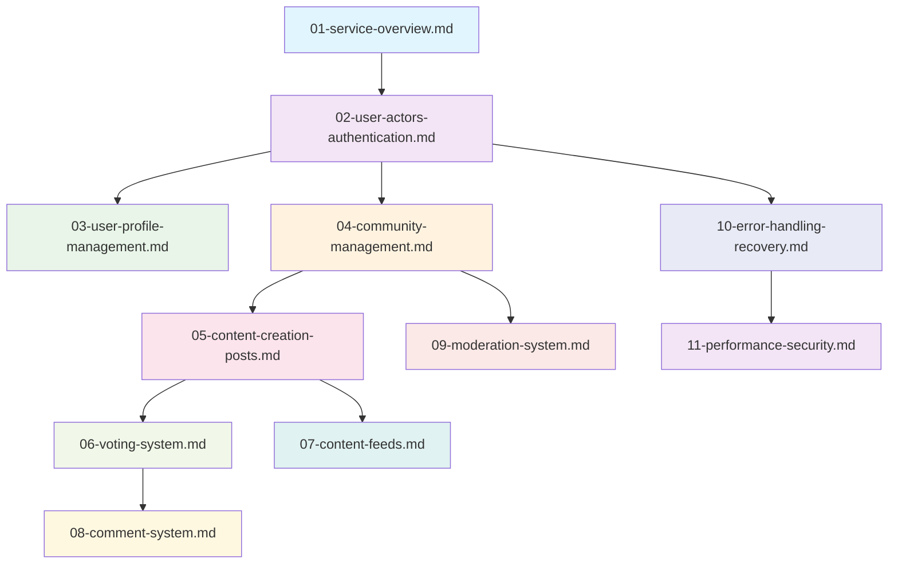

# Reddit-like Community Platform - Documentation Table of Contents

## Project Overview

This documentation set provides comprehensive specifications for building a Reddit-like community platform that enables users to create communities, share content, engage through voting and commenting, and participate in moderated online discussions. The platform is designed to foster genuine community engagement through topic-focused discussions and democratic content ranking.

## Document Structure

The documentation is organized into 12 comprehensive documents that cover all aspects of the platform from business requirements to technical specifications:

### Core Documentation

1. **[Service Overview Document](./01-service-overview.md)** - High-level business context and market positioning
2. **[User Actors and Authentication Specification](./02-user-actors-authentication.md)** - Complete user role definitions and security requirements
3. **[User Profile Management Requirements](./03-user-profile-management.md)** - Profile creation, editing, and karma system specifications

### Content Management

4. **[Community Management System](./04-community-management.md)** - Community creation, browsing, and subscription features
5. **[Post Creation and Management](./05-content-creation-posts.md)** - Content creation workflows for text, link, and image posts
6. **[Voting System Specification](./06-voting-system.md)** - Voting mechanics and karma calculation logic
7. **[Content Feed Algorithms](./07-content-feeds.md)** - Feed types, sorting algorithms, and pagination requirements
8. **[Comment System Design](./08-comment-system.md)** - Comment threading, voting, and management workflows

### Moderation and Security

9. **[Moderation System Requirements](./09-moderation-system.md)** - Moderator roles, actions, and reporting workflows
10. **[Error Handling and Recovery](./10-error-handling-recovery.md)** - Error scenarios and user recovery processes
11. **[Performance and Security Requirements](./11-performance-security.md)** - System performance benchmarks and security measures

## Navigation Guide

### For Business Stakeholders
- Start with **[Service Overview](./01-service-overview.md)** for business context
- Review **[User Profile Management](./03-user-profile-management.md)** for user engagement features
- Examine **[Community Management](./04-community-management.md)** for platform growth strategy

### For Development Teams
- Begin with **[User Actors and Authentication](./02-user-actors-authentication.md)** for security foundation
- Proceed to **[Content Creation](./05-content-creation-posts.md)** for core functionality
- Implement **[Voting System](./06-voting-system.md)** and **[Comment System](./08-comment-system.md)** for engagement features
- Add **[Moderation System](./09-moderation-system.md)** for community management

### For Community Managers
- Focus on **[Moderation System](./09-moderation-system.md)** for community management tools
- Review **[Community Management](./04-community-management.md)** for growth strategies
- Understand **[Error Handling](./10-error-handling-recovery.md)** for user support scenarios

## Document Relationships

## Target Audience Mapping

| Document | Primary Audience | Secondary Audience | Focus Area | Key Business Questions |
|----------|------------------|-------------------|------------|------------------------|
| Service Overview | Business Stakeholders | Product Managers | Business Strategy | What market opportunity exists? How will success be measured? |
| User Actors & Authentication | Development Team | Security Architects | Security Foundation | What user roles exist? How are permissions enforced? |
| User Profile Management | Development Team | UX Designers | User Engagement | How do users build reputation? What profile information is displayed? |
| Community Management | Development Team | Community Managers | Platform Growth | How are communities created and discovered? What subscription rules apply? |
| Content Creation | Development Team | Content Moderators | Core Functionality | What post types are supported? How is content validated? |
| Voting System | Development Team | System Architects | Engagement Mechanics | How does voting affect karma? What prevents vote manipulation? |
| Content Feeds | Backend Engineers | Product Managers | Content Discovery | How are feeds sorted? What performance is expected? |
| Comment System | Development Team | UX Designers | Discussion Features | How are comments threaded? What editing capabilities exist? |
| Moderation System | Community Managers | Development Team | Community Safety | What moderator actions are available? How are reports handled? |
| Error Handling | Development Team | UX Designers | User Experience | What error scenarios exist? How do users recover? |
| Performance & Security | Security Architects | DevOps Team | System Reliability | What performance benchmarks must be met? What security measures are required? |

## Document Access Patterns

### Sequential Reading (Recommended for New Teams)
1. **Business Context**: Start with service overview and business requirements
2. **Technical Foundation**: Proceed to authentication and user management
3. **Core Features**: Implement content creation and engagement systems
4. **Advanced Features**: Add moderation and community management tools
5. **Quality Assurance**: Implement error handling and security measures

### Role-Based Access
- **Backend Developers**: Focus on technical specifications (02, 05, 06, 07, 08)
- **Frontend Developers**: Reference user flows and interface requirements (03, 05, 08)
- **Product Managers**: Review business requirements and user stories (01, 04, 07)
- **Community Managers**: Study moderation and management tools (04, 09)
- **Security Teams**: Review authentication and security requirements (02, 11)

## Key Features Covered

This documentation comprehensively addresses:

### User Management System
- **Registration & Authentication**: Email/password registration with username uniqueness validation
- **Profile Management**: Display names, bios, avatars with comprehensive editing capabilities
- **Karma System**: Single numeric reputation score based on post and comment votes

### Community Ecosystem
- **Community Creation**: Any user can create communities with unique names and descriptions
- **Subscription Management**: Subscribe/unsubscribe functionality with posting prerequisites
- **Community Discovery**: Browse, search, and discover communities based on interests

### Content Creation & Engagement
- **Post Types**: Text posts, link posts, and image posts with specific validation rules
- **Voting System**: Upvote/downvote mechanics with one-vote-per-user constraints
- **Comment System**: Unlimited nesting depth with comprehensive threading capabilities

### Content Discovery
- **Feed Types**: Home feed (subscribed), Popular feed (all communities), Community feed (specific)
- **Sorting Algorithms**: Hot, New, Top (with time filters), Controversial
- **Pagination**: Efficient content loading with cursor-based pagination

### Moderation & Safety
- **Moderator Roles**: Owner and moderator hierarchy with defined permissions
- **Reporting System**: User reporting with moderator review workflows
- **Ban Management**: Community-specific bans with duration controls

### Performance & Security
- **Performance Benchmarks**: Response time requirements and scalability targets
- **Security Measures**: Authentication security, data protection, access controls
- **Error Handling**: Comprehensive error scenarios with user recovery flows

## Implementation Priority

### Phase 1: Core Platform (Minimum Viable Product)
- User authentication and profile management
- Basic community creation and subscription
- Text post creation and basic feeds
- Simple comment system with threading

### Phase 2: Engagement Features
- Voting system with karma calculation
- Advanced feed algorithms and sorting
- Image and link post support
- Enhanced comment features and moderation

### Phase 3: Community Management
- Comprehensive moderation tools and reporting
- Advanced community features and analytics
- Performance optimization and security enhancements
- Mobile responsiveness and accessibility improvements

## Cross-Document Dependencies

### Critical Dependencies
- **Authentication → Content Creation**: Users must be authenticated to create content
- **Community Subscription → Post Creation**: Subscription required for posting in communities
- **Voting System → Karma Calculation**: Votes directly impact user karma scores
- **Moderation System → Content Management**: Moderators can delete content and ban users

### Integration Points
- User authentication integrates with all content creation and voting systems
- Community management integrates with content feeds and subscription systems
- Voting system integrates with karma calculation and content ranking
- Moderation system integrates with reporting and user management

## Quality Assurance Requirements

### Documentation Completeness
- All sections must be fully developed with specific, actionable requirements
- Business requirements must use EARS format for clarity and testability
- Technical specifications must include performance benchmarks and security requirements
- User flows must include comprehensive error handling and recovery scenarios

### Implementation Readiness
- Requirements must be immediately actionable for backend developers
- All edge cases and error scenarios must be documented
- Performance expectations must be clearly defined with measurable targets
- Security requirements must include specific implementation guidelines

## Maintenance and Updates

### Version Control
- Documentation versioning aligned with platform releases
- Change tracking for requirements modifications
- Backward compatibility considerations for existing implementations

### Continuous Improvement
- Regular review cycles for documentation accuracy
- User feedback incorporation for requirement refinement
- Performance metric updates based on production data

## Success Metrics Tracking

### Platform Performance
- User growth metrics (MAU, DAU, retention rates)
- Engagement metrics (posts per user, comments per post, voting participation)
- Community health indicators (moderation effectiveness, user satisfaction)

### Technical Performance
- System response times meeting defined benchmarks
- Uptime and reliability metrics
- Security incident rates and response times

### Business Success
- Community creation and growth rates
- User satisfaction and platform adoption
- Achievement of business objectives defined in service overview

## Support and Resources

### Development Support
- Technical specifications for all platform features
- API documentation for integration points
- Performance optimization guidelines

### Community Management Support
- Moderation workflow documentation
- Community growth strategies
- User engagement best practices

### Business Stakeholder Support
- Market analysis and opportunity assessment
- Success metric tracking and reporting
- Strategic planning resources

> *Developer Note: This document defines **business requirements only**. All technical implementations (architecture, APIs, database design, etc.) are at the discretion of the development team.*