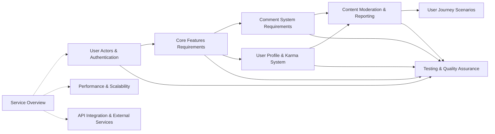

# Reddit-like Community Platform - Documentation Overview

## Project Vision
This platform aims to create a comprehensive community-driven content sharing system where users can discover, create, and discuss content across diverse communities. The platform will foster meaningful interactions through a robust voting system, threaded discussions, and community-driven moderation.

## Core Platform Features
- **Community Creation & Management**: Users can create and moderate topic-based communities
- **Multi-format Content**: Support for text posts, links, and image-based content
- **Engagement System**: Upvote/downvote mechanics with karma-based reputation
- **Threaded Discussions**: Nested comment system with reply functionality
- **Content Discovery**: Multiple sorting algorithms (hot, new, top, controversial)
- **User Management**: Comprehensive profiles with activity history
- **Moderation System**: Community-driven content management and reporting

## Documentation Structure
This table of contents provides a complete roadmap for understanding and building the Reddit-like community platform. Each document serves a specific purpose in the development lifecycle.

### Complete Document Listing

#### 1. Strategic Planning Documents
- **[Service Overview Document](./01-service-overview.md)** - Business model, revenue strategy, and market positioning
- **[Table of Contents](./00-toc.md)** - Current document: Navigation guide and project overview

#### 2. Core Requirements Documents
- **[User Actors & Authentication](./02-user-actors-authentication.md)** - User types, authentication flows, and permission systems
- **[Core Features Requirements](./03-core-features-requirements.md)** - Community management, content creation, and voting systems
- **[Comment System Requirements](./04-comment-system-requirements.md)** - Threaded comments, nested replies, and comment management
- **[User Profile & Karma System](./05-user-profile-karma-system.md)** - Profile features, reputation mechanics, and privacy settings

#### 3. Moderation & Administration Documents
- **[Content Moderation & Reporting](./06-content-moderation-reporting.md)** - Reporting system, moderation workflows, and administrative controls
- **[User Journey Scenarios](./07-user-journey-scenarios.md)** - Typical user flows, edge cases, and error handling

#### 4. Technical Specifications Documents
- **[Performance & Scalability](./08-performance-scalability.md)** - Performance requirements, scalability targets, and technical constraints
- **[API Integration & External Services](./09-api-integration-external.md)** - External integrations, API design, and third-party services
- **[Testing & Quality Assurance](./10-testing-quality-assurance.md)** - Testing strategies, QA processes, and acceptance criteria

## Recommended Reading Order

### For Business Stakeholders
1. **[Service Overview](./01-service-overview.md)** - Understand business objectives
2. **[User Journey Scenarios](./07-user-journey-scenarios.md)** - See platform from user perspective
3. **[Table of Contents](./00-toc.md)** - Current document for overall context

### For Development Team
1. **[User Actors & Authentication](./02-user-actors-authentication.md)** - Foundation for all features
2. **[Core Features Requirements](./03-core-features-requirements.md)** - Main platform functionality
3. **[Comment System Requirements](./04-comment-system-requirements.md)** - Discussion features
4. **[User Profile & Karma System](./05-user-profile-karma-system.md)** - User management
5. **[Content Moderation & Reporting](./06-content-moderation-reporting.md)** - Administration features

### For Technical Architects
1. **[Performance & Scalability](./08-performance-scalability.md)** - System architecture considerations
2. **[API Integration & External Services](./09-api-integration-external.md)** - Integration requirements
3. **[Testing & Quality Assurance](./10-testing-quality-assurance.md)** - Quality standards

## Document Relationships

### Core Dependencies

### Information Flow
- **Foundation Layer**: User authentication and actor definitions form the base
- **Feature Layer**: Core platform features build upon authentication
- **Interaction Layer**: Comment and profile systems enable user engagement
- **Management Layer**: Moderation and administration maintain platform quality
- **Technical Layer**: Performance and integration requirements support all features

## Navigation Guide

### Finding Specific Information

#### User Management Features
- **Authentication**: [User Actors & Authentication](./02-user-actors-authentication.md)
- **Profiles**: [User Profile & Karma System](./05-user-profile-karma-system.md)
- **Journeys**: [User Journey Scenarios](./07-user-journey-scenarios.md)

#### Content Features
- **Posts & Communities**: [Core Features Requirements](./03-core-features-requirements.md)
- **Comments**: [Comment System Requirements](./04-comment-system-requirements.md)
- **Moderation**: [Content Moderation & Reporting](./06-content-moderation-reporting.md)

#### Technical Specifications
- **Performance**: [Performance & Scalability](./08-performance-scalability.md)
- **Integrations**: [API Integration & External Services](./09-api-integration-external.md)
- **Quality**: [Testing & Quality Assurance](./10-testing-quality-assurance.md)

### Cross-Referencing Strategy
Each document contains references to related documents using descriptive link text. When navigating between documents, use the table of contents as your primary reference point to maintain context.

## Platform Architecture Overview

The Reddit-like community platform is structured around four core pillars:

### 1. Community Foundation
- Topic-based community creation and management
- Subscription system for personalized content feeds
- Multi-format content support (text, links, images)

### 2. Engagement Engine
- Voting system with upvote/downvote mechanics
- Karma-based reputation tracking
- Threaded discussion system with nested replies

### 3. Discovery System
- Multiple sorting algorithms (hot, new, top, controversial)
- Personalized feed based on subscriptions
- Trending content identification

### 4. Moderation Framework
- Community-driven content management
- User reporting system
- Administrative oversight and escalation

## Development Phases

### Phase 1: Core Platform (Documents 1-3)
- User authentication and basic profiles
- Community creation and post management
- Basic voting and comment system

### Phase 2: Engagement Features (Documents 4-5)
- Advanced comment threading
- Karma system implementation
- User profile enhancements

### Phase 3: Management & Scale (Documents 6-8)
- Content moderation system
- Performance optimization
- Administrative controls

### Phase 4: Integration & Quality (Documents 9-10)
- External service integration
- Comprehensive testing
- Quality assurance processes

## Success Metrics

The platform's success will be measured through:
- **User Engagement**: Daily active users, posts per user, comments per post
- **Community Health**: New community creation, moderator activity, report resolution time
- **Content Quality**: Vote ratios, comment depth, content diversity
- **Technical Performance**: Response times, uptime, scalability metrics

> *Developer Note: This document defines **business requirements only**. All technical implementations (architecture, APIs, database design, etc.) are at the discretion of the development team.*