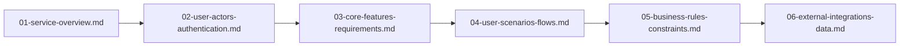
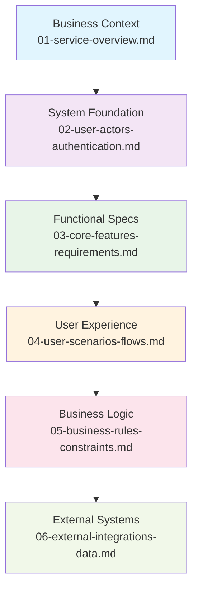

# Community Platform Project Documentation

## Project Overview

This documentation set provides complete specifications for building a Reddit-like community platform that enables users to create communities, share content, engage in discussions, and participate in democratic content curation through voting systems. The platform supports multiple user roles with granular permissions and comprehensive moderation capabilities.

**Platform Vision**: To create the most engaging and user-friendly community platform that empowers users to share knowledge, build communities, and participate in meaningful discussions across any topic of interest.

**Core Mission**: Enable authentic engagement through specialized communities with democratic content moderation and robust user tools.

## Documentation Structure

The project documentation is organized into 6 core documents that follow a logical progression from business requirements to technical specifications:

### Core Document Hierarchy

## Navigation Guide

### For Business Stakeholders
- Start with [Service Overview Document](./01-service-overview.md) to understand business objectives and market positioning
- Review [User Scenarios and Flows](./04-user-scenarios-flows.md) for user experience understanding
- Consult [Business Rules and Constraints](./05-business-rules-constraints.md) for policy definitions

### For Development Teams
- Begin with [User Actors and Authentication](./02-user-actors-authentication.md) for system architecture foundation
- Proceed to [Core Features Requirements](./03-core-features-requirements.md) for functional specifications
- Reference [Business Rules and Constraints](./05-business-rules-constraints.md) for implementation guidelines
- Review [External Integrations and Data](./06-external-integrations-data.md) for system interoperability requirements

### For Product Managers
- Use [User Scenarios and Flows](./04-user-scenarios-flows.md) for feature planning
- Consult [Business Rules and Constraints](./05-business-rules-constraints.md) for policy definitions
- Review [Service Overview](./01-service-overview.md) for business context
- Reference [Core Features Requirements](./03-core-features-requirements.md) for functionality understanding

## Quick Start

### Essential Information by Role

**Developers**: 
- Authentication system uses JWT tokens with 4 user roles: Guest, Member, Moderator, Admin
- Core features include community management, post creation, voting system, and commenting
- Complete permission matrix defined in [User Actors Documentation](./02-user-actors-authentication.md)
- External integrations specified in [External Integrations Document](./06-external-integrations-data.md)

**Business Stakeholders**:
- Platform targets content-driven communities with democratic content curation
- Revenue model focuses on engagement-driven monetization
- Success metrics include user engagement, content creation, and community growth
- Market analysis and competitive positioning in [Service Overview](./01-service-overview.md)

**Product Managers**:
- User journeys cover registration, community creation, content submission, and moderation
- Content policies and moderation workflows defined comprehensively
- Performance expectations specified for key user interactions
- Business rules and constraints detailed in [Business Rules Document](./05-business-rules-constraints.md)

## Document Index

### 1. [Service Overview Document](./01-service-overview.md)
- **Purpose**: Establishes business foundation and strategic vision
- **Content**: Business model, target market, competitive analysis, success metrics
- **Audience**: Business stakeholders, investors, executive leadership
- **Key Sections**: Executive Summary, Business Model, Target Market Analysis, Core Value Proposition, Competitive Landscape, Vision and Goals, Success Metrics

### 2. [User Actors and Authentication Documentation](./02-user-actors-authentication.md)
- **Purpose**: Defines complete authentication system and permission hierarchy
- **Content**: User role definitions, JWT token management, security requirements, access control
- **Audience**: Development team, security architects
- **Key Sections**: Authentication System Overview, User Actor Definitions, Permission Hierarchy, Authentication Flows, JWT Token Management, Security Requirements, Access Control Matrix

### 3. [Core Features Requirements Documentation](./03-core-features-requirements.md)
- **Purpose**: Specifies platform functionalities in natural language
- **Content**: Community management, post creation, voting system, commenting, moderation tools
- **Audience**: Development team, product managers
- **Key Sections**: Community Management, Post Creation and Management, Voting System, Comment System, Subscription Management, Content Moderation, Search and Discovery

### 4. [User Scenarios and Flow Documentation](./04-user-scenarios-flows.md)
- **Purpose**: Documents complete user journeys and interaction flows
- **Content**: Registration flows, content submission processes, moderation scenarios, error handling
- **Audience**: Product managers, UX designers, development team
- **Key Sections**: User Registration Journey, Community Creation Flow, Post Submission Process, Commenting Workflow, Moderation Scenarios, Administration Flows, Error Handling Scenarios

### 5. [Business Rules and Constraints Documentation](./05-business-rules-constraints.md)
- **Purpose**: Defines business logic, validation rules, and operational constraints
- **Content**: Content policies, user behavior guidelines, performance requirements, compliance
- **Audience**: Development team, legal/compliance, product managers
- **Key Sections**: Content Validation Rules, Community Guidelines, User Behavior Policies, Content Moderation Rules, System Constraints, Performance Requirements, Compliance Requirements

### 6. [External Integrations and Data Documentation](./06-external-integrations-data.md)
- **Purpose**: Documents external service integrations and data flow requirements
- **Content**: Third-party integrations, API requirements, file handling, notification systems
- **Audience**: Development team, system architects
- **Key Sections**: Third-Party Integrations, Data Flow Architecture, API Integration Requirements, File Handling Requirements, Notification Systems, Analytics and Reporting

## Document Dependencies

## Usage Guidelines

### Reading Order Recommendations

**Sequential Approach**: Read documents in numerical order (01 → 06) for comprehensive understanding

**Role-Based Approach**: 
- **Business Focus**: 01 → 04 → 05
- **Technical Focus**: 02 → 03 → 05 → 06
- **Product Focus**: 01 → 03 → 04 → 05
- **Development Focus**: 02 → 03 → 06 → 05

### Document Maintenance
- All documents are living artifacts that may be updated during development
- Cross-references between documents should be maintained
- Version control recommended for tracking changes
- Document updates should be coordinated across related documents

## Key Terminology

- **Community**: User-created groups focused on specific topics or interests
- **Post**: User-submitted content within a community
- **Voting**: Democratic content curation through upvotes/downvotes
- **Moderation**: Content management and user behavior oversight
- **JWT**: JSON Web Token authentication standard used throughout the platform
- **Member**: Registered user with content creation and voting privileges
- **Moderator**: User with community management and content moderation capabilities
- **Admin**: System administrator with full platform access

## Support and Updates

For questions about this documentation structure or to suggest improvements, please refer to the individual document maintainers listed in each document's header section.

### Document Update Process
WHEN updates are required to any document, THE maintainer SHALL:
- Review related documents for consistency
- Update cross-references as needed
- Maintain version history
- Notify stakeholders of significant changes

### Quality Assurance
ALL documents SHALL undergo regular review to ensure:
- Accuracy of technical specifications
- Consistency across related documents
- Completeness of business requirements
- Clarity for intended audiences

> *Developer Note: This document defines **business requirements only**. All technical implementations (architecture, APIs, database design, etc.) are at the discretion of the development team.*