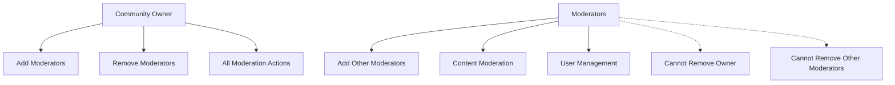

# Reddit-like Community Platform Requirements Specification

## Executive Summary

This document provides comprehensive business requirements for building a Reddit-like community platform that enables users to create communities, share content, engage in discussions, and build communities around shared interests. The platform supports multi-type content sharing, sophisticated voting mechanisms, nested comment systems, and comprehensive moderation workflows.

## Platform Overview

### Core Platform Capabilities

The community platform enables users to:
- Create and manage personal profiles with reputation tracking
- Establish and moderate communities around specific topics
- Share content through multiple post types (text, link, image)
- Engage in threaded discussions through nested comments
- Participate in community governance through voting and reporting
- Discover content through personalized and community-specific feeds

### Target User Base

**Primary User Groups:**
- **Content Creators**: Users who create posts and communities
- **Community Members**: Users who participate in discussions and voting
- **Moderators**: Users who manage community content and members
- **Platform Administrators**: System administrators managing platform operations

## User Account Management

### User Registration Process

WHEN a new user wants to create an account, THE system SHALL provide a registration form requiring:
- Valid email address (must pass email format validation)
- Unique username (minimum 3 characters, maximum 20 characters, alphanumeric only)
- Secure password (minimum 8 characters, requiring at least one uppercase letter, one lowercase letter, and one number)

WHEN a user submits the registration form, THE system SHALL:
- Validate all input fields against defined constraints
- Check username uniqueness against existing users
- Send email verification link to the provided email address
- Create user account in pending verification status

WHEN a user clicks the verification link, THE system SHALL:
- Activate the user account
- Create default user profile with empty bio and default avatar
- Initialize karma score to zero
- Redirect to login page with success message

### User Authentication Workflow

WHEN a registered user attempts to log in, THE system SHALL:
- Accept email and password combination
- Verify credentials against stored user data
- Generate JWT token with 24-hour expiration
- Track login session for security monitoring
- Redirect to user's home feed upon successful authentication

WHEN authentication fails, THE system SHALL:
- Display generic error message ("Invalid credentials")
- Implement rate limiting after 5 failed attempts
- Lock account temporarily after 10 consecutive failures
- Require password reset for locked accounts

### Password Management

WHEN a user wants to change their password, THE system SHALL:
- Require current password verification
- Validate new password meets security requirements
- Update password hash in database
- Invalidate all existing sessions
- Send confirmation email to user

WHEN a user forgets their password, THE system SHALL:
- Provide password reset flow via email
- Generate secure reset token with 1-hour expiration
- Allow password reset after token validation
- Require re-login with new credentials

### Account Deletion Process

WHEN a user requests account deletion, THE system SHALL:
- Require password confirmation for security
- Display comprehensive deletion warning showing all content that will be removed
- Initiate asynchronous deletion process
- Remove all user-generated content (posts, comments, votes)
- Anonymize user data in compliance with data retention policies
- Send confirmation email upon completion

## User Profile System

### Profile Structure

Each user profile contains:
- **Display Name**: User-chosen display name (2-50 characters, supports Unicode)
- **Bio Text**: Optional biographical information (maximum 500 characters)
- **Avatar Image**: Profile picture (maximum 2MB, supported formats: JPEG, PNG, WebP)
- **Karma Score**: Reputation tracking number (initial value: 0)
- **Account Creation Date**: Timestamp of registration
- **Last Activity Date**: Timestamp of most recent interaction

### Profile Management

WHEN a user edits their profile, THE system SHALL:
- Allow modification of display name, bio, and avatar
- Validate display name length and character constraints
- Validate avatar file size and format requirements
- Update profile immediately upon successful validation
- Display success confirmation to the user

WHEN profile validation fails, THE system SHALL:
- Display specific error messages for each validation failure
- Preserve user input to avoid data loss
- Highlight problematic fields with clear error indicators

### Profile Viewing Permissions

WHEN a user views another user's profile, THE system SHALL display:
- Display name, bio, and avatar
- Total karma score
- List of all posts created by the user (paginated, 20 per page)
- List of all comments written by the user (paginated, 20 per page)
- Account creation date
- Last activity timestamp

WHEN viewing own profile, THE system SHALL additionally provide:
- Profile editing controls
- Account management options
- Private statistics and analytics

## Karma Reputation System

### Karma Calculation Rules

**Karma Score Definition:**
- Single numerical value representing user reputation
- Initial value: 0 for new accounts
- Can be positive, negative, or zero
- No upper or lower limits

**Karma Update Triggers:**
- WHEN a post receives an upvote, THE author's karma SHALL increase by 1
- WHEN a post receives a downvote, THE author's karma SHALL decrease by 1
- WHEN a comment receives an upvote, THE author's karma SHALL increase by 1
- WHEN a comment receives a downvote, THE author's karma SHALL decrease by 1

**Vote Change Handling:**
- WHEN a user changes their vote from upvote to downvote, THE content author's karma SHALL decrease by 2
- WHEN a user changes their vote from downvote to upvote, THE content author's karma SHALL increase by 2
- WHEN a user removes their vote, THE content author's karma SHALL adjust by ±1 depending on the removed vote type

### Karma Display Rules

WHEN displaying karma scores, THE system SHALL:
- Show exact numerical value on user profiles
- Display karma alongside username in post and comment headers
- Format large numbers with appropriate abbreviations (1k, 1.5k, etc.)
- Color-code negative karma values for visual distinction

## Community Management System

### Community Creation Process

WHEN a user creates a new community, THE system SHALL require:
- **Unique Name**: Community identifier (3-20 characters, alphanumeric and hyphens only)
- **Description**: Community purpose statement (10-500 characters)
- **Icon Image**: Community branding (maximum 1MB, square aspect ratio)

WHEN community creation succeeds, THE system SHALL:
- Designate the creator as community owner
- Create community with initial subscriber count of 1 (the creator)
- Make the community discoverable in community listings
- Provide community management tools to the owner

### Community Discovery and Browsing

WHEN users browse communities, THE system SHALL provide:
- Alphabetical list of all communities
- Search functionality by community name
- Filter by subscriber count ranges
- Sort options: alphabetical, most subscribers, newest

WHEN displaying community information, THE system SHALL show:
- Community name and icon
- Subscriber count
- Community description
- Date of creation
- Community owner username

### Community Subscription System

**Subscription Requirements:**
- WHEN a user subscribes to a community, THE system SHALL add them to the subscriber list
- WHEN a user unsubscribes from a community, THE system SHALL remove them from the subscriber list
- Subscription is REQUIRED for creating posts in a community
- Subscription is OPTIONAL for viewing community content and voting

**Subscription Management:**
- Users can view all their subscribed communities in a dedicated list
- Subscription counts update in real-time across the platform
- Community feeds prioritize content from subscribed communities

## Post Creation and Management

### Post Types and Structure

The platform supports three post types with specific requirements:

**Text Post Requirements:**
- Title: Required (5-300 characters)
- Content: Text body (maximum 40,000 characters)
- No external links or media attachments

**Link Post Requirements:**
- Title: Required (5-300 characters)
- URL: Valid HTTP/HTTPS URL
- Automatic URL validation and security checks
- Domain extraction for display purposes

**Image Post Requirements:**
- Title: Required (5-300 characters)
- Image: Uploaded image file (maximum 10MB, supported formats: JPEG, PNG, WebP, GIF)
- Automatic thumbnail generation
- Image compression for performance optimization

### Post Creation Workflow

WHEN a user creates a post, THE system SHALL:
- Validate user is subscribed to the target community
- Validate post type-specific requirements are met
- Apply content moderation checks for inappropriate content
- Generate unique post identifier
- Timestamp the creation time
- Make post immediately visible in community feed

### Post Editing and Deletion

WHEN a user edits their post, THE system SHALL:
- Allow modification of title and content (for text posts)
- Preserve edit history for moderation purposes
- Display "edited" indicator on the post
- Update post timestamp to reflect last edit time

WHEN a user deletes their post, THE system SHALL:
- Remove post from all feeds and search results
- Delete all associated comments and votes
- Update user karma if votes were present
- Maintain deletion record for audit purposes

### Post Display Requirements

**Single Post View:**
- Complete post content with full title and body
- Author information with karma score
- Community name with subscription status
- Vote score with user's current vote status
- Comment count with sorting options
- Creation timestamp and edit history

**Post List Display (Feeds):**
- Title truncated to 100 characters if necessary
- Author username
- Community name
- Vote score
- Comment count
- Relative timestamp (e.g., "3 hours ago")
- Type-specific preview:
  - Text posts: First 200 characters of content
  - Image posts: Thumbnail image
  - Link posts: Extracted domain name

## Voting System Specifications

### Voting Rules and Constraints

**Voting Mechanics:**
- Each user can cast only one vote per post or comment
- Votes can be: upvote (+1), downvote (-1), or no vote (0)
- Users can change their vote at any time
- Users can remove their vote entirely

**Vote Score Calculation:**
- Post/comment score = total upvotes - total downvotes
- Scores can be positive, negative, or zero
- Real-time score updates across the platform

### Voting User Experience

WHEN a user votes on content, THE system SHALL:
- Update the vote score immediately
- Change the vote button appearance to reflect current state
- Update the author's karma score accordingly
- Persist the vote action in the database

WHEN vote actions fail, THE system SHALL:
- Display appropriate error messages
- Revert UI to previous state
- Log the failure for debugging purposes

## Feed Management System

### Feed Types and Access Rules

**Home Feed (Logged-in Users Only):**
- Shows posts from communities the user is subscribed to
- Requires active authentication
- Personalized based on subscription preferences
- Primary feed for engaged users

**Popular Feed (Public Access):**
- Shows posts from all communities across the platform
- Accessible to logged-out users
- Represents trending content across the entire platform
- Gateway for new user discovery

**Community Feed (Public Access):**
- Shows posts from one specific community
- Accessible to all users regardless of subscription status
- Community-specific content discovery
- Entry point for community exploration

### Sorting Algorithms

All feeds support the following sorting options:

**Hot Sorting:**
- Prioritizes recent posts with high engagement
- Algorithm: score / (age_in_hours + 2)^1.8
- Encourages discovery of currently popular content
- Time-decay factor prevents old content from dominating

**New Sorting:**
- Strict chronological order by creation time
- Most recent posts appear first
- Simple implementation with high performance
- Preferred for real-time content consumption

**Top Sorting:**
- Highest vote score first
- Time filters: today, this week, this month, this year, all time
- Shows historically significant content
- Useful for discovering quality content

**Controversial Sorting:**
- Posts with many votes but score close to zero
- Algorithm: (upvotes + downvotes) / max(1, |score|)
- Highlights divisive or discussion-provoking content
- Encourages balanced debate

### Pagination Requirements

WHEN displaying feed content, THE system SHALL:
- Limit results to 25 posts per page
- Provide clear navigation controls (next/previous)
- Display total page count when applicable
- Maintain sort order across pagination
- Cache frequently accessed pages for performance

## Comment System Specifications

### Comment Structure and Nesting

**Comment Components:**
- Author information with karma score
- Content text (maximum 10,000 characters)
- Vote score with user vote status
- Creation timestamp
- Parent comment reference (for nested replies)
- Edit history tracking

**Nesting Rules:**
- Comments can have unlimited nested replies
- Thread depth indicated by visual indentation
- Collapsible thread sections for long discussions
- Performance optimization for deep nesting

### Comment Creation Workflow

WHEN a user creates a comment, THE system SHALL:
- Validate comment length and content
- Apply spam and abuse detection filters
- Create comment with proper parent relationship
- Update post comment count
- Notify post author and parent comment author (if different)

WHEN a user edits their comment, THE system SHALL:
- Allow content modification within length limits
- Preserve edit history with timestamps
- Display "edited" indicator
- Maintain thread integrity during edits

WHEN a user deletes their comment, THE system SHALL:
- Remove comment from display
- Preserve child comments with "deleted" placeholder
- Update vote counts and karma accordingly
- Maintain audit trail for moderation

### Comment Sorting Options

**Best Sorting:**
- Highest vote score first
- Prioritizes quality contributions
- Default sorting for most discussions

**New Sorting:**
- Most recent comments first
- Real-time conversation flow
- Preferred for active discussions

**Controversial Sorting:**
- Comments with many votes but neutral score
- Encourages diverse perspectives
- Useful for balanced debate viewing

## Community Moderation System

### Moderator Hierarchy and Permissions

**Moderator Roles:**
- **Community Owner**: Original creator with full permissions
- **Moderators**: Appointed users with specific moderation powers

**Permission Matrix:**

### Moderator Appointment Process

WHEN a community owner adds a moderator, THE system SHALL:
- Verify the target user exists and is not already a moderator
- Send moderation invitation to the target user
- Upon acceptance, grant moderator permissions
- Log the appointment for audit purposes

WHEN a moderator is removed, THE system SHALL:
- Revoke all moderation permissions immediately
- Notify the former moderator of the change
- Preserve moderation history for accountability
- Update community moderator list

### Moderation Actions

**Content Moderation:**
- Moderators can delete any post or comment in their community
- Deletion removes content from public view
- Authors receive notification of moderation action
- Deletion reasons are recorded for transparency

**User Management:**
- Moderators can ban users from their community
- Banned users cannot create posts or comments
- Banned users can still view community content
- Ban duration can be temporary or permanent
- Ban reasons must be provided and recorded

**Moderation Tools:**
- Moderator dashboard with community statistics
- Report management interface
- User activity monitoring
- Moderation action logging

## Reporting System Workflow

### Report Creation Process

WHEN a user reports content, THE system SHALL:
- Require selection of report category
- Mandate reason text explanation (10-500 characters)
- Record reporter identity and timestamp
- Notify community moderators of new report
- Hide reported content from reporter's view during review

**Report Categories:**
- Spam or commercial content
- Harassment or bullying
- Hate speech or discrimination
- Illegal content or activities
- Misinformation or false claims
- Other (requires detailed explanation)

### Moderator Report Review

WHEN moderators review reports, THE system SHALL provide:
- Complete report details with reported content
- Reporter information (username only)
- Report category and reason text
- Timestamp of report creation
- Previous report history for the same content

**Report Resolution Actions:**
- **Approve Report**: Delete the content and notify author
- **Dismiss Report**: Keep content and remove from report queue
- **Require More Information**: Request additional details from reporter

### Report Tracking and Analytics

WHEN reports are processed, THE system SHALL:
- Track resolution time for performance monitoring
- Record moderator decisions for accountability
- Provide reporting analytics to community owners
- Identify repeat offenders for pattern detection
- Maintain report history for legal compliance

## Business Rules and System Constraints

### Performance Requirements

**Response Time Targets:**
- Feed loading: under 2 seconds for first page
- Vote actions: under 500 milliseconds
- Comment posting: under 1 second
- Search functionality: under 3 seconds for results

**Scalability Considerations:**
- Support for 1 million+ users
- Handle 10,000+ concurrent active users
- Process 100+ posts per minute during peak
- Manage 1,000+ comments per minute

### Content Validation Rules

**Text Content Validation:**
- Profanity filtering with customizable word lists
- Spam detection using behavioral analysis
- Link safety checking for malicious URLs
- Character encoding validation for international support

**Media Content Validation:**
- Image file format and size verification
- Malware scanning for uploaded files
- Content appropriateness analysis
- Copyright infringement detection

### Security Requirements

**Authentication Security:**
- JWT tokens with 24-hour expiration
- Secure password hashing with bcrypt
- Session management with automatic logout
- Rate limiting for authentication attempts

**Data Protection:**
- Encryption of sensitive user data
- Secure file upload handling
- Regular security vulnerability scanning
- Compliance with data protection regulations

### Legal and Compliance

**Content Moderation Compliance:**
- DMCA takedown request handling
- Illegal content reporting procedures
- User data access and deletion rights
- Transparency reporting requirements

**Privacy Considerations:**
- Clear privacy policy implementation
- User data collection and usage transparency
- Data retention and deletion policies
- International data transfer compliance

## Error Handling and Edge Cases

### User Experience Error Handling

WHEN system errors occur, THE system SHALL:
- Display user-friendly error messages
- Preserve user data to prevent loss
- Provide clear recovery instructions
- Log technical details for debugging

### Edge Case Scenarios

**Content Ownership Transfers:**
- Community ownership transfer protocols
- Post and comment ownership after account deletion
- Orphaned content management policies

**System Integration Points:**
- Third-party authentication providers
- External content moderation services
- Analytics and monitoring tools

This comprehensive requirements specification provides the foundation for building a robust, scalable community platform that meets modern user expectations while maintaining security, performance, and compliance standards.