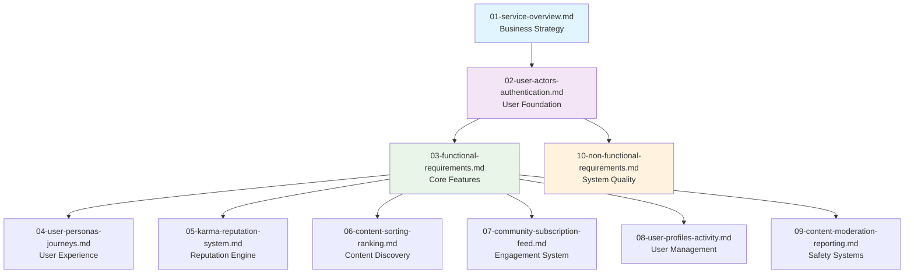
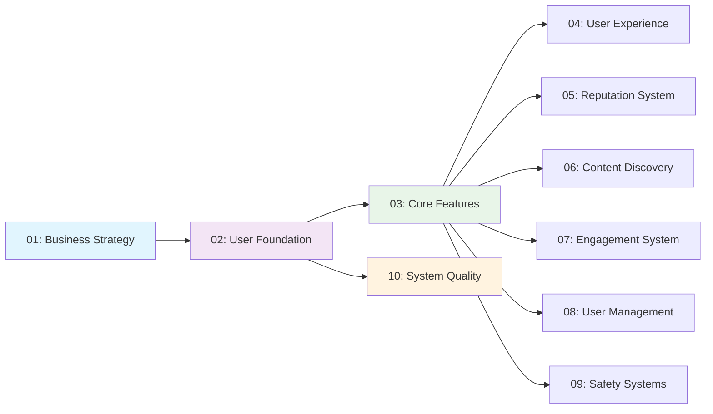

# Community Platform Project Documentation - Table of Contents

## Project Overview

This documentation set provides comprehensive specifications for building a Reddit-like community platform that enables users to create communities, share content, engage through voting and commenting systems, and participate in community-driven discussions. The platform will support user registration, content creation, voting mechanisms, karma systems, and robust moderation tools.

### Business Vision
The community platform aims to create a sustainable ecosystem where users can discover, discuss, and share content across diverse interests while maintaining high-quality discourse through intelligent moderation and reputation systems. The platform prioritizes community-driven content curation over algorithmic amplification, fostering authentic engagement and meaningful conversations.

### Platform Objectives
- Enable users to create and manage specialized communities around shared interests
- Provide democratic content curation through transparent voting systems
- Implement robust reputation mechanisms that reward quality contributions
- Ensure platform safety through comprehensive moderation tools
- Support scalable growth while maintaining content quality standards

## Documentation Structure

The project documentation is organized into 10 specialized documents that cover all aspects of the community platform from business strategy through technical implementation. Each document focuses on a specific domain area while maintaining consistency across the entire specification.

### Document Organization Principles

1. **Progressive Detail**: Documents progress from high-level business overview to detailed technical specifications
2. **Domain Specialization**: Each document addresses a specific functional area with focused expertise
3. **Cross-Referencing**: Documents reference each other to maintain consistency and avoid duplication
4. **Stakeholder Focus**: Different documents target specific audience types with appropriate detail levels
5. **Implementation Independence**: Documents define business requirements without prescribing technical solutions

### Documentation Hierarchy

## Complete Document Links

### 1. [Service Overview Document](./01-service-overview.md)
**Purpose**: Define the overall vision, business model, and strategic direction for the community platform
**Audience**: Business stakeholders, project sponsors, and executive leadership
**Content**: Executive summary, business model analysis, competitive landscape, success metrics, growth strategy
**Key Questions Answered**: What problem does this platform solve? Who is the target audience? What makes this platform unique? How will success be measured?
**Business Requirements**: The platform must establish clear market positioning, sustainable revenue model, and measurable success criteria to guide development priorities and investment decisions.

### 2. [User Actors and Authentication Document](./02-user-actors-authentication.md)
**Purpose**: Define user roles, authentication flows, and permission hierarchies for the platform
**Audience**: Development team, security architects, and system designers
**Content**: User actor definitions (Guest, Member, Moderator, Admin), authentication requirements, permission matrices, security measures
**Key Questions Answered**: Who are the different user types? What can each user type do? How does authentication work? What security measures are needed?
**Business Requirements**: The authentication system must support four distinct user actors with graduated permission levels, ensuring appropriate access controls while maintaining platform security and user privacy.

### 3. [Functional Requirements Document](./03-functional-requirements.md)
**Purpose**: Document core features and functionality requirements for the community platform
**Audience**: Development team, product managers, and quality assurance engineers
**Content**: Community management features, content creation and management, voting and ranking system, user interaction features, moderation and reporting
**Key Questions Answered**: What are the core features of the platform? How do users interact with communities? How does the voting system work? What moderation tools are available?
**Business Requirements**: All functional requirements must use EARS (Easy Approach to Requirements Syntax) format to ensure clarity, testability, and unambiguous implementation guidance.

### 4. [User Personas and Journeys Document](./04-user-personas-journeys.md)
**Purpose**: Define user personas and their journeys through the platform
**Audience**: Product managers, UX designers, and marketing teams
**Content**: User persona definitions, primary user scenarios, user journey maps, edge case scenarios
**Key Questions Answered**: Who are the typical users of this platform? What are their goals and motivations? How do different users interact with the platform? What are the key user flows?
**Business Requirements**: The platform must accommodate diverse user types with varying engagement levels, providing intuitive experiences that address specific user needs and pain points.

### 5. [Karma and Reputation System Document](./05-karma-reputation-system.md)
**Purpose**: Document karma system and user reputation management
**Audience**: Development team, community managers, and product strategists
**Content**: Karma calculation rules, reputation tiers and benefits, user behavior impact, anti-abuse measures
**Key Questions Answered**: How is karma calculated? What behaviors affect user karma? Are there karma tiers with different benefits? How is karma abuse prevented?
**Business Requirements**: The karma system must provide transparent reputation mechanisms that reward quality contributions while discouraging low-quality behavior, with precise calculation formulas and anti-abuse measures.

### 6. [Content Sorting and Ranking Document](./06-content-sorting-ranking.md)
**Purpose**: Document content sorting algorithms and ranking mechanisms
**Audience**: Development team, algorithm specialists, and data scientists
**Content**: Sorting algorithms overview, hot ranking algorithm, new content sorting, top content ranking, controversial content detection
**Key Questions Answered**: How does the 'hot' algorithm work? How are posts ranked by 'top'? What makes content 'controversial'? How is content freshness weighted?
**Business Requirements**: The platform must provide multiple content sorting methods that balance recency, engagement, and quality to deliver optimal user experience and content discovery.

### 7. [Community Subscription and Feed Management Document](./07-community-subscription-feed.md)
**Purpose**: Document community subscription model and feed generation
**Audience**: Development team, backend engineers, and product managers
**Content**: Community subscription model, personalized feed generation, subscription management, feed customization options, performance requirements
**Key Questions Answered**: How do users subscribe to communities? How is the personalized feed generated? Can users customize their feed? What performance expectations exist for feed loading?
**Business Requirements**: The subscription system must enable personalized content discovery while maintaining high performance standards, with intelligent feed generation based on user preferences and engagement patterns.

### 8. [User Profiles and Activity Tracking Document](./08-user-profiles-activity.md)
**Purpose**: Document user profile management and activity tracking
**Audience**: Development team, data engineers, and UX designers
**Content**: Profile management features, activity history tracking, profile customization, privacy settings, data export capabilities
**Key Questions Answered**: What information is shown on user profiles? How is user activity tracked and displayed? What customization options are available? What privacy controls exist?
**Business Requirements**: User profiles must serve as comprehensive identity hubs while respecting privacy preferences, with complete activity tracking and management capabilities.

### 9. [Content Moderation and Reporting Document](./09-content-moderation-reporting.md)
**Purpose**: Document content moderation and reporting system
**Audience**: Development team, moderation specialists, and legal compliance officers
**Content**: Content reporting system, moderation workflows, automated content filtering, appeal and review process, moderation tools and interfaces
**Key Questions Answered**: How do users report inappropriate content? What moderation workflows exist? Are there automated filtering mechanisms? How are moderation decisions appealed?
**Business Requirements**: The moderation system must ensure platform safety through multi-layered approaches combining user reporting, automated filtering, and human moderation, with transparent processes and appeal mechanisms.

### 10. [Non-Functional Requirements Document](./10-non-functional-requirements.md)
**Purpose**: Document performance, security, and system constraints
**Audience**: Development team, system architects, and operations engineers
**Content**: Performance requirements, scalability considerations, security requirements, data privacy compliance, maintenance and monitoring
**Key Questions Answered**: What performance expectations exist? How should the system scale? What security measures are required? What compliance requirements apply?
**Business Requirements**: The platform must meet stringent non-functional requirements for performance, security, scalability, and compliance to ensure reliable operation and user trust.

## Navigation Guide

### For Business Stakeholders
**Primary Documents**: [Service Overview](./01-service-overview.md), [User Personas and Journeys](./04-user-personas-journeys.md)
**Secondary Documents**: [Functional Requirements](./03-functional-requirements.md), [Karma and Reputation System](./05-karma-reputation-system.md)
**Focus Areas**: Business strategy, market positioning, user experience, revenue model, success metrics
**Business Justification**: Understanding the strategic vision and user needs ensures alignment between business objectives and technical implementation.

### For Development Team
**Primary Documents**: [Functional Requirements](./03-functional-requirements.md), [User Actors and Authentication](./02-user-actors-authentication.md)
**Secondary Documents**: Based on specialization:
- Backend developers: [Content Sorting and Ranking](./06-content-sorting-ranking.md), [Community Subscription and Feed Management](./07-community-subscription-feed.md)
- Frontend developers: [User Profiles and Activity Tracking](./08-user-profiles-activity.md), [User Personas and Journeys](./04-user-personas-journeys.md)
- Security specialists: [User Actors and Authentication](./02-user-actors-authentication.md), [Non-Functional Requirements](./10-non-functional-requirements.md)
- Data engineers: [Karma and Reputation System](./05-karma-reputation-system.md), [Content Sorting and Ranking](./06-content-sorting-ranking.md)
**Focus Areas**: Technical specifications, implementation details, system architecture, performance requirements

### For Product Managers
**Primary Documents**: [User Personas and Journeys](./04-user-personas-journeys.md), [Functional Requirements](./03-functional-requirements.md)
**Secondary Documents**: [Karma and Reputation System](./05-karma-reputation-system.md), [Content Moderation and Reporting](./09-content-moderation-reporting.md)
**Focus Areas**: User experience, feature prioritization, product strategy, user feedback integration

### For Quality Assurance Team
**Primary Documents**: [Functional Requirements](./03-functional-requirements.md), [Non-Functional Requirements](./10-non-functional-requirements.md)
**Secondary Documents**: All technical specification documents
**Focus Areas**: Test case development, quality metrics, performance validation, security testing

### Recommended Reading Order
1. **[Service Overview Document](./01-service-overview.md)** - Understand business context and strategic direction
2. **[User Actors and Authentication Document](./02-user-actors-authentication.md)** - Learn user foundation and security framework
3. **[Functional Requirements Document](./03-functional-requirements.md)** - Master core platform features and functionality
4. **[User Personas and Journeys Document](./04-user-personas-journeys.md)** - Understand user experience and interaction patterns
5. Specialized documents based on specific roles and responsibilities

## Document Relationships and Dependencies

### Core Dependency Chain

### Cross-Document References
Each document contains specific references to related documents, ensuring consistent understanding across the documentation set. For example:
- The Functional Requirements document references User Actors for permission checks
- The Karma System document references Content Sorting for ranking integration
- The Moderation document references User Profiles for moderator capabilities

## Usage Instructions and Best Practices

### Document Access Patterns

**Quick Reference**: Use the document links table for immediate access to specific information
**Comprehensive Understanding**: Follow the recommended reading order for complete platform knowledge
**Role-Specific Navigation**: Use the stakeholder-specific guidance for focused information gathering
**Cross-Referencing**: Leverage document relationships to understand system interdependencies

### Document Maintenance

**Version Control**: All documents are maintained under version control with change tracking
**Update Frequency**: Documents are updated as needed with major changes documented in revision history
**Consistency Checks**: Regular reviews ensure consistency across the documentation set
**Stakeholder Review**: Key stakeholders review documents before major updates

### Contribution Guidelines

**Documentation Standards**: All contributions must follow established formatting and content standards
**Review Process**: Changes undergo peer review before integration
**Quality Assurance**: Documentation quality is maintained through regular audits
**Access Control**: Document editing permissions are managed through role-based access

## Quick Reference Guide

### Find Information About:
- **Business Strategy**: [Service Overview Document](./01-service-overview.md)
- **User Authentication**: [User Actors and Authentication Document](./02-user-actors-authentication.md)
- **Core Features**: [Functional Requirements Document](./03-functional-requirements.md)
- **User Experience**: [User Personas and Journeys Document](./04-user-personas-journeys.md)
- **Voting System**: [Karma and Reputation System Document](./05-karma-reputation-system.md)
- **Content Ranking**: [Content Sorting and Ranking Document](./06-content-sorting-ranking.md)
- **Feed Management**: [Community Subscription and Feed Management Document](./07-community-subscription-feed.md)
- **User Profiles**: [User Profiles and Activity Tracking Document](./08-user-profiles-activity.md)
- **Moderation**: [Content Moderation and Reporting Document](./09-content-moderation-reporting.md)
- **System Performance**: [Non-Functional Requirements Document](./10-non-functional-requirements.md)

### Common Use Cases

**Starting a New Feature**: Begin with Functional Requirements, then consult specialized documents
**Understanding User Behavior**: Review User Personas and Journeys with User Profiles
**Planning System Architecture**: Combine Non-Functional Requirements with relevant feature documents
**Developing Security Features**: Focus on User Actors and Authentication with Security requirements

## Document Update Status and Version Information

All documents are maintained as living documents with regular updates throughout the project lifecycle. Major version changes are documented in each individual document's revision history section.

### Current Document Versions
- All documents: Version 1.0 - Initial release
- Next planned update: Version 1.1 - User feedback incorporation

### Change Management Process
1. **Change Identification**: Stakeholders identify needed documentation updates
2. **Impact Assessment**: Review potential impact on related documents
3. **Update Implementation**: Make changes following contribution guidelines
4. **Review and Approval**: Peer review and stakeholder approval
5. **Publication**: Update version information and publish changes

## Support and Contact Information

For questions about specific documents, contact the document owner listed in each document's header. For general documentation questions or suggestions, contact the documentation team lead.

> *Developer Note: This document defines **business requirements only**. All technical implementations (architecture, APIs, database design, etc.) are at the discretion of the development team.*