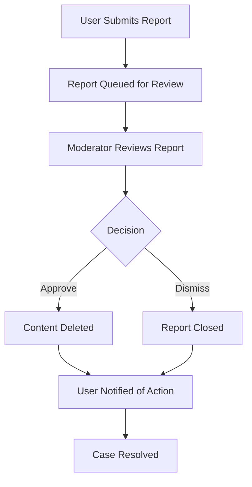

# Reddit-like Community Platform Requirements Specification

## Executive Summary

This document provides comprehensive requirements for a Reddit-like community platform that enables users to create, moderate, and participate in online communities. The platform supports user registration, content creation, voting systems, moderation tools, and community management features.

## User Account Management

### User Registration Process

**WHEN** a new user initiates registration, **THE** system **SHALL** require email address, password, and unique username.

**WHEN** a user submits registration information, **THE** system **SHALL** validate email format, password strength (minimum 8 characters), and username uniqueness.

**WHEN** registration validation fails, **THE** system **SHALL** provide specific error messages indicating which requirements were not met.

**WHEN** registration succeeds, **THE** system **SHALL** send email verification and create a pending user account.

### User Authentication Workflow

**WHEN** a user attempts to log in, **THE** system **SHALL** authenticate using email and password combination.

**WHEN** authentication succeeds, **THE** system **SHALL** create a session token valid for 24 hours.

**WHEN** authentication fails due to incorrect credentials, **THE** system **SHALL** return generic error message without specifying whether email or password was incorrect.

**WHEN** a user exceeds 5 failed login attempts within 15 minutes, **THE** system **SHALL** temporarily lock the account for 30 minutes.

### Password Management

**WHEN** an authenticated user requests password change, **THE** system **SHALL** require current password verification.

**WHEN** password change succeeds, **THE** system **SHALL** invalidate all existing sessions and require re-authentication.

**WHEN** a user forgets their password, **THE** system **SHALL** send password reset link to registered email address.

### Account Deletion Process

**WHEN** a user requests account deletion, **THE** system **SHALL** require password confirmation and display deletion consequences.

**WHEN** account deletion is confirmed, **THE** system **SHALL** permanently remove all user data including posts, comments, and profile information.

**WHEN** account deletion completes, **THE** system **SHALL** send confirmation email and invalidate all active sessions.

## User Profile System

### Profile Structure Requirements

Each user profile **SHALL** contain:
- Display name (editable by user)
- Bio text (maximum 500 characters)
- Avatar image (supports JPEG, PNG, GIF formats up to 2MB)
- Total karma score (read-only)
- Account creation date (read-only)
- Last activity timestamp (read-only)

### Profile Editing Functions

**WHEN** a user edits their profile, **THE** system **SHALL** validate display name length (2-30 characters) and bio length (0-500 characters).

**WHEN** a user uploads an avatar, **THE** system **SHALL** resize image to 256x256 pixels and compress for optimal storage.

**WHEN** profile updates succeed, **THE** system **SHALL** immediately reflect changes across all profile views.

### Profile Viewing Permissions

**WHEN** any user views another user's profile, **THE** system **SHALL** display:
- Display name, bio, and avatar
- Total karma score
- List of all posts created by the user (paginated)
- List of all comments written by the user (paginated)
- Account age and last activity time

**WHEN** viewing own profile, **THE** system **SHALL** provide editing controls and private statistics.

## Karma Scoring System

### Karma Calculation Rules

**WHEN** a post receives an upvote, **THE** system **SHALL** increase author's karma by 1 point.

**WHEN** a post receives a downvote, **THE** system **SHALL** decrease author's karma by 1 point.

**WHEN** a comment receives an upvote, **THE** system **SHALL** increase author's karma by 1 point.

**WHEN** a comment receives a downvote, **THE** system **SHALL** decrease author's karma by 1 point.

**WHEN** a vote is removed, **THE** system **SHALL** adjust karma score accordingly.

### Karma Display Requirements

**WHEN** karma score is displayed, **THE** system **SHALL** show total cumulative score without breakdown.

**WHEN** karma score is negative, **THE** system **SHALL** display with minus sign.

**WHEN** karma calculation occurs, **THE** system **SHALL** ensure atomic operations to prevent race conditions.

## Community Management

### Community Creation Process

**WHEN** an authenticated user creates a community, **THE** system **SHALL** require:
- Unique community name (3-20 characters, alphanumeric and hyphens only)
- Description text (10-500 characters)
- Optional icon image (supports JPEG, PNG formats up to 1MB)

**WHEN** community creation succeeds, **THE** system **SHALL** automatically subscribe the creator and assign owner role.

**WHEN** community name conflicts exist, **THE** system **SHALL** suggest available alternatives.

### Community Structure Requirements

Each community **SHALL** maintain:
- Unique identifier and display name
- Description text
- Icon image URL
- Owner user reference
- Creation timestamp
- Subscriber count
- Post count
- Active moderator list
- Banned user list

### Community Discovery System

**WHEN** users browse communities, **THE** system **SHALL** provide:
- Paginated list of all communities sorted by subscriber count
- Search functionality by community name
- Filter by creation date (new, popular, trending)
- Community statistics (subscriber count, post frequency)

**WHEN** searching communities, **THE** system **SHALL** support partial name matching and return maximum 50 results per page.

## Subscription Management

### Subscription Rules

**WHEN** a user subscribes to a community, **THE** system **SHALL** add community to user's subscription list.

**WHEN** a user unsubscribes from a community, **THE** system **SHALL** remove community from subscription list.

**WHEN** subscription changes occur, **THE** system **SHALL** update subscriber count in real-time.

### Subscription-Based Posting

**WHEN** a user attempts to create a post, **THE** system **SHALL** verify user is subscribed to target community.

**WHEN** subscription requirement is not met, **THE** system **SHALL** prevent post creation and prompt subscription.

**WHEN** viewing subscription list, **THE** system **SHALL** show:
- Community names and icons
- Recent activity indicators
- Unread post counts (if applicable)
- Quick unsubscribe options

## Post Management System

### Post Creation Requirements

**WHEN** creating a post, **THE** system **SHALL** require:
- Title (5-300 characters)
- Post type selection (text, link, or image)
- Community selection (must be subscribed)

**WHEN** post type is text, **THE** system **SHALL** require content text (10-10,000 characters).

**WHEN** post type is link, **THE** system **SHALL** validate URL format and prevent duplicate links.

**WHEN** post type is image, **THE** system **SHALL** support JPEG, PNG, GIF formats up to 10MB.

### Post Editing and Deletion

**WHEN** a user edits their post, **THE** system **SHALL** allow title and content modifications.

**WHEN** post editing occurs, **THE** system **SHALL** maintain edit history with timestamps.

**WHEN** a user deletes their post, **THE** system **SHALL** remove post and all associated comments.

**WHEN** post deletion occurs, **THE** system **SHALL** update community post counts accordingly.

### Post Viewing Requirements

**WHEN** viewing a single post, **THE** system **SHALL** display:
- Complete post title and content
- Author username with profile link
- Community name with community link
- Current vote score
- Total comment count
- Post creation timestamp
- Edit history (if applicable)

## Post Voting System

### Voting Rules Implementation

**WHEN** a user votes on a post, **THE** system **SHALL** enforce one vote per user per post.

**WHEN** upvoting, **THE** system **SHALL** add 1 to post score and author karma.

**WHEN** downvoting, **THE** system **SHALL** subtract 1 from post score and author karma.

**WHEN** changing vote, **THE** system **SHALL** calculate net change and apply accordingly.

**WHEN** removing vote, **THE** system **SHALL** revert previous vote impact.

### Vote Validation

**WHEN** processing votes, **THE** system **SHALL** verify:
- User authentication status
- Post existence and visibility
- User not banned from community
- Vote not already cast (for new votes)

**WHEN** vote validation fails, **THE** system **SHALL** return appropriate error message.

## Feed Management System

### Home Feed Requirements

**WHEN** authenticated user views home feed, **THE** system **SHALL** show posts only from subscribed communities.

**WHEN** home feed is empty, **THE** system **SHALL** suggest popular communities to subscribe.

**WHEN** home feed loads, **THE** system **SHALL** apply user's preferred sorting algorithm.

### Popular Feed Requirements

**WHEN** any user views popular feed, **THE** system **SHALL** show posts from all communities.

**WHEN** popular feed displays to logged-out users, **THE** system **SHALL** exclude NSFW content.

**WHEN** popular feed sorts content, **THE** system **SHALL** use platform-wide engagement metrics.

### Community Feed Requirements

**WHEN** viewing community feed, **THE** system **SHALL** show posts from specific community only.

**WHEN** community feed displays to non-subscribers, **THE** system **SHALL** show all non-restricted content.

**WHEN** community has restricted content, **THE** system **SHALL** require subscription for access.

### Feed Sorting Algorithms

**Hot Algorithm**: **SHALL** prioritize recent posts with high engagement using formula combining time decay and vote velocity.

**New Algorithm**: **SHALL** sort by creation timestamp descending.

**Top Algorithm**: **SHALL** sort by vote score with time filters (today, week, month, year, all time).

**Controversial Algorithm**: **SHALL** prioritize posts with high vote count but score close to zero.

### Feed Pagination

**WHEN** feeds exceed page limit, **THE** system **SHALL** implement cursor-based pagination.

**WHEN** loading next page, **THE** system **SHALL** maintain sorting consistency.

**WHEN** pagination reaches end, **THE** system **SHALL** indicate no more content available.

## Post List Display

### List Item Requirements

Each post in feed lists **SHALL** display:
- Post title (truncated if necessary)
- Author username
- Community name
- Current vote score
- Total comment count
- Relative time since posting
- Content preview based on post type

### Content Previews by Type

**WHEN** post type is text, **THE** system **SHALL** show first 200 characters of content.

**WHEN** post type is image, **THE** system **SHALL** display thumbnail (100x100 pixels).

**WHEN** post type is link, **THE** system **SHALL** show domain name from URL.

### Performance Requirements

**WHEN** loading post lists, **THE** system **SHALL** render within 2 seconds for 50 items.

**WHEN** images load, **THE** system **SHALL** use lazy loading and progressive enhancement.

**WHEN** network conditions are poor, **THE** system **SHALL** provide fallback text content.

## Comment System

### Comment Creation Rules

**WHEN** creating a comment, **THE** system **SHALL** require:
- Content text (1-10,000 characters)
- Parent post reference
- Optional parent comment reference for replies

**WHEN** comment creation succeeds, **THE** system **SHALL** update post comment count.

**WHEN** replying to comment, **THE** system **SHALL** maintain nested thread structure.

### Comment Editing and Deletion

**WHEN** editing comments, **THE** system **SHALL** preserve edit history with timestamps.

**WHEN** deleting comments, **THE** system **SHALL** remove comment and all child replies.

**WHEN** comment moderation occurs, **THE** system **SHALL** maintain audit trails.

### Nested Comment Display

**WHEN** displaying comments, **THE** system **SHALL** support unlimited nesting depth.

**WHEN** comment threads are deep, **THE** system **SHALL** provide collapse/expand functionality.

**WHEN** sorting comments, **THE** system **SHALL** maintain thread relationships.

## Comment Voting System

### Voting Implementation

**WHEN** voting on comments, **THE** system **SHALL** apply same rules as post voting.

**WHEN** comment vote changes, **THE** system **SHALL** update author karma accordingly.

**WHEN** vote conflicts occur, **THE** system **SHALL** resolve with last-action-wins policy.

### Vote Validation

**WHEN** processing comment votes, **THE** system **SHALL** verify:
- Comment visibility and accessibility
- User permissions in community
- Vote integrity constraints

## Comment Sorting Options

### Best Sorting Algorithm

**WHEN** sorting by best, **THE** system **SHALL** use confidence score based on vote ratio and total votes.

### New Sorting Algorithm

**WHEN** sorting by new, **THE** system **SHALL** order by creation timestamp descending.

### Controversial Sorting Algorithm

**WHEN** sorting by controversial, **THE** system **SHALL** prioritize comments with high vote disparity.

## Community Moderation System

### Moderator Hierarchy

**Community Owner**: **SHALL** have ultimate authority including moderator management.

**Moderators**: **SHALL** have content moderation permissions but cannot manage other moderators.

**WHEN** owner adds moderators, **THE** system **SHALL** notify users and log the action.

**WHEN** owner removes moderators, **THE** system **SHALL** revoke permissions immediately.

### Moderator Permissions

**WHEN** moderators perform actions, **THE** system **SHALL** allow:
- Deleting any post in community
- Deleting any comment in community
- Banning users from community
- Unbanning users
- Viewing banned users list
- Processing reports

**WHEN** moderation actions occur, **THE** system **SHALL** maintain comprehensive audit logs.

### User Banning System

**WHEN** banning users, **THE** system **SHALL** prevent banned users from:
- Creating posts in community
- Writing comments in community
- Voting on community content

**WHEN** users are banned, **THE** system **SHALL** allow them to view content read-only.

**WHEN** ban duration expires, **THE** system **SHALL** automatically restore permissions.

## Reporting System

### Report Creation Process

**WHEN** users report content, **THE** system **SHALL** require:
- Reason text (10-500 characters)
- Content reference (post or comment)
- Reporting user authentication

**WHEN** report is submitted, **THE** system **SHALL** notify community moderators.

**WHEN** duplicate reports occur, **THE** system **SHALL** consolidate into single case.

### Moderator Report Review

**WHEN** moderators review reports, **THE** system **SHALL** provide:
- Reported content context
- Reporting user information
- Report reason and timestamp
- Previous report history for same content

**WHEN** moderators approve reports, **THE** system **SHALL** delete reported content.

**WHEN** moderators dismiss reports, **THE** system **SHALL** remove from active queue.

### Report Resolution Workflow

## System Performance Requirements

### Response Time Standards

**WHEN** serving feed content, **THE** system **SHALL** respond within 200ms for cached requests.

**WHEN** processing votes, **THE** system **SHALL** complete within 100ms.

**WHEN** loading user profiles, **THE** system **SHALL** render within 500ms.

### Scalability Targets

**WHEN** under load, **THE** system **SHALL** support:
- 10,000 concurrent users
- 1,000 new posts per minute
- 10,000 votes per minute
- 100,000 comments per hour

### Availability Requirements

**WHEN** operational, **THE** system **SHALL** maintain 99.9% uptime.

**WHEN** failures occur, **THE** system **SHALL** provide graceful degradation.

## Data Retention Policies

### Content Retention

User-generated content **SHALL** be retained indefinitely unless deleted by user or moderation.

Edit history **SHALL** be maintained for 90 days after content deletion.

Audit logs **SHALL** be retained for 365 days.

### Privacy Compliance

**WHEN** handling user data, **THE** system **SHALL** comply with GDPR and CCPA requirements.

**WHEN** users request data export, **THE** system **SHALL** provide complete data within 30 days.

**WHEN** account deletion occurs, **THE** system **SHALL** permanently erase all personal data.

## Error Handling Requirements

### User-Facing Errors

**WHEN** errors occur, **THE** system **SHALL** provide clear, actionable error messages.

**WHEN** validation fails, **THE** system **SHALL** indicate specific field requirements.

**WHEN** permission errors occur, **THE** system **SHALL** explain required permissions.

### System Errors

**WHEN** system failures occur, **THE** system **SHALL** maintain service degradation rather than complete outage.

**WHEN** database errors occur, **THE** system **SHALL** retry with exponential backoff.

**WHEN** critical failures occur, **THE** system **SHALL** alert administrators immediately.

## Security Requirements

### Authentication Security

**WHEN** storing passwords, **THE** system **SHALL** use bcrypt hashing with work factor 12.

**WHEN** transmitting sensitive data, **THE** system **SHALL** use TLS 1.3 encryption.

**WHEN** session management, **THE** system **SHALL** implement CSRF protection.

### Content Security

**WHEN** processing user content, **THE** system **SHALL** sanitize HTML to prevent XSS attacks.

**WHEN** handling file uploads, **THE** system **SHALL** validate file types and scan for malware.

**WHEN** storing images, **THE** system **SHALL** use secure CDN with access controls.

## Monitoring and Analytics

### Performance Monitoring

**WHEN** operational, **THE** system **SHALL** track:
- Response times by endpoint
- Error rates and types
- User engagement metrics
- System resource utilization

### Business Metrics

**WHEN** reporting, **THE** system **SHALL** provide:
- Daily active users
- Content creation rates
- Community growth metrics
- User retention statistics

### Moderation Metrics

**WHEN** analyzing moderation, **THE** system **SHALL** track:
- Report response times
- Moderation action rates
- User satisfaction scores
- Content quality trends

This requirements specification provides comprehensive guidance for developing a Reddit-like community platform with robust features for user engagement, content management, and community moderation.