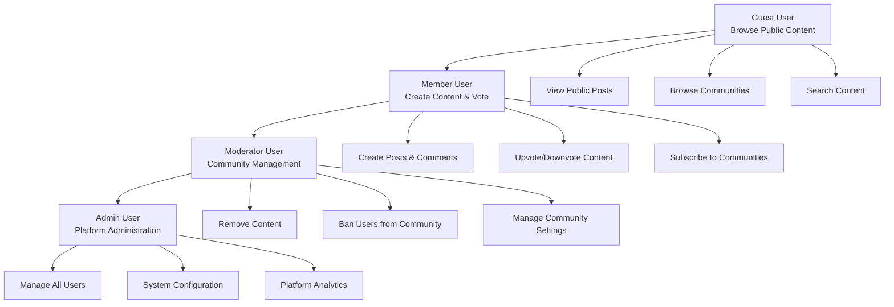
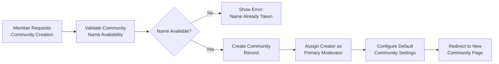
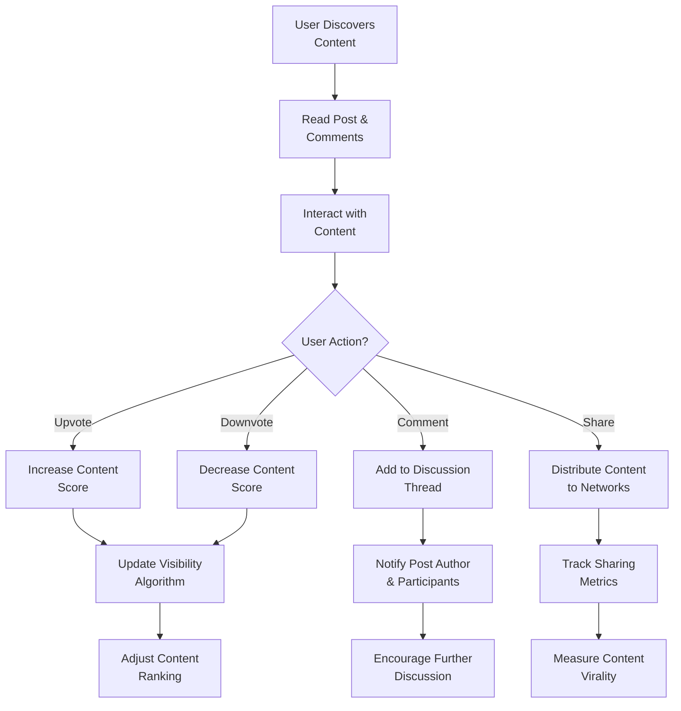

# Community Platform Service Overview

## Executive Summary

The Community Platform is a Reddit-like online community service designed to facilitate meaningful discussions, content sharing, and community building across diverse interest groups. This platform addresses the growing need for specialized, moderated online spaces where users can engage in authentic conversations, discover relevant content, and connect with like-minded individuals.

**Core Mission**: To create the most engaging and user-friendly community platform that empowers users to share knowledge, build communities, and participate in meaningful discussions across any topic of interest.

**Platform Vision**: THE platform SHALL provide a democratic content curation environment where community voting determines content visibility, while maintaining robust moderation tools to ensure platform integrity and user safety.

## Business Model

### Revenue Strategy
The platform employs a multi-tiered revenue model focused on sustainable growth and user value:

**Primary Revenue Streams**:
- **Premium Memberships**: Enhanced features for power users including advanced analytics, custom communities, and priority support
- **Targeted Advertising**: Non-intrusive, community-relevant advertising based on user interests and engagement patterns
- **Community Sponsorships**: Brands can sponsor specific communities with transparent, value-added partnerships
- **API Access Fees**: Commercial access to platform data and integration capabilities

**Secondary Revenue Opportunities**:
- **Content Syndication**: Licensing high-quality community content to media outlets
- **Premium Moderation Tools**: Advanced tools for community moderators managing large communities
- **White-label Solutions**: Enterprise-grade community platforms for businesses

### Value Exchange Proposition
The platform operates on a value-first approach where:
- **Free users** receive comprehensive access to core features
- **Premium features** enhance but don't restrict the core experience
- **Advertising** remains relevant and non-disruptive to user engagement
- **Community sponsorships** provide genuine value to both sponsors and community members

**Business Rule Requirements**:
- WHEN a user signs up for premium membership, THE system SHALL provide immediate access to enhanced features
- WHERE advertising is displayed, THE system SHALL ensure it remains non-intrusive and community-relevant
- IF community sponsorship occurs, THEN THE sponsorship SHALL be transparently disclosed to community members

## Target Market Analysis

### Primary User Segments

**Content Creators & Experts** (25-45 age group):
- Professionals seeking to share knowledge and build reputation
- Industry experts establishing thought leadership
- Hobbyists passionate about specific topics

**Community Seekers** (18-35 age group):
- Individuals looking for niche communities and meaningful connections
- Students and young professionals seeking knowledge sharing
- People with specialized interests not served by mainstream platforms

**Brands & Organizations** (B2B segment):
- Companies seeking authentic engagement with their audiences
- Non-profits building supporter communities
- Educational institutions fostering student discussions

### Market Opportunity
- **Global online community market**: Estimated $15B+ with 15% annual growth
- **Niche community gap**: Existing platforms often too broad or too restrictive
- **Mobile-first engagement**: Increasing demand for mobile-optimized community experiences
- **Professional community growth**: Rise of professional knowledge-sharing platforms

**Market Penetration Strategy**:
- WHEN launching the platform, THE company SHALL focus on underserved niche communities
- WHERE market opportunities exist, THE platform SHALL prioritize communities with high engagement potential
- IF user growth targets are met, THEN THE platform SHALL expand to broader community categories

## Core Value Proposition

### For Users
- **Authentic Engagement**: Algorithm-free content discovery based on community voting
- **Specialized Communities**: Deep, focused discussions without mainstream noise
- **User Empowerment**: Democratic content moderation through community voting
- **Knowledge Preservation**: Structured content organization and search capabilities
- **Cross-Community Discovery**: Intelligent recommendations across related communities

### For Community Builders
- **Flexible Moderation Tools**: Customizable community guidelines and moderation workflows
- **Growth Analytics**: Insights into community health and member engagement
- **Monetization Support**: Tools for community-led revenue generation
- **Content Management**: Advanced tools for organizing and showcasing community content

### For Advertisers & Sponsors
- **Targeted Reach**: Precise audience targeting based on interests and engagement
- **Authentic Context**: Brand integration within relevant community discussions
- **Measurable Impact**: Clear analytics on engagement and conversion metrics

**Value Delivery Requirements**:
- WHEN a user joins the platform, THE system SHALL provide immediate access to core community features
- WHERE community builders need moderation tools, THE system SHALL offer comprehensive moderation capabilities
- IF advertisers seek targeted audiences, THEN THE platform SHALL provide precise targeting options based on community interests

## Competitive Landscape

### Direct Competitors
- **Reddit**: Established but often overwhelming for niche communities
- **Discord**: Real-time focused, less structured for content discovery
- **Facebook Groups**: Privacy concerns and algorithm-driven content
- **Stack Exchange**: Highly specialized but limited to Q&A format

### Competitive Advantages

**User Experience Differentiation**:
- **Intuitive Interface**: Clean, modern design optimized for content discovery
- **Mobile Excellence**: Superior mobile experience compared to competitors
- **Accessibility Focus**: Commitment to inclusive design and accessibility standards

**Technical Innovation**:
- **Advanced Search**: Semantic search understanding context and relationships
- **Smart Recommendations**: AI-powered content discovery across communities
- **Real-time Features**: Live discussions and instant updates without compromising structure

**Community-First Approach**:
- **Moderator Empowerment**: Better tools and support for community leaders
- **Transparent Governance**: Clear policies and community input mechanisms
- **Sustainable Growth**: Focus on community health over rapid expansion

**Competitive Positioning Requirements**:
- WHEN competing with established platforms, THE service SHALL emphasize niche community specialization
- WHERE user experience differs, THE platform SHALL highlight superior mobile optimization and accessibility
- IF feature comparisons occur, THEN THE service SHALL demonstrate advanced moderation tools and community empowerment

## Vision and Goals

### Short-Term Goals (0-12 months)
- **Launch MVP**: Core community features with 50+ active communities
- **User Acquisition**: Reach 100,000 registered users with 25% monthly active rate
- **Community Diversity**: Establish communities across 20+ major interest categories
- **Mobile App Launch**: Full-featured iOS and Android applications

### Medium-Term Goals (1-3 years)
- **Platform Maturity**: Advanced features including live events and premium tools
- **User Growth**: Expand to 1 million active users with strong retention metrics
- **Monetization Scale**: Achieve sustainable revenue covering operational costs
- **International Expansion**: Support for multiple languages and regional communities

### Long-Term Vision (3-5 years)
- **Market Leadership**: Become the go-to platform for specialized online communities
- **Ecosystem Development**: Third-party developer ecosystem with API integrations
- **AI Enhancement**: Advanced AI features for content moderation and discovery
- **Global Community**: Support for diverse cultures and languages worldwide

**Goal Achievement Requirements**:
- WHEN launching the MVP, THE platform SHALL include core community creation and content sharing features
- WHERE user growth targets are set, THE system SHALL track acquisition metrics against established benchmarks
- IF international expansion occurs, THEN THE platform SHALL support multiple language interfaces and regional community features

## Success Metrics

### Key Performance Indicators

**User Engagement Metrics**:
- **Monthly Active Users (MAU)**: Target 1M within 3 years
- **Daily Active Users (DAU)**: Target 30% of MAU as daily active
- **User Retention**: 70% month-over-month retention for registered users
- **Content Creation**: Average 5 posts per active user monthly

**Community Health Metrics**:
- **Community Growth**: 20% month-over-month growth in active communities
- **Moderator Satisfaction**: 90%+ satisfaction rate among community moderators
- **Content Quality**: 95%+ of content meeting community guidelines
- **Response Time**: Average 2-hour response time for support requests

**Business Metrics**:
- **Revenue Growth**: 50% quarter-over-quarter revenue growth
- **Customer Acquisition Cost**: Maintain below $5 per registered user
- **Lifetime Value**: Average user LTV of $50+
- **Profitability**: Achieve operational profitability within 24 months

### Measurement Framework

**Weekly Monitoring**:
- User registration and activation rates
- Community creation and growth metrics
- Content engagement and quality indicators

**Monthly Reporting**:
- Financial performance against projections
- User retention and satisfaction scores
- Platform performance and reliability metrics

**Quarterly Reviews**:
- Strategic goal achievement assessment
- Competitive positioning analysis
- Product roadmap adjustments based on metrics

**Metric Tracking Requirements**:
- WHEN user engagement metrics are collected, THE system SHALL provide real-time dashboard visibility
- WHERE business metrics require calculation, THE platform SHALL maintain accurate financial tracking
- IF performance benchmarks are not met, THEN THE company SHALL implement corrective action plans

## Strategic Positioning

The Community Platform positions itself as the **premier destination for authentic online communities** by focusing on:

**Quality over Quantity**: Prioritizing meaningful engagement over sheer user numbers
**Community Empowerment**: Giving communities control over their space and rules
**Technical Excellence**: Building the most reliable and feature-rich platform
**Sustainable Growth**: Balancing user needs with business requirements

**Strategic Implementation Requirements**:
- WHEN making platform decisions, THE company SHALL prioritize community quality over rapid user acquisition
- WHERE technical features are developed, THE platform SHALL focus on reliability and user experience
- IF growth opportunities arise, THEN THE company SHALL evaluate them against sustainable community development principles

This strategic approach ensures the platform remains true to its core mission while building a sustainable business that serves users, community builders, and stakeholders effectively.

## User Authentication and Authorization Framework

### Authentication System Overview
The platform implements a comprehensive JWT-based authentication system supporting four distinct user roles with granular permissions:



### Permission Hierarchy Implementation
**Guest User Requirements**:
- WHEN a guest user accesses the platform, THE system SHALL allow browsing of public content without authentication
- WHERE guest users attempt restricted actions, THE system SHALL prompt for registration or login

**Member User Requirements**:
- WHEN a member registers successfully, THE system SHALL provide immediate access to content creation features
- IF email verification is required, THEN THE system SHALL restrict certain actions until verification is complete

**Moderator User Requirements**:
- WHERE a user becomes a community moderator, THE system SHALL grant community-specific moderation permissions
- WHEN moderation actions are taken, THE system SHALL maintain comprehensive audit logs

**Admin User Requirements**:
- IF administrative functions are accessed, THEN THE system SHALL require enhanced security verification
- WHERE platform-wide changes are made, THE system SHALL notify affected users appropriately

## Business Process Documentation

### Community Creation Process


**Community Creation Requirements**:
- WHEN a member creates a community, THE system SHALL validate the community name for uniqueness and appropriateness
- IF community creation succeeds, THEN THE creator SHALL automatically receive moderator privileges
- WHERE community settings are configured, THE system SHALL apply reasonable defaults for new communities

### Content Submission Workflow
```mermaid
graph LR
    A["Member Selects<br/>Target Community"] --> B["Choose Post Type<br/>(Text, Link, Media)"]
    B --> C["Enter Post Content<br/>& Metadata"]
    C --> D["Validate Against<br/>Community Rules"]
    D --> E{"Validation<br/>Passed?"}
    E -->|"No"| F["Show Specific<br/>Error Message"]
    E -->|"Yes"| G["Submit for<br/>Moderation Review"]
    G --> H{"Moderation<br/>Required?"}
    H -->|"No"| I["Publish Immediately<br/>to Community Feed"]
    H -->|"Yes"| J["Add to Moderation<br/>Queue"]
    I --> K["Notify Subscribers<br/>& Update Feeds"]
    J --> L["Show "Pending<br/>Approval" Status"]
```

**Content Submission Requirements**:
- WHEN a member submits content, THE system SHALL validate it against community-specific rules
- IF content requires moderation, THEN THE system SHALL place it in a moderation queue for review
- WHERE content is published successfully, THE system SHALL notify community subscribers appropriately

### User Engagement Flow


**Engagement Requirements**:
- WHEN users interact with content, THE system SHALL provide immediate feedback on their actions
- WHERE voting occurs, THE system SHALL update content scores in real-time
- IF comments are added, THEN THE system SHALL maintain proper threading and notification systems

This enhanced service overview provides comprehensive business requirements for the Reddit-like community platform, ensuring all stakeholders have clear understanding of the platform's objectives, features, and success metrics. The document focuses on natural language business requirements while avoiding technical implementation details, making it suitable for business stakeholders, investors, and executive leadership.