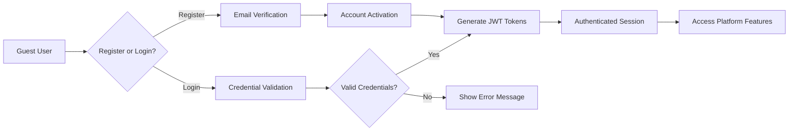

# User Actors and Authentication Requirements

## Introduction and Overview

This document defines the complete authentication and authorization framework for the Reddit-like community platform. It establishes the user actor hierarchy, authentication flows, permission structures, and security requirements necessary for implementing a robust and scalable user management system.

## User Actor Definitions

### Guest User
Unauthenticated users who can browse public content and access limited platform features.

**Business Role**: Temporary visitors exploring the platform without commitment
**Key Characteristics**:
- Can view public communities and content
- Can register to become members
- Cannot create content or interact with existing content
- Limited to read-only access

### Member User
Authenticated users who actively participate in the community ecosystem.

**Business Role**: Core platform participants who create and consume content
**Key Characteristics**:
- Can create posts and comments
- Can vote on content
- Can subscribe to communities
- Can manage their profile and karma
- Can report inappropriate content

### Moderator User
Community moderators responsible for content quality and community guidelines.

**Business Role**: Community leaders who maintain content standards
**Key Characteristics**:
- All member permissions plus moderation capabilities
- Can moderate content within assigned communities
- Can handle user reports
- Can enforce community rules
- Can manage community settings

### Administrator User
System administrators with platform-wide management capabilities.

**Business Role**: Platform operators who ensure system integrity
**Key Characteristics**:
- All moderator permissions plus administrative capabilities
- Can manage users and communities
- Can handle escalated reports
- Can configure system settings
- Can access platform analytics

## Authentication Requirements

### Core Authentication Functions

**User Registration**
WHEN a guest attempts to register, THE system SHALL validate email uniqueness and password strength
THE registration process SHALL require email verification before account activation
THE system SHALL send a verification email with a secure confirmation link

**User Login**
WHEN a user provides valid credentials, THE system SHALL authenticate and create a secure session
THE login process SHALL validate credentials against stored hashed passwords
IF login attempts exceed 5 failures within 15 minutes, THE system SHALL temporarily lock the account

**Session Management**
THE system SHALL maintain user sessions using JWT tokens
THE access token SHALL expire after 30 minutes of inactivity
THE refresh token SHALL expire after 30 days of inactivity
WHEN a user logs out, THE system SHALL invalidate all active tokens

**Password Security**
THE password reset process SHALL require email verification
THE system SHALL enforce password complexity requirements (minimum 8 characters with mixed case and numbers)
THE system SHALL store passwords using bcrypt hashing with salt

### Authentication Flow Requirements



### Password Recovery Process
WHEN a user requests password recovery, THE system SHALL send a secure reset link to the registered email
THE password reset link SHALL expire after 1 hour for security
IF the reset link is used successfully, THE system SHALL require the user to set a new password
AFTER password reset, THE system SHALL invalidate all existing user sessions

### Account Security Features
THE system SHALL implement account lockout after 5 consecutive failed login attempts
WHEN an account is locked, THE system SHALL automatically unlock it after 30 minutes
THE system SHALL notify users via email when suspicious login activity is detected
WHERE multi-factor authentication is enabled, THE system SHALL require secondary verification

## Permission Matrix

### Comprehensive Action-Based Permissions

| Action | Guest | Member | Moderator | Administrator |
|--------|-------|--------|-----------|---------------|
| Browse public content | ✅ | ✅ | ✅ | ✅ |
| Register account | ✅ | ❌ | ❌ | ❌ |
| Login to account | ✅ | ✅ | ✅ | ✅ |
| Create posts | ❌ | ✅ | ✅ | ✅ |
| Edit own posts | ❌ | ✅ | ✅ | ✅ |
| Delete own posts | ❌ | ✅ | ✅ | ✅ |
| Create comments | ❌ | ✅ | ✅ | ✅ |
| Edit own comments | ❌ | ✅ | ✅ | ✅ |
| Delete own comments | ❌ | ✅ | ✅ | ✅ |
| Upvote/downvote content | ❌ | ✅ | ✅ | ✅ |
| Subscribe to communities | ❌ | ✅ | ✅ | ✅ |
| Create communities | ❌ | ✅ | ✅ | ✅ |
| Moderate community content | ❌ | ❌ | ✅ | ✅ |
| Manage community settings | ❌ | ❌ | ✅ | ✅ |
| Report inappropriate content | ❌ | ✅ | ✅ | ✅ |
| Handle user reports | ❌ | ❌ | ✅ | ✅ |
| Manage system users | ❌ | ❌ | ❌ | ✅ |
| Configure platform settings | ❌ | ❌ | ❌ | ✅ |
| Access system analytics | ❌ | ❌ | ❌ | ✅ |

### Community-Specific Permissions

**Community Creation**
WHEN a member creates a community, THE system SHALL assign them as the community moderator
THE community creator SHALL have full moderation rights within their community

**Community Membership**
WHERE a user subscribes to a community, THE system SHALL provide access to community-specific features
WHILE a user is subscribed to a community, THE system SHALL include community content in their feed

### Permission Inheritance Rules
WHEN a user is promoted to moderator, THE system SHALL automatically grant all moderator permissions
IF a moderator is demoted to member, THE system SHALL revoke moderation privileges
WHERE administrative permissions are assigned, THE system SHALL maintain audit trails of privilege changes

## Security Requirements

### Data Protection
THE system SHALL encrypt all sensitive user data at rest
THE system SHALL use HTTPS for all data transmission
THE system SHALL never store plain-text passwords
THE system SHALL implement secure password hashing with salt and pepper

### Access Controls
THE system SHALL validate user permissions for every protected action
WHERE content requires specific permissions, THE system SHALL verify authorization before access
IF unauthorized access is attempted, THE system SHALL log the event and deny access
THE system SHALL implement principle of least privilege for all user roles

### Audit Requirements
THE system SHALL log all authentication attempts
THE system SHALL record significant user actions for audit purposes
THE system SHALL maintain audit logs for 90 days minimum
THE system SHALL provide audit trail search capabilities for security investigations

### Security Monitoring
THE system SHALL monitor for suspicious authentication patterns
WHEN brute force attacks are detected, THE system SHALL implement IP-based rate limiting
WHERE account compromise is suspected, THE system SHALL force password reset and session termination
THE system SHALL generate security alerts for unusual authentication activities

## Token Management (JWT Implementation)

### Token Structure Requirements

**JWT Payload Structure**
```json
{
  "userId": "unique-user-identifier",
  "role": "member|moderator|admin",
  "permissions": ["permission1", "permission2", ...],
  "communities": ["communityId1", "communityId2", ...],
  "iat": "issued-at-timestamp",
  "exp": "expiration-timestamp"
}
```

**Access Token Specifications**
THE access token SHALL expire after 30 minutes
THE access token SHALL contain user role and permissions
THE system SHALL validate token signature on each API request
THE access token SHALL be transmitted securely via HTTP-only cookies

**Refresh Token Specifications**
THE refresh token SHALL expire after 30 days
THE refresh token SHALL be stored securely with user association
WHEN refreshing tokens, THE system SHALL validate the refresh token and issue new access token
THE refresh token SHALL be invalidated after use to prevent replay attacks

### Token Expiration Policies

**Normal Operation**
WHEN an access token expires, THE system SHALL require token refresh
IF a refresh token is valid, THE system SHALL issue a new access token
IF both tokens are expired, THE system SHALL require re-authentication

**Security Scenarios**
IF suspicious activity is detected, THE system SHALL revoke all user tokens
WHEN a user changes their password, THE system SHALL invalidate all existing tokens
WHERE account compromise is suspected, THE system SHALL force re-authentication
THE system SHALL implement token blacklisting for revoked tokens

### Token Storage Strategy
THE system SHALL store refresh tokens in a secure database
THE system SHALL use httpOnly cookies for token transmission when possible
THE system SHALL implement token blacklisting for revoked tokens
THE system SHALL secure token storage against common web vulnerabilities

## Error Handling and User Experience

### Authentication Errors
IF invalid credentials are provided, THE system SHALL return appropriate error messages
WHEN account is locked, THE system SHALL inform the user of lockout duration
IF email verification fails, THE system SHALL provide clear instructions for resolution
WHERE authentication service is unavailable, THE system SHALL provide graceful degradation

### Permission Errors
WHERE unauthorized access is attempted, THE system SHALL show appropriate permission denied messages
WHEN community-specific permissions are required, THE system SHALL guide users to subscription options
IF moderation actions fail, THE system SHALL log the error and notify the user
THE system SHALL provide helpful error messages without revealing sensitive system information

### Recovery Processes
THE password reset process SHALL be straightforward and secure
WHEN account recovery is needed, THE system SHALL provide multiple verification options
IF token refresh fails, THE system SHALL guide users through re-authentication
THE system SHALL provide account recovery options for lost email access

### User Communication
THE system SHALL notify users of security-related events via email
WHEN login attempts are made from new devices, THE system SHALL send security alerts
WHERE account changes occur, THE system SHALL provide confirmation messages
THE system SHALL maintain clear communication during security incidents

## Integration Requirements

### User Profile Integration
THE authentication system SHALL provide user data to the profile management system
WHEN user roles change, THE system SHALL update permissions across all services
THE authentication system SHALL synchronize user status with profile visibility settings

### Community System Integration
THE permission system SHALL validate community-specific access rights
WHERE community moderation is required, THE system SHALL verify moderator status
THE authentication system SHALL provide community membership information to content systems

### Content Management Integration
THE authorization system SHALL control content creation and modification permissions
WHEN content reporting occurs, THE system SHALL verify reporter authenticity
THE authentication system SHALL integrate with content moderation workflows

### Notification System Integration
THE authentication system SHALL trigger security notifications for suspicious activities
WHEN user sessions expire, THE system SHALL notify users appropriately
THE system SHALL integrate authentication events with platform notification systems

## Performance Requirements

### Authentication Performance
WHEN users attempt to login, THE system SHALL authenticate within 500 milliseconds
THE token validation process SHALL complete within 100 milliseconds
THE user session creation SHALL occur within 200 milliseconds
WHERE high-volume authentication occurs, THE system SHALL maintain performance standards

### Scalability Requirements
THE authentication system SHALL support 10,000 concurrent user sessions
THE system SHALL handle 1,000 authentication requests per minute during peak loads
WHERE user base grows, THE authentication system SHALL scale horizontally
THE token management system SHALL maintain performance under heavy load

### Availability Requirements
THE authentication service SHALL maintain 99.9% uptime
WHERE service disruptions occur, THE system SHALL provide graceful degradation
THE authentication system SHALL implement redundancy and failover mechanisms
WHEN primary authentication services fail, THE system SHALL switch to backup systems

## Compliance and Regulatory Requirements

### Data Privacy Compliance
THE system SHALL comply with GDPR requirements for European users
WHERE personal data is processed, THE system SHALL implement data minimization
THE authentication system SHALL support user data portability requests
WHEN users request account deletion, THE system SHALL remove authentication data

### Security Standards Compliance
THE system SHALL implement OWASP security guidelines
WHERE industry standards apply, THE system SHALL comply with relevant security frameworks
THE authentication system SHALL undergo regular security audits and penetration testing

### Accessibility Requirements
THE authentication interface SHALL comply with WCAG 2.1 accessibility standards
WHERE users require accessibility accommodations, THE system SHALL provide alternative authentication methods
THE authentication system SHALL support screen readers and keyboard navigation

## Implementation Guidelines

### Development Standards
THE authentication implementation SHALL follow secure coding practices
WHERE third-party libraries are used, THE system SHALL use reputable, well-maintained components
THE authentication code SHALL undergo code review and security analysis

### Testing Requirements
THE authentication system SHALL undergo comprehensive security testing
WHERE authentication flows exist, THE system SHALL implement unit and integration tests
THE authentication implementation SHALL include penetration testing and vulnerability assessment

### Monitoring and Maintenance
THE authentication system SHALL include comprehensive logging and monitoring
WHERE security events occur, THE system SHALL generate alerts for immediate response
THE authentication implementation SHALL include regular security updates and maintenance

> *Developer Note: This document defines **business requirements only**. All technical implementations (architecture, APIs, database design, etc.) are at the discretion of the development team.*